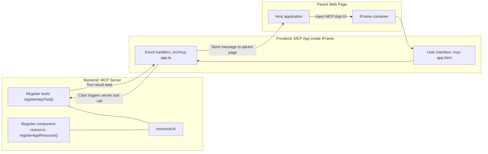
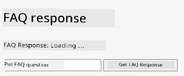
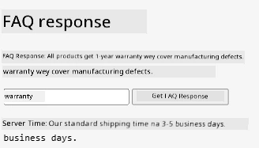
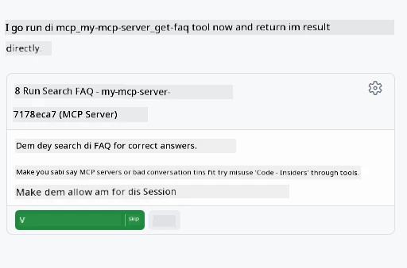
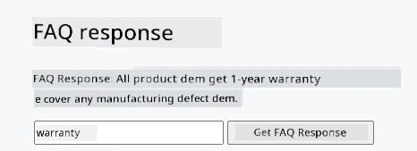

# MCP Apps

MCP Apps na new way we dey do tins for MCP. The idea be say, no be only say you go respond with data wey dey come from tool call, but you go still provide info on how person suppose take dey interact with the info. That one mean say tool results fit get UI info inside. Why we go want dat one? Well, make you think how you dey do tins today. You likely dey use the result wey MCP Server give by putting one kain frontend upfront, na code you go write and still maintain be dat. Sometimes na wetin you want be dat, but other times e go beta if you fit just bring one small info wey get everything inside from data to user interface.

## Overview

Dis lesson go give you practical guide on MCP Apps, how to start with am and how to join am with your existing Web Apps. MCP Apps na fresh new addition to MCP Standard.

## Learning Objectives

By the end of dis lesson, you go fit:

- Explain wetin MCP Apps be.
- When to use MCP Apps.
- Build and join your own MCP Apps.

## MCP Apps - how e dey work

The idea for MCP Apps na to provide answer wey basically be component wey person go fit render. Such component fit get visuals and interactivity too, like button clicks, user input and more. Make we start with the server side and our MCP Server. To create MCP App component you need two: create tool and still the application resource. These two parts na resourceUri connect dem.

See example:

Make we try talk about the tins we dey do and how each part dey work:

```text
server.ts -- responsible for registering tools and the component as a UI component
src/
  mcp-app.ts -- wiring up event handlers
mcp-app.html -- the user interface
```

Dis picture dey show the architecture to take create component and the logic behind am.


Make we talk about the responsibility for backend and frontend.

### The backend

Two tins we need to do here:

- Register tools we want make dem interact with.
- Define the component.

**Register the tool**

```typescript
registerAppTool(
    server,
    "get-time",
    {
      title: "Get Time",
      description: "Returns the current server time.",
      inputSchema: {},
      _meta: { ui: { resourceUri } }, // Connect dis tool to im UI resource
    },
    async () => {
      const time = new Date().toISOString();
      return { content: [{ type: "text", text: time }] };
    },
  );

```

The code wey dey before show the behavior, where e expose tool wey dem call `get-time`. E no need input but e go produce current time. We fit still define `inputSchema` for tools wey need user input.

**Register the component**

For same file, we need also register the component:

```typescript
const resourceUri = "ui://get-time/mcp-app.html";

// Make you register the resource, wey go return di bundled HTML/JavaScript for di UI.
registerAppResource(
  server,
  resourceUri,
  resourceUri,
  { mimeType: RESOURCE_MIME_TYPE },
  async () => {
    const html = await fs.readFile(path.join(DIST_DIR, "mcp-app.html"), "utf-8");

    return {
    contents: [
        { uri: resourceUri, mimeType: RESOURCE_MIME_TYPE, text: html },
    ],
    };
  },
);
```

You fit notice say we mention `resourceUri` to connect component with tools. Another important tin na the callback where we load the UI file and return the component.

### The component frontend

Just like backend, two parts dey here:

- Frontend wey pure HTML dey write.
- Code wey handle events and wetin to do, like calling tools or messaging the parent window.

**User interface**

Make we look user interface.

```html
<!-- mcp-app.html -->
<!DOCTYPE html>
<html lang="en">
  <head>
    <meta charset="UTF-8" />
    <title>Get Time App</title>
  </head>
  <body>
    <p>
      <strong>Server Time:</strong> <code id="server-time">Loading...</code>
    </p>
    <button id="get-time-btn">Get Server Time</button>
    <script type="module" src="/src/mcp-app.ts"></script>
  </body>
</html>
```

**Event wireup**

Last part na event wireup. That one mean say we go find which part for UI wey need event handlers and wetin to do if events happen:

```typescript
// mcp-app.ts

import { App } from "@modelcontextprotocol/ext-apps";

// Get element reference dem
const serverTimeEl = document.getElementById("server-time")!;
const getTimeBtn = document.getElementById("get-time-btn")!;

// Make app instance
const app = new App({ name: "Get Time App", version: "1.0.0" });

// Handle tool result dem from di server. Set am before `app.connect()` make e no
// miss di first tool result.
app.ontoolresult = (result) => {
  const time = result.content?.find((c) => c.type === "text")?.text;
  serverTimeEl.textContent = time ?? "[ERROR]";
};

// Wire up button click
getTimeBtn.addEventListener("click", async () => {
  // `app.callServerTool()` dey make UI fit request fresh data from di server
  const result = await app.callServerTool({ name: "get-time", arguments: {} });
  const time = result.content?.find((c) => c.type === "text")?.text;
  serverTimeEl.textContent = time ?? "[ERROR]";
});

// Connect to host
app.connect();
```

As you fit see for top, na normal code to hook DOM elements to events. One important tin na the call to `callServerTool` wey go call tool for backend.

## How to handle user input

So far, we see component wey get button wey when you click e call tool. Make we see if we fit add more UI tins like input field and try send arguments to tool. Make we do FAQ functionality. How e go work:

- Suppose get button and input element where user go type keyword like "Shipping" to search. This one go call backend tool wey go search FAQ data.
- Tool wey fit run the FAQ search.

Make we add support for backend first:

```typescript
const faq: { [key: string]: string } = {
    "shipping": "Our standard shipping time is 3-5 business days.",
    "return policy": "You can return any item within 30 days of purchase.",
    "warranty": "All products come with a 1-year warranty covering manufacturing defects.",
  }

registerAppTool(
    server,
    "get-faq",
    {
      title: "Search FAQ",
      description: "Searches the FAQ for relevant answers.",
      inputSchema: zod.object({
        query: zod.string().default("shipping"),
      }),
      _meta: { ui: { resourceUri: faqResourceUri } }, // Connect dis tool to im UI resource
    },
    async ({ query }) => {
      const answer: string = faq[query.toLowerCase()] || "Sorry, I don't have an answer for that.";
      return { content: [{ type: "text", text: answer }] };
    },
  );
```

Wet we dey see here na how we dey fill `inputSchema` and give am `zod` schema:

```typescript
inputSchema: zod.object({
  query: zod.string().default("shipping"),
})
```

For top schema we talk say input parameter dey wey dem call `query` and e be optional with default value "shipping".

Ok, now make we waka go *mcp-app.html* to see the UI wey we need create:

```html
<div class="faq">
    <h1>FAQ response</h1>
    <p>FAQ Response: <code id="faq-response">Loading...</code></p>
    <input type="text" id="faq-query" placeholder="Enter FAQ query" />
    <button id="get-faq-btn">Get FAQ Response</button>
  </div>
```

Great, now we get input element and button. Make we waka go *mcp-app.ts* to wire up these events:

```typescript
const getFaqBtn = document.getElementById("get-faq-btn")!;
const faqQueryInput = document.getElementById("faq-query") as HTMLInputElement;

getFaqBtn.addEventListener("click", async () => {
  const query = faqQueryInput.value;
  const result = await app.callServerTool({ name: "get-faq", arguments: { query } });
  const faq = result.content?.find((c) => c.type === "text")?.text;
  faqResponseEl.textContent = faq ?? "[ERROR]";
});
```

For code wey dey top we:

- Create references to the UI elements wey interesting.
- Handle button click, parse input element value and call `app.callServerTool()` with `name` and `arguments` where the `arguments` pass `query` as value.

Wetin actually dey happen when you call `callServerTool` be say e send message to the parent window and that window go call MCP Server.

### Try am

If you try am, you suppose see this:



And here we try am with input "warranty"



To run this code, go [Code section](./code/README.md)

## Testing for Visual Studio Code

Visual Studio Code get beta support for MVP Apps and e be one of the easiest way to test your MCP Apps. To use Visual Studio Code, add server entry to *mcp.json* like this:

```json
"my-mcp-server-7178eca7": {
    "url": "http://localhost:3001/mcp",
    "type": "http"
  }
```

Then start the server, you go fit dey communicate with your MVP App through Chat Window if you get GitHub Copilot installed.

Via prompt, for example "#get-faq":



And just like when you run am for web browser, e show the same way:



## Assignment

Make you create rock paper scissor game. E suppose get these:

UI:

- drop down list with options
- button to submit choice
- label to show who pick which option and who win

Server:

- tool rock paper scissor wey go take "choice" as input. E go also render computer choice and declare winner

## Solution

[Solution](./assignment/README.md)

## Summary

We don learn about this new MCP Apps paradigm. E be new paradigm wey let MCP Servers talk not only about the data but how to present the data.

Also, we learn say MCP Apps dey hosted inside IFrame and to talk to MCP Servers, dem need send messages to the parent web app. Plenty libraries dey for both JavaScript and React to make this communication easy.

## Key Takeaways

Wet you learn be this:

- MCP Apps na new standard wey fit help when you want send both data and UI features.
- This kind apps dey run inside IFrame for security reasons.

## Wet Next

- [Chapter 4](../../04-PracticalImplementation/README.md)

---

<!-- CO-OP TRANSLATOR DISCLAIMER START -->
**Disclaimer**:
Dis document don translate wit AI translation service [Co-op Translator](https://github.com/Azure/co-op-translator). Even tho we dey try make am correct, abeg sabi say automated translation fit get some mistakes or yawa. Di original document for dia own language na di correct one wey suppose get priority. If na serious matter, make person use professional human translation. We no carry any wahala or misunderstanding wey fit happen because of dis translation.
<!-- CO-OP TRANSLATOR DISCLAIMER END -->