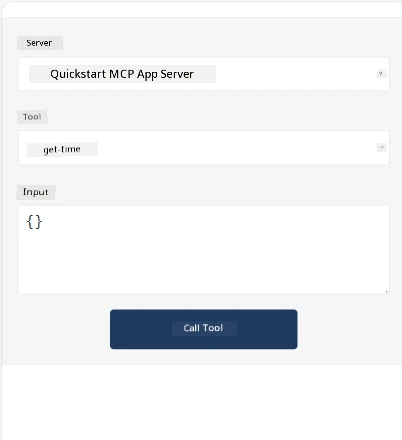
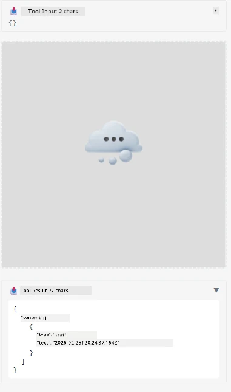

Here's a sample wey dey show how MCP App dey work

## Install 

1. Go *mcp-app* folder
1. Run `npm install`, dis one go install frontend and backend dependencies

Make sure say the backend dey compile by running:

```sh
npx tsc --noEmit
```

E no suppose get output if everything no get wahala.

## Run backend

> Dis one need small extra work if you dey use Windows machine as MCP Apps solution dey use `concurrently` library to run and you need find another way take replace am. Dis na the wahala line for *package.json* on the MCP App:

    ```json
    "start": "concurrently \"cross-env NODE_ENV=development INPUT=mcp-app.html vite build --watch\" \"tsx watch main.ts\""
    ```

This app get two parts, backend part and host part.

Start backend by calling:

```sh
npm start
```

Dis one go start backend for `http://localhost:3001/mcp`. 

> Note, if you dey Codespace, you fit need set port visibility to public. Check say you fit reach endpoint for browser through https://<name of Codespace>.app.github.dev/mcp

## Choice -1 Test the app inside Visual Studio Code

To test the solution for Visual Studio Code, do dis:

- Add server entry to `mcp.json` like dis:

    ```json
    {
        "servers": {
            "my-mcp-server-7178eca7": {
                "url": "http://localhost:3001/mcp",
                "type": "http"
            }
        },
        "inputs": []
    }
    ```

1. Click the "start" button for *mcp.json*
1. Make sure chat window open and type `get-faq`, you go see result like dis:

    

## Choice -2- Test the app with host

The repo <https://github.com/modelcontextprotocol/ext-apps> get different hosts wey you fit use test your MVP Apps.

We go show you two different options here:

### Local machine

- Go *ext-apps* after you don clone the repo.

- Install dependencies

   ```sh
   npm install
   ```

- For another terminal window, go *ext-apps/examples/basic-host*

    > if you dey Codespace, you go need find serve.ts for line 27 and change http://localhost:3001/mcp to your Codespace URL for backend, example https://psychic-xylophone-657rpjgvxpc5g64-3001.app.github.dev/mcp

- Run the host:

    ```sh
    npm start
    ```

    Dis one go connect host with backend and you go see app dey run like dis:

    

### Codespace

E need small extra work make Codespace environment work well. To use host through Codespace:

- See *ext-apps* directory and enter *examples/basic-host*.
- Run `npm install` to install dependencies
- Run `npm start` to start host.

## Test the app

Try d app like dis:

- Select "Call Tool" button and you go see results like dis:

    

Good, everything dey work fine.

---

<!-- CO-OP TRANSLATOR DISCLAIMER START -->
**Warnin**:  
Dis document na AI translation service [Co-op Translator](https://github.com/Azure/co-op-translator) wey translate am. Even though we dey try make am correct, abeg sabi say sometimes automated translation fit get mistake or no clear well. The original document wey get for im own language na di correct one. If na important mata, make person use professional human translation. We no go responsible if person jaga jaga or no understand well because of this translation.
<!-- CO-OP TRANSLATOR DISCLAIMER END -->