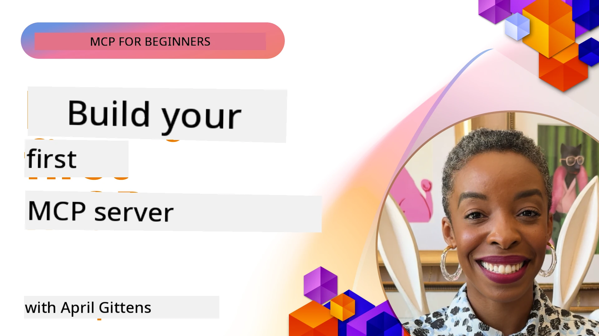

## Getting Started  

_(Click di pikshọn wey dey up for see di video for dis lesson)_

Dis section get plenti lessons:

- **1 Your first server**, for dis first lesson, you go learn how to create your first server and check am wit inspector tool, wey be beta way to test and debug your server, [to the lesson](01-first-server/README.md)

- **2 Client**, for dis lesson, you go learn how to write client wey fit connect to your server, [to the lesson](02-client/README.md)

- **3 Client with LLM**, beta beta way to write client na to add LLM so e go fit "negotiate" wit your server on top wetin e go do, [to the lesson](03-llm-client/README.md)

- **4 Consuming a server GitHub Copilot Agent mode in Visual Studio Code**. Here, we dey look how to run our MCP Server inside Visual Studio Code, [to the lesson](04-vscode/README.md)

- **5 stdio Transport Server** stdio transport na di recommended standard for local MCP server-to-client communication, wey dey give secure subprocess-based communication wit built-in process isolation [to the lesson](05-stdio-server/README.md)

- **6 HTTP Streaming with MCP (Streamable HTTP)**. Learn about modern HTTP streaming transport (the recommended approach for remote MCP servers per [MCP Specification 2025-11-25](https://spec.modelcontextprotocol.io/specification/2025-11-25/basic/transports/#streamable-http)), progress notifications, and how to implement scalable, real-time MCP servers and clients using Streamable HTTP. [to the lesson](06-http-streaming/README.md)

- **7 Utilising AI Toolkit for VSCode** to consume and test your MCP Clients and Servers [to the lesson](07-aitk/README.md)

- **8 Testing**. Here we go focus well well on how to test our server and client for different ways, [to the lesson](08-testing/README.md)

- **9 Deployment**. Dis chapter go show different ways to deploy your MCP solutions, [to the lesson](09-deployment/README.md)

- **10 Advanced server usage**. Dis chapter cover advanced server usage, [to the lesson](./10-advanced/README.md)

- **11 Auth**. Dis chapter go explain how to add simple auth, from Basic Auth to JWT and RBAC. You fit start for here then check Advanced Topics for Chapter 5 plus add security wyth recommendations from Chapter 2, [to the lesson](./11-simple-auth/README.md)

- **12 MCP Hosts**. Configure and use popular MCP host clients like Claude Desktop, Cursor, Cline, and Windsurf. Learn transport types and how to resolve wahala, [to the lesson](./12-mcp-hosts/README.md)

- **13 MCP Inspector**. Debug and test your MCP servers like person wey sabi use MCP Inspector tool well. Learn how to solve problem, tools, resources and protocol messages, [to the lesson](./13-mcp-inspector/README.md)

- **14 Sampling**. Create MCP Servers wey join body wit MCP clients on LLM tasks. [to the lesson](./14-sampling/README.md)

- **15 MCP Apps**. Build MCP Servers wey go also send back UI instructions, [to the lesson](./15-mcp-apps/README.md)

The Model Context Protocol (MCP) na open protocol wey standardize how applications dey provide context to LLMs. Think am like USB-C port for AI applications - e dey provide standard way to connect AI models to different data sources and tools.

## Learning Objectives

By di time you finish dis lesson, you go fit:

- Arrange development environments for MCP for C#, Java, Python, TypeScript, and JavaScript
- Build and deploy basic MCP servers wit custom features (resources, prompts, and tools)
- Create host applications wey go connect to MCP servers
- Test and debug MCP implementations
- Understand common wahala for setup and how to solve am
- Connect your MCP implementations to popular LLM services

## Setting Up Your MCP Environment

Before you start work wit MCP, e important to prepare your development environment and sabi di basic workflow. Dis section go guide you through di first steps to make sure your start for MCP go smooth.

### Prerequisites

Before you knack mouth for MCP development, make sure say you get:

- **Development Environment**: For di language wey you choose (C#, Java, Python, TypeScript, or JavaScript)
- **IDE/Editor**: Visual Studio, Visual Studio Code, IntelliJ, Eclipse, PyCharm, or any modern code editor
- **Package Managers**: NuGet, Maven/Gradle, pip, or npm/yarn
- **API Keys**: For any AI services wey you plan to use for your host applications

### Official SDKs

For the coming chapters, you go see solutions wey dem build using Python, TypeScript, Java and .NET. Na all di official supported SDKs dey here.

MCP dey provide official SDKs for plenty languages (wey dey follow [MCP Specification 2025-11-25](https://spec.modelcontextprotocol.io/specification/2025-11-25/)):
- [C# SDK](https://github.com/modelcontextprotocol/csharp-sdk) - Dem dey maintain am wit Microsoft
- [Java SDK](https://github.com/modelcontextprotocol/java-sdk) - Dem dey maintain am wit Spring AI
- [TypeScript SDK](https://github.com/modelcontextprotocol/typescript-sdk) - Di official TypeScript implementation
- [Python SDK](https://github.com/modelcontextprotocol/python-sdk) - Di official Python implementation (FastMCP)
- [Kotlin SDK](https://github.com/modelcontextprotocol/kotlin-sdk) - Di official Kotlin implementation
- [Swift SDK](https://github.com/modelcontextprotocol/swift-sdk) - Dem dey maintain am wit Loopwork AI
- [Rust SDK](https://github.com/modelcontextprotocol/rust-sdk) - Di official Rust implementation
- [Go SDK](https://github.com/modelcontextprotocol/go-sdk) - Di official Go implementation

## Key Takeaways

- Setting up MCP development environment easy with language-specific SDKs
- Building MCP servers mean say you go create and register tools wit clear schemas
- MCP clients dey connect to servers and models to sabi use extended capabilities
- Testing and debugging na necessary for reliable MCP implementations
- Deployment choices dey from local development reach cloud-based solutions

## Practicing

We get samples wey go add ginger to the exercises wey you go see for all chapters inside dis section. Each chapter also get their own exercises and assignments

- [Java Calculator](./samples/java/calculator/README.md)
- [.Net Calculator](../../../03-GettingStarted/samples/csharp)
- [JavaScript Calculator](./samples/javascript/README.md)
- [TypeScript Calculator](./samples/typescript/README.md)
- [Python Calculator](../../../03-GettingStarted/samples/python)

## Additional Resources

- [Build Agents using Model Context Protocol on Azure](https://learn.microsoft.com/azure/developer/ai/intro-agents-mcp)
- [Remote MCP with Azure Container Apps (Node.js/TypeScript/JavaScript)](https://learn.microsoft.com/samples/azure-samples/mcp-container-ts/mcp-container-ts/)
- [.NET OpenAI MCP Agent](https://learn.microsoft.com/samples/azure-samples/openai-mcp-agent-dotnet/openai-mcp-agent-dotnet/)

## What's next

Start wit di first lesson: [Creating your first MCP Server](01-first-server/README.md)

Once you don finish dis module, continue to: [Module 4: Practical Implementation](../04-PracticalImplementation/README.md)

---

<!-- CO-OP TRANSLATOR DISCLAIMER START -->
**Disclaimer**:
Dis document don translate wit AI translation service wey dem dey call [Co-op Translator](https://github.com/Azure/co-op-translator). Even though we dey try make am correct, abeg make you sabi say automated translation fit get some mistakes or be wrong small. Di original document wey na for e own language na di real correct one. If na important matter, better make human professional translate am. We no go take responsibility if person understand am wrong or if person use dis translation do mistake.
<!-- CO-OP TRANSLATOR DISCLAIMER END -->