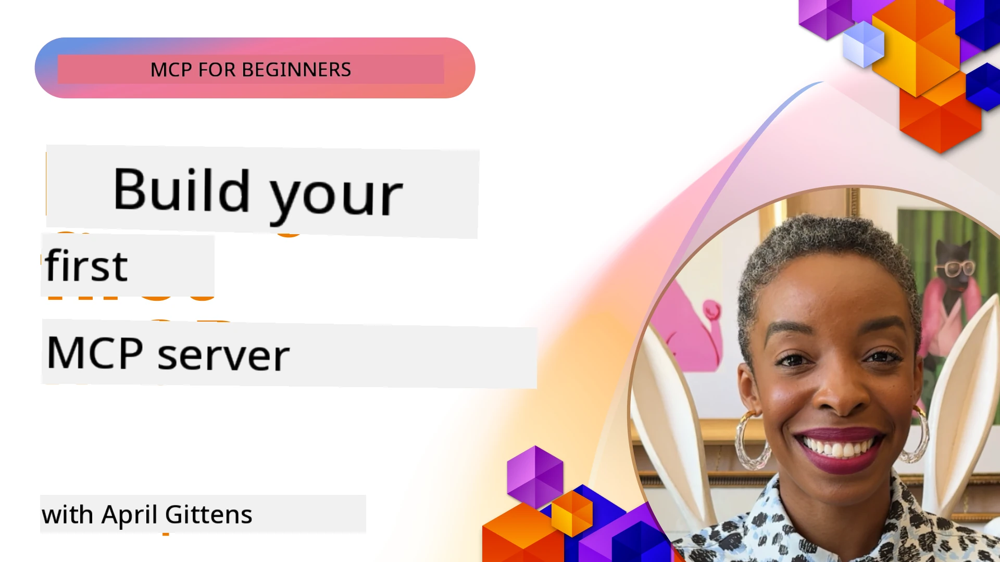

## How to Start  

_(Click di image wey dey above make you fit watch video of dis lesson)_

Dis section get plenti lessons: 

- **1 Your first server**, for dis first lesson, you go learn how to create your first server and check am wit inspector tool, beta way to test and debug your server, [go di lesson](01-first-server/README.md)

- **2 Client**, for dis lesson, you go learn how to write client wey fit connect to your server, [go di lesson](02-client/README.md)

- **3 Client wit LLM**, beta way to write client na to add LLM so e fit "talk" wit your server wetin e go do, [go di lesson](03-llm-client/README.md)

- **4 Consuming a server GitHub Copilot Agent mode for Visual Studio Code**. Here, we dey look how to run our MCP Server inside Visual Studio Code, [go di lesson](04-vscode/README.md)

- **5 stdio Transport Server** stdio transport na di recommended standard for local MCP server-to-client communication, wey dey give secure subprocess-based communication wit process isolation inside [go di lesson](05-stdio-server/README.md)

- **6 HTTP Streaming wit MCP (Streamable HTTP)**. Learn about di standard
	remote transport for [MCP Specification 2026-07-28](https://modelcontextprotocol.io/specification/2026-07-28/basic/transports/streamable-http),
	plus di old session-based way wey dem still dey use for di lesson.
	[go di lesson](06-http-streaming/README.md)

- **7 Using AI Toolkit for VSCode** to consume and test your MCP Clients and Servers [go di lesson](07-aitk/README.md)

- **8 Testing**. Here we go focus well well on how we fit test our server and client different way, [go di lesson](08-testing/README.md)

- **9 Deployment**. Dis chapter go show different ways to deploy your MCP solutions, [go di lesson](09-deployment/README.md)

- **10 Advanced server usage**. Dis chapter go cover advanced server usage, [go di lesson](./10-advanced/README.md)

- **11 Auth**. Dis chapter go show how to add simple auth, from Basic Auth to JWT and RBAC. E beta to start here then check Advanced Topics for Chapter 5 and do more strong security like dem talk for Chapter 2, [go di lesson](./11-simple-auth/README.md)

- **12 MCP Hosts**. Configure and use popular MCP host clients like Claude Desktop, Cursor, Cline, and Windsurf. Learn transport types and troubleshooting, [go di lesson](./12-mcp-hosts/README.md)

- **13 MCP Inspector**. Debug and test your MCP servers sharp sharp wit MCP Inspector tool. Learn how to troubleshoot tools, resources, and protocol messages, [go di lesson](./13-mcp-inspector/README.md)

- **14 Sampling**. Learn the old Sampling style for `2025-11-25` and
	how to switch to new design wey direct connect LLM provider. Sampling don
	stop for MCP `2026-07-28`. [go di lesson](./14-sampling/README.md)

- **15 MCP Apps**. Build MCP Servers wey fit reply with UI instructions, [go di lesson](./15-mcp-apps/README.md)

Di Model Context Protocol (MCP) na open protocol wey dey make am standard how apps dey provide context to LLMs. Think am like USB-C port for AI apps - e dey give common way to connect AI models to different data sources and tools.

## Wetin You Go Learn

By di end of dis lesson, you go fit:

- Set up development environments for MCP for C#, Java, Python, TypeScript, and JavaScript
- Build and deploy basic MCP servers wit custom features (resources, prompts, and tools)
- Create host apps wey connect to MCP servers
- Test and debug MCP implementations
- Understand common setup wahalas and how to solve dem
- Connect your MCP implementations to popular LLM services

## How to Set Up Your MCP Environment

Before you start to work wit MCP, e important to ready your development environment and sabi di basic workflow. Dis section go guide you for di first steps to make your MCP start smooth.

### Wetin You Need Before You Start

Before you put hand for MCP development, make sure say you get:

- **Development Environment**: For di language wey you choose (C#, Java, Python, TypeScript, or JavaScript)
- **IDE/Editor**: Visual Studio, Visual Studio Code, IntelliJ, Eclipse, PyCharm, or any modern code editor
- **Package Managers**: NuGet, Maven/Gradle, pip, or npm/yarn
- **API Keys**: For any AI service wey you wan use for your host apps

### Official SDKs

For di chapters wey dey come, you go see solutions wey dem build wit Python, TypeScript,
Java and .NET. These na di official SDKs.

SDK support for MCP `2026-07-28` dey come one by one for every language.
Before you run example, check package version and SDK release notes
for di protocol versions wey e support. See di
[official SDK list](https://modelcontextprotocol.io/docs/sdk):
- [C# SDK](https://github.com/modelcontextprotocol/csharp-sdk) - Maintained wit Microsoft
- [Java SDK](https://github.com/modelcontextprotocol/java-sdk) - Maintained wit Spring AI
- [TypeScript SDK](https://github.com/modelcontextprotocol/typescript-sdk) - Official TypeScript implementation
- [Python SDK](https://github.com/modelcontextprotocol/python-sdk) - Official Python implementation (FastMCP)
- [Kotlin SDK](https://github.com/modelcontextprotocol/kotlin-sdk) - Official Kotlin implementation
- [Swift SDK](https://github.com/modelcontextprotocol/swift-sdk) - Maintained wit Loopwork AI
- [Rust SDK](https://github.com/modelcontextprotocol/rust-sdk) - Official Rust implementation
- [Go SDK](https://github.com/modelcontextprotocol/go-sdk) - Official Go implementation

## Main Points

- Setting up MCP development environment na easy tin wit language SDKs
- Building MCP servers na to create tools and register dem wit clear schemas
- MCP clients connect to servers and models to use beta features dem
- Testing and debugging na key for reliable MCP development
- Deployment fit be local development or cloud solutions

## Practice

We get some samples wey dey complement di exercises for all chapters for dis section. Each chapter get their own exercises and assignments too.

- [Java Calculator](./samples/java/calculator/README.md)
- [.NET Calculator](../../../03-GettingStarted/samples/csharp)
- [JavaScript Calculator](./samples/javascript/README.md)
- [TypeScript Calculator](./samples/typescript/README.md)
- [Python Calculator](../../../03-GettingStarted/samples/python)

## More Resources

- [Build Agents using Model Context Protocol on Azure](https://learn.microsoft.com/azure/developer/ai/intro-agents-mcp)
- [Remote MCP with Azure Container Apps (Node.js/TypeScript/JavaScript)](https://learn.microsoft.com/samples/azure-samples/mcp-container-ts/mcp-container-ts/)
- [.NET OpenAI MCP Agent](https://learn.microsoft.com/samples/azure-samples/openai-mcp-agent-dotnet/openai-mcp-agent-dotnet/)

## Wetin Next

Start wit di first lesson: [Creating your first MCP Server](01-first-server/README.md)

After you don finish dis module, continue to: [Module 4: Practical Implementation](../04-PracticalImplementation/README.md)

---

<!-- CO-OP TRANSLATOR DISCLAIMER START -->
**Disclaimer**:
Dis document don translate wit AI translation service [Co-op Translator](https://github.com/Azure/co-op-translator). Even tho we dey try make am correct, abeg make you know say automated translation fit get errors or mistakes. Di original document for dia own language na im be di correct source. For important info, make person wey sabi human translation do am. We no go responsible for any misunderstanding or wrong understanding wey fit happen because of dis translation.
<!-- CO-OP TRANSLATOR DISCLAIMER END -->