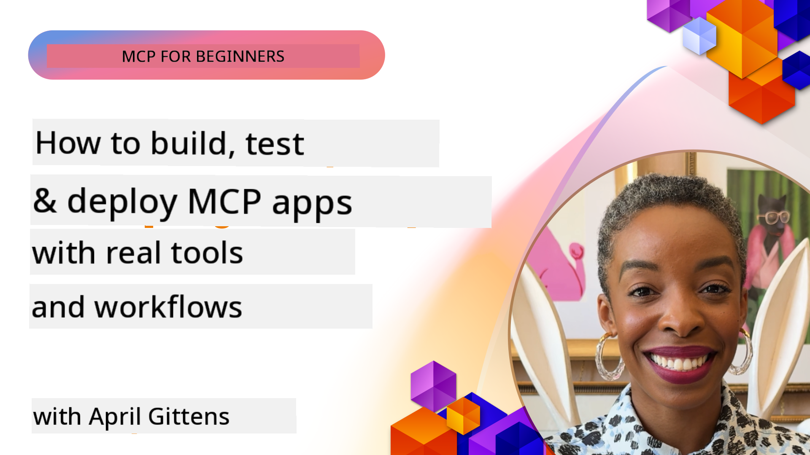
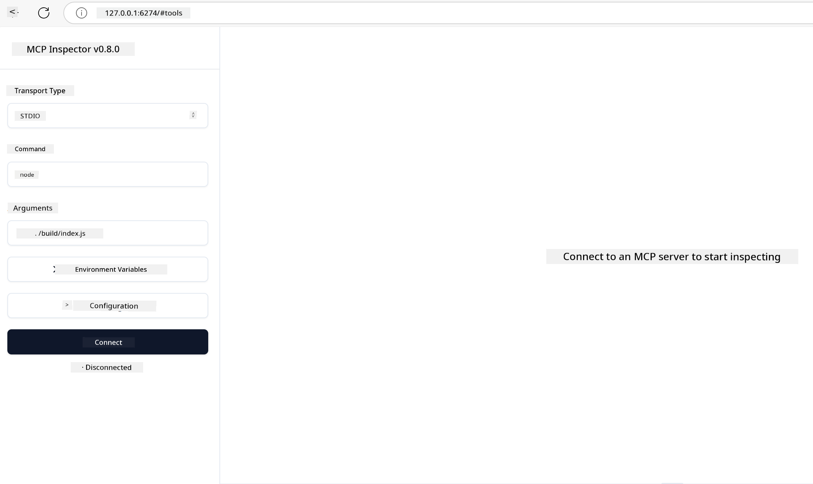

<!--
CO_OP_TRANSLATOR_METADATA:
{
  "original_hash": "83efa75a69bc831277263a6f1ae53669",
  "translation_date": "2025-11-18T20:01:31+00:00",
  "source_file": "04-PracticalImplementation/README.md",
  "language_code": "pcm"
}
-->
# Practical Implementation

[](https://youtu.be/vCN9-mKBDfQ)

_(Click di image above to watch di video for dis lesson)_

Practical implementation na where di power of Model Context Protocol (MCP) go start to make sense. Even though to sabi di theory and architecture wey dey behind MCP dey important, di real value go show when you use di concepts build, test, and deploy solutions wey fit solve real-life problems. Dis chapter go help you move from just sabi di idea to actually do di work, and e go guide you on how to bring MCP-based apps to life.

Whether you dey develop smart assistants, dey put AI inside business workflows, or dey build custom tools for data processing, MCP dey give you flexible foundation. E no dey tied to any language, and e get official SDKs for popular programming languages, so e dey easy for plenty developers to use. With these SDKs, you fit quickly prototype, test, and scale your solutions for different platforms and environments.

For di sections wey dey follow, you go see practical examples, sample code, and deployment strategies wey go show you how to use MCP for C#, Java with Spring, TypeScript, JavaScript, and Python. You go also learn how to debug and test MCP servers, manage APIs, and deploy solutions to di cloud with Azure. All these hands-on resources dey designed to make your learning fast and help you build strong, production-ready MCP apps.

## Overview

Dis lesson go focus on di practical side of MCP implementation for different programming languages. We go look how to use MCP SDKs for C#, Java with Spring, TypeScript, JavaScript, and Python to build strong apps, debug and test MCP servers, and create reusable resources, prompts, and tools.

## Learning Objectives

By di end of dis lesson, you go fit:

- Use MCP solutions with official SDKs for different programming languages
- Debug and test MCP servers well
- Create and use server features (Resources, Prompts, and Tools)
- Design workflows wey go make MCP handle complex tasks
- Make MCP implementations better for performance and reliability

## Official SDK Resources

Model Context Protocol get official SDKs for different languages:

- [C# SDK](https://github.com/modelcontextprotocol/csharp-sdk)
- [Java with Spring SDK](https://github.com/modelcontextprotocol/java-sdk) **Note:** e need dependency on [Project Reactor](https://projectreactor.io). (See [discussion issue 246](https://github.com/orgs/modelcontextprotocol/discussions/246).)
- [TypeScript SDK](https://github.com/modelcontextprotocol/typescript-sdk)
- [Python SDK](https://github.com/modelcontextprotocol/python-sdk)
- [Kotlin SDK](https://github.com/modelcontextprotocol/kotlin-sdk)

## Working with MCP SDKs

Dis section go show practical examples of how to use MCP for different programming languages. You fit find sample code for di `samples` folder wey dey organized by language.

### Available Samples

Di repository get [sample implementations](../../../04-PracticalImplementation/samples) for di following languages:

- [C#](./samples/csharp/README.md)
- [Java with Spring](./samples/java/containerapp/README.md)
- [TypeScript](./samples/typescript/README.md)
- [JavaScript](./samples/javascript/README.md)
- [Python](./samples/python/README.md)

Each sample dey show di main MCP concepts and implementation patterns for di specific language and ecosystem.

## Core Server Features

MCP servers fit get any combination of these features:

### Resources

Resources dey provide context and data wey di user or AI model fit use:

- Document repositories
- Knowledge bases
- Structured data sources
- File systems

### Prompts

Prompts na templates for messages and workflows for users:

- Pre-defined conversation templates
- Guided interaction patterns
- Specialized dialogue structures

### Tools

Tools na functions wey di AI model fit run:

- Data processing utilities
- External API integrations
- Computational capabilities
- Search functionality

## Sample Implementations: C# Implementation

Di official C# SDK repository get plenty sample implementations wey dey show different parts of MCP:

- **Basic MCP Client**: Simple example wey show how to create MCP client and call tools
- **Basic MCP Server**: Small server implementation with basic tool registration
- **Advanced MCP Server**: Full server with tool registration, authentication, and error handling
- **ASP.NET Integration**: Examples wey show integration with ASP.NET Core
- **Tool Implementation Patterns**: Different patterns for implementing tools with different complexity levels

Di MCP C# SDK still dey preview and APIs fit change. We go dey update dis blog as di SDK dey evolve.

### Key Features

- [C# MCP Nuget ModelContextProtocol](https://www.nuget.org/packages/ModelContextProtocol)
- How to build your [first MCP Server](https://devblogs.microsoft.com/dotnet/build-a-model-context-protocol-mcp-server-in-csharp/).

For complete C# implementation samples, visit di [official C# SDK samples repository](https://github.com/modelcontextprotocol/csharp-sdk)

## Sample implementation: Java with Spring Implementation

Di Java with Spring SDK dey offer strong MCP implementation options with enterprise-level features.

### Key Features

- Spring Framework integration
- Strong type safety
- Reactive programming support
- Comprehensive error handling

For complete Java with Spring implementation sample, see [Java with Spring sample](samples/java/containerapp/README.md) for di samples folder.

## Sample implementation: JavaScript Implementation

Di JavaScript SDK dey provide lightweight and flexible way to implement MCP.

### Key Features

- Node.js and browser support
- Promise-based API
- Easy integration with Express and other frameworks
- WebSocket support for streaming

For complete JavaScript implementation sample, see [JavaScript sample](samples/javascript/README.md) for di samples folder.

## Sample implementation: Python Implementation

Di Python SDK dey offer Pythonic way to implement MCP with good ML framework integrations.

### Key Features

- Async/await support with asyncio
- FastAPI integration
- Simple tool registration
- Native integration with popular ML libraries

For complete Python implementation sample, see [Python sample](samples/python/README.md) for di samples folder.

## API management

Azure API Management na better way to secure MCP Servers. Di idea na to put Azure API Management instance in front of your MCP Server make e handle features wey you go need like:

- rate limiting
- token management
- monitoring
- load balancing
- security

### Azure Sample

Here be Azure Sample wey dey do exactly dat, [creating an MCP Server and securing it with Azure API Management](https://github.com/Azure-Samples/remote-mcp-apim-functions-python).

See how di authorization flow dey happen for di image below:


For di image wey dey above, di following dey happen:

- Authentication/Authorization dey happen using Microsoft Entra.
- Azure API Management dey act as gateway and dey use policies to direct and manage traffic.
- Azure Monitor dey log all request for further analysis.

#### Authorization flow

Make we look di authorization flow more in detail:


#### MCP authorization specification

Learn more about di [MCP Authorization specification](https://modelcontextprotocol.io/specification/2025-03-26/basic/authorization#2-10-third-party-authorization-flow)

## Deploy Remote MCP Server to Azure

Make we see how we fit deploy di sample we mention earlier:

1. Clone di repo

    ```bash
    git clone https://github.com/Azure-Samples/remote-mcp-apim-functions-python.git
    cd remote-mcp-apim-functions-python
    ```

1. Register `Microsoft.App` resource provider.

   - If you dey use Azure CLI, run `az provider register --namespace Microsoft.App --wait`.
   - If you dey use Azure PowerShell, run `Register-AzResourceProvider -ProviderNamespace Microsoft.App`. Then run `(Get-AzResourceProvider -ProviderNamespace Microsoft.App).RegistrationState` after some time to check if di registration don complete.

1. Run dis [azd](https://aka.ms/azd) command to provision di api management service, function app (with code) and all other required Azure resources

    ```shell
    azd up
    ```

    Dis command go deploy all di cloud resources for Azure

### Testing your server with MCP Inspector

1. For **new terminal window**, install and run MCP Inspector

    ```shell
    npx @modelcontextprotocol/inspector
    ```

    You go see interface wey resemble:

    

1. CTRL click to load di MCP Inspector web app from di URL wey di app display (e.g. [http://127.0.0.1:6274/#resources](http://127.0.0.1:6274/#resources))
1. Set di transport type to `SSE`
1. Set di URL to your running API Management SSE endpoint wey `azd up` display and **Connect**:

    ```shell
    https://<apim-servicename-from-azd-output>.azure-api.net/mcp/sse
    ```

1. **List Tools**. Click on one tool and **Run Tool**.  

If all di steps work, you suppose don connect to di MCP server and you don fit call one tool.

## MCP servers for Azure

[Remote-mcp-functions](https://github.com/Azure-Samples/remote-mcp-functions-dotnet): Dis set of repositories na quickstart template to build and deploy custom remote MCP (Model Context Protocol) servers using Azure Functions with Python, C# .NET or Node/TypeScript.

Di Samples dey provide complete solution wey go allow developers to:

- Build and run locally: Develop and debug MCP server for local machine
- Deploy to Azure: Deploy to di cloud easily with simple azd up command
- Connect from clients: Connect to di MCP server from different clients like VS Code's Copilot agent mode and di MCP Inspector tool

### Key Features

- Security by design: Di MCP server dey secured with keys and HTTPS
- Authentication options: E support OAuth with built-in auth and/or API Management
- Network isolation: E allow network isolation with Azure Virtual Networks (VNET)
- Serverless architecture: E dey use Azure Functions for scalable, event-driven execution
- Local development: E get full support for local development and debugging
- Simple deployment: E get easy deployment process to Azure

Di repository get all di configuration files, source code, and infrastructure definitions wey you need to start MCP server implementation wey fit work for production.

- [Azure Remote MCP Functions Python](https://github.com/Azure-Samples/remote-mcp-functions-python) - Sample implementation of MCP using Azure Functions with Python

- [Azure Remote MCP Functions .NET](https://github.com/Azure-Samples/remote-mcp-functions-dotnet) - Sample implementation of MCP using Azure Functions with C# .NET

- [Azure Remote MCP Functions Node/Typescript](https://github.com/Azure-Samples/remote-mcp-functions-typescript) - Sample implementation of MCP using Azure Functions with Node/TypeScript.

## Key Takeaways

- MCP SDKs dey provide tools for different languages to implement strong MCP solutions
- Debugging and testing dey very important for MCP apps wey go work well
- Reusable prompt templates dey help make AI interactions consistent
- Well-designed workflows fit handle complex tasks with multiple tools
- To implement MCP solutions, you need to think about security, performance, and error handling

## Exercise

Design one practical MCP workflow wey go solve real-life problem for your area:

1. Identify 3-4 tools wey go help solve di problem
2. Create workflow diagram wey go show how di tools go work together
3. Implement small version of one tool with your preferred language
4. Create prompt template wey go help di model use your tool well

## Additional Resources

---

Next: [Advanced Topics](../05-AdvancedTopics/README.md)

---

<!-- CO-OP TRANSLATOR DISCLAIMER START -->
**Disclaimer**:  
Dis dokyument don use AI transle-shon service [Co-op Translator](https://github.com/Azure/co-op-translator) do di transle-shon. Even as we dey try make sure say e correct, abeg make you sabi say transle-shon wey machine do fit get mistake or no dey accurate well. Di original dokyument for di language wey dem take write am first na di one wey you go take as di correct source. For any important mata, e good make you use professional human transle-shon. We no go fit take blame for any misunderstanding or wrong interpretation wey fit happen because you use dis transle-shon.
<!-- CO-OP TRANSLATOR DISCLAIMER END -->