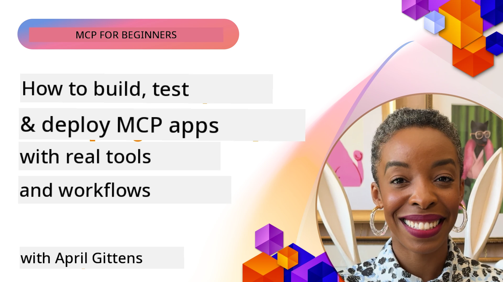

# Practical Implementation

[](https://youtu.be/vCN9-mKBDfQ)

_(Click di image wey dey above to watch video for dis lesson)_

Practical implementation na di place wey power of Model Context Protocol (MCP) go really show. Even though to understand di theory and architecture behind MCP na important tin, di real value go appear when you dey apply dis concepts to build, test, and deploy solution wey go solve real-life wahala. Dis chapter na bridge wey go connect conceptual knowledge and hands-on development, e go guide you well-well inside di process to bring MCP-based apps come life.

Whether you dey develop smart assistants, dey join AI inside business workflows, or build custom tools for data processing, MCP dey give flexible foundation. E get language-agnostic design and official SDKs for popular programming languages wey make am easy for many developers to use am. If you use dis SDKs well, you fit quickly prototype, change am steady-steady, and expand your solution across different platforms and environments.

For di sections wey follow, you go find practical examples, sample code, and deployment strategies wey go show you how to implement MCP for C#, Java with Spring, TypeScript, JavaScript, and Python. You go also sabi how to debug and test your MCP servers, manage APIs, and deploy solutions go cloud using Azure. Dis hands-on resources na to make your learning faster and help you build strong, production-ready MCP apps without fear.

## Overview

Dis lesson dey focus on practical tins of MCP implementation for many programming languages. We go explore how to use MCP SDKs for C#, Java with Spring, TypeScript, JavaScript, and Python to build strong applications, debug and test MCP servers, and create reusable resources, prompts, and tools.

## Learning Objectives

By di time you finish dis lesson, you go fit:

- Implement MCP solutions using official SDKs for different programming languages
- Debug and test MCP servers like pro
- Create and use server features (Resources, Prompts, and Tools)
- Design correct MCP workflows for complicated tasks
- Make MCP implementations perform well and dey reliable

## Official SDK Resources

Model Context Protocol get official SDKs for many languages (wey follow [MCP Specification 2025-11-25](https://spec.modelcontextprotocol.io/specification/2025-11-25/)):

- [C# SDK](https://github.com/modelcontextprotocol/csharp-sdk)
- [Java with Spring SDK](https://github.com/modelcontextprotocol/java-sdk) **Note:** e need dependency for [Project Reactor](https://projectreactor.io). (See [discussion issue 246](https://github.com/orgs/modelcontextprotocol/discussions/246).)
- [TypeScript SDK](https://github.com/modelcontextprotocol/typescript-sdk)
- [Python SDK](https://github.com/modelcontextprotocol/python-sdk)
- [Kotlin SDK](https://github.com/modelcontextprotocol/kotlin-sdk)
- [Go SDK](https://github.com/modelcontextprotocol/go-sdk)

## Working with MCP SDKs

Dis section dey give practical examples of how to implement MCP for different programming languages. You fit find sample code for di `samples` directory, wey e arrange by language.

### Available Samples

Di repo get [sample implementations](../../../04-PracticalImplementation/samples) for dis languages:

- [C#](./samples/csharp/README.md)
- [Java with Spring](./samples/java/containerapp/README.md)
- [TypeScript](./samples/typescript/README.md)
- [JavaScript](./samples/javascript/README.md)
- [Python](./samples/python/README.md)

Each sample dey show key MCP concepts and how dem take implement am for that particular language and ecosystem.

### Practical Guides

Extra guides for how to practically do MCP implementation:

- [Pagination and Large Result Sets](./pagination/README.md) - How to handle cursor-based pagination for tools, resources, and big datasets

## Core Server Features

MCP servers fit implement any combination of dis features:

### Resources

Resources dey provide context and data wey user or AI model fit use:

- Document repositories
- Knowledge bases
- Structured data sources
- File systems

### Prompts

Prompts na templated messages and workflows for users:

- Pre-defined conversation templates
- Guided interaction patterns
- Specialized dialogue structures

### Tools

Tools na functions wey AI model go execute:

- Data processing utilities
- External API integrations
- Computational capabilities
- Search functionality

## Sample Implementations: C# Implementation

Di official C# SDK repo get different sample implementations wey dey show different sides of MCP:

- **Basic MCP Client**: Simple example to show how to create MCP client and call tools
- **Basic MCP Server**: Minimal server implementation with simple tool registration
- **Advanced MCP Server**: Full server with tool registration, authentication, and error handling
- **ASP.NET Integration**: Examples wey show integration with ASP.NET Core
- **Tool Implementation Patterns**: Different patterns for how to implement tools with different complexity levels

Di MCP C# SDK dey still for preview and APIs fit change. We go dey update dis blog steady as di SDK dey evolve.

### Key Features

- [C# MCP Nuget ModelContextProtocol](https://www.nuget.org/packages/ModelContextProtocol)
- How to build your [first MCP Server](https://devblogs.microsoft.com/dotnet/build-a-model-context-protocol-mcp-server-in-csharp/).

For full C# implementation samples, check dis [official C# SDK samples repo](https://github.com/modelcontextprotocol/csharp-sdk)

## Sample implementation: Java with Spring Implementation

Di Java with Spring SDK get solid MCP implementation options with enterprise-level features.

### Key Features

- Spring Framework integration
- Strong type safety
- Reactive programming support
- Complete error handling

For full Java with Spring implementation sample, see [Java with Spring sample](samples/java/containerapp/README.md) for di samples directory.

## Sample implementation: JavaScript Implementation

Di JavaScript SDK dey give lightweight and flexible way to implement MCP.

### Key Features

- Node.js and browser support
- Promise-based API
- Easy integration with Express and other frameworks
- WebSocket support for streaming

For full JavaScript implementation sample, see [JavaScript sample](samples/javascript/README.md) inside samples directory.

## Sample implementation: Python Implementation

Di Python SDK dey offer Pythonic way to implement MCP with better ML framework integrations.

### Key Features

- Async/await support with asyncio
- FastAPI integration``
- Simple tool registration
- Native integration with popular ML libraries

For full Python implementation sample, see [Python sample](samples/python/README.md) inside samples directory.

## API management

Azure API Management na correct way to secure MCP Servers. Di idea be say, put Azure API Management instance before your MCP Server make e dey handle features wey you fit want like:

- rate limiting
- token management
- monitoring
- load balancing
- security

### Azure Sample

Here na Azure Sample wey dey do exactly dat, i.e [create MCP Server and secure am with Azure API Management](https://github.com/Azure-Samples/remote-mcp-apim-functions-python).

See how authorization flow dey happen for di picture below:


For di picture wey dey before dis one, dis things dey happen:

- Authentication/Authorization dey happen using Microsoft Entra.
- Azure API Management dey act as gateway and e get policies to direct and manage traffic.
- Azure Monitor dey log all request for later analysis.

#### Authorization flow

Make we check di authorization flow more clear:


#### MCP authorization specification

Learn more about [MCP Authorization specification](https://spec.modelcontextprotocol.io/specification/2025-11-25/basic/authorization/)

## Deploy Remote MCP Server to Azure

Make we see if we fit deploy di sample wey we talk before:

1. Clone di repo

    ```bash
    git clone https://github.com/Azure-Samples/remote-mcp-apim-functions-python.git
    cd remote-mcp-apim-functions-python
    ```

1. Register `Microsoft.App` resource provider.

   - If you dey use Azure CLI, run `az provider register --namespace Microsoft.App --wait`.
   - If you dey use Azure PowerShell, run `Register-AzResourceProvider -ProviderNamespace Microsoft.App`. After small time run `(Get-AzResourceProvider -ProviderNamespace Microsoft.App).RegistrationState` to check if registration finish.

1. Run dis [azd](https://aka.ms/azd) command to set up api management service, function app (with code) and all other needed Azure resources

    ```shell
    azd up
    ```

    Dis command go deploy all di cloud resources for Azure

### Testing your server with MCP Inspector

1. For **new terminal window**, install and run MCP Inspector

    ```shell
    npx @modelcontextprotocol/inspector
    ```

    You go see interface wey look like dis:

    

1. CTRL click to open MCP Inspector web app from di URL wey di app show (e.g. [http://127.0.0.1:6274/#resources](http://127.0.0.1:6274/#resources))
1. Set transport type to `SSE`
1. Set URL to your running API Management SSE endpoint wey show after `azd up` and **Connect**:

    ```shell
    https://<apim-servicename-from-azd-output>.azure-api.net/mcp/sse
    ```

1. **List Tools**. Click on tool and **Run Tool**.  

If all works well, you don connect to MCP server and fit call tool.

## MCP servers for Azure

[Remote-mcp-functions](https://github.com/Azure-Samples/remote-mcp-functions-dotnet): Dis set of repos na quickstart template for build and deploy custom remote MCP (Model Context Protocol) servers using Azure Functions with Python, C# .NET or Node/TypeScript.

Di Samples provide complete solution wey allow developers to:

- Build and run locally: Develop and debug MCP server for local machine
- Deploy to Azure: Easily deploy to cloud with simple azd up command
- Connect from clients: Connect MCP server from different clients including VS Code's Copilot agent mode and MCP Inspector tool

### Key Features

- Security by design: MCP server secure with keys and HTTPS
- Authentication options: Support OAuth using built-in auth and/or API Management
- Network isolation: Allow network isolation using Azure Virtual Networks (VNET)
- Serverless architecture: Use Azure Functions for scalable, event-driven execution
- Local development: Complete local development and debugging support
- Simple deployment: Easy deployment to Azure

Dis repo get all configuration files, source code, and infrastructure definitions to help you quickly start production-ready MCP server implementation.

- [Azure Remote MCP Functions Python](https://github.com/Azure-Samples/remote-mcp-functions-python) - Sample MCP implementation using Azure Functions with Python

- [Azure Remote MCP Functions .NET](https://github.com/Azure-Samples/remote-mcp-functions-dotnet) - Sample MCP implementation using Azure Functions with C# .NET

- [Azure Remote MCP Functions Node/Typescript](https://github.com/Azure-Samples/remote-mcp-functions-typescript) - Sample MCP implementation using Azure Functions with Node/TypeScript.

## Key Takeaways

- MCP SDKs provide language-specific tools for robust MCP solutions
- Debugging and testing na important part for reliable MCP apps
- Reusable prompt templates dey help maintain consistent AI interactions
- Good workflows fit manage complex tasks using many tools
- Implementing MCP solutions mean say you go consider security, performance, and error handling

## Exercise

Design practical MCP workflow wey go solve real-world problem for your area:

1. Identify 3-4 tools wey go help solve dis problem
2. Create workflow diagram wey show how dis tools go interact
3. Implement basic version of one tool using your favorite language
4. Create prompt template wey go help model use your tool well

## Additional Resources

---

## What's Next

Next: [Advanced Topics](../05-AdvancedTopics/README.md)

---

<!-- CO-OP TRANSLATOR DISCLAIMER START -->
**Disclaimer**:  
Dis document dem don translate am wit AI translate service wey dem dey call [Co-op Translator](https://github.com/Azure/co-op-translator). Even if we try make e correct, abeg sabi say automatic translate fit get some mistake or no too correct. Di original document wey e dey for im own language na di correct one. For important info, e good make person wey sabi translate am manually help you. We no go take responsibility if person waka misunderstan or misinterpret di tin wey dis translation carry.
<!-- CO-OP TRANSLATOR DISCLAIMER END -->