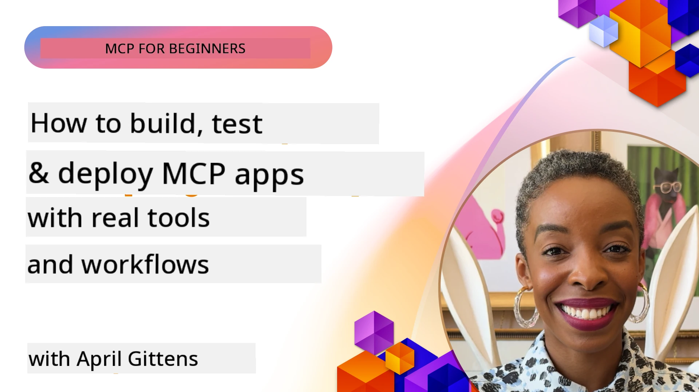

# Practical Implementation

[](https://youtu.be/vCN9-mKBDfQ)

_(Click the image above to view video of this lesson)_

Practical implementation na di place wey di power of di Model Context Protocol (MCP) dey show for real. Even though to sabi di theory and architecture behind MCP na important tin, di real value dey show when you apply di concepts to build, test, and deploy solutions wey go solve real-world wahala dem. Dis chapter go bridge di gap between knowledge for brain and hand-on development, e go guide you chook hand for di process to bring MCP-based applications to life.

Whether you dey develop smart assistants, join AI inside business workflows, or build custom tools for data processing, MCP dey provide flexible foundation. E language-agnostic design and official SDKs for popular programming languages dey make am easy for different developers. If you use these SDKs well, you fit quickly prototype, iterate, and scale your solutions across different platforms and environments.

Inside di sections wey dey follow, you go find practical examples, sample code, and deployment strategies wey go show how to implement MCP for C#, Java with Spring, TypeScript, JavaScript, and Python. You go still learn how to debug and test your MCP servers, manage APIs, and deploy solutions for cloud using Azure. These hands-on resources dey design to speed up your learning and help you build strong, production-ready MCP applications with confidence.

## Overview

Dis lesson go focus on practical sides of MCP implementation across many programming languages. We go explore how to use MCP SDKs for C#, Java with Spring, TypeScript, JavaScript, and Python to build strong applications, debug and test MCP servers, and create reusable resources, prompts, and tools.

## Learning Objectives

By di end of dis lesson, you go fit:

- Implement MCP solutions using official SDKs for different programming languages
- Debug and test MCP servers properly
- Create and use server features (Resources, Prompts, and Tools)
- Design effective MCP workflows for complex tasks
- Optimize MCP implementations for performance and reliability

## Official SDK Resources

Di Model Context Protocol get official SDKs for many languages. SDK
support for MCP `2026-07-28` dey roll out one by one, so make sure you check each SDK's
release notes and di example's package version before you assume say protocol
go fit work well. See di [official SDK list](https://modelcontextprotocol.io/docs/sdk):

- [C# SDK](https://github.com/modelcontextprotocol/csharp-sdk)
- [Java with Spring SDK](https://github.com/modelcontextprotocol/java-sdk) **Note:** e need dependency on [Project Reactor](https://projectreactor.io). (See [discussion issue 246](https://github.com/orgs/modelcontextprotocol/discussions/246).)
- [TypeScript SDK](https://github.com/modelcontextprotocol/typescript-sdk)
- [Python SDK](https://github.com/modelcontextprotocol/python-sdk)
- [Kotlin SDK](https://github.com/modelcontextprotocol/kotlin-sdk)
- [Go SDK](https://github.com/modelcontextprotocol/go-sdk)

## Working with MCP SDKs

Dis section dey provide practical examples of how to implement MCP across many programming languages. You fit find sample code for di `samples` folder wey dey organize by language.

### Available Samples

Di repository get [sample implementations](../../../04-PracticalImplementation/samples) for these languages:

- [C#](./samples/csharp/README.md)
- [Java with Spring](./samples/java/containerapp/README.md)
- [TypeScript](./samples/typescript/README.md)
- [JavaScript](./samples/javascript/README.md)
- [Python](./samples/python/README.md)

Each sample dey show di main MCP concepts and implementation patterns for dat particular language and ecosystem.

### Practical Guides

We get more guides for practical MCP implementation:

- [Pagination and Large Result Sets](./pagination/README.md) - Handle cursor-based pagination for tools, resources, and large datasets

## Core Server Features

MCP servers fit implement any combination of these features:

### Resources

Resources dey provide context and data for the user or AI model to use:

- Document repositories
- Knowledge bases
- Structured data sources
- File systems

### Prompts

Prompts na templated messages and workflows for users:

- Pre-defined conversation templates
- Guided interaction patterns
- Specialized dialogue structures

### Tools

Tools na functions for the AI model to run:

- Data processing utilities
- External API integrations
- Computational capabilities
- Search functionality

## Sample Implementations: C# Implementation

Di official C# SDK repository get plenti sample implementations wey dey show different sides of MCP:

- **Basic MCP Client**: Simple example wey show how to create MCP client and call tools
- **Basic MCP Server**: Minimal server implementation with basic tool registration
- **Advanced MCP Server**: Full server with tool registration, authentication, and error handling
- **ASP.NET Integration**: Examples wey show how to join with ASP.NET Core
- **Tool Implementation Patterns**: Different patterns for implementing tools with various complexity levels

Di MCP C# SDK still dey preview and APIs fit still change. We go dey update dis blog as di SDK dey develop.

### Key Features

- [C# MCP Nuget ModelContextProtocol](https://www.nuget.org/packages/ModelContextProtocol)
- Build your [first MCP Server](https://devblogs.microsoft.com/dotnet/build-a-model-context-protocol-mcp-server-in-csharp/).

For full C# implementation samples, go visit di [official C# SDK samples repository](https://github.com/modelcontextprotocol/csharp-sdk)

## Sample implementation: Java with Spring Implementation

Di Java with Spring SDK get strong MCP implementation options with enterprise-grade features.

### Key Features

- Spring Framework integration
- Strong type safety
- Reactive programming support
- Complete error handling

For full Java with Spring implementation sample, see [Java with Spring sample](samples/java/containerapp/README.md) for di samples directory.

## Sample implementation: JavaScript Implementation

Di JavaScript SDK go give you light and flexible way to implement MCP.

### Key Features

- Node.js and browser support
- Promise-based API
- Easy to join with Express and other frameworks
- WebSocket support for streaming

For full JavaScript implementation sample, see [JavaScript sample](samples/javascript/README.md) for the samples directory.

## Sample implementation: Python Implementation

Di Python SDK get Pythonic way to implement MCP with better ML framework integration.

### Key Features

- Async/await support with asyncio
- FastAPI integration``
- Simple tool registration
- Native integration with popular ML libraries

For full Python implementation sample, see [Python sample](samples/python/README.md) for di samples directory.

## API management

Azure API Management na beta way wey fit help secure MCP Servers. Di idea na to put one Azure API Management instance for front of your MCP Server and make am handle features wey you go like get like:

- rate limiting
- token management
- monitoring
- load balancing
- security

### Azure Sample

Here get one Azure Sample wey dey do exactly dat, i.e [creating an MCP Server and securing am with Azure API Management](https://github.com/Azure-Samples/remote-mcp-apim-functions-python).

See how di authorization flow dey happen inside di image below:


For di picture wey pass, these things dey happen:

- Authentication/Authorization dey happen using Microsoft Entra.
- Azure API Management act as gateway and dey use policies to direct and manage traffic.
- Azure Monitor dey log all requests for further analysis.

#### Authorization flow

Make we look di authorization flow well well:


#### MCP authorization specification

Sabi more about di
[MCP Authorization specification](https://modelcontextprotocol.io/specification/2026-07-28/basic/authorization/).

## Deploy Remote MCP Server to Azure

Make we see if we fit deploy di sample we talk before:

1. Clone di repo

    ```bash
    git clone https://github.com/Azure-Samples/remote-mcp-apim-functions-python.git
    cd remote-mcp-apim-functions-python
    ```

1. Register `Microsoft.App` resource provider.

   - If you dey use Azure CLI, run `az provider register --namespace Microsoft.App --wait`.
   - If you dey use Azure PowerShell, run `Register-AzResourceProvider -ProviderNamespace Microsoft.App`. Then run `(Get-AzResourceProvider -ProviderNamespace Microsoft.App).RegistrationState` after small time to check if registration done.

1. Run dis [azd](https://aka.ms/azd) command to provide di api management service, function app(with code) and all di other necessary Azure resources

    ```shell
    azd up
    ```

    Dis commands suppose deploy all di cloud resources for Azure

### Test your server with MCP Inspector

1. For **new terminal window**, install and run MCP Inspector

    ```shell
    npx @modelcontextprotocol/inspector
    ```

    You go see one interface like dis one:

    

1. CTRL click to load MCP Inspector web app from di URL wey app show (e.g. [http://127.0.0.1:6274/#resources](http://127.0.0.1:6274/#resources))
1. Set transport type to `SSE`
1. Set di URL to your running API Management SSE endpoint wey show after `azd up` and **Connect**:

    ```shell
    https://<apim-servicename-from-azd-output>.azure-api.net/mcp/sse
    ```

1. **List Tools**. Click on one tool and **Run Tool**.  

If all di steps work finish, you go don connect to di MCP server and fit call one tool.

## MCP servers for Azure

[Remote-mcp-functions](https://github.com/Azure-Samples/remote-mcp-functions-dotnet): Dis set of repositories na quickstart template for building and deploying custom remote MCP (Model Context Protocol) servers using Azure Functions with Python, C# .NET or Node/TypeScript.

Di Samples dey provide complete solution wey allow developers to:

- Build and run locally: Develop and debug MCP server for local machine
- Deploy to Azure: Easy to deploy for cloud with simple azd up command
- Connect from clients: Join MCP server from many clients including VS Code's Copilot agent mode and MCP Inspector tool

### Key Features

- Security by design: MCP server dey secured using keys and HTTPS
- Authentication options: Dey support OAuth use built-in auth and/or API Management
- Network isolation: Fit use Azure Virtual Networks (VNET) to isolate network
- Serverless architecture: Use Azure Functions for scalable, event-driven execution
- Local development: Full local development and debugging support
- Simple deployment: Easy deployment process to Azure

Di repository get all di configuration files, source code, and infrastructure definitions to quickly start with production-ready MCP server implementation.

- [Azure Remote MCP Functions Python](https://github.com/Azure-Samples/remote-mcp-functions-python) - Sample MCP implementation using Azure Functions with Python

- [Azure Remote MCP Functions .NET](https://github.com/Azure-Samples/remote-mcp-functions-dotnet) - Sample MCP implementation using Azure Functions with C# .NET

- [Azure Remote MCP Functions Node/Typescript](https://github.com/Azure-Samples/remote-mcp-functions-typescript) - Sample MCP implementation using Azure Functions with Node/TypeScript.

## Key Takeaways

- MCP SDKs dey provide language-specific tools to implement strong MCP solutions
- Di debugging and testing process important to make MCP applications reliable
- Reusable prompt templates dey allow consistent AI interactions
- Well-designed workflows fit manage complex tasks using many tools
- Implement MCP solutions need to think about security, performance, and error handling

## Exercise

Design one practical MCP workflow wey go solve real-world matter inside your area:

1. Identify 3-4 tools wey go useful for solve dis problem
2. Create workflow diagram wey go show how these tools dey interact
3. Implement simple version of one tool using your preferred language
4. Create prompt template wey go help model use your tool well

## Additional Resources

---

## What's Next

Next: [Advanced Topics](../05-AdvancedTopics/README.md)

---

<!-- CO-OP TRANSLATOR DISCLAIMER START -->
**Disclaimer**:
Dis document don translate wit AI translation service [Co-op Translator](https://github.com/Azure/co-op-translator). Even tho we dey try make am correct, abeg make you know say automated translation fit get errors or mistakes. Di original document for dia own language na im be di correct source. For important info, make person wey sabi human translation do am. We no go responsible for any misunderstanding or wrong understanding wey fit happen because of dis translation.
<!-- CO-OP TRANSLATOR DISCLAIMER END -->