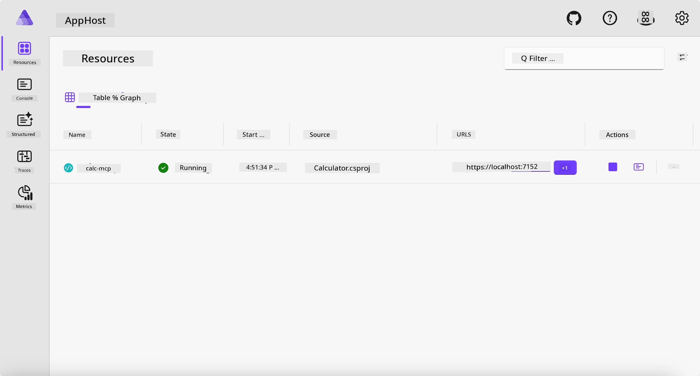
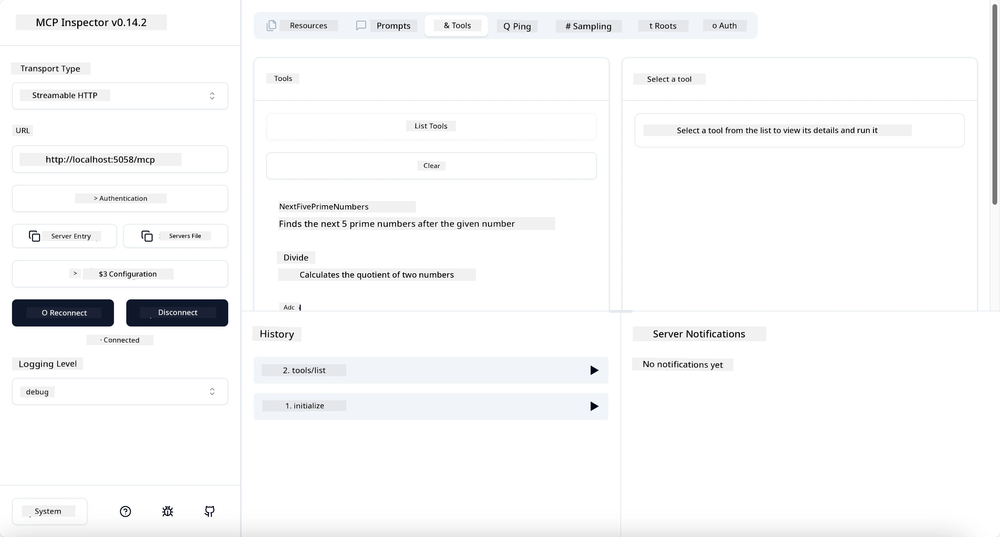
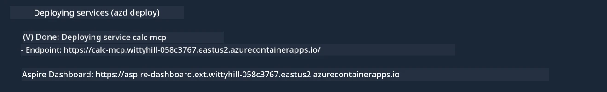

# Sample

Di previous example show how to use one local .NET project wit di `stdio` type. An how to run di server locally inside container. Dis na beta solution for plenty situations. But e fit beta to get di server wey dey run remotely, like for cloud environment. Na here di `http` type come.

If you look di solution for di `04-PracticalImplementation` folder, e fit look as e get plenty wahala pass di previous one. But tru tru, e no be so. If you look wella for di project `src/Calculator`, you go see say na almost di same code as di previous example. Di only difference be say we dey use different library `ModelContextProtocol.AspNetCore` to handle di HTTP requests. An we change di method `IsPrime` to make am private, just to show say you fit get private methods inside your code. Di rest of di code na di same as before.

Di oda projects come from [Aspire](https://aspire.dev/get-started/what-is-aspire/). Getting Aspire inside di solution go improve di developer experience as dem dey develop an test an e go help wit observability. E no necessary make you run di server, but e good practice to get am inside your solution.

## Start di server locally

1. From VS Code (wit di C# DevKit extension), waka go `04-PracticalImplementation/samples/csharp` directory.
1. Run dis command to start di server:

   ```bash
    dotnet watch run --project ./src/AppHost
   ```

1. When web browser open di Aspire dashboard, make note of di `http` URL. E suppose be like `http://localhost:5058/`.

   

## Test Streamable HTTP wit di MCP Inspector

If you get Node.js 22.7.5 or above, you fit use di MCP Inspector to test your server.

Start di server an run dis command for terminal:

```bash
npx @modelcontextprotocol/inspector http://localhost:5058
```



- Select di `Streamable HTTP` as di Transport type.
- For di Url field, put di URL of di server wey you note before, an join `/mcp` for di end. E suppose be `http` (no be `https`) like `http://localhost:5058/mcp`.
- Select di Connect button.

One beta tin about di Inspector na say e dey give beta visibility of wetin dey happen.

- Try list all di available tools
- Try some of dem, e suppose work like before.

## Test MCP Server wit GitHub Copilot Chat inside VS Code

To use Streamable HTTP transport wit GitHub Copilot Chat, change di configuration of di `calc-mcp` server wey you create before to look like dis:

```jsonc
// .vscode/mcp.json
{
  "servers": {
    "calc-mcp": {
      "type": "http",
      "url": "http://localhost:5058/mcp"
    }
  }
}
```

Do some tests:

- Ask for "3 prime numbers after 6780". Make you notice how Copilot go use di new tools `NextFivePrimeNumbers` to only return di first 3 prime numbers.
- Ask for "7 prime numbers after 111", make you see wetin go happen.
- Ask for "John get 24 lollies an wan give all dem to im 3 pikin dem. How many lollies each pikin get?", make you see wetin go happen.

## Deploy di server go Azure

Make we deploy di server go Azure so more people go fit use am.

From one terminal, waka go di folder `04-PracticalImplementation/samples/csharp` an run dis command:

```bash
azd up
```

After di deployment finish, you go see message like dis:



Collect di URL an use am for MCP Inspector an for GitHub Copilot Chat.

```jsonc
// .vscode/mcp.json
{
  "servers": {
    "calc-mcp": {
      "type": "http",
      "url": "https://calc-mcp.gentleriver-3977fbcf.australiaeast.azurecontainerapps.io/mcp"
    }
  }
}
```

## Wetin dey next?

We try different transport types an testing tools. We also deploy your MCP server go Azure. But wetin if our server need access to private resources? For example, one database or one private API? For di next chapter, we go see how we fit improve di security of our server.

---

<!-- CO-OP TRANSLATOR DISCLAIMER START -->
**Disclaimer**:
Dis document don translate wit AI translation service [Co-op Translator](https://github.com/Azure/co-op-translator). Even tho we dey try make am correct, abeg make you know say automated translation fit get errors or mistakes. Di original document for dia own language na im be di correct source. For important info, make person wey sabi human translation do am. We no go responsible for any misunderstanding or wrong understanding wey fit happen because of dis translation.
<!-- CO-OP TRANSLATOR DISCLAIMER END -->