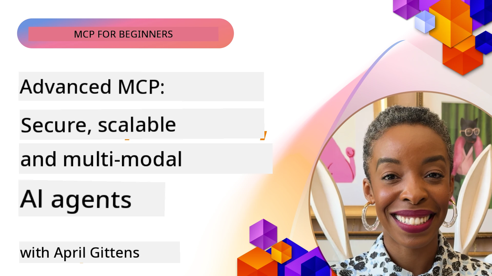

# Advanced Topics for MCP

_(Click di image wey dey top to watch video for dis lesson)_

Dis chapter dey cover series of advanced topics for Model Context Protocol (MCP) implementation, including multi-modal integration, scalability, security best practices, and enterprise integration. Dem topics na important for to build strong and production-ready MCP applications wey fit meet di demands of modern AI systems.

## Overview

Dis lesson go explore advanced concepts for Model Context Protocol implementation, wey focus on multi-modal integration, scalability, security best practices, and enterprise integration. Dem topics important for to build production-grade MCP applications wey fit handle complex requirements inside enterprise environment dem.

> **Looking ahead:** plenti topics wey dey below go get effect from di `2026-07-28` MCP specification release candidate — Root Contexts (5.4) and Sampling (5.6) dey build on top primitives wey di release candidate talk say dem no go use again, and di experimental Tasks feature wey dem mention for Protocol Features (5.16) na to move am go dedicated Tasks extension. Check [What's Changing in MCP: The 2026-07-28 Release Candidate](../01-CoreConcepts/mcp-2026-07-28-release-candidate.md) for details.

## Learning Objectives

By di time you finish dis lesson, you go fit:

- Implement multi-modal capabilities inside MCP frameworks
- Design scalable MCP architectures wey fit handle high-demand situations
- Use security best practices wey match MCP security principles
- Join MCP with enterprise AI systems and frameworks
- Optimize performance and dependability for production environments

## Lessons and sample Projects

| Link | Title | Description |
|------|-------|-------------|
| [5.1 Integration with Azure](./mcp-integration/README.md) | Integrate with Azure | Learn how to join your MCP Server for Azure |
| [5.2 Multi modal sample](./mcp-multi-modality/README.md) | MCP Multi modal samples  | Samples for audio, image and multi modal response |
| [5.3 MCP OAuth2 sample](../../../05-AdvancedTopics/mcp-oauth2-demo) | MCP OAuth2 Demo | Minimal Spring Boot app wey dey show OAuth2 with MCP, both as Authorization and Resource Server. E show how to issue secure token, protected endpoints, Azure Container Apps deployment, and API Management integration. |
| [5.4 Root Contexts](./mcp-root-contexts/README.md) | Root contexts  | Learn more about root context and how to implement dem |
| [5.5 Routing](./mcp-routing/README.md) | Routing | Learn different kain routing |
| [5.6 Sampling](./mcp-sampling/README.md) | Sampling | Learn how to work with sampling |
| [5.7 Scaling](./mcp-scaling/README.md) | Scaling  | Learn about scaling |
| [5.8 Security](./mcp-security/README.md) | Security  | Protect your MCP Server |
| [5.9 Web Search sample](./web-search-mcp/README.md) | Web Search MCP | Python MCP server and client wey join with SerpAPI for real-time web, news, product search, and Q&A. E dey show multi-tool orchestration, external API integration, and strong error handling. |
| [5.10 Realtime Streaming](./mcp-realtimestreaming/README.md) | Streaming  | Real-time data streaming don become important inside today data-driven world, where businesses and apps need immediate access to information to make quick decisions.|
| [5.11 Realtime Web Search](./mcp-realtimesearch/README.md) | Web Search | Real-time web search how MCP dey change real-time web search by giving standard approach to context management across AI models, search engines, and apps.| 
| [5.12  Entra ID Authentication for Model Context Protocol Servers](./mcp-security-entra/README.md) | Entra ID Authentication | Microsoft Entra ID dey provide strong cloud-based identity and access management solution, wey dey help make sure say only authorized users and apps fit interact with your MCP server.|
| [5.13 Microsoft Foundry Agent Integration](./mcp-foundry-agent-integration/README.md) | Microsoft Foundry Integration | Learn how to join Model Context Protocol servers with Microsoft Foundry agents, wey go enable powerful tool orchestration and enterprise AI capabilities with standardized external data source connections.|
| [5.14 Context Engineering](./mcp-contextengineering/README.md) | Context Engineering | Di future chance for context engineering techniques for MCP servers, including context optimization, dynamic context management, and ways for better prompt engineering inside MCP frameworks.|
| [5.15 MCP Custom Transport](./mcp-transport/README.md) | Custom Transport | Learn how to implement custom transport mechanisms for special MCP communication cases.|
| [5.16 Protocol Features Deep Dive](./mcp-protocol-features/README.md) | Protocol Features | Master advanced protocol features like progress notifications, request cancellation, resource templates, and error handling patterns.|
| [5.17 Adversarial Multi-Agent Reasoning](./mcp-adversarial-agents/README.md) | Adversarial Agents | Use two agents wey get opposite positions, wey share one MCP tool set, to catch hallucinations, show edge cases, and produce better outputs through structured debate.|

> **New for MCP Specification 2025-11-25**: Di specification now get experimental support for **Tasks** (long-running operations with progress tracking), **Tool Annotations** (metadata about tool behavior for safety), **URL Mode Elicitation** (requesting specific URL content from clients), and better **Roots** (for workspace context management). See di [MCP Specification changelog](https://spec.modelcontextprotocol.io/) for full details.

## Additional References

For di most up-to-date info on advanced MCP topics, check:
- [MCP Documentation](https://modelcontextprotocol.io/)
- [MCP Specification (2025-11-25)](https://spec.modelcontextprotocol.io/specification/2025-11-25/)
- [GitHub Repository](https://github.com/modelcontextprotocol)
- [OWASP MCP Top 10](https://microsoft.github.io/mcp-azure-security-guide/mcp/) - Security risks and how to reduce dem
- [MCP Security Summit Workshop (Sherpa)](https://azure-samples.github.io/sherpa/) - Hands-on security training

## Key Takeaways

- Multi-modal MCP implementations dey extend AI powers pass just text processing
- Scalability na key for enterprise deployments and fit be achieved with horizontal and vertical scaling
- Complete security steps dey protect data and make sure access control dey correct
- Enterprise integration with platforms like Azure OpenAI and Microsoft AI Foundry go improve MCP powers
- Advanced MCP implementations benefit from optimized architectures and careful resource management

## Exercise

Design one enterprise-grade MCP implementation for one specific use case:

1. Identify multi-modal needs for your use case
2. Outline security controls wey fit protect sensitive data
3. Design scalable architecture wey fit handle different load
4. Plan integration points with enterprise AI systems
5. Write down possible performance bottlenecks and how to reduce dem

## Additional Resources

- [Azure OpenAI Documentation](https://learn.microsoft.com/en-us/azure/ai-services/openai/)
- [Microsoft AI Foundry Documentation](https://learn.microsoft.com/en-us/ai-services/)

---

## What's next

Explore di lessons for dis module starting with: [5.1 MCP Integration](./mcp-integration/README.md)

After you don finish dis module, continue to: [Module 6: Community Contributions](../06-CommunityContributions/README.md)

---

<!-- CO-OP TRANSLATOR DISCLAIMER START -->
**Disclaimer**:
Dis document don translate wit AI translation service [Co-op Translator](https://github.com/Azure/co-op-translator). Even tho we dey try make am correct, abeg make you know say automated translation fit get errors or mistakes. Di original document for dia own language na im be di correct source. For important info, make person wey sabi human translation do am. We no go responsible for any misunderstanding or wrong understanding wey fit happen because of dis translation.
<!-- CO-OP TRANSLATOR DISCLAIMER END -->