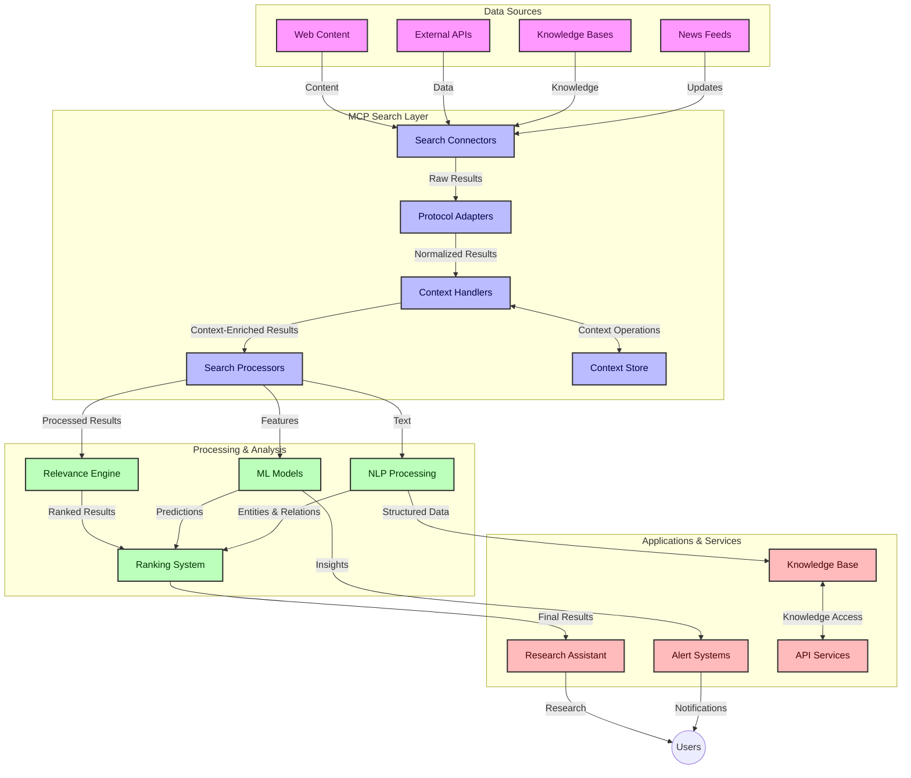
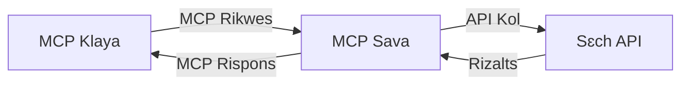
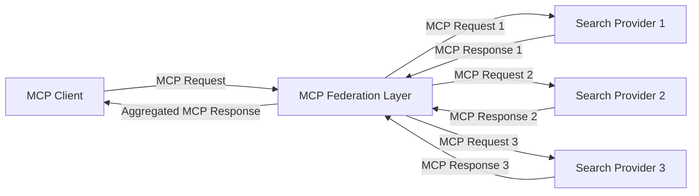
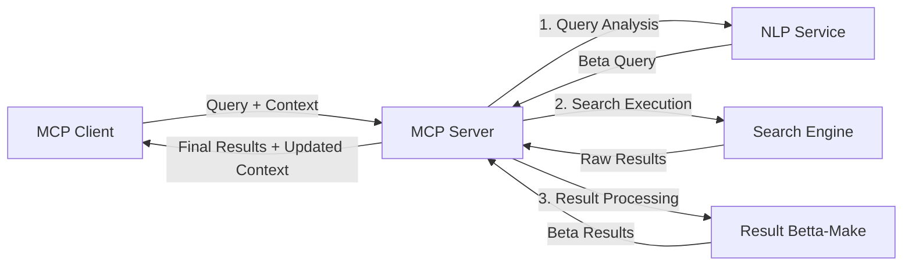

# Model Context Protocol for Real-Time Web Search

## Overview

Real-time web search don turn important for today information-driven world, weh apps need quick access to fresh information from internet to give correct and timely answers. Model Context Protocol (MCP) na big step forward for make these real-time search dem beta, make search dey sharp, maintain context well, and improve how system dey work overall.

Dis module go show how MCP dey change real-time web search by giving one normal way to manage context across AI models, search engines, and apps dem.

### Wetin You Go Learn

For dis full guide, you go sabi:

- How MCP dey make one smooth bridge between AI models and real-time web search ability
- Architectuar patterns dem for how to do beta and scalable search solutions with MCP
- Ways wey you go take keep search context across many queries and interactions
- Real code examples for Python and JavaScript for different kinds search
- How to balance relevance, newness, and performance for MCP-powered search systems

## Introduction to Real-Time Web Search

Real-time web search na technology wey make e possible to dey continuously ask, process, and analyze web information as e dey come or update, so systems fit give fresh and correct information quickly. E different from old traditional search wey dey work on indexed data wey fit be hours or days old; this one dey use live data from web to bring correct information wey reflect the current online content state.

### Core Concepts of Real-Time Web Search:

- **Continuous Query Processing**: Search queries dey processed against data wey dey always update
- **Recency Prioritization**: Systems dey make newly fresh information first
- **Relevance Balancing**: Make sure relevance and newness dey balanced
- **Scalable Architecture**: System suppose fit handle different numbers query and data sizes
- **Contextual Understanding**: Make sure user context dey for all search stages for correct result
- **Dynamic Query Reformulation**: Change queries well-well according to context and previous answers
- **Multi-Source Integration**: Put results from many search providers and web sources together
- **Semantic Understanding**: Process queries and content based on meaning, no just keywords
- **Real-Time Ranking**: Always change result rankings as new info land

### The Model Context Protocol and Real-Time Web Search

Model Context Protocol (MCP) dey solve some big wahala for real-time web search environment:

1. **Search Context Preservation**: MCP dey standardize how context dey keep for all search parts, so AI models and processing nodes fit get correct query history and user preference.

2. **Efficient Query Management**: MCP get structured way to pass context, e reduce how dem go repeat context for each search level.

3. **Interoperability**: MCP dey create one common language for context sharing between different search technology and AI models, e make architecture flexible and fit expand well.

4. **Search-Optimized Context**: MCP fit decide which context parts go help search best, e optimize both performance and accuracy.

5. **Adaptive Search Processing**: If context well managed with MCP, search systems fit change how dem dey work base on user needs wey dey change and information landscape.

For modern apps like news aggregation and research assistants, when MCP join web search technology, e dey make search smart, dey aware of context, and fit give better results as user still dey use am.

## Learning Objectives

By the time dis lesson finish, you go fit:

- Understand basics of real-time web search and wetin e dey try solve for modern app
- Explain how Model Context Protocol (MCP) dey boost real-time web search power
- Do MCP-based search solutions wit popular frameworks and APIs
- Design and run scalable, high-performance search architecture with MCP
- Apply MCP ideas for different use cases like semantic search, research help, and AI-augmented browsing
- Look how trends and future tori dey for MCP-based search technology
- Build context-aware search systems weh fit learn from user interactions
- Join web search power into AI assistants using standardized MCP protocols
- Make multi-stage search pipelines wey dey improve results base on context
- Optimize search performance but still keep full context understanding

### Definition and Significance

Real-time web search na continuous asking, getting, and delivering web info with little delay. Unlike old search engines wey dey crawl and index web once in a while, real-time search dey bring info as soon as e land, e dey give immediate access to fresh content.

Key talking points about real-time web search be:

- **Freshness**: Make fresh content and updates first priority
- **Continuous Processing**: Always dey check for new info
- **Query Adaptation**: Fix search queries based on context and feedback
- **Immediate Delivery**: Give search results quick quick
- **Context Retention**: Continue build on previous queries for better relevance

### Challenges in Traditional Web Search

Old traditional web search get many wahala when dem try use for real-time:

1. **Context Fragmentation**: Hard to keep search context for many queries
2. **Information Freshness**: Wahala to access and put first the newest info
3. **Integration Complexity**: Problem to make different search systems and apps work together
4. **Latency Issues**: Wahala to balance full search and quick response
5. **Relevance Tuning**: Make sure accuracy and relevance still dey even when freshness dey first

## Understanding Model Context Protocol (MCP) for Search

### Wetin MCP mean for Search Contexts?

Model Context Protocol (MCP) na one standardized communication protocol wey make AI models and apps fit interact well. For real-time web search, MCP provide framework wey:

- Dey keep search context through all query sequence
- Standardize how search queries and results dey
- Optimize how search parameters and results dey pass
- Make model and search engine communication beta

### Core Components and Architecture

MCP architecture for real-time web search get these key parts:

1. **Query Context Handlers**: Dem dey manage and keep search context for many queries
2. **Search Processors**: Dem process search requests using context-aware methods
3. **Protocol Adapters**: Convert between different search APIs but keep context
4. **Context Store**: Dem store and fetch search history and user preference well
5. **Search Connectors**: Connect to different search engines and web APIs



### How MCP Improves Real-Time Web Search

MCP dey solve old web search wahala through:

- **Contextual Continuity**: Make relationships between queries continue through whole search time
- **Optimized Transmission**: Cut repeated search parameters through smart context handling
- **Standardized Interfaces**: Provide steady APIs for search parts
- **Reduced Latency**: Cut processing load through efficient context handling
- **Enhanced Relevance**: Make search relevance beta by keeping user mind for many queries

## Integration and Implementation

Real-time web search system need fine design and implementation to keep system sharp and context correct. Model Context Protocol give standard way to join AI models and search technology, make search pipeline beta and context-aware.

### Overview of MCP Integration in Search Architectures

To fit MCP inside real-time search environment, you go need think about:

1. **Search Context Serialization**: MCP get beta way to put context info into search requests, so important context dey with query through processing. E get standard serialization formats wey dey optimized for search metadata.

2. **Stateful Search Processing**: MCP fit make search system dey intelligent and keep stable context for many search rounds. Na beta thing for multi-stage search weh context get to improve results.

3. **Query Expansion and Refinement**: MCP fit make search get beta way to increase or improve query based on collected context, so results go dey more relevant as search session dey go.

4. **Result Caching and Prioritization**: MCP standard way to handle context dey help manage caching and which results go first, make parts fit change base on search context wey dey grow.

5. **Search Federation and Aggregation**: MCP fit join many search tools well by showing search context clearly, e make result aggregation from different places get sense.

Using MCP for different search technology go create one clear way to manage context, reduce how people go write special integration code, and improve how system fit keep meaningful context as search queries change.

### MCP in Various Web Search Implementations

These examples follow current MCP specification wey dey focus on JSON-RPC protocol with different transport ways. Di code show how you fit build custom search integrations wit full MCP protocol support.


<details>
<summary>Python Implementation with Generic Search API</summary>

```python
import asyncio
import json
import aiohttp
from typing import Dict, Any, Optional, List
from contextlib import asynccontextmanager
from collections.abc import AsyncIterator

# Import standard MCP libraries
from mcp.client.session import ClientSession
from mcp.client.streamable_http import streamablehttp_client
from mcp.types import TextContent, CreateMessageRequestParams, CreateMessageResult
from mcp.server.fastmcp import FastMCP

# Create a FastMCP server for web search
search_server = FastMCP("WebSearch")

# Class wey go handle web search operations
class WebSearchHandler:
    def __init__(self, api_endpoint: str, api_key: str):
        self.api_endpoint = api_endpoint
        self.api_key = api_key
        self.session = None
        
    async def initialize(self):
        """Initialize the HTTP session"""
        self.session = aiohttp.ClientSession(
            headers={"Authorization": f"Bearer {self.api_key}"}
        )
    
    async def close(self):
        """Close the HTTP session"""
        if self.session:
            await self.session.close()
            
    async def perform_search(self, query: str, max_results: int = 5, 
                           include_domains: List[str] = None, 
                           exclude_domains: List[str] = None,
                           time_period: str = "any") -> Dict[str, Any]:
        """Perform web search using the search API"""
        # Build search parameters
        search_params = {
            "q": query,
            "limit": max_results,
            "time": time_period
        }
        
        if include_domains:
            search_params["site"] = ",".join(include_domains)
            
        if exclude_domains:
            search_params["exclude_site"] = ",".join(exclude_domains)
        
        # Do the search request
        try:
            async with self.session.get(
                self.api_endpoint,
                params=search_params
            ) as response:
                if response.status != 200:
                    error_text = await response.text()
                    raise Exception(f"Search API error: {response.status} - {error_text}")
                
                search_data = await response.json()
                
                # Change API-specific response to normal format
                results = []
                for item in search_data.get("results", []):
                    results.append({
                        "title": item.get("title", ""),
                        "url": item.get("url", ""),
                        "snippet": item.get("snippet", ""),
                        "date": item.get("published_date", ""),
                        "source": item.get("source", "")
                    })
                
                return {
                    "query": query,
                    "totalResults": len(results),
                    "results": results
                }
        except Exception as e:
            print(f"Search API request error: {e}")
            raise

# Start the search handler
search_handler = WebSearchHandler(
    api_endpoint="https://api.search-service.example/search",
    api_key="your-api-key-here"
)

# Arrange lifespan to manage the search handler
@asyncio.asynccontextmanager
async def app_lifespan(server: FastMCP):
    """Manage application lifecycle"""
    await search_handler.initialize()
    try:
        yield {"search_handler": search_handler}
    finally:
        await search_handler.close()

# Set lifespan for the server
search_server = FastMCP("WebSearch", lifespan=app_lifespan)

# Register one web search tool
@search_server.tool()
async def web_search(query: str, max_results: int = 5, 
                   include_domains: List[str] = None,
                   exclude_domains: List[str] = None,
                   time_period: str = "any") -> Dict[str, Any]:
    """
    Search the web for information
    
    Args:
        query: The search query
        max_results: Maximum number of results to return (default: 5)
        include_domains: List of domains to include in search results
        exclude_domains: List of domains to exclude from search results
        time_period: Time period for results ("day", "week", "month", "any")
        
    Returns:
        Dictionary containing search results
    """
    ctx = search_server.get_context()
    search_handler = ctx.request_context.lifespan_context["search_handler"]
    
    results = await search_handler.perform_search(
        query=query,
        max_results=max_results,
        include_domains=include_domains,
        exclude_domains=exclude_domains,
        time_period=time_period
    )
    
    return results

# Example how client fit use am
async def client_example():
    # Connect to the search server wit Streamable HTTP transport
    async with streamablehttp_client("http://localhost:8000/mcp") as (read, write, _):
        async with ClientSession(read, write) as session:
            # Start the connection
            await session.initialize()
            
            # Call the web_search tool
            search_results = await session.call_tool(
                "web_search", 
                {
                    "query": "latest developments in AI and Model Context Protocol",
                    "max_results": 5,
                    "time_period": "day",
                    "include_domains": ["github.com", "microsoft.com"]
                }
            )
            
            print(f"Search results: {search_results}")

# Example run for server
if __name__ == "__main__":
    # Run the server wit Streamable HTTP transport
    search_server.run(transport="streamable-http")
```
</details> 

<details>
<summary>JavaScript Implementation with Browser-Based Search</summary>


```javascript
// MCP server implementation for web search
import { McpServer, ResourceTemplate } from '@modelcontextprotocol/sdk/server/mcp.js';
import { StreamableHTTPServerTransport } from '@modelcontextprotocol/sdk/server/streamableHttp.js';
import { z } from 'zod';

// Create an MCP server for web search
const searchServer = new McpServer({
    name: "BrowserSearch",
    description: "A server that provides web search capabilities"
});

// Search service class
class SearchService {
    constructor(searchApiUrl, apiKey) {
        this.searchApiUrl = searchApiUrl;
        this.apiKey = apiKey;
    }

    async performSearch(parameters) {
        const {
            query = '',
            maxResults = 5,
            includeDomains = [],
            excludeDomains = [],
            timePeriod = 'any'
        } = parameters;
        
        // Construct search URL with parameters
        const url = new URL(this.searchApiUrl);
        url.searchParams.append('q', query);
        url.searchParams.append('limit', maxResults);
        url.searchParams.append('time', timePeriod);
        
        if (includeDomains.length > 0) {
            url.searchParams.append('site', includeDomains.join(','));
        }
        
        if (excludeDomains.length > 0) {
            url.searchParams.append('exclude_site', excludeDomains.join(','));
        }
        
        try {
            const response = await fetch(url.toString(), {
                method: 'GET',
                headers: {
                    'Authorization': `Bearer ${this.apiKey}`,
                    'Content-Type': 'application/json'
                }
            });
            
            if (!response.ok) {
                const errorText = await response.text();
                throw new Error(`Search API error: ${response.status} - ${errorText}`);
            }
            
            const searchData = await response.json();
            
            // Transform API-specific response to a standard format
            const results = searchData.results?.map(item => ({
                title: item.title || '',
                url: item.url || '',
                snippet: item.snippet || '',
                date: item.published_date || '',
                source: item.source || ''
            })) || [];
            
            return {
                query,
                totalResults: results.length,
                results
            };
        } catch (error) {
            console.error('Search API request error:', error);
            throw error;
        }
    }
}

// Initialize the search service
const searchService = new SearchService(
    'https://api.search-service.example/search',
    'your-api-key-here'
);

// Setup the context provider for the server
searchServer.setContextProvider(() => {
    return {
        searchService
    };
});

// Register web search tool
searchServer.tool({
    name: 'web_search',
    description: 'Search the web for information',
    parameters: {
        type: 'object',
        properties: {
            query: {
                type: 'string',
                description: 'The search query'
            },
            maxResults: {
                type: 'integer',
                description: 'Maximum number of results to return',
                default: 5
            },
            includeDomains: {
                type: 'array',
                items: { type: 'string' },
                description: 'List of domains to include in search results'
            },
            excludeDomains: {
                type: 'array',
                items: { type: 'string' },
                description: 'List of domains to exclude from search results'
            },
            timePeriod: {
                type: 'string',
                description: 'Time period for results',
                enum: ['day', 'week', 'month', 'any'],
                default: 'any'
            }
        },
        required: ['query']
    },
    handler: async (params, context) => {
        const { searchService } = context;
        return await searchService.performSearch(params);
    }
});

// Example client code to connect to the search server
import { Client } from '@modelcontextprotocol/sdk/client/index.js';
import { StreamableHTTPClientTransport } from '@modelcontextprotocol/sdk/client/streamableHttp.js';

async function connectToSearchServer() {
    // Connect to the search server
    const transport = new StreamableHTTPClientTransport(
        new URL('http://localhost:8000/mcp')
    );
    
    const client = new Client({
        name: 'search-client',
        version: '1.0.0'
    });
    
    await client.connect(transport);
    
    // Execute the search tool
    const searchResults = await client.callTool({
        name: 'web_search',
        arguments: {
            query: 'Model Context Protocol implementation examples',
            maxResults: 10,
            timePeriod: 'week',
            includeDomains: ['github.com', 'docs.microsoft.com']
        }
    });
    
    console.log('Search results:', searchResults);
    
    // Cleanup
    await client.disconnect();
}

// Start the server
const transport = new StreamableHTTPServerTransport();
await searchServer.connect(transport);
console.log('Search server running at http://localhost:8000/mcp');

// In a separate process or after server is started
// connectToSearchServer().catch(console.error);
```
</details> 


## Code Examples Disclaimer

> **Important Note**: The code examples wey dey below show how to join Model Context Protocol (MCP) with web search work. Dem follow rules and structure of official MCP SDKs but dem simplify am for teaching purpose.
> 
> These examples show:
> 
> 1. **Python Implementation**: FastMCP server wey get web search tool and fit join external search API. This example dey show how to manage lifespan proper, handle context, and implement tool following [official MCP Python SDK](https://github.com/modelcontextprotocol/python-sdk) pattern. Server dey use Streamable HTTP transport wey na the new recommended way to replace old SSE transport for production.
> 
> 2. **JavaScript Implementation**: TypeScript/JavaScript code using FastMCP pattern from [official MCP TypeScript SDK](https://github.com/modelcontextprotocol/typescript-sdk) to make search server wit correct tool definition and client join. E follow newest patterns for session control and keeping context.
> 
> These examples go need more error handling, authentication, and API code before e fit production. Search API endpoint (`https://api.search-service.example/search`) na example, you need change am to real search URL.
> 
> For full details and newer ways,
> check [official MCP specification](https://modelcontextprotocol.io/specification/2026-07-28/)
> and SDK docs.

## Core Concepts

### The Model Context Protocol (MCP) Framework

For ground level, Model Context Protocol na standard way for AI models, apps, and services to share context. For real-time web search, dis framework important to create clear, multi-turn search experience. Main parts na:

1. **Client-Server Architecture**: MCP make clear difference between search clients (wey dey send request) and search servers (wey dey provide), make deployment flexible.

2. **JSON-RPC Communication**: Protocol dey use JSON-RPC messaging, e fit work with web technology and easy to do on different platform.

3. **Context Management**: MCP get structured methods to keep, update, and take advantage of search context across many interactions.

4. **Tool Definitions**: Search features expose as standard tools wit clear parameters and return results.

5. **Streaming Support**: Protocol fit handle stream results, needed for real-time search wey results fit come small small.

### Web Search Integration Patterns

When MCP dey join web search, some patterns show:

#### 1. Direct Search Provider Integration



For dis pattern, MCP server go directly connect with one or more search APIs, change MCP requests to API calls and format results as MCP responses.

#### 2. Federated Search with Context Preservation



Dis pattern spread search query among many MCP-compatible search providers, each fit specialize for different content or search skill, but still keep one unified context.

#### 3. Context-Enhanced Search Chain



For dis pattern, search na multi-step process, with context dey add for each step, results dey more relevant as e dey go.

### Search Context Components

For MCP-based web search, context normally include:

- **Query History**: Past search queries inside session
- **User Preferences**: Language, area, safe search settings
- **Interaction History**: Which results user click, how long dem spend on results
- **Search Parameters**: Filters, sort order and other search changes
- **Domain Knowledge**: Subject-based context wey relate to search
- **Temporal Context**: Time-based relevance factors
- **Source Preferences**: Information sources wey user trust or prefer

## Use Cases and Applications

### Research and Information Gathering

MCP dey improve research work by:

- Keeping research context through search sessions
- Allow more advanced and context-correct queries
- Support federation of multi-source search
- Make knowledge extraction from search results easy

### Real-Time News and Trend Monitoring

MCP-powered search get advantage for news monitoring:

- Near real-time finding of new news stories
- Context filter for relevant info
- Topic and entity check across many source
- Personalized news alert based on user context

### AI-Augmented Browsing and Research

MCP dey create new chances for AI-augmented browsing:

- Contextual search suggestion based on current browser activity
- Easy join of web search with LLM-powered assistants
- Multi-turn search improvement with context wey dem keep
- Better fact checking and info verification

## Future Trends and Innovations

### Evolution of MCP in Web Search

Looking front, we expect MCP to dey grow to solve:


- **Multimodal Search**: Di way wey text, image, audio, and video search de work together wit context wey dem no lose
- **Decentralized Search**: Support all kinda distributed and federated search systems
- **Search Privacy**: Privacy wey sabi di context wey fit protect your search
- **Query Understanding**: Deep semantic parsing of natural language search queries

### Potential Advancements in Technology

New technologies wey go shape how MCP search go be for future:

1. **Neural Search Architectures**: Embedding-based search systems wey dem optimize for MCP
2. **Personalized Search Context**: Learn how each user de search over time
3. **Knowledge Graph Integration**: Contextual search wey dey plus domain-specific knowledge graphs
4. **Cross-Modal Context**: Make sure say di context steady amongst different search types

## Hands-On Exercises

### Exercise 1: Setting Up a Basic MCP Search Pipeline

For dis exercise, you go learn how to:
- Configure basic MCP search environment
- Implement context handlers for web search
- Test and validate say context no loss as you dey do search again and again

### Exercise 2: Building a Research Assistant with MCP Search

Make one full app wey:
- Process research questions wey use natural language
- Perform search wey sabi context on top web
- Gather information from plenty sources
- Show research results inside organized form

### Exercise 3: Implementing Multi-Source Search Federation with MCP

Advanced exercise wey dey cover:
- Send search queries to many search engines based on context
- Rank and put results together
- Remove duplicate results wey context go show
- Manage source-specific metadata

## Additional Resources

- [Model Context Protocol Specification](https://modelcontextprotocol.io/specification/2026-07-28/) - Official MCP specification and detailed protocol documentation
- [Model Context Protocol Documentation](https://modelcontextprotocol.io/) - Detailed tutorials and implementation guides
- [MCP Python SDK](https://github.com/modelcontextprotocol/python-sdk) - Official Python implementation of the MCP protocol
- [MCP TypeScript SDK](https://github.com/modelcontextprotocol/typescript-sdk) - Official TypeScript implementation of the MCP protocol
- [MCP Reference Servers](https://github.com/modelcontextprotocol/servers) - Reference implementations of MCP servers
- [Bing Web Search API Documentation](https://learn.microsoft.com/en-us/bing/search-apis/bing-web-search/overview) - Microsoft's web search API
- [Google Custom Search JSON API](https://developers.google.com/custom-search/v1/overview) - Google's programmable search engine
- [SerpAPI Documentation](https://serpapi.com/search-api) - Search engine results page API
- [Meilisearch Documentation](https://www.meilisearch.com/docs) - Open-source search engine
- [Elasticsearch Documentation](https://www.elastic.co/guide/index.html) - Distributed search and analytics engine
- [LangChain Documentation](https://python.langchain.com/docs/get_started/introduction) - Building applications with LLMs

## Learning Outcomes

After you don finish dis module, you go fit:

- Understand di basics of real-time web search plus di wahala wey dey come wit am
- Talk how Model Context Protocol (MCP) dey make real-time web search beta
- Use MCP-based search tools using popular frameworks and APIs
- Design and launch scalable, high-performance search systems wit MCP
- Apply MCP ideas to many cases like semantic search, research help, and AI-enhanced browsing
- Check new trends and future ideas for MCP-based search technologies


### Trust and Safety Considerations

When you dey implement MCP-based web search, make you no forget these important rules from MCP specification:

1. **User Consent and Control**: Users must talk yes and understand all di data wey you dey collect and how you dey use am. This one dey important especially for web search wey fit go external data sources.

2. **Data Privacy**: Make sure say you handle search queries and results well, specially if dem get sensitive info. Use correct access control to protect user data.

3. **Tool Safety**: Make sure say you do authorization and validation good for search tools, because dem fit be security risk if dem run bad code. Tool description no to be trusted if no be from trusted server.

4. **Clear Documentation**: Make you get clear docs about wetin your MCP-based search fit do, wetin e no fit do, plus security things, according to MCP specs.

5. **Robust Consent Flows**: Build strong consent and authorization ways wey go clearly explain wetin each tool dey do before you allow am, especially tools wey dey connect with external web resources.

For full details about MCP security and trust matters, check di
[official documentation](https://modelcontextprotocol.io/specification/2026-07-28/basic/security_best_practices).

## Wetin next

- [5.12 Entra ID Authentication for Model Context Protocol Servers](../mcp-security-entra/README.md)

---

<!-- CO-OP TRANSLATOR DISCLAIMER START -->
**Disclaimer**:
Dis document don translate wit AI translation service [Co-op Translator](https://github.com/Azure/co-op-translator). Even tho we dey try make am correct, abeg make you know say automated translation fit get errors or mistakes. Di original document for dia own language na im be di correct source. For important info, make person wey sabi human translation do am. We no go responsible for any misunderstanding or wrong understanding wey fit happen because of dis translation.
<!-- CO-OP TRANSLATOR DISCLAIMER END -->