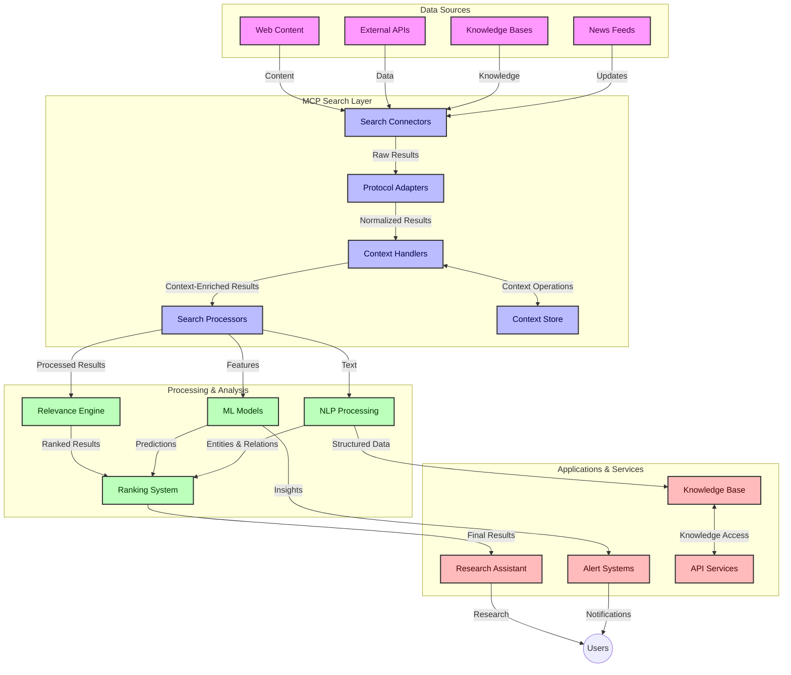
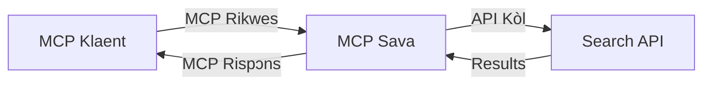
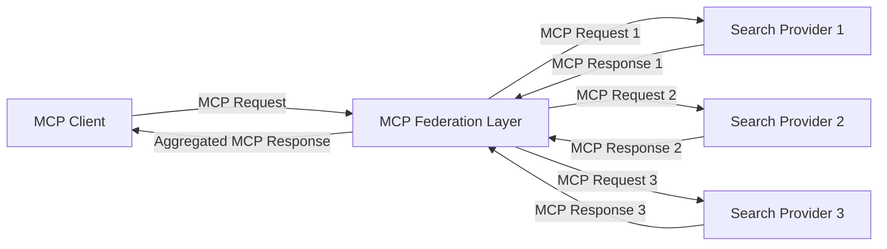
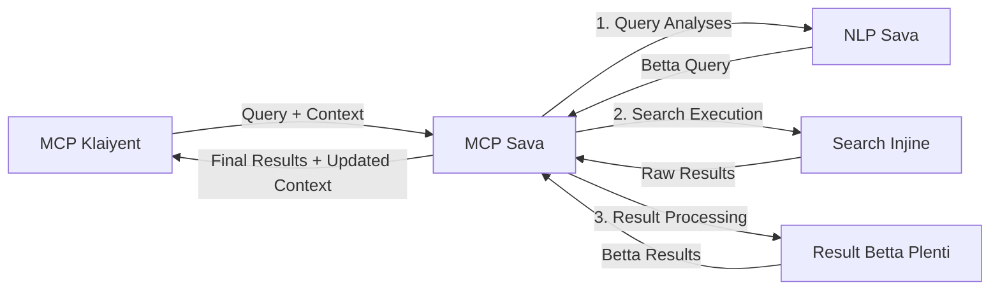

# Model Context Protocol for Real-Time Web Search

## Overview

Real-time web search don turn beta tin for today information-driven environment, wey applications need quick access to fresh fresh information across internet to fit give relevant and timely answers. The Model Context Protocol (MCP) na big advancement wey dey optimize these real-time search processes, dey improve search efficiency, dey maintain contextual integrity, and dey improve overall system performance.

Dis module go explore how MCP dey change real-time web search by providing standardized approach to context management across AI models, search engines, and applications.

### Wetin You Go Learn

For this complete guide, you go discover:

- How MCP dey create smooth bridge between AI models and real-time web search abilities
- Architectural patterns to implement efficient and scalable search solutions with MCP
- Techniques to preserve search context across plenty queries and interactions
- Practical code implementations for Python and JavaScript for different search situations
- Methods to balance relevance, recency, and performance for MCP-powered search systems

## Introduction to Real-Time Web Search

Real-time web search na one technological approach wey dey enable continuous querying, processing, and analysis of web-based information as e dey publish or update, e dey allow systems to provide fresh and relevant information with small small delay. E different from traditional search systems wey dey work on indexed data wey fit don old hours or days, real-time search dey process live data from web, dey deliver insights and information wey show how online content dey for now.

### Core Concepts of Real-Time Web Search:

- **Continuous Query Processing**: Search queries dey process against data sources wey dey update steady
- **Recency Prioritization**: Systems dem dey design to put fresh information first
- **Relevance Balancing**: Make balance between relevance and recency
- **Scalable Architecture**: Systems suppose fit handle different query loads and data volumes
- **Contextual Understanding**: Make user context dey maintain across search steps to get meaningful results
- **Dynamic Query Reformulation**: Modify queries based on context and previous results well well
- **Multi-Source Integration**: Combine results from different search providers and web sources
- **Semantic Understanding**: Process queries and content based on meaning, no be only keywords
- **Real-Time Ranking**: Adjust result rankings steady as new information dey come

### The Model Context Protocol and Real-Time Web Search

The Model Context Protocol (MCP) na solution to many big wahala wey dey real-time web search:

1. **Search Context Preservation**: MCP dey standardize how context dey keep well across distributed search parts, so AI models and processing nodes fit get access to relevant query history and user preferences.

2. **Efficient Query Management**: By providing structured ways to transfer context, MCP dey reduce the stress of always repeating context for every search round.

3. **Interoperability**: MCP dey create one common language for context sharing between different search technologies and AI models, e dey enable more flexible and extensible architectures.

4. **Search-Optimized Context**: MCP implementations fit put first the context elements wey dey most important for effective search, optimizing for performance and accuracy.

5. **Adaptive Search Processing**: With correct context management using MCP, search systems fit adjust processing based on how user need and information environment dey change.

For modern applications from news aggregation to research assistants, when you join MCP with web search technologies, e dey make search smarter, context-aware wey fit give better result as user interactions continue.

## Learning Objectives

By the time you finish this lesson, you go fit:

- Understand the basics of real-time web search and the challenges wey dey modern applications
- Explain how Model Context Protocol (MCP) dey improve real-time web search abilities
- Implement MCP-based search solutions with popular frameworks and APIs
- Design and deploy scalable, high-performance search architectures using MCP
- Apply MCP concepts to different use cases like semantic search, research assistance, and AI-boosted browsing
- Evaluate emerging trends and future innovations for MCP-based search technologies
- Develop context-aware search systems wey dey learn from user interactions
- Integrate web search abilities into AI assistants with standardized MCP protocols
- Create multi-stage search pipelines wey dey progressively improve results based on context
- Optimize search performance while still dey maintain full context awareness

### Definition and Significance

Real-time web search na all time querying, retrieval, and delivery of web-based information with small delay. E different from traditional search engines wey dey crawl and index web sometimes, real-time search dey try show information as e land, to give immediate access to the freshest content.

Key features of real-time web search dey include:

- **Freshness**: Prioritize recent content and updates
- **Continuous Processing**: Always dey watch for new information
- **Query Adaptation**: Adjust search queries based on context and feedback
- **Immediate Delivery**: Give search results fast without much delay
- **Context Retention**: Build on top previous queries for better relevance

### Challenges in Traditional Web Search

Traditional web search ways get many problems when you try use am for real-time:

1. **Context Fragmentation**: Hard to keep search context across many queries
2. **Information Freshness**: Wahala to access and put first the newest information
3. **Integration Complexity**: Problem with how different search systems and applications dey work together
4. **Latency Issues**: Balancing full search and quick response time
5. **Relevance Tuning**: Make sure accuracy and relevance dey while still putting freshness first

## Understanding Model Context Protocol (MCP) for Search

### Wetin MCP mean for Search Contexts?

Model Context Protocol (MCP) na standardized communication protocol wey dem design to enable efficient interaction between AI models and applications. For real-time web search context, MCP provide framework for:

- Keeping search context throughout query sequences
- Standardizing search query and result formats
- Optimizing how search parameters and results dey pass
- Make model-to-search engine communication better

### Core Components and Architecture

MCP architecture for real-time web search get some main parts:

1. **Query Context Handlers**: Manage and keep search context across many queries
2. **Search Processors**: Process search requests using context-aware methods
3. **Protocol Adapters**: Change between different search APIs but still keep context
4. **Context Store**: Store and retrieve search history and preferences well
5. **Search Connectors**: Connect to different search engines and web APIs



### How MCP Dey Improve Real-Time Web Search

MCP dey solve normal web search wahala through:

- **Contextual Continuity**: Keep relationship between queries across whole search session
- **Optimized Transmission**: Reduce repeat for search parameters through smart context management
- **Standardized Interfaces**: Provide consistent APIs for search parts
- **Reduced Latency**: Cut processing load through efficient context handling
- **Enhanced Relevance**: Make search relevance better by keeping user intention across many queries

## Integration and Implementation

Real-time web search systems need careful architecture design and implementation to keep performance and context intact. Model Context Protocol dey give standard way to join AI models and search technologies for more complex, context-aware search systems.

### Overview of MCP Integration in Search Architectures

To implement MCP for real-time web search environments, you go consider these main things:

1. **Search Context Serialization**: MCP get efficient ways to encode context information inside search requests, to make sure important context still dey with query through processing pipeline. E get standard serialization formats wey optimize metadata for search.

2. **Stateful Search Processing**: MCP fit allow smarter stateful processing by keeping consistent context representation across search rounds. This one important for multi-stage search pipelines where context refinement improve results.

3. **Query Expansion and Refinement**: MCP implementations fit help advanced query expansion and refinement based on context wey collect, to give better results as search session dey go.

4. **Result Caching and Prioritization**: By standardizing context handling, MCP fit manage result caching and prioritization, let parts adapt based on how search context dey change.

5. **Search Federation and Aggregation**: MCP fit help advanced federation of search across plenty backends by giving structured ways to show search context, and enable better aggregation of results from many sources.

MCP implementation across different search technologies dey create one way to manage context, e reduce need for custom integration code and still improve system’s ability to keep meaningful context as search queries dey evolve.

### MCP for Different Web Search Implementations

These examples follow the MCP current specification wey focus on JSON-RPC based protocol with different transport mechanisms. The code show how you fit implement custom search integrations and still maintain full compatibility with MCP protocol.


<details>
<summary>Python Implementation with Generic Search API</summary>

```python
import asyncio
import json
import aiohttp
from typing import Dict, Any, Optional, List
from contextlib import asynccontextmanager
from collections.abc import AsyncIterator

# Import standard MCP library dem
from mcp.client.session import ClientSession
from mcp.client.streamable_http import streamablehttp_client
from mcp.types import TextContent, CreateMessageRequestParams, CreateMessageResult
from mcp.server.fastmcp import FastMCP

# Create one FastMCP server for web search
search_server = FastMCP("WebSearch")

# Class wey go handle web search operations
class WebSearchHandler:
    def __init__(self, api_endpoint: str, api_key: str):
        self.api_endpoint = api_endpoint
        self.api_key = api_key
        self.session = None
        
    async def initialize(self):
        """Initialize the HTTP session"""
        self.session = aiohttp.ClientSession(
            headers={"Authorization": f"Bearer {self.api_key}"}
        )
    
    async def close(self):
        """Close the HTTP session"""
        if self.session:
            await self.session.close()
            
    async def perform_search(self, query: str, max_results: int = 5, 
                           include_domains: List[str] = None, 
                           exclude_domains: List[str] = None,
                           time_period: str = "any") -> Dict[str, Any]:
        """Perform web search using the search API"""
        # Build search parameters
        search_params = {
            "q": query,
            "limit": max_results,
            "time": time_period
        }
        
        if include_domains:
            search_params["site"] = ",".join(include_domains)
            
        if exclude_domains:
            search_params["exclude_site"] = ",".join(exclude_domains)
        
        # Make the search request
        try:
            async with self.session.get(
                self.api_endpoint,
                params=search_params
            ) as response:
                if response.status != 200:
                    error_text = await response.text()
                    raise Exception(f"Search API error: {response.status} - {error_text}")
                
                search_data = await response.json()
                
                # Change API-specific response to normal format
                results = []
                for item in search_data.get("results", []):
                    results.append({
                        "title": item.get("title", ""),
                        "url": item.get("url", ""),
                        "snippet": item.get("snippet", ""),
                        "date": item.get("published_date", ""),
                        "source": item.get("source", "")
                    })
                
                return {
                    "query": query,
                    "totalResults": len(results),
                    "results": results
                }
        except Exception as e:
            print(f"Search API request error: {e}")
            raise

# Start the search handler
search_handler = WebSearchHandler(
    api_endpoint="https://api.search-service.example/search",
    api_key="your-api-key-here"
)

# Arrange lifespan to control the search handler
@asyncio.asynccontextmanager
async def app_lifespan(server: FastMCP):
    """Manage application lifecycle"""
    await search_handler.initialize()
    try:
        yield {"search_handler": search_handler}
    finally:
        await search_handler.close()

# Set lifespan for the server
search_server = FastMCP("WebSearch", lifespan=app_lifespan)

# Register one web search tool
@search_server.tool()
async def web_search(query: str, max_results: int = 5, 
                   include_domains: List[str] = None,
                   exclude_domains: List[str] = None,
                   time_period: str = "any") -> Dict[str, Any]:
    """
    Search the web for information
    
    Args:
        query: The search query
        max_results: Maximum number of results to return (default: 5)
        include_domains: List of domains to include in search results
        exclude_domains: List of domains to exclude from search results
        time_period: Time period for results ("day", "week", "month", "any")
        
    Returns:
        Dictionary containing search results
    """
    ctx = search_server.get_context()
    search_handler = ctx.request_context.lifespan_context["search_handler"]
    
    results = await search_handler.perform_search(
        query=query,
        max_results=max_results,
        include_domains=include_domains,
        exclude_domains=exclude_domains,
        time_period=time_period
    )
    
    return results

# Example how client go use am
async def client_example():
    # Connect to the search server with Streamable HTTP transport
    async with streamablehttp_client("http://localhost:8000/mcp") as (read, write, _):
        async with ClientSession(read, write) as session:
            # Start the connection
            await session.initialize()
            
            # Call the web_search tool
            search_results = await session.call_tool(
                "web_search", 
                {
                    "query": "latest developments in AI and Model Context Protocol",
                    "max_results": 5,
                    "time_period": "day",
                    "include_domains": ["github.com", "microsoft.com"]
                }
            )
            
            print(f"Search results: {search_results}")

# Server run example
if __name__ == "__main__":
    # Run the server with Streamable HTTP transport
    search_server.run(transport="streamable-http")
```
</details> 

<details>
<summary>JavaScript Implementation with Browser-Based Search</summary>


```javascript
// MCP server wey dem build for web search
import { McpServer, ResourceTemplate } from '@modelcontextprotocol/sdk/server/mcp.js';
import { StreamableHTTPServerTransport } from '@modelcontextprotocol/sdk/server/streamableHttp.js';
import { z } from 'zod';

// Make MCP server for web search
const searchServer = new McpServer({
    name: "BrowserSearch",
    description: "A server that provides web search capabilities"
});

// Search service class
class SearchService {
    constructor(searchApiUrl, apiKey) {
        this.searchApiUrl = searchApiUrl;
        this.apiKey = apiKey;
    }

    async performSearch(parameters) {
        const {
            query = '',
            maxResults = 5,
            includeDomains = [],
            excludeDomains = [],
            timePeriod = 'any'
        } = parameters;
        
        // Build search URL wit parameters
        const url = new URL(this.searchApiUrl);
        url.searchParams.append('q', query);
        url.searchParams.append('limit', maxResults);
        url.searchParams.append('time', timePeriod);
        
        if (includeDomains.length > 0) {
            url.searchParams.append('site', includeDomains.join(','));
        }
        
        if (excludeDomains.length > 0) {
            url.searchParams.append('exclude_site', excludeDomains.join(','));
        }
        
        try {
            const response = await fetch(url.toString(), {
                method: 'GET',
                headers: {
                    'Authorization': `Bearer ${this.apiKey}`,
                    'Content-Type': 'application/json'
                }
            });
            
            if (!response.ok) {
                const errorText = await response.text();
                throw new Error(`Search API error: ${response.status} - ${errorText}`);
            }
            
            const searchData = await response.json();
            
            // Change API-specific response to one standard format
            const results = searchData.results?.map(item => ({
                title: item.title || '',
                url: item.url || '',
                snippet: item.snippet || '',
                date: item.published_date || '',
                source: item.source || ''
            })) || [];
            
            return {
                query,
                totalResults: results.length,
                results
            };
        } catch (error) {
            console.error('Search API request error:', error);
            throw error;
        }
    }
}

// Start the search service
const searchService = new SearchService(
    'https://api.search-service.example/search',
    'your-api-key-here'
);

// Arrange context provider for di server
searchServer.setContextProvider(() => {
    return {
        searchService
    };
});

// Register web search tool
searchServer.tool({
    name: 'web_search',
    description: 'Search the web for information',
    parameters: {
        type: 'object',
        properties: {
            query: {
                type: 'string',
                description: 'The search query'
            },
            maxResults: {
                type: 'integer',
                description: 'Maximum number of results to return',
                default: 5
            },
            includeDomains: {
                type: 'array',
                items: { type: 'string' },
                description: 'List of domains to include in search results'
            },
            excludeDomains: {
                type: 'array',
                items: { type: 'string' },
                description: 'List of domains to exclude from search results'
            },
            timePeriod: {
                type: 'string',
                description: 'Time period for results',
                enum: ['day', 'week', 'month', 'any'],
                default: 'any'
            }
        },
        required: ['query']
    },
    handler: async (params, context) => {
        const { searchService } = context;
        return await searchService.performSearch(params);
    }
});

// Example client code to join di search server
import { Client } from '@modelcontextprotocol/sdk/client/index.js';
import { StreamableHTTPClientTransport } from '@modelcontextprotocol/sdk/client/streamableHttp.js';

async function connectToSearchServer() {
    // Join di search server
    const transport = new StreamableHTTPClientTransport(
        new URL('http://localhost:8000/mcp')
    );
    
    const client = new Client({
        name: 'search-client',
        version: '1.0.0'
    });
    
    await client.connect(transport);
    
    // Run the search tool
    const searchResults = await client.callTool({
        name: 'web_search',
        arguments: {
            query: 'Model Context Protocol implementation examples',
            maxResults: 10,
            timePeriod: 'week',
            includeDomains: ['github.com', 'docs.microsoft.com']
        }
    });
    
    console.log('Search results:', searchResults);
    
    // Clear up
    await client.disconnect();
}

// Start di server
const transport = new StreamableHTTPServerTransport();
await searchServer.connect(transport);
console.log('Search server running at http://localhost:8000/mcp');

// For another process or after di server don start
// connectToSearchServer().catch(console.error);
```
</details> 


## Code Examples Disclaimer

> **Important Note**: The code examples wey dem show below na to demonstrate how Model Context Protocol (MCP) fit join web search functionality. Even though dem dey follow patterns and structures of the official MCP SDKs, dem don simplify am for educational use.
> 
> These examples dey show:
> 
> 1. **Python Implementation**: A FastMCP server wey provide web search tool and connect to external search API. Dis example show how to manage lifespan well, handle context, and implement tools following pattern of the [official MCP Python SDK](https://github.com/modelcontextprotocol/python-sdk). The server use recommended Streamable HTTP transport wey don replace old SSE transport for production.
> 
> 2. **JavaScript Implementation**: TypeScript/JavaScript implementation wey use FastMCP pattern from the [official MCP TypeScript SDK](https://github.com/modelcontextprotocol/typescript-sdk) to build search server with correct tool definitions and client connections. E follow latest patterns for session management and context keeping.
> 
> These examples need extra error handling, authentication, and API integration before production use. The search API endpoints shown (`https://api.search-service.example/search`) na placeholders, dem need replace with actual search service endpoints.
> 
> For full implementation and latest approaches, abeg check the [official MCP specification](https://spec.modelcontextprotocol.io/) and SDK docs.

## Core Concepts

### The Model Context Protocol (MCP) Framework

For ground level, Model Context Protocol provide standardized way for AI models, applications, and services to exchange context. For real-time web search, dis framework dey key to create coherent, multi-turn search experiences. Main parts include:

1. **Client-Server Architecture**: MCP set clear separation between search clients (people wey dey request) and search servers (people wey dey provide), to allow flexible deployment models.

2. **JSON-RPC Communication**: The protocol use JSON-RPC for message exchange, to make am compatible with web tech and easy to implement for different platforms.

3. **Context Management**: MCP define structured ways to keep, update, and use search context in many interactions.

4. **Tool Definitions**: Search features dey expose as standardized tools with clear parameters and return values.

5. **Streaming Support**: The protocol fit support streaming results, very important for real-time search where results fit come in stages.

### Web Search Integration Patterns

When you join MCP with web search, some patterns dey appear:

#### 1. Direct Search Provider Integration



For this pattern, MCP server go directly talk to one or more search APIs, translate MCP requests to API calls and fit the results to MCP responses.

#### 2. Federated Search with Context Preservation



This pattern dey distribute search queries across multiple MCP-friendly search providers, each fit special in different types of content or search skills, while still dey keep one single context.

#### 3. Context-Enhanced Search Chain



For this pattern, search process dey break into many steps, with context dey improve for every step, result na better answers each time.

### Search Context Components

For MCP-based web search, context usually get:

- **Query History**: Previous search queries for the session
- **User Preferences**: Language, region, safe search settings
- **Interaction History**: Which results user click, time wey dem spend on results
- **Search Parameters**: Filters, sort orders, and other search modifiers
- **Domain Knowledge**: Subject-specific context wey important for the search
- **Temporal Context**: Time-based relevance factors
- **Source Preferences**: Trusted or preferred information sources

## Use Cases and Applications

### Research and Information Gathering

MCP dey improve research workflows by:

- Keeping research context across search sessions
- Making more advanced and context-relevant queries possible
- Supporting multi-source search federation
- Helping knowledge extraction from search results

### Real-Time News and Trend Monitoring

MCP-powered search get better things for news monitoring:

- Near-real-time discovery of new news stories
- Filtering relevant information based on context
- Following topics and entities across many sources
- Personalized news alerts based on user context

### AI-Augmented Browsing and Research

MCP create new chances for AI-augmented browsing:

- Contextual search suggestions based on wetin browser dey do now
- Smooth integration of web search with LLM-powered assistants
- Multi-turn search refinement with context dey keep
- Better fact-checking and information checking

## Future Trends and Innovations

### Evolution of MCP in Web Search

As we dey look front, we believe say MCP go dey evolve to tackle:


- **Multimodal Search**: Join text, image, audio, and video search wit context wey dem still keep
- **Decentralized Search**: Support distributed and federated search ecosystems
- **Search Privacy**: Context-aware privacy-preserving search ways
- **Query Understanding**: Deep semantic parsing of natural language search queries

### Potential Advancements in Technology

New tech wey go shape di future of MCP search:

1. **Neural Search Architectures**: Embedding-based search systems optimized for MCP
2. **Personalized Search Context**: Learning individual user search patterns over time
3. **Knowledge Graph Integration**: Contextual search enhanced by domain-specific knowledge graphs
4. **Cross-Modal Context**: Maintaining context across different search modalities

## Hands-On Exercises

### Exercise 1: Setting Up a Basic MCP Search Pipeline

For dis exercise, you go learn how to:
- Configure basic MCP search environment
- Implement context handlers for web search
- Test and validate say context still dey preserved through search rounds

### Exercise 2: Building a Research Assistant with MCP Search

Create one complete app wey:
- Process natural language research questions
- Perform context-aware web searches
- Synthesize information from multiple sources
- Present organized research findings

### Exercise 3: Implementing Multi-Source Search Federation with MCP

Advanced exercise wey cover:
- Context-aware query dispatching to multiple search engines
- Result ranking and aggregation
- Contextual deduplication of search results
- Handling source-specific metadata

## Additional Resources

- [Model Context Protocol Specification](https://spec.modelcontextprotocol.io/) - Official MCP specification and detailed protocol documentation
- [Model Context Protocol Documentation](https://modelcontextprotocol.io/) - Detailed tutorials and implementation guides
- [MCP Python SDK](https://github.com/modelcontextprotocol/python-sdk) - Official Python implementation of the MCP protocol
- [MCP TypeScript SDK](https://github.com/modelcontextprotocol/typescript-sdk) - Official TypeScript implementation of the MCP protocol
- [MCP Reference Servers](https://github.com/modelcontextprotocol/servers) - Reference implementations of MCP servers
- [Bing Web Search API Documentation](https://learn.microsoft.com/en-us/bing/search-apis/bing-web-search/overview) - Microsoft's web search API
- [Google Custom Search JSON API](https://developers.google.com/custom-search/v1/overview) - Google's programmable search engine
- [SerpAPI Documentation](https://serpapi.com/search-api) - Search engine results page API
- [Meilisearch Documentation](https://www.meilisearch.com/docs) - Open-source search engine
- [Elasticsearch Documentation](https://www.elastic.co/guide/index.html) - Distributed search and analytics engine
- [LangChain Documentation](https://python.langchain.com/docs/get_started/introduction) - Building applications with LLMs

## Learning Outcomes

If you finish dis module, you go fit:

- Understand di fundamentals of real-time web search and e wahala
- Explain how the Model Context Protocol (MCP) dey improve real-time web search power
- Use MCP-based search solutions with popular frameworks and APIs
- Design and deploy bigger, high-performance search architectures wit MCP
- Apply MCP concepts to different uses like semantic search, research assistance, and AI-augmented browsing
- Check new trends and future innovations for MCP-based search technologies


### Trust and Safety Considerations

When you dey implement MCP-based web search solutions, remember these important principles from MCP specification:

1. **User Consent and Control**: Users must give clear permission and sabi wetin all data access and operations dey mean. Dis one important well-well for web search wey fit access data from outside.

2. **Data Privacy**: Make sure you handle search queries and results well, especially if dem fit get sensitive info. Put correct access controls to protect user data.

3. **Tool Safety**: Make sure authorization and validation dey for search tools, because dem fit be security risk if dem run bad code. No trust tool behavior story unless e come from trusted server.

4. **Clear Documentation**: Give clear documentation about wetin your MCP-based search fit do, wetin e no fit do, and security tori, follow the guidelines from MCP specification.

5. **Robust Consent Flows**: Build strong consent and authorization process wey clear tell wetin each tool fit do before you authorize am, especially for tools wey go touch external web resources.

For full details on MCP security and trust matters, check the [official documentation](https://modelcontextprotocol.io/specification/2025-11-25/basic/security_best_practices).

## Wetin next

- [5.12 Entra ID Authentication for Model Context Protocol Servers](../mcp-security-entra/README.md)

---

<!-- CO-OP TRANSLATOR DISCLAIMER START -->
**Disclaimer**:
Dis document don translate wit AI translation service [Co-op Translator](https://github.com/Azure/co-op-translator). Even tho we dey try make am correct, abeg make you know say automated translation fit get errors or mistakes. Di original document for dia own language na im be di correct source. For important info, make person wey sabi human translation do am. We no go responsible for any misunderstanding or wrong understanding wey fit happen because of dis translation.
<!-- CO-OP TRANSLATOR DISCLAIMER END -->