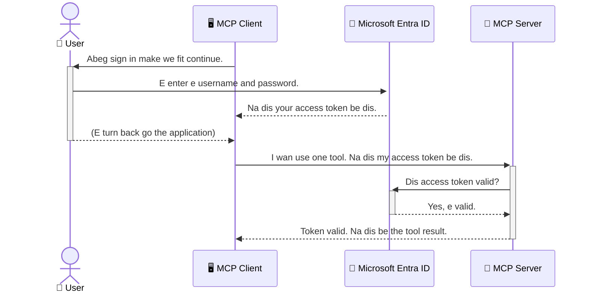

# Securing AI Workflows: Entra ID Authentication for Model Context Protocol Servers

> [!NOTE]
> Di remote server code for dis lesson dey protect legacy `/sse` and `/message`
> endpoints and dem target MCP `2025-11-25`. Make you keep di identity and token-validation
> practices, but use `2026-07-28`-compatible Streamable HTTP transport for new
> implementations.

## Introduction
Securing your Model Context Protocol (MCP) server dey important like to lock your house front door. If you leave your MCP server open, e fit expose your tools and data make anybody fit access am, wey fit lead to security problems. Microsoft Entra ID na strong cloud-based identity and access management solution wey dey help make sure say only authorized users and applications fit interact with your MCP server. For dis section, you go learn how to protect your AI workflows using Entra ID authentication.

## Learning Objectives
By di end of dis section, you go fit:

- Understand why e important to secure MCP servers.
- Explain basics of Microsoft Entra ID and OAuth 2.0 authentication.
- Recognize di difference between public and confidential clients.
- Implement Entra ID authentication for both local (public client) and remote (confidential client) MCP server cases.
- Apply security best practices when you dey develop AI workflows.

## Security and MCP

Just like you no go leave your house front door open, you no suppose leave your MCP server open make anybody enter. Securing your AI workflows na essential matter if you want build strong, trustworthy, and safe applications. Dis chapter go show you how to use Microsoft Entra ID to secure your MCP servers, make sure say only authorized users and applications fit interact with your tools and data.

## Why Security Matter for MCP Servers

Imagine say your MCP server get tool wey fit send emails or access customer database. If di server no secured, anybody fit use dat tool, wey fit lead to unauthorized data access, spam, or bad bad tins.

By putting authentication, you dey sure say every request to your server na verified one, and e confirm di identity of di user or application wey dey request am. Dis na di first and most important step to secure your AI workflows.

## Introduction to Microsoft Entra ID

[**Microsoft Entra ID**](https://adoption.microsoft.com/microsoft-security/entra/) na cloud-based identity and access management service. Think am like universal security guard for your applications. E dey manage di complex process to verify user identities (authentication) and decide wetin dem fit do (authorization).

By using Entra ID, you fit:

- Enable secure sign-in for users.
- Protect APIs and services.
- Manage access policies from one central place.

For MCP servers, Entra ID dey provide strong and widely-trusted solution to manage who fit access your server's capabilities.

---

## Understanding di Magic: How Entra ID Authentication Dey Work

Entra ID dey use open standards like **OAuth 2.0** to handle authentication. Even though di details fit hard, di main idea simple and fit understand am with example.

### A Gentle Introduction to OAuth 2.0: Di Valet Key

Think of OAuth 2.0 like valet service for your car. When you reach restaurant, you no go give valet your master key. Instead, you go give **valet key** wey get limited permissions—e fit start di car and lock di doors, but e no fit open di trunk or glove compartment.

For dis example:

- **You** be di **User**.
- **Your car** na di **MCP Server** with im valuable tools and data.
- Di **Valet** na **Microsoft Entra ID**.
- Di **Parking Attendant** na di **MCP Client** (di application wey dey try access di server).
- Di **Valet Key** na **Access Token**.

Di access token na secure string of text wey di MCP client go get from Entra ID after you sign in. Di client go show dis token give MCP server whenever e make request. Di server fit check di token to know say di request legit and di client get necessary permissions, without handling your real credentials (like your password).

### Di Authentication Process

Dis na how e dey work for practice:



### Introducing di Microsoft Authentication Library (MSAL)

Before we start with code, e important make we introduce one key thing you go see for di examples: **Microsoft Authentication Library (MSAL)**.

MSAL na library wey Microsoft develop to make am easy for developers to handle authentication. Instead make you write all di complex code to handle security tokens, manage sign-ins, and refresh session, MSAL dey do all di heavy work.

Using library like MSAL na better choice because:

- **E Secure:** E implement industry-standard protocols and security best practices, to reduce risk of vulnerabilities for your code.
- **E Simplify Development:** E hide di wahala of OAuth 2.0 and OpenID Connect protocols, make you fit add strong authentication to your application with just few lines of code.
- **E Maintained:** Microsoft dey actively maintain and update MSAL to handle new security threats and platform changes.

MSAL dey support many languages and application frameworks, including .NET, JavaScript/TypeScript, Python, Java, Go, and mobile platforms like iOS and Android. That one mean say you fit use same consistent authentication style for your entire technology stack.

To learn more about MSAL, you fit check di official [MSAL overview documentation](https://learn.microsoft.com/entra/identity-platform/msal-overview).

---

## Securing Your MCP Server with Entra ID: Step-by-Step Guide

Now, make we waka through how to secure local MCP server (one wey dey communicate over `stdio`) using Entra ID. This example use **public client**, wey dey good for applications wey dey run on user machine, like desktop app or local development server.

### Scenario 1: Securing Local MCP Server (with Public Client)

For dis one, we go see MCP server wey dey run local, dey communicate over `stdio`, and e use Entra ID to authenticate user before e allow access to tools. Di server go get one tool wey fit fetch user's profile info from Microsoft Graph API.

#### 1. Setting Up di Application for Entra ID

Before you start write code, you need register your application for Microsoft Entra ID. Dis go tell Entra ID about your app and grant am permission to use di authentication service.

1. Go to **[Microsoft Entra portal](https://entra.microsoft.com/)**.
2. Go to **App registrations** and click **New registration**.
3. Give your app name (e.g., "My Local MCP Server").
4. For **Supported account types**, select **Accounts in this organizational directory only**.
5. You fit leave **Redirect URI** blank for this example.
6. Click **Register**.

After registration, remember your **Application (client) ID** and **Directory (tenant) ID**. You go need dem for your code.

#### 2. The Code: Breakdown

Make we look di important parts of di code wey handle authentication. Full code for dis example dey the [Entra ID - Local - WAM](https://github.com/Azure-Samples/mcp-auth-servers/tree/main/src/entra-id-local-wam) folder for [mcp-auth-servers GitHub repository](https://github.com/Azure-Samples/mcp-auth-servers).

**`AuthenticationService.cs`**

Dis class get responsibility to handle interaction with Entra ID.

- **`CreateAsync`**: Dis method dey initialize `PublicClientApplication` from MSAL (Microsoft Authentication Library). E configure with your application's `clientId` and `tenantId`.
- **`WithBroker`**: Dis one enable use broker (like Windows Web Account Manager), wey dey provide secure and smooth single sign-on experience.
- **`AcquireTokenAsync`**: Dis na di main method. E first try to get token silently (meaning user no go need sign in again if dem get valid session). If no silent token dey, e go prompt user to sign in interactively.

```csharp
// Simplified for clarity
public static async Task<AuthenticationService> CreateAsync(ILogger<AuthenticationService> logger)
{
    var msalClient = PublicClientApplicationBuilder
        .Create(_clientId) // Your Application (client) ID
        .WithAuthority(AadAuthorityAudience.AzureAdMyOrg)
        .WithTenantId(_tenantId) // Your Directory (tenant) ID
        .WithBroker(new BrokerOptions(BrokerOptions.OperatingSystems.Windows))
        .Build();

    // ... cache registration ...

    return new AuthenticationService(logger, msalClient);
}

public async Task<string> AcquireTokenAsync()
{
    try
    {
        // Try silent authentication first
        var accounts = await _msalClient.GetAccountsAsync();
        var account = accounts.FirstOrDefault();

        AuthenticationResult? result = null;

        if (account != null)
        {
            result = await _msalClient.AcquireTokenSilent(_scopes, account).ExecuteAsync();
        }
        else
        {
            // If no account, or silent fails, go interactive
            result = await _msalClient.AcquireTokenInteractive(_scopes).ExecuteAsync();
        }

        return result.AccessToken;
    }
    catch (Exception ex)
    {
        _logger.LogError(ex, "An error occurred while acquiring the token.");
        throw; // Optionally rethrow the exception for higher-level handling
    }
}
```

**`Program.cs`**

Dis na where MCP server dey set up and where authentication service join.

- **`AddSingleton<AuthenticationService>`**: Dis one dey register `AuthenticationService` with dependency injection container, so other parts of application (like our tool) fit use am.
- **`GetUserDetailsFromGraph` tool**: Dis tool need `AuthenticationService` instance. Before e start work, e go call `authService.AcquireTokenAsync()` to get valid access token. If authentication successful, e go use token call Microsoft Graph API to fetch user details.

```csharp
// Simplified for clarity
[McpServerTool(Name = "GetUserDetailsFromGraph")]
public static async Task<string> GetUserDetailsFromGraph(
    AuthenticationService authService)
{
    try
    {
        // This will trigger the authentication flow
        var accessToken = await authService.AcquireTokenAsync();

        // Use the token to create a GraphServiceClient
        var graphClient = new GraphServiceClient(
            new BaseBearerTokenAuthenticationProvider(new TokenProvider(authService)));

        var user = await graphClient.Me.GetAsync();

        return System.Text.Json.JsonSerializer.Serialize(user);
    }
    catch (Exception ex)
    {
        return $"Error: {ex.Message}";
    }
}
```

#### 3. How E Dey Work Together

1. When MCP client wan use `GetUserDetailsFromGraph` tool, di tool first call `AcquireTokenAsync`.
2. `AcquireTokenAsync` go make MSAL library check for valid token.
3. If no token dey, MSAL through broker, go prompt user to sign in with Entra ID account.
4. After user sign in, Entra ID go issue access token.
5. Di tool go receive token and use am to make secure call to Microsoft Graph API.
6. Di user's details go return to MCP client.

Dis process dey make sure say only authenticated users fit use di tool, and e secure your local MCP server well.

### Scenario 2: Securing Remote MCP Server (with Confidential Client)

When your MCP server dey run for remote machine (like cloud server) and e dey use protocol like HTTP Streaming, security need different approach. For dis case, you suppose use **confidential client** and **Authorization Code Flow**. Dis one na more secure way because application secrets no go ever show for browser.

Dis example use TypeScript-based MCP server wey use Express.js to handle HTTP requests.

#### 1. Setting Up di Application for Entra ID

Di setup for Entra ID similar to public client one, but one key difference: you need create **client secret**.

1. Go to **[Microsoft Entra portal](https://entra.microsoft.com/)**.
2. For your app registration, go to **Certificates & secrets** tab.
3. Click **New client secret**, give description, and click **Add**.
4. **Important:** Copy secret value immediately. You no go fit see am again.
5. You also need configure **Redirect URI**. Go to **Authentication** tab, click **Add a platform**, select **Web**, and put your redirect URI for application (example, `http://localhost:3001/auth/callback`).

> **⚠️ Important Security Note:** For production applications, Microsoft strongly recommend make use **secretless authentication** methods like **Managed Identity** or **Workload Identity Federation** instead of client secrets. Client secrets get security risks because dem fit show or get compromised. Managed identities provide more secure way because dem no need make you store credentials for your code or config.
>
> For more info about managed identities and how to implement dem, check [Managed identities for Azure resources overview](https://learn.microsoft.com/entra/identity/managed-identities-azure-resources/overview).

#### 2. The Code: Breakdown

Dis example dey use session-based approach. When user authenticate, server go store access token and refresh token inside session and give user session token. Dis session token na wetin dem go use for next requests. Full code for dis example dey [Entra ID - Confidential client](https://github.com/Azure-Samples/mcp-auth-servers/tree/main/src/entra-id-cca-session) folder for [mcp-auth-servers GitHub repository](https://github.com/Azure-Samples/mcp-auth-servers).

**`Server.ts`**

Dis file dey set up Express server and MCP transport layer.

- **`requireBearerAuth`**: Dis na middleware wey dey protect `/sse` and `/message` endpoints. E dey check for valid bearer token inside `Authorization` header of request.
- **`EntraIdServerAuthProvider`**: Dis na custom class wey implement `McpServerAuthorizationProvider` interface. E dey responsible for handling OAuth 2.0 flow.
- **`/auth/callback`**: Dis endpoint dey handle redirect from Entra ID after user authenticate. E go exchange authorization code for access token and refresh token.

```typescript
// Make am easy to understand
const app = express();
const { server } = createServer();
const provider = new EntraIdServerAuthProvider();

// Guard the SSE endpoint
app.get("/sse", requireBearerAuth({
  provider,
  requiredScopes: ["User.Read"]
}), async (req, res) => {
  // ... connect to the transport ...
});

// Guard the message endpoint
app.post("/message", requireBearerAuth({
  provider,
  requiredScopes: ["User.Read"]
}), async (req, res) => {
  // ... handle the message ...
});

// Handle the OAuth 2.0 return call
app.get("/auth/callback", (req, res) => {
  provider.handleCallback(req.query.code, req.query.state)
    .then(result => {
      // ... handle success or failure ...
    });
});
```

**`Tools.ts`**

Dis file dey define tools wey MCP server provide. Di `getUserDetails` tool be like di one for previous example, but now e dey get access token from session.

```typescript
// Make am easy to understand
server.setRequestHandler(CallToolRequestSchema, async (request) => {
  const { name } = request.params;
  const context = request.params?.context as { token?: string } | undefined;
  const sessionToken = context?.token;

  if (name === ToolName.GET_USER_DETAILS) {
    if (!sessionToken) {
      throw new AuthenticationError("Authentication token is missing or invalid. Ensure the token is provided in the request context.");
    }

    // Collect di Entra ID token from di session store
    const tokenData = tokenStore.getToken(sessionToken);
    const entraIdToken = tokenData.accessToken;

    const graphClient = Client.init({
      authProvider: (done) => {
        done(null, entraIdToken);
      }
    });

    const user = await graphClient.api('/me').get();

    // ... return user information ...
  }
});
```

**`auth/EntraIdServerAuthProvider.ts`**

Dis class dey handle logic for:

- Redirect user to Entra ID sign-in page.
- Exchange authorization code for access token.
- Store tokens in `tokenStore`.
- Refresh access token when e expire.


#### 3. How E Dey Work Together

1. Wen person wan connect to MCP server di first taim, di `requireBearerAuth` middleware go check say dem no get valid session and e go redirect dem go Entra ID sign-in page.
2. Di person sign in wit dia Entra ID account.
3. Entra ID go redirect di person back to di `/auth/callback` endpoint wit authorization code.
4. Di server go exchange di code for access token and refresh token, save dem, and create session token wey dem go send to di client.
5. Di client fit now use dis session token for `Authorization` header for all future requests to di MCP server.
6. Wen dem call di `getUserDetails` tool, e go use di session token find di Entra ID access token then use am call Microsoft Graph API.

Dis flow complex pass di public client flow, but na e dem dey need for internet-facing endpoints. Since remote MCP servers dey available for public internet, dem need beta security to protect dem from unauthorized access and possible attacks.


## Security Best Practices

- **Always use HTTPS**: Encrypt communication between di client and server to protect tokens from being intercepted.
- **Implement Role-Based Access Control (RBAC)**: No just check *if* person authenticate; check *wetin* dem fit do. You fit define roles for Entra ID and check dem for your MCP server.
- **Monitor and audit**: Log all authentication events so you fit sabi and respond to suspicious activity.
- **Handle rate limiting and throttling**: Microsoft Graph and other APIs dey do rate limiting to prevent abuse. Use exponential backoff and retry logic for your MCP server to handle HTTP 429 (Too Many Requests) responses well well. You fit plan to cache data wey people dey access often to reduce API calls.
- **Secure token storage**: Store access tokens and refresh tokens secure. For local apps, use di system secure storage mechanisms. For server apps, you fit use encrypted storage or secure key management services like Azure Key Vault.
- **Token expiration handling**: Access tokens no dey last forever. Use automatic token refresh wit refresh tokens to make sure user no need to sign in again.
- **Consider using Azure API Management**: Even though you fit implement security for your MCP server direct for fine control, API Gateways like Azure API Management fit handle many security mata automatically, including authentication, authorization, rate limiting, and monitoring. Dem dey as centralized security layer wey dey between your clients and MCP servers. For more detail on how to use API Gateways with MCP, see our [Azure API Management Your Auth Gateway For MCP Servers](https://techcommunity.microsoft.com/blog/integrationsonazureblog/azure-api-management-your-auth-gateway-for-mcp-servers/4402690).


##  Key Takeaways

- Make sure say your MCP server get beta security to protect your data and tools.
- Microsoft Entra ID dey provide strong and scalable solution for authentication and authorization.
- Use **public client** for local apps and **confidential client** for remote servers.
- **Authorization Code Flow** na di safest option for web apps.


## Exercise

1. Think about MCP server wey you fit build. E go be local server or remote server?
2. Based on your answer, you go use public or confidential client?
3. Wetin permissions your MCP server go request to perform actions on Microsoft Graph?


## Hands-on Exercises

### Exercise 1: Register Application for Entra ID
Go Microsoft Entra portal.
Register new application for your MCP server.
Write down di Application (client) ID and Directory (tenant) ID.

### Exercise 2: Secure Local MCP Server (Public Client)
- Follow di code example to add MSAL (Microsoft Authentication Library) for user authentication.
- Test authentication flow by calling MCP tool wey dey fetch user details from Microsoft Graph.

### Exercise 3: Secure Remote MCP Server (Confidential Client)
- Register confidential client for Entra ID and create client secret.
- Configure your Express.js MCP server to use Authorization Code Flow.
- Test protected endpoints and confirm di token-based access.

### Exercise 4: Apply Security Best Practices
- Enable HTTPS for your local or remote server.
- Implement role-based access control (RBAC) for your server logic.
- Add token expiration handling and secure token storage.

## Resources

1. **MSAL Overview Documentation**  
   Learn how Microsoft Authentication Library (MSAL) dey enable secure token acquisition across platforms:  
   [MSAL Overview on Microsoft Learn](https://learn.microsoft.com/en-gb/entra/msal/overview)

2. **Azure-Samples/mcp-auth-servers GitHub Repository**  
   Reference implementations of MCP servers wey dey show authentication flows:  
   [Azure-Samples/mcp-auth-servers on GitHub](https://github.com/Azure-Samples/mcp-auth-servers)

3. **Managed Identities for Azure Resources Overview**  
   Understand how to remove secrets by using system- or user-assigned managed identities:  
   [Managed Identities Overview on Microsoft Learn](https://learn.microsoft.com/en-us/entra/identity/managed-identities-azure-resources/)

4. **Azure API Management: Your Auth Gateway for MCP Servers**  
   Deep dive into how to use APIM as secure OAuth2 gateway for MCP servers:  
   [Azure API Management Your Auth Gateway For MCP Servers](https://techcommunity.microsoft.com/blog/integrationsonazureblog/azure-api-management-your-auth-gateway-for-mcp-servers/4402690)

5. **Microsoft Graph Permissions Reference**  
   Full list of delegated and application permissions for Microsoft Graph:  
   [Microsoft Graph Permissions Reference](https://learn.microsoft.com/zh-tw/graph/permissions-reference)


## Learning Outcomes
After you finish this section, you go fit:

- Talk why authentication na important for MCP servers and AI workflows.
- Setup and configure Entra ID authentication for local and remote MCP server cases.
- Choose correct client type (public or confidential) base on how you deploy your server.
- Implement secure coding practices, like token storage and role-based authorization.
- Confidently protect your MCP server and tools from unauthorized access.

## Wetin Next 

- [5.13 Model Context Protocol (MCP) Integration with Microsoft Foundry](../mcp-foundry-agent-integration/README.md)

---

<!-- CO-OP TRANSLATOR DISCLAIMER START -->
**Disclaimer**:
Dis document don translate wit AI translation service [Co-op Translator](https://github.com/Azure/co-op-translator). Even tho we dey try make am correct, abeg make you know say automated translation fit get errors or mistakes. Di original document for dia own language na im be di correct source. For important info, make person wey sabi human translation do am. We no go responsible for any misunderstanding or wrong understanding wey fit happen because of dis translation.
<!-- CO-OP TRANSLATOR DISCLAIMER END -->