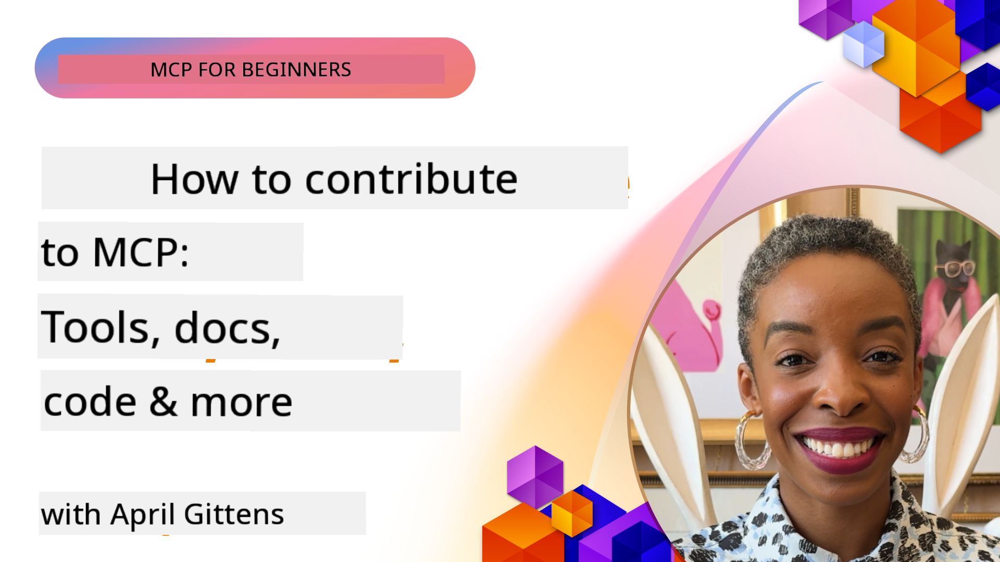

<!--
CO_OP_TRANSLATOR_METADATA:
{
  "original_hash": "fcf1e12b62102bf7d16b78deb2b163b7",
  "translation_date": "2025-11-18T19:27:11+00:00",
  "source_file": "06-CommunityContributions/README.md",
  "language_code": "pcm"
}
-->
# Community and Contributions

[](https://youtu.be/v1pvCYAWpRE)

_(Click di image wey dey up to watch di video for dis lesson)_

## Overview

Dis lesson go show you how you fit join di MCP community, contribute to di MCP ecosystem, and follow di best ways to work together. To sabi how to join open-source MCP projects na di key for anybody wey wan help shape di future of dis technology.

## Learning Objectives

By di end of dis lesson, you go fit:

- Sabi how di MCP community and ecosystem dey structured
- Join MCP community forums and discussions well
- Contribute to MCP open-source repositories
- Create and share your own MCP tools and servers
- Follow di best ways to develop and collaborate for MCP
- Find community resources and frameworks for MCP development

## Di MCP Community Ecosystem

Di MCP ecosystem get different parts and people wey dey work together to push di protocol go front.

### Key Community Components

1. **Core Protocol Maintainers**: Di official [Model Context Protocol GitHub organization](https://github.com/modelcontextprotocol) dey maintain di main MCP specifications and reference implementations.
2. **Tool Developers**: Na people and teams wey dey create MCP tools and servers.
3. **Integration Providers**: Companies wey dey put MCP inside dia products and services.
4. **End Users**: Developers and organizations wey dey use MCP for dia applications.
5. **Contributors**: Community members wey dey add code, documentation, or other resources.

### Community Resources

#### Official Channels

- [MCP GitHub Organization](https://github.com/modelcontextprotocol)
- [MCP Documentation](https://modelcontextprotocol.io/)
- [MCP Specification](https://modelcontextprotocol.io/docs/specification)
- [GitHub Discussions](https://github.com/orgs/modelcontextprotocol/discussions)
- [MCP Examples & Servers Repository](https://github.com/modelcontextprotocol/servers)

#### Community-Driven Resources

- [MCP Clients](https://modelcontextprotocol.io/clients) - List of clients wey dey support MCP integrations.
- [Community MCP Servers](https://github.com/modelcontextprotocol/servers?tab=readme-ov-file#-community-servers) - List of MCP servers wey di community don develop.
- [Awesome MCP Servers](https://github.com/wong2/awesome-mcp-servers) - Curated list of MCP servers.
- [PulseMCP](https://www.pulsemcp.com/) - Community hub & newsletter to find MCP resources.
- [Discord Server](https://discord.gg/jHEGxQu2a5) - Connect with MCP developers.
- Language-specific SDK implementations.
- Blog posts and tutorials.

## Contributing to MCP

### Types of Contributions

Di MCP ecosystem dey welcome different kinds of contributions:

1. **Code Contributions**:
   - Improve di core protocol
   - Fix bugs
   - Create tools and servers
   - Build client/server libraries for different languages

2. **Documentation**:
   - Make di existing documentation better
   - Create tutorials and guides
   - Translate documentation
   - Create examples and sample applications

3. **Community Support**:
   - Answer questions for forums and discussions
   - Test and report issues
   - Organize community events
   - Mentor new contributors

### Contribution Process: Core Protocol

If you wan contribute to di core MCP protocol or official implementations, follow di principles wey dey for di [official contributing guidelines](https://github.com/modelcontextprotocol/modelcontextprotocol/blob/main/CONTRIBUTING.md):

1. **Simplicity and Minimalism**: Di MCP specification dey strict about adding new concepts. E easy to add something to di specification pass to remove am.
2. **Concrete Approach**: Changes for di specification suppose base on real implementation challenges, no be just ideas wey no get ground.
3. **Stages of a Proposal**:
   - Define: Check di problem well, confirm say other MCP users dey face di same issue.
   - Prototype: Build example solution and show how e go work.
   - Write: Use di prototype take write di specification proposal.

### Development Environment Setup

```bash
# Fork the repository
git clone https://github.com/YOUR-USERNAME/modelcontextprotocol.git
cd modelcontextprotocol

# Install dependencies
npm install

# For schema changes, validate and generate schema.json:
npm run check:schema:ts
npm run generate:schema

# For documentation changes
npm run check:docs
npm run format

# Preview documentation locally (optional):
npm run serve:docs
```

### Example: Contributing a Bug Fix

```javascript
// Original code with bug in the typescript-sdk
export function validateResource(resource: unknown): resource is MCPResource {
  if (!resource || typeof resource !== 'object') {
    return false;
  }
  
  // Bug: Missing property validation
  // Current implementation:
  const hasName = 'name' in resource;
  const hasSchema = 'schema' in resource;
  
  return hasName && hasSchema;
}

// Fixed implementation in a contribution
export function validateResource(resource: unknown): resource is MCPResource {
  if (!resource || typeof resource !== 'object') {
    return false;
  }
  
  // Improved validation
  const hasName = 'name' in resource && typeof (resource as MCPResource).name === 'string';
  const hasSchema = 'schema' in resource && typeof (resource as MCPResource).schema === 'object';
  const hasDescription = !('description' in resource) || typeof (resource as MCPResource).description === 'string';
  
  return hasName && hasSchema && hasDescription;
}
```

### Example: Contributing a New Tool to the Standard Library

```python
# Example contribution: A CSV data processing tool for the MCP standard library

from mcp_tools import Tool, ToolRequest, ToolResponse, ToolExecutionException
import pandas as pd
import io
import json
from typing import Dict, Any, List, Optional

class CsvProcessingTool(Tool):
    """
    Tool for processing and analyzing CSV data.
    
    This tool allows models to extract information from CSV files,
    run basic analysis, and convert data between formats.
    """
    
    def get_name(self):
        return "csvProcessor"
        
    def get_description(self):
        return "Processes and analyzes CSV data"
    
    def get_schema(self):
        return {
            "type": "object",
            "properties": {
                "csvData": {
                    "type": "string", 
                    "description": "CSV data as a string"
                },
                "csvUrl": {
                    "type": "string",
                    "description": "URL to a CSV file (alternative to csvData)"
                },
                "operation": {
                    "type": "string",
                    "enum": ["summary", "filter", "transform", "convert"],
                    "description": "Operation to perform on the CSV data"
                },
                "filterColumn": {
                    "type": "string",
                    "description": "Column to filter by (for filter operation)"
                },
                "filterValue": {
                    "type": "string",
                    "description": "Value to filter for (for filter operation)"
                },
                "outputFormat": {
                    "type": "string",
                    "enum": ["json", "csv", "markdown"],
                    "default": "json",
                    "description": "Output format for the processed data"
                }
            },
            "oneOf": [
                {"required": ["csvData", "operation"]},
                {"required": ["csvUrl", "operation"]}
            ]
        }
    
    async def execute_async(self, request: ToolRequest) -> ToolResponse:
        try:
            # Extract parameters
            operation = request.parameters.get("operation")
            output_format = request.parameters.get("outputFormat", "json")
            
            # Get CSV data from either direct data or URL
            df = await self._get_dataframe(request)
            
            # Process based on requested operation
            result = {}
            
            if operation == "summary":
                result = self._generate_summary(df)
            elif operation == "filter":
                column = request.parameters.get("filterColumn")
                value = request.parameters.get("filterValue")
                if not column:
                    raise ToolExecutionException("filterColumn is required for filter operation")
                result = self._filter_data(df, column, value)
            elif operation == "transform":
                result = self._transform_data(df, request.parameters)
            elif operation == "convert":
                result = self._convert_format(df, output_format)
            else:
                raise ToolExecutionException(f"Unknown operation: {operation}")
            
            return ToolResponse(result=result)
        
        except Exception as e:
            raise ToolExecutionException(f"CSV processing failed: {str(e)}")
    
    async def _get_dataframe(self, request: ToolRequest) -> pd.DataFrame:
        """Gets a pandas DataFrame from either CSV data or URL"""
        if "csvData" in request.parameters:
            csv_data = request.parameters.get("csvData")
            return pd.read_csv(io.StringIO(csv_data))
        elif "csvUrl" in request.parameters:
            csv_url = request.parameters.get("csvUrl")
            return pd.read_csv(csv_url)
        else:
            raise ToolExecutionException("Either csvData or csvUrl must be provided")
    
    def _generate_summary(self, df: pd.DataFrame) -> Dict[str, Any]:
        """Generates a summary of the CSV data"""
        return {
            "columns": df.columns.tolist(),
            "rowCount": len(df),
            "columnCount": len(df.columns),
            "numericColumns": df.select_dtypes(include=['number']).columns.tolist(),
            "categoricalColumns": df.select_dtypes(include=['object']).columns.tolist(),
            "sampleRows": json.loads(df.head(5).to_json(orient="records")),
            "statistics": json.loads(df.describe().to_json())
        }
    
    def _filter_data(self, df: pd.DataFrame, column: str, value: str) -> Dict[str, Any]:
        """Filters the DataFrame by a column value"""
        if column not in df.columns:
            raise ToolExecutionException(f"Column '{column}' not found")
            
        filtered_df = df[df[column].astype(str).str.contains(value)]
        
        return {
            "originalRowCount": len(df),
            "filteredRowCount": len(filtered_df),
            "data": json.loads(filtered_df.to_json(orient="records"))
        }
    
    def _transform_data(self, df: pd.DataFrame, params: Dict[str, Any]) -> Dict[str, Any]:
        """Transforms the data based on parameters"""
        # Implementation would include various transformations
        return {
            "status": "success",
            "message": "Transformation applied"
        }
    
    def _convert_format(self, df: pd.DataFrame, format: str) -> Dict[str, Any]:
        """Converts the DataFrame to different formats"""
        if format == "json":
            return {
                "data": json.loads(df.to_json(orient="records")),
                "format": "json"
            }
        elif format == "csv":
            return {
                "data": df.to_csv(index=False),
                "format": "csv"
            }
        elif format == "markdown":
            return {
                "data": df.to_markdown(),
                "format": "markdown"
            }
        else:
            raise ToolExecutionException(f"Unsupported output format: {format}")
```

### Contribution Guidelines

To make sure say your contribution go work well for MCP projects:

1. **Start Small**: Begin with documentation, bug fixes, or small improvements.
2. **Follow the Style Guide**: Use di coding style and rules wey di project dey follow.
3. **Write Tests**: Add unit tests for your code contributions.
4. **Document Your Work**: Write clear documentation for new features or changes.
5. **Submit Targeted PRs**: Make sure your pull requests dey focus on one issue or feature.
6. **Engage with Feedback**: Respond well to feedback on your contributions.

### Example Contribution Workflow

```bash
# Clone the repository
git clone https://github.com/modelcontextprotocol/typescript-sdk.git
cd typescript-sdk

# Create a new branch for your contribution
git checkout -b feature/my-contribution

# Make your changes
# ...

# Run tests to ensure your changes don't break existing functionality
npm test

# Commit your changes with a descriptive message
git commit -am "Fix validation in resource handler"

# Push your branch to your fork
git push origin feature/my-contribution

# Create a pull request from your branch to the main repository
# Then engage with feedback and iterate on your PR as needed
```

## Creating and Sharing MCP Servers

One big way to help di MCP ecosystem na to create and share your own MCP servers. Di community don already build plenty servers for different services and use cases.

### MCP Server Development Frameworks

Plenty frameworks dey to make MCP server development easy:

1. **Official SDKs**:
   - [TypeScript SDK](https://github.com/modelcontextprotocol/typescript-sdk)
   - [Python SDK](https://github.com/modelcontextprotocol/python-sdk)
   - [C# SDK](https://github.com/modelcontextprotocol/csharp-sdk)
   - [Go SDK](https://github.com/modelcontextprotocol/go-sdk)
   - [Java SDK](https://github.com/modelcontextprotocol/java-sdk)
   - [Kotlin SDK](https://github.com/modelcontextprotocol/kotlin-sdk)

2. **Community Frameworks**:
   - [MCP-Framework](https://mcp-framework.com/) - Build MCP servers fast and easy with TypeScript.
   - [MCP Declarative Java SDK](https://github.com/codeboyzhou/mcp-declarative-java-sdk) - Use annotations to build MCP servers with Java.
   - [Quarkus MCP Server SDK](https://github.com/quarkiverse/quarkus-mcp-server) - Java framework for MCP servers.
   - [Next.js MCP Server Template](https://github.com/vercel-labs/mcp-for-next.js) - Starter Next.js project for MCP servers.

### Developing Shareable Tools

#### .NET Example: Creating a Shareable Tool Package

```csharp
// Create a new .NET library project
// dotnet new classlib -n McpFinanceTools

using Microsoft.Mcp.Tools;
using System.Threading.Tasks;
using System.Net.Http;
using System.Text.Json;

namespace McpFinanceTools
{
    // Stock quote tool
    public class StockQuoteTool : IMcpTool
    {
        private readonly HttpClient _httpClient;
        
        public StockQuoteTool(HttpClient httpClient = null)
        {
            _httpClient = httpClient ?? new HttpClient();
        }
        
        public string Name => "stockQuote";
        public string Description => "Gets current stock quotes for specified symbols";
        
        public object GetSchema()
        {
            return new {
                type = "object",
                properties = new {
                    symbol = new { 
                        type = "string",
                        description = "Stock symbol (e.g., MSFT, AAPL)" 
                    },
                    includeHistory = new { 
                        type = "boolean",
                        description = "Whether to include historical data",
                        default = false
                    }
                },
                required = new[] { "symbol" }
            };
        }
        
        public async Task<ToolResponse> ExecuteAsync(ToolRequest request)
        {
            // Extract parameters
            string symbol = request.Parameters.GetProperty("symbol").GetString();
            bool includeHistory = false;
            
            if (request.Parameters.TryGetProperty("includeHistory", out var historyProp))
            {
                includeHistory = historyProp.GetBoolean();
            }
            
            // Call external API (example)
            var quoteResult = await GetStockQuoteAsync(symbol);
            
            // Add historical data if requested
            if (includeHistory)
            {
                var historyData = await GetStockHistoryAsync(symbol);
                quoteResult.Add("history", historyData);
            }
            
            // Return formatted result
            return new ToolResponse {
                Result = JsonSerializer.SerializeToElement(quoteResult)
            };
        }
        
        private async Task<Dictionary<string, object>> GetStockQuoteAsync(string symbol)
        {
            // Implementation would call a real stock API
            // This is a simplified example
            return new Dictionary<string, object>
            {
                ["symbol"] = symbol,
                ["price"] = 123.45,
                ["change"] = 2.5,
                ["percentChange"] = 1.2,
                ["lastUpdated"] = DateTime.UtcNow
            };
        }
        
        private async Task<object> GetStockHistoryAsync(string symbol)
        {
            // Implementation would get historical data
            // Simplified example
            return new[]
            {
                new { date = DateTime.Now.AddDays(-7).Date, price = 120.25 },
                new { date = DateTime.Now.AddDays(-6).Date, price = 122.50 },
                new { date = DateTime.Now.AddDays(-5).Date, price = 121.75 }
                // More historical data...
            };
        }
    }
}

// Create package and publish to NuGet
// dotnet pack -c Release
// dotnet nuget push bin/Release/McpFinanceTools.1.0.0.nupkg -s https://api.nuget.org/v3/index.json -k YOUR_API_KEY
```

#### Java Example: Creating a Maven Package for Tools

```java
// pom.xml configuration for a shareable MCP tool package
<!-- 
<project>
    <groupId>com.example</groupId>
    <artifactId>mcp-weather-tools</artifactId>
    <version>1.0.0</version>
    
    <dependencies>
        <dependency>
            <groupId>com.mcp</groupId>
            <artifactId>mcp-server</artifactId>
            <version>1.0.0</version>
        </dependency>
    </dependencies>
    
    <distributionManagement>
        <repository>
            <id>github</id>
            <name>GitHub Packages</name>
            <url>https://maven.pkg.github.com/username/mcp-weather-tools</url>
        </repository>
    </distributionManagement>
</project>
-->

package com.example.mcp.weather;

import com.mcp.tools.Tool;
import com.mcp.tools.ToolRequest;
import com.mcp.tools.ToolResponse;
import com.mcp.tools.ToolExecutionException;

import java.net.http.HttpClient;
import java.net.http.HttpRequest;
import java.net.http.HttpResponse;
import java.net.URI;
import java.util.HashMap;
import java.util.Map;

public class WeatherForecastTool implements Tool {
    private final HttpClient httpClient;
    private final String apiKey;
    
    public WeatherForecastTool(String apiKey) {
        this.httpClient = HttpClient.newHttpClient();
        this.apiKey = apiKey;
    }
    
    @Override
    public String getName() {
        return "weatherForecast";
    }
    
    @Override
    public String getDescription() {
        return "Gets weather forecast for a specified location";
    }
    
    @Override
    public Object getSchema() {
        Map<String, Object> schema = new HashMap<>();
        // Schema definition...
        return schema;
    }
    
    @Override
    public ToolResponse execute(ToolRequest request) {
        try {
            String location = request.getParameters().get("location").asText();
            int days = request.getParameters().has("days") ? 
                request.getParameters().get("days").asInt() : 3;
            
            // Call weather API
            Map<String, Object> forecast = getForecast(location, days);
            
            // Build response
            return new ToolResponse.Builder()
                .setResult(forecast)
                .build();
        } catch (Exception ex) {
            throw new ToolExecutionException("Weather forecast failed: " + ex.getMessage(), ex);
        }
    }
    
    private Map<String, Object> getForecast(String location, int days) {
        // Implementation would call weather API
        // Simplified example
        Map<String, Object> result = new HashMap<>();
        // Add forecast data...
        return result;
    }
}

// Build and publish using Maven
// mvn clean package
// mvn deploy
```

#### Python Example: Publishing a PyPI Package

```python
# Directory structure for a PyPI package:
# mcp_nlp_tools/
# ├── LICENSE
# ├── README.md
# ├── setup.py
# ├── mcp_nlp_tools/
# │   ├── __init__.py
# │   ├── sentiment_tool.py
# │   └── translation_tool.py

# Example setup.py
"""
from setuptools import setup, find_packages

setup(
    name="mcp_nlp_tools",
    version="0.1.0",
    packages=find_packages(),
    install_requires=[
        "mcp_server>=1.0.0",
        "transformers>=4.0.0",
        "torch>=1.8.0"
    ],
    author="Your Name",
    author_email="your.email@example.com",
    description="MCP tools for natural language processing tasks",
    long_description=open("README.md").read(),
    long_description_content_type="text/markdown",
    url="https://github.com/username/mcp_nlp_tools",
    classifiers=[
        "Programming Language :: Python :: 3",
        "License :: OSI Approved :: MIT License",
        "Operating System :: OS Independent",
    ],
    python_requires=">=3.8",
)
"""

# Example NLP tool implementation (sentiment_tool.py)
from mcp_tools import Tool, ToolRequest, ToolResponse, ToolExecutionException
from transformers import pipeline
import torch

class SentimentAnalysisTool(Tool):
    """MCP tool for sentiment analysis of text"""
    
    def __init__(self, model_name="distilbert-base-uncased-finetuned-sst-2-english"):
        # Load the sentiment analysis model
        self.sentiment_analyzer = pipeline("sentiment-analysis", model=model_name)
    
    def get_name(self):
        return "sentimentAnalysis"
        
    def get_description(self):
        return "Analyzes the sentiment of text, classifying it as positive or negative"
    
    def get_schema(self):
        return {
            "type": "object",
            "properties": {
                "text": {
                    "type": "string", 
                    "description": "The text to analyze for sentiment"
                },
                "includeScore": {
                    "type": "boolean",
                    "description": "Whether to include confidence scores",
                    "default": True
                }
            },
            "required": ["text"]
        }
    
    async def execute_async(self, request: ToolRequest) -> ToolResponse:
        try:
            # Extract parameters
            text = request.parameters.get("text")
            include_score = request.parameters.get("includeScore", True)
            
            # Analyze sentiment
            sentiment_result = self.sentiment_analyzer(text)[0]
            
            # Format result
            result = {
                "sentiment": sentiment_result["label"],
                "text": text
            }
            
            if include_score:
                result["score"] = sentiment_result["score"]
            
            # Return result
            return ToolResponse(result=result)
            
        except Exception as e:
            raise ToolExecutionException(f"Sentiment analysis failed: {str(e)}")

# To publish:
# python setup.py sdist bdist_wheel
# python -m twine upload dist/*
```

### Sharing Best Practices

When you dey share MCP tools with di community:

1. **Complete Documentation**:
   - Explain di purpose, usage, and examples.
   - Talk about parameters and return values.
   - Mention any external dependencies.

2. **Error Handling**:
   - Make sure say error handling dey strong.
   - Provide useful error messages.
   - Handle edge cases well.

3. **Performance Considerations**:
   - Optimize for speed and resource usage.
   - Use caching if e dey necessary.
   - Think about scalability.

4. **Security**:
   - Use secure API keys and authentication.
   - Validate and sanitize inputs.
   - Add rate limiting for external API calls.

5. **Testing**:
   - Add plenty test coverage.
   - Test with different input types and edge cases.
   - Write down test procedures.

## Community Collaboration and Best Practices

To make MCP ecosystem grow well, collaboration dey very important.

### Communication Channels

- GitHub Issues and Discussions
- Microsoft Tech Community
- Discord and Slack channels
- Stack Overflow (tag: `model-context-protocol` or `mcp`)

### Code Reviews

When you dey review MCP contributions:

1. **Clarity**: Di code clear and well-documented?
2. **Correctness**: E dey work as e suppose work?
3. **Consistency**: E follow di project rules?
4. **Completeness**: Tests and documentation dey?
5. **Security**: Any security wahala dey?

### Version Compatibility

When you dey develop for MCP:

1. **Protocol Versioning**: Follow di MCP protocol version wey your tool dey support.
2. **Client Compatibility**: Think about backward compatibility.
3. **Server Compatibility**: Follow di server implementation guidelines.
4. **Breaking Changes**: Write down any breaking changes well.

## Example Community Project: MCP Tool Registry

One important community contribution fit be to develop public registry for MCP tools.

```python
# Example schema for a community tool registry API

from fastapi import FastAPI, HTTPException, Depends
from pydantic import BaseModel, Field, HttpUrl
from typing import List, Optional
import datetime
import uuid

# Models for the tool registry
class ToolSchema(BaseModel):
    """JSON Schema for a tool"""
    type: str
    properties: dict
    required: List[str] = []

class ToolRegistration(BaseModel):
    """Information for registering a tool"""
    name: str = Field(..., description="Unique name for the tool")
    description: str = Field(..., description="Description of what the tool does")
    version: str = Field(..., description="Semantic version of the tool")
    schema: ToolSchema = Field(..., description="JSON Schema for tool parameters")
    author: str = Field(..., description="Author of the tool")
    repository: Optional[HttpUrl] = Field(None, description="Repository URL")
    documentation: Optional[HttpUrl] = Field(None, description="Documentation URL")
    package: Optional[HttpUrl] = Field(None, description="Package URL")
    tags: List[str] = Field(default_factory=list, description="Tags for categorization")
    examples: List[dict] = Field(default_factory=list, description="Example usage")

class Tool(ToolRegistration):
    """Tool with registry metadata"""
    id: uuid.UUID = Field(default_factory=uuid.uuid4)
    created_at: datetime.datetime = Field(default_factory=datetime.datetime.now)
    updated_at: datetime.datetime = Field(default_factory=datetime.datetime.now)
    downloads: int = Field(default=0)
    rating: float = Field(default=0.0)
    ratings_count: int = Field(default=0)

# FastAPI application for the registry
app = FastAPI(title="MCP Tool Registry")

# In-memory database for this example
tools_db = {}

@app.post("/tools", response_model=Tool)
async def register_tool(tool: ToolRegistration):
    """Register a new tool in the registry"""
    if tool.name in tools_db:
        raise HTTPException(status_code=400, detail=f"Tool '{tool.name}' already exists")
    
    new_tool = Tool(**tool.dict())
    tools_db[tool.name] = new_tool
    return new_tool

@app.get("/tools", response_model=List[Tool])
async def list_tools(tag: Optional[str] = None):
    """List all registered tools, optionally filtered by tag"""
    if tag:
        return [tool for tool in tools_db.values() if tag in tool.tags]
    return list(tools_db.values())

@app.get("/tools/{tool_name}", response_model=Tool)
async def get_tool(tool_name: str):
    """Get information about a specific tool"""
    if tool_name not in tools_db:
        raise HTTPException(status_code=404, detail=f"Tool '{tool_name}' not found")
    return tools_db[tool_name]

@app.delete("/tools/{tool_name}")
async def delete_tool(tool_name: str):
    """Delete a tool from the registry"""
    if tool_name not in tools_db:
        raise HTTPException(status_code=404, detail=f"Tool '{tool_name}' not found")
    del tools_db[tool_name]
    return {"message": f"Tool '{tool_name}' deleted"}
```

## Key Takeaways

- Di MCP community get different people and dey welcome all kinds of contributions.
- You fit contribute to MCP from core protocol improvements to custom tools.
- Follow di contribution guidelines to make sure say your PR go dey accepted.
- Creating and sharing MCP tools na big way to help di ecosystem.
- Collaboration for di community dey very important to make MCP better.

## Exercise

1. Find one area for di MCP ecosystem wey you fit contribute based on your skills and interest.
2. Fork di MCP repository and set up local development environment.
3. Create small improvement, bug fix, or tool wey go help di community.
4. Write proper tests and documentation for your contribution.
5. Submit pull request to di correct repository.

## Additional Resources

- [MCP Community Projects](https://github.com/topics/model-context-protocol)

---

Next: [Lessons from Early Adoption](../07-LessonsfromEarlyAdoption/README.md)

---

<!-- CO-OP TRANSLATOR DISCLAIMER START -->
**Disclaimer**:  
Dis dokyument don use AI translation service [Co-op Translator](https://github.com/Azure/co-op-translator) do di translation. Even as we dey try make am accurate, abeg sabi say automated translations fit get mistake or no dey correct well. Di original dokyument for im native language na di main source wey you go trust. For important information, e better make professional human translation dey use. We no go fit take blame for any misunderstanding or wrong interpretation wey fit happen because you use dis translation.
<!-- CO-OP TRANSLATOR DISCLAIMER END -->