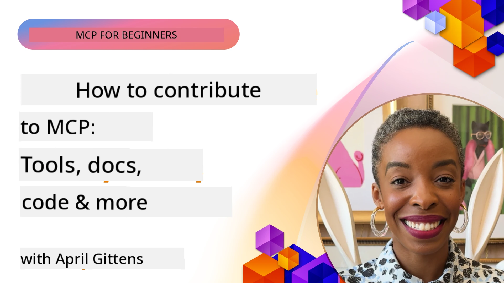

# Community and Contributions

[](https://youtu.be/v1pvCYAWpRE)

_(Click the image above to view video of this lesson)_

## Overview

Dis lekshọn de tok about how you fit take join hand wit MCP community, how you fit put hand for MCP ecosystem, an how you go follow correct paraan dem for to develop togéda. To sabi how you go participate for open-source MCP projek dem na correct tin for pesin wey wan shape the future of dis technology.

## Learning Objectives

By di time you finish dis lekshọn, you go fit:

- Understand the structure of the MCP community and ecosystem
- Participate effectively in MCP community forums and discussions
- Contribute to MCP open-source repositories
- Create and share custom MCP tools and servers
- Follow best practices for MCP development and collaboration
- Discover community resources and frameworks for MCP development

## The MCP Community Ecosystem

The MCP ecosystem get plenti parts and people wey dey work together to make protocol beta.

### Key Community Components

1. **Core Protocol Maintainers**: The official [Model Context Protocol GitHub organization](https://github.com/modelcontextprotocol) dey maintain di core MCP specifications an reference implementations
2. **Tool Developers**: People and teams wey dey create MCP tools an servers
3. **Integration Providers**: Companies wey dey put MCP inside their products an services
4. **End Users**: Developers an organizations wey dey use MCP inside their applications
5. **Contributors**: Community people wey dey contribute code, documentation, or oda resources

### Community Resources

#### Official Channels

- [MCP GitHub Organization](https://github.com/modelcontextprotocol)
- [MCP Documentation](https://modelcontextprotocol.io/)
- [MCP Specification](https://modelcontextprotocol.io/specification/2026-07-28/)
- [GitHub Discussions](https://github.com/orgs/modelcontextprotocol/discussions)
- [MCP Examples & Servers Repository](https://github.com/modelcontextprotocol/servers)

#### Community-Driven Resources

- [MCP Clients](https://modelcontextprotocol.io/clients) - List of clients wey support MCP integrations
- [Community MCP Servers](https://github.com/modelcontextprotocol/servers?tab=readme-ov-file#-community-servers) - Growing list of community-developed MCP servers
- [Awesome MCP Servers](https://github.com/wong2/awesome-mcp-servers) - Curated list of MCP servers
- [PulseMCP](https://www.pulsemcp.com/) - Community hub & newsletter for discovering MCP resources
- [Remote OpenClaw](https://www.remoteopenclaw.com/) - Free searchable directory of MCP servers, agent skills, and plugins
- [Discord Server](https://discord.gg/jHEGxQu2a5) - Connect wit MCP developers
- Language-specific SDK implementations
- Blog posts and tutorials

## Contributing to MCP

### Types of Contributions

Di MCP ecosystem dey welcome different kain contributions:

1. **Code Contributions**:
   - Core protocol enhancements
   - Bug fixes
   - Tool an server implementations
   - Client/server libraries for different languages

2. **Documentation**:
   - Improve di existing documentation
   - Create tutorials an guides
   - Translate documentation
   - Create examples an sample applications

3. **Community Support**:
   - Answer questions on forums an discussions
   - Test an report issues
   - Organize community events
   - Mentor new contributors

### Contribution Process: Core Protocol

To contribute to di core MCP protocol or official implementations, follow dis principles from di [official contributing guidelines](https://github.com/modelcontextprotocol/modelcontextprotocol/blob/main/CONTRIBUTING.md):

1. **Simplicity and Minimalism**: The MCP specification get high standard to add new concepts. E easier to add tins to specification pass to remove dem.

2. **Concrete Approach**: Specification changes suppose dey based on real implementation challenges, no be speculation.

3. **Stages of a Proposal**:
   - Define: Explore di problem area, check say oda MCP users get di same problem
   - Prototype: Build example solution an show how e dey work well
   - Write: Based on prototype, write specification proposal

### Development Environment Setup

```bash
# Make fork for di repo
git clone https://github.com/YOUR-USERNAME/modelcontextprotocol.git
cd modelcontextprotocol

# Install the tins wey e need
npm install

# If you dey change schema, check am well and create schema.json:
npm run check:schema:ts
npm run generate:schema

# If na for documentation you dey change
npm run check:docs
npm run format

# Make you fit see documentation for your machine (if you want):
npm run serve:docs
```

### Example: Contributing a Bug Fix

```javascript
// Original code wey get bug for the typescript-sdk
export function validateResource(resource: unknown): resource is MCPResource {
  if (!resource || typeof resource !== 'object') {
    return false;
  }
  
  // Bug: Property validation no dey
  // How e dey work now:
  const hasName = 'name' in resource;
  const hasSchema = 'schema' in resource;
  
  return hasName && hasSchema;
}

// How dem fix am for contribution
export function validateResource(resource: unknown): resource is MCPResource {
  if (!resource || typeof resource !== 'object') {
    return false;
  }
  
  // Validation improve pass before
  const hasName = 'name' in resource && typeof (resource as MCPResource).name === 'string';
  const hasSchema = 'schema' in resource && typeof (resource as MCPResource).schema === 'object';
  const hasDescription = !('description' in resource) || typeof (resource as MCPResource).description === 'string';
  
  return hasName && hasSchema && hasDescription;
}
```

### Example: Contributing a New Tool to the Standard Library

```python
# Example contribution: Wan tool wey dey process CSV data for MCP standard library

from mcp_tools import Tool, ToolRequest, ToolResponse, ToolExecutionException
import pandas as pd
import io
import json
from typing import Dict, Any, List, Optional

class CsvProcessingTool(Tool):
    """
    Tool for processing and analyzing CSV data.
    
    This tool allows models to extract information from CSV files,
    run basic analysis, and convert data between formats.
    """
    
    def get_name(self):
        return "csvProcessor"
        
    def get_description(self):
        return "Processes and analyzes CSV data"
    
    def get_schema(self):
        return {
            "type": "object",
            "properties": {
                "csvData": {
                    "type": "string", 
                    "description": "CSV data as a string"
                },
                "csvUrl": {
                    "type": "string",
                    "description": "URL to a CSV file (alternative to csvData)"
                },
                "operation": {
                    "type": "string",
                    "enum": ["summary", "filter", "transform", "convert"],
                    "description": "Operation to perform on the CSV data"
                },
                "filterColumn": {
                    "type": "string",
                    "description": "Column to filter by (for filter operation)"
                },
                "filterValue": {
                    "type": "string",
                    "description": "Value to filter for (for filter operation)"
                },
                "outputFormat": {
                    "type": "string",
                    "enum": ["json", "csv", "markdown"],
                    "default": "json",
                    "description": "Output format for the processed data"
                }
            },
            "oneOf": [
                {"required": ["csvData", "operation"]},
                {"required": ["csvUrl", "operation"]}
            ]
        }
    
    async def execute_async(self, request: ToolRequest) -> ToolResponse:
        try:
            # Comot parameters
            operation = request.parameters.get("operation")
            output_format = request.parameters.get("outputFormat", "json")
            
            # Collect CSV data from either direct data or URL
            df = await self._get_dataframe(request)
            
            # Process am based on di operation wey dem request
            result = {}
            
            if operation == "summary":
                result = self._generate_summary(df)
            elif operation == "filter":
                column = request.parameters.get("filterColumn")
                value = request.parameters.get("filterValue")
                if not column:
                    raise ToolExecutionException("filterColumn is required for filter operation")
                result = self._filter_data(df, column, value)
            elif operation == "transform":
                result = self._transform_data(df, request.parameters)
            elif operation == "convert":
                result = self._convert_format(df, output_format)
            else:
                raise ToolExecutionException(f"Unknown operation: {operation}")
            
            return ToolResponse(result=result)
        
        except Exception as e:
            raise ToolExecutionException(f"CSV processing failed: {str(e)}")
    
    async def _get_dataframe(self, request: ToolRequest) -> pd.DataFrame:
        """Gets a pandas DataFrame from either CSV data or URL"""
        if "csvData" in request.parameters:
            csv_data = request.parameters.get("csvData")
            return pd.read_csv(io.StringIO(csv_data))
        elif "csvUrl" in request.parameters:
            csv_url = request.parameters.get("csvUrl")
            return pd.read_csv(csv_url)
        else:
            raise ToolExecutionException("Either csvData or csvUrl must be provided")
    
    def _generate_summary(self, df: pd.DataFrame) -> Dict[str, Any]:
        """Generates a summary of the CSV data"""
        return {
            "columns": df.columns.tolist(),
            "rowCount": len(df),
            "columnCount": len(df.columns),
            "numericColumns": df.select_dtypes(include=['number']).columns.tolist(),
            "categoricalColumns": df.select_dtypes(include=['object']).columns.tolist(),
            "sampleRows": json.loads(df.head(5).to_json(orient="records")),
            "statistics": json.loads(df.describe().to_json())
        }
    
    def _filter_data(self, df: pd.DataFrame, column: str, value: str) -> Dict[str, Any]:
        """Filters the DataFrame by a column value"""
        if column not in df.columns:
            raise ToolExecutionException(f"Column '{column}' not found")
            
        filtered_df = df[df[column].astype(str).str.contains(value)]
        
        return {
            "originalRowCount": len(df),
            "filteredRowCount": len(filtered_df),
            "data": json.loads(filtered_df.to_json(orient="records"))
        }
    
    def _transform_data(self, df: pd.DataFrame, params: Dict[str, Any]) -> Dict[str, Any]:
        """Transforms the data based on parameters"""
        # Di implementation go include different kain transformations
        return {
            "status": "success",
            "message": "Transformation applied"
        }
    
    def _convert_format(self, df: pd.DataFrame, format: str) -> Dict[str, Any]:
        """Converts the DataFrame to different formats"""
        if format == "json":
            return {
                "data": json.loads(df.to_json(orient="records")),
                "format": "json"
            }
        elif format == "csv":
            return {
                "data": df.to_csv(index=False),
                "format": "csv"
            }
        elif format == "markdown":
            return {
                "data": df.to_markdown(),
                "format": "markdown"
            }
        else:
            raise ToolExecutionException(f"Unsupported output format: {format}")
```

### Contribution Guidelines

To make successful contribution to MCP projects:

1. **Start Small**: Begin with documentation, bug fixes, or small improvements
2. **Follow the Style Guide**: Follow di coding style an conventions of di project
3. **Write Tests**: Include unit tests for your code contributions
4. **Document Your Work**: Add clear documentation for new features or changes
5. **Submit Targeted PRs**: Keep pull requests focused on one issue or feature
6. **Engage with Feedback**: Reply well to feedback on your contributions

### Example Contribution Workflow

```bash
# Copy di repository
git clone https://github.com/modelcontextprotocol/typescript-sdk.git
cd typescript-sdk

# Make new branch for your work
git checkout -b feature/my-contribution

# Do your changes
# ...

# Run test to make sure sey your changes no spoil how e dey work before
npm test

# Commit your changes wit clear message
git commit -am "Fix validation in resource handler"

# Push your branch go your fork
git push origin feature/my-contribution

# Create pull request from your branch go di main repository
# Den reason wit feedback and change your PR as e need be
```

## Creating and Sharing MCP Servers

One of di most valuable ways to contribute to di MCP ecosystem na by creating and sharing custom MCP servers. Di community don already develop plenty servers for plenti services and use cases.

### MCP Server Development Frameworks

Several frameworks dey available to make MCP server development easier:

1. **Official SDKs** (check di
    [SDK documentation](https://modelcontextprotocol.io/docs/sdk) for each
    SDK's supported protocol revisions):
   - [TypeScript SDK](https://github.com/modelcontextprotocol/typescript-sdk)
   - [Python SDK](https://github.com/modelcontextprotocol/python-sdk)
   - [C# SDK](https://github.com/modelcontextprotocol/csharp-sdk)
   - [Go SDK](https://github.com/modelcontextprotocol/go-sdk)
   - [Java SDK](https://github.com/modelcontextprotocol/java-sdk)
   - [Kotlin SDK](https://github.com/modelcontextprotocol/kotlin-sdk)
   - [Swift SDK](https://github.com/modelcontextprotocol/swift-sdk)
   - [Rust SDK](https://github.com/modelcontextprotocol/rust-sdk)

2. **Community Frameworks**:
   - [MCP-Framework](https://mcp-framework.com/) - Build MCP servers quick an fine wit TypeScript
   - [MCP Declarative Java SDK](https://github.com/codeboyzhou/mcp-declarative-java-sdk) - Annotation-driven MCP servers wit Java
   - [Quarkus MCP Server SDK](https://github.com/quarkiverse/quarkus-mcp-server) - Java framework for MCP servers
   - [Next.js MCP Server Template](https://github.com/vercel-labs/mcp-for-next.js) - Starter Next.js project for MCP servers

### Developing Shareable Tools

#### .NET Example: Creating a Shareable Tool Package

```csharp
// Create a new .NET library project
// dotnet new classlib -n McpFinanceTools

using Microsoft.Mcp.Tools;
using System.Threading.Tasks;
using System.Net.Http;
using System.Text.Json;

namespace McpFinanceTools
{
    // Stock quote tool
    public class StockQuoteTool : IMcpTool
    {
        private readonly HttpClient _httpClient;
        
        public StockQuoteTool(HttpClient httpClient = null)
        {
            _httpClient = httpClient ?? new HttpClient();
        }
        
        public string Name => "stockQuote";
        public string Description => "Gets current stock quotes for specified symbols";
        
        public object GetSchema()
        {
            return new {
                type = "object",
                properties = new {
                    symbol = new { 
                        type = "string",
                        description = "Stock symbol (e.g., MSFT, AAPL)" 
                    },
                    includeHistory = new { 
                        type = "boolean",
                        description = "Whether to include historical data",
                        default = false
                    }
                },
                required = new[] { "symbol" }
            };
        }
        
        public async Task<ToolResponse> ExecuteAsync(ToolRequest request)
        {
            // Extract parameters
            string symbol = request.Parameters.GetProperty("symbol").GetString();
            bool includeHistory = false;
            
            if (request.Parameters.TryGetProperty("includeHistory", out var historyProp))
            {
                includeHistory = historyProp.GetBoolean();
            }
            
            // Call external API (example)
            var quoteResult = await GetStockQuoteAsync(symbol);
            
            // Add historical data if requested
            if (includeHistory)
            {
                var historyData = await GetStockHistoryAsync(symbol);
                quoteResult.Add("history", historyData);
            }
            
            // Return formatted result
            return new ToolResponse {
                Result = JsonSerializer.SerializeToElement(quoteResult)
            };
        }
        
        private async Task<Dictionary<string, object>> GetStockQuoteAsync(string symbol)
        {
            // Implementation would call a real stock API
            // This is a simplified example
            return new Dictionary<string, object>
            {
                ["symbol"] = symbol,
                ["price"] = 123.45,
                ["change"] = 2.5,
                ["percentChange"] = 1.2,
                ["lastUpdated"] = DateTime.UtcNow
            };
        }
        
        private async Task<object> GetStockHistoryAsync(string symbol)
        {
            // Implementation would get historical data
            // Simplified example
            return new[]
            {
                new { date = DateTime.Now.AddDays(-7).Date, price = 120.25 },
                new { date = DateTime.Now.AddDays(-6).Date, price = 122.50 },
                new { date = DateTime.Now.AddDays(-5).Date, price = 121.75 }
                // More historical data...
            };
        }
    }
}

// Create package and publish to NuGet
// dotnet pack -c Release
// dotnet nuget push bin/Release/McpFinanceTools.1.0.0.nupkg -s https://api.nuget.org/v3/index.json -k YOUR_API_KEY
```

#### Java Example: Creating a Maven Package for Tools

```java
// pom.xml configuration for a shareable MCP tool package
<!-- 
<project>
    <groupId>com.example</groupId>
    <artifactId>mcp-weather-tools</artifactId>
    <version>1.0.0</version>
    
    <dependencies>
        <dependency>
            <groupId>com.mcp</groupId>
            <artifactId>mcp-server</artifactId>
            <version>1.0.0</version>
        </dependency>
    </dependencies>
    
    <distributionManagement>
        <repository>
            <id>github</id>
            <name>GitHub Packages</name>
            <url>https://maven.pkg.github.com/username/mcp-weather-tools</url>
        </repository>
    </distributionManagement>
</project>
-->

package com.example.mcp.weather;

import com.mcp.tools.Tool;
import com.mcp.tools.ToolRequest;
import com.mcp.tools.ToolResponse;
import com.mcp.tools.ToolExecutionException;

import java.net.http.HttpClient;
import java.net.http.HttpRequest;
import java.net.http.HttpResponse;
import java.net.URI;
import java.util.HashMap;
import java.util.Map;

public class WeatherForecastTool implements Tool {
    private final HttpClient httpClient;
    private final String apiKey;
    
    public WeatherForecastTool(String apiKey) {
        this.httpClient = HttpClient.newHttpClient();
        this.apiKey = apiKey;
    }
    
    @Override
    public String getName() {
        return "weatherForecast";
    }
    
    @Override
    public String getDescription() {
        return "Gets weather forecast for a specified location";
    }
    
    @Override
    public Object getSchema() {
        Map<String, Object> schema = new HashMap<>();
        // Schema definition...
        return schema;
    }
    
    @Override
    public ToolResponse execute(ToolRequest request) {
        try {
            String location = request.getParameters().get("location").asText();
            int days = request.getParameters().has("days") ? 
                request.getParameters().get("days").asInt() : 3;
            
            // Call weather API
            Map<String, Object> forecast = getForecast(location, days);
            
            // Build response
            return new ToolResponse.Builder()
                .setResult(forecast)
                .build();
        } catch (Exception ex) {
            throw new ToolExecutionException("Weather forecast failed: " + ex.getMessage(), ex);
        }
    }
    
    private Map<String, Object> getForecast(String location, int days) {
        // Implementation would call weather API
        // Simplified example
        Map<String, Object> result = new HashMap<>();
        // Add forecast data...
        return result;
    }
}

// Build and publish using Maven
// mvn clean package
// mvn deploy
```

#### Python Example: Publishing a PyPI Package

```python
# Directory structure for PyPI package:
# mcp_nlp_tools/
# ├── LICENSE
# ├── README.md
# ├── setup.py
# ├── mcp_nlp_tools/
# │   ├── __init__.py
# │   ├── sentiment_tool.py
# │   └── translation_tool.py

# Example setup.py
"""
from setuptools import setup, find_packages

setup(
    name="mcp_nlp_tools",
    version="0.1.0",
    packages=find_packages(),
    install_requires=[
        "mcp_server>=1.0.0",
        "transformers>=4.0.0",
        "torch>=1.8.0"
    ],
    author="Your Name",
    author_email="your.email@example.com",
    description="MCP tools for natural language processing tasks",
    long_description=open("README.md").read(),
    long_description_content_type="text/markdown",
    url="https://github.com/username/mcp_nlp_tools",
    classifiers=[
        "Programming Language :: Python :: 3",
        "License :: OSI Approved :: MIT License",
        "Operating System :: OS Independent",
    ],
    python_requires=">=3.8",
)
"""

# Example NLP tool implementation (sentiment_tool.py)
from mcp_tools import Tool, ToolRequest, ToolResponse, ToolExecutionException
from transformers import pipeline
import torch

class SentimentAnalysisTool(Tool):
    """MCP tool for sentiment analysis of text"""
    
    def __init__(self, model_name="distilbert-base-uncased-finetuned-sst-2-english"):
        # Load di sentiment analysis model
        self.sentiment_analyzer = pipeline("sentiment-analysis", model=model_name)
    
    def get_name(self):
        return "sentimentAnalysis"
        
    def get_description(self):
        return "Analyzes the sentiment of text, classifying it as positive or negative"
    
    def get_schema(self):
        return {
            "type": "object",
            "properties": {
                "text": {
                    "type": "string", 
                    "description": "The text to analyze for sentiment"
                },
                "includeScore": {
                    "type": "boolean",
                    "description": "Whether to include confidence scores",
                    "default": True
                }
            },
            "required": ["text"]
        }
    
    async def execute_async(self, request: ToolRequest) -> ToolResponse:
        try:
            # Extract di parameters
            text = request.parameters.get("text")
            include_score = request.parameters.get("includeScore", True)
            
            # Analyze di sentiment
            sentiment_result = self.sentiment_analyzer(text)[0]
            
            # Format di result
            result = {
                "sentiment": sentiment_result["label"],
                "text": text
            }
            
            if include_score:
                result["score"] = sentiment_result["score"]
            
            # Return di result
            return ToolResponse(result=result)
            
        except Exception as e:
            raise ToolExecutionException(f"Sentiment analysis failed: {str(e)}")

# To publish:
# python setup.py sdist bdist_wheel
# python -m twine upload dist/*
```

### Sharing Best Practices

When you dey share MCP tools wit di community:

1. **Complete Documentation**:
   - Document di purpose, how to use am, an examples
   - Explain parameters an wetin e return
   - Document any external dependencies

2. **Error Handling**:
   - Put better error handling
   - Provide useful error messages
   - Handle difficult cases well

3. **Performance Considerations**:
   - Optimize for speed an resource use
   - Use caching when e make sense
   - Think about scalability

4. **Security**:
   - Use secure API keys an authentication
   - Check an clean input data
   - Add rate limiting for external API calls

5. **Testing**:
   - Include full test coverage
   - Test wit different input types an edge cases
   - Document test procedures

## Community Collaboration and Best Practices

Good collaboration na key to a strong MCP ecosystem.

### Communication Channels

- GitHub Issues and Discussions
- Microsoft Tech Community
- Discord and Slack channels
- Stack Overflow (tag: `model-context-protocol` or `mcp`)

### Code Reviews

When you dey review MCP contributions:

1. **Clarity**: Di code clear an well documented?
2. **Correctness**: E dey work as e suppose?
3. **Consistency**: E follow project conventions?
4. **Completeness**: Di tests and documentation dey included?
5. **Security**: Any security wahala dey?

### Version Compatibility

When you dey develop for MCP:

1. **Protocol Versioning**: Follow di MCP protocol version wey your tool support
2. **Client Compatibility**: Consider backward compatibility
3. **Server Compatibility**: Follow server implementation guidelines
4. **Breaking Changes**: Document any breaking changes well well

## Example Community Project: MCP Tool Registry

One important community contribution fit be to develop public registry for MCP tools.

```python
# Example schema for community tool registry API

from fastapi import FastAPI, HTTPException, Depends
from pydantic import BaseModel, Field, HttpUrl
from typing import List, Optional
import datetime
import uuid

# Models dem for the tool registry
class ToolSchema(BaseModel):
    """JSON Schema for a tool"""
    type: str
    properties: dict
    required: List[str] = []

class ToolRegistration(BaseModel):
    """Information for registering a tool"""
    name: str = Field(..., description="Unique name for the tool")
    description: str = Field(..., description="Description of what the tool does")
    version: str = Field(..., description="Semantic version of the tool")
    schema: ToolSchema = Field(..., description="JSON Schema for tool parameters")
    author: str = Field(..., description="Author of the tool")
    repository: Optional[HttpUrl] = Field(None, description="Repository URL")
    documentation: Optional[HttpUrl] = Field(None, description="Documentation URL")
    package: Optional[HttpUrl] = Field(None, description="Package URL")
    tags: List[str] = Field(default_factory=list, description="Tags for categorization")
    examples: List[dict] = Field(default_factory=list, description="Example usage")

class Tool(ToolRegistration):
    """Tool with registry metadata"""
    id: uuid.UUID = Field(default_factory=uuid.uuid4)
    created_at: datetime.datetime = Field(default_factory=datetime.datetime.now)
    updated_at: datetime.datetime = Field(default_factory=datetime.datetime.now)
    downloads: int = Field(default=0)
    rating: float = Field(default=0.0)
    ratings_count: int = Field(default=0)

# FastAPI app for the registry
app = FastAPI(title="MCP Tool Registry")

# In-memory database for dis example
tools_db = {}

@app.post("/tools", response_model=Tool)
async def register_tool(tool: ToolRegistration):
    """Register a new tool in the registry"""
    if tool.name in tools_db:
        raise HTTPException(status_code=400, detail=f"Tool '{tool.name}' already exists")
    
    new_tool = Tool(**tool.dict())
    tools_db[tool.name] = new_tool
    return new_tool

@app.get("/tools", response_model=List[Tool])
async def list_tools(tag: Optional[str] = None):
    """List all registered tools, optionally filtered by tag"""
    if tag:
        return [tool for tool in tools_db.values() if tag in tool.tags]
    return list(tools_db.values())

@app.get("/tools/{tool_name}", response_model=Tool)
async def get_tool(tool_name: str):
    """Get information about a specific tool"""
    if tool_name not in tools_db:
        raise HTTPException(status_code=404, detail=f"Tool '{tool_name}' not found")
    return tools_db[tool_name]

@app.delete("/tools/{tool_name}")
async def delete_tool(tool_name: str):
    """Delete a tool from the registry"""
    if tool_name not in tools_db:
        raise HTTPException(status_code=404, detail=f"Tool '{tool_name}' not found")
    del tools_db[tool_name]
    return {"message": f"Tool '{tool_name}' deleted"}
```

## Key Takeaways

- The MCP community dey diverse an dey welcome different types of contributions
- Contributing to MCP fit range from core protocol improvements to custom tools
- Following contribution guidelines go improve your chance say dem go accept your PR
- Creating and sharing MCP tools na important way to help beta di ecosystem
- Community collaboration na key for di growth an improvement of MCP

## Exercise

1. Identify area for di MCP ecosystem wey you fit fit contribute based on your skills an interest dem
2. Fork di MCP repository an set up local development environment
3. Create small enhancement, bug fix, or tool wey go benefit di community
4. Document your contribution wit correct tests an documentation
5. Submit pull request to di right repository

## Additional Resources

- [MCP Community Projects](https://github.com/topics/model-context-protocol)

---

## What's Next

Next: [Lessons from Early Adoption](../07-LessonsfromEarlyAdoption/README.md)

---

<!-- CO-OP TRANSLATOR DISCLAIMER START -->
**Disclaimer**:
Dis document don translate wit AI translation service [Co-op Translator](https://github.com/Azure/co-op-translator). Even tho we dey try make am correct, abeg make you know say automated translation fit get errors or mistakes. Di original document for dia own language na im be di correct source. For important info, make person wey sabi human translation do am. We no go responsible for any misunderstanding or wrong understanding wey fit happen because of dis translation.
<!-- CO-OP TRANSLATOR DISCLAIMER END -->