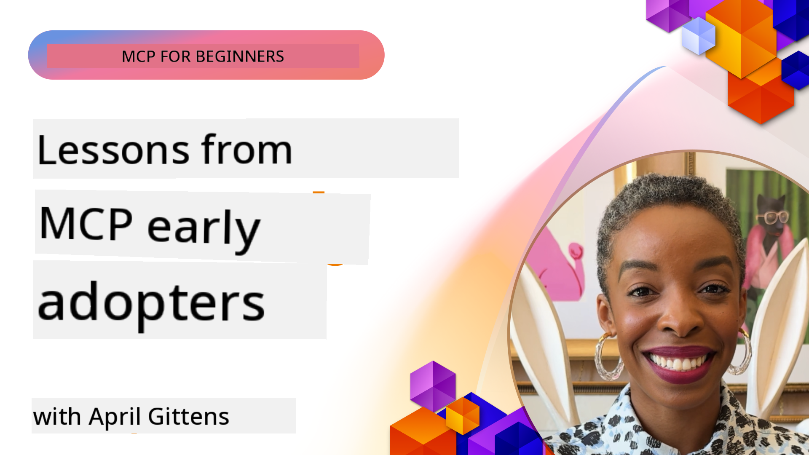

<!--
CO_OP_TRANSLATOR_METADATA:
{
  "original_hash": "41f16dac486d2086a53bc644a01cbe42",
  "translation_date": "2025-11-18T19:47:34+00:00",
  "source_file": "07-LessonsfromEarlyAdoption/README.md",
  "language_code": "pcm"
}
-->
# 🌟 Lessons wey Early Adopters don Learn

[](https://youtu.be/jds7dSmNptE)

_(Click di image wey dey up to watch di video for dis lesson)_

## 🎯 Wetin Dis Module Go Teach

Dis module go show how real companies and developers dey use Model Context Protocol (MCP) to solve real wahala and bring new ideas. Wit case studies and hands-on projects, you go see how MCP dey help make AI integration secure, scalable, and connect language models, tools, and enterprise data.

### Case Study 5: Azure MCP – Enterprise-Grade Model Context Protocol as a Service

Azure MCP ([https://aka.ms/azmcp](https://aka.ms/azmcp)) na Microsoft own managed, enterprise-level version of Model Context Protocol wey dem design to provide scalable, secure, and compliant MCP server as cloud service. Dis package get plenty MCP servers wey dey work for different Azure services and scenarios.

[Microsoft MCP Center](https://mcp.azure.com) Build Your Scalable, Enterprise-Ready MCP Registry wit Azure API Center na catalog of di Microsoft MCP Servers wey dey available.

> **🎯 Tools wey don ready for production**
> 
> Dis case study dey show plenty MCP servers wey don ready for production! Learn about di Azure MCP Server and other Azure-integrated servers for our [**Microsoft MCP Servers Guide**](microsoft-mcp-servers.md#2--azure-mcp-server).

**Key Features:**
- MCP server hosting wey dey fully managed wit built-in scaling, monitoring, and security
- Native integration wit Azure OpenAI, Azure AI Search, and other Azure services
- Enterprise authentication and authorization wit Microsoft Entra ID
- Support for custom tools, prompt templates, and resource connectors
- Compliance wit enterprise security and regulatory requirements
- 15+ specialized Azure service connectors like database, monitoring, and storage

**Azure MCP Server Capabilities:**
- **Resource Management**: Full Azure resource lifecycle management
- **Database Connectors**: Direct access to Azure Database for PostgreSQL and SQL Server
- **Azure Monitor**: KQL-powered log analysis and operational insights
- **Authentication**: DefaultAzureCredential and managed identity patterns
- **Storage Services**: Blob Storage, Queue Storage, and Table Storage operations
- **Container Services**: Azure Container Apps, Container Instances, and AKS management

### 📚 See MCP for Action

You wan see how dis principles dey work for tools wey don ready for production? Check our [**10 Microsoft MCP Servers wey dey change Developer Productivity**](microsoft-mcp-servers.md), wey dey show real Microsoft MCP servers wey you fit use now.

## Overview

Dis lesson dey show how early adopters don use Model Context Protocol (MCP) to solve real-life wahala and bring new ideas for different industries. Wit case studies and hands-on projects, you go see how MCP dey help make AI integration standardized, secure, and scalable—connecting big language models, tools, and enterprise data under one framework. You go learn how to design and build MCP-based solutions, see proven implementation patterns, and know di best ways to deploy MCP for production. Di lesson go also show new trends, future plans, and open-source resources wey go help you dey ahead for MCP technology and di ecosystem wey dey grow.

## Learning Objectives

- Analyze real-life MCP implementations for different industries
- Design and build complete MCP-based applications
- Explore new trends and future plans for MCP technology
- Use best practices for real development scenarios

## Real-life MCP Implementations

### Case Study 1: Enterprise Customer Support Automation

One big company use MCP-based solution to standardize AI interactions for their customer support systems. Dis help dem:

- Create one interface for plenty LLM providers
- Keep prompt management consistent for all departments
- Put strong security and compliance controls
- Switch between different AI models easily based on wetin dem need

**Technical Implementation:**

```python
# Python MCP server implementation for customer support
import logging
import asyncio
from modelcontextprotocol import create_server, ServerConfig
from modelcontextprotocol.server import MCPServer
from modelcontextprotocol.transports import create_http_transport
from modelcontextprotocol.resources import ResourceDefinition
from modelcontextprotocol.prompts import PromptDefinition
from modelcontextprotocol.tool import ToolDefinition

# Configure logging
logging.basicConfig(level=logging.INFO)

async def main():
    # Create server configuration
    config = ServerConfig(
        name="Enterprise Customer Support Server",
        version="1.0.0",
        description="MCP server for handling customer support inquiries"
    )
    
    # Initialize MCP server
    server = create_server(config)
    
    # Register knowledge base resources
    server.resources.register(
        ResourceDefinition(
            name="customer_kb",
            description="Customer knowledge base documentation"
        ),
        lambda params: get_customer_documentation(params)
    )
    
    # Register prompt templates
    server.prompts.register(
        PromptDefinition(
            name="support_template",
            description="Templates for customer support responses"
        ),
        lambda params: get_support_templates(params)
    )
    
    # Register support tools
    server.tools.register(
        ToolDefinition(
            name="ticketing",
            description="Create and update support tickets"
        ),
        handle_ticketing_operations
    )
    
    # Start server with HTTP transport
    transport = create_http_transport(port=8080)
    await server.run(transport)

if __name__ == "__main__":
    asyncio.run(main())
```

**Results:** 30% reduction for model costs, 45% better response consistency, and better compliance for global operations.

### Case Study 2: Healthcare Diagnostic Assistant

One healthcare provider build MCP infrastructure to connect plenty specialized medical AI models while dem dey protect sensitive patient data:

- Easy switching between generalist and specialist medical models
- Strong privacy controls and audit trails
- Integration wit existing Electronic Health Record (EHR) systems
- Consistent prompt engineering for medical terms

**Technical Implementation:**

```csharp
// C# MCP host application implementation in healthcare application
using Microsoft.Extensions.DependencyInjection;
using ModelContextProtocol.SDK.Client;
using ModelContextProtocol.SDK.Security;
using ModelContextProtocol.SDK.Resources;

public class DiagnosticAssistant
{
    private readonly MCPHostClient _mcpClient;
    private readonly PatientContext _patientContext;
    
    public DiagnosticAssistant(PatientContext patientContext)
    {
        _patientContext = patientContext;
        
        // Configure MCP client with healthcare-specific settings
        var clientOptions = new ClientOptions
        {
            Name = "Healthcare Diagnostic Assistant",
            Version = "1.0.0",
            Security = new SecurityOptions
            {
                Encryption = EncryptionLevel.Medical,
                AuditEnabled = true
            }
        };
        
        _mcpClient = new MCPHostClientBuilder()
            .WithOptions(clientOptions)
            .WithTransport(new HttpTransport("https://healthcare-mcp.example.org"))
            .WithAuthentication(new HIPAACompliantAuthProvider())
            .Build();
    }
    
    public async Task<DiagnosticSuggestion> GetDiagnosticAssistance(
        string symptoms, string patientHistory)
    {
        // Create request with appropriate resources and tool access
        var resourceRequest = new ResourceRequest
        {
            Name = "patient_records",
            Parameters = new Dictionary<string, object>
            {
                ["patientId"] = _patientContext.PatientId,
                ["requestingProvider"] = _patientContext.ProviderId
            }
        };
        
        // Request diagnostic assistance using appropriate prompt
        var response = await _mcpClient.SendPromptRequestAsync(
            promptName: "diagnostic_assistance",
            parameters: new Dictionary<string, object>
            {
                ["symptoms"] = symptoms,
                patientHistory = patientHistory,
                relevantGuidelines = _patientContext.GetRelevantGuidelines()
            });
            
        return DiagnosticSuggestion.FromMCPResponse(response);
    }
}
```

**Results:** Better diagnostic suggestions for doctors while dem dey keep full HIPAA compliance and reduce di stress of switching between systems.

### Case Study 3: Financial Services Risk Analysis

One financial institution use MCP to standardize their risk analysis process for different departments:

- Create one interface for credit risk, fraud detection, and investment risk models
- Put strong access controls and model versioning
- Make sure all AI recommendations dey auditable
- Keep data formatting consistent for different systems

**Technical Implementation:**

```java
// Java MCP server for financial risk assessment
import org.mcp.server.*;
import org.mcp.security.*;

public class FinancialRiskMCPServer {
    public static void main(String[] args) {
        // Create MCP server with financial compliance features
        MCPServer server = new MCPServerBuilder()
            .withModelProviders(
                new ModelProvider("risk-assessment-primary", new AzureOpenAIProvider()),
                new ModelProvider("risk-assessment-audit", new LocalLlamaProvider())
            )
            .withPromptTemplateDirectory("./compliance/templates")
            .withAccessControls(new SOCCompliantAccessControl())
            .withDataEncryption(EncryptionStandard.FINANCIAL_GRADE)
            .withVersionControl(true)
            .withAuditLogging(new DatabaseAuditLogger())
            .build();
            
        server.addRequestValidator(new FinancialDataValidator());
        server.addResponseFilter(new PII_RedactionFilter());
        
        server.start(9000);
        
        System.out.println("Financial Risk MCP Server running on port 9000");
    }
}
```

**Results:** Better regulatory compliance, 40% faster model deployment cycles, and better risk assessment consistency for departments.

### Case Study 4: Microsoft Playwright MCP Server for Browser Automation

Microsoft create [Playwright MCP server](https://github.com/microsoft/playwright-mcp) to make browser automation secure, standardized, and easy wit Model Context Protocol. Dis server wey don ready for production dey allow AI agents and LLMs interact wit web browsers in controlled, auditable, and extensible way—fit use am for automated web testing, data extraction, and end-to-end workflows.

> **🎯 Tool wey don ready for production**
> 
> Dis case study dey show one real MCP server wey you fit use now! Learn more about di Playwright MCP Server and 9 other production-ready Microsoft MCP servers for our [**Microsoft MCP Servers Guide**](microsoft-mcp-servers.md#8--playwright-mcp-server).

**Key Features:**
- Expose browser automation capabilities (navigation, form filling, screenshot capture, etc.) as MCP tools
- Put strong access controls and sandboxing to stop unauthorized actions
- Provide detailed audit logs for all browser interactions
- Support integration wit Azure OpenAI and other LLM providers for agent-driven automation
- Power GitHub Copilot's Coding Agent wit web browsing capabilities

**Technical Implementation:**

```typescript
// TypeScript: Registering Playwright browser automation tools in an MCP server
import { createServer, ToolDefinition } from 'modelcontextprotocol';
import { launch } from 'playwright';

const server = createServer({
  name: 'Playwright MCP Server',
  version: '1.0.0',
  description: 'MCP server for browser automation using Playwright'
});

// Register a tool for navigating to a URL and capturing a screenshot
server.tools.register(
  new ToolDefinition({
    name: 'navigate_and_screenshot',
    description: 'Navigate to a URL and capture a screenshot',
    parameters: {
      url: { type: 'string', description: 'The URL to visit' }
    }
  }),
  async ({ url }) => {
    const browser = await launch();
    const page = await browser.newPage();
    await page.goto(url);
    const screenshot = await page.screenshot();
    await browser.close();
    return { screenshot };
  }
);

// Start the MCP server
server.listen(8080);
```

**Results:**

- Make browser automation secure and programmatic for AI agents and LLMs
- Reduce manual testing work and improve test coverage for web applications
- Provide reusable, extensible framework for browser-based tool integration for enterprise environments
- Power GitHub Copilot's web browsing capabilities

**References:**

- [Playwright MCP Server GitHub Repository](https://github.com/microsoft/playwright-mcp)
- [Microsoft AI and Automation Solutions](https://azure.microsoft.com/en-us/products/ai-services/)

### Case Study 5: Azure MCP – Enterprise-Grade Model Context Protocol as a Service

Azure MCP Server ([https://aka.ms/azmcp](https://aka.ms/azmcp)) na Microsoft own managed, enterprise-level version of Model Context Protocol wey dem design to provide scalable, secure, and compliant MCP server as cloud service. Azure MCP dey help companies deploy, manage, and connect MCP servers wit Azure AI, data, and security services fast, reduce operational stress, and speed up AI adoption.

> **🎯 Tool wey don ready for production**
> 
> Dis na real MCP server wey you fit use now! Learn more about di Azure AI Foundry MCP Server for our [**Microsoft MCP Servers Guide**](microsoft-mcp-servers.md).

- MCP server hosting wey dey fully managed wit built-in scaling, monitoring, and security
- Native integration wit Azure OpenAI, Azure AI Search, and other Azure services
- Enterprise authentication and authorization wit Microsoft Entra ID
- Support for custom tools, prompt templates, and resource connectors
- Compliance wit enterprise security and regulatory requirements

**Technical Implementation:**

```yaml
# Example: Azure MCP server deployment configuration (YAML)
apiVersion: mcp.microsoft.com/v1
kind: McpServer
metadata:
  name: enterprise-mcp-server
spec:
  modelProviders:
    - name: azure-openai
      type: AzureOpenAI
      endpoint: https://<your-openai-resource>.openai.azure.com/
      apiKeySecret: <your-azure-keyvault-secret>
  tools:
    - name: document_search
      type: AzureAISearch
      endpoint: https://<your-search-resource>.search.windows.net/
      apiKeySecret: <your-azure-keyvault-secret>
  authentication:
    type: EntraID
    tenantId: <your-tenant-id>
  monitoring:
    enabled: true
    logAnalyticsWorkspace: <your-log-analytics-id>
```

**Results:**  
- Reduce time-to-value for enterprise AI projects wit ready-to-use, compliant MCP server platform
- Make integration of LLMs, tools, and enterprise data sources easy
- Better security, observability, and operational efficiency for MCP workloads
- Improve code quality wit Azure SDK best practices and current authentication patterns

**References:**  
- [Azure MCP Documentation](https://aka.ms/azmcp)
- [Azure MCP Server GitHub Repository](https://github.com/Azure/azure-mcp)
- [Azure AI Services](https://azure.microsoft.com/en-us/products/ai-services/)
- [Microsoft MCP Center](https://mcp.azure.com)

## Case Study 6: NLWeb 
MCP (Model Context Protocol) na new protocol wey Chatbots and AI assistants dey use to interact wit tools. Every NLWeb instance na MCP server, wey dey support one main method, ask, wey dey use to ask website question for natural language. Di response wey dem go return dey use schema.org, wey be popular vocabulary for describing web data. To talk am simple, MCP na NLWeb as Http na HTML. NLWeb dey join protocols, Schema.org formats, and sample code to help sites quickly create dis endpoints, wey dey benefit humans wit conversational interfaces and machines wit natural agent-to-agent interaction.

NLWeb get two main parts:
- Protocol wey dey simple to start wit, to connect wit site for natural language and format wey dey use json and schema.org for di answer wey dem go return. Check di REST API documentation for more details.
- Simple implementation of (1) wey dey use existing markup, for sites wey fit dey abstracted as list of items (products, recipes, attractions, reviews, etc.). Wit user interface widgets, sites fit provide conversational interfaces to their content easily. Check di Life of a chat query documentation for more details on how e dey work.

**References:**  
- [Azure MCP Documentation](https://aka.ms/azmcp)
- [NLWeb](https://github.com/microsoft/NlWeb)

### Case Study 7: Azure AI Foundry MCP Server – Enterprise AI Agent Integration

Azure AI Foundry MCP servers dey show how MCP fit dey used to manage AI agents and workflows for enterprise environments. Wit MCP integration wit Azure AI Foundry, companies fit standardize agent interactions, use Foundry's workflow management, and make sure deployment dey secure and scalable.

> **🎯 Tool wey don ready for production**
> 
> Dis na real MCP server wey you fit use now! Learn more about di Azure AI Foundry MCP Server for our [**Microsoft MCP Servers Guide**](microsoft-mcp-servers.md#9--azure-ai-foundry-mcp-server).

**Key Features:**
- Full access to Azure AI ecosystem, including model catalogs and deployment management
- Knowledge indexing wit Azure AI Search for RAG applications
- Tools to check AI model performance and quality assurance
- Integration wit Azure AI Foundry Catalog and Labs for advanced research models
- Agent management and evaluation tools for production use

**Results:**
- Quick prototyping and strong monitoring of AI agent workflows
- Easy integration wit Azure AI services for advanced use cases
- Unified interface for building, deploying, and monitoring agent pipelines
- Better security, compliance, and operational efficiency for companies
- Fast AI adoption while keeping control over complex agent-driven processes

**References:**
- [Azure AI Foundry MCP Server GitHub Repository](https://github.com/azure-ai-foundry/mcp-foundry)
- [Integrating Azure AI Agents wit MCP (Microsoft Foundry Blog)](https://devblogs.microsoft.com/foundry/integrating-azure-ai-agents-mcp/)

### Case Study 8: Foundry MCP Playground – Experimentation and Prototyping

Di Foundry MCP Playground dey provide ready-to-use environment to test MCP servers and Azure AI Foundry integrations. Developers fit quickly prototype, test, and check AI models and agent workflows wit resources from Azure AI Foundry Catalog and Labs. Di playground dey make setup easy, provide sample projects, and support team collaboration, so e go dey easy to explore best practices and new ideas wit small stress. E dey useful for teams wey wan validate ideas, share experiments, and learn fast without complex infrastructure. By making entry easy, di playground dey help innovation and community contributions for MCP and Azure AI Foundry ecosystem.

**References:**

- [Foundry MCP Playground GitHub Repository](https://github.com/azure-ai-foundry/foundry-mcp-playground)

### Case Study 9: Microsoft Learn Docs MCP Server – AI-Powered Documentation Access

Di Microsoft Learn Docs MCP Server na cloud-hosted service wey dey give AI assistants real-time access to official Microsoft documentation wit Model Context Protocol. Dis server wey don ready for production dey connect to di full Microsoft Learn ecosystem and dey allow semantic search across all official Microsoft sources.

> **🎯 Tool wey don ready for production**
> 
> Dis na real MCP server wey you fit use now! Learn more about di Microsoft Learn Docs MCP Server for our [**Microsoft MCP Servers Guide**](microsoft-mcp-servers.md#1--microsoft-learn-docs-mcp-server).

**Key Features:**
- Real-time access to official Microsoft documentation, Azure docs, and Microsoft 365 documentation
- Advanced semantic search wey sabi understand context and intent
- Always dey up-to-date as Microsoft Learn content dey publish
- Full coverage across Microsoft Learn, Azure documentation, and Microsoft 365 sources
- Return up to 10 high-quality content chunks wit article titles and URLs
**Why E Matter:**
- E dey solve di wahala of "old AI knowledge" wey concern Microsoft technologies
- E make sure say AI assistants fit sabi di latest .NET, C#, Azure, and Microsoft 365 features
- E dey provide correct, first-party info wey go help generate accurate code
- E dey important for developers wey dey work with Microsoft technologies wey dey change quick-quick

**Results:**
- E don improve well-well di accuracy of AI-generated code for Microsoft technologies
- E don reduce di time wey people dey use find current documentation and best practices
- E dey help developers work faster with documentation wey sabi di context
- E dey fit well for development workflows without needing to comot from di IDE

**References:**
- [Microsoft Learn Docs MCP Server GitHub Repository](https://github.com/MicrosoftDocs/mcp)
- [Microsoft Learn Documentation](https://learn.microsoft.com/)

## Hands-on Projects

### Project 1: Build Multi-Provider MCP Server

**Objective:** Make MCP server wey fit send requests go different AI model providers based on criteria.

**Requirements:**

- E go support at least three model providers (like OpenAI, Anthropic, local models)
- E go get routing system wey dey use request metadata
- E go get configuration system to manage provider credentials
- E go add caching to make performance and cost better
- E go get simple dashboard to monitor usage

**Implementation Steps:**

1. Arrange di basic MCP server infrastructure
2. Make provider adapters for each AI model service
3. Create routing logic wey go use request attributes
4. Add caching system for requests wey dey repeat
5. Build monitoring dashboard
6. Test am with different request patterns

**Technologies:** Choose Python (.NET/Java/Python based on wetin you like), Redis for caching, and simple web framework for dashboard.

### Project 2: Enterprise Prompt Management System

**Objective:** Build MCP system wey go manage, version, and deploy prompt templates for di whole organization.

**Requirements:**

- E go get centralized repository for prompt templates
- E go get versioning and approval workflows
- E go get testing system for templates with sample inputs
- E go get role-based access controls
- E go get API for template retrieval and deployment

**Implementation Steps:**

1. Design database schema for template storage
2. Create core API for template CRUD operations
3. Implement versioning system
4. Build approval workflow
5. Develop testing framework
6. Make simple web interface for management
7. Connect am with MCP server

**Technologies:** Choose backend framework, SQL or NoSQL database, and frontend framework for management interface.

### Project 3: MCP-Based Content Generation Platform

**Objective:** Build content generation platform wey dey use MCP to give consistent results for different content types.

**Requirements:**

- E go support different content formats (blog posts, social media, marketing copy)
- E go get template-based generation with customization options
- E go get content review and feedback system
- E go track content performance metrics
- E go support content versioning and iteration

**Implementation Steps:**

1. Arrange MCP client infrastructure
2. Create templates for different content types
3. Build content generation pipeline
4. Implement review system
5. Develop metrics tracking system
6. Make user interface for template management and content generation

**Technologies:** Choose programming language, web framework, and database system wey you like.

## Future Directions for MCP Technology

### Emerging Trends

1. **Multi-Modal MCP**
   - Expand MCP to fit work with image, audio, and video models
   - Develop cross-modal reasoning capabilities
   - Standardize prompt formats for different modalities

2. **Federated MCP Infrastructure**
   - Distributed MCP networks wey fit share resources across organizations
   - Standardized protocols for secure model sharing
   - Privacy-preserving computation techniques

3. **MCP Marketplaces**
   - Ecosystems wey dey share and monetize MCP templates and plugins
   - Quality assurance and certification processes
   - Integration with model marketplaces

4. **MCP for Edge Computing**
   - Adapt MCP standards for edge devices wey no get plenty resources
   - Optimized protocols for low-bandwidth environments
   - Specialized MCP implementations for IoT ecosystems

5. **Regulatory Frameworks**
   - Develop MCP extensions for regulatory compliance
   - Standardized audit trails and explainability interfaces
   - Integration with AI governance frameworks wey dey come up

### MCP Solutions from Microsoft

Microsoft and Azure don develop open-source repositories wey dey help developers implement MCP for different scenarios:

#### Microsoft Organization

1. [playwright-mcp](https://github.com/microsoft/playwright-mcp) - Playwright MCP server for browser automation and testing
2. [files-mcp-server](https://github.com/microsoft/files-mcp-server) - OneDrive MCP server for local testing and community contribution
3. [NLWeb](https://github.com/microsoft/NlWeb) - NLWeb na collection of open protocols and tools wey dey focus on AI Web foundational layer

#### Azure-Samples Organization

1. [mcp](https://github.com/Azure-Samples/mcp) - Samples, tools, and resources for MCP servers on Azure
2. [mcp-auth-servers](https://github.com/Azure-Samples/mcp-auth-servers) - Reference MCP servers for authentication
3. [remote-mcp-functions](https://github.com/Azure-Samples/remote-mcp-functions) - Remote MCP Server implementations in Azure Functions
4. [remote-mcp-functions-python](https://github.com/Azure-Samples/remote-mcp-functions-python) - Template for custom remote MCP servers with Python
5. [remote-mcp-functions-dotnet](https://github.com/Azure-Samples/remote-mcp-functions-dotnet) - Template for custom remote MCP servers with .NET/C#
6. [remote-mcp-functions-typescript](https://github.com/Azure-Samples/remote-mcp-functions-typescript) - Template for custom remote MCP servers with TypeScript
7. [remote-mcp-apim-functions-python](https://github.com/Azure-Samples/remote-mcp-apim-functions-python) - Azure API Management as AI Gateway to Remote MCP servers with Python
8. [AI-Gateway](https://github.com/Azure-Samples/AI-Gateway) - APIM ❤️ AI experiments with MCP capabilities

Dis repositories dey provide templates and resources for MCP across programming languages and Azure services. Dem cover use cases like server implementations, authentication, cloud deployment, and enterprise integration.

#### MCP Resources Directory

Di [MCP Resources directory](https://github.com/microsoft/mcp/tree/main/Resources) for di official Microsoft MCP repository dey provide sample resources, prompt templates, and tool definitions for MCP servers. E dey help developers start quick with reusable building blocks and best-practice examples for:

- **Prompt Templates:** Templates wey fit common AI tasks and scenarios
- **Tool Definitions:** Example tool schemas and metadata for MCP servers
- **Resource Samples:** Definitions for connecting to data sources, APIs, and external services
- **Reference Implementations:** Samples wey show how to arrange resources, prompts, and tools for MCP projects

Dis resources dey help development, promote standardization, and ensure best practices for MCP solutions.

#### MCP Resources Directory

- [MCP Resources (Sample Prompts, Tools, and Resource Definitions)](https://github.com/microsoft/mcp/tree/main/Resources)

### Research Opportunities

- Techniques for prompt optimization inside MCP frameworks
- Security models for multi-tenant MCP deployments
- Performance benchmarking for MCP implementations
- Formal verification methods for MCP servers

## Conclusion

Di Model Context Protocol (MCP) dey change di way AI dey integrate across industries. Di case studies and projects wey dey dis lesson don show how early adopters like Microsoft and Azure dey use MCP to solve real-world problems, speed up AI adoption, and ensure compliance, security, and scalability. MCP dey help organizations connect large language models, tools, and enterprise data in one unified framework. As MCP dey grow, e go dey important to join di community, explore open-source resources, and use best practices to build strong AI solutions.

## Additional Resources

- [MCP Foundry GitHub Repository](https://github.com/azure-ai-foundry/mcp-foundry)
- [Foundry MCP Playground](https://github.com/azure-ai-foundry/foundry-mcp-playground)
- [Integrating Azure AI Agents with MCP (Microsoft Foundry Blog)](https://devblogs.microsoft.com/foundry/integrating-azure-ai-agents-mcp/)
- [MCP GitHub Repository (Microsoft)](https://github.com/microsoft/mcp)
- [MCP Resources Directory (Sample Prompts, Tools, and Resource Definitions)](https://github.com/microsoft/mcp/tree/main/Resources)
- [MCP Community & Documentation](https://modelcontextprotocol.io/introduction)
- [Azure MCP Documentation](https://aka.ms/azmcp)
- [Playwright MCP Server GitHub Repository](https://github.com/microsoft/playwright-mcp)
- [Files MCP Server (OneDrive)](https://github.com/microsoft/files-mcp-server)
- [Azure-Samples MCP](https://github.com/Azure-Samples/mcp)
- [MCP Auth Servers (Azure-Samples)](https://github.com/Azure-Samples/mcp-auth-servers)
- [Remote MCP Functions (Azure-Samples)](https://github.com/Azure-Samples/remote-mcp-functions)
- [Remote MCP Functions Python (Azure-Samples)](https://github.com/Azure-Samples/remote-mcp-functions-python)
- [Remote MCP Functions .NET (Azure-Samples)](https://github.com/Azure-Samples/remote-mcp-functions-dotnet)
- [Remote MCP Functions TypeScript (Azure-Samples)](https://github.com/Azure-Samples/remote-mcp-functions-typescript)
- [Remote MCP APIM Functions Python (Azure-Samples)](https://github.com/Azure-Samples/remote-mcp-apim-functions-python)
- [AI-Gateway (Azure-Samples)](https://github.com/Azure-Samples/AI-Gateway)
- [Microsoft AI and Automation Solutions](https://azure.microsoft.com/en-us/products/ai-services/)

## Exercises

1. Look one case study and suggest another way to implement am.
2. Pick one project idea and write detailed technical specification.
3. Research one industry wey dem no cover for di case studies and explain how MCP fit solve di challenges.
4. Explore one future direction and create concept for new MCP extension wey go support am.

Next: [Microsoft MCP Server](../07-LessonsfromEarlyAdoption/microsoft-mcp-servers.md)

---

<!-- CO-OP TRANSLATOR DISCLAIMER START -->
**Disclaimer**:  
Dis dokyument don use AI transleshion service [Co-op Translator](https://github.com/Azure/co-op-translator) do di transleshion. Even as we dey try make am accurate, abeg make you sabi say automatik transleshion fit get mistake or no dey correct well. Di original dokyument wey dey for im native language na di main source wey you go fit trust. For important mata, e good make you use professional human transleshion. We no go fit take blame for any misunderstanding or wrong interpretation wey fit happen because you use dis transleshion.
<!-- CO-OP TRANSLATOR DISCLAIMER END -->