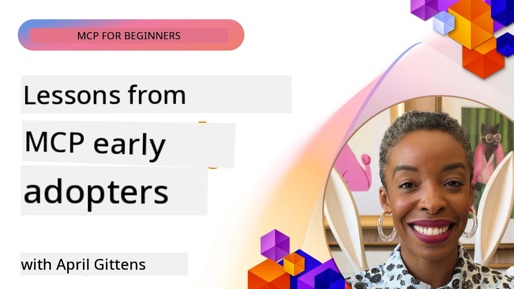

# 🌟 Lessons from Early Adopters

[](https://youtu.be/jds7dSmNptE)

_(Click di picture for top to watch video of dis lesson)_

## 🎯 Wetin Dis Module Go Cover

Dis module dey explore how real organizations and developers dey use di Model Context Protocol (MCP) to solve real issues and push innovation. Through detailed case studies, hands-on projects, and practical examples, you go see how MCP dey enable secure, scalable AI integration wey connect language models, tools, and enterprise data.

### 📚 See MCP for Work

You want see how dem apply these principles for production-ready tools? Check our [**10 Microsoft MCP Servers We Dey Change Developer Productivity**](microsoft-mcp-servers.md), wey show real Microsoft MCP servers wey you fit use today.

## Overview

Dis lesson dey explore how early adopters don use Model Context Protocol (MCP) take solve real-world problems and push innovation for different industries. Through detailed case studies and hands-on projects, you go see how MCP dey enable standardized, secure, and scalable AI integration—wey connect big language models, tools, and enterprise data inside one framework. You go gain practical experience design and build MCP-based solutions, learn from proven implementation patterns, and discover best practices to deploy MCP inside production environments. Di lesson also dey highlight emerging trends, future directions, and open-source resources to help you stay for forefront of MCP technology and di way e dey evolve.

## Learning Objectives

- Analyze real-world MCP implementations across different industries
- Design and build complete MCP-based applications
- Explore emerging trends and future directions in MCP technology
- Apply best practices in actual development scenarios

## Real-world MCP Implementations

### Case Study 1: Enterprise Customer Support Automation

One multinational company put MCP-based solution to standardize AI interactions across their customer support systems. This one allow dem to:

- Create one united interface for plenty LLM providers
- Manage prompt well well for all departments
- Put strong security and compliance controls
- Fit easily change between different AI models based on wetin dem need

**Technical Implementation:**

```python
# Python MCP server implementashen for customer support
import logging
import asyncio
from modelcontextprotocol import create_server, ServerConfig
from modelcontextprotocol.server import MCPServer
from modelcontextprotocol.transports import create_http_transport
from modelcontextprotocol.resources import ResourceDefinition
from modelcontextprotocol.prompts import PromptDefinition
from modelcontextprotocol.tool import ToolDefinition

# Set up logging
logging.basicConfig(level=logging.INFO)

async def main():
    # Make server configuration
    config = ServerConfig(
        name="Enterprise Customer Support Server",
        version="1.0.0",
        description="MCP server for handling customer support inquiries"
    )
    
    # Start MCP server
    server = create_server(config)
    
    # Register knowledge base resources
    server.resources.register(
        ResourceDefinition(
            name="customer_kb",
            description="Customer knowledge base documentation"
        ),
        lambda params: get_customer_documentation(params)
    )
    
    # Register prompt templates
    server.prompts.register(
        PromptDefinition(
            name="support_template",
            description="Templates for customer support responses"
        ),
        lambda params: get_support_templates(params)
    )
    
    # Register support tools
    server.tools.register(
        ToolDefinition(
            name="ticketing",
            description="Create and update support tickets"
        ),
        handle_ticketing_operations
    )
    
    # Run server wit HTTP transport
    transport = create_http_transport(port=8080)
    await server.run(transport)

if __name__ == "__main__":
    asyncio.run(main())
```

**Results:** 30% reduction for model costs, 45% better response consistency, and better compliance across global operations.

### Case Study 2: Healthcare Diagnostic Assistant

One healthcare provider build MCP infrastructure to join multiple special medical AI models together while dem make sure say sensitive patient data dey safe:

- Easily change between general and specialist medical models
- Strong privacy controls and audit trails
- Integration with existing Electronic Health Record (EHR) systems
- Consistent prompt engineering for medical words

**Technical Implementation:**

```csharp
// C# MCP host application implementation in healthcare application
using Microsoft.Extensions.DependencyInjection;
using ModelContextProtocol.SDK.Client;
using ModelContextProtocol.SDK.Security;
using ModelContextProtocol.SDK.Resources;

public class DiagnosticAssistant
{
    private readonly MCPHostClient _mcpClient;
    private readonly PatientContext _patientContext;
    
    public DiagnosticAssistant(PatientContext patientContext)
    {
        _patientContext = patientContext;
        
        // Configure MCP client with healthcare-specific settings
        var clientOptions = new ClientOptions
        {
            Name = "Healthcare Diagnostic Assistant",
            Version = "1.0.0",
            Security = new SecurityOptions
            {
                Encryption = EncryptionLevel.Medical,
                AuditEnabled = true
            }
        };
        
        _mcpClient = new MCPHostClientBuilder()
            .WithOptions(clientOptions)
            .WithTransport(new HttpTransport("https://healthcare-mcp.example.org"))
            .WithAuthentication(new HIPAACompliantAuthProvider())
            .Build();
    }
    
    public async Task<DiagnosticSuggestion> GetDiagnosticAssistance(
        string symptoms, string patientHistory)
    {
        // Create request with appropriate resources and tool access
        var resourceRequest = new ResourceRequest
        {
            Name = "patient_records",
            Parameters = new Dictionary<string, object>
            {
                ["patientId"] = _patientContext.PatientId,
                ["requestingProvider"] = _patientContext.ProviderId
            }
        };
        
        // Request diagnostic assistance using appropriate prompt
        var response = await _mcpClient.SendPromptRequestAsync(
            promptName: "diagnostic_assistance",
            parameters: new Dictionary<string, object>
            {
                ["symptoms"] = symptoms,
                patientHistory = patientHistory,
                relevantGuidelines = _patientContext.GetRelevantGuidelines()
            });
            
        return DiagnosticSuggestion.FromMCPResponse(response);
    }
}
```

**Results:** Better diagnostic suggestions for doctors while dem still follow all HIPAA rules and reduce context-switching between systems well.

### Case Study 3: Financial Services Risk Analysis

One financial company use MCP to standardize their risk analysis work for different departments:

- Create one united interface for credit risk, fraud detection, and investment risk models
- Put strong access controls and model versioning
- Make sure say all AI recommendations dey audit-able
- Keep data formatting consistent across different systems

**Technical Implementation:**

```java
// Java MCP server wey dey do financial risk check
import org.mcp.server.*;
import org.mcp.security.*;

public class FinancialRiskMCPServer {
    public static void main(String[] args) {
        // Make MCP server wey get financial compliance features
        MCPServer server = new MCPServerBuilder()
            .withModelProviders(
                new ModelProvider("risk-assessment-primary", new AzureOpenAIProvider()),
                new ModelProvider("risk-assessment-audit", new LocalLlamaProvider())
            )
            .withPromptTemplateDirectory("./compliance/templates")
            .withAccessControls(new SOCCompliantAccessControl())
            .withDataEncryption(EncryptionStandard.FINANCIAL_GRADE)
            .withVersionControl(true)
            .withAuditLogging(new DatabaseAuditLogger())
            .build();
            
        server.addRequestValidator(new FinancialDataValidator());
        server.addResponseFilter(new PII_RedactionFilter());
        
        server.start(9000);
        
        System.out.println("Financial Risk MCP Server running on port 9000");
    }
}
```

**Results:** Better regulatory compliance, 40% faster model deployment cycles, and improved risk assessment consistency for departments.

### Case Study 4: Microsoft Playwright MCP Server for Browser Automation

Microsoft develop [Playwright MCP server](https://github.com/microsoft/playwright-mcp) to make secure, standardized browser automation through Model Context Protocol possible. Dis production-ready server allow AI agents and LLMs to interact with web browsers in controlled, auditable, and extensible way—making things like automated web testing, data extraction, and complete workflows possible.

> **🎯 Production Ready Tool**
> 
> Dis case study show real MCP server wey you fit use today! Learn more about Playwright MCP Server and 9 other production-ready Microsoft MCP servers for our [**Microsoft MCP Servers Guide**](microsoft-mcp-servers.md#8--playwright-mcp-server).

**Key Features:**
- Expose browser automation skills (navigation, form filling, screenshot capture, etc.) as MCP tools
- Put strong access controls and sandboxing to stop unauthorized actions
- Provide detailed audit logs for all browser actions
- Support integration with Azure OpenAI and other LLM providers for agent-driven automation
- Power GitHub Copilot's Coding Agent with web browsing skills

**Technical Implementation:**

```typescript
// TypeScript: Dem dey register Playwright browser automation tools for MCP server
import { createServer, ToolDefinition } from 'modelcontextprotocol';
import { launch } from 'playwright';

const server = createServer({
  name: 'Playwright MCP Server',
  version: '1.0.0',
  description: 'MCP server for browser automation using Playwright'
});

// Register one tool wey go fit waka go URL and carry screenshot
server.tools.register(
  new ToolDefinition({
    name: 'navigate_and_screenshot',
    description: 'Navigate to a URL and capture a screenshot',
    parameters: {
      url: { type: 'string', description: 'The URL to visit' }
    }
  }),
  async ({ url }) => {
    const browser = await launch();
    const page = await browser.newPage();
    await page.goto(url);
    const screenshot = await page.screenshot();
    await browser.close();
    return { screenshot };
  }
);

// Make MCP server start
server.listen(8080);
```

**Results:**

- Enable secure, programmatic browser automation for AI agents and LLMs
- Reduce manual testing work and improve test coverage for web apps
- Provide reusable, extensible framework for browser tool integration inside enterprise
- Power GitHub Copilot's web browsing functions

**References:**

- [Playwright MCP Server GitHub Repository](https://github.com/microsoft/playwright-mcp)
- [Microsoft AI and Automation Solutions](https://azure.microsoft.com/en-us/products/ai-services/)

### Case Study 5: Azure MCP – Enterprise-Grade Model Context Protocol as a Service

Azure MCP Server ([https://aka.ms/azmcp](https://aka.ms/azmcp)) na Microsoft managed, enterprise-grade implementation of Model Context Protocol, wey e design to provide scalable, secure, and compliant MCP server capabilities as cloud service. Azure MCP enable organizations to quickly deploy, manage, and join MCP servers with Azure AI, data, and security services, reduce operational wahala and quicken AI adoption.

> **🎯 Production Ready Tool**
> 
> Dis na real MCP server wey you fit use today! Learn more about Microsoft Foundry MCP Server for our [**Microsoft MCP Servers Guide**](microsoft-mcp-servers.md).


- Fully managed MCP server hosting with built-in scaling, monitoring, and security
- Native integration with Azure OpenAI, Azure AI Search, and other Azure services
- Enterprise authentication and authorization via Microsoft Entra ID
- Support for custom tools, prompt templates, and resource connectors
- Comply with enterprise security and regulatory requirements

**Technical Implementation:**

```yaml
# Example: Azure MCP server deployment configuration (YAML)
apiVersion: mcp.microsoft.com/v1
kind: McpServer
metadata:
  name: enterprise-mcp-server
spec:
  modelProviders:
    - name: azure-openai
      type: AzureOpenAI
      endpoint: https://<your-openai-resource>.openai.azure.com/
      apiKeySecret: <your-azure-keyvault-secret>
  tools:
    - name: document_search
      type: AzureAISearch
      endpoint: https://<your-search-resource>.search.windows.net/
      apiKeySecret: <your-azure-keyvault-secret>
  authentication:
    type: EntraID
    tenantId: <your-tenant-id>
  monitoring:
    enabled: true
    logAnalyticsWorkspace: <your-log-analytics-id>
```

**Results:**  
- Reduce time-to-value for enterprise AI projects by giving ready-to-use, compliant MCP server platform
- Make integration of LLMs, tools, and enterprise data sources easy
- Improve security, observability, and operational efficiency for MCP workloads
- Better code quality with Azure SDK best practices and current authentication patterns

**References:**  
- [Azure MCP Documentation](https://aka.ms/azmcp)
- [Azure MCP Server GitHub Repository](https://github.com/Azure/azure-mcp)
- [Azure AI Services](https://azure.microsoft.com/en-us/products/ai-services/)
- [Microsoft MCP Center](https://mcp.azure.com)

## Case Study 6: NLWeb 
MCP (Model Context Protocol) na one protocol wey dey come up for Chatbots and AI assistants to interact with tools. Every NLWeb instance also na MCP server, wey support one core method, ask, wey people use to ask website question for natural language. The answer wey dem give make use of schema.org, one widely-used vocabulary for describe web data. To talk am short, MCP na NLWeb be dat same way Http be to HTML. NLWeb join protocols, Schema.org formats, and sample code to help sites quickly create these endpoints, helping both people through conversational interfaces and machines through natural agent-to-agent interaction.

Two different parts dey NLWeb.
- One protocol, wey simple well well to start with, to link up with site using natural language and one format, wey use json and schema.org for returned answer. See documentation for REST API for more details.
- One straightforward implementation of (1) wey take use existing markup, for sites wey fit be abstracted as lists of items (products, recipes, attractions, reviews, and so on). Together with user interface widgets, sites fit easily provide conversational interfaces to their content. See documentation for Life of a chat query for how e dey work.
 
**References:**  
- [Azure MCP Documentation](https://aka.ms/azmcp)
- [NLWeb](https://github.com/microsoft/NlWeb)

### Case Study 7: Microsoft Foundry MCP Server – Enterprise AI Agent Integration

Microsoft Foundry MCP servers show how MCP fit organize and manage AI agents and workflows inside enterprise environment. By joining MCP with Microsoft Foundry, organizations fit standardize agent interactions, use Foundry workflow management, and make sure deployments secure and scalable.

> **🎯 Production Ready Tool**
> 
> Dis na real MCP server you fit use today! Learn more about Microsoft Foundry MCP Server for our [**Microsoft MCP Servers Guide**](microsoft-mcp-servers.md#9--microsoft-foundry-mcp-server).

**Key Features:**
- Full access to Azure AI ecosystem, including model catalogs and deployment management
- Knowledge indexing with Azure AI Search for RAG applications
- Tools for AI model evaluation and quality assurance
- Integration with Microsoft Foundry Catalog and Labs for top research models
- Agent management and evaluation features for production use

**Results:**
- Quick prototyping and solid monitoring of AI agent workflows
- Smooth integration with Azure AI services for advanced use cases
- One interface to build, deploy, and monitor agent pipelines
- Better security, compliance, and operational efficiency for enterprises
- Fast track AI adoption while still controlling complex agent-driven processes

**References:**
- [Microsoft Foundry MCP Server GitHub Repository](https://github.com/azure-ai-foundry/mcp-foundry)
- [Integrating Azure AI Agents with MCP (Microsoft Foundry Blog)](https://devblogs.microsoft.com/foundry/integrating-azure-ai-agents-mcp/)

### Case Study 8: Foundry MCP Playground – Experimentation and Prototyping

Foundry MCP Playground na ready-to-use space for experiment with MCP servers and Microsoft Foundry integrations. Developers fit quickly prototype, test, and evaluate AI models and workflows using Microsoft Foundry Catalog and Labs resources. Dis playground reduce setup wahala, provide sample projects, and support group development, making am easy to find best practices and new scenarios with small wahala. E good for teams wey want validate ideas, share experiments, and quicken learning without complex infra. By lowering barrier, playground dey promote innovation and community contributions inside MCP and Microsoft Foundry ecosystem.

**References:**

- [Foundry MCP Playground GitHub Repository](https://github.com/azure-ai-foundry/foundry-mcp-playground)

### Case Study 9: Microsoft Learn Docs MCP Server – AI-Powered Documentation Access

Microsoft Learn Docs MCP Server na cloud-hosted service wey give AI assistants real-time access to official Microsoft documentation through Model Context Protocol. This production-ready server connect to comprehensive Microsoft Learn ecosystem and enable semantic search across all official Microsoft sources.

> **🎯 Production Ready Tool**
> 
> Dis na real MCP server you fit use today! Learn more about Microsoft Learn Docs MCP Server for our [**Microsoft MCP Servers Guide**](microsoft-mcp-servers.md#1--microsoft-learn-docs-mcp-server).

**Key Features:**
- Real-time access to official Microsoft documentation, Azure docs, and Microsoft 365 documentation
- Advanced semantic search skills wey sabi context and intent
- Always up-to-date information as Microsoft Learn content dey publish
- Wide coverage across Microsoft Learn, Azure docs, and Microsoft 365 sources
- Return up to 10 high-quality content chunks with article titles and URLs

**Why E Important:**
- Solve the "outdated AI knowledge" problem for Microsoft technologies
- Make sure AI assistants get latest .NET, C#, Azure, and Microsoft 365 features
- Provide correct, official information for accurate code generation
- Important for developers wey dey work on fast-changing Microsoft tech

**Results:**
- Greatly improved accuracy of AI-generated code for Microsoft technologies
- Reduce time for searching current documentation and best practices
- Better developer productivity with context-aware document retrieval
- Smooth fit into development workflows without leaving IDE

**References:**
- [Microsoft Learn Docs MCP Server GitHub Repository](https://github.com/MicrosoftDocs/mcp)
- [Microsoft Learn Documentation](https://learn.microsoft.com/)

## Hands-on Projects

### Project 1: Build Multi-Provider MCP Server

**Objective:** Build MCP server wey fit route requests to many AI model providers based on specific criteria.

**Requirements:**

- Support at least three different model providers (e.g., OpenAI, Anthropic, local models)
- Put routing mechanism based on request metadata
- Build configuration system to manage provider credentials
- Add caching to optimize performance and reduce cost
- Build simple dashboard to monitor usage

**Implementation Steps:**

1. Set up basic MCP server infrastructure
2. Build provider adapters for each AI model service
3. Build routing logic based on request attributes
4. Add caching mechanisms for frequent requests
5. Develop monitoring dashboard
6. Test am with different request patterns

**Technologies:** Choose Python (.NET/Java/Python based on your choice), Redis for caching, and simple web framework for dashboard.

### Project 2: Enterprise Prompt Management System

**Objective:** Build MCP-based system to manage, version, and deploy prompt templates across organization.

**Requirements:**


- Create wan centralized repository for prompt templates
- Implement versioning and approval workflows
- Build template testing capabilities wit sample inputs
- Develop role-based access controls
- Create wan API for template retrieval and deployment

**Implementation Steps:**

1. Design di database schema for template storage
2. Create di core API for template CRUD operations
3. Implement di versioning system
4. Build di approval workflow
5. Develop di testing framework
6. Create wan simple web interface for management
7. Integrate wit wan MCP server

**Technologies:** Your choice of backend framework, SQL or NoSQL database, and wan frontend framework for di management interface.

### Project 3: MCP-Based Content Generation Platform

**Objective:** Build wan content generation platform wey leverage MCP to provide consistent results across different content types.

**Requirements:**

- Support multiple content formats (blog posts, social media, marketing copy)
- Implement template-based generation wit customization options
- Create wan content review and feedback system
- Track content performance metrics
- Support content versioning and iteration

**Implementation Steps:**

1. Set up di MCP client infrastructure
2. Create templates for different content types
3. Build di content generation pipeline
4. Implement di review system
5. Develop di metrics tracking system
6. Create wan user interface for template management and content generation

**Technologies:** Your preferred programming language, web framework, and database system.

## Future Directions for MCP Technology

### Emerging Trends

1. **Multi-Modal MCP**
   - Expansion of MCP to standardize interactions wit image, audio, and video models
   - Development of cross-modal reasoning capabilities
   - Standardized prompt formats for different modalities

2. **Federated MCP Infrastructure**
   - Distributed MCP networks wey fit share resources across organizations
   - Standardized protocols for secure model sharing
   - Privacy-preserving computation techniques

3. **MCP Marketplaces**
   - Ecosystems for sharing and monetizing MCP templates and plugins
   - Quality assurance and certification processes
   - Integration wit model marketplaces

4. **MCP for Edge Computing**
   - Adaptation of MCP standards for resource-constrained edge devices
   - Optimized protocols for low-bandwidth environments
   - Specialized MCP implementations for IoT ecosystems

5. **Regulatory Frameworks**
   - Development of MCP extensions for regulatory compliance
   - Standardized audit trails and explainability interfaces
   - Integration wit emerging AI governance frameworks

### MCP Solutions from Microsoft

Microsoft and Azure don develop several open-source repositories to help developers implement MCP in various scenarios:

#### Microsoft Organization

1. [playwright-mcp](https://github.com/microsoft/playwright-mcp) - Wan Playwright MCP server for browser automation and testing
2. [files-mcp-server](https://github.com/microsoft/files-mcp-server) - Wan OneDrive MCP server implementation for local testing and community contribution
3. [NLWeb](https://github.com/microsoft/NlWeb) - NLWeb na collection of open protocols and associated open source tools. E main focus na to establish foundation layer for AI Web

#### Azure-Samples Organization

1. [mcp](https://github.com/Azure-Samples/mcp) - Links to samples, tools, and resources for building and integrating MCP servers on Azure using multiple languages
2. [mcp-auth-servers](https://github.com/Azure-Samples/mcp-auth-servers) - Reference MCP servers wey dey demonstrate authentication with current Model Context Protocol specification
3. [remote-mcp-functions](https://github.com/Azure-Samples/remote-mcp-functions) - Landing page for Remote MCP Server implementations in Azure Functions wit links to language-specific repos
4. [remote-mcp-functions-python](https://github.com/Azure-Samples/remote-mcp-functions-python) - Quickstart template for building and deploying custom remote MCP servers using Azure Functions with Python
5. [remote-mcp-functions-dotnet](https://github.com/Azure-Samples/remote-mcp-functions-dotnet) - Quickstart template for building and deploying custom remote MCP servers using Azure Functions with .NET/C#
6. [remote-mcp-functions-typescript](https://github.com/Azure-Samples/remote-mcp-functions-typescript) - Quickstart template for building and deploying custom remote MCP servers using Azure Functions with TypeScript
7. [remote-mcp-apim-functions-python](https://github.com/Azure-Samples/remote-mcp-apim-functions-python) - Azure API Management as AI Gateway to Remote MCP servers using Python
8. [AI-Gateway](https://github.com/Azure-Samples/AI-Gateway) - APIM ❤️ AI experiments including MCP capabilities, integrating wit Azure OpenAI and AI Foundry

These repositories provide various implementations, templates, and resources for working wit Model Context Protocol across different programming languages and Azure services. Dem cover range of use cases from basic server implementations to authentication, cloud deployment, and enterprise integration scenarios.

#### MCP Resources Directory

Di [MCP Resources directory](https://github.com/microsoft/mcp/tree/main/Resources) wey dey di official Microsoft MCP repository dey provide curated collection of sample resources, prompt templates, and tool definitions for use wit Model Context Protocol servers. Dis directory dey designed to help developers quickly start with MCP by offering reusable building blocks and best-practice examples for:

- **Prompt Templates:** Ready-to-use prompt templates for common AI tasks and scenarios, wey fit adapt for your own MCP server implementations.
- **Tool Definitions:** Example tool schemas and metadata to standardize tool integration and invocation across different MCP servers.
- **Resource Samples:** Example resource definitions for connecting to data sources, APIs, and external services within di MCP framework.
- **Reference Implementations:** Practical samples wey show how to structure and organize resources, prompts, and tools in real-world MCP projects.

These resources dey accelerate development, promote standardization, and help ensure best practices when building and deploying MCP-based solutions.

#### MCP Resources Directory

- [MCP Resources (Sample Prompts, Tools, and Resource Definitions)](https://github.com/microsoft/mcp/tree/main/Resources)

### Research Opportunities

- Efficient prompt optimization techniques within MCP frameworks
- Security models for multi-tenant MCP deployments
- Performance benchmarking across different MCP implementations
- Formal verification methods for MCP servers

## Conclusion

Di Model Context Protocol (MCP) dey rapidly shape di future of standardized, secure, and interoperable AI integration across industries. Through di case studies and hands-on projects for dis lesson, you don see how early adopters—including Microsoft and Azure—dey leverage MCP to solve real-world challenges, accelerate AI adoption, and ensure compliance, security, and scalability. MCP modular approach dey enable organisations to connect large language models, tools, and enterprise data in wan unified, auditable framework. As MCP dey continue to evolve, to dey stay involved wit di community, explore open-source resources, and apply best practices go be key to build robust, future-ready AI solutions.

## Additional Resources

- [MCP Foundry GitHub Repository](https://github.com/azure-ai-foundry/mcp-foundry)
- [Foundry MCP Playground](https://github.com/azure-ai-foundry/foundry-mcp-playground)
- [Integrating Azure AI Agents wit MCP (Microsoft Foundry Blog)](https://devblogs.microsoft.com/foundry/integrating-azure-ai-agents-mcp/)
- [MCP GitHub Repository (Microsoft)](https://github.com/microsoft/mcp)
- [MCP Resources Directory (Sample Prompts, Tools, and Resource Definitions)](https://github.com/microsoft/mcp/tree/main/Resources)
- [MCP Community & Documentation](https://modelcontextprotocol.io/introduction)
- [MCP Specification (2026-07-28)](https://modelcontextprotocol.io/specification/2026-07-28/)
- [Azure MCP Documentation](https://aka.ms/azmcp)
- [OWASP MCP Top 10](https://microsoft.github.io/mcp-azure-security-guide/mcp/) - Security best practices
- [Playwright MCP Server GitHub Repository](https://github.com/microsoft/playwright-mcp)
- [Files MCP Server (OneDrive)](https://github.com/microsoft/files-mcp-server)
- [Azure-Samples MCP](https://github.com/Azure-Samples/mcp)
- [MCP Auth Servers (Azure-Samples)](https://github.com/Azure-Samples/mcp-auth-servers)
- [Remote MCP Functions (Azure-Samples)](https://github.com/Azure-Samples/remote-mcp-functions)
- [Remote MCP Functions Python (Azure-Samples)](https://github.com/Azure-Samples/remote-mcp-functions-python)
- [Remote MCP Functions .NET (Azure-Samples)](https://github.com/Azure-Samples/remote-mcp-functions-dotnet)
- [Remote MCP Functions TypeScript (Azure-Samples)](https://github.com/Azure-Samples/remote-mcp-functions-typescript)
- [Remote MCP APIM Functions Python (Azure-Samples)](https://github.com/Azure-Samples/remote-mcp-apim-functions-python)
- [AI-Gateway (Azure-Samples)](https://github.com/Azure-Samples/AI-Gateway)
- [Microsoft AI and Automation Solutions](https://azure.microsoft.com/en-us/products/ai-services/)

## Exercises

1. Analyze one of di case studies and propose alternative implementation approach.
2. Choose one of di project ideas and create detailed technical specification.
3. Research wan industry wey dem no cover for di case studies and outline how MCP fit address e specific challenges.
4. Explore one of di future directions and create wan concept for new MCP extension to support am.

## What's Next

Explore more: [Microsoft MCP Servers](./microsoft-mcp-servers.md)

Continue to: [Module 8: Best Practices](../08-BestPractices/README.md)

---

<!-- CO-OP TRANSLATOR DISCLAIMER START -->
**Disclaimer**:
Dis document don translate wit AI translation service [Co-op Translator](https://github.com/Azure/co-op-translator). Even tho we dey try make am correct, abeg make you know say automated translation fit get errors or mistakes. Di original document for dia own language na im be di correct source. For important info, make person wey sabi human translation do am. We no go responsible for any misunderstanding or wrong understanding wey fit happen because of dis translation.
<!-- CO-OP TRANSLATOR DISCLAIMER END -->