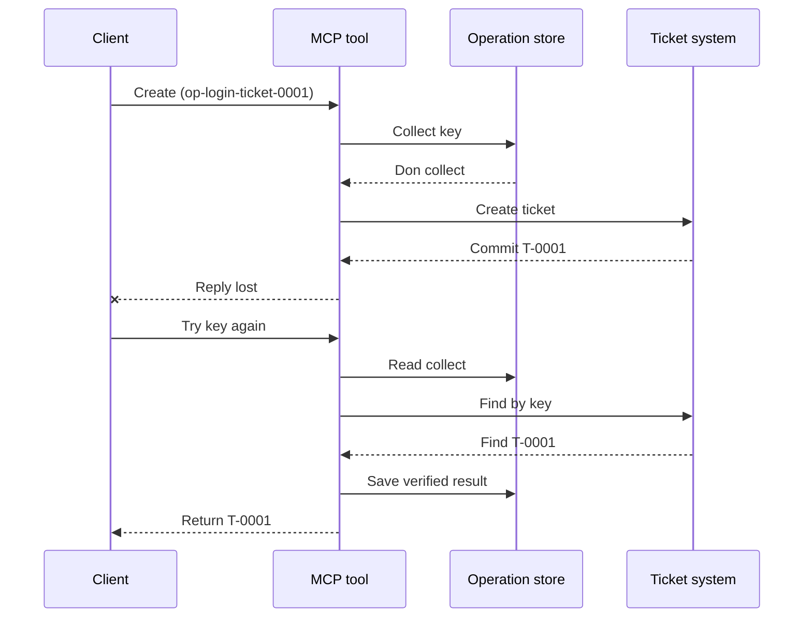
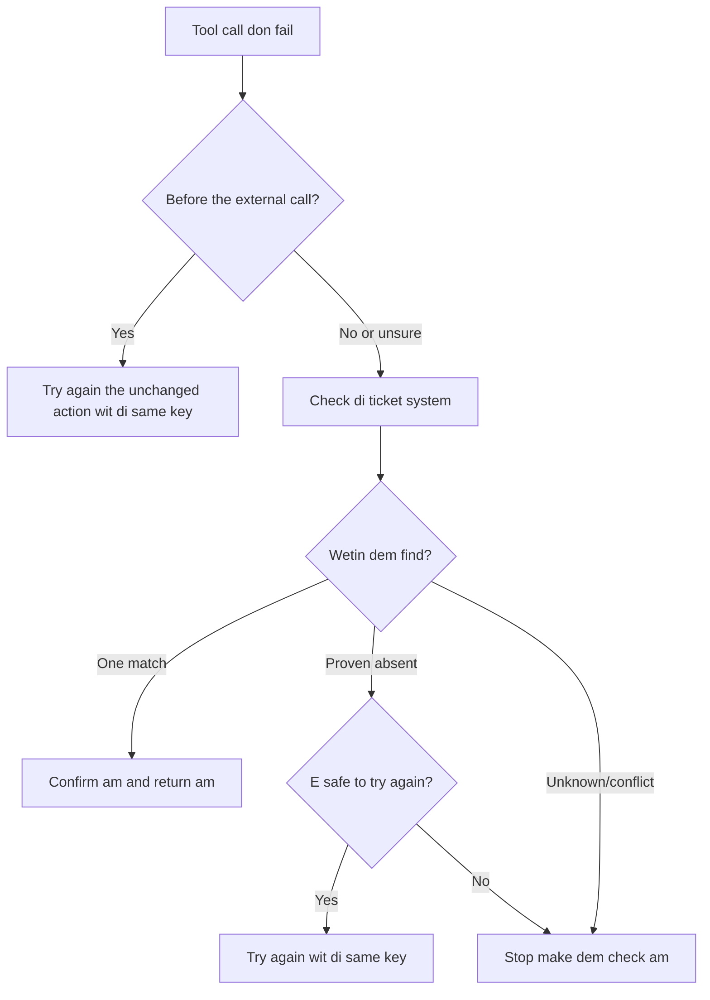

# Safe Retries for MCP Tools: A Reliability Sidecar Pattern

If response no show no mean say the action no happen. A support-ticket tool fit
fit create ticket `T-0001` then e connection fit loss before client see
di result. If di client just dey retry anyhow, e fit create `T-0002`.

Dis lesson dey show how to sabi dis uncertain outcome, keep one correct
identity for di intended action, and check di ticket system before e try
again. Di Python exercise wey dey with am run locally wit di standard library
and SQLite.

## Why a Timeout Means "Outcome Unknown"

Make we assume say di client call `create_support_ticket` wit operation key
`op-login-ticket-0001`:



Connection fail afta di ticket don commit but before di result reach.
Di client only sabi say di reply no show. E no sabi if di
ticket miss. To dey use di same operation key go make di tool fit find and return
`T-0001` instead of to create `T-0002`.

## What a Reliability Sidecar Does

Reliability sidecar na application code wey dey hold recovery state close to
tool. E fit be library, middleware, database-backed service, or just
part of di tool implementation. E no need be separate process,
and e no na MCP protocol feature.

Di sidecar get four work:

1. save di intended action before e call di external system;
2. make sure only one worker fit claim dat action;
3. remember enough state to recover afta crash; and
4. check di external system if di outcome no sure.

Dis lesson dey target di final MCP specification `2026-07-28`. MCP no get
protocol-level session, so di operation key na normal tool argument
wey hold durable application state. Di same pattern fit work wit earlier
MCP versions.

## Four IDs Weh Solve Different Problems

Dem identifiers dey related, but dem no dey interchangeable:

| Identifier | Wetin e identify | E fit survive retry? |
| --- | --- | --- |
| JSON-RPC ID | One request and response | No; make new request ID |
| MCP Task ID | One long-running task | Yes; make e stay for polling |
| Operation key | One intended action | Yes; use am again for dat action |
| Ticket ID | Di stored result | Yes; return am afta verification |

Progress notifications and trace context dey help you watch request.
Cancellation dey ask work to stop. None of dem fit stop duplicate ticket.

## Build the Guard

Create di operation key before di first tool call and save am with di
workflow. Every time wey you try create di same intended ticket, use di same key:

```json
{
  "operation_key": "op-login-ticket-0001",
  "title": "Cannot sign in"
}
```

Different intended ticket go get new key. For production, make opaque,
unguessable value instead of to put customer data inside di key.

Here na di complete MCP tool schema wey dis lesson use:

```json
{
  "name": "create_support_ticket",
  "title": "Create support ticket",
  "description": "Creates or recovers one support ticket for an operation key.",
  "inputSchema": {
    "$schema": "https://json-schema.org/draft/2020-12/schema",
    "type": "object",
    "properties": {
      "operation_key": {
        "type": "string",
        "minLength": 16,
        "maxLength": 128,
        "description": "Stable key reused for the same intended action."
      },
      "title": {
        "type": "string",
        "minLength": 1,
        "maxLength": 200
      }
    },
    "required": ["operation_key", "title"],
    "additionalProperties": false
  },
  "outputSchema": {
    "$schema": "https://json-schema.org/draft/2020-12/schema",
    "type": "object",
    "properties": {
      "ticket_id": {
        "type": "string"
      },
      "operation_key": {
        "type": "string"
      },
      "status": {
        "type": "string",
        "const": "verified"
      }
    },
    "required": ["ticket_id", "operation_key", "status"],
    "additionalProperties": false
  }
}
```

Authenticated caller identity come from server context, no from
model-supplied tool input. Scope each stored operation to:

- dat caller, tenant, or service account;
- di tool name and version; and
- hash of normalized inputs weh define di external action.

Di input hash answer simple question: "Dis retry dey ask for di same
ticket?" If di key don already belong to different title, reject di call.

To return dia earlier result for input wey don change go fit hide contract wahala.

Save di claim wit one atomic database operation. "Atomic" mean say two workers
no fit both see empty record and both become owner. Process-local
lock no go enough if another server instance fit collect di retry.

Di workflow go create di key while di action still dey `planned`. Di sample den
go save dis state dem:

- `claimed`: one worker don reserve di operation;
- `completed`: di ticket system don return result; and
- `verified`: read from di ticket system confirm di result.

If crash happen, e fit make di stored state remain for `claimed` even after ticket don
create. Make you treat every nonterminal claim as uncertain until external proof
settle am. No just assume say `claimed` mean "nothing happen."

## Recover Before You Retry

When tool call fail, make you decide wetin dem sabi before you send another external
write:



Validation wey fail before ticket API call na known failure.
Retry action wey no change wit di same operation key. If you correct di input
and e change di ticket wey dem want, create key new for di new action.

If request fit don reach ticket system before, make you reconcile am first.
Reconciliation mean compare di saved claim wit di correct ticket
record. Return di ticket wey dey when na only one matching record you find.
Retry only if ticket no dey for sure and downstream contract
say make you try again e safe.

"Not found" no always mean say e sure. Provider wey get eventually consistent
search fit need small wait and check again. If system no fit
search, give different result, or no fit safely stop another
attempt, make you stop and report `outcome unknown`. Stopping here sometimes dem dey call am
"failing closed": workflow no want guess.

## Evidence, Tasks, and Cancellation

Tool response talk wetin tool report. Checkpoint wey store talk wetin di
workflow record. Di strongest evidence na from di system wey own di
result: for dis example, na read from ticket system wey find only one
matching ticket.

Match di evidence wit di risk. Provider message ID fit well for
low-risk notification. Payments, deployments, and destructive actions fit
need provider status, ledger, or manual review evidence.

MCP Tasks extension dey support dis pattern for long work. Task
ID allow client resume polling after disconnect, but e no identify
or deduplicate di ticket itself. When Tasks dey use, di identities join
like dis:

```text
operation key -> Task ID -> ticket ID -> verification evidence
```

Cancellation na teamwork, no be rollback. Ticket fit still create
after cancellation don acknowledge, so uncertain result still need
reconciliation.

## Run the Failure-Injection Exercise

Di sample dey use two SQLite files: one dey represent operation store and di
other dey represent external ticket system. No transaction dey cover
both files. Failure dey inject after ticket commit but before di
sidecar record say e finish.

Di direct Python method accept `caller_id` as stand-in for authenticated
server context. No add `caller_id` for model-controlled MCP input
schema.

Predict result before you run di tests:

| Path | Result after retry | Ticket count |
| --- | --- | --- |
| Blind retry | E go create `T-0002` after lose di response for `T-0001` | 2 |

| Guarded retry | Finds and returns `T-0001` | 1 |

Run:

```bash
cd 08-BestPractices/reliability-sidecars/python
python -m unittest discover -p "test_*.py" -v
```

Di six tests show say:

1. blind retry go create duplicate;
2. response loss plus restart go recover one ticket from durable claim;
3. verified retry go dey use di saved result;
4. if input don change or external evidence dey conflict, e go reject am;
5. claim wey already dey without external evidence go stop safely; and
6. concurrent claims go allow one owner without make verified result go back.

Open di sample:

- [Python implementation](../../../../08-BestPractices/reliability-sidecars/python/reliability_sidecar.py)
- [Deterministic tests](../../../../08-BestPractices/reliability-sidecars/python/test_reliability_sidecar.py)

Di sample purposely no put stale-claim leases. Production takeover
policy need bounded lease, atomic ownership transfer, plus another external
check before e fit run.

## Optional Community Implementation

Agent Enhancer Utilities na one community implementation of dis
application-level pattern. E planner dey choose recovery approach, while e
checkpoint dey record claim and uncertain-result states. Di domain tool or MCP
server still dey perform and verify di real action. Dis service no dey inside
di MCP specification and e no necessary for dis lesson.

| Lesson concept | Agent Enhancer piece | Important limit |
| --- | --- | --- |
| Recovery plan | `workflow-guard-planner` | E no call di domain tool |
| Claim and recovery | `workflow-checkpoint` | `external_proof` go still be `false` |
| Exact sidecar replay | `lab.invoke_tool` | E dey use separate idempotency key |
| Verify the real action | Destination search/read-back | Di domain MCP na im own am |

For exact retry of one sidecar call, `lab.invoke_tool` dey take outer
`idempotency_key`. Dis key na im identify di sidecar invocation; e no be
business `operation_key` wey di ticket dey use.

Di tagged public contract plus optional networked example dey available
here:

- [Reliability Sidecar Contract v1](https://github.com/artiehinz/Agent-Enhancer-Utilities/blob/v1.6.0/docs/RELIABILITY_SIDECAR_CONTRACT_V1.md)
- [Planner and mock-domain example](https://github.com/artiehinz/Agent-Enhancer-Utilities/tree/v1.6.0/examples/reliability-sidecar)

Dis links dey show di application pattern. Dem no dey claim say di
hosted service dey conform with MCP `2026-07-28`, and checkpoint state no ever count
as external proof of di ticket.

## Production Checklist

- [ ] Create and save di operation key before di first external try.
- [ ] Bind di key to caller, tool version, and normalized input hash.
- [ ] Reject changed input if e dey under existing key.
- [ ] Allow only one owner with atomic shared-store operation.
- [ ] Forward di key to downstream provider if e support idempotency.
- [ ] Reconcile uncertain outcomes before next write.
- [ ] Keep verified results and evidence for di full retry window.
- [ ] Stop for review if external outcome no fit establishe safely.

## References

- [MCP Specification `2026-07-28`](https://modelcontextprotocol.io/specification/2026-07-28)
- [MCP `2026-07-28` tool guidance](https://modelcontextprotocol.io/specification/2026-07-28/server/tools)
- [MCP Tasks extension](https://modelcontextprotocol.io/extensions/tasks/overview)
- [JSON-RPC 2.0 specification](https://www.jsonrpc.org/specification)

---

<!-- CO-OP TRANSLATOR DISCLAIMER START -->
**Disclaimer**:
Dis document don translate wit AI translation service [Co-op Translator](https://github.com/Azure/co-op-translator). Even tho we dey try make am correct, abeg make you know say automated translation fit get errors or mistakes. Di original document for dia own language na im be di correct source. For important info, make person wey sabi human translation do am. We no go responsible for any misunderstanding or wrong understanding wey fit happen because of dis translation.
<!-- CO-OP TRANSLATOR DISCLAIMER END -->