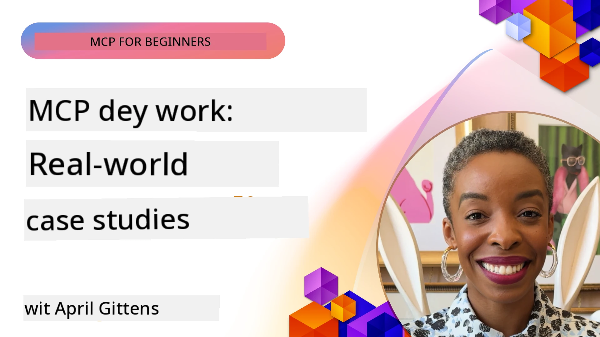

# MCP for Work: Real-Life Case Studies

_(Click di picture wey dey top to watch video for dis lesson)_

Di Model Context Protocol (MCP) dey change how AI apps dey connect wit data, tools, and services. Dis section show real-life case studies wey show how people fit use MCP for different business levels.

## Overview

Dis part show real examples of MCP use, talk about how companies dey use dis protocol to solve gbege for business. If you look these case studies, you go understand better how MCP fit do different work, grow, and help for real business matter dem.

## Wetin You Go Learn

If you check dis case studies, you go:

- Understand how MCP fit take solve specific business gbege
- Learn different ways to join systems and how dem take arrange am
- Know di beta method to use MCP for enterprise work
- See di kind challenges and beta ways wey dem find for real life MCP work
- Find chance to use di same ways for your own project dem

## Case Studies Wey Dem Show Pass

### 1. [Azure AI Travel Agents – Reference Implementation](./travelagentsample.md)

Dis case study look Microsoft complete reference solution wey show how to build travel planning app wey get plenty AI agents, use MCP, Azure OpenAI, and Azure AI Search. Di project show:

- How multiple agents dey work together wit MCP
- How enterprise data join using Azure AI Search
- Strong and scalable design using Azure services
- Easy to extend with MCP reusable parts
- User-friendly talk experience powered by Azure OpenAI

Di design and how dem take build am dey give beta understanding on how to make complex multi-agent system with MCP as control center.

### 2. [Updating Azure DevOps Items from YouTube Data](./UpdateADOItemsFromYT.md)

Dis case study show wetin MCP fit do for automatic workflow process. E show how MCP tools fit:

- Take data from online platform like YouTube
- Update work items for Azure DevOps system
- Create automation wey fit run again and again
- Join data from different system dem

Dis example show say even simple MCP use fit bring strong work speed by automating normal work and making data hold well across system.

### 3. [Real-Time Documentation Retrieval with MCP](./docs-mcp/README.md)

Dis case study guide you how to connect Python console client to MCP server for bring and log Microsoft documentation wey dey real-time and smart. You go learn how:

- Connect MCP server with Python client and official MCP SDK
- Use streaming HTTP clients to collect data fast, real-time
- Call documentation tools for server and log answers directly to console
- Join the recent Microsoft documentation into your work without comot for terminal

The chapter get hands-on project, small working code, and link to more resources for better learning. Check di full walkthrough and code so you understand how MCP fit change documentation access and developer work for console.

### 4. [Interactive Study Plan Generator Web App with MCP](./docs-mcp/README.md)

Dis case study show how to build interactive web app wey use Chainlit and MCP to create personalized study plan for any topic. Users fit choose subject (like "AI-900 certification") and study time (like 8 weeks) and app go give week-by-week guide for recommended content. Chainlit dey enable chat wey person fit talk, make di experience sweet and flexible.

- Chat web app powered by Chainlit
- User dey give topic and time
- Week by week content suggestions using MCP
- Real-time, flexible answers for chat

Di project show how conversational AI and MCP fit work together to make beta, user-driven learning tools for modern web.

### 5. [In-Editor Docs with MCP Server in VS Code](./docs-mcp/README.md)

Dis case study show how to bring Microsoft Learn Docs enter your VS Code environment using MCP server – no more waka go browser tab! You go see how to:

- Quick search and read docs inside VS Code using MCP panel or command palette
- Reference docs and put links direct to your README or course markdown files
- Use GitHub Copilot and MCP together for clean AI-powered documentation and code workflow
- Check and improve your documentation with real-time feedback and true Microsoft info
- Join MCP with GitHub workflow to keep documentation validation steady

Di implementation get:

- Sample `.vscode/mcp.json` setup for easy configuration
- Screenshot guides of in-editor experience
- Tips for combining Copilot and MCP for beta work

Dis one good for course authors, documentation writers, and developers wey want to focus for editor while working with docs, Copilot, and validation tools—everything run by MCP.

### 6. [APIM MCP Server Creation](./apimsample.md)

Dis case study give step-by-step guide on how to create MCP server using Azure API Management (APIM). E cover:

- Setup MCP server inside Azure API Management
- Show API operations as MCP tools
- Setup policies for rate limiting and security
- Test MCP server using Visual Studio Code and GitHub Copilot

Dis example show how to use Azure power to create strong MCP server wey fit work for many apps, improving how AI systems fit join enterprise APIs.

### 7. [GitHub MCP Registry — Accelerating Agentic Integration](https://github.com/mcp)

Dis case study talk about how GitHub's MCP Registry, wey dem launch for September 2025, dey solve big gbege for AI world: scattered discovery and deployment of Model Context Protocol (MCP) servers.

#### Overview
Di **MCP Registry** solve di wahala of MCP servers scatter for many repository and registry places, wey before make joining slow and error full. Di servers allow AI agents to interact with systems outside like APIs, databases, and documentation.

#### Problem Statement
Developers wey dey build agent workflows face many gbege:
- **Hard to find** MCP servers for different platform
- **Repeat setup questions** for different forum and docs
- **Security risk** from untrusted and unverified sources
- **No standard** for server quality and how dem connect

#### Solution Architecture
GitHub MCP Registry centralize trustworthy MCP servers with en beta feature dem:
- **One-click install** with VS Code for easy setup
- **Sort by stars, activity and community validation** to show correct choice
- **Direct join with GitHub Copilot and other MCP tools**
- **Open contribution model** wey community and businesses fit add to

#### Business Impact
Di registry don bring clear beta changes:
- **Faster developer onboarding** with tools like Microsoft Learn MCP Server wey dey stream official docs inside agents
- **Better productivity** with special servers like `github-mcp-server`, allowing natural language GitHub work (PR creation, CI reruns, code scan)
- **Stronger community trust** through curated list and open config standards

#### Strategic Value
For people wey sabi agent management and workflow repeat, MCP Registry dey give:
- **Modular agent deployment** wit standard parts
- **Registry-backed testing pipelines** for consistent checks and validation
- **Cross-tool join** for smooth integration across AI platforms

Dis case study show say MCP Registry na more than directory—na important platform for scalable, real-world model join and agent system deployment.

### 8. [Publishing to Social Networks from an Agent](./publora-social-publishing.md)

Dis case study explain **write-capable remote MCP server** – server wey get tools wey fit do irreversible action for user — use social publishing as example. Agent go draft post, human go approve am, then server go schedule am for different network.

Di interesting part na design limit wey publishing impose, wey go apply to any server wey dey write instead of read:

- **Open discovery, authenticated execution** — `tools/list` no need token so registries and clients fit look am, but every `tools/call` need token and else go return `401` with `WWW-Authenticate` header
- **OAuth registration without out-of-band step** — dynamic client registration now, with Client ID Metadata Documents as di way di `2026-07-28` spec dey point
- **Tool annotations** (`readOnlyHint`, `destructiveHint`, `idempotentHint`) wey clients dey use to decide wetin to confirm – na hints no be enforcement, and na wetin connector directories dey expect for review
- **Un-inventable identifiers**, so fake value go loud fail no go act like correct one
- **Idempotency keys on post tools**, so retry no go cause double post
- **No-op target for tool schema** wey test full write path but no publish anything, good for reviewers and CI

Di chapter close with short checklist you fit use for server wey you dey build.

## Conclusion

These eight full case studies show how flexible and practical Model Context Protocol be across real-life work. From complex multi-agent travel planning and enterprise API management to easy documentation workflow and strong GitHub MCP Registry, dem show how MCP provide standard, scalable way to connect AI systems with tools, data, and services to deliver beta value.

Di case studies cover many part of MCP use:
- **Enterprise Integration**: Azure API Management and Azure DevOps automation
- **Multi-Agent Orchestration**: Travel planning with coordinated AI agents
- **Developer Productivity**: VS Code integration and real-time documentation access
- **Ecosystem Development**: GitHub's MCP Registry as basic platform
- **Educational Applications**: Interactive study plan generators and conversational interfaces

By learning from these, you go get beta understand of:
- **Architectural patterns** for different scales and use cases
- **Implementation strategies** wey balance function and maintenance
- **Security and scalability** for production
- **Best practices** for MCP server build and client join
- **Ecosystem idea** for building joined AI solutions

These examples show say MCP no be just theory but serious, production-ready protocol wey fit solve beta business gbege. Whether you dey build simple automation or complex multi-agent system, di patterns and ways wey dem show here go set better foundation for your own MCP project.

## More Resources

- [Azure AI Travel Agents GitHub Repository](https://github.com/Azure-Samples/azure-ai-travel-agents)
- [Azure DevOps MCP Tool](https://github.com/microsoft/azure-devops-mcp)
- [Playwright MCP Tool](https://github.com/microsoft/playwright-mcp)
- [Microsoft Docs MCP Server](https://github.com/MicrosoftDocs/mcp)
- [GitHub MCP Registry — Accelerating Agentic Integration](https://github.com/mcp)
- [MCP Community Examples](https://github.com/microsoft/mcp)

## Wetin Follow Next

- Previous: [Module 8: Best Practices](../08-BestPractices/README.md)
- Next: [Module 10: Streamlining AI Workflows: Building an MCP Server with AI Toolkit](../10-StreamliningAIWorkflowsBuildingAnMCPServerWithAIToolkit/README.md)

---

<!-- CO-OP TRANSLATOR DISCLAIMER START -->
**Disclaimer**:
Dis document don translate wit AI translation service [Co-op Translator](https://github.com/Azure/co-op-translator). Even tho we dey try make am correct, abeg make you know say automated translation fit get errors or mistakes. Di original document for dia own language na im be di correct source. For important info, make person wey sabi human translation do am. We no go responsible for any misunderstanding or wrong understanding wey fit happen because of dis translation.
<!-- CO-OP TRANSLATOR DISCLAIMER END -->