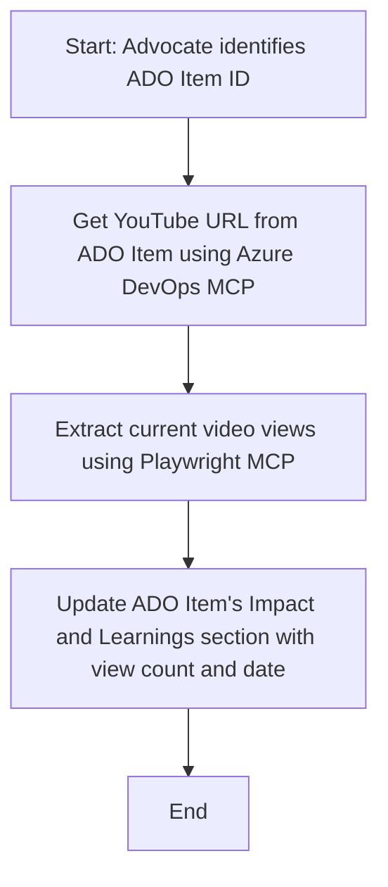

<!--
CO_OP_TRANSLATOR_METADATA:
{
  "original_hash": "14a2dfbea55ef735660a06bd6bdfe5f3",
  "translation_date": "2025-11-18T19:44:06+00:00",
  "source_file": "09-CaseStudy/UpdateADOItemsFromYT.md",
  "language_code": "pcm"
}
-->
# Case Study: How to Update Azure DevOps Items wit YouTube Data wit MCP

> **Disclaimer:** E get tools wey dey online wey fit help automate di process of updating Azure DevOps items wit data from places like YouTube. Di example wey dey here na just sample wey go show how MCP tools fit work for automation and integration tasks.

## Overview

Dis case study dey show one example of how Model Context Protocol (MCP) and di tools wey e get fit help automate di process of updating Azure DevOps (ADO) work items wit info wey dem collect from online places like YouTube. Di example wey dey here na just one way wey dis tools fit work, but e fit also work for plenty other automation needs.

For dis example, one Advocate dey use ADO items track online sessions, and each item get YouTube video URL. Wit MCP tools, di Advocate fit dey update di ADO items wit di latest video metrics, like view counts, in a way wey no go stress am and e go dey repeatable. Dis method fit also work for other cases wey online info need to enter ADO or other systems.

## Scenario

One Advocate dey in charge of tracking how online sessions and community engagements dey perform. Each session dey as ADO work item for di 'DevRel' project, and di work item get one field wey dey hold di YouTube video URL. To fit report di reach of di session well, di Advocate need to dey update di ADO item wit di current number of video views and di date wey dem collect di info.

## Tools We Dem Use

- [Azure DevOps MCP](https://github.com/microsoft/azure-devops-mcp): E dey allow programmatic access and updates to ADO work items wit MCP.
- [Playwright MCP](https://github.com/microsoft/playwright-mcp): E dey automate browser actions to collect live data from web pages, like YouTube video stats.

## Step-by-Step Workflow

1. **Find di ADO Item**: Start wit di ADO work item ID (e.g., 1234) for di 'DevRel' project.
2. **Collect di YouTube URL**: Use di Azure DevOps MCP tool to collect di YouTube URL from di work item.
3. **Get di Video Views**: Use di Playwright MCP tool to go di YouTube URL and collect di current view count.
4. **Update di ADO Item**: Put di latest view count and di date wey dem collect am inside di 'Impact and Learnings' section of di ADO work item wit di Azure DevOps MCP tool.

## Example Prompt

```bash
- Work with the ADO Item ID: 1234
- The project is '2025-Awesome'
- Get the YouTube URL for the ADO item
- Use Playwright to get the current views from the YouTube video
- Update the ADO item with the current video views and the updated date of the information
```

## Mermaid Flowchart



## Technical Implementation

- **MCP Orchestration**: Di workflow dey managed by MCP server, wey dey control how Azure DevOps MCP and Playwright MCP tools go work together.
- **Automation**: Di process fit start manually or e fit dey scheduled to run regularly to dey update ADO items.
- **Extensibility**: Dis same method fit dey used to update ADO items wit other online metrics (like likes, comments) or from other platforms.

## Results and Impact

- **Efficiency**: E go reduce di manual work wey Advocates dey do by automating how dem dey collect and update video metrics.
- **Accuracy**: E go make sure say di ADO items dey show di latest data wey dey available from online sources.
- **Repeatability**: E go provide one workflow wey fit dey used again for similar cases wey involve other data sources or metrics.

## References

- [Azure DevOps MCP](https://github.com/microsoft/azure-devops-mcp)
- [Playwright MCP](https://github.com/microsoft/playwright-mcp)
- [Model Context Protocol (MCP)](https://modelcontextprotocol.io/)

---

<!-- CO-OP TRANSLATOR DISCLAIMER START -->
**Disclaimer**:  
Dis dokyument don use AI translet service [Co-op Translator](https://github.com/Azure/co-op-translator) do di translet. Even as we dey try make am correct, abeg make you sabi say AI translet fit get mistake or no dey accurate well. Di original dokyument wey dey for im native language na di one wey you go take as di correct source. For important mata, e good make you use professional human translet. We no go fit take blame for any misunderstanding or wrong interpretation wey fit happen because you use dis translet.
<!-- CO-OP TRANSLATOR DISCLAIMER END -->