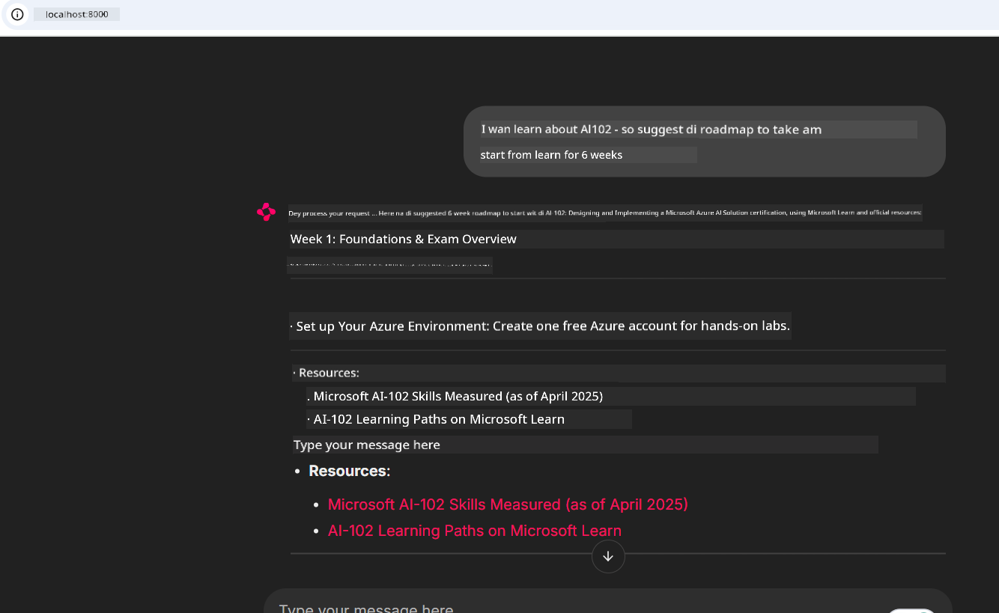

<!--
CO_OP_TRANSLATOR_METADATA:
{
  "original_hash": "4319d291c9d124ecafea52b3d04bfa0e",
  "translation_date": "2025-11-18T19:44:25+00:00",
  "source_file": "09-CaseStudy/docs-mcp/README.md",
  "language_code": "pcm"
}
-->
# Case Study: How to Connect to Microsoft Learn Docs MCP Server from Client

You don ever dey waka waka between documentation sites, Stack Overflow, and plenty search engine tabs, dey try solve problem for your code? Maybe you dey use second monitor just for docs, or you dey always dey press alt-tab between your IDE and browser. No be better thing if you fit carry documentation enter your workflow—make e dey inside your apps, your IDE, or even your own custom tools? For dis case study, we go show how you fit do am by connecting directly to Microsoft Learn Docs MCP server from your own client application.

## Overview

Modern development no be just to dey write code—e dey involve how to find correct information at the right time. Documentation dey everywhere, but e no dey where you need am pass: inside your tools and workflows. If you fit put documentation retrieval directly inside your applications, e go save time, reduce how you dey switch between things, and make you more productive. For dis section, we go show how you fit connect client to Microsoft Learn Docs MCP server, so you fit access real-time, context-aware documentation without leaving your app.

We go explain how to set up connection, send request, and handle streaming responses well. Dis method no just go make your workflow smooth, e go also open door to build smarter, more helpful developer tools.

## Learning Objectives

Why we dey do dis? Because the best developer experience na the one wey no get wahala. Imagine say your code editor, chatbot, or web app fit answer your documentation questions sharp sharp, using the latest content from Microsoft Learn. By the time you finish dis chapter, you go sabi how to:

- Understand the basics of MCP server-client communication for documentation
- Build console or web application wey go connect to Microsoft Learn Docs MCP server
- Use streaming HTTP clients to get real-time documentation
- Log and understand documentation responses inside your application

You go see how dis skills fit help you build tools wey no just dey react, but dey interactive and dey understand context.

## Scenario 1 - Real-Time Documentation Retrieval with MCP

For dis scenario, we go show how you fit connect client to Microsoft Learn Docs MCP server, so you fit access real-time, context-aware documentation without leaving your app.

Make we try am. Your work na to write app wey go connect to Microsoft Learn Docs MCP server, use `microsoft_docs_search` tool, and log the streaming response for console.

### Why dis method?
Because na the foundation to build more advanced integrations—whether you wan power chatbot, IDE extension, or web dashboard.

You go find the code and instructions for dis scenario inside [`solution`](./solution/README.md) folder for dis case study. The steps go guide you how to set up the connection:
- Use the official MCP SDK and streamable HTTP client to connect
- Call the `microsoft_docs_search` tool with query parameter to get documentation
- Do proper logging and error handling
- Create interactive console interface wey go allow users enter plenty search queries

Dis scenario go show how to:
- Connect to Docs MCP server
- Send query
- Parse and print the results

See how the solution go look like when you run am:

```
Prompt> What is Azure Key Vault?
Answer> Azure Key Vault is a cloud service for securely storing and accessing secrets. ...
```

Below na small sample solution. The full code and details dey available for the solution folder.

<details>
<summary>Python</summary>

```python
import asyncio
from mcp.client.streamable_http import streamablehttp_client
from mcp import ClientSession

async def main():
    async with streamablehttp_client("https://learn.microsoft.com/api/mcp") as (read_stream, write_stream, _):
        async with ClientSession(read_stream, write_stream) as session:
            await session.initialize()
            result = await session.call_tool("microsoft_docs_search", {"query": "Azure Functions best practices"})
            print(result.content)

if __name__ == "__main__":
    asyncio.run(main())
```

- For the full implementation and logging, check [`scenario1.py`](../../../../09-CaseStudy/docs-mcp/solution/python/scenario1.py).
- For installation and usage instructions, check the [`README.md`](./solution/python/README.md) file for the same folder.
</details>

## Scenario 2 - Interactive Study Plan Generator Web App with MCP

For dis scenario, you go learn how to put Docs MCP inside web development project. The goal na to make users fit search Microsoft Learn documentation directly from web interface, so documentation go dey available sharp sharp inside your app or site.

You go learn how to:
- Set up web app
- Connect to Docs MCP server
- Handle user input and show results

See how the solution go look like when you run am:

```
User> I want to learn about AI102 - so suggest the roadmap to get it started from learn for 6 weeks

Assistant> Here’s a detailed 6-week roadmap to start your preparation for the AI-102: Designing and Implementing a Microsoft Azure AI Solution certification, using official Microsoft resources and focusing on exam skills areas:

---
## Week 1: Introduction & Fundamentals
- **Understand the Exam**: Review the [AI-102 exam skills outline](https://learn.microsoft.com/en-us/credentials/certifications/exams/ai-102/).
- **Set up Azure**: Sign up for a free Azure account if you don't have one.
- **Learning Path**: [Introduction to Azure AI services](https://learn.microsoft.com/en-us/training/modules/intro-to-azure-ai/)
- **Focus**: Get familiar with Azure portal, AI capabilities, and necessary tools.

....more weeks of the roadmap...

Let me know if you want module-specific recommendations or need more customized weekly tasks!
```

Below na small sample solution. The full code and details dey available for the solution folder.



<details>
<summary>Python (Chainlit)</summary>

Chainlit na framework wey dey help build conversational AI web apps. E dey make am easy to create interactive chatbots and assistants wey fit call MCP tools and show results in real time. E dey good for quick prototyping and user-friendly interfaces.

```python
import chainlit as cl
import requests

MCP_URL = "https://learn.microsoft.com/api/mcp"

@cl.on_message
def handle_message(message):
    query = {"question": message}
    response = requests.post(MCP_URL, json=query)
    if response.ok:
        result = response.json()
        cl.Message(content=result.get("answer", "No answer found.")).send()
    else:
        cl.Message(content="Error: " + response.text).send()
```

- For the full implementation, check [`scenario2.py`](../../../../09-CaseStudy/docs-mcp/solution/python/scenario2.py).
- For setup and running instructions, check the [`README.md`](./solution/python/README.md).
</details>

## Scenario 3: In-Editor Docs with MCP Server in VS Code

If you wan get Microsoft Learn Docs directly inside your VS Code (instead of dey switch browser tabs), you fit use MCP server inside your editor. Dis one go allow you:
- Search and read docs inside VS Code without leaving your coding environment.
- Reference documentation and put links directly inside your README or course files.
- Use GitHub Copilot and MCP together for smooth, AI-powered documentation workflow.

**You go learn how to:**
- Add valid `.vscode/mcp.json` file to your workspace root (see example below).
- Open MCP panel or use command palette for VS Code to search and insert docs.
- Reference documentation directly inside your markdown files as you dey work.
- Combine dis workflow with GitHub Copilot to make you more productive.

See example of how to set up MCP server inside VS Code:

```json
{
  "servers": {
    "LearnDocsMCP": {
      "url": "https://learn.microsoft.com/api/mcp"
    }
  }
}
```

</details>

> For detailed walkthrough with screenshots and step-by-step guide, check [`README.md`](./solution/scenario3/README.md).


Dis method dey good for anybody wey dey build technical courses, dey write documentation, or dey develop code wey need reference often.

## Key Takeaways

To put documentation directly inside your tools no be just convenience—e dey change the game for productivity. By connecting to Microsoft Learn Docs MCP server from your client, you fit:

- Stop to dey switch between your code and documentation
- Get up-to-date, context-aware docs in real time
- Build smarter, more interactive developer tools

Dis skills go help you create solutions wey no just dey efficient, but dey sweet to use.

## Additional Resources

To learn more, check dis official resources:

- [Microsoft Learn Docs MCP Server (GitHub)](https://github.com/MicrosoftDocs/mcp)
- [Get started with Azure MCP Server (mcp-python)](https://learn.microsoft.com/en-us/azure/developer/azure-mcp-server/get-started#create-the-python-app)
- [What is the Azure MCP Server?](https://learn.microsoft.com/en-us/azure/developer/azure-mcp-server/)
- [Model Context Protocol (MCP) Introduction](https://modelcontextprotocol.io/introduction)
- [Add plugins from a MCP Server (Python)](https://learn.microsoft.com/en-us/semantic-kernel/concepts/plugins/adding-mcp-plugins)

---

<!-- CO-OP TRANSLATOR DISCLAIMER START -->
**Disclaimer**:  
Dis dokyument don use AI translation service [Co-op Translator](https://github.com/Azure/co-op-translator) take translate am. Even though we dey try make sure say e correct, abeg sabi say automatic translation fit get mistake or no too accurate. Di original dokyument for im native language na di main correct source. For important information, e go beta make professional human translator check am. We no go fit take blame for any misunderstanding or wrong interpretation wey fit happen because you use dis translation.
<!-- CO-OP TRANSLATOR DISCLAIMER END -->