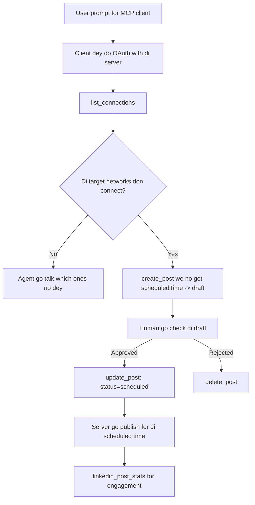

# Case Study: How to Publish to Social Networks Using an Agent with One Remote MCP Server

> **Disclaimer:** Plenti different services and open-source projects fit publish for social networks, and one team fit join all di network API togeder directly. Di example wey dey below na one way wey you fit design and take use **write-capable remote MCP server**. Publora na commercial service wey get free plan; di pattern wey dem tok here fit work for any MCP server wey dey do irreversible actions for behalf of user.

## Overview

Agents sabi draft content but dem no too sabi how to deliver am. Model fit write release announcement quick quick, but after that dem stop: to publish am, you need one API for each network, one OAuth app for each network, plus different media rules for each. Most teams just dey copy di text enter browser by hand.

This case study go show how to connect that last step with just one remote MCP server, plus—the important way wey any **write-capable** server suppose do am well. To read data no too hard. To publish be another thing: wrong tool call go show for audience and e no fit reverse.

## Scenario

One small developer-relations team dey draft posts inside agent (Claude, VS Code, Cursor — di client no matter). Them want make di agent fit:

- check which social accounts dem don connect,
- draft post and keep am as draft till human approve am,
- attach picture,
- schedule am for plenty networks at the time wey dem choose,
- and later show how e perform.

The main thing be say, dem want make di agent no fit publish by mistake while dem still dey test things.

## Tools We Dem Use

- [Publora MCP Server](https://github.com/publora/mcp-server) — this na remote MCP server (`streamable-http`) wey get tools for publishing, scheduling, media and LinkedIn analytics. E register for official MCP registry as `com.publora/mcp-server`.

## Step-by-Step Workflow

1. **Connect the server.** Clients wey dey use OAuth go complete authorization-code flow with PKCE against server own consent screen; clients wey no dey use OAuth, like CLI wey no get UI, go use Publora API key for header. Both ways dey work; di one wey you go use depend on client, no be server.
2. **List connections.** Di agent go call `list_connections` and e go get di connected accounts and their IDs.
3. **Draft.** Di agent go call `create_post` *without* scheduled time. Di post go stay as draft — dem no go publish am.
4. **Attach media.** Public image URLs dey passed inside di same call; server go download and check dem.
5. **Schedule.** After human don approve, `update_post` go set di status to scheduled with ISO 8601 time.
6. **Measure.** For LinkedIn, `linkedin_post_stats` go return engagement once di post don dey live.

## Example Prompt

```text
Which social accounts do I have connected?
Draft a post announcing our new changelog page, attach the screenshot at
https://example.com/changelog.png, and keep it as a draft — do not publish it.
Once I approve, schedule it to LinkedIn and Bluesky for tomorrow at 09:00 UTC.
```

## Mermaid Flowchart



## Technical Implementation

Di lessons wey dey below na di part wey fit carry go use for this kind case study.

### Open discovery, authenticated execution

`tools/list` dey available without credentials; every `tools/call` need token
and if no get, e go give `401` with `WWW-Authenticate` header wey point to
protected-resource metadata. Di server own legacy endpoint still answer
unauthenticated `initialize` for clients wey dey use protocol versions before
`2026-07-28`; current clients no dey use that handshake.

This kind server-specific split make registries, catalogues, and clients fit see tool
names, schemas, and annotations without secret but e still stop anonymous
execution. Open discovery na deployment choice, no be MCP requirement; some
protected deployment fit need authorization for `tools/list`.

### Registration: dynamic client registration, and wetin replace am

Di server dey advertise `/.well-known/oauth-protected-resource` and `/.well-known/oauth-authorization-server`, and e support authorization-code flow with PKCE (`S256`), refresh tokens, and **dynamic client registration**.

Dynamic registration don remove di manual step for legacy clients: without am,
every client need one pre-issued `client_id` from di vendor.

Treat this as compatibility behaviour, no be di design to copy. Di `2026-07-28` revision for di specification dey deprecate dynamic client registration for Client ID Metadata Documents, where client get stable HTTPS URL for metadocument and that URL *be* the `client_id`. DCR still dey work now, but any new server wey dem dey build now go plan for CIMD and keep DCR only for old clients.

### Tool annotations no be decoration

Every tool get `title` plus hints like: `readOnlyHint`, `destructiveHint`, `idempotentHint`, `openWorldHint`.

Two main reasons to dey put eye for them. First, clients use hints to decide wetin to confirm with user — client fit auto-run read-only lookup and stop before delete to get approval. Specification clear say annotations na untrusted hints, no be authorization machine: dem shape wetin client fit do, dem no fit stop anything for server, and server still must do im own rules. Second, major connector directories now *require* them for review; any server wey tools no get proper titles and hints go get rejected no matter how work well e do.

### Make identifiers no fit be invented

Platform identifiers na opaque string wey `list_connections` return, plus schema talk say make dem copy am exactly and no guess. Server go reject anything wey no follow.

Models like guessers. Any write-capable server suppose believe say identifiers fit be hallucinated and make sure dat kind thing go fail fast and loudly, no be to act on something wey just look real.

### Fail before publishing, with message wey person fit act on

Some networks no allow text-only posts; dem need image or video. Server go check dis when dem do scheduling, and error message go talk platform name and wetin dey miss.

Agent fit fix "Instagram requires media — attach image or video" error without doing another round trip. E no fit fix generic `400` error.

### Make retries safe

The two tools wey create content, `create_post` and `update_post`, dem accept idempotency key: when you use am for same request, e go replay original response instead of making second post. Agent runtimes dey retry on timeouts; if no idempotency dey, slow response fit cause duplicate publication. Other write tools — deletion, media steps, LinkedIn reactions and comments — no dey take idempotency key, so retry no automatically safe. Make you sabi which mutations protected and which no be.

### Provide way to test wey no publish anything


Di server dey accept one reserved target, `publora-playground`, wey dem dey validate and sabi like real destination and den dem discard am — nothing go reach any live account. E dey inside tool schema itself, wey any client fit read without credentials: di `platforms` field of `create_post` talk am as "connection-test target wey no need real connection — post go dey acknowledged and discard, nothing go publish". Make you call am by passing am as di only entry: `platforms: ["publora-playground"]`.

Dis one turn out to be one of di most useful detail for whole surface. People wey dey review connector directories, contributors and CI fit try out di full write path from start to finish with no wahala to any real audience. Any MCP server with irreversible action go benefit from documented no-op target.

## Results and Impact

- Di publishing step commot from browser go di same conversation where dem dey write di content, and di draft-first habit dey keep human inside di loop. Make you clear about wetin dat be: draft na convention, no be boundary. Di same credential fit schedule or publish, so anybody wey need real approval gate gats enforce am outside di tool surface — separate credentials, or policy layer for front of server.
- Per-network difference dem — media requirements, threading, reply controls — dem dey handle once for server, no be every agent wey dey talk to am.
- Di same server dey back several MCP clients without pre-issued credentials.
    Current clients fit use Client ID Metadata Documents; DCR still dey as fallback
    for old clients dem.
- Di design constraints wey I talk for top na from connector-directory reviews and users dem: annotations, OAuth and safe test target na all of dem one or two require.

## References

- [Publora MCP Server (source)](https://github.com/publora/mcp-server)
- [Publora API and MCP documentation](https://docs.publora.com)
- [MCP Registry entry: `com.publora/mcp-server`](https://registry.modelcontextprotocol.io/v0/servers?search=com.publora/mcp-server)
- [MCP specification — Authorization](https://modelcontextprotocol.io/specification/2026-07-28/basic/authorization)
- [MCP specification — Tool annotations](https://modelcontextprotocol.io/docs/concepts/tools)

## Wetin Next

- Take MCP server wey you dey build and check di three cheapest wins for here: annotations for every tool, idempotency key for every write, and documented no-op target.
- Try di open-discovery split: call `tools/list` make e run for public remote server without any credentials, den call tool and check di `401` challenge.
- Think about wetin "undo" mean for your own domain. Publishing get drafts and deletion; if your actions no get equivalent, confirmation gats dey for tool design, no dey di prompt.

---

<!-- CO-OP TRANSLATOR DISCLAIMER START -->
**Disclaimer**:
Dis document don translate wit AI translation service [Co-op Translator](https://github.com/Azure/co-op-translator). Even tho we dey try make am correct, abeg make you know say automated translation fit get errors or mistakes. Di original document for dia own language na im be di correct source. For important info, make person wey sabi human translation do am. We no go responsible for any misunderstanding or wrong understanding wey fit happen because of dis translation.
<!-- CO-OP TRANSLATOR DISCLAIMER END -->