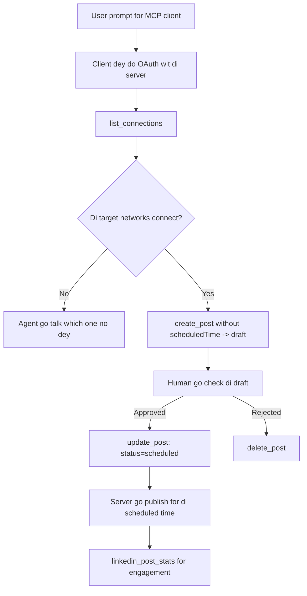

# Case Study: Publishing to Social Networks from an Agent with a Remote MCP Server

> **Disclaimer:** Planti services and open-source projects fit publish to social networks, and team fit also join each network API direct. Di example under na one way wey **write-capable remote MCP server** fit be designed and used. Publora na commercial service wey get free tier; di patterns wey dey here fit any MCP server wey dey do irreversible actions for user.

## Overview

Agents sabi draft content well well but dem no too sharp for deliver am. Model fit write release announcement for seconds, but work stop so: to publish e mean API per network, OAuth app per network, plus different media rules for each. Most teams dey solve am by copying text go browser by hand.

Dis case study look how dem fit close last step with one remote MCP server, and—more helpfully for person wey wan build am—dem design moves wey **write-capable** server suppose sabi. To read data na easy, but to publish no be so: wrong tool call go show for audience eye and e no fit undo.

## Scenario

Small developer-relations team dey draft posts inside agent (like Claude, VS Code, Cursor—di client no matter). Dem want the agent to:

- see which social accounts dem connect,
- draft post dem go keep am as draft make person fit approve am,
- put image join,
- schedule am for different networks for chosen time,
- plus later show how e perform.

Most importantly, dem want make agent no fit publish by mistake while dem still dey experiment.

## Tools Used

- [Publora MCP Server](https://github.com/publora/mcp-server) — remote MCP server (`streamable-http`) wey dey show publishing, scheduling, media, and LinkedIn analytics tools. Dem register am for official MCP registry as `com.publora/mcp-server`.

## Step-by-Step Workflow

1. **Connect the server.** Clients wey dey talk OAuth go finish authorization-code flow with PKCE for server own consent screen; clients wey no dey like headless CLIs, go use Publora API key for header. Both ways dey supported, and which one you get depend on client, no be server.
2. **List connections.** Agent go call `list_connections` and e go get connected accounts plus their IDs.
3. **Draft.** Agent call `create_post` *without* scheduled time. Post go save as draft—nothing publish.
4. **Attach media.** Public image URLs dey pass inside same call; server go download and check dem.
5. **Schedule.** After human approve, `update_post` go set the status to scheduled with ISO 8601 time.
6. **Measure.** For LinkedIn, `linkedin_post_stats` go bring engagement data once post dey live.

## Example Prompt

```text
Which social accounts do I have connected?
Draft a post announcing our new changelog page, attach the screenshot at
https://example.com/changelog.png, and keep it as a draft — do not publish it.
Once I approve, schedule it to LinkedIn and Bluesky for tomorrow at 09:00 UTC.
```

## Mermaid Flowchart



## Technical Implementation

Lessons wey dey under na di part wey fit transfer from dis case study.

### Open discovery, authenticated execution

`tools/list` no need credentials; but every `tools/call` need token or e go return `401` with `WWW-Authenticate` header wey point to protected-resource metadata. (Server still fit answer unauthenticated `initialize`, but na only clients for protocol version before `2026-07-28` e concern; dat revision remove handshake clear.)

Dis style dey important for real. Registries, catalogues and clients fit inspect tool surface—names, schemas, annotations—without secret, but nothing fit run anonymously. Server wey go need token for `initialize` go dey invisible to tooling; server wey allow anonymous `tools/call` na problem.

### Registration: dynamic client registration, and wetin dey replace am

Server dey advertise `/.well-known/oauth-protected-resource` and `/.well-known/oauth-authorization-server`, and e support authorization-code flow with PKCE (`S256`), refresh tokens, and **dynamic client registration**.

Dynamic registration remove manual step: without am, every client need pre-issued `client_id`, meaning you go need ask vendor for each new client.

No see dis as design to copy, but as compatibility behaviour. `2026-07-28` revision deprecate dynamic client registration for Client ID Metadata Documents (CIMD), where client host metadata document at stable HTTPS URL, and dat URL na `client_id`. DCR still dey work now, but new server suppose plan for CIMD and keep DCR only for old clients.

### Tool annotations no na decoration

Every tool get `title` and hints: `readOnlyHint`, `destructiveHint`, `idempotentHint`, `openWorldHint`.

Two reasons to put mind for dem. First, clients use hints to know wetin confirm with user—client fit auto-run read-only check and stop for approval before delete. Spec say annotations na untrusted hints, no be authorization: dem shape wetin client fit do, no stop anything server side, and server still aff get own rules. Second, connector directories now *require* dem for review; server without titles and hints for tools go for reject no matter how e work.

### Make identifiers no fit be make-up

Platform identifiers na opaque strings wey `list_connections` give, and schema talk clearly say dem must copy exactly, no dey guess. Server no go accept any odas.

Models sabi guess well. Any write-capable server suppose dey expect say identifier fit be hallucinated, and make dat path fail well and early instead of acting on like e real.

### Fail before publishing, with message wetin person fit act on

Some networks no go accept text-only posts, e go need image or video. E dey validate when post dey scheduled, and error go tell platform plus wetin dey miss.

Agent fit recover from "Instagram needs media—attach image or video" without extra round trip. E no fit recover from generic `400`.

### Make retries safe

Two tools wey dey create content, `create_post` and `update_post`, accept idempotency key: if you use am again with same request, e go return original answer, no create another post. Agent runtimes dey retry on timeouts; without idempotency, slow response fit create duplicate publish. Other write tools—deletions, media, LinkedIn reactions/comments—no get am, so retry no too safe there. Good know which mutations get protection and which no.

### Provide way to test wey no publish anything

Server accept reserved target, `publora-playground`, wey e check and acknowledge like real destination but no dey publish—nothing go reach live account. E dey for tool schema, wey any client fit see without credentials: `platforms` inside `create_post` show am as "connection-test target wey no need real connection—post dey acknowledged and discarded, nothing publish". Use am by passing only dat: `platforms: ["publora-playground"]`.

Dis one become one of most useful detail for whole surface. Connector directory reviewers, contributors and CI fit run full write path from start to finish with no risk to real audience. Any MCP server wey get irreversible actions go benefit from documented no-op target.

## Results and Impact

- Publishing step shift from browser go inside conversation wey content dey written, and draft-first habit keep humans dey involved. Be clear about wetin draft mean: na convention, no be boundary. Same credential fit schedule or publish, so anyone wey need real approval gate go enforce am outside tool surface—different credentials, or policy layer before server.
- Per-network diffs—media needs, threading, reply controls—dem solve am once for server instead of every agent wey dey talk to am.
- Same server dey serve many MCP clients without per-client work, because discovery dey open and registration dey dynamic.
- Design rules above shape by connector-directory reviews and users: annotations, OAuth and safe test target na things dem each one require.

## References

- [Publora MCP Server (source)](https://github.com/publora/mcp-server)
- [Publora API and MCP documentation](https://docs.publora.com)
- [MCP Registry entry: `com.publora/mcp-server`](https://registry.modelcontextprotocol.io/v0/servers?search=com.publora/mcp-server)
- [MCP specification — Authorization](https://modelcontextprotocol.io/specification/draft/basic/authorization)
- [MCP specification — Tool annotations](https://modelcontextprotocol.io/docs/concepts/tools)

## What's Next

- Take MCP server wey you dey build and check di three cheapest wins here: annotations for every tool, idempotency key for every write, and documented no-op target.
- Try open-discovery split: call `tools/list` for public remote server with no credentials, then call tool and check `401` challenge.
- Think about wetin "undo" mean for your domain. Publishing get drafts and deletion; if your actions no get equal, confirmation suppose dey for tool design, no dey inside prompt.

---

<!-- CO-OP TRANSLATOR DISCLAIMER START -->
**Disclaimer**:
Dis document don translate wit AI translation service [Co-op Translator](https://github.com/Azure/co-op-translator). Even tho we dey try make am correct, abeg make you know say automated translation fit get errors or mistakes. Di original document for dia own language na im be di correct source. For important info, make person wey sabi human translation do am. We no go responsible for any misunderstanding or wrong understanding wey fit happen because of dis translation.
<!-- CO-OP TRANSLATOR DISCLAIMER END -->