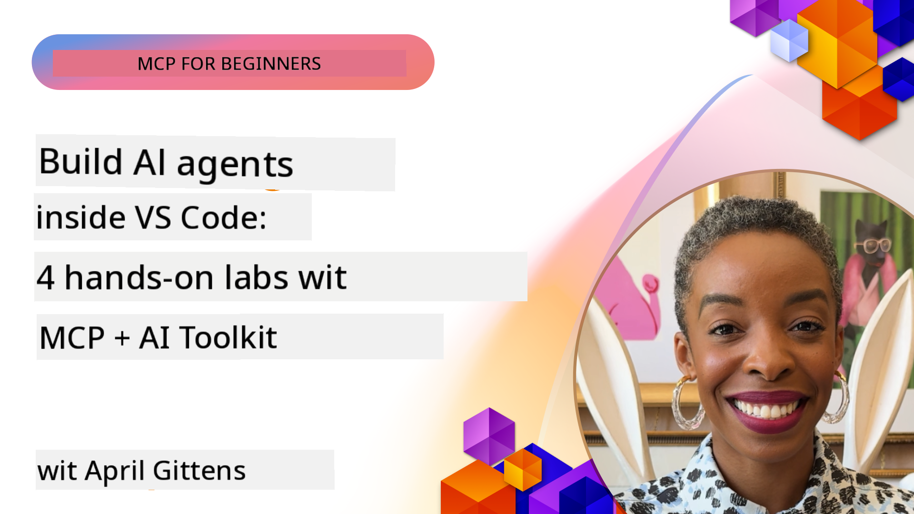

<!--
CO_OP_TRANSLATOR_METADATA:
{
  "original_hash": "1b000fd6e1b04c047578bfc5d07d54eb",
  "translation_date": "2025-11-18T18:49:33+00:00",
  "source_file": "10-StreamliningAIWorkflowsBuildingAnMCPServerWithAIToolkit/README.md",
  "language_code": "pcm"
}
-->
# Streamlining AI Workflows: How to Build MCP Server wit AI Toolkit

## 🎯 Overview

_(Click di image wey dey up to watch di video for dis lesson)_

Welcome to di **Model Context Protocol (MCP) Workshop**! Dis workshop go teach you how to use two beta technologies wey go change di way we dey develop AI applications:

- **🔗 Model Context Protocol (MCP)**: Na open standard wey dey make AI tools connect well well
- **🛠️ AI Toolkit for Visual Studio Code (AITK)**: Microsoft strong AI development extension

### 🎓 Wetin You Go Learn

By di end of dis workshop, you go sabi how to build smart applications wey go connect AI models wit tools and services wey dey real life. From automated testing to custom API integration, you go get beta skills to solve business wahala.

## 🏗️ Technology Stack

### 🔌 Model Context Protocol (MCP)

MCP na di **"USB-C for AI"** - e be universal standard wey dey connect AI models to tools and data sources.

**✨ Key Features:**

- 🔄 **Standardized Integration**: Universal interface wey dey connect AI tools
- 🏛️ **Flexible Architecture**: Local & remote servers wey dey use stdio/SSE transport
- 🧰 **Rich Ecosystem**: Tools, prompts, and resources dey one protocol
- 🔒 **Enterprise-Ready**: E get security and e dey reliable

**🎯 Why MCP Matter:**
Just like USB-C wey clear cable wahala, MCP dey clear di wahala wey dey AI integration. One protocol, plenty possibilities.

### 🤖 AI Toolkit for Visual Studio Code (AITK)

Microsoft strong AI development extension wey dey turn VS Code into AI powerhouse.

**🚀 Core Capabilities:**

- 📦 **Model Catalog**: Access models from Azure AI, GitHub, Hugging Face, Ollama
- ⚡ **Local Inference**: ONNX-optimized CPU/GPU/NPU execution
- 🏗️ **Agent Builder**: Visual AI agent development wit MCP integration
- 🎭 **Multi-Modal**: Text, vision, and structured output support

**💡 Development Benefits:**

- No need to configure model deployment
- Visual prompt engineering
- Real-time testing playground
- MCP server dey integrate well well

## 📚 Learning Journey

### [🚀 Module 1: AI Toolkit Fundamentals](./lab1/README.md)

**Duration**: 15 minutes

- 🛠️ Install and configure AI Toolkit for VS Code
- 🗂️ Check di Model Catalog (100+ models from GitHub, ONNX, OpenAI, Anthropic, Google)
- 🎮 Learn how to use di Interactive Playground for real-time model testing
- 🤖 Build your first AI agent wit Agent Builder
- 📊 Check model performance wit built-in metrics (F1, relevance, similarity, coherence)
- ⚡ Learn batch processing and multi-modal support

**🎯 Learning Outcome**: Create one functional AI agent wey go make you sabi AITK well well

### [🌐 Module 2: MCP wit AI Toolkit Fundamentals](./lab2/README.md)

**Duration**: 20 minutes

- 🧠 Sabi di Model Context Protocol (MCP) architecture and concepts
- 🌐 Check di MCP server ecosystem wey Microsoft get
- 🤖 Build browser automation agent wit Playwright MCP server
- 🔧 Connect MCP servers wit AI Toolkit Agent Builder
- 📊 Configure and test MCP tools inside your agents
- 🚀 Export and deploy MCP-powered agents for production

**🎯 Learning Outcome**: Deploy AI agent wey dey use external tools wit MCP

### [🔧 Module 3: Advanced MCP Development wit AI Toolkit](./lab3/README.md)

**Duration**: 20 minutes

- 💻 Create custom MCP servers wit AI Toolkit
- 🐍 Configure and use di latest MCP Python SDK (v1.9.3)
- 🔍 Set up and use MCP Inspector for debugging
- 🛠️ Build Weather MCP Server wit professional debugging workflows
- 🧪 Debug MCP servers inside Agent Builder and Inspector environments

**🎯 Learning Outcome**: Develop and debug custom MCP servers wit beta tools

### [🐙 Module 4: Practical MCP Development - Custom GitHub Clone Server](./lab4/README.md)

**Duration**: 30 minutes

- 🏗️ Build real-world GitHub Clone MCP Server for development workflows
- 🔄 Implement smart repository cloning wit validation and error handling
- 📁 Create intelligent directory management and VS Code integration
- 🤖 Use GitHub Copilot Agent Mode wit custom MCP tools
- 🛡️ Apply production-ready reliability and cross-platform compatibility

**🎯 Learning Outcome**: Deploy production-ready MCP server wey dey make development workflows easy

## 💡 Real-World Applications & Impact

### 🏢 Enterprise Use Cases

#### 🔄 DevOps Automation

Change your development workflow wit smart automation:

- **Smart Repository Management**: AI wey dey help review code and make merge decisions
- **Intelligent CI/CD**: Automated pipeline wey dey optimize based on code changes
- **Issue Triage**: Automatic bug classification and assignment

#### 🧪 Quality Assurance Revolution

Make testing beta wit AI-powered automation:

- **Intelligent Test Generation**: Create test suites automatically
- **Visual Regression Testing**: AI wey dey detect UI changes
- **Performance Monitoring**: Identify and solve issues before dem happen

#### 📊 Data Pipeline Intelligence

Build smarter data processing workflows:

- **Adaptive ETL Processes**: Self-optimizing data transformations
- **Anomaly Detection**: Real-time data quality monitoring
- **Intelligent Routing**: Smart data flow management

#### 🎧 Customer Experience Enhancement

Make customer interactions beta:

- **Context-Aware Support**: AI agents wey sabi customer history
- **Proactive Issue Resolution**: Predictive customer service
- **Multi-Channel Integration**: Unified AI experience across platforms

## 🛠️ Prerequisites & Setup

### 💻 System Requirements

| Component | Requirement | Notes |
|-----------|-------------|-------|
| **Operating System** | Windows 10+, macOS 10.15+, Linux | Any modern OS |
| **Visual Studio Code** | Latest stable version | Required for AITK |
| **Node.js** | v18.0+ and npm | For MCP server development |
| **Python** | 3.10+ | Optional for Python MCP servers |
| **Memory** | 8GB RAM minimum | 16GB recommended for local models |

### 🔧 Development Environment

#### Recommended VS Code Extensions

- **AI Toolkit** (ms-windows-ai-studio.windows-ai-studio)
- **Python** (ms-python.python)
- **Python Debugger** (ms-python.debugpy)
- **GitHub Copilot** (GitHub.copilot) - Optional but helpful

#### Optional Tools

- **uv**: Modern Python package manager
- **MCP Inspector**: Visual debugging tool for MCP servers
- **Playwright**: For web automation examples

## 🎖️ Learning Outcomes & Certification Path

### 🏆 Skill Mastery Checklist

By di time you finish dis workshop, you go sabi:

#### 🎯 Core Competencies

- [ ] **MCP Protocol Mastery**: Understand di architecture and implementation patterns well well
- [ ] **AITK Proficiency**: Sabi how to use AI Toolkit for fast development
- [ ] **Custom Server Development**: Build, deploy, and maintain MCP servers for production
- [ ] **Tool Integration Excellence**: Connect AI wit existing development workflows
- [ ] **Problem-Solving Application**: Use di skills wey you learn to solve business wahala

#### 🔧 Technical Skills

- [ ] Set up and configure AI Toolkit inside VS Code
- [ ] Design and implement custom MCP servers
- [ ] Connect GitHub Models wit MCP architecture
- [ ] Build automated testing workflows wit Playwright
- [ ] Deploy AI agents for production
- [ ] Debug and optimize MCP server performance

#### 🚀 Advanced Capabilities

- [ ] Architect enterprise-scale AI integrations
- [ ] Implement security best practices for AI applications
- [ ] Design scalable MCP server architectures
- [ ] Create custom tool chains for specific domains
- [ ] Teach others how to develop AI-native applications

## 📖 Additional Resources

- [MCP Specification](https://modelcontextprotocol.io/docs)
- [AI Toolkit GitHub Repository](https://github.com/microsoft/vscode-ai-toolkit)
- [Sample MCP Servers Collection](https://github.com/modelcontextprotocol/servers)
- [Best Practices Guide](https://modelcontextprotocol.io/docs/best-practices)

---

**🚀 Ready to change di way you dey develop AI applications?**

Make we build di future of smart applications together wit MCP and AI Toolkit!

---

<!-- CO-OP TRANSLATOR DISCLAIMER START -->
**Disclaimer**:  
Dis dokyument don translate wit AI translation service [Co-op Translator](https://github.com/Azure/co-op-translator). Even though we dey try make am accurate, abeg make you sabi say machine translation fit get mistake or no dey correct well. Di original dokyument for di language wey dem write am first na di one wey you go take as di correct source. For important information, e good make professional human translator check am. We no go fit take blame for any misunderstanding or wrong interpretation wey fit happen because you use dis translation.
<!-- CO-OP TRANSLATOR DISCLAIMER END -->