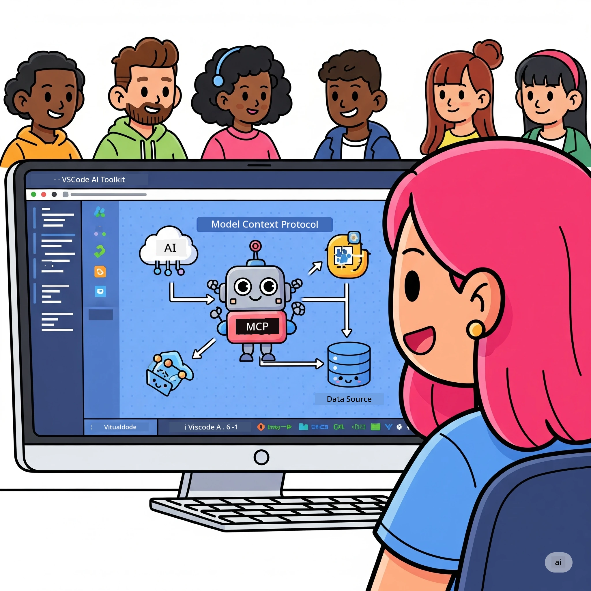
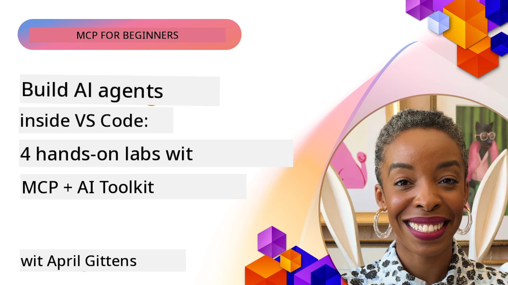

# Streamlining AI Workflows: Building an MCP Server wit Microsoft Foundry Toolkit

## 🎯 Overview

_(Click di pikshua we de for up to watch dis video lesson)_

Welcome to di **Model Context Protocol (MCP) Workshop**! Dis complete hands-on workshop combine two beta technologies to change how AI app development dey done:

> **Compatibility note:** di workshop code dem build and test wit MCP
> `2025-11-25`, like di badge we de for above show. Use di
> [current `2026-07-28` specification](https://modelcontextprotocol.io/specification/2026-07-28/)
> for new protocol creations and check SDK release notes before
> you move di labs.

- **🔗 Model Context Protocol (MCP)**: Na open standard for easy AI tool joining
- **🛠️ Microsoft Foundry Toolkit Extension for VS Code**: Microsoft strong AI development tool extension

### 🎓 Wetin You Go Learn

By di time you finish dis workshop, you go sabi how to build smart applications wey go connect AI models wit normal tools and services. From automatic testing to custom API connection, you go get real skills wey fit solve serious business wahala.

## 🏗️ Technology Stack

### 🔌 Model Context Protocol (MCP)

MCP na **"USB-C for AI"** - na general standard wey dey connect AI models to tools and data outside.

**✨ Key Features:**

- 🔄 **Standardized Integration**: One way wey dey universal to join AI to tools
- 🏛️ **Flexible Architecture**: Local and remote servers through stdio/SSE transport
- 🧰 **Rich Ecosystem**: Tools, prompts and resources all dey one protocol
- 🔒 **Enterprise-Ready**: Security and dependability dey inside

**🎯 Why MCP Matter:**
Just like USB-C stop cable confusion, MCP stop AI integration palava. One protocol, plenty possibilities.

### 🤖 Microsoft Foundry Toolkit Extension for VS Code

Microsoft main AI development extension wey turn VS Code to strong AI system.

**🚀 Core Capabilities:**

- 📦 **Model Catalog**: Access models from Azure AI, GitHub, Hugging Face, Ollama
- ⚡ **Local Inference**: ONNX-optimized CPU/GPU/NPU execution
- 🏗️ **Agent Builder**: Visual AI agent development wit MCP join
- 🎭 **Multi-Modal**: Text, vision, and structured output support

**💡 Development Benefits:**

- No wahala config model deployment
- Visual prompt engineering
- Real-time testing playground
- Smooth MCP server integration

## 📚 Learning Journey

### [🚀 Module 1: Microsoft Foundry Toolkit Fundamentals](./lab1/README.md)

**Duration**: 15 minutes

- 🛠️ Install and setup Microsoft Foundry Toolkit for VS Code
- 🗂️ Check out di Model Catalog (100+ models from GitHub, ONNX, OpenAI, Anthropic, Google)
- 🎮 Master di interactive playground for real-time model testing
- 🤖 Build your first AI agent wit Agent Builder
- 📊 Check how model perform wit built-in metrics (F1, relevance, similarity, coherence)
- ⚡ Learn batch processing and multi-modal support features

**🎯 Learning Outcome**: Build working AI agent wit full understanding of Microsoft Foundry Toolkit capabilities

### [🌐 Module 2: MCP wit Microsoft Foundry Toolkit Fundamentals](./lab2/README.md)

**Duration**: 20 minutes

- 🧠 Master Model Context Protocol (MCP) architecture and concepts
- 🌐 Explore Microsoft MCP server ecosystem
- 🤖 Build browser automation agent using Playwright MCP server
- 🔧 Join MCP servers wit Microsoft Foundry Toolkit Agent Builder
- 📊 Configure and test MCP tools inside your agents
- 🚀 Export and deploy MCP-powered agents make dem ready for work

**🎯 Learning Outcome**: Use AI agent wey dey powered by external tools through MCP

### [🔧 Module 3: Advanced MCP Development wit Microsoft Foundry Toolkit](./lab3/README.md)

**Duration**: 20 minutes

- 💻 Build custom MCP servers using Microsoft Foundry Toolkit
- 🐍 Setup and use di newest MCP Python SDK (v1.9.3)
- 🔍 Setup and use MCP Inspector for debugging
- 🛠️ Build Weather MCP Server wit professional debugging workflows
- 🧪 Debug MCP servers for both Agent Builder and Inspector area

**🎯 Learning Outcome**: Develop and debug custom MCP servers wit powerful tools

### [🐙 Module 4: Practical MCP Development - Custom GitHub Clone Server](./lab4/README.md)

**Duration**: 30 minutes

- 🏗️ Build real-world GitHub Clone MCP Server for development workflows
- 🔄 Implement smart repo cloning wit validation and error control
- 📁 Create smart directory management and VS Code join
- 🤖 Use GitHub Copilot Agent Mode wit custom MCP tools
- 🛡️ Apply production-level reliability and cross-platform support

**🎯 Learning Outcome**: Deploy production-ready MCP server wey go smooth real development workflows

## 💡 Real-World Applications & Impact

### 🏢 Enterprise Use Cases

#### 🔄 DevOps Automation

Change your development workflow wit smart automation:

- **Smart Repository Management**: AI-based code review and merge decisions
- **Intelligent CI/CD**: Auto pipeline improvement based on code changes
- **Issue Triage**: Automatic bug classification and assignment

#### 🧪 Quality Assurance Revolution

Make testing beta wit AI-powered automation:

- **Intelligent Test Generation**: Automatically create full test suites
- **Visual Regression Testing**: AI-powered UI change detection
- **Performance Monitoring**: Find and fix problem before e big

#### 📊 Data Pipeline Intelligence

Build smarter data processing workflows:

- **Adaptive ETL Processes**: Self-improve data transformations
- **Anomaly Detection**: Real-time data quality checking
- **Intelligent Routing**: Smart data flow management

#### 🎧 Customer Experience Enhancement

Create better customer interaction:

- **Context-Aware Support**: AI agents wey get access to customer history
- **Proactive Issue Resolution**: Predictive customer service
- **Multi-Channel Integration**: Unified AI experience across different platforms

## 🛠️ Prerequisites & Setup

### 💻 System Requirements

| Component | Requirement | Notes |
|-----------|-------------|-------|
| **Operating System** | Windows 10+, macOS 10.15+, Linux | Any modern OS |
| **Visual Studio Code** | Latest stable version | Required for Microsoft Foundry Toolkit |
| **Node.js** | v18.0+ and npm | For MCP server development |
| **Python** | 3.10+ | Optional for Python MCP servers |
| **Memory** | 8GB RAM minimum | 16GB recommended for local models |

### 🔧 Development Environment

#### Recommended VS Code Extensions

- **Microsoft Foundry Toolkit** (ms-windows-ai-studio.windows-ai-studio)
- **Python** (ms-python.python)
- **Python Debugger** (ms-python.debugpy)
- **GitHub Copilot** (GitHub.copilot) - Optional but dey helpful

#### Optional Tools

- **uv**: Modern Python package manager
- **MCP Inspector**: Visual debugging tool for MCP servers
- **Playwright**: For web automation examples

## 🎖️ Learning Outcomes & Certification Path

### 🏆 Skill Mastery Checklist

By finishing dis workshop, you go master for:

#### 🎯 Core Competencies

- [ ] **MCP Protocol Mastery**: Deep sabi for architecture and how to implement am
- [ ] **Microsoft Foundry Toolkit Proficiency**: Expert level use of Microsoft Foundry Toolkit for fast development
- [ ] **Custom Server Development**: Build, deploy, and maintain production MCP servers
- [ ] **Tool Integration Excellence**: Smooth join AI wit existing development workflows
- [ ] **Problem-Solving Application**: Use wetin you learn solve real business problem

#### 🔧 Technical Skills

- [ ] Set up and configure Microsoft Foundry Toolkit inside VS Code
- [ ] Design and create custom MCP servers
- [ ] Join GitHub Models wit MCP architecture
- [ ] Build automated testing workflows wit Playwright
- [ ] Deploy AI agents for production use
- [ ] Debug and optimize MCP server performance

#### 🚀 Advanced Capabilities

- [ ] Architect enterprise-scale AI integrations
- [ ] Implement best security practices for AI apps
- [ ] Design scalable MCP server architectures
- [ ] Create custom tool chains for specific areas
- [ ] Teach others about AI-native development

## 📖 Additional Resources

- [MCP Specification (2026-07-28)](https://modelcontextprotocol.io/specification/2026-07-28/)
- [Microsoft Foundry Toolkit GitHub Repository](https://github.com/microsoft/vscode-ai-toolkit)
- [Sample MCP Servers Collection](https://github.com/modelcontextprotocol/servers)
- [Best Practices Guide](https://modelcontextprotocol.io/docs/best-practices)
- [OWASP MCP Top 10](https://microsoft.github.io/mcp-azure-security-guide/mcp/) - Security best practices

---

**🚀 Ready to change your AI development workflow?**

Make we build di future of smart applications together wit MCP and Microsoft Foundry Toolkit!

## Wetin Go Happen Next

Continue to: [Module 11: MCP Server Hands-On Labs](../11-MCPServerHandsOnLabs/README.md)

---

<!-- CO-OP TRANSLATOR DISCLAIMER START -->
**Disclaimer**:
Dis document don translate wit AI translation service [Co-op Translator](https://github.com/Azure/co-op-translator). Even tho we dey try make am correct, abeg make you know say automated translation fit get errors or mistakes. Di original document for dia own language na im be di correct source. For important info, make person wey sabi human translation do am. We no go responsible for any misunderstanding or wrong understanding wey fit happen because of dis translation.
<!-- CO-OP TRANSLATOR DISCLAIMER END -->