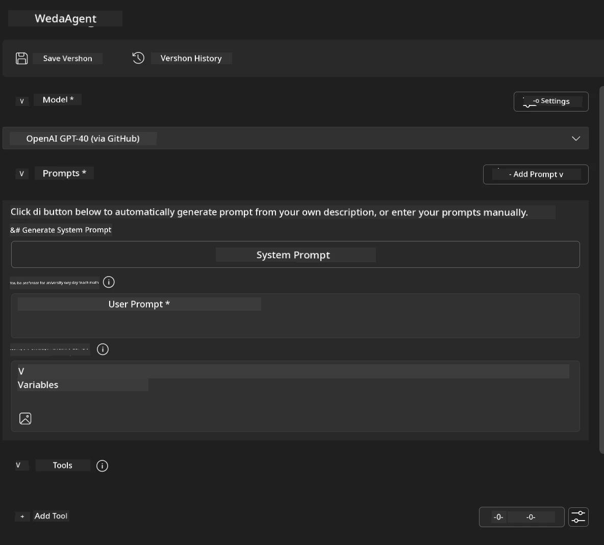
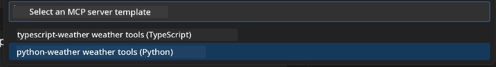
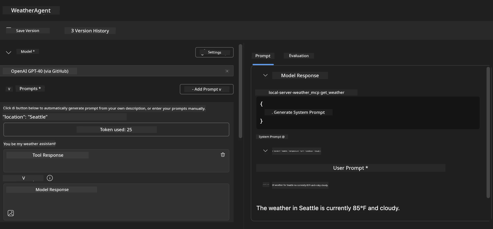
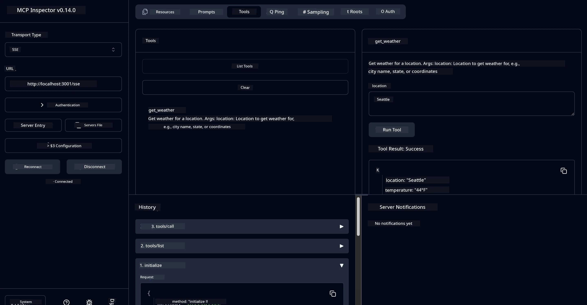

# 🔧 Module 3: Advanced MCP Development wit Microsoft Foundry Toolkit

> [!NOTE]
> Inspector URLs for dis lab dey use di old `/sse` endpoint and dem dey target di pinned MCP SDK `1.9.3` and Inspector `0.14.0` dependencies. Dem no be di current `2026-07-28` Streamable HTTP examples.
> 
> 


## 🎯 Wetin You Go Learn

By di time you complete dis lab, you go fit:

- ✅ Create custom MCP servers wit di Microsoft Foundry Toolkit
- ✅ Configure and use di latest MCP Python SDK (v1.9.3)
- ✅ Set up and use di MCP Inspector for debugging
- ✅ Debug MCP servers for both Agent Builder and Inspector environments
- ✅ Understand advanced MCP server development workflows

## 📋 Wetin You Must Get Beforehand

- Finish Lab 2 (MCP Fundamentals)
- VS Code wit Microsoft Foundry Toolkit extension wey don install
- Python 3.10+ environment
- Node.js and npm to setup Inspector

## 🏗️ Wetin You Go Build

For dis lab, you go create **Weather MCP Server** wey go show:
- Custom MCP server implementation
- Integration wit Microsoft Foundry Toolkit Agent Builder
- Professional debugging workflows
- Modern MCP SDK usage patterns

---

## 🔧 Core Components Overview

### 🐍 MCP Python SDK
Di Model Context Protocol Python SDK na di foundation for building custom MCP servers. You go use version 1.9.3 wit better debugging capabilities.

### 🔍 MCP Inspector
Powerful debugging tool wey dey provide:
- Real-time server monitoring
- Tool execution visualization
- Network request/response inspection
- Interactive testing environment

---

## 📖 Step-by-Step How to Do Am

### Step 1: Create WeatherAgent for Agent Builder

1. **Open Agent Builder** for VS Code through di Microsoft Foundry Toolkit extension
2. **Create new agent** wit dis configuration:
   - Agent Name: `WeatherAgent`



### Step 2: Start MCP Server Project

1. **Go Tools** → **Add Tool** for Agent Builder
2. **Choose "MCP Server"** from di options
3. **Choose "Create A new MCP Server"**
4. **Pick di `python-weather` template**
5. **Name your server:** `weather_mcp`



### Step 3: Open and Check Di Project

1. **Open di project wey dem generate** for VS Code
2. **Look project structure:**
   ```
   weather_mcp/
   ├── src/
   │   ├── __init__.py
   │   └── server.py
   ├── inspector/
   │   ├── package.json
   │   └── package-lock.json
   ├── .vscode/
   │   ├── launch.json
   │   └── tasks.json
   ├── pyproject.toml
   └── README.md
   ```

### Step 4: Upgrade to Latest MCP SDK

> **🔍 Why Upgrade?** We wan use di latest MCP SDK (v1.9.3) and Inspector service (0.14.0) for better features and debugging.

#### 4a. Update Python Dependencies

**Edit `pyproject.toml`:** update [./code/weather_mcp/pyproject.toml](../../../../10-StreamliningAIWorkflowsBuildingAnMCPServerWithAIToolkit/lab3/code/weather_mcp/pyproject.toml)


#### 4b. Update Inspector Configuration

**Edit `inspector/package.json`:** update [./code/weather_mcp/inspector/package.json](../../../../10-StreamliningAIWorkflowsBuildingAnMCPServerWithAIToolkit/lab3/code/weather_mcp/inspector/package.json)

#### 4c. Update Inspector Dependencies

**Edit `inspector/package-lock.json`:** update [./code/weather_mcp/inspector/package-lock.json](../../../../10-StreamliningAIWorkflowsBuildingAnMCPServerWithAIToolkit/lab3/code/weather_mcp/inspector/package-lock.json)

> **📝 Note:** Dis file get plenty dependency definitions. Below na di essential structure - di full content go make sure say dependencies fit resolve well.


> **⚡ Full Package Lock:** Di full package-lock.json get about 3000 lines of dependency definitions. Di one wey show for above na key structure - use di proper file if you want complete dependency resolution.

### Step 5: Configure VS Code Debugging

*Note: Abeg copy di file wey dey di specified path to replace di corresponding local file*

#### 5a. Update Launch Configuration

**Edit `.vscode/launch.json`:**

```json
{
  "version": "0.2.0",
  "configurations": [
    {
      "name": "Attach to Local MCP",
      "type": "debugpy",
      "request": "attach",
      "connect": {
        "host": "localhost",
        "port": 5678
      },
      "presentation": {
        "hidden": true
      },
      "internalConsoleOptions": "neverOpen",
      "postDebugTask": "Terminate All Tasks"
    },
    {
      "name": "Launch Inspector (Edge)",
      "type": "msedge",
      "request": "launch",
      "url": "http://localhost:6274?timeout=60000&serverUrl=http://localhost:3001/sse#tools",
      "cascadeTerminateToConfigurations": [
        "Attach to Local MCP"
      ],
      "presentation": {
        "hidden": true
      },
      "internalConsoleOptions": "neverOpen"
    },
    {
      "name": "Launch Inspector (Chrome)",
      "type": "chrome",
      "request": "launch",
      "url": "http://localhost:6274?timeout=60000&serverUrl=http://localhost:3001/sse#tools",
      "cascadeTerminateToConfigurations": [
        "Attach to Local MCP"
      ],
      "presentation": {
        "hidden": true
      },
      "internalConsoleOptions": "neverOpen"
    }
  ],
  "compounds": [
    {
      "name": "Debug in Agent Builder",
      "configurations": [
        "Attach to Local MCP"
      ],
      "preLaunchTask": "Open Agent Builder",
    },
    {
      "name": "Debug in Inspector (Edge)",
      "configurations": [
        "Launch Inspector (Edge)",
        "Attach to Local MCP"
      ],
      "preLaunchTask": "Start MCP Inspector",
      "stopAll": true
    },
    {
      "name": "Debug in Inspector (Chrome)",
      "configurations": [
        "Launch Inspector (Chrome)",
        "Attach to Local MCP"
      ],
      "preLaunchTask": "Start MCP Inspector",
      "stopAll": true
    }
  ]
}
```

**Edit `.vscode/tasks.json`:**

```
{
  "version": "2.0.0",
  "tasks": [
    {
      "label": "Start MCP Server",
      "type": "shell",
      "command": "python -m debugpy --listen 127.0.0.1:5678 src/__init__.py sse",
      "isBackground": true,
      "options": {
        "cwd": "${workspaceFolder}",
        "env": {
          "PORT": "3001"
        }
      },
      "problemMatcher": {
        "pattern": [
          {
            "regexp": "^.*$",
            "file": 0,
            "location": 1,
            "message": 2
          }
        ],
        "background": {
          "activeOnStart": true,
          "beginsPattern": ".*",
          "endsPattern": "Application startup complete|running"
        }
      }
    },
    {
      "label": "Start MCP Inspector",
      "type": "shell",
      "command": "npm run dev:inspector",
      "isBackground": true,
      "options": {
        "cwd": "${workspaceFolder}/inspector",
        "env": {
          "CLIENT_PORT": "6274",
          "SERVER_PORT": "6277",
        }
      },
      "problemMatcher": {
        "pattern": [
          {
            "regexp": "^.*$",
            "file": 0,
            "location": 1,
            "message": 2
          }
        ],
        "background": {
          "activeOnStart": true,
          "beginsPattern": "Starting MCP inspector",
          "endsPattern": "Proxy server listening on port"
        }
      },
      "dependsOn": [
        "Start MCP Server"
      ]
    },
    {
      "label": "Open Agent Builder",
      "type": "shell",
      "command": "echo ${input:openAgentBuilder}",
      "presentation": {
        "reveal": "never"
      },
      "dependsOn": [
        "Start MCP Server"
      ],
    },
    {
      "label": "Terminate All Tasks",
      "command": "echo ${input:terminate}",
      "type": "shell",
      "problemMatcher": []
    }
  ],
  "inputs": [
    {
      "id": "openAgentBuilder",
      "type": "command",
      "command": "ai-mlstudio.agentBuilder",
      "args": {
        "initialMCPs": [ "local-server-weather_mcp" ],
        "triggeredFrom": "vsc-tasks"
      }
    },
    {
      "id": "terminate",
      "type": "command",
      "command": "workbench.action.tasks.terminate",
      "args": "terminateAll"
    }
  ]
}
```


---

## 🚀 How to Run and Test Your MCP Server

### Step 6: Install Dependencies

After you make di configuration changes, run these commands:

**Install Python dependencies:**
```bash
uv sync
```

**Install Inspector dependencies:**
```bash
cd inspector
npm install
```

### Step 7: Debug wit Agent Builder

1. **Press F5** or use di **"Debug in Agent Builder"** configuration
2. **Choose di compound configuration** from di debug panel
3. **Wait make di server start** and Agent Builder open
4. **Test your weather MCP server** wit natural language queries

Input prompt like dis

SYSTEM_PROMPT

```
You are my weather assistant
```

USER_PROMPT

```
How's the weather like in Seattle
```



### Step 8: Debug wit MCP Inspector

1. **Use di "Debug in Inspector"** configuration (Edge or Chrome)
2. **Open di Inspector interface** for `http://localhost:6274`
3. **Explore di interactive testing environment:**
   - See di tools wey dey available
   - Test tool execution
   - Monitor network requests
   - Debug server responses



---

## 🎯 Key Wetin You Don Learn

After you don finish dis lab, you don:

- [x] **Create custom MCP server** wit Microsoft Foundry Toolkit templates
- [x] **Upgrade to latest MCP SDK** (v1.9.3) for better functionality
- [x] **Setup professional debugging workflows** for both Agent Builder and Inspector
- [x] **Setup MCP Inspector** for interactive server testing
- [x] **Master VS Code debugging configurations** for MCP development

## 🔧 Advanced Features We Explore

| Feature | Description | Use Case |
|---------|-------------|----------|
| **MCP Python SDK v1.9.3** | Latest protocol implementation | Modern server development |
| **MCP Inspector 0.14.0** | Interactive debugging tool | Real-time server testing |
| **VS Code Debugging** | Integrated development environment | Professional debugging workflow |
| **Agent Builder Integration** | Direct Microsoft Foundry Toolkit connection | End-to-end agent testing |

## 📚 More Resources

- [MCP Python SDK Documentation](https://modelcontextprotocol.io/docs/sdk/python)
- [Microsoft Foundry Toolkit Extension Guide](https://code.visualstudio.com/docs/ai/ai-toolkit)
- [VS Code Debugging Documentation](https://code.visualstudio.com/docs/editor/debugging)
- [Model Context Protocol Specification](https://modelcontextprotocol.io/docs/concepts/architecture)

---

**🎉 Congratulations!** You don successfully complete Lab 3 and now fit create, debug, and deploy custom MCP servers wit professional development workflows.

### 🔜 Go Next Module

Ready to use your MCP skills for real-world development workflow? Continue to **[Module 4: Practical MCP Development - Custom GitHub Clone Server](../lab4/README.md)** wey you go:
- Build production-ready MCP server wey go automate GitHub repository operations
- Implement GitHub repository cloning functionality via MCP
- Integrate custom MCP servers wit VS Code and GitHub Copilot Agent Mode
- Test and deploy custom MCP servers for production environments
- Learn practical workflow automation for developers

---

<!-- CO-OP TRANSLATOR DISCLAIMER START -->
**Disclaimer**:
Dis document don translate wit AI translation service [Co-op Translator](https://github.com/Azure/co-op-translator). Even tho we dey try make am correct, abeg make you know say automated translation fit get errors or mistakes. Di original document for dia own language na im be di correct source. For important info, make person wey sabi human translation do am. We no go responsible for any misunderstanding or wrong understanding wey fit happen because of dis translation.
<!-- CO-OP TRANSLATOR DISCLAIMER END -->