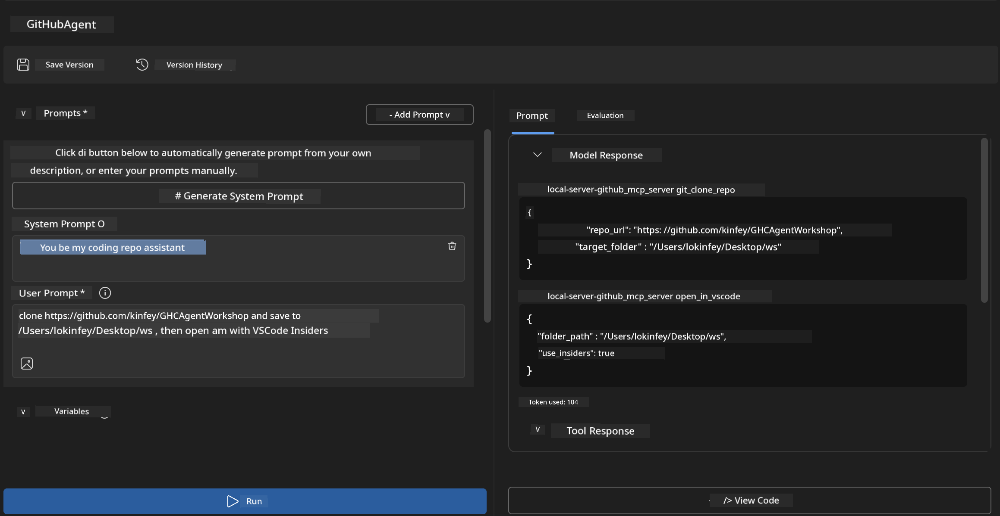

<!--
CO_OP_TRANSLATOR_METADATA:
{
  "original_hash": "f83bc722dc758efffd68667d6a1db470",
  "translation_date": "2025-11-18T18:51:50+00:00",
  "source_file": "10-StreamliningAIWorkflowsBuildingAnMCPServerWithAIToolkit/lab4/README.md",
  "language_code": "pcm"
}
-->
# 🐙 Module 4: Practical MCP Development - Custom GitHub Clone Server


> **⚡ Quick Start:** Build MCP server wey fit automate GitHub repo cloning and VS Code integration for just 30 minutes!

## 🎯 Wetin You Go Learn

By di end of dis lab, you go sabi:

- ✅ Create custom MCP server wey fit work for real-world development workflows
- ✅ Add GitHub repo cloning functionality inside MCP
- ✅ Connect custom MCP servers with VS Code and Agent Builder
- ✅ Use GitHub Copilot Agent Mode with custom MCP tools
- ✅ Test and deploy custom MCP servers for production environments

## 📋 Wetin You Need Before You Start

- Finish Labs 1-3 (MCP basics and advanced development)
- Get GitHub Copilot subscription ([free signup dey here](https://github.com/github-copilot/signup))
- Install VS Code with AI Toolkit and GitHub Copilot extensions
- Make sure say Git CLI dey your system and e don configure

## 🏗️ Project Overview

### **Real-World Development Challenge**
As developers, we dey use GitHub wella to clone repos and open dem for VS Code or VS Code Insiders. Dis manual process dey involve:
1. Open terminal/command prompt
2. Go di directory wey you want
3. Run `git clone` command
4. Open VS Code for di cloned directory

**Our MCP solution go make all dis process easy with just one smart command!**

### **Wetin You Go Build**
You go create **GitHub Clone MCP Server** (`git_mcp_server`) wey go provide:

| Feature | Description | Benefit |
|---------|-------------|---------|
| 🔄 **Smart Repository Cloning** | Clone GitHub repos with validation | Automated error checking |
| 📁 **Intelligent Directory Management** | Check and create directories safely | Prevents overwriting |
| 🚀 **Cross-Platform VS Code Integration** | Open projects in VS Code/Insiders | Seamless workflow transition |
| 🛡️ **Robust Error Handling** | Handle network, permission, and path issues | Production-ready reliability |

---

## 📖 Step-by-Step Implementation

### Step 1: Create GitHub Agent for Agent Builder

1. **Open Agent Builder** through AI Toolkit extension
2. **Create new agent** with dis configuration:
   ```
   Agent Name: GitHubAgent
   ```

3. **Start custom MCP server:**
   - Go **Tools** → **Add Tool** → **MCP Server**
   - Select **"Create A new MCP Server"**
   - Choose **Python template** for better flexibility
   - **Server Name:** `git_mcp_server`

### Step 2: Configure GitHub Copilot Agent Mode

1. **Open GitHub Copilot** for VS Code (Ctrl/Cmd + Shift + P → "GitHub Copilot: Open")
2. **Select Agent Model** for Copilot interface
3. **Pick Claude 3.7 model** for better reasoning capabilities
4. **Enable MCP integration** for tool access

> **💡 Pro Tip:** Claude 3.7 sabi development workflows and e dey handle errors well.

### Step 3: Implement di Main MCP Server Functionality

**Use dis detailed prompt with GitHub Copilot Agent Mode:**

```
Create two MCP tools with the following comprehensive requirements:

🔧 TOOL A: clone_repository
Requirements:
- Clone any GitHub repository to a specified local folder
- Return the absolute path of the successfully cloned project
- Implement comprehensive validation:
  ✓ Check if target directory already exists (return error if exists)
  ✓ Validate GitHub URL format (https://github.com/user/repo)
  ✓ Verify git command availability (prompt installation if missing)
  ✓ Handle network connectivity issues
  ✓ Provide clear error messages for all failure scenarios

🚀 TOOL B: open_in_vscode
Requirements:
- Open specified folder in VS Code or VS Code Insiders
- Cross-platform compatibility (Windows/Linux/macOS)
- Use direct application launch (not terminal commands)
- Auto-detect available VS Code installations
- Handle cases where VS Code is not installed
- Provide user-friendly error messages

Additional Requirements:
- Follow MCP 1.9.3 best practices
- Include proper type hints and documentation
- Implement logging for debugging purposes
- Add input validation for all parameters
- Include comprehensive error handling
```

### Step 4: Test Your MCP Server

#### 4a. Test for Agent Builder

1. **Run di debug configuration** for Agent Builder
2. **Set up your agent with dis system prompt:**

```
SYSTEM_PROMPT:
You are my intelligent coding repository assistant. You help developers efficiently clone GitHub repositories and set up their development environment. Always provide clear feedback about operations and handle errors gracefully.
```

3. **Test am with real user scenarios:**

```
USER_PROMPT EXAMPLES:

Scenario : Basic Clone and Open
"Clone {Your GitHub Repo link such as https://github.com/kinfey/GHCAgentWorkshop
 } and save to {The global path you specify}, then open it with VS Code Insiders"
```



**Expected Results:**
- ✅ Repo go clone successfully with path confirmation
- ✅ VS Code go open automatically
- ✅ Clear error messages for invalid scenarios
- ✅ E go handle edge cases well

#### 4b. Test for MCP Inspector


---


**🎉 Congrats!** You don successfully create MCP server wey fit work for production and e dey solve real development workflow problems. Your custom GitHub clone server don show di power of MCP for automating and improving developer productivity.

### 🏆 Achievement Unlocked:
- ✅ **MCP Developer** - Create custom MCP server
- ✅ **Workflow Automator** - Make development process easy  
- ✅ **Integration Expert** - Connect different development tools
- ✅ **Production Ready** - Build solution wey fit deploy

---

## 🎓 Workshop Completion: Your Journey with Model Context Protocol

**Dear Workshop Participant,**

Congrats say you don finish all di four modules for di Model Context Protocol workshop! You don move from di basics of AI Toolkit to building MCP servers wey dey solve real-world development problems.

### 🚀 Wetin You Don Learn:

**[Module 1](../lab1/README.md)**: You start by learning AI Toolkit basics, model testing, and creating your first AI agent.

**[Module 2](../lab2/README.md)**: You learn MCP architecture, integrate Playwright MCP, and build browser automation agent.

**[Module 3](../lab3/README.md)**: You move to custom MCP server development with di Weather MCP server and master debugging tools.

**[Module 4](../lab4/README.md)**: You don use everything to create GitHub repo workflow automation tool.

### 🌟 Wetin You Don Master:

- ✅ **AI Toolkit Ecosystem**: Models, agents, and integration patterns
- ✅ **MCP Architecture**: Client-server design, transport protocols, and security
- ✅ **Developer Tools**: From Playground to Inspector to production deployment
- ✅ **Custom Development**: Build, test, and deploy your own MCP servers
- ✅ **Practical Applications**: Solve real-world workflow problems with AI

### 🔮 Wetin You Fit Do Next:

1. **Build Your Own MCP Server**: Use di skills wey you don learn to automate your own workflows
2. **Join di MCP Community**: Share your work and learn from others
3. **Explore Advanced Integration**: Connect MCP servers to enterprise systems
4. **Contribute to Open Source**: Help improve MCP tools and documentation

Remember say dis workshop na just di beginning. Di Model Context Protocol ecosystem dey grow fast, and you don get di skills to dey lead for AI-powered development tools.

**Thank you for joining and for your dedication to learning!**

We hope say dis workshop don give you ideas wey go change how you dey build and use AI tools for your development journey.

**Happy coding!**

---

---

<!-- CO-OP TRANSLATOR DISCLAIMER START -->
**Disclaimer**:  
Dis docu wey you dey see na AI translation service [Co-op Translator](https://github.com/Azure/co-op-translator) translate am. Even though we dey try make sure say e correct, make you sabi say machine translation fit get mistake or no dey accurate well. Di original docu for di language wey dem write am first na di one wey you go take as di correct source. For important mata, e good make you use professional human translation. We no go fit take blame for any misunderstanding or wrong interpretation wey fit happen because you use dis translation.
<!-- CO-OP TRANSLATOR DISCLAIMER END -->