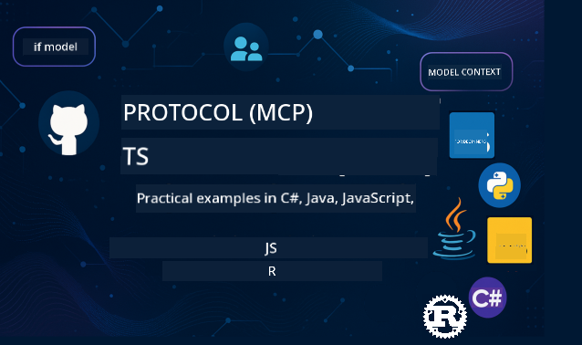

<!--
CO_OP_TRANSLATOR_METADATA:
{
  "original_hash": "c936339e9d03418ff40a547313355d6a",
  "translation_date": "2025-11-18T18:43:11+00:00",
  "source_file": "README.md",
  "language_code": "pcm"
}
-->
 

Follow dis steps to start dey use dis resources:
1. **Fork di Repository**: Click 
2. **Clone di Repository**:   `git clone https://github.com/microsoft/mcp-for-beginners.git`
3. **Join di** 

### 🌐 Multi-Language Support

#### Supported via GitHub Action (Automated & Always Up-to-Date)

[Arabic](../ar/README.md) | [Bengali](../bn/README.md) | [Bulgarian](../bg/README.md) | [Burmese (Myanmar)](../my/README.md) | [Chinese (Simplified)](../zh/README.md) | [Chinese (Traditional, Hong Kong)](../hk/README.md) | [Chinese (Traditional, Macau)](../mo/README.md) | [Chinese (Traditional, Taiwan)](../tw/README.md) | [Croatian](../hr/README.md) | [Czech](../cs/README.md) | [Danish](../da/README.md) | [Dutch](../nl/README.md) | [Estonian](../et/README.md) | [Finnish](../fi/README.md) | [French](../fr/README.md) | [German](../de/README.md) | [Greek](../el/README.md) | [Hebrew](../he/README.md) | [Hindi](../hi/README.md) | [Hungarian](../hu/README.md) | [Indonesian](../id/README.md) | [Italian](../it/README.md) | [Japanese](../ja/README.md) | [Korean](../ko/README.md) | [Lithuanian](../lt/README.md) | [Malay](../ms/README.md) | [Marathi](../mr/README.md) | [Nepali](../ne/README.md) | [Nigerian Pidgin](./README.md) | [Norwegian](../no/README.md) | [Persian (Farsi)](../fa/README.md) | [Polish](../pl/README.md) | [Portuguese (Brazil)](../br/README.md) | [Portuguese (Portugal)](../pt/README.md) | [Punjabi (Gurmukhi)](../pa/README.md) | [Romanian](../ro/README.md) | [Russian](../ru/README.md) | [Serbian (Cyrillic)](../sr/README.md) | [Slovak](../sk/README.md) | [Slovenian](../sl/README.md) | [Spanish](../es/README.md) | [Swahili](../sw/README.md) | [Swedish](../sv/README.md) | [Tagalog (Filipino)](../tl/README.md) | [Tamil](../ta/README.md) | [Thai](../th/README.md) | [Turkish](../tr/README.md) | [Ukrainian](../uk/README.md) | [Urdu](../ur/README.md) | [Vietnamese](../vi/README.md)

# 🚀 Model Context Protocol (MCP) Curriculum for Beginners

## **Learn MCP wit Code Examples wey dey use C#, Java, JavaScript, Rust, Python, and TypeScript**

## 🧠 Overview of di Model Context Protocol Curriculum
Welcome to di journey wey go teach you about Model Context Protocol! If you don dey wonder how AI apps dey talk to different tools and services, you go soon sabi di fine solution wey dey change how developers dey build smart systems.

MCP na like universal translator for AI apps - e dey work like USB port wey fit connect any device to your computer. MCP dey allow AI models connect to any tool or service in one standard way. Whether you dey build your first chatbot or dey work on complex AI workflows, MCP go give you di power to create apps wey dey more flexible and capable.

Dis curriculum dey designed to make sure you learn well. We go start with simple ideas wey you fit understand and slowly build your skills with hands-on practice for di programming language wey you like. Every step go get clear explanation, practical examples, and encouragement.

By di time you finish dis journey, you go get confidence to build your own MCP servers, connect dem to popular AI platforms, and understand how dis technology dey change di future of AI development. Make we start dis adventure together!

### Official Documentation and Specifications

Dis resources go dey more useful as you dey learn, but no rush to read everything at once. Start with di parts wey interest you pass!
- 📘 [MCP Documentation](https://modelcontextprotocol.io/) – Dis na your main resource for tutorials and user guides. Di documentation dey written for beginners, e get clear examples wey you fit follow at your own pace.
- 📜 [MCP Specification](https://modelcontextprotocol.io/docs/) – Dis na like your reference manual. As you dey go through di curriculum, you go dey come back here to check details and explore advanced features.
- 📜 [Original MCP Specification](https://spec.modelcontextprotocol.io/) – E get extra technical details wey fit help for advanced implementations. E dey there when you need am, but no worry about am when you dey start.
- 🧑‍💻 [MCP GitHub Repository](https://github.com/modelcontextprotocol) – Here you go find SDKs, tools, and code samples for different programming languages. E be like treasure chest of practical examples and ready-to-use components.
- 🌐 [MCP Community](https://github.com/orgs/modelcontextprotocol/discussions) – Join other learners and experienced developers to talk about MCP. E be supportive community wey dey welcome questions and dey share knowledge freely.

## Learning Objectives

By di end of dis curriculum, you go dey confident and happy about wetin you don learn. Dis na wetin you go achieve:

• **Understand MCP basics**: You go sabi wetin Model Context Protocol be and why e dey change how AI apps dey work together, using examples wey make sense.

• **Build your first MCP server**: You go create MCP server wey dey work for di programming language wey you like, starting with simple examples and growing your skills step by step.

• **Connect AI models to tools**: You go learn how to make AI models dey work with real services, giving your apps new powers.

• **Implement security best practices**: You go sabi how to make sure your MCP dey safe and secure, protecting your apps and users.

• **Deploy with confidence**: You go sabi how to move your MCP projects from development to production, with strategies wey dey work for real-world use.

• **Join di MCP community**: You go become part of di growing community of developers wey dey shape di future of AI app development.

## Essential Background

Before we start MCP proper, make we make sure you dey comfortable with some basic ideas. No worry if you no be expert for dis areas - we go explain everything you need as we dey go!

### Understanding Protocols (Di Basics)

Think of protocol like rules for conversation. When you call person, una go say "hello", take turns to talk, and say "goodbye" when una finish. Computer programs need similar rules to talk well.

MCP na protocol - e be set of agreed rules wey help AI models and apps dey talk well with tools and services. Just like how conversation rules dey make human communication smooth, MCP dey make AI app communication more reliable and powerful.

### Client-Server Relationships (How Programs Work Together)

You dey use client-server relationships everyday! When you use web browser (di client) to visit website, you dey connect to web server wey dey send you di page content. Di browser sabi how to ask for info, and di server sabi how to respond.

For MCP, we get similar relationship: AI models dey act like clients wey dey request info or actions, while MCP servers dey provide di capabilities. E be like helpful assistant (di server) wey AI fit ask to do tasks.

### Why Standardization Matter (Making Things Work Together)

Imagine say every car manufacturer dey use different shaped gas pumps - you go need different adapter for each car! Standardization mean say we go agree on common ways so things go work well together.

MCP dey provide dis standardization for AI apps. Instead of every AI model needing custom code to work with every tool, MCP dey create one universal way for dem to talk. Dis mean developers fit build tools once and dem go work with many AI systems.

## 🧭 Your Learning Path Overview

Your MCP journey dey structured to help you build confidence and skills step by step. Each phase go introduce new ideas while e dey reinforce wetin you don learn.

### 🌱 Foundation Phase: Understanding di Basics (Modules 0-2)

Dis na where your adventure go start! We go introduce MCP ideas using examples wey you fit relate to. You go understand wetin MCP be, why e dey exist, and how e dey fit into di world of AI development.

• **Module 0 - Introduction to MCP**: We go start by explaining wetin MCP be and why e dey important for modern AI apps. You go see real-world examples of MCP in action and understand how e dey solve common problems wey developers dey face.

• **Module 1 - Core Concepts Explained**: Here you go learn di main building blocks of MCP. We go use plenty examples and visuals to make sure di ideas dey easy to understand.

• **Module 2 - Security in MCP**: Security fit sound hard, but we go show you how MCP get built-in safety features and teach you best practices wey go protect your apps from di start.

### 🔨 Building Phase: Creating Your First Implementations (Module 3)

Now di real fun go start! You go get hands-on experience to build MCP servers and clients. No worry - we go start simple and guide you step by step.

Dis module go get guides wey go allow you practice for di programming language wey you like. You go create your first server, build client to connect am, and even integrate with tools like VS Code.

Each guide go get complete code examples, troubleshooting tips, and explanation of why we dey make certain design choices. By di end of dis phase, you go get MCP implementations wey dey work and wey you go proud of!

### 🚀 Growing Phase: Advanced Concepts and Real-World Application (Modules 4-5)

After you don master di basics, you go ready to explore more advanced MCP features. We go cover practical implementation strategies, debugging techniques, and advanced topics like multi-modal AI integration.

You go also learn how to scale your MCP implementations for production use and integrate with cloud platforms like Azure. Dis modules go prepare you to build MCP solutions wey fit handle real-world demands.

### 🌟 Mastery Phase: Community and Specialization (Modules 6-11)
Di final stage na to join di MCP community and focus for di areas wey you like pass. You go sabi how to contribute to open-source MCP projects, use advanced authentication patterns, and build complete database-integrated solutions.

Module 11 na di one wey need special attention - e get 13-lab hands-on learning path wey go teach you how to build MCP servers wey fit work for production with PostgreSQL integration. E be like capstone project wey go join everything wey you don learn together!

### 📚 Complete Curriculum Structure

| Module | Topic | Description | Link |
|--------|-------|-------------|------|
| **Module 1-3: Fundamentals** | | | |
| 00 | Introduction to MCP | Overview of di Model Context Protocol and why e dey important for AI pipelines | [Read more](./00-Introduction/README.md) |
| 01 | Core Concepts Explained | Deep explanation of di main MCP concepts | [Read more](./01-CoreConcepts/README.md) |
| 02 | Security in MCP | Security wahala and di best way to handle am | [Read more](./02-Security/README.md) |
| 03 | Getting Started with MCP | How to set up environment, basic servers/clients, and integration | [Read more](./03-GettingStarted/README.md) |
| **Module 3: Building Your First Server & Client** | | | |
| 3.1 | First Server | Build your first MCP server | [Guide](./03-GettingStarted/01-first-server/README.md) |
| 3.2 | First Client | Create basic MCP client | [Guide](./03-GettingStarted/02-client/README.md) |
| 3.3 | Client with LLM | Add large language models | [Guide](./03-GettingStarted/03-llm-client/README.md) |
| 3.4 | VS Code Integration | Use MCP servers inside VS Code | [Guide](./03-GettingStarted/04-vscode/README.md) |
| 3.5 | stdio Server | Build servers wey dey use stdio transport | [Guide](./03-GettingStarted/05-stdio-server/README.md) |
| 3.6 | HTTP Streaming | Add HTTP streaming for MCP | [Guide](./03-GettingStarted/06-http-streaming/README.md) |
| 3.7 | AI Toolkit | Use AI Toolkit with MCP | [Guide](./03-GettingStarted/07-aitk/README.md) |
| 3.8 | Testing | Test di MCP server wey you don build | [Guide](./03-GettingStarted/08-testing/README.md) |
| 3.9 | Deployment | Put MCP servers for production | [Guide](./03-GettingStarted/09-deployment/README.md) |
| 3.10 | Advanced server usage | Use advanced servers for better features and architecture | [Guide](./03-GettingStarted/10-advanced/README.md) |
| 3.11 | Simple auth | Learn authentication from di start and RBAC | [Guide](./03-GettingStarted/11-simple-auth/README.md) |
| **Module 4-5: Practical & Advanced** | | | |
| 04 | Practical Implementation | SDKs, debugging, testing, reusable prompt templates | [Read more](./04-PracticalImplementation/README.md) |
| 05 | Advanced Topics in MCP | Multi-modal AI, scaling, enterprise use | [Read more](./05-AdvancedTopics/README.md) |
| 5.1 | Azure Integration | MCP Integration with Azure | [Guide](./05-AdvancedTopics/mcp-integration/README.md) |
| 5.2 | Multi-modality | How to work with different modalities | [Guide](./05-AdvancedTopics/mcp-multi-modality/README.md) |
| 5.3 | OAuth2 Demo | Add OAuth2 authentication | [Guide](./05-AdvancedTopics/mcp-oauth2-demo/README.md) |
| 5.4 | Root Contexts | Learn and use root contexts | [Guide](./05-AdvancedTopics/mcp-root-contexts/README.md) |
| 5.5 | Routing | MCP routing strategies | [Guide](./05-AdvancedTopics/mcp-routing/README.md) |
| 5.6 | Sampling | Sampling techniques for MCP | [Guide](./05-AdvancedTopics/mcp-sampling/README.md) |
| 5.7 | Scaling | How to scale MCP implementations | [Guide](./05-AdvancedTopics/mcp-scaling/README.md) |
| 5.8 | Security | Advanced security tips | [Guide](./05-AdvancedTopics/mcp-security/README.md) |
| 5.9 | Web Search | Add web search features | [Guide](./05-AdvancedTopics/web-search-mcp/README.md) |
| 5.10 | Realtime Streaming | Build realtime streaming features | [Guide](./05-AdvancedTopics/mcp-realtimestreaming/README.md) |
| 5.11 | Realtime Search | Add realtime search | [Guide](./05-AdvancedTopics/mcp-realtimesearch/README.md) |
| 5.12 | Entra ID Auth | Use Microsoft Entra ID for authentication | [Guide](./05-AdvancedTopics/mcp-security-entra/README.md) |
| 5.13 | Foundry Integration | Connect with Azure AI Foundry | [Guide](./05-AdvancedTopics/mcp-foundry-agent-integration/README.md) |
| 5.14 | Context Engineering | Learn techniques for good context engineering | [Guide](./05-AdvancedTopics/mcp-contextengineering/README.md) |
| 5.15 | MCP Custom Transport | Build custom transport implementations | [Guide](./05-AdvancedTopics/mcp-transport/README.md) |
| **Module 6-10: Community & Best Practices** | | | |
| 06 | Community Contributions | How to contribute to MCP ecosystem | [Guide](./06-CommunityContributions/README.md) |
| 07 | Insights from Early Adoption | Real-world implementation stories | [Guide](./07-LessonsFromEarlyAdoption/README.md) |
| 08 | Best Practices for MCP | Performance, fault-tolerance, resilience | [Guide](./08-BestPractices/README.md) |
| 09 | MCP Case Studies | Examples of practical implementation | [Guide](./09-CaseStudy/README.md) |
| 10 | Hands-on Workshop | Build MCP Server with AI Toolkit | [Lab](./10-StreamliningAIWorkflowsBuildingAnMCPServerWithAIToolkit/README.md) |
| **Module 11: MCP Server Hands On Lab** | | | |
| 11 | MCP Server Database Integration | 13-lab hands-on learning path for PostgreSQL integration | [Labs](./11-MCPServerHandsOnLabs/README.md) |
| 11.1 | Introduction | Overview of MCP with database integration and retail analytics use case | [Lab 00](./11-MCPServerHandsOnLabs/00-Introduction/README.md) |
| 11.2 | Core Architecture | Learn MCP server architecture, database layers, and security patterns | [Lab 01](./11-MCPServerHandsOnLabs/01-Architecture/README.md) |
| 11.3 | Security & Multi-Tenancy | Row Level Security, authentication, and multi-tenant data access | [Lab 02](./11-MCPServerHandsOnLabs/02-Security/README.md) |
| 11.4 | Environment Setup | Set up development environment, Docker, Azure resources | [Lab 03](./11-MCPServerHandsOnLabs/03-Setup/README.md) |
| 11.5 | Database Design | PostgreSQL setup, retail schema design, and sample data | [Lab 04](./11-MCPServerHandsOnLabs/04-Database/README.md) |
| 11.6 | MCP Server Implementation | Build di FastMCP server with database integration | [Lab 05](./11-MCPServerHandsOnLabs/05-MCP-Server/README.md) |
| 11.7 | Tool Development | Create database query tools and schema introspection | [Lab 06](./11-MCPServerHandsOnLabs/06-Tools/README.md) |
| 11.8 | Semantic Search | Add vector embeddings with Azure OpenAI and pgvector | [Lab 07](./11-MCPServerHandsOnLabs/07-Semantic-Search/README.md) |
| 11.9 | Testing & Debugging | Testing strategies, debugging tools, and validation methods | [Lab 08](./11-MCPServerHandsOnLabs/08-Testing/README.md) |
| 11.10 | VS Code Integration | Set up VS Code MCP integration and AI Chat usage | [Lab 09](./11-MCPServerHandsOnLabs/09-VS-Code/README.md) |
| 11.11 | Deployment Strategies | Docker deployment, Azure Container Apps, and scaling tips | [Lab 10](./11-MCPServerHandsOnLabs/10-Deployment/README.md) |
| 11.12 | Monitoring | Application Insights, logging, performance monitoring | [Lab 11](./11-MCPServerHandsOnLabs/11-Monitoring/README.md) |
| 11.13 | Best Practices | Performance optimization, security hardening, and production tips | [Lab 12](./11-MCPServerHandsOnLabs/12-Best-Practices/README.md) |

### 💻 Sample Code Projects

One of di sweet part of learning MCP na how your coding skills go dey improve step by step. Di code examples wey we design dey start simple and go dey more complex as you dey understand MCP better. Di way we dey show di concepts with code wey easy to understand go help you know wetin di code dey do, why e dey structured like dat, and how e fit into bigger MCP applications.

#### Basic MCP Calculator Samples

| Language | Description | Link |
|----------|-------------|------|
| C# | MCP Server Example | [View Code](./03-GettingStarted/samples/csharp/README.md) |
| Java | MCP Calculator | [View Code](./03-GettingStarted/samples/java/calculator/README.md) |
| JavaScript | MCP Demo | [View Code](./03-GettingStarted/samples/javascript/README.md) |
| Python | MCP Server | [View Code](../../03-GettingStarted/samples/python/mcp_calculator_server.py) |
| TypeScript | MCP Example | [View Code](./03-GettingStarted/samples/typescript/README.md) |
| Rust | MCP Example | [View Code](./03-GettingStarted/samples/rust/README.md) |

#### Advanced MCP Implementations

| Language | Description | Link |
|----------|-------------|------|
| C# | Advanced Sample | [View Code](./04-PracticalImplementation/samples/csharp/README.md) |
| Java with Spring | Container App Example | [View Code](./04-PracticalImplementation/samples/java/containerapp/README.md) |
| JavaScript | Advanced Sample | [View Code](./04-PracticalImplementation/samples/javascript/README.md) |
| Python | Complex Implementation | [View Code](../../04-PracticalImplementation/samples/python/READMEmd) |
| TypeScript | Container Sample | [View Code](./04-PracticalImplementation/samples/typescript/README.md) |

## 🎯 Prerequisites for Learning MCP

To enjoy di curriculum well, you need:

- Basic knowledge of programming for at least one language like C#, Java, JavaScript, Python, or TypeScript
- Know how client-server model and APIs work
- Understand REST and HTTP concepts
- (Optional) Background for AI/ML concepts

- Join di community discussions for help

## 📚 Study Guide & Resources

Dis repository get plenty resources wey go help you learn MCP well:

### Study Guide

We get one full [Study Guide](./study_guide.md) wey go help you understand di repository well. Di visual curriculum map go show how di topics connect and give you tips on how to use di sample projects well. E go help visual learners wey like to see di big picture.

Di guide get:
- Visual curriculum map wey show all di topics
- Detailed explanation of each repository section
- Tips on how to use di sample projects
- Recommended learning paths for different skill levels
- Extra resources to help your learning journey

### Changelog

We dey keep one [Changelog](./changelog.md) wey dey show all di updates wey we don make for di curriculum materials, so you go dey up-to-date with di latest changes.
- New content wey we add
- Changes for di structure
- Feature improvements
- Documentation updates

## 🛠️ How to Use This Curriculum Effectively

Each lesson for dis guide get:

1. Clear explanation of MCP concepts  
2. Live code examples for different languages  
3. Exercises to build real MCP applications  
4. Extra resources for advanced learners

## On Demand Content 

### [MCP Dev Days July 2025](https://developer.microsoft.com/en-us/reactor/series/S-1563/)
#### [➡️Watch on Demand - MCP Dev Days](https://developer.microsoft.com/en-us/reactor/series/S-1563/)
Prepare yourself for two days of deep technical learning, community connection, and hands-on experience for MCP Dev Days, one virtual event wey focus on di Model Context Protocol (MCP) — di new standard wey dey connect AI models and di tools wey dem dey use.
You fit watch MCP Dev Days if you register for our event page: https://aka.ms/mcpdevdays. 

#### [Day 1: MCP Productivity, DevTools, & Community:](https://developer.microsoft.com/en-us/reactor/series/S-1563/)

Dis day na to empower developers make dem sabi how to use MCP for dia developer workflow and to celebrate di amazing MCP community. We go dey join by community members and partners like Arcade, Block, Okta, and Neon to show how dem dey work with Microsoft to build open, extensible MCP ecosystem. 

- Real-world demos wey go show for VS Code, Visual Studio, GitHub Copilot, and popular community tools
- Practical, context-driven dev workflows
- Community-led sessions and insights

Whether you just dey start with MCP or you don dey build with am, Day 1 go give you inspiration and actionable takeaways.

#### [Day 2: Build MCP Servers with Confidence](https://developer.microsoft.com/en-us/reactor/series/S-1563/)

Dis one na for MCP builders. We go deep well into implementation strategies and best practices to create MCP servers and how to fit MCP into your AI workflows.

#### Topics wey we go cover:

- How to build MCP Servers and fit dem into agent experiences
- Prompt-driven development
- Security best practices
- How to use building blocks like Functions, ACA, and API Management
- Registry alignment and tooling (1P + 3P)

If you be developer, tool builder, or AI product strategist, dis day go full with insights wey you need to build scalable, secure, and future-ready MCP solutions.

### MCP Boot Camp August 2025
Learn for intensive video sessions how to create MCP servers, fit am with VS Code, and deploy am professionally for Azure based on content from di MCP for Beginners curriculum. You go waka commot with practical skills for technology wey big companies don dey use already.

#### [➡️Watch on Demand MCP Bootcamp | English](https://developer.microsoft.com/en-us/reactor/series/s-1568/)
#### [➡️Watch on Demand MCP Bootcamp | Brasil](https://developer.microsoft.com/en-us/reactor/series/S-1566/)
#### [➡️Watch on Demand MCP Bootcamp | Spanish](https://developer.microsoft.com/en-us/reactor/series/S-1567/)

### Let's Learn MCP with C# - Tutorial Series
Make we learn about di Model Context Protocol (MCP), one cutting-edge framework wey dem design to standardize how AI models and client applications go dey interact. For dis beginner-friendly session, we go introduce you to MCP and guide you on how to create your first MCP server.
#### C#: [https://aka.ms/letslearnmcp-csharp](https://aka.ms/letslearnmcp-csharp)
#### Java: [https://aka.ms/letslearnmcp-java](https://aka.ms/letslearnmcp-java)
#### JavaScript: [https://aka.ms/letslearnmcp-javascript](https://aka.ms/letslearnmcp-javascript)
#### Python: [https://aka.ms/letslearnmcp-python](https://aka.ms/letslearnmcp-python)

## 🎓 Your MCP Journey Don Start

Congrats! You don take di first step for one exciting journey wey go expand your programming skills and connect you to di latest AI development.

### Wetin You Don Achieve Already

As you don read dis introduction, you don already start to build your MCP knowledge foundation. You don sabi wetin MCP be, why e matter, and how dis curriculum go support your learning journey. Dis na big achievement and di beginning of your expertise for dis important technology.

### Di Adventure Wey Dey Front

As you dey go through di modules, remember say every expert na beginner before. Di concepts wey fit look hard now go later become normal as you dey practice and apply dem. Every small step dey build towards powerful skills wey go help you for your development career.

### Your Support Network

You dey join one community of learners and experts wey dey passionate about MCP and dem wan help others succeed. Whether you dey stuck for coding challenge or you wan share breakthrough, di community dey here to support your journey.

If you dey stuck or you get any question about how to build AI apps, join other learners and experienced developers to discuss MCP. Na supportive community wey welcome questions and dey share knowledge freely.

If you get product feedback or errors while you dey build, visit:

### Ready to Begin?

Your MCP adventure don start now! Begin with Module 0 to dive into your first hands-on MCP experiences, or explore di sample projects to see wetin you go dey build. Remember - every expert start from where you dey now, and with patience and practice, you go surprise yourself with wetin you fit achieve.

Welcome to di world of Model Context Protocol development. Make we build something amazing together!

## 🤝 Contributing to di Learning Community

Dis curriculum dey grow stronger with contributions from learners like you! Whether you dey fix typo, suggest clearer explanation, or add new example, your contributions dey help other beginners succeed.

Thanks to Microsoft Valued Professional [Shivam Goyal](https://www.linkedin.com/in/shivam2003/) for contributing code samples.

Di contribution process dey designed to welcome and support you. Most contributions need Contributor License Agreement (CLA), but di automated tools go guide you through di process smoothly.

## 📜 Open Source Learning

Dis curriculum dey available under di MIT [LICENSE](../../LICENSE), meaning you fit use, modify, and share am freely. Dis dey support our mission to make MCP knowledge accessible to developers everywhere.

## 🤝 Contribution Guidelines

Dis project dey welcome contributions and suggestions. Most contributions need make you agree to Contributor License Agreement (CLA) wey go declare say you get di right to, and you dey actually grant us di rights to use your contribution. For details, visit <https://cla.opensource.microsoft.com>.

When you submit pull request, CLA bot go automatically check whether you need to provide CLA and decorate di PR appropriately (e.g., status check, comment). Just follow di instructions wey di bot go give you. You go only need to do dis once across all repos wey dey use our CLA.

Dis project don adopt di [Microsoft Open Source Code of Conduct](https://opensource.microsoft.com/codeofconduct/). For more info, see di [Code of Conduct FAQ](https://opensource.microsoft.com/codeofconduct/faq/) or contact [opencode@microsoft.com](mailto:opencode@microsoft.com) if you get any extra questions or comments.

---

*Ready to start your MCP journey? Begin with [Module 00 - Introduction to MCP](./00-Introduction/README.md) and take your first steps into di world of Model Context Protocol development!*

## 🎒 Other Courses
Our team dey produce other courses! Check dem out:

### Azure / Edge / MCP / Agents

---
 
### Generative AI Series

[-9333EA?style=for-the-badge&labelColor=E5E7EB&color=9333EA)](https://github.com/microsoft/Generative-AI-for-beginners-dotnet?WT.mc_id=academic-105485-koreyst)
[-C084FC?style=for-the-badge&labelColor=E5E7EB&color=C084FC)](https://github.com/microsoft/generative-ai-for-beginners-java?WT.mc_id=academic-105485-koreyst)
[-E879F9?style=for-the-badge&labelColor=E5E7EB&color=E879F9)](https://github.com/microsoft/generative-ai-with-javascript?WT.mc_id=academic-105485-koreyst)

---
 
### Core Learning

---
 
### Copilot Series

  
  
<!-- CO-OP TRANSLATOR OTHER COURSES END -->

---

<!-- CO-OP TRANSLATOR DISCLAIMER START -->
**Disclaimer**:  
Dis docu don dey translate wit AI translation service [Co-op Translator](https://github.com/Azure/co-op-translator). Even though we dey try make am accurate, abeg sabi say automated translations fit get mistake or no dey 100% correct. Di original docu for di native language na di main correct source. For important information, e better make una use professional human translation. We no go fit take blame for any misunderstanding or wrong interpretation wey fit happen because of dis translation.
<!-- CO-OP TRANSLATOR DISCLAIMER END -->