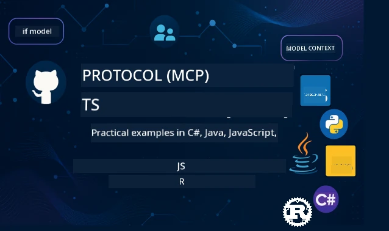

 

[](https://GitHub.com/microsoft/mcp-for-beginners/graphs/contributors)
[](https://GitHub.com/microsoft/mcp-for-beginners/issues)
[](https://GitHub.com/microsoft/mcp-for-beginners/pulls)
[](http://makeapullrequest.com)

[](https://GitHub.com/microsoft/mcp-for-beginners/watchers)
[](https://GitHub.com/microsoft/mcp-for-beginners/fork)
[](https://GitHub.com/microsoft/mcp-for-beginners/stargazers)


[](https://discord.gg/nTYy5BXMWG)

Follow dis steps to start to dey use dis resources:
1. **Fork di Repository**: Click [](https://GitHub.com/microsoft/mcp-for-beginners/fork)
2. **Clone di Repository**:   `git clone https://github.com/microsoft/mcp-for-beginners.git`
3. **Join di** [](https://discord.gg/nTYy5BXMWG)


### 🌐 Multi-Language Support

#### Supported via GitHub Action (Automated & Always Up-to-Date)

<!-- CO-OP TRANSLATOR LANGUAGES TABLE START -->
[Arabic](../ar/README.md) | [Bengali](../bn/README.md) | [Bulgarian](../bg/README.md) | [Burmese (Myanmar)](../my/README.md) | [Chinese (Simplified)](../zh-CN/README.md) | [Chinese (Traditional, Hong Kong)](../zh-HK/README.md) | [Chinese (Traditional, Macau)](../zh-MO/README.md) | [Chinese (Traditional, Taiwan)](../zh-TW/README.md) | [Croatian](../hr/README.md) | [Czech](../cs/README.md) | [Danish](../da/README.md) | [Dutch](../nl/README.md) | [Estonian](../et/README.md) | [Finnish](../fi/README.md) | [French](../fr/README.md) | [German](../de/README.md) | [Greek](../el/README.md) | [Hebrew](../he/README.md) | [Hindi](../hi/README.md) | [Hungarian](../hu/README.md) | [Indonesian](../id/README.md) | [Italian](../it/README.md) | [Japanese](../ja/README.md) | [Kannada](../kn/README.md) | [Korean](../ko/README.md) | [Lithuanian](../lt/README.md) | [Malay](../ms/README.md) | [Malayalam](../ml/README.md) | [Marathi](../mr/README.md) | [Nepali](../ne/README.md) | [Nigerian Pidgin](./README.md) | [Norwegian](../no/README.md) | [Persian (Farsi)](../fa/README.md) | [Polish](../pl/README.md) | [Portuguese (Brazil)](../pt-BR/README.md) | [Portuguese (Portugal)](../pt-PT/README.md) | [Punjabi (Gurmukhi)](../pa/README.md) | [Romanian](../ro/README.md) | [Russian](../ru/README.md) | [Serbian (Cyrillic)](../sr/README.md) | [Slovak](../sk/README.md) | [Slovenian](../sl/README.md) | [Spanish](../es/README.md) | [Swahili](../sw/README.md) | [Swedish](../sv/README.md) | [Tagalog (Filipino)](../tl/README.md) | [Tamil](../ta/README.md) | [Telugu](../te/README.md) | [Thai](../th/README.md) | [Turkish](../tr/README.md) | [Ukrainian](../uk/README.md) | [Urdu](../ur/README.md) | [Vietnamese](../vi/README.md)

> **You prefer to Clone for your computer?**

> Dis repository carry over 50+ language translation wey fit make download full wella. To clone without translations, use sparse checkout:
> ```bash
> git clone --filter=blob:none --sparse https://github.com/microsoft/mcp-for-beginners.git
> cd mcp-for-beginners
> git sparse-checkout set --no-cone '/*' '!translations' '!translated_images'
> ```
> Dis one go give you everything wey you need to finish di course plus e go fast wella to download.
<!-- CO-OP TRANSLATOR LANGUAGES TABLE END -->

# 🚀 Model Context Protocol (MCP) Curriculum for Beginners

## **Learn MCP with Hands-on Code Examples for C#, Java, JavaScript, Rust, Python, and TypeScript**

## 🧠 Overview of di Model Context Protocol Curriculum
Welcome to your journey into Model Context Protocol! If you don ever reason how AI apps dey yan with different tools and services, you go soon sabi di correct solution wey dey change how developers dey build smart systems.

Think say MCP be like universal translator for AI apps - like how USB port dey allow you connect any device for your computer, MCP dey allow AI models connect to any tool or service for standard way. Whether you dey build your first chatbot or you dey work on gbege AI workflows, to sabi MCP go give you power to create better and flexible apps.

Dis curriculum na to teach you slow-slow with care for your learning journey. We go start with simple things wey you sabi, then gradually make your skills better through hands-on practice for your favorite programming language. Every step get clear explanation, practical example, plus plenty encouragement.

By the time you finish dis journey, you go get confidence to build your own MCP servers, join them with popular AI platforms, and sabi how dis technology dey change future AI development. Make we start this beta adventure together!

### Official Documentation and Specifications

Dis resources dem go dey more useful as you understand more, but no shaking try read everything at once. Begin with parts wey interest you most!
- 📘 [MCP Documentation](https://modelcontextprotocol.io/) – Na your go-to place for step-by-step tutorials and user guides. Di docs dem write am for beginners, with clear examples wey you fit follow at your own pace.
- 📜 [MCP Specification](https://modelcontextprotocol.io/docs/) – Think am as your full reference manual. As you follow curriculum, you go dey come back here to check details and explore advanced things dem.
- 📜 [Original MCP Specification](https://modelcontextprotocol.io/specification/versioning) – E get some extra technical details wey fit help for advanced implementations. E dey there if you need am, but no worry about am if you just dey start.
- 🧑‍💻 [MCP GitHub Repository](https://github.com/modelcontextprotocol) – Here you go find SDKs, tools, and code samples for many programming languages. E be like treasure chest full of practical examples and ready-to-use parts.
- 🌐 [MCP Community](https://github.com/orgs/modelcontextprotocol/discussions) – Join other learners and experienced developers to discuss MCP. Na supportive community wey dey welcome questions and share knowledge freely.
  
## Learning Objectives

By the end of this course, you go feel confident and excited about the new skills wey you don get. Here na wetin you go achieve:

• **Understand MCP fundamentals**: You go sabi wetin Model Context Protocol be and why e dey change how AI apps dey work together, with analogies and examples wey make sense.

• **Build your first MCP server**: You go create working MCP server for your own programming language, starting with easy examples then build your skills step by step.

• **Connect AI models to real tools**: You go learn how to join AI models with actual services, make your apps get strong new power.

• **Implement security best practices**: You go understand how to keep your MCP implementations safe and secure, protect your apps and users well.

• **Deploy with confidence**: You go sabi how to take your MCP projects go from development to production, with practical deployment plans wey work for real life.

• **Join the MCP community**: You go become part of big community of developers wey dey shape the future of AI app development.

## Essential Background

Before we dive for MCP details, make sure you dey comfortable with some basic concepts. No worry if you no be expert yet - we go explain everything you need as we go!

### Understanding Protocols (The Foundation)

Think protocol like the rules for talking. When you call your friend, both of you sabi say you go talk "hello" once you pick, take turns to talk, then talk "goodbye" when you finish. Computer programs also need rules like that to talk well.

MCP na protocol - na set of rules wey help AI models and apps get good "talk" with tools and services. Just like how talk rules make human talk easy, MCP dey make AI app communication sure and powerful well-well.

### Client-Server Relationships (How Programs Work Together)

You dey use client-server relationship every day! When you use web browser (client) to visit website, you dey connect to web server wey send you webpage. Browser sabi how to ask for info; server sabi how to respond.

For MCP, we get similar thing: AI models be clients wey dey ask for info or do things, MCP servers na those wey dey provide. E be like you get correct assistant (server) wey AI fit ask to do specific work.

### Why Standardization Matters (Making Things Work Together)

Imagine if every car maker dey use different shape gas pumps - you go need different adapter for each car! Standardization mean to agree on common way so things fit work together.

MCP dey provide this standardization for AI apps. Instead wen every AI model go need separate code to work with each tool, MCP create one correct way to communicate. Dis mean developers fit build tools once, and dem go fit work for many AI systems.

## 🧭 Your Learning Path Overview

Your MCP journey don set well to build your confidence and skills step by step. Each phase go bring new ideas plus make you strong with wetin you don learn.

### 🌱 Foundation Phase: Understanding the Basics (Modules 0-2)

Na here your waka start! We go introduce you to MCP concepts using familiar examples and simple ideas. You go understand wetin MCP be, why e dey, and how e fit inside bigger AI development world.

• **Module 0 - Introduction to MCP**: We go start by look wetin MCP be and why e matter for modern AI apps. You go see real examples of MCP work and understand how e solve wahala wey developers dey face.

• **Module 1 - Core Concepts Explained**: Here, you go learn key building blocks of MCP. We go use plenty analogies and picture examples make sure say you fit understand am well.

• **Module 2 - Security in MCP**: Security fit sound hard, but we go show you how MCP get safety features inside am and teach you best ways to protect your apps from day one.

### 🔨 Building Phase: Creating Your First Implementations (Module 3)

Now na real beta time! You go get hands-on experience to build real MCP servers and clients. No fear - we go start simple and guide you step by step.

Dis module get plenty hand-guide wey go let you practice for your preferred programming language. You go build your first server, create client to connect am, and even join with popular tools like VS Code.
Each guide include complete code examples, troubleshooting tips, and explanations why we have to make specific design choices. By the end of dis phase, you go get working MCP implementations wey you fit dey proud of!

### 🚀 Growing Phase: Advanced Concepts and Real-World Application (Modules 4-5)

With di basics wey you don sabi, you ready to explore beta MCP features. We go cover practical implementation strategies, debugging techniques, and advanced topics like multi-modal AI integration.

You go also learn how to scale your MCP implementations for production use and join wit cloud platforms like Azure. These modules dey prepare you to build MCP solutions wey fit handle real-world wahala.

### 🌟 Mastery Phase: Community and Specialization (Modules 6-11)

Di last phase focus on how to join top di MCP community and specialize for areas wey interest you well well. You go learn how to contribute to open-source MCP projects, implement advanced authentication patterns, and build full database-integrated solutions.

Module 11 deserve special mention - na complete 13-lab hands-on learning path wey teach you how to build production-ready MCP servers with PostgreSQL integration. E be like capstone project wey join everything wey you don learn!

### 📚 Complete Curriculum Structure

| Module | Topic | Description | Link |
|--------|-------|-------------|------|
| **Module 1-3: Fundamentals** | | | |
| 00 | Introduction to MCP | Overview of the Model Context Protocol and its significance in AI pipelines | [Read more](./00-Introduction/README.md) |
| 01 | Core Concepts Explained | Inside matter about core MCP concepts | [Read more](./01-CoreConcepts/README.md) |
| 02 | Security in MCP | Security wahala and best practices | [Read more](./02-Security/README.md) |
| 03 | Getting Started with MCP | How to set environment, basic servers/clients, integration | [Read more](./03-GettingStarted/README.md) |
| **Module 3: Building Your First Server & Client** | | | |
| 3.1 | First Server | Make your first MCP server | [Guide](./03-GettingStarted/01-first-server/README.md) |
| 3.2 | First Client | Make basic MCP client | [Guide](./03-GettingStarted/02-client/README.md) |
| 3.3 | Client with LLM | Join big language models | [Guide](./03-GettingStarted/03-llm-client/README.md) |
| 3.4 | VS Code Integration | Use MCP servers inside VS Code | [Guide](./03-GettingStarted/04-vscode/README.md) |
| 3.5 | stdio Server | Make servers wey dey use stdio transport | [Guide](./03-GettingStarted/05-stdio-server/README.md) |
| 3.6 | HTTP Streaming | Do HTTP streaming for MCP | [Guide](./03-GettingStarted/06-http-streaming/README.md) |
| 3.7 | AI Toolkit | Use AI Toolkit for MCP | [Guide](./03-GettingStarted/07-aitk/README.md) |
| 3.8 | Testing | Test your MCP server implementation | [Guide](./03-GettingStarted/08-testing/README.md) |
| 3.9 | Deployment | Deploy MCP servers for production | [Guide](./03-GettingStarted/09-deployment/README.md) |
| 3.10 | Advanced server usage | Use advanced servers for advanced features and better architecture | [Guide](./03-GettingStarted/10-advanced/README.md) |
| 3.11 | Simple auth | Chapter to show you authentication from beginning and RBAC | [Guide](./03-GettingStarted/11-simple-auth/README.md) |
| **Module 4-5: Practical & Advanced** | | | |
| 04 | Practical Implementation | SDKs, debugging, testing, reusable prompt templates | [Read more](./04-PracticalImplementation/README.md) |
| 05 | Advanced Topics in MCP | Multi-modal AI, scaling, enterprise use | [Read more](./05-AdvancedTopics/README.md) |
| 5.1 | Azure Integration | MCP Join Azure | [Guide](./05-AdvancedTopics/mcp-integration/README.md) |
| 5.2 | Multi-modality | Work with many modalities | [Guide](./05-AdvancedTopics/mcp-multi-modality/README.md) |
| 5.3 | OAuth2 Demo | Implement OAuth2 authentication | [Guide](./05-AdvancedTopics/mcp-oauth2-demo/README.md) |
| 5.4 | Root Contexts | Understand and implement root contexts | [Guide](./05-AdvancedTopics/mcp-root-contexts/README.md) |
| 5.5 | Routing | MCP routing plans | [Guide](./05-AdvancedTopics/mcp-routing/README.md) |
| 5.6 | Sampling | Sampling ways for MCP | [Guide](./05-AdvancedTopics/mcp-sampling/README.md) |
| 5.7 | Scaling | Make MCP implementations dey scale | [Guide](./05-AdvancedTopics/mcp-scaling/README.md) |
| 5.8 | Security | Advanced security things | [Guide](./05-AdvancedTopics/mcp-security/README.md) |
| 5.9 | Web Search | Implement web search function | [Guide](./05-AdvancedTopics/web-search-mcp/README.md) |
| 5.10 | Realtime Streaming | Build realtime streaming functionality | [Guide](./05-AdvancedTopics/mcp-realtimestreaming/README.md) |
| 5.11 | Realtime Search | Implement realtime search | [Guide](./05-AdvancedTopics/mcp-realtimesearch/README.md) |
| 5.12 | Entra ID Auth | Authentication wit Microsoft Entra ID | [Guide](./05-AdvancedTopics/mcp-security-entra/README.md) |
| 5.13 | Foundry Integration | Join wit Azure AI Foundry | [Guide](./05-AdvancedTopics/mcp-foundry-agent-integration/README.md) |
| 5.14 | Context Engineering | Ways for better context engineering | [Guide](./05-AdvancedTopics/mcp-contextengineering/README.md) |
| 5.15 | MCP Custom Transport | Build Custom Transport implementations | [Guide](./05-AdvancedTopics/mcp-transport/README.md) |
| **Module 6-10: Community & Best Practices** | | | |
| 06 | Community Contributions | How to contribute to MCP ecosystem | [Guide](./06-CommunityContributions/README.md) |
| 07 | Insights from Early Adoption | Real-world implementation stories | [Guide](./07-LessonsFromEarlyAdoption/README.md) |
| 08 | Best Practices for MCP | Performance, fault-tolerance, resilience | [Guide](./08-BestPractices/README.md) |
| 09 | MCP Case Studies | Practical implementation examples | [Guide](./09-CaseStudy/README.md) |
| 10 | Hands-on Workshop | Build MCP Server with AI Toolkit | [Lab](./10-StreamliningAIWorkflowsBuildingAnMCPServerWithAIToolkit/README.md) |
| **Module 11: MCP Server Hands On Lab** | | | |
| 11 | MCP Server Database Integration | Full 13-lab hands-on learning path for PostgreSQL integration | [Labs](./11-MCPServerHandsOnLabs/README.md) |
| 11.1 | Introduction | Overview of MCP wit database integration and retail analytics use case | [Lab 00](./11-MCPServerHandsOnLabs/00-Introduction/README.md) |
| 11.2 | Core Architecture | Understand MCP server architecture, database layers, and security patterns | [Lab 01](./11-MCPServerHandsOnLabs/01-Architecture/README.md) |
| 11.3 | Security & Multi-Tenancy | Row Level Security, authentication, and multi-tenant data access | [Lab 02](./11-MCPServerHandsOnLabs/02-Security/README.md) |
| 11.4 | Environment Setup | Setup development environment, Docker, Azure resources | [Lab 03](./11-MCPServerHandsOnLabs/03-Setup/README.md) |
| 11.5 | Database Design | PostgreSQL setup, retail schema design, and sample data | [Lab 04](./11-MCPServerHandsOnLabs/04-Database/README.md) |
| 11.6 | MCP Server Implementation | Build FastMCP server wit database integration | [Lab 05](./11-MCPServerHandsOnLabs/05-MCP-Server/README.md) |
| 11.7 | Tool Development | Make database query tools and schema introspection | [Lab 06](./11-MCPServerHandsOnLabs/06-Tools/README.md) |
| 11.8 | Semantic Search | Implement vector embeddings wit Azure OpenAI and pgvector | [Lab 07](./11-MCPServerHandsOnLabs/07-Semantic-Search/README.md) |
| 11.9 | Testing & Debugging | Testing ways, debugging tools, and validation approaches | [Lab 08](./11-MCPServerHandsOnLabs/08-Testing/README.md) |
| 11.10 | VS Code Integration | Setup VS Code MCP integration and AI Chat use | [Lab 09](./11-MCPServerHandsOnLabs/09-VS-Code/README.md) |
| 11.11 | Deployment Strategies | Docker deployment, Azure Container Apps, and scaling matters | [Lab 10](./11-MCPServerHandsOnLabs/10-Deployment/README.md) |
| 11.12 | Monitoring | Application Insights, logging, performance monitoring | [Lab 11](./11-MCPServerHandsOnLabs/11-Monitoring/README.md) |
| 11.13 | Best Practices | Performance optimization, security hardening, and production tips | [Lab 12](./11-MCPServerHandsOnLabs/12-Best-Practices/README.md) |

### 💻 Sample Code Projects

One of di most exciting part of learning MCP na to see your code skills dey grow steady steady. We design our code examples make dem start simple then become more beta as your understanding deep. Na so we dey introduce concepts - with code wey easy to understand but dey show real MCP principles, you go sabi not only wetin dis code do, but why e dey structured dis way and how e fit inside bigger MCP applications.

#### Basic MCP Calculator Samples

| Language | Description | Link |
|----------|-------------|------|
| C# | MCP Server Example | [View Code](./03-GettingStarted/samples/csharp/README.md) |
| Java | MCP Calculator | [View Code](./03-GettingStarted/samples/java/calculator/README.md) |
| JavaScript | MCP Demo | [View Code](./03-GettingStarted/samples/javascript/README.md) |
| Python | MCP Server | [View Code](../../03-GettingStarted/samples/python/mcp_calculator_server.py) |
| TypeScript | MCP Example | [View Code](./03-GettingStarted/samples/typescript/README.md) |
| Rust | MCP Example | [View Code](./03-GettingStarted/samples/rust/README.md) |

#### Advanced MCP Implementations

| Language | Description | Link |
|----------|-------------|------|
| C# | Advanced Sample | [View Code](./04-PracticalImplementation/samples/csharp/README.md) |
| Java with Spring | Container App Example | [View Code](./04-PracticalImplementation/samples/java/containerapp/README.md) |
| JavaScript | Advanced Sample | [View Code](./04-PracticalImplementation/samples/javascript/README.md) |
| Python | Complex Implementation | [View Code](../../04-PracticalImplementation/samples/python/READMEmd) |
| TypeScript | Container Sample | [View Code](./04-PracticalImplementation/samples/typescript/README.md) |


## 🎯 Prerequisites for Learning MCP

To fit get the most from dis curriculum, you gats get:

- Basic knowledge of programming inside at least one of dese languages: C#, Java, JavaScript, Python, or TypeScript
- Understanding of client-server model and APIs
- Familiarity with REST and HTTP concepts
- (Optional) Background for AI/ML concepts

- Join our community discussions for support

## 📚 Study Guide & Resources

Dis repository get plenti resources to help you wade and learn well well:

### Study Guide

Complete [Study Guide](./study_guide.md) dey available to help you wade dis repository well. Dis visual curriculum map dey show how all di topics connect and give you guidance how to use sample projects well. E beta especially if you be visual learner wey like see di koko well well.

Di guide get:
- Visual curriculum map wey show all topics
- Detailed breakdown for each repository section
- Guidance how to use sample projects
- Recommended learning paths for different skill levels
- Extra resources to support your learning journey

### Changelog

We dey maintain detailed [Changelog](./changelog.md) wey dey track all important updates for curriculum materials, so you fit dey up to date wit di latest improvements and additions.
- New content additions
- Structural changes
- Feature improvements
- Documentation updates

## 🛠️ How to Use This Curriculum Effectively

Each lesson for dis guide include:
1. Clear tori dem about MCP concepts  
2. Live code samples for different languages  
3. Exercises to build real MCP apps  
4. Extra resources for people wey sabi well well

## On Demand Content 

### [MCP Dev Days July 2025](https://developer.microsoft.com/en-us/reactor/series/S-1563/)
#### [➡️Watch on Demand - MCP Dev Days](https://developer.microsoft.com/en-us/reactor/series/S-1563/)
Make you ready for two days of deep technical gist, community connection, and hands-on learning for MCP Dev Days, one virtual event wey dey focus on Model Context Protocol (MCP) — di new standard wey dey join AI models and di tools wey dem depend on.
You fit watch MCP Dev Days by signing up for our event page: https://aka.ms/mcpdevdays. 

#### [Day 1: MCP Productivity, DevTools, & Community:](https://developer.microsoft.com/en-us/reactor/series/S-1563/)

Na all about how to empower developers to use MCP for their workflow and to celebrate di correct MCP community. We go join community members and partners like Arcade, Block, Okta, and Neon to see how dem dey work with Microsoft to build open, flexible MCP ecosystem. Real-world demos for VS Code, Visual Studio, GitHub Copilot, and popular community tools
Practical, context-driven dev workflows
Community-led sessions and insights
Whether you just dey start with MCP or don dey build with am, Day 1 go give you beta ideas and things wey you fit do.

#### [Day 2: Build MCP Servers with Confidence](https://developer.microsoft.com/en-us/reactor/series/S-1563/)

Na for MCP builders dis one. We go deep enter strategies and best ways to create MCP servers and join MCP into your AI workflow.

#### Topics include:

- How to build MCP Servers and how to join dem into agent experiences
- Prompt-driven development
- Security best practices
- How to use building blocks like Functions, ACA, and API Management
- Registry alignment and tooling (1P + 3P)

If you be developer, tool builder, or AI product strategist, dis day full with beta knowledge wey you need to build MCP solutions wey go scale well, dey secure, and ready for future.

### MCP Boot Camp August 2025
Learn for beta video sessions how to create MCP servers, join with VS Code, and put am professionally for Azure based on content from di MCP for Beginners curriculum. You go carry practical skill wey main companies dey use.

#### [➡️Watch on Demand MCP Bootcamp | English](https://developer.microsoft.com/en-us/reactor/series/s-1568/)
#### [➡️Watch on Demand MCP Bootcamp | Brasil](https://developer.microsoft.com/en-us/reactor/series/S-1566/)
#### [➡️Watch on Demand MCP Bootcamp | Spanish](https://developer.microsoft.com/en-us/reactor/series/S-1567/)

### Let's Learn MCP with C# - Tutorial Series
Make we learn about Model Context Protocol (MCP), one fine framework wey dey standardize how AI models and client applications dey interact. Through this beginner-friendly session, we go introduce you to MCP and guide you how to create your first MCP server.
#### C#: [https://aka.ms/letslearnmcp-csharp](https://aka.ms/letslearnmcp-csharp)
#### Java: [https://aka.ms/letslearnmcp-java](https://aka.ms/letslearnmcp-java)
#### JavaScript: [https://aka.ms/letslearnmcp-javascript](https://aka.ms/letslearnmcp-javascript)
#### Python: [https://aka.ms/letslearnmcp-python](https://aka.ms/letslearnmcp-python)

## 🎓 Your MCP Journey Begins

Congrats! You don just take di first step for one beta journey wey go expand your programming skill and connect you to di cutting edge of AI development.

### Wetin You Don Already Do

By reading this introduction, you don begin build your MCP knowledge base. You sabi wetin MCP be, why e important, and how this curriculum go support your learning journey. Na big achievement and the start of your skills for this important technology.

### Di Journey Ahead

As you dey go through the modules, mek you remember say every expert start as beginner. The concepts wey fit seem hard now, go turn normal as you practice and apply dem. Every small step dey build strong skills wey go serve you well for your development career.

### Your Support Network

You dey join one community of learners and experts wey dey passionate about MCP and wey ready to help other people succeed. Whether you jam coding wahala or you wan share beta breakthrough, the community dey here to support your journey.

If you jam problem or get questions about building AI apps, join other learners and developers for MCP discussions. Na supportive community where questions dey welcome and knowledge dey shared freely.

[](https://discord.gg/nTYy5BXMWG)

If you get product feedback or errors while building, visit:

[](https://aka.ms/foundry/forum)

### Ready to Begin?

Your MCP journey start now! Begin with Module 0 to dive into your first hands-on MCP experiences, or check out the sample projects to see wetin you go dey build. Remember - every expert start for where you dey now, and with patience and practice, you go shock for wetin you fit do.

Welcome to the world of Model Context Protocol development. Make we build beta tins together!

## 🤝 Contributing to the Learning Community

This curriculum dey grow stronger because of learners like you! Whether you dey fix typo, suggest better explanation, or add new example, your contributions dey help other beginners succeed.

Thanks to Microsoft Valued Professional [Shivam Goyal](https://www.linkedin.com/in/shivam2003/) for contributing code samples.

The contribution process na friendly and supportive one. Most contributions go need Contributor License Agreement (CLA), but the automated tools go guide you well well.

## 📜 Open Source Learning

This whole curriculum dey available under the MIT [LICENSE](../../LICENSE), which mean say you fit use, modify, and share am freely. This one support our mission to make MCP knowledge open for developers everywhere.
## 🤝 Contribution Guidelines

This project welcome contributions and suggestions. Most contributions go need say you agree to a Contributor License Agreement (CLA) wey talk say you get right and actually dey allow us use your contribution. For details, visit <https://cla.opensource.microsoft.com>.

When you submit pull request, one CLA bot go automatically check if you need provide CLA and mark the PR correct (e.g., status check, comment). Just follow wetin the bot talk. You go only need to do am once for all repos wey dey use our CLA.

This project don adopt the [Microsoft Open Source Code of Conduct](https://opensource.microsoft.com/codeofconduct/).
For more info, see the [Code of Conduct FAQ](https://opensource.microsoft.com/codeofconduct/faq/) or contact [opencode@microsoft.com](mailto:opencode@microsoft.com) if you get other questions or comments.

---

*Ready to start your MCP journey? Begin with [Module 00 - Introduction to MCP](./00-Introduction/README.md) and take your first steps into the world of Model Context Protocol development!*


## 🎒 Other Courses
Our team dey produce other courses! Check am out:

<!-- CO-OP TRANSLATOR OTHER COURSES START -->
### LangChain
[](https://aka.ms/langchain4j-for-beginners)
[](https://aka.ms/langchainjs-for-beginners?WT.mc_id=m365-94501-dwahlin)

---

### Azure / Edge / MCP / Agents
[](https://github.com/microsoft/AZD-for-beginners?WT.mc_id=academic-105485-koreyst)
[](https://github.com/microsoft/edgeai-for-beginners?WT.mc_id=academic-105485-koreyst)
[](https://github.com/microsoft/mcp-for-beginners?WT.mc_id=academic-105485-koreyst)
[](https://github.com/microsoft/ai-agents-for-beginners?WT.mc_id=academic-105485-koreyst)

---
 
### Generative AI Series
[](https://github.com/microsoft/generative-ai-for-beginners?WT.mc_id=academic-105485-koreyst)
[-9333EA?style=for-the-badge&labelColor=E5E7EB&color=9333EA)](https://github.com/microsoft/Generative-AI-for-beginners-dotnet?WT.mc_id=academic-105485-koreyst)
[-C084FC?style=for-the-badge&labelColor=E5E7EB&color=C084FC)](https://github.com/microsoft/generative-ai-for-beginners-java?WT.mc_id=academic-105485-koreyst)
[-E879F9?style=for-the-badge&labelColor=E5E7EB&color=E879F9)](https://github.com/microsoft/generative-ai-with-javascript?WT.mc_id=academic-105485-koreyst)

---
 
### Core Learning
[](https://aka.ms/ml-beginners?WT.mc_id=academic-105485-koreyst)
[](https://aka.ms/datascience-beginners?WT.mc_id=academic-105485-koreyst)
[](https://aka.ms/ai-beginners?WT.mc_id=academic-105485-koreyst)
[](https://github.com/microsoft/Security-101?WT.mc_id=academic-96948-sayoung)
[](https://aka.ms/webdev-beginners?WT.mc_id=academic-105485-koreyst)
[](https://aka.ms/iot-beginners?WT.mc_id=academic-105485-koreyst)
[](https://github.com/microsoft/xr-development-for-beginners?WT.mc_id=academic-105485-koreyst)

---
 
### Copilot Series
[](https://aka.ms/GitHubCopilotAI?WT.mc_id=academic-105485-koreyst)
[](https://github.com/microsoft/mastering-github-copilot-for-dotnet-csharp-developers?WT.mc_id=academic-105485-koreyst)
[](https://github.com/microsoft/CopilotAdventures?WT.mc_id=academic-105485-koreyst)
<!-- CO-OP TRANSLATOR OTHER COURSES END -->

---

<!-- CO-OP TRANSLATOR DISCLAIMER START -->
**Disclaimer**:  
Dis document don translate wit AI translation service wey dem dey call [Co-op Translator](https://github.com/Azure/co-op-translator). Even though we dey try make am correct, abeg make you sabi say automated translation fit get some mistakes or small wahala. The original document wey e dey for im correct language na im be the true source. If na serious matter, better make professional human translation do am. We no go responsible for any gbege or wrong understanding wey fit happen as e concern dis translation.
<!-- CO-OP TRANSLATOR DISCLAIMER END -->