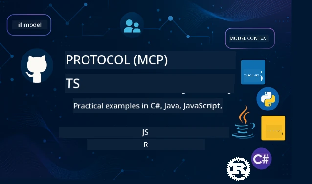

 

[](https://GitHub.com/microsoft/mcp-for-beginners/graphs/contributors)
[](https://GitHub.com/microsoft/mcp-for-beginners/issues)
[](https://GitHub.com/microsoft/mcp-for-beginners/pulls)
[](http://makeapullrequest.com)

[](https://GitHub.com/microsoft/mcp-for-beginners/watchers)
[](https://GitHub.com/microsoft/mcp-for-beginners/fork)
[](https://GitHub.com/microsoft/mcp-for-beginners/stargazers)


[](https://discord.gg/nTYy5BXMWG)

Follow dis steps to start to dey use dis resources:
1. **Fork di Repository**: Click [](https://GitHub.com/microsoft/mcp-for-beginners/fork)
2. **Clone di Repository**:   `git clone https://github.com/microsoft/mcp-for-beginners.git`
3. **Join The** [](https://discord.gg/nTYy5BXMWG)


### 🌐 Multi-Language Support

#### Dem dey support am through GitHub Action (Automatic & Always Up-to-Date)

<!-- CO-OP TRANSLATOR LANGUAGES TABLE START -->
[Arabic](../ar/README.md) | [Bengali](../bn/README.md) | [Bulgarian](../bg/README.md) | [Burmese (Myanmar)](../my/README.md) | [Chinese (Simplified)](../zh-CN/README.md) | [Chinese (Traditional, Hong Kong)](../zh-HK/README.md) | [Chinese (Traditional, Macau)](../zh-MO/README.md) | [Chinese (Traditional, Taiwan)](../zh-TW/README.md) | [Croatian](../hr/README.md) | [Czech](../cs/README.md) | [Danish](../da/README.md) | [Dutch](../nl/README.md) | [Estonian](../et/README.md) | [Finnish](../fi/README.md) | [French](../fr/README.md) | [German](../de/README.md) | [Greek](../el/README.md) | [Hebrew](../he/README.md) | [Hindi](../hi/README.md) | [Hungarian](../hu/README.md) | [Indonesian](../id/README.md) | [Italian](../it/README.md) | [Japanese](../ja/README.md) | [Kannada](../kn/README.md) | [Korean](../ko/README.md) | [Lithuanian](../lt/README.md) | [Malay](../ms/README.md) | [Malayalam](../ml/README.md) | [Marathi](../mr/README.md) | [Nepali](../ne/README.md) | [Nigerian Pidgin](./README.md) | [Norwegian](../no/README.md) | [Persian (Farsi)](../fa/README.md) | [Polish](../pl/README.md) | [Portuguese (Brazil)](../pt-BR/README.md) | [Portuguese (Portugal)](../pt-PT/README.md) | [Punjabi (Gurmukhi)](../pa/README.md) | [Romanian](../ro/README.md) | [Russian](../ru/README.md) | [Serbian (Cyrillic)](../sr/README.md) | [Slovak](../sk/README.md) | [Slovenian](../sl/README.md) | [Spanish](../es/README.md) | [Swahili](../sw/README.md) | [Swedish](../sv/README.md) | [Tagalog (Filipino)](../tl/README.md) | [Tamil](../ta/README.md) | [Telugu](../te/README.md) | [Thai](../th/README.md) | [Turkish](../tr/README.md) | [Ukrainian](../uk/README.md) | [Urdu](../ur/README.md) | [Vietnamese](../vi/README.md)

> **You prefer to Clone Local?**
>
> Dis repository get like 50+ language translation wey go make di download big well well. If you wan clone without di translations, use sparse checkout:
>
> **Bash / macOS / Linux:**
> ```bash
> git clone --filter=blob:none --sparse https://github.com/microsoft/mcp-for-beginners.git
> cd mcp-for-beginners
> git sparse-checkout set --no-cone '/*' '!translations' '!translated_images'
> ```
>
> **CMD (Windows):**
> ```cmd
> git clone --filter=blob:none --sparse https://github.com/microsoft/mcp-for-beginners.git
> cd mcp-for-beginners
> git sparse-checkout set --no-cone "/*" "!translations" "!translated_images"
> ```
>
> Dis one go give you everytin wey you need to complete di course with beta faster download.
<!-- CO-OP TRANSLATOR LANGUAGES TABLE END -->

# 🚀 Model Context Protocol (MCP) Curriculum for Beginners

## **Learn MCP wit Hands-on Code Examples for C#, Java, JavaScript, Rust, Python, and TypeScript**

## 🧠 Overview of di Model Context Protocol Curriculum
Welcome to your journey into di Model Context Protocol! If you don ever wonder how AI applications dey take yan with different tools and services, you go soon discover di fine fine solution wey dey change how developers dey build intelligent systems.

Think say MCP na like universal translator for AI applications - like how USB ports dey let you connect any device to your computer, MCP dey make AI models fit connect any tool or service in one kind standardized way. Whether na your first chatbot you dey build or you dey work on complex AI workflows, to sabi MCP go give you power to create beta and flexible applications.

Dis curriculum dey designed with patience and care for your learning journey. We go start with simple concepts wey you don sabi before and slowly go build your expertise through hands-on practice for your favorite programming language. Every step get clear explanations, practical examples, plus plenty encouragement along di way.

By di time you finish dis journey, you go get confidence to build your own MCP servers, join dem with popular AI platforms, and understand how dis technology dey reshape di future of AI development. Make we start dis exciting adventure together!

### Official Documentation and Specifications

Dis curriculum dey follow **MCP Specification 2025-11-25** (di latest stable release). Di MCP specification dey use date-based versioning (YYYY-MM-DD format) to make sure say protocol version tracking dey clear.

Dem resources go become more valuable as your understanding dey grow, but no need pressure yourself to read everything now now. Start with di areas wey interest you pass!
- 📘 [MCP Documentation](https://modelcontextprotocol.io/) – Na your go-to resource for step-by-step tutorials and user guides. Di documentation write am with beginners in mind, give clear examples wey you fit follow along at your own pace.
- 📜 [MCP Specification](https://modelcontextprotocol.io/specification/2025-11-25) – Think of am as your detailed reference manual. As you go dey work through di curriculum, you go dey come back here to check specific details and explore advanced features.
- 📜 [MCP Specification Versioning](https://modelcontextprotocol.io/specification/versioning) – Dis get information about protocol version history and how MCP dey use date-based versioning (YYYY-MM-DD format).
- 🧑‍💻 [MCP GitHub Repository](https://github.com/modelcontextprotocol) – Disna where you go find SDKs, tools, and code samples for different programming languages. E be like treasure trove of practical examples and ready-to-use components.
- 🌐 [MCP Community](https://github.com/orgs/modelcontextprotocol/discussions) – Join other learners and experienced developers for discussions about MCP. Na supportive community where questions dey welcome and knowledge dey shared freely.
  
## Learning Objectives

By di end of dis curriculum, you go feel confident and excited about your new skills. Na wetin you go fit achieve:

• **Understand MCP fundamentals**: You go sabi wetin Model Context Protocol be and why e dey change how AI applications dey work together, using analogies and examples wey make sense.

• **Build your first MCP server**: You go create working MCP server for your preferred programming language, start with simple examples and grow your skills step by step.

• **Connect AI models with real tools**: You go learn how to join AI models and real services, make your applications get powerful new capabilities.

• **Implement security best practices**: You go understand how to keep your MCP implementations safe and secure, protecting your applications and your users.

• **Deploy with confidence**: You go sabi how to carry your MCP projects from development go production, with practical deployment strategies wey dey work for real world.

• **Join di MCP community**: You go become part of growing community of developers wey dey shape di future of AI application development.

## Essential Background

Before we jump into MCP specifics, mek we make sure say you dey comfortable with some foundation concepts. No worry if you no be expert for these areas - we go explain everytin wey you need to sabi as we go!

### Understanding Protocols (Di Foundation)

Think of protocol as rules for conversation. When you call friend, both of una sabi say make una greet say "hello" when una talk, take turns to speak, and say "goodbye" when una finish. Computer programs need similar rules to communicate well well.

MCP na protocol - set of agreed-upon rules wey dey help AI models and applications to dey yan well with tools and services. Just like how talk rules dey make human communication smooth, MCP dey make AI application communication more reliable and powerful.

### Client-Server Relationships (How Programs Dey Work Together)

You dey use client-server relationship everyday! When you use web browser (client) to visit website, you dey connect to web server wey go send you page content. Browser sabi how to ask for info, server sabi how to reply.

For MCP, we get similar relationship: AI models be clients wey dey request info or actions, MCP servers dey provide those capabilities. E be like say you get helpful assistant (server) wey AI fit ask to do certain tasks.

### Why Standardization Matter (Make Things Work Together)

Imagine if every car maker dey use different shape gas pump - you for need different adapter for each car! Standardization mean to agree on common way so things fit work together well well.

MCP dey provide dis standardization for AI applications. Instead of every AI model need custom code to work with every tool, MCP create one universal way for dem to communicate. E mean say developers fit build tools once, dem go work with many AI systems.

## 🧭 Your Learning Path Overview

Your MCP journey dey carefully structured to build your confidence and skills step by step. Every phase dey introduce new concepts while you still dey learn wetin you don sabi before.

### 🌱 Foundation Phase: Understanding the Basics (Modules 0-2)

Dis na where your adventure start! We go introduce you to MCP concepts using familiar analogies and simple examples. You go understand wetin MCP be, why e dey exist, and how e take fit inside di big world of AI development.

• **Module 0 - Introduction to MCP**: We go start by exploring wetin MCP be and why e dey important for modern AI applications. You go see real-world examples how MCP dey work and understand how e solve common wahala developers dey face.

• **Module 1 - Core Concepts Explained**: Here you go learn di essential building blocks of MCP. We go use plenty analogies and visual examples to make sure these concepts feel natural and easy to understand.

• **Module 2 - Security in MCP**: Security fit sound fear, but we go show you how MCP get built-in safety features and teach you best practices wey go protect your applications from start.

### 🔨 Building Phase: Creating Your First Implementations (Module 3)

Now di real fun dey start! You go get hands-on experience to build actual MCP servers and clients. No worry - we go start simple and guide you through every step.
Dis module get plenti hands-on guides wey go allow you practice for your preferred programming language. You go create your first server, build client wey go connect to am, and even join am with popular development tools like VS Code.

Each guide get full code examples, troubleshooting tips, and explanations why we make certain design choices. By di time you finish dis phase, you go get working MCP implementations wey you fit proud of!

### 🚀 Growing Phase: Advanced Concepts and Real-World Application (Modules 4-5)

With di basics well learnt, you don ready explore more advanced MCP features. We go cover practical implementation strategies, debugging techniques, and advanced topics like multi-modal AI integration.

You go also learn how to scale your MCP implementations for production and join am with cloud platforms like Azure. Dis modules go prepare you build MCP solutions wey fit handle real-world wahala.

### 🌟 Mastery Phase: Community and Specialization (Modules 6-11)

Di last phase focus on how you join di MCP community and do specialization for di areas wey you like pass. You go learn how to contribute to open-source MCP projects, implement advanced authentication patterns, and build full database-integrated solutions.

Module 11 deserve special mention - na complete 13-lab hands-on learning path wey teach you build production-ready MCP servers with PostgreSQL integration. E be like capstone project wey put together everything you don learn!

### 📚 Complete Curriculum Structure

| Module | Topic | Description | Link |
|--------|-------|-------------|------|
| **Module 0-3: Fundamentals** | | | |
| 00 | Introduction to MCP | Overview of the Model Context Protocol and its significance in AI pipelines | [Read more](./00-Introduction/README.md) |
| 01 | Core Concepts Explained | In-depth exploration of core MCP concepts | [Read more](./01-CoreConcepts/README.md) |
| 02 | Security in MCP | Security threats and best practices | [Read more](./02-Security/README.md) |
| 03 | Getting Started with MCP | Environment setup, basic servers/clients, integration | [Read more](./03-GettingStarted/README.md) |
| **Module 3: Building Your First Server & Client** | | | |
| 3.1 | First Server | Create your first MCP server | [Guide](./03-GettingStarted/01-first-server/README.md) |
| 3.2 | First Client | Develop a basic MCP client | [Guide](./03-GettingStarted/02-client/README.md) |
| 3.3 | Client with LLM | Integrate large language models | [Guide](./03-GettingStarted/03-llm-client/README.md) |
| 3.4 | VS Code Integration | Consume MCP servers in VS Code | [Guide](./03-GettingStarted/04-vscode/README.md) |
| 3.5 | stdio Server | Create servers using stdio transport | [Guide](./03-GettingStarted/05-stdio-server/README.md) |
| 3.6 | HTTP Streaming | Implement HTTP streaming in MCP | [Guide](./03-GettingStarted/06-http-streaming/README.md) |
| 3.7 | AI Toolkit | Use AI Toolkit with MCP | [Guide](./03-GettingStarted/07-aitk/README.md) |
| 3.8 | Testing | Test your MCP server implementation | [Guide](./03-GettingStarted/08-testing/README.md) |
| 3.9 | Deployment | Deploy MCP servers to production | [Guide](./03-GettingStarted/09-deployment/README.md) |
| 3.10 | Advanced server usage | Use advanced servers for advanced feature usage and improved architecture | [Guide](./03-GettingStarted/10-advanced/README.md) |
| 3.11 | Simple auth | A chapter showing you auth from the beginning and RBAC | [Guide](./03-GettingStarted/11-simple-auth/README.md) |
| 3.12 | MCP Hosts | Configure Claude Desktop, Cursor, Cline, and other MCP hosts | [Guide](./03-GettingStarted/12-mcp-hosts/README.md) |
| 3.13 | MCP Inspector | Debug and test MCP servers with the Inspector tool | [Guide](./03-GettingStarted/13-mcp-inspector/README.md) |
| 3.14 | Sampling | Use sampling to collaborate with the client | [Guide](./03-GettingStarted/14-sampling/README.md) |
| 3.15 | MCP Apps | Build MCP Apps | [Guide](./03-GettingStarted/15-mcp-apps/README.md) |
| **Module 4-5: Practical & Advanced** | | | |
| 04 | Practical Implementation | SDKs, debugging, testing, reusable prompt templates | [Read more](./04-PracticalImplementation/README.md) |
| 4.1 | Pagination | Handle large result sets with cursor-based pagination | [Guide](./04-PracticalImplementation/pagination/README.md) |
| 05 | Advanced Topics in MCP | Multi-modal AI, scaling, enterprise use | [Read more](./05-AdvancedTopics/README.md) |
| 5.1 | Azure Integration | MCP Integration with Azure | [Guide](./05-AdvancedTopics/mcp-integration/README.md) |
| 5.2 | Multi-modality | Working with multiple modalities | [Guide](./05-AdvancedTopics/mcp-multi-modality/README.md) |
| 5.3 | OAuth2 Demo | Implement OAuth2 authentication | [Guide](./05-AdvancedTopics/mcp-oauth2-demo/README.md) |
| 5.4 | Root Contexts | Understand and implement root contexts | [Guide](./05-AdvancedTopics/mcp-root-contexts/README.md) |
| 5.5 | Routing | MCP routing strategies | [Guide](./05-AdvancedTopics/mcp-routing/README.md) |
| 5.6 | Sampling | Sampling techniques in MCP | [Guide](./05-AdvancedTopics/mcp-sampling/README.md) |
| 5.7 | Scaling | Scale MCP implementations | [Guide](./05-AdvancedTopics/mcp-scaling/README.md) |
| 5.8 | Security | Advanced security considerations | [Guide](./05-AdvancedTopics/mcp-security/README.md) |
| 5.9 | Web Search | Implement web search capabilities | [Guide](./05-AdvancedTopics/web-search-mcp/README.md) |
| 5.10 | Realtime Streaming | Build realtime streaming functionality | [Guide](./05-AdvancedTopics/mcp-realtimestreaming/README.md) |
| 5.11 | Realtime Search | Implement realtime search | [Guide](./05-AdvancedTopics/mcp-realtimesearch/README.md) |
| 5.12 | Entra ID Auth | Authentication with Microsoft Entra ID | [Guide](./05-AdvancedTopics/mcp-security-entra/README.md) |
| 5.13 | Foundry Integration | Integrate with Azure AI Foundry | [Guide](./05-AdvancedTopics/mcp-foundry-agent-integration/README.md) |
| 5.14 | Context Engineering | Techniques for effective context engineering | [Guide](./05-AdvancedTopics/mcp-contextengineering/README.md) |
| 5.15 | MCP Custom Transport | Custom Transport implementations | [Guide](./05-AdvancedTopics/mcp-transport/README.md) |
| 5.16 | Protocol Features | Progress notifications, cancellation, resource templates | [Guide](./05-AdvancedTopics/mcp-protocol-features/README.md) |
| **Module 6-10: Community & Best Practices** | | | |
| 06 | Community Contributions | How to contribute to the MCP ecosystem | [Guide](./06-CommunityContributions/README.md) |
| 07 | Insights from Early Adoption | Real-world implementation stories | [Guide](./07-LessonsfromEarlyAdoption/README.md) |
| 08 | Best Practices for MCP | Performance, fault-tolerance, resilience | [Guide](./08-BestPractices/README.md) |
| 09 | MCP Case Studies | Practical implementation examples | [Guide](./09-CaseStudy/README.md) |
| 10 | Hands-on Workshop | Building an MCP Server with AI Toolkit | [Lab](./10-StreamliningAIWorkflowsBuildingAnMCPServerWithAIToolkit/README.md) |
| **Module 11: MCP Server Hands On Lab** | | | |
| 11 | MCP Server Database Integration | Comprehensive 13-lab hands-on learning path for PostgreSQL integration | [Labs](./11-MCPServerHandsOnLabs/README.md) |
| 11.1 | Introduction | Overview of MCP with database integration and retail analytics use case | [Lab 00](./11-MCPServerHandsOnLabs/00-Introduction/README.md) |
| 11.2 | Core Architecture | Understanding MCP server architecture, database layers, and security patterns | [Lab 01](./11-MCPServerHandsOnLabs/01-Architecture/README.md) |
| 11.3 | Security & Multi-Tenancy | Row Level Security, authentication, and multi-tenant data access | [Lab 02](./11-MCPServerHandsOnLabs/02-Security/README.md) |
| 11.4 | Environment Setup | Setting up development environment, Docker, Azure resources | [Lab 03](./11-MCPServerHandsOnLabs/03-Setup/README.md) |
| 11.5 | Database Design | PostgreSQL setup, retail schema design, and sample data | [Lab 04](./11-MCPServerHandsOnLabs/04-Database/README.md) |
| 11.6 | MCP Server Implementation | Building the FastMCP server with database integration | [Lab 05](./11-MCPServerHandsOnLabs/05-MCP-Server/README.md) |
| 11.7 | Tool Development | Creating database query tools and schema introspection | [Lab 06](./11-MCPServerHandsOnLabs/06-Tools/README.md) |
| 11.8 | Semantic Search | Implementing vector embeddings with Azure OpenAI and pgvector | [Lab 07](./11-MCPServerHandsOnLabs/07-Semantic-Search/README.md) |
| 11.9 | Testing & Debugging | Testing strategies, debugging tools, and validation approaches | [Lab 08](./11-MCPServerHandsOnLabs/08-Testing/README.md) |
| 11.10 | VS Code Integration | Configuring VS Code MCP integration and AI Chat usage | [Lab 09](./11-MCPServerHandsOnLabs/09-VS-Code/README.md) |
| 11.11 | Deployment Strategies | Docker deployment, Azure Container Apps, and scaling considerations | [Lab 10](./11-MCPServerHandsOnLabs/10-Deployment/README.md) |
| 11.12 | Monitoring | Application Insights, logging, performance monitoring | [Lab 11](./11-MCPServerHandsOnLabs/11-Monitoring/README.md) |
| 11.13 | Best Practices | Performance optimization, security hardening, and production tips | [Lab 12](./11-MCPServerHandsOnLabs/12-Best-Practices/README.md) |

### 💻 Sample Code Projects

One of the most exciting parts of learning MCP na to see how your code skills dey develop step by step. We design our code examples to start simple and grow more advanced as your understanding deep. Dis na how we introduce concepts - with code wey simple to understand but show real MCP principles, you go sabi not just wetin dis code dey do, but why e dey structured like dis and how e take fit inside bigger MCP applications.

#### Basic MCP Calculator Samples

| Language | Description | Link |
|----------|-------------|------|
| C# | MCP Server Example | [View Code](./03-GettingStarted/samples/csharp/README.md) |
| Java | MCP Calculator | [View Code](./03-GettingStarted/samples/java/calculator/README.md) |
| JavaScript | MCP Demo | [View Code](./03-GettingStarted/samples/javascript/README.md) |
| Python | MCP Server | [View Code](../../03-GettingStarted/samples/python/mcp_calculator_server.py) |
| TypeScript | MCP Example | [View Code](./03-GettingStarted/samples/typescript/README.md) |
| Rust | MCP Example | [View Code](./03-GettingStarted/samples/rust/README.md) |

#### Advanced MCP Implementations

| Language | Description | Link |
|----------|-------------|------|
| C# | Advanced Sample | [View Code](./04-PracticalImplementation/samples/csharp/README.md) |
| Java with Spring | Container App Example | [View Code](./04-PracticalImplementation/samples/java/containerapp/README.md) |
| JavaScript | Advanced Sample | [View Code](./04-PracticalImplementation/samples/javascript/README.md) |
| Python | Complex Implementation | [View Code](./04-PracticalImplementation/samples/python/README.md) |
| TypeScript | Container Sample | [View Code](./04-PracticalImplementation/samples/typescript/README.md) |


## 🎯 Prerequisites for Learning MCP

To get di most out of dis curriculum, you suppose get:
- Basic knowledge of programming for at least one of dis languages: C#, Java, JavaScript, Python, or TypeScript
- Understanding of client-server model and APIs
- Familiarity with REST and HTTP concepts
- (Optional) Background for AI/ML concepts

- Joining our community discussions to get support

## 📚 Study Guide & Resources

Dis repository get plenty resources wey go help you navigate and learn well:

### Study Guide

We get one complete [Study Guide](./study_guide.md) wey go help you sabi dis repository well well. Dis visual curriculum map dey show how all di topics dem connect and e give you instructions on how to use di sample projects well. E good well well if you be visual learner wey like see di whole picture.

Di guide get:
- Visual curriculum map wey show all di topics wey dem cover
- Detailed breakdown for each section for dis repository
- Instructions on how to use di sample projects
- Recommended learning paths for different skill levels
- More resources to support your learning journey

### Changelog

We dey maintain one detailed [Changelog](./changelog.md) wey dey track all important updates to di curriculum materials, so you fit dey up to date with all di latest better things wey dem add.
- New content wey dem add
- Changes for structure
- Better features wey dem add
- Documentation updates

## 🛠️ How to Use Dis Curriculum Well

Each lesson for dis guide get:

1. Clear explanation of MCP concepts  
2. Live code examples for different languages  
3. Exercises to help you build real MCP applications  
4. Extra resources for advanced learners

### Make we Learn MCP with C# - Tutorial Series
Make we learn about Model Context Protocol (MCP), one new framework wey dem design to standardize how AI models and client applications go take interact. For dis beginner-friendly session, we go introduce you to MCP and guide you to create your first MCP server.
#### C#: [https://aka.ms/letslearnmcp-csharp](https://aka.ms/letslearnmcp-csharp)
#### Java: [https://aka.ms/letslearnmcp-java](https://aka.ms/letslearnmcp-java)
#### JavaScript: [https://aka.ms/letslearnmcp-javascript](https://aka.ms/letslearnmcp-javascript)
#### Python: [https://aka.ms/letslearnmcp-python](https://aka.ms/letslearnmcp-python)

## 🎓 Your MCP Journey Don Start

Congrats! You don just take di first step for one jara journey wey go expand your programming skills and connect you to di forefront of AI development.

### Wetin You Don Achieve So Far

As you dey read dis introduction, you don start to build your MCP knowledge base. You understand wetin MCP be, why e important, and how dis curriculum go support your learning journey. Dat na big achievement and na di start of your skill for dis important technology.

### Di Journey Wey Dey Ahead

As you go dey move through di modules, remember say every expert start as beginner. Di concepts wey fit look hard now go become easy pass as you dey practice and apply dem. Each small step you take dey build strong skills wey go serve you well for your development career.

### Your Support Network

You dey join community of learners and experts wey dey passionate about MCP and ready to help others succeed. Whether you get coding wahala or you dey excited to share your breakthrough, di community dey here to support your journey.

If you jam problem or get any question about how to build AI apps, join other learners and experienced developers for discussion about MCP. E be supportive community wey questions dey welcome and knowledge dey shared freely.

[](https://discord.gg/nTYy5BXMWG)

If you get product feedback or errors while building, visit:

[](https://aka.ms/foundry/forum)

### You Ready to Start?

Your MCP journey don start now! Begin wit Module 0 to enter your first hands-on MCP experience, or check di sample projects to see wetin you go build. Remember - every expert start from where you dey now, and with patience plus practice, you go surprise how far you fit go.

Welcome to di world of Model Context Protocol development. Make we build beta tin together!

## 🤝 Contributing to di Learning Community

Dis curriculum go strong well with contributions from learners like you! Whether you dey fix typo, suggest better explanation, or add new example, your contributions go help other beginners succeed.

Thanks to Microsoft Valued Professional [Shivam Goyal](https://www.linkedin.com/in/shivam2003/) for contributing code samples.

Di contribution process dey welcoming and supportive. Most contributions need Contributor License Agreement (CLA), but di automated tools go guide you smoothly.

## 📜 Open Source Learning

Dis whole curriculum dey under MIT [LICENSE](../../LICENSE), so you fit use, modify, and share am freely. Dis support our mission to make MCP knowledge available to developers everywhere.
## 🤝 Contribution Guidelines

Dis project dey welcome contributions and suggestions. Most contributions go require you to agree to
Contributor License Agreement (CLA) wey talk say you get right, and you dey grant us
permission to use your contribution. For details, visit <https://cla.opensource.microsoft.com>.

When you submit pull request, CLA bot go automatically check if you need to provide
CLA and decorate di PR (e.g., status check, comment). Just follow instructions wey di bot give.
You go only need to do dis once for all repos wey dey use our CLA.

Dis project don adopt the [Microsoft Open Source Code of Conduct](https://opensource.microsoft.com/codeofconduct/).
For more details see [Code of Conduct FAQ](https://opensource.microsoft.com/codeofconduct/faq/) or
contact [opencode@microsoft.com](mailto:opencode@microsoft.com) for any extra questions or comments.

---

*Ready to start your MCP journey? Begin with [Module 00 - Introduction to MCP](./00-Introduction/README.md) and take your first steps inside di world of Model Context Protocol development!*


## 🎒 Other Courses
Our team dey produce other courses! Check am out:

<!-- CO-OP TRANSLATOR OTHER COURSES START -->
### LangChain
[](https://aka.ms/langchain4j-for-beginners)
[](https://aka.ms/langchainjs-for-beginners?WT.mc_id=m365-94501-dwahlin)
[](https://github.com/microsoft/langchain-for-beginners?WT.mc_id=m365-94501-dwahlin)
---

### Azure / Edge / MCP / Agents
[](https://github.com/microsoft/AZD-for-beginners?WT.mc_id=academic-105485-koreyst)
[](https://github.com/microsoft/edgeai-for-beginners?WT.mc_id=academic-105485-koreyst)
[](https://github.com/microsoft/mcp-for-beginners?WT.mc_id=academic-105485-koreyst)
[](https://github.com/microsoft/ai-agents-for-beginners?WT.mc_id=academic-105485-koreyst)

---
 
### Generative AI Series
[](https://github.com/microsoft/generative-ai-for-beginners?WT.mc_id=academic-105485-koreyst)
[-9333EA?style=for-the-badge&labelColor=E5E7EB&color=9333EA)](https://github.com/microsoft/Generative-AI-for-beginners-dotnet?WT.mc_id=academic-105485-koreyst)
[-C084FC?style=for-the-badge&labelColor=E5E7EB&color=C084FC)](https://github.com/microsoft/generative-ai-for-beginners-java?WT.mc_id=academic-105485-koreyst)
[-E879F9?style=for-the-badge&labelColor=E5E7EB&color=E879F9)](https://github.com/microsoft/generative-ai-with-javascript?WT.mc_id=academic-105485-koreyst)

---
 
### Core Learning
[](https://aka.ms/ml-beginners?WT.mc_id=academic-105485-koreyst)
[](https://aka.ms/datascience-beginners?WT.mc_id=academic-105485-koreyst)
[](https://aka.ms/ai-beginners?WT.mc_id=academic-105485-koreyst)
[](https://github.com/microsoft/Security-101?WT.mc_id=academic-96948-sayoung)
[](https://aka.ms/webdev-beginners?WT.mc_id=academic-105485-koreyst)
[](https://aka.ms/iot-beginners?WT.mc_id=academic-105485-koreyst)
[](https://github.com/microsoft/xr-development-for-beginners?WT.mc_id=academic-105485-koreyst)

---
 
### Copilot Series
[](https://aka.ms/GitHubCopilotAI?WT.mc_id=academic-105485-koreyst)
[](https://github.com/microsoft/mastering-github-copilot-for-dotnet-csharp-developers?WT.mc_id=academic-105485-koreyst)
[](https://github.com/microsoft/CopilotAdventures?WT.mc_id=academic-105485-koreyst)
<!-- CO-OP TRANSLATOR OTHER COURSES END -->

---

<!-- CO-OP TRANSLATOR DISCLAIMER START -->
**Disclaimer**:  
Dis document don translate wit AI translation service [Co-op Translator](https://github.com/Azure/co-op-translator). Even tho we dey try make am correct, abeg sabi say automatic translation fit get some mistake or no too correct. The original document wey dem write for im own language na im be the correct one. For important tins, make person wey sabi do professional human translation handle am. We no responsible if any yawa or wahala come from how dis translation take be.
<!-- CO-OP TRANSLATOR DISCLAIMER END -->