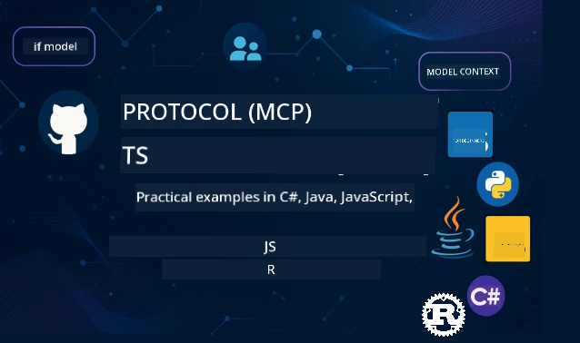

 

[](https://GitHub.com/microsoft/mcp-for-beginners/graphs/contributors)
[](https://GitHub.com/microsoft/mcp-for-beginners/issues)
[](https://GitHub.com/microsoft/mcp-for-beginners/pulls)
[](http://makeapullrequest.com)
[](https://mcptoplist.com/server/mcp.so%2Fmcp-for-beginners%2Fmicrosoft)

[](https://GitHub.com/microsoft/mcp-for-beginners/watchers)
[](https://GitHub.com/microsoft/mcp-for-beginners/fork)
[](https://GitHub.com/microsoft/mcp-for-beginners/stargazers)


[](https://discord.gg/nTYy5BXMWG)

Follow dis step dem to start to use dis resources:
1. **Fork the Repository**: Click [](https://GitHub.com/microsoft/mcp-for-beginners/fork)
2. **Clone the Repository**:   `git clone https://github.com/microsoft/mcp-for-beginners.git`
3. **Join The** [](https://discord.gg/nTYy5BXMWG)


### 🌐 Multi-Language Support

#### Supported via GitHub Action (Automated & Always Up-to-Date)

<!-- CO-OP TRANSLATOR LANGUAGES TABLE START -->
[Arabic](../ar/README.md) | [Bengali](../bn/README.md) | [Bulgarian](../bg/README.md) | [Burmese (Myanmar)](../my/README.md) | [Chinese (Simplified)](../zh-CN/README.md) | [Chinese (Traditional, Hong Kong)](../zh-HK/README.md) | [Chinese (Traditional, Macau)](../zh-MO/README.md) | [Chinese (Traditional, Taiwan)](../zh-TW/README.md) | [Croatian](../hr/README.md) | [Czech](../cs/README.md) | [Danish](../da/README.md) | [Dutch](../nl/README.md) | [Estonian](../et/README.md) | [Finnish](../fi/README.md) | [French](../fr/README.md) | [German](../de/README.md) | [Greek](../el/README.md) | [Hebrew](../he/README.md) | [Hindi](../hi/README.md) | [Hungarian](../hu/README.md) | [Indonesian](../id/README.md) | [Italian](../it/README.md) | [Japanese](../ja/README.md) | [Kannada](../kn/README.md) | [Khmer](../km/README.md) | [Korean](../ko/README.md) | [Lithuanian](../lt/README.md) | [Malay](../ms/README.md) | [Malayalam](../ml/README.md) | [Marathi](../mr/README.md) | [Nepali](../ne/README.md) | [Nigerian Pidgin](./README.md) | [Norwegian](../no/README.md) | [Persian (Farsi)](../fa/README.md) | [Polish](../pl/README.md) | [Portuguese (Brazil)](../pt-BR/README.md) | [Portuguese (Portugal)](../pt-PT/README.md) | [Punjabi (Gurmukhi)](../pa/README.md) | [Romanian](../ro/README.md) | [Russian](../ru/README.md) | [Serbian (Cyrillic)](../sr/README.md) | [Slovak](../sk/README.md) | [Slovenian](../sl/README.md) | [Spanish](../es/README.md) | [Swahili](../sw/README.md) | [Swedish](../sv/README.md) | [Tagalog (Filipino)](../tl/README.md) | [Tamil](../ta/README.md) | [Telugu](../te/README.md) | [Thai](../th/README.md) | [Turkish](../tr/README.md) | [Ukrainian](../uk/README.md) | [Urdu](../ur/README.md) | [Vietnamese](../vi/README.md)

> **You go want Clone for Local?**
>
> Dis repository get 50+ language waka dem wey go make the download size big well-well. To clone without translations, use sparse checkout:
>
> **Bash / macOS / Linux:**
> ```bash
> git clone --filter=blob:none --sparse https://github.com/microsoft/mcp-for-beginners.git
> cd mcp-for-beginners
> git sparse-checkout set --no-cone '/*' '!translations' '!translated_images'
> ```
>
> **CMD (Windows):**
> ```cmd
> git clone --filter=blob:none --sparse https://github.com/microsoft/mcp-for-beginners.git
> cd mcp-for-beginners
> git sparse-checkout set --no-cone "/*" "!translations" "!translated_images"
> ```
>
> Dis one go gimme everything wey you need to finish di course fast-fast.
<!-- CO-OP TRANSLATOR LANGUAGES TABLE END -->

# 🚀 Model Context Protocol (MCP) Curriculum for Beginners

## **Learn MCP with Hands-on Code Examples in C#, Java, JavaScript, Rust, Python, and TypeScript**

## 🧠 Overview of the Model Context Protocol Curriculum
Welcome to your journey into the Model Context Protocol! If you don ever wonder how AI applications dey communicate wit different tools and services, you dey come find di correct way wey dey change how developers dey build smart systems.

Think of MCP as one kain universal translator for AI applications - just like how USB ports dey allow you connect any device to your computer, MCP dey make AI models fit connect to any tool or service for one correct way. Whether you dey build your first chatbot or you dey work on complex AI workflows, understanding MCP go give you power to create better and flexible applications.

Dis curriculum na build for patience and care for your learning journey. We go start with simple concepts you sabi and gradually build your skill through hands-on practice with your favorite programming language. Every step get clear explanations, practical examples, and plenty encouragement along di way.

By di time you finish dis journey, you go get confidence to build your own MCP servers, join dem wit popular AI platforms, and sabi how dis technology dey change the future of AI development. Make we start dis exciting adventure together!

### Official Documentation and Specifications

Dis curriculum dey follow **MCP Specification 2025-11-25** (di latest stable release). The MCP specification dey use date-based versioning (YYYY-MM-DD format) to keep track of protocol versions clear clear.

> **Looking ahead:** one release candidate for next specification version, **2026-07-28**, dey plan to drop for July 28, 2026. E go make di protocol stateless for transport layer, e go set one Extensions framework (MCP Apps, Tasks), e go strong authorization, and e go remove Roots, Sampling, and Logging. See [What's Changing in MCP: The 2026-07-28 Release Candidate](./01-CoreConcepts/mcp-2026-07-28-release-candidate.md) for full explanation.

These resources go become more valuable as your understanding grow, but no feel say you must read everything immediately. Start with the parts wey interest you pass!
- 📘 [MCP Documentation](https://modelcontextprotocol.io/) – Dis na your go-to resource for step-by-step tutorials and user guides. The documentation dey written for beginners, e get clear examples wey you fit follow at your own pace.
- 📜 [MCP Specification](https://modelcontextprotocol.io/specification/2025-11-25) – Think of am as your full reference manual. As you dey work through di curriculum, you go come back here to check specific details and explore advanced features.
- 📜 [MCP Specification Versioning](https://modelcontextprotocol.io/specification/versioning) – Dis one get information about protocol version history and how MCP dey use date-based versioning (YYYY-MM-DD format).
- 🧑‍💻 [MCP GitHub Repository](https://github.com/modelcontextprotocol) – Here you go find SDKs, tools, and code samples for many programming languages. E be like treasure trove of practical examples and ready-to-use components.
- 🌐 [MCP Community](https://github.com/orgs/modelcontextprotocol/discussions) – Join other learners and experienced developers for discussions about MCP. E be one supportive community wey questions dey welcome and knowledge dey share freely.
  
## Learning Objectives

By di end of dis curriculum, you go feel confident and excited about your new skills. Dis na wetin you go achieve:

• **Understand MCP fundamentals**: You go sabi wetin Model Context Protocol be and why e dey change how AI applications dey work together, using analogies and examples wey make sense.

• **Build your first MCP server**: You go create one working MCP server for your preferred programming language, starting with simple examples and grow your skills step by step.

• **Connect AI models to real tools**: You go learn how to bridge di gap between AI models and real services, give your applications powerful new capabilities.

• **Implement security best practices**: You go understand how to keep your MCP implementations safe and secure, protect both your applications and your users.

• **Deploy with confidence**: You go know how to carry your MCP projects from development go production, wit practical deployment strategies wey dey work for real world.

• **Join the MCP community**: You go become part of a growing community of developers wey dey shape the future of AI application development. 

## Essential Background

Before we waka enter MCP specifics, make sure you dey comfortable wit some foundation concepts. No worry if you no be expert for these areas - we go explain everything you need to know as we go!

### Understanding Protocols (The Foundation)

Think of protocol like the rules for how conversation dey go. When you call your friend, una sabi say una go talk "hello" when una pick, una go talk one after the other, and say "goodbye" when una done. Computer programs need similar rules to talk well well.

MCP na protocol - one set of agreed rules wey dey help AI models and applications get better "talk" wit tools and services. Just like how rules for conversation dey make human talk easy, MCP dey make AI application communication more reliable and strong.

### Client-Server Relationships (How Programs Work Together)

You don dey use client-server relationships every day! When you dey use web browser (the client) go visit website, you dey connect to web server wey dey send you di page. Browser sabi how to ask, server sabi how to reply.

For MCP, we get same relationship: AI models dey act as clients wey dey request information or actions, MCP servers dey give those capabilities. E be like say you get assistant (the server) wey AI fit ask to do specific work.

### Why Standardization Matters (Making Things Work Together)

Imagine say every car manufacturer get different shape for gas pump - you go need different adapter for each car! Standardization mean say una agree on common ways so things fit work together smoothly.

MCP dey give dis standardization for AI applications. Instead of every AI model need different custom code to work wit every tool, MCP create one universal way for dem to communicate. This one mean say developers fit build tools once and dem go work wit plenty AI systems.

## 🧭 Your Learning Path Overview

Your MCP journey dey carefully arrange to build your confidence and skills step by step. Each phase dey introduce new concepts plus reinforce wetin you don learn before.

### 🌱 Foundation Phase: Understanding the Basics (Modules 0-2)

Dis na where your adventure start! We go introduce you to MCP concepts wit familiar analogies and simple examples. You go understand wetin MCP be, why e dey, and how e fit join the bigger world of AI development.


• **Module 0 - Introduction to MCP**: We go start by to explore wetin MCP be and why e important for modern AI applications dem. You go see real-world examples of MCP for action and sabi how e dey solve the common wahala wey developers dey face.

• **Module 1 - Core Concepts Explained**: For here, you go learn the important building blocks of MCP. We go use plenty analogies and visual examples make sure these concepts dey natural and easy to understand.

• **Module 2 - Security in MCP**: Security fit sound hard, but we go show you how MCP get built-in safety features and teach you the best ways to protect your applications from the start.

### 🔨 Building Phase: Creating Your First Implementations (Module 3)

Now na for here the real fun start! You go get hands-on experience to build real MCP servers and clients. No worry - we go start simple and guide you well well.

This module get plenty hands-on guides wey go let you practice for your preferred programming language. You go create your first server, build client wey go connect to am, and even join popular development tools like VS Code.

Every guide get complete code examples, troubleshooting tips, and explanations why we dey make specific design choices. By the end of this phase, you go get working MCP implementations wey you fit proud of!

### 🚀 Growing Phase: Advanced Concepts and Real-World Application (Modules 4-5)

After you don get the basics well, you go ready to explore more advanced MCP features. We go cover practical ways to implement am, debugging skills, and advanced topics like multi-modal AI integration.

You go still learn how to scale your MCP implementations for production use and join top cloud platforms like Azure. These modules go prepare you to build MCP solutions wey fit handle real-world demand.

### 🌟 Mastery Phase: Community and Specialization (Modules 6-11)

The final phase na about how to join the MCP community and specialize for the areas wey you like pass. You go learn how to contribute to open-source MCP projects, implement advanced authentication patterns, and build complete database-integrated solutions.

Module 11 dey special - na full 13-lab hands-on learning path wey go teach you how to build production-ready MCP servers with PostgreSQL integration. E be like capstone project wey bring all wetin you don learn together!

### 📚 Complete Curriculum Structure

| Module | Topic | Description | Link |
|--------|-------|-------------|------|
| **Module 0-3: Fundamentals** | | | |
| 00 | Introduction to MCP | Overview of the Model Context Protocol and its significance in AI pipelines | [Read more](./00-Introduction/README.md) |
| 01 | Core Concepts Explained | In-depth exploration of core MCP concepts | [Read more](./01-CoreConcepts/README.md) |
| 1.1 | What's Changing in MCP (2026-07-28 RC) | Stateless protocol, Extensions framework, and feature deprecations coming in the next spec version | [Guide](./01-CoreConcepts/mcp-2026-07-28-release-candidate.md) |
| 02 | Security in MCP | Security threats and best practices | [Read more](./02-Security/README.md) |
| 03 | Getting Started with MCP | Environment setup, basic servers/clients, integration | [Read more](./03-GettingStarted/README.md) |
| **Module 3: Building Your First Server & Client** | | | |
| 3.1 | First Server | Create your first MCP server | [Guide](./03-GettingStarted/01-first-server/README.md) |
| 3.2 | First Client | Develop a basic MCP client | [Guide](./03-GettingStarted/02-client/README.md) |
| 3.3 | Client with LLM | Integrate large language models | [Guide](./03-GettingStarted/03-llm-client/README.md) |
| 3.4 | VS Code Integration | Consume MCP servers in VS Code | [Guide](./03-GettingStarted/04-vscode/README.md) |
| 3.5 | stdio Server | Create servers using stdio transport | [Guide](./03-GettingStarted/05-stdio-server/README.md) |
| 3.6 | HTTP Streaming | Implement HTTP streaming in MCP | [Guide](./03-GettingStarted/06-http-streaming/README.md) |
| 3.7 | Microsoft Foundry Toolkit | Use Microsoft Foundry Toolkit with MCP | [Guide](./03-GettingStarted/07-aitk/README.md) |
| 3.8 | Testing | Test your MCP server implementation | [Guide](./03-GettingStarted/08-testing/README.md) |
| 3.9 | Deployment | Deploy MCP servers to production | [Guide](./03-GettingStarted/09-deployment/README.md) |
| 3.10 | Advanced server usage | Use advanced servers for advanced feature usage and improved architecture | [Guide](./03-GettingStarted/10-advanced/README.md) |
| 3.11 | Simple auth | A chapter showing you auth from the beginning and RBAC | [Guide](./03-GettingStarted/11-simple-auth/README.md) |
| 3.12 | MCP Hosts | Configure Claude Desktop, Cursor, Cline, and other MCP hosts | [Guide](./03-GettingStarted/12-mcp-hosts/README.md) |
| 3.13 | MCP Inspector | Debug and test MCP servers with the Inspector tool | [Guide](./03-GettingStarted/13-mcp-inspector/README.md) |
| 3.14 | Sampling | Use sampling to collaborate with the client | [Guide](./03-GettingStarted/14-sampling/README.md) |
| 3.15 | MCP Apps | Build MCP Apps | [Guide](./03-GettingStarted/15-mcp-apps/README.md) |
| **Module 4-5: Practical & Advanced** | | | |
| 04 | Practical Implementation | SDKs, debugging, testing, reusable prompt templates | [Read more](./04-PracticalImplementation/README.md) |
| 4.1 | Pagination | Handle large result sets with cursor-based pagination | [Guide](./04-PracticalImplementation/pagination/README.md) |
| 05 | Advanced Topics in MCP | Multi-modal AI, scaling, enterprise use | [Read more](./05-AdvancedTopics/README.md) |
| 5.1 | Azure Integration | MCP Integration with Azure | [Guide](./05-AdvancedTopics/mcp-integration/README.md) |
| 5.2 | Multi-modality | Working with multiple modalities | [Guide](./05-AdvancedTopics/mcp-multi-modality/README.md) |
| 5.3 | OAuth2 Demo | Implement OAuth2 authentication | [Guide](./05-AdvancedTopics/mcp-oauth2-demo/README.md) |
| 5.4 | Root Contexts | Understand and implement root contexts | [Guide](./05-AdvancedTopics/mcp-root-contexts/README.md) |
| 5.5 | Routing | MCP routing strategies | [Guide](./05-AdvancedTopics/mcp-routing/README.md) |
| 5.6 | Sampling | Sampling techniques in MCP | [Guide](./05-AdvancedTopics/mcp-sampling/README.md) |
| 5.7 | Scaling | Scale MCP implementations | [Guide](./05-AdvancedTopics/mcp-scaling/README.md) |
| 5.8 | Security | Advanced security considerations | [Guide](./05-AdvancedTopics/mcp-security/README.md) |
| 5.9 | Web Search | Implement web search capabilities | [Guide](./05-AdvancedTopics/web-search-mcp/README.md) |
| 5.10 | Realtime Streaming | Build realtime streaming functionality | [Guide](./05-AdvancedTopics/mcp-realtimestreaming/README.md) |
| 5.11 | Realtime Search | Implement realtime search | [Guide](./05-AdvancedTopics/mcp-realtimesearch/README.md) |
| 5.12 | Entra ID Auth | Authentication with Microsoft Entra ID | [Guide](./05-AdvancedTopics/mcp-security-entra/README.md) |
| 5.13 | Foundry Integration | Integrate with Microsoft Foundry | [Guide](./05-AdvancedTopics/mcp-foundry-agent-integration/README.md) |
| 5.14 | Context Engineering | Techniques for effective context engineering | [Guide](./05-AdvancedTopics/mcp-contextengineering/README.md) |
| 5.15 | MCP Custom Transport | Custom Transport implementations | [Guide](./05-AdvancedTopics/mcp-transport/README.md) |
| 5.16 | Protocol Features | Progress notifications, cancellation, resource templates | [Guide](./05-AdvancedTopics/mcp-protocol-features/README.md) |
| 5.17 | Adversarial Multi-Agent Reasoning | Two agents argue opposite sides using shared MCP tools, evaluated by a judge agent | [Guide](./05-AdvancedTopics/mcp-adversarial-agents/README.md) |
| **Module 6-10: Community & Best Practices** | | | |
| 06 | Community Contributions | How to contribute to the MCP ecosystem | [Guide](./06-CommunityContributions/README.md) |
| 07 | Insights from Early Adoption | Real-world implementation stories | [Guide](./07-LessonsfromEarlyAdoption/README.md) |
| 08 | Best Practices for MCP | Performance, fault-tolerance, resilience | [Guide](./08-BestPractices/README.md) |
| 09 | MCP Case Studies | Practical implementation examples | [Guide](./09-CaseStudy/README.md) |
| 10 | Hands-on Workshop | Building an MCP Server with Microsoft Foundry Toolkit | [Lab](./10-StreamliningAIWorkflowsBuildingAnMCPServerWithAIToolkit/README.md) |
| **Module 11: MCP Server Hands On Lab** | | | |
| 11 | MCP Server Database Integration | Comprehensive 13-lab hands-on learning path for PostgreSQL integration | [Labs](./11-MCPServerHandsOnLabs/README.md) |
| 11.1 | Introduction | Overview of MCP with database integration and retail analytics use case | [Lab 00](./11-MCPServerHandsOnLabs/00-Introduction/README.md) |
| 11.2 | Core Architecture | Understanding MCP server architecture, database layers, and security patterns | [Lab 01](./11-MCPServerHandsOnLabs/01-Architecture/README.md) |
| 11.3 | Security & Multi-Tenancy | Row Level Security, authentication, and multi-tenant data access | [Lab 02](./11-MCPServerHandsOnLabs/02-Security/README.md) |
| 11.4 | Environment Setup | Setting up development environment, Docker, Azure resources | [Lab 03](./11-MCPServerHandsOnLabs/03-Setup/README.md) |
| 11.5 | Database Design | PostgreSQL setup, retail schema design, and sample data | [Lab 04](./11-MCPServerHandsOnLabs/04-Database/README.md) |
| 11.6 | MCP Server Implementation | Building the FastMCP server with database integration | [Lab 05](./11-MCPServerHandsOnLabs/05-MCP-Server/README.md) |
| 11.7 | Tool Development | Creating database query tools and schema introspection | [Lab 06](./11-MCPServerHandsOnLabs/06-Tools/README.md) |
| 11.8 | Semantic Search | Implementing vector embeddings with Azure OpenAI and pgvector | [Lab 07](./11-MCPServerHandsOnLabs/07-Semantic-Search/README.md) |
| 11.9 | Testing & Debugging | Testing strategies, debugging tools, and validation approaches | [Lab 08](./11-MCPServerHandsOnLabs/08-Testing/README.md) |
| 11.10 | VS Code Integration | Configuring VS Code MCP integration and AI Chat usage | [Lab 09](./11-MCPServerHandsOnLabs/09-VS-Code/README.md) |
| 11.11 | Deployment Strategies | Docker deployment, Azure Container Apps, and scaling considerations | [Lab 10](./11-MCPServerHandsOnLabs/10-Deployment/README.md) |
| 11.12 | Monitoring | Application Insights, logging, performance monitoring | [Lab 11](./11-MCPServerHandsOnLabs/11-Monitoring/README.md) |
| 11.13 | Best Practices | Performance optimization, security hardening, and production tips | [Lab 12](./11-MCPServerHandsOnLabs/12-Best-Practices/README.md) |
| **Module 12: MCP Tooling** | | | |
| 12.1 | Tooling | MCP usage in Copilot App | [ Guide ](./12-tooling/README.md) |

### 💻 Sample Code Projects

One of the most exciting parts of learning MCP na to see your code skills dey improve little little. We don design our code examples to start simple and grow more advanced as you sabi am better. Na so we dey introduce concepts - with code wey dey easy to understand but dey show real MCP principles, you go understand not only wetin the code dey do, but why e dey arranged like that and how e fit join bigger MCP applications.

#### Basic MCP Calculator Samples

| Language | Description | Link |
|----------|-------------|------|

| C# | MCP Server Example | [View Code](./03-GettingStarted/samples/csharp/README.md) |
| Java | MCP Calculator | [View Code](./03-GettingStarted/samples/java/calculator/README.md) |
| JavaScript | MCP Demo | [View Code](./03-GettingStarted/samples/javascript/README.md) |
| Python | MCP Server | [View Code](../../03-GettingStarted/samples/python/mcp_calculator_server.py) |
| TypeScript | MCP Example | [View Code](./03-GettingStarted/samples/typescript/README.md) |
| Rust | MCP Example | [View Code](./03-GettingStarted/samples/rust/README.md) |

#### Advanced MCP Implementations

| Language | Description | Link |
|----------|-------------|------|
| C# | Advanced Sample | [View Code](./04-PracticalImplementation/samples/csharp/README.md) |
| Java with Spring | Container App Example | [View Code](./04-PracticalImplementation/samples/java/containerapp/README.md) |
| JavaScript | Advanced Sample | [View Code](./04-PracticalImplementation/samples/javascript/README.md) |
| Python | Complex Implementation | [View Code](./04-PracticalImplementation/samples/python/README.md) |
| TypeScript | Container Sample | [View Code](./04-PracticalImplementation/samples/typescript/README.md) |


## 🎯 Prerequisites for Learning MCP

To get the most out of this curriculum, you should have:

- Basic knowledge of programming in at least one of the following languages: C#, Java, JavaScript, Python, or TypeScript
- Understanding of client-server model and APIs
- Familiarity with REST and HTTP concepts
- (Optional) Background in AI/ML concepts

- Joining our community discussions for support

## 📚 Study Guide & Resources

This repository includes several resources to help you navigate and learn effectively:

### Study Guide

A comprehensive [Study Guide](./study_guide.md) is available to help you navigate this repository effectively. This visual curriculum map shows how all the topics connect and provides guidance on how to use the sample projects effectively. It's especially helpful if you're a visual learner who likes to see the big picture.

The guide includes:
- A visual curriculum map showing all topics covered
- Detailed breakdown of each repository section
- Guidance on how to use sample projects
- Recommended learning paths for different skill levels
- Additional resources to complement your learning journey

### Changelog

We maintain a detailed [Changelog](./changelog.md) that tracks all significant updates to the curriculum materials, so you can stay current with the latest improvements and additions.
- New content additions
- Structural changes
- Feature improvements
- Documentation updates

## 🛠️ How to Use This Curriculum Effectively

Each lesson in this guide includes:

1. Clear explanations of MCP concepts  
2. Live code examples in multiple languages  
3. Exercises to build real MCP applications  
4. Extra resources for advanced learners

### Let's Learn MCP with C# - Tutorial Series
Let's learn about the Model Context Protocol (MCP), a cutting-edge framework designed to standardize interactions between AI models and client applications. Through this beginner-friendly session, we'll introduce you to MCP and guide you through creating your first MCP server.
#### C#: [https://aka.ms/letslearnmcp-csharp](https://aka.ms/letslearnmcp-csharp)
#### Java: [https://aka.ms/letslearnmcp-java](https://aka.ms/letslearnmcp-java)
#### JavaScript: [https://aka.ms/letslearnmcp-javascript](https://aka.ms/letslearnmcp-javascript)
#### Python: [https://aka.ms/letslearnmcp-python](https://aka.ms/letslearnmcp-python)

## 🎓 Your MCP Journey Begins

Congratulations! You've just taken the first step in an exciting journey that will expand your programming capabilities and connect you to the cutting edge of AI development.

### What You've Already Accomplished

By reading through this introduction, you've already begun building your MCP knowledge foundation. You understand what MCP is, why it matters, and how this curriculum will support your learning journey. That's a significant achievement and the beginning of your expertise in this important technology.

### The Adventure Ahead

As you progress through the modules, remember that every expert was once a beginner. The concepts that might seem complex now will become second nature as you practice and apply them. Each small step builds toward powerful capabilities that will serve you throughout your development career.

### Your Support Network

You're joining a community of learners and experts who are passionate about MCP and eager to help others succeed. Whether you're stuck on a coding challenge or excited to share a breakthrough, the community is here to support your journey.

If you get stuck or have any questions about building AI apps. Join fellow learners and experienced developers in discussions about MCP. It's a supportive community where questions are welcome and knowledge is shared freely.

[](https://discord.gg/nTYy5BXMWG)

If you have product feedback or errors while building visit:

[](https://aka.ms/foundry/forum)

### Ready to Begin?

Your MCP adventure starts now! Begin with Module 0 to dive into your first hands-on MCP experiences, or explore the sample projects to see what you'll be building. Remember - every expert started exactly where you are now, and with patience and practice, you'll be amazed at what you can achieve.

Welcome to the world of Model Context Protocol development. Let's build something amazing together!

## 🤝 Contributing to the Learning Community

This curriculum grows stronger with contributions from learners like you! Whether you're fixing a typo, suggesting a clearer explanation, or adding a new example, your contributions help other beginners succeed.

Thanks to Microsoft Valued Professional [Shivam Goyal](https://www.linkedin.com/in/shivam2003/) for contributing code samples.

The contribution process is designed to be welcoming and supportive. Most contributions require a Contributor License Agreement (CLA), but the automated tools will guide you through the process smoothly.

## 📜 Open Source Learning

This entire curriculum is available under the MIT [LICENSE](../../LICENSE), meaning you can use, modify, and share it freely. This supports our mission of making MCP knowledge accessible to developers everywhere.
## 🤝 Contribution Guidelines

This project welcomes contributions and suggestions.  Most contributions require you to agree to a
Contributor License Agreement (CLA) declaring that you have the right to, and actually do, grant us
the rights to use your contribution. For details, visit <https://cla.opensource.microsoft.com>.

When you submit a pull request, a CLA bot will automatically determine whether you need to provide
a CLA and decorate the PR appropriately (e.g., status check, comment). Simply follow the instructions
provided by the bot. You will only need to do this once across all repos using our CLA.

This project has adopted the [Microsoft Open Source Code of Conduct](https://opensource.microsoft.com/codeofconduct/).
For more information see the [Code of Conduct FAQ](https://opensource.microsoft.com/codeofconduct/faq/) or
contact [opencode@microsoft.com](mailto:opencode@microsoft.com) with any additional questions or comments.

---

*Ready to start your MCP journey? Begin with [Module 00 - Introduction to MCP](./00-Introduction/README.md) and take your first steps into the world of Model Context Protocol development!*


## 🎒 Other Courses
Our team produces other courses! Check out:

<!-- CO-OP TRANSLATOR OTHER COURSES START -->
### LangChain
[](https://aka.ms/langchain4j-for-beginners)
[](https://aka.ms/langchainjs-for-beginners?WT.mc_id=m365-94501-dwahlin)
[](https://github.com/microsoft/langchain-for-beginners?WT.mc_id=m365-94501-dwahlin)
---

### Azure / Edge / MCP / Agents
[](https://github.com/microsoft/AZD-for-beginners?WT.mc_id=academic-105485-koreyst)
[](https://github.com/microsoft/edgeai-for-beginners?WT.mc_id=academic-105485-koreyst)
[](https://github.com/microsoft/mcp-for-beginners?WT.mc_id=academic-105485-koreyst)
[](https://github.com/microsoft/ai-agents-for-beginners?WT.mc_id=academic-105485-koreyst)

---
 
### Generative AI Series
[](https://github.com/microsoft/generative-ai-for-beginners?WT.mc_id=academic-105485-koreyst)
[-9333EA?style=for-the-badge&labelColor=E5E7EB&color=9333EA)](https://github.com/microsoft/Generative-AI-for-beginners-dotnet?WT.mc_id=academic-105485-koreyst)
[-C084FC?style=for-the-badge&labelColor=E5E7EB&color=C084FC)](https://github.com/microsoft/generative-ai-for-beginners-java?WT.mc_id=academic-105485-koreyst)
[-E879F9?style=for-the-badge&labelColor=E5E7EB&color=E879F9)](https://github.com/microsoft/generative-ai-with-javascript?WT.mc_id=academic-105485-koreyst)

---
 
### Core Learning
[](https://aka.ms/ml-beginners?WT.mc_id=academic-105485-koreyst)
[](https://aka.ms/datascience-beginners?WT.mc_id=academic-105485-koreyst)
[](https://aka.ms/ai-beginners?WT.mc_id=academic-105485-koreyst)

[](https://github.com/microsoft/Security-101?WT.mc_id=academic-96948-sayoung)
[](https://aka.ms/webdev-beginners?WT.mc_id=academic-105485-koreyst)
[](https://aka.ms/iot-beginners?WT.mc_id=academic-105485-koreyst)
[](https://github.com/microsoft/xr-development-for-beginners?WT.mc_id=academic-105485-koreyst)

---
 
### Copilot Series
[](https://aka.ms/GitHubCopilotAI?WT.mc_id=academic-105485-koreyst)
[](https://github.com/microsoft/mastering-github-copilot-for-dotnet-csharp-developers?WT.mc_id=academic-105485-koreyst)
[](https://github.com/microsoft/CopilotAdventures?WT.mc_id=academic-105485-koreyst)
<!-- CO-OP TRANSLATOR OTHER COURSES END -->

---

<!-- CO-OP TRANSLATOR DISCLAIMER START -->
**Disclaimer**:
Dis document don translate wit AI translation service [Co-op Translator](https://github.com/Azure/co-op-translator). Even tho we dey try make am correct, abeg make you know say automated translation fit get errors or mistakes. Di original document for dia own language na im be di correct source. For important info, make person wey sabi human translation do am. We no go responsible for any misunderstanding or wrong understanding wey fit happen because of dis translation.
<!-- CO-OP TRANSLATOR DISCLAIMER END -->