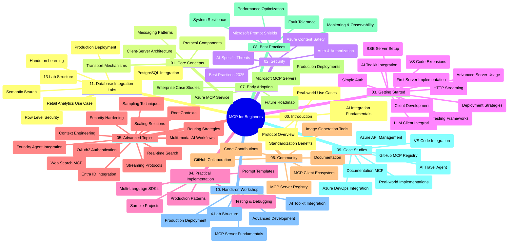

<!--
CO_OP_TRANSLATOR_METADATA:
{
  "original_hash": "af27b0acfae6caa134d9701453884df8",
  "translation_date": "2025-11-18T18:48:16+00:00",
  "source_file": "study_guide.md",
  "language_code": "pcm"
}
-->
# Model Context Protocol (MCP) for Beginners - Study Guide

Dis study guide dey give overview of di repository structure and content for di "Model Context Protocol (MCP) for Beginners" curriculum. Use dis guide to waka through di repository well and enjoy di resources wey dey.

## Repository Overview

Di Model Context Protocol (MCP) na one standard framework wey dey for how AI models and client applications go take interact. Anthropic na im first create MCP, but now di MCP community dey maintain am through di official GitHub organization. Dis repository get full curriculum wey dey include code examples for C#, Java, JavaScript, Python, and TypeScript, wey dem design for AI developers, system architects, and software engineers.

## Visual Curriculum Map

## Repository Structure

Di repository get eleven main sections, each one dey focus on different parts of MCP:

1. **Introduction (00-Introduction/)**
   - Overview of di Model Context Protocol
   - Why standardization dey important for AI pipelines
   - Practical use cases and benefits

2. **Core Concepts (01-CoreConcepts/)**
   - Client-server architecture
   - Key protocol components
   - Messaging patterns for MCP

3. **Security (02-Security/)**
   - Security wahala wey fit happen for MCP systems
   - Best ways to secure implementations
   - Authentication and authorization strategies
   - **Comprehensive Security Documentation**:
     - MCP Security Best Practices 2025
     - Azure Content Safety Implementation Guide
     - MCP Security Controls and Techniques
     - MCP Best Practices Quick Reference
   - **Key Security Topics**:
     - Prompt injection and tool poisoning attacks
     - Session hijacking and confused deputy problems
     - Token passthrough vulnerabilities
     - Too much permissions and access control
     - Supply chain security for AI components
     - Microsoft Prompt Shields integration

4. **Getting Started (03-GettingStarted/)**
   - How to set up environment and configure am
   - How to create basic MCP servers and clients
   - How to integrate am with existing applications
   - Includes sections for:
     - First server implementation
     - Client development
     - LLM client integration
     - VS Code integration
     - Server-Sent Events (SSE) server
     - Advanced server usage
     - HTTP streaming
     - AI Toolkit integration
     - Testing strategies
     - Deployment guidelines

5. **Practical Implementation (04-PracticalImplementation/)**
   - How to use SDKs for different programming languages
   - Debugging, testing, and validation techniques
   - How to create reusable prompt templates and workflows
   - Sample projects with implementation examples

6. **Advanced Topics (05-AdvancedTopics/)**
   - Context engineering techniques
   - Foundry agent integration
   - Multi-modal AI workflows 
   - OAuth2 authentication demos
   - Real-time search capabilities
   - Real-time streaming
   - Root contexts implementation
   - Routing strategies
   - Sampling techniques
   - Scaling approaches
   - Security considerations
   - Entra ID security integration
   - Web search integration

7. **Community Contributions (06-CommunityContributions/)**
   - How to contribute code and documentation
   - How to collaborate through GitHub
   - Community-driven enhancements and feedback
   - How to use different MCP clients (Claude Desktop, Cline, VSCode)
   - How to work with popular MCP servers including image generation

8. **Lessons from Early Adoption (07-LessonsfromEarlyAdoption/)**
   - Real-world implementations and success stories
   - How to build and deploy MCP-based solutions
   - Trends and future roadmap
   - **Microsoft MCP Servers Guide**: Full guide to 10 production-ready Microsoft MCP servers including:
     - Microsoft Learn Docs MCP Server
     - Azure MCP Server (15+ specialized connectors)
     - GitHub MCP Server
     - Azure DevOps MCP Server
     - MarkItDown MCP Server
     - SQL Server MCP Server
     - Playwright MCP Server
     - Dev Box MCP Server
     - Azure AI Foundry MCP Server
     - Microsoft 365 Agents Toolkit MCP Server

9. **Best Practices (08-BestPractices/)**
   - How to tune performance and optimize am
   - How to design fault-tolerant MCP systems
   - Testing and resilience strategies

10. **Case Studies (09-CaseStudy/)**
    - **Seven full case studies** wey dey show MCP versatility for different scenarios:
    - **Azure AI Travel Agents**: Multi-agent orchestration with Azure OpenAI and AI Search
    - **Azure DevOps Integration**: How to automate workflow processes with YouTube data updates
    - **Real-Time Documentation Retrieval**: Python console client with streaming HTTP
    - **Interactive Study Plan Generator**: Chainlit web app with conversational AI
    - **In-Editor Documentation**: VS Code integration with GitHub Copilot workflows
    - **Azure API Management**: Enterprise API integration with MCP server creation
    - **GitHub MCP Registry**: Ecosystem development and agentic integration platform
    - Implementation examples wey cover enterprise integration, developer productivity, and ecosystem development

11. **Hands-on Workshop (10-StreamliningAIWorkflowsBuildingAnMCPServerWithAIToolkit/)**
    - Full hands-on workshop wey combine MCP with AI Toolkit
    - How to build intelligent applications wey go connect AI models with real-world tools
    - Practical modules wey cover fundamentals, custom server development, and production deployment strategies
    - **Lab Structure**:
      - Lab 1: MCP Server Fundamentals
      - Lab 2: Advanced MCP Server Development
      - Lab 3: AI Toolkit Integration
      - Lab 4: Production Deployment and Scaling
    - Lab-based learning approach with step-by-step instructions

12. **MCP Server Database Integration Labs (11-MCPServerHandsOnLabs/)**
    - **Full 13-lab learning path** for how to build production-ready MCP servers with PostgreSQL integration
    - **Real-world retail analytics implementation** using di Zava Retail use case
    - **Enterprise-grade patterns** wey include Row Level Security (RLS), semantic search, and multi-tenant data access
    - **Complete Lab Structure**:
      - **Labs 00-03: Foundations** - Introduction, Architecture, Security, Environment Setup
      - **Labs 04-06: Building di MCP Server** - Database Design, MCP Server Implementation, Tool Development
      - **Labs 07-09: Advanced Features** - Semantic Search, Testing & Debugging, VS Code Integration
      - **Labs 10-12: Production & Best Practices** - Deployment, Monitoring, Optimization
    - **Technologies Covered**: FastMCP framework, PostgreSQL, Azure OpenAI, Azure Container Apps, Application Insights
    - **Learning Outcomes**: Production-ready MCP servers, database integration patterns, AI-powered analytics, enterprise security

## Additional Resources

Di repository get supporting resources:

- **Images folder**: E get diagrams and illustrations wey dem use for di curriculum
- **Translations**: Multi-language support with automated translations of documentation
- **Official MCP Resources**:
  - [MCP Documentation](https://modelcontextprotocol.io/)
  - [MCP Specification](https://spec.modelcontextprotocol.io/)
  - [MCP GitHub Repository](https://github.com/modelcontextprotocol)

## How to Use This Repository

1. **Sequential Learning**: Follow di chapters one by one (00 through 11) for structured learning.
2. **Language-Specific Focus**: If you dey interested for one programming language, check di samples directories for implementations wey match your language.
3. **Practical Implementation**: Start with di "Getting Started" section to set up your environment and create your first MCP server and client.
4. **Advanced Exploration**: When you don sabi di basics, enter di advanced topics to learn more.
5. **Community Engagement**: Join di MCP community through GitHub discussions and Discord channels to connect with experts and other developers.

## MCP Clients and Tools

Di curriculum dey cover different MCP clients and tools:

1. **Official Clients**:
   - Visual Studio Code 
   - MCP for Visual Studio Code
   - Claude Desktop
   - Claude for VSCode 
   - Claude API

2. **Community Clients**:
   - Cline (terminal-based)
   - Cursor (code editor)
   - ChatMCP
   - Windsurf

3. **MCP Management Tools**:
   - MCP CLI
   - MCP Manager
   - MCP Linker
   - MCP Router

## Popular MCP Servers

Di repository dey introduce different MCP servers, including:

1. **Official Microsoft MCP Servers**:
   - Microsoft Learn Docs MCP Server
   - Azure MCP Server (15+ specialized connectors)
   - GitHub MCP Server
   - Azure DevOps MCP Server
   - MarkItDown MCP Server
   - SQL Server MCP Server
   - Playwright MCP Server
   - Dev Box MCP Server
   - Azure AI Foundry MCP Server
   - Microsoft 365 Agents Toolkit MCP Server

2. **Official Reference Servers**:
   - Filesystem
   - Fetch
   - Memory
   - Sequential Thinking

3. **Image Generation**:
   - Azure OpenAI DALL-E 3
   - Stable Diffusion WebUI
   - Replicate

4. **Development Tools**:
   - Git MCP
   - Terminal Control
   - Code Assistant

5. **Specialized Servers**:
   - Salesforce
   - Microsoft Teams
   - Jira & Confluence

## Contributing

Dis repository dey welcome contributions from di community. Check di Community Contributions section for how to contribute well to di MCP ecosystem.

----

*Dis study guide na update wey dem do for October 6th, 2025, and e dey give overview of di repository as e be for dat time. Repository content fit change after dis date.*

---

<!-- CO-OP TRANSLATOR DISCLAIMER START -->
**Disclaimer**:  
Dis dokyument don use AI transleshion service [Co-op Translator](https://github.com/Azure/co-op-translator) do di transleshion. Even though we dey try make am accurate, abeg make you sabi say machine transleshion fit get mistake or no dey correct well. Di original dokyument wey dey for im native language na di one wey you go take as di correct source. For important informashon, e good make you use professional human transleshion. We no go fit take blame for any misunderstanding or wrong way you take understand di transleshion wey dis dokyument get.
<!-- CO-OP TRANSLATOR DISCLAIMER END -->