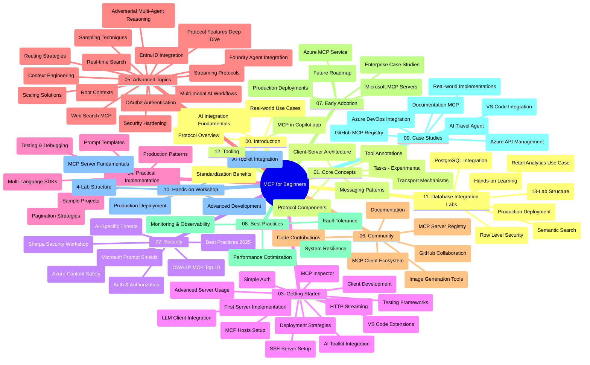

# Model Context Protocol (MCP) for Beginners - Study Guide

Dis study guide dey give overview of how di repository structure and content be for di "Model Context Protocol (MCP) for Beginners" curriculum. Use dis guide to waka inside di repository quick quick and make beta use of di resources wey dey.

## Repository Overview

Di Model Context Protocol (MCP) na one standardized framework wey dey mediate how AI models and client applications dey interact. E start from Anthropic dem, but now di whole MCP community dey run am through di official GitHub organization. Dis repository get one full curriculum plus hands-on code samples for C#, Java, JavaScript, Python, and TypeScript, wey dem design for AI developers, system architects, and software engineers.

## Visual Curriculum Map

```mermaid
mindmap
  root((MCP for Beginners))
    00. Introduction
      ::icon(fa fa-book)
      (Protocol Overview)
      (Standardization Benefits)
      (Real-world Use Cases)
      (AI Integration Fundamentals)
    01. Core Concepts
      ::icon(fa fa-puzzle-piece)
      (Client-Server Architecture)
      (Protocol Components)
      (Messaging Patterns)
      (Transport Mechanisms)
      (Tasks - Experimental)
      (Tool Annotations)
    02. Security
      ::icon(fa fa-shield)
      (AI-Specific Threats)
      (Best Practices 2025)
      (Azure Content Safety)
      (Auth & Authorization)
      (Microsoft Prompt Shields)
      (OWASP MCP Top 10)
      (Sherpa Security Workshop)
    03. Getting Started
      ::icon(fa fa-rocket)
      (First Server Implementation)
      (Client Development)
      (LLM Client Integration)
      (VS Code Extensions)
      (SSE Server Setup)
      (HTTP Streaming)
      (AI Toolkit Integration)
      (Testing Frameworks)
      (Advanced Server Usage)
      (Simple Auth)
      (Deployment Strategies)
      (MCP Hosts Setup)
      (MCP Inspector)
    04. Practical Implementation
      ::icon(fa fa-code)
      (Multi-Language SDKs)
      (Testing & Debugging)
      (Prompt Templates)
      (Sample Projects)
      (Production Patterns)
      (Pagination Strategies)
    05. Advanced Topics
      ::icon(fa fa-graduation-cap)
      (Context Engineering)
      (Foundry Agent Integration)
      (Multi-modal AI Workflows)
      (OAuth2 Authentication)
      (Real-time Search)
      (Streaming Protocols)
      (Root Contexts)
      (Routing Strategies)
      (Sampling Techniques)
      (Scaling Solutions)
      (Security Hardening)
      (Entra ID Integration)
      (Web Search MCP)
      (Protocol Features Deep Dive)
      (Adversarial Multi-Agent Reasoning)
      
    06. Community
      ::icon(fa fa-users)
      (Code Contributions)
      (Documentation)
      (MCP Client Ecosystem)
      (MCP Server Registry)
      (Image Generation Tools)
      (GitHub Collaboration)
    07. Early Adoption
      ::icon(fa fa-lightbulb)
      (Production Deployments)
      (Microsoft MCP Servers)
      (Azure MCP Service)
      (Enterprise Case Studies)
      (Future Roadmap)
    08. Best Practices
      ::icon(fa fa-check)
      (Performance Optimization)
      (Fault Tolerance)
      (System Resilience)
      (Monitoring & Observability)
    09. Case Studies
      ::icon(fa fa-file-text)
      (Azure API Management)
      (AI Travel Agent)
      (Azure DevOps Integration)
      (Documentation MCP)
      (GitHub MCP Registry)
      (VS Code Integration)
      (Real-world Implementations)
    10. Hands-on Workshop
      ::icon(fa fa-laptop)
      (MCP Server Fundamentals)
      (Advanced Development)
      (AI Toolkit Integration)
      (Production Deployment)
      (4-Lab Structure)
    11. Database Integration Labs
      ::icon(fa fa-database)
      (PostgreSQL Integration)
      (Retail Analytics Use Case)
      (Row Level Security)
      (Semantic Search)
      (Production Deployment)
      (13-Lab Structure)
      (Hands-on Learning)
    12. Tooling
      ::icon(fa fa-wrench)
      (MCP in Copilot app)
```

## Repository Structure

Di repository organize into twelve main sections, each one dey focus on different sides of MCP:

1. **Introduction (00-Introduction/)**
   - Overview of di Model Context Protocol
   - Why standardization dey important for AI pipelines
   - Wetin dem fit use am for plus di benefits

2. **Core Concepts (01-CoreConcepts/)**
   - Client-server architecture
   - Key protocol parts
   - Messaging styles inside MCP
   - Looking forward: [Wetyn dey Change for MCP: Di 2026-07-28 Release Candidate](./01-CoreConcepts/mcp-2026-07-28-release-candidate.md) — di stateless protocol core, Extensions framework, plus Roots/Sampling/Logging wey dem wan stop for di next specification version

3. **Security (02-Security/)**
   - Security wahala for MCP-based systems
   - Best ways to secure how you implement am
   - Authentication and authorization tactics
   - **Comprehensive Security Documentation**:
     - MCP Security Best Practices 2025
     - Azure Content Safety Implementation Guide
     - MCP Security Controls and Techniques
     - MCP Best Practices Quick Reference
   - **Main Security Matters**:
     - Prompt injection and tool poisoning attacks
     - Session hijack plus confused deputy palava
     - Token passthrough wahala
     - Too much permission and access control
     - Supply chain security for AI parts
     - Microsoft Prompt Shields join

4. **Getting Started (03-GettingStarted/)**
   - How to set up environment and configure am
   - How to create simple MCP servers and clients
   - How to join am with existing apps
   - E get sections for:
     - First server implementation
     - Client development
     - LLM client integration
     - VS Code join
     - Server-Sent Events (SSE) server
     - Advanced server use
     - HTTP streaming
     - AI Toolkit join
     - Testing strategies
     - Deployment directions

5. **Practical Implementation (04-PracticalImplementation/)**
   - How to use SDKs for different programming languages
   - Debug, test, and check things well well
   - How to design reusable prompt templates and workflows
   - Sample projects wey get implementation code

6. **Advanced Topics (05-AdvancedTopics/)**
   - Context engineering ways
   - Foundry agent join
   - Multi-modal AI workflows 
   - OAuth2 authentication demos
   - Real-time search abilities
   - Real-time streaming
   - Root contexts implementation
   - Routing methods
   - Sampling methods
   - Scaling strategies
   - Security considerations
   - Entra ID security join
   - Web search join
   - Adversarial multi-agent reasoning (debate patterns)

7. **Community Contributions (06-CommunityContributions/)**
   - How to contribute code and documentation
   - How to work together through GitHub
   - Community-driven improvements and feedback
   - How to use different MCP clients (Claude Desktop, Cline, VSCode)
   - How to work with popular MCP servers including image generators

8. **Lessons from Early Adoption (07-LessonsfromEarlyAdoption/)**
   - Real world implementations and success stories
   - How to build and deploy MCP-based solutions
   - Trends and future plans
   - **Microsoft MCP Servers Guide**: Complete guide to 10 production-ready Microsoft MCP servers like:
     - Microsoft Learn Docs MCP Server
     - Azure MCP Server (15+ special connectors)
     - GitHub MCP Server
     - Azure DevOps MCP Server
     - MarkItDown MCP Server
     - SQL Server MCP Server
     - Playwright MCP Server
     - Dev Box MCP Server
     - Microsoft Foundry MCP Server
     - Microsoft 365 Agents Toolkit MCP Server

9. **Best Practices (08-BestPractices/)**
   - How to tune and optimize performance
   - How to design MCP systems wey no go easily fail
   - Testing and resilience plans

10. **Case Studies (09-CaseStudy/)**
    - **Seven full case studies** showing how MCP fit e work for different cases:
    - **Azure AI Travel Agents**: Multi-agent coordination with Azure OpenAI and AI Search
    - **Azure DevOps Integration**: Automation for workflow with YouTube data updates
    - **Real-Time Documentation Retrieval**: Python console client with HTTP streaming
    - **Interactive Study Plan Generator**: Chainlit web app with conversational AI
    - **In-Editor Documentation**: VS Code join with GitHub Copilot workflows
    - **Azure API Management**: Enterprise API join plus MCP server creation
    - **GitHub MCP Registry**: Ecosystem development and agentic integration platform
    - Examples covering enterprise integration, developer productivity, and ecosystem building

11. **Hands-on Workshop (10-StreamliningAIWorkflowsBuildingAnMCPServerWithAIToolkit/)**
    - Detailed hands-on workshop mixing MCP with AI Toolkit
    - Building smart apps bridging AI models with real-world tools
    - Practical modules with basics, custom server development, and production deployment plans
    - **Lab Setup**:
      - Lab 1: MCP Server Basics
      - Lab 2: Advanced MCP Server Development
      - Lab 3: AI Toolkit Join
      - Lab 4: Production Deployment plus Scaling
    - Lab-based learning with step-by-step guide

12. **MCP Server Database Integration Labs (11-MCPServerHandsOnLabs/)**
    - **Complete 13-lab learning road** to build production-ready MCP servers with PostgreSQL joins
    - **Real world retail analytics implementation** using the Zava Retail use case
    - **Enterprise-grade patterns** like Row Level Security (RLS), semantic search, and multi-tenant data access
    - **Full Lab Setup**:
      - **Labs 00-03: Foundations** - Introduction, Architecture, Security, Environment Setup
      - **Labs 04-06: Building di MCP Server** - Database Design, MCP Server Implementation, Tool Development
      - **Labs 07-09: Advanced Features** - Semantic Search, Testing & Debugging, VS Code Join
      - **Labs 10-12: Production & Best Practices** - Deployment, Monitoring, Optimization
    - **Technologies Covered**: FastMCP framework, PostgreSQL, Azure OpenAI, Azure Container Apps, Application Insights
    - **Learning Results**: Production-ready MCP servers, database joining patterns, AI-backed analytics, enterprise security

13. **Tooling (12-tooling/)**
    - Learn how to use MCP inside Copilot app and other tools

## Additional Resources

Di repository get supporting resources:

- **Images folder**: Get diagrams and pictures wey dem use for all di curriculum
- **Translations**: Support multi-language plus automated documentation translations
- **Official MCP Resources**:
  - [MCP Documentation](https://modelcontextprotocol.io/)
  - [MCP Specification](https://spec.modelcontextprotocol.io/)
  - [MCP GitHub Repository](https://github.com/modelcontextprotocol)

## How to Use This Repository

1. **Step-by-step Learning**: Follow chapter by chapter (00 through 11) for proper learning experience.
2. **Language-Focused**: If you like one particular programming language, check di samples directories for how dem implement am there.
3. **Practical Start**: Begin with di "Getting Started" section to set up your environment and make your first MCP server and client.
4. **Advanced Learning**: After you sabi di basics, waka enter advanced topics to expand your understanding.
5. **Community Join**: Join the MCP community for GitHub discussions and Discord to meet experts and other developers.

## MCP Clients and Tools

Di curriculum cover different MCP clients and tools:

1. **Official Clients**:
   - Visual Studio Code 
   - MCP for Visual Studio Code
   - Claude Desktop
   - Claude for VSCode 
   - Claude API

2. **Community Clients**:
   - Cline (terminal-based)
   - Cursor (code editor)
   - ChatMCP
   - Windsurf

3. **MCP Management Tools**:
   - MCP CLI
   - MCP Manager
   - MCP Linker
   - MCP Router

## Popular MCP Servers

Di repository show different MCP servers, including:

1. **Official Microsoft MCP Servers**:
   - Microsoft Learn Docs MCP Server
   - Azure MCP Server (15+ special connectors)
   - GitHub MCP Server
   - Azure DevOps MCP Server
   - MarkItDown MCP Server
   - SQL Server MCP Server
   - Playwright MCP Server
   - Dev Box MCP Server
   - Microsoft Foundry MCP Server
   - Microsoft 365 Agents Toolkit MCP Server

2. **Official Reference Servers**:
   - Filesystem
   - Fetch
   - Memory
   - Sequential Thinking

3. **Image Generation**:
   - Azure OpenAI DALL-E 3
   - Stable Diffusion WebUI
   - Replicate

4. **Development Tools**:
   - Git MCP
   - Terminal Control
   - Code Assistant

5. **Specialized Servers**:
   - Salesforce
   - Microsoft Teams
   - Jira & Confluence

## Contributing

Dis repository dey welcome contributions from di community. Check di Community Contributions section to learn how you fit contribute well well for di MCP ecosystem.

----

*Dis study guide last update na February 5, 2026, based on the latest MCP Specification 2025-11-25 and e give overview of di repository as e be that time. Dem fit still update di repository content after dat date.*

*Addendum (July 2, 2026): wetin dem put about di `2026-07-28` MCP Specification Release Candidate dey under [01-CoreConcepts](./01-CoreConcepts/mcp-2026-07-28-release-candidate.md); di curriculum baseline still stay 2025-11-25 until new specification dey released.*

---

<!-- CO-OP TRANSLATOR DISCLAIMER START -->
**Disclaimer**:
Dis document don translate wit AI translation service [Co-op Translator](https://github.com/Azure/co-op-translator). Even tho we dey try make am correct, abeg make you know say automated translation fit get errors or mistakes. Di original document for dia own language na im be di correct source. For important info, make person wey sabi human translation do am. We no go responsible for any misunderstanding or wrong understanding wey fit happen because of dis translation.
<!-- CO-OP TRANSLATOR DISCLAIMER END -->