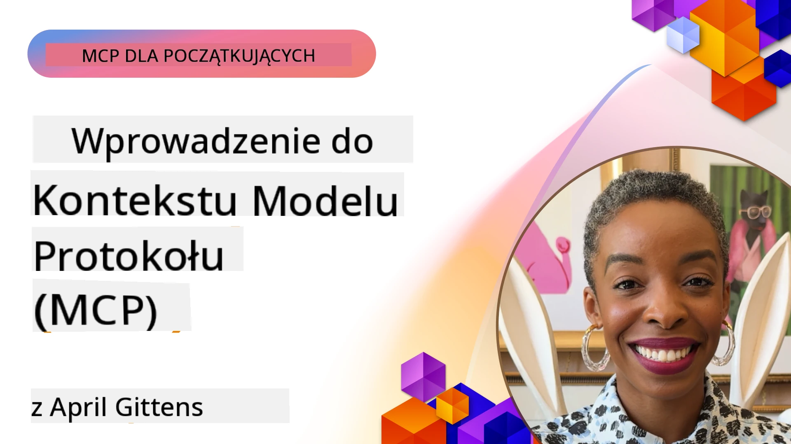
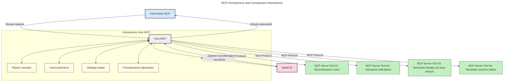
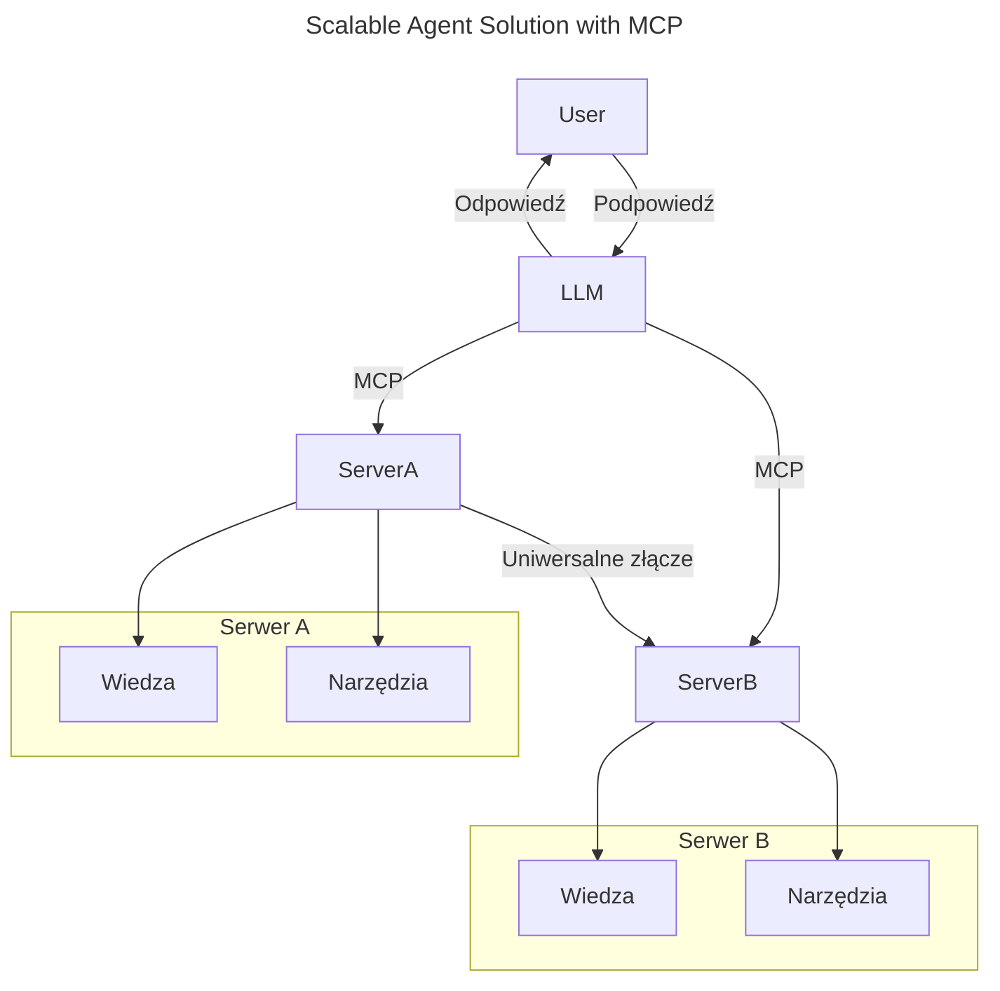
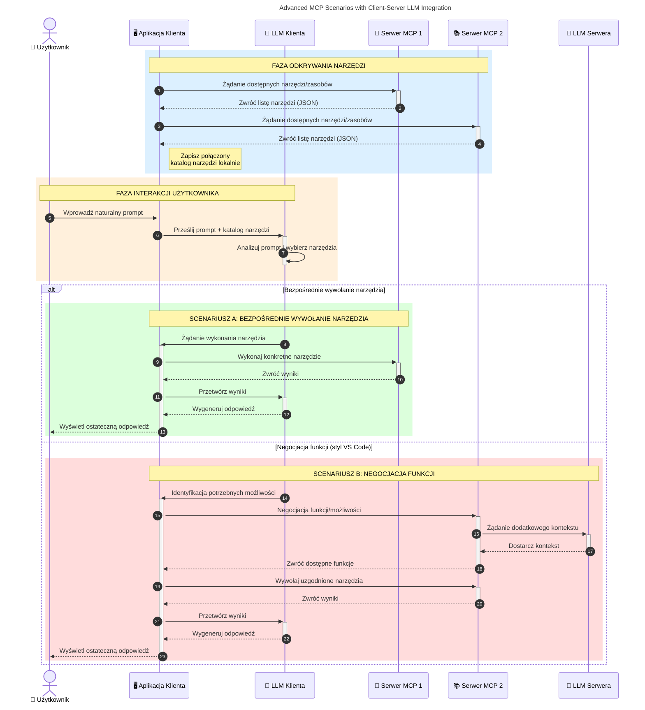

# Wprowadzenie do Model Context Protocol (MCP): Dlaczego jest ważny dla skalowalnych aplikacji AI

_(Kliknij powyższy obraz, aby obejrzeć wideo z tej lekcji)_

Aplikacje generatywnej sztucznej inteligencji to duży krok naprzód, ponieważ często pozwalają użytkownikowi na interakcję z aplikacją za pomocą naturalnych poleceń językowych. Jednak wraz z coraz większym zaangażowaniem czasu i zasobów w takie aplikacje, chcesz mieć pewność, że łatwo zintegrujesz funkcjonalności i zasoby w taki sposób, aby łatwo je rozszerzać, aby Twoja aplikacja mogła obsługiwać więcej niż jeden model oraz radzić sobie z różnymi zawiłościami modeli. W skrócie, budowanie aplikacji Gen AI jest łatwe na początku, ale w miarę ich rozwoju i wzrostu złożoności, musisz zacząć definiować architekturę i prawdopodobnie będziesz musiał polegać na standardzie, aby zapewnić spójność budowanych aplikacji. W tym właśnie pomaga MCP, porządkując wszystko i dostarczając standard.

---

## **🔍 Czym jest Model Context Protocol (MCP)?**

**Model Context Protocol (MCP)** to **otwarty, ustandaryzowany interfejs**, który umożliwia dużym modelom językowym (LLM) płynną integrację z zewnętrznymi narzędziami, API i źródłami danych. Zapewnia spójną architekturę do rozszerzania funkcjonalności modeli AI poza dane treningowe, pozwalając na tworzenie mądrzejszych, skalowalnych i bardziej responsywnych systemów AI.

---

## **🎯 Dlaczego standaryzacja w AI jest ważna**

W miarę jak aplikacje generatywnej AI stają się coraz bardziej złożone, ważne jest przyjęcie standardów zapewniających **skalowalność, rozszerzalność, łatwość utrzymania** oraz **unikanie uzależnienia od dostawcy**. MCP odpowiada na te potrzeby poprzez:

- Ujednolicenie integracji modeli z narzędziami
- Redukcję kruchego, niestandardowego kodu "na jedno użycie"
- Pozwolenie na współistnienie wielu modeli od różnych dostawców w jednym ekosystemie

**Uwaga:** Chociaż MCP nazywa się otwartym standardem, nie ma planów standaryzacji MCP przez żadne istniejące organizacje standaryzacyjne takie jak IEEE, IETF, W3C, ISO czy inne.

---

## **📚 Cele nauki**

Po przeczytaniu tego artykułu będziesz mógł:

- Zdefiniować **Model Context Protocol (MCP)** i jego przypadki użycia
- Zrozumieć, jak MCP standaryzuje komunikację model-narzędzie
- Zidentyfikować kluczowe komponenty architektury MCP
- Poznać zastosowania MCP w kontekstach korporacyjnych i deweloperskich

---

## **💡 Dlaczego Model Context Protocol (MCP) to przełom**

### **🔗 MCP rozwiązuje problem fragmentacji w interakcjach AI**

Przed MCP integracja modeli z narzędziami wymagała:

- Niestandardowego kodu dla każdej pary narzędzie-model
- Niestandardowych API dla każdego dostawcy
- Częstych przerw spowodowanych aktualizacjami
- Słabej skalowalności przy coraz większej liczbie narzędzi

### **✅ Korzyści ze standaryzacji MCP**

| **Korzyść**              | **Opis**                                                                |
|--------------------------|-------------------------------------------------------------------------|
| Interoperacyjność       | LLM współpracują bezproblemowo z narzędziami różnych dostawców         |
| Spójność                | Jednolity sposób działania na różnych platformach i narzędziach        |
| Wielokrotne użycie      | Narzędzia zbudowane raz mogą być wykorzystywane w różnych projektach    |
| Przyspieszenie rozwoju  | Skrócenie czasu deweloperskiego dzięki ustandaryzowanym interfejsom typu plug-and-play |

---

## **🧱 Przegląd architektury MCP na wysokim poziomie**

MCP opiera się na **modelu klient-serwer**, gdzie:

- **MCP Hosty** uruchamiają modele AI
- **MCP Klienci** inicjują żądania
- **MCP Serwery** dostarczają kontekst, narzędzia i możliwości

### **Kluczowe komponenty:**

- **Zasoby** – statyczne lub dynamiczne dane dla modeli  
- **Prompty** – zdefiniowane wcześniej workflow dla wspomaganego generowania  
- **Narzędzia** – wykonywalne funkcje typu wyszukiwanie, obliczenia  
- **Sampling** – zachowanie agentowe poprzez rekurencyjne interakcje (wycofane w
    MCP `2026-07-28`; nowe implementacje powinny integrować się bezpośrednio z dostawcą LLM)

- **Elicitation** – żądania inicjowane przez serwer do uzyskania danych od użytkownika
- **Roots** – lokalizacje systemu plików informacyjne związane z serwerem
    (wycofane w MCP `2026-07-28`; preferowane parametry narzędzia, URI zasobów lub
    konfiguracja serwera)

### **Architektura protokołu:**

MCP wykorzystuje dwuwarstwową architekturę:
- **Warstwa danych**: komunikaty JSON-RPC 2.0, metadane na żądanie, wykrywanie i prymitywy protokołu
- **Warstwa transportowa**: stdio dla lokalnych procesów podrzędnych oraz Streamable HTTP dla serwerów zdalnych. Streamable HTTP może korzystać z framowania SSE dla odpowiedzi strumieniowych, ale starszy transport HTTP+SSE jest wycofywany.

---

## Jak działają MCP Serwery

Serwery MCP pracują w następujący sposób:

- **Przepływ żądania**:
    1. Żądanie jest inicjowane przez użytkownika końcowego lub oprogramowanie działające w jego imieniu.
    2. **MCP Klient** wysyła żądanie do **MCP Hosta**, który zarządza środowiskiem uruchomieniowym modelu AI.
    3. **Model AI** otrzymuje prompt użytkownika i może zażądać dostępu do zewnętrznych narzędzi lub danych poprzez jedno lub więcej wywołań narzędzi.
    4. To **MCP Host**, a nie model bezpośrednio, komunikuje się ze stosownym **MCP Serwerem(-ami)** korzystając z ustandaryzowanego protokołu.
- **Funkcjonalność MCP Hosta**:
    - **Rejestr narzędzi**: utrzymuje katalog dostępnych narzędzi i ich możliwości.
    - **Uwierzytelnianie**: weryfikuje uprawnienia dostępu do narzędzi.
    - **Obsługa żądań**: przetwarza przychodzące prośby o narzędzia od modelu.
    - **Formatowanie odpowiedzi**: strukturyzuje wyjścia narzędzi w formacie zrozumiałym dla modelu.
- **Wykonanie MCP Serwera**:
    - **MCP Host** kieruje wywołania narzędzi do jednego lub więcej **MCP Serwerów**, z których każdy udostępnia specjalistyczne funkcje (np. wyszukiwanie, obliczenia, zapytania do baz danych).
    - **MCP Serwery** wykonują swoje operacje i zwracają wyniki do **MCP Hosta** w spójnym formacie.
    - **MCP Host** formatuje i przekazuje te wyniki do **Modelu AI**.
- **Zakończenie odpowiedzi**:
    - **Model AI** inkorporuje wyjścia narzędzi do końcowej odpowiedzi.
    - **MCP Host** przesyła tę odpowiedź z powrotem do **MCP Klienta**, który dostarcza ją użytkownikowi końcowemu lub wywołującemu oprogramowaniu.
    

## 👨‍💻 Jak zbudować MCP Serwer (z przykładami)

Serwery MCP pozwalają rozszerzać możliwości LLM poprzez dostarczanie danych i funkcjonalności.

Gotowy, by spróbować? Oto specjalistyczne SDK i przykłady tworzenia prostych serwerów MCP w różnych językach/stosach:

- **Python SDK**: https://github.com/modelcontextprotocol/python-sdk

- **TypeScript SDK**: https://github.com/modelcontextprotocol/typescript-sdk

- **Java SDK**: https://github.com/modelcontextprotocol/java-sdk

- **C#/.NET SDK**: https://github.com/modelcontextprotocol/csharp-sdk

## 🌍 Przykłady zastosowań MCP w rzeczywistym świecie

MCP umożliwia szeroki zakres aplikacji poprzez rozszerzanie możliwości AI:

| **Zastosowanie**              | **Opis**                                                                |
|------------------------------|-------------------------------------------------------------------------|
| Integracja danych korporacyjnych | Połączenie LLM z bazami danych, CRM lub narzędziami wewnętrznymi       |
| Systemy agentowe AI           | Umożliwienie autonomicznych agentów z dostępem do narzędzi i workflow decyzyjnych |
| Aplikacje multimodalne        | Łączenie narzędzi tekstowych, obrazowych i audio w jednej zunifikowanej aplikacji AI |
| Integracja danych w czasie rzeczywistym | Dostarczanie na żywo danych do interakcji AI dla dokładniejszych i aktualnych wyników |

### 🧠 MCP = Uniwersalny standard dla interakcji AI

Model Context Protocol (MCP) działa jako uniwersalny standard dla interakcji AI, podobnie jak USB-C ustandaryzował fizyczne połączenia urządzeń. W świecie AI MCP zapewnia spójny interfejs, pozwalający modelom (klientom) płynnie integrować się z zewnętrznymi narzędziami i dostawcami danych (serwerami). Eliminuje to potrzebę różnorodnych, niestandardowych protokołów dla każdego API czy źródła danych.

W ramach MCP narzędzie kompatybilne z MCP (nazywane serwerem MCP) podlega jednolitemu standardowi. Te serwery mogą wymieniać listę oferowanych narzędzi lub działań i wykonywać je na żądanie agenta AI. Platformy agentów AI obsługujące MCP są w stanie wykrywać dostępne narzędzia na serwerach i wywoływać je za pomocą tego standardowego protokołu.

### 💡 Ułatwia dostęp do wiedzy

Poza oferowaniem narzędzi, MCP ułatwia dostęp do wiedzy. Pozwala aplikacjom dostarczać kontekst dużym modelom językowym (LLM), łącząc je z różnymi źródłami danych. Na przykład serwer MCP może reprezentować firmowe repozytorium dokumentów, pozwalając agentom na pobieranie odpowiednich informacji na żądanie. Inny serwer może obsługiwać konkretne działania, jak wysyłanie maili czy aktualizowanie rekordów. Z perspektywy agenta to po prostu narzędzia, które może wykorzystać — niektóre narzędzia zwracają dane (kontekst wiedzy), inne wykonują czynności. MCP skutecznie zarządza obiema funkcjami.

Agent łączący się z serwerem MCP automatycznie poznaje dostępne możliwości i zasoby serwera dzięki standardowemu formatowi. Ta standaryzacja pozwala na dynamiczną dostępność narzędzi. Na przykład dodanie nowego serwera MCP do systemu agenta sprawia, że jego funkcje są od razu dostępne bez potrzeby dalszej personalizacji instrukcji agenta.

Ta uproszczona integracja odpowiada schematowi przedstawionemu na poniższym diagramie, gdzie serwery dostarczają zarówno narzędzia, jak i wiedzę, zapewniając płynną współpracę między systemami.

### 👉 Przykład: skalowalne rozwiązanie agenta

Uniwersalny łącznik pozwala serwerom MCP komunikować się i udostępniać między sobą możliwości, umożliwiając ServerA delegowanie zadań do ServerB lub dostęp do jego narzędzi i wiedzy. To federuje narzędzia i dane między serwerami, wspierając skalowalne i modułowe architektury agentów. Ponieważ MCP ustandaryzował eksponowanie narzędzi, agenci mogą dynamicznie wykrywać i kierować żądania między serwerami bez potrzeby hardkodowanych integracji.

Federacja narzędzi i wiedzy: narzędzia i dane mogą być dostępne na różnych serwerach, co umożliwia bardziej skalowalne i modułowe architektury agentów.

### 🔄 Zaawansowane scenariusze MCP z integracją LLM po stronie klienta

Poza podstawową architekturą MCP istnieją zaawansowane scenariusze, gdzie zarówno klient, jak i serwer zawierają LLM, umożliwiając bardziej zaawansowane interakcje. Na poniższym schemacie **Aplikacja Klienta** może być IDE z wieloma narzędziami MCP dostępnymi dla użytkownika przez LLM:

## 🔐 Praktyczne korzyści MCP

Oto praktyczne korzyści z używania MCP:

- **Aktualność**: Modele mogą uzyskać dostęp do najnowszych informacji poza danymi treningowymi
- **Rozszerzenie możliwości**: Modele mogą korzystać ze specjalistycznych narzędzi do zadań, do których nie były trenowane
- **Zmniejszenie halucynacji**: Zewnętrzne źródła danych zapewniają faktograficzne podstawy
- **Prywatność**: Wrażliwe dane mogą pozostać w bezpiecznych środowiskach zamiast być osadzone w promptach

## 📌 Najważniejsze wnioski

Oto kluczowe wnioski z używania MCP:

- **MCP** standaryzuje sposób interakcji modeli AI z narzędziami i danymi
- Promuje **rozszerzalność, spójność i interoperacyjność**
- MCP pomaga **skracać czas rozwoju, poprawiać niezawodność i rozszerzać możliwości modeli**
- Architektura klient-serwer **umożliwia elastyczne, rozszerzalne aplikacje AI**

## 🧠 Ćwiczenie

Pomyśl o aplikacji AI, którą chciałbyś zbudować.

- Jakie **zewnętrzne narzędzia lub dane** mogłyby zwiększyć jej możliwości?
- W jaki sposób MCP mógłby uczynić integrację **prostszą i bardziej niezawodną?**

## Dodatkowe zasoby

- [Repozytorium MCP na GitHub](https://github.com/modelcontextprotocol)

## Co dalej

Dalej: [Rozdział 1: Podstawowe pojęcia](../01-CoreConcepts/README.md)

---

<!-- CO-OP TRANSLATOR DISCLAIMER START -->
**Zastrzeżenie**:
Niniejszy dokument został przetłumaczony za pomocą usługi tłumaczenia AI [Co-op Translator](https://github.com/Azure/co-op-translator). Choć dążymy do dokładności, prosimy pamiętać, że automatyczne tłumaczenia mogą zawierać błędy lub niedokładności. Oryginalny dokument w jego języku źródłowym należy uznawać za autorytatywne źródło. W przypadku informacji krytycznych zalecane jest skorzystanie z profesjonalnego tłumaczenia wykonanego przez człowieka. Nie ponosimy odpowiedzialności za jakiekolwiek nieporozumienia lub błędne interpretacje wynikające z użycia tego tłumaczenia.
<!-- CO-OP TRANSLATOR DISCLAIMER END -->