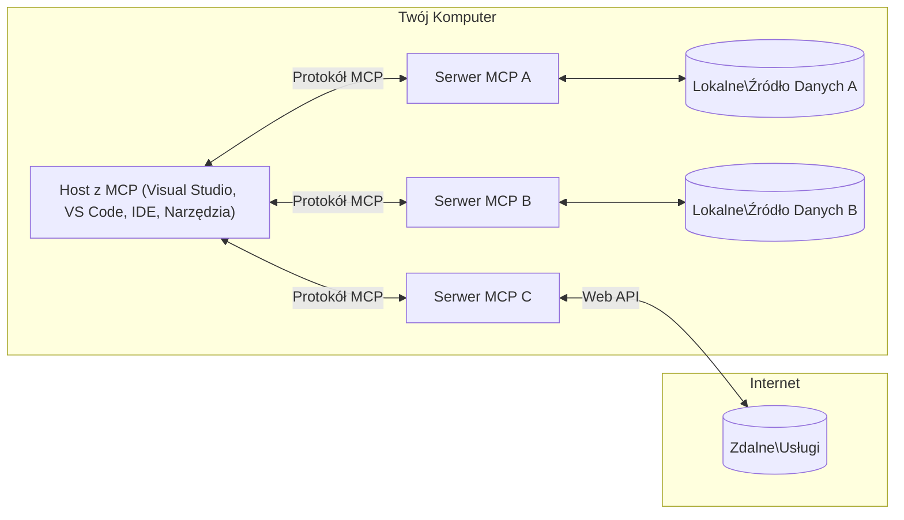

# Podstawowe koncepcje MCP: Opanowanie Model Context Protocol dla integracji AI

[](https://youtu.be/earDzWGtE84)

_(Kliknij powyższy obraz, aby obejrzeć wideo z tej lekcji)_

[Model Context Protocol (MCP)](https://github.com/modelcontextprotocol) to potężne, ustandaryzowane ramy optymalizujące komunikację między dużymi modelami językowymi (LLM) a zewnętrznymi narzędziami, aplikacjami i źródłami danych.  
Ten przewodnik przeprowadzi Cię przez podstawowe koncepcje MCP. Dowiesz się o jego architekturze klient-serwer, kluczowych komponentach, mechanice komunikacji oraz najlepszych praktykach implementacyjnych.

- **Wyraźna zgoda użytkownika**: Wszystkie operacje i dostęp do danych wymagają wyraźnej zgody użytkownika przed wykonaniem. Użytkownicy muszą jasno rozumieć, do jakich danych będzie dostęp i jakie działania zostaną wykonane, z granularną kontrolą nad uprawnieniami i autoryzacjami.

- **Ochrona prywatności danych**: Dane użytkownika są udostępniane tylko za wyraźną zgodą i muszą być chronione przez solidne mechanizmy kontroli dostępu przez cały cykl interakcji. Implementacje muszą zapobiegać nieautoryzowanemu przesyłaniu danych i utrzymywać ścisłe granice prywatności.

- **Bezpieczeństwo wykonywania narzędzi**: Każde wywołanie narzędzia wymaga wyraźnej zgody użytkownika z jasnym zrozumieniem funkcji narzędzia, parametrów i potencjalnego wpływu. Solidne granice bezpieczeństwa muszą zapobiegać niezamierzonemu, niebezpiecznemu lub złośliwemu wykonaniu narzędzi.

- **Bezpieczeństwo warstwy transportowej**: Wszystkie kanały komunikacji powinny używać odpowiednich mechanizmów szyfrowania i uwierzytelniania. Połączenia zdalne powinny implementować bezpieczne protokoły transportowe i właściwe zarządzanie poświadczeniami.

#### Wytyczne implementacyjne:

- **Zarządzanie uprawnieniami**: Implementuj systemy uprawnień o wysokiej granularności, które pozwalają użytkownikom kontrolować, do których serwerów, narzędzi i zasobów mają dostęp  
- **Uwierzytelnianie i autoryzacja**: Używaj bezpiecznych metod uwierzytelniania (OAuth, klucze API) z właściwym zarządzaniem tokenami i ich wygaśnięciem  
- **Walidacja danych wejściowych**: Waliduj wszystkie parametry i dane wejściowe zgodnie z określonymi schematami, aby zapobiec atakom typu injection  
- **Rejestrowanie audytu**: Prowadź kompleksowe logi wszystkich operacji dla monitoringu bezpieczeństwa i zgodności

## Przegląd

Ta lekcja bada fundamentalną architekturę i komponenty tworzące ekosystem Model Context Protocol (MCP). Dowiesz się o architekturze klient-serwer, kluczowych komponentach i mechanizmach komunikacji, które napędzają interakcje MCP.

## Kluczowe cele nauki

Pod koniec tej lekcji będziesz:

- Rozumieć architekturę klient-serwer MCP.  
- Identyfikować role i odpowiedzialności Hostów, Klientów i Serwerów.  
- Analizować kluczowe cechy, które czynią MCP elastyczną warstwą integracyjną.  
- Poznać przepływ informacji w ekosystemie MCP.  
- Zdobyć praktyczne wskazówki dzięki przykładom kodu w .NET, Java, Python i JavaScript.

## Architektura MCP: Głębsze spojrzenie

Ekosystem MCP opiera się na modelu klient-serwer. Ta modułowa struktura pozwala aplikacjom AI efektywnie współdziałać z narzędziami, bazami danych, API i zasobami kontekstowymi. Rozbijmy tę architekturę na jej podstawowe komponenty.

W swojej istocie MCP stosuje architekturę klient-serwer, gdzie aplikacja hostująca może łączyć się z wieloma serwerami:


- **Hosty MCP**: Programy takie jak VSCode, Claude Desktop, IDE lub narzędzia AI, które chcą uzyskać dostęp do danych przez MCP  
- **Klienci MCP**: Klienci protokołu utrzymujący połączenia 1:1 z serwerami  
- **Serwery MCP**: Lekkie programy, które udostępniają określone funkcje przez ustandaryzowany Model Context Protocol  
- **Lokalne źródła danych**: Pliki, bazy danych i usługi na Twoim komputerze, do których serwery MCP mają bezpieczny dostęp  
- **Zdalne usługi**: Zewnętrzne systemy dostępne przez internet, do których serwery MCP mogą łączyć się przez API.

Protokół MCP to rozwijany standard używający wersjonowania opartego na dacie (format RRRR-MM-DD). Obecna wersja protokołu to **2025-11-25**. Najnowsze aktualizacje specyfikacji znajdziesz w [specyfikacji protokołu](https://modelcontextprotocol.io/specification/2025-11-25/)

### 1. Hosty

W Model Context Protocol (MCP) **Hosty** to aplikacje AI, które służą jako główny interfejs, przez który użytkownicy wchodzą w interakcję z protokołem. Hosty koordynują i zarządzają połączeniami z wieloma serwerami MCP, tworząc dedykowanych klientów MCP dla każdego połączenia z serwerem. Przykłady Hostów to:

- **Aplikacje AI**: Claude Desktop, Visual Studio Code, Claude Code  
- **Środowiska programistyczne**: IDE i edytory kodu z integracją MCP  
- **Aplikacje niestandardowe**: Specjalnie zbudowane agenty AI i narzędzia

**Hosty** to aplikacje koordynujące interakcje z modelami AI. One:

- **Orkiestrują modele AI**: Wykonują lub współdziałają z LLM, aby generować odpowiedzi i koordynować przepływy pracy AI  
- **Zarządzają połączeniami klientów**: Tworzą i utrzymują jednego klienta MCP na każde połączenie z serwerem MCP  
- **Kontrolują interfejs użytkownika**: Zarządzają przebiegiem rozmowy, interakcjami użytkownika i prezentacją odpowiedzi  
- **Egzekwują bezpieczeństwo**: Kontrolują uprawnienia, ograniczenia bezpieczeństwa i uwierzytelnianie  
- **Obsługują zgodę użytkownika**: Zarządzają zatwierdzeniem użytkownika dla udostępniania danych i wykonywania narzędzi

### 2. Klienci

**Klienci** to kluczowe komponenty utrzymujące dedykowane połączenia jeden do jednego między Hostami a serwerami MCP. Każdy klient MCP jest tworzony przez Host, aby połączyć się z konkretnym serwerem MCP, zapewniając uporządkowane i bezpieczne kanały komunikacji. Wielu klientów umożliwia Hostom jednoczesne łączenie się z wieloma serwerami.

**Klienci** to komponenty łączące w aplikacji hosta. One:

- **Komunikacja protokołem**: Wysyłają żądania JSON-RPC 2.0 do serwerów z promptami i instrukcjami  
- **Negocjacja możliwości**: Negocjują obsługiwane funkcje i wersje protokołu z serwerami podczas inicjalizacji  
- **Wykonywanie narzędzi**: Zarządzają żądaniami wykonania narzędzi od modeli i przetwarzają odpowiedzi  
- **Aktualizacje w czasie rzeczywistym**: Obsługują powiadomienia i aktualizacje w czasie rzeczywistym od serwerów  
- **Przetwarzanie odpowiedzi**: Przetwarzają i formatują odpowiedzi serwera do wyświetlenia użytkownikom

### 3. Serwery

**Serwery** to programy dostarczające kontekst, narzędzia i możliwości klientom MCP. Mogą działać lokalnie (na tym samym komputerze co Host) lub zdalnie (na zewnętrznych platformach) i odpowiadają za obsługę żądań klientów oraz dostarczanie ustrukturyzowanych odpowiedzi. Serwery udostępniają określoną funkcjonalność przez ustandaryzowany Model Context Protocol.

**Serwery** to usługi dostarczające kontekst i możliwości. One:

- **Rejestracja funkcji**: Rejestrują i udostępniają dostępne prymitywy (zasoby, prompt, narzędzia) klientom  
- **Przetwarzanie żądań**: Odbierają i wykonują wywołania narzędzi, żądania zasobów i promptów od klientów  
- **Dostarczanie kontekstu**: Zapewniają informacje kontekstowe i dane wzbogacające odpowiedzi modelu  
- **Zarządzanie stanem**: Utrzymują stan sesji i obsługują interakcje stanowe, gdy jest to potrzebne  
- **Powiadomienia w czasie rzeczywistym**: Wysyłają powiadomienia o zmianach możliwości i aktualizacjach do podłączonych klientów

Serwery mogą być tworzone przez każdego, aby rozszerzyć możliwości modeli o specjalistyczną funkcjonalność, i wspierają zarówno scenariusze lokalne, jak i zdalne.

### 4. Prymitywy serwera

Serwery w Model Context Protocol (MCP) dostarczają trzy podstawowe **prymitywy**, które definiują fundamentalne elementy budujące bogate interakcje między klientami, hostami i modelami językowymi. Prymitywy te określają typy informacji kontekstowych i dostępnych działań przez protokół.

Serwery MCP mogą udostępniać dowolną kombinację następujących trzech podstawowych prymitywów:

#### Zasoby

**Zasoby** to źródła danych dostarczające informacje kontekstowe aplikacjom AI. Reprezentują statyczne lub dynamiczne treści, które mogą wzbogacić rozumienie modelu i podejmowanie decyzji:

- **Dane kontekstowe**: Ustrukturyzowane informacje i kontekst do wykorzystania przez model AI  
- **Bazy wiedzy**: Repozytoria dokumentów, artykuły, podręczniki i prace naukowe  
- **Lokalne źródła danych**: Pliki, bazy danych i informacje systemowe lokalne  
- **Dane zewnętrzne**: Odpowiedzi API, usługi sieciowe i dane z systemów zdalnych  
- **Treści dynamiczne**: Dane w czasie rzeczywistym aktualizowane na podstawie warunków zewnętrznych

Zasoby są identyfikowane przez URI i wspierają odkrywanie przez metody `resources/list` oraz pobieranie przez `resources/read`:

```text
file://documents/project-spec.md
database://production/users/schema
api://weather/current
```

#### Prompty

**Prompty** to wielokrotnego użytku szablony pomagające strukturyzować interakcje z modelami językowymi. Dostarczają ustandaryzowane wzorce interakcji i szablonowe przepływy pracy:

- **Interakcje oparte na szablonach**: Wstępnie ustrukturyzowane wiadomości i rozpoczęcia rozmów  
- **Szablony przepływów pracy**: Ustandaryzowane sekwencje dla typowych zadań i interakcji  
- **Przykłady few-shot**: Szablony oparte na przykładach do instrukcji modelu  
- **Prompty systemowe**: Podstawowe prompty definiujące zachowanie i kontekst modelu  
- **Szablony dynamiczne**: Parametryzowane prompty dostosowujące się do konkretnych kontekstów

Prompty wspierają podstawianie zmiennych i mogą być odkrywane przez `prompts/list` oraz pobierane przez `prompts/get`:

```markdown
Generate a {{task_type}} for {{product}} targeting {{audience}} with the following requirements: {{requirements}}
```

#### Narzędzia

**Narzędzia** to wykonywalne funkcje, które modele AI mogą wywoływać, aby wykonać określone działania. Reprezentują „czasowniki” ekosystemu MCP, umożliwiając modelom interakcję z zewnętrznymi systemami:

- **Funkcje wykonywalne**: Dyskretne operacje, które modele mogą wywołać z określonymi parametrami  
- **Integracja z systemami zewnętrznymi**: Wywołania API, zapytania do baz danych, operacje na plikach, obliczenia  
- **Unikalna tożsamość**: Każde narzędzie ma unikalną nazwę, opis i schemat parametrów  
- **Ustrukturyzowane I/O**: Narzędzia przyjmują zwalidowane parametry i zwracają ustrukturyzowane, typowane odpowiedzi  
- **Możliwości działania**: Umożliwiają modelom wykonywanie rzeczywistych działań i pobieranie danych na żywo

Narzędzia są definiowane za pomocą JSON Schema do walidacji parametrów i odkrywane przez `tools/list` oraz wywoływane przez `tools/call`:

```typescript
server.tool(
  "search_products", 
  {
    query: z.string().describe("Search query for products"),
    category: z.string().optional().describe("Product category filter"),
    max_results: z.number().default(10).describe("Maximum results to return")
  }, 
  async (params) => {
    // Wykonaj wyszukiwanie i zwróć uporządkowane wyniki
    return await productService.search(params);
  }
);
```

## Prymitywy klienta

W Model Context Protocol (MCP) **klienci** mogą udostępniać prymitywy, które pozwalają serwerom żądać dodatkowych możliwości od aplikacji hosta. Te prymitywy po stronie klienta umożliwiają bogatsze, bardziej interaktywne implementacje serwerów, które mogą uzyskiwać dostęp do możliwości modeli AI i interakcji użytkownika.

### Sampling

**Sampling** pozwala serwerom żądać uzupełnień modelu językowego z aplikacji AI klienta. Ten prymityw umożliwia serwerom dostęp do możliwości LLM bez osadzania własnych zależności modelu:

- **Dostęp niezależny od modelu**: Serwery mogą żądać uzupełnień bez dołączania SDK LLM lub zarządzania dostępem do modelu  
- **AI inicjowane przez serwer**: Umożliwia serwerom autonomiczne generowanie treści przy użyciu modelu AI klienta  
- **Rekurencyjne interakcje LLM**: Wspiera złożone scenariusze, gdzie serwery potrzebują pomocy AI do przetwarzania  
- **Dynamiczne generowanie treści**: Pozwala serwerom tworzyć kontekstowe odpowiedzi przy użyciu modelu hosta

Sampling jest inicjowany przez metodę `sampling/complete`, gdzie serwery wysyłają żądania uzupełnień do klientów.

### Elicitation

**Elicitation** umożliwia serwerom żądanie dodatkowych informacji lub potwierdzenia od użytkowników przez interfejs klienta:

- **Żądania danych od użytkownika**: Serwery mogą prosić o dodatkowe informacje, gdy są potrzebne do wykonania narzędzia  
- **Okna potwierdzeń**: Prośba o zgodę użytkownika na operacje wrażliwe lub o dużym wpływie  
- **Interaktywne przepływy pracy**: Umożliwiają serwerom tworzenie krok po kroku interakcji z użytkownikiem  
- **Dynamiczne zbieranie parametrów**: Zbieranie brakujących lub opcjonalnych parametrów podczas wykonywania narzędzia

Żądania elicitation są realizowane za pomocą metody `elicitation/request` w celu zebrania danych od użytkownika przez interfejs klienta.

### Logowanie

**Logowanie** pozwala serwerom wysyłać ustrukturyzowane komunikaty logów do klientów w celach debugowania, monitoringu i widoczności operacyjnej:

- **Wsparcie debugowania**: Umożliwia serwerom dostarczanie szczegółowych logów wykonania do rozwiązywania problemów  
- **Monitoring operacyjny**: Wysyłanie aktualizacji statusu i metryk wydajności do klientów  
- **Raportowanie błędów**: Dostarczanie szczegółowego kontekstu błędów i informacji diagnostycznych  
- **Ścieżki audytu**: Tworzenie kompleksowych logów operacji i decyzji serwera

Komunikaty logowania są wysyłane do klientów, aby zapewnić przejrzystość operacji serwera i ułatwić debugowanie.

## Przepływ informacji w MCP

Model Context Protocol (MCP) definiuje ustrukturyzowany przepływ informacji między hostami, klientami, serwerami i modelami. Zrozumienie tego przepływu pomaga wyjaśnić, jak przetwarzane są żądania użytkownika i jak zewnętrzne narzędzia oraz źródła danych są integrowane z odpowiedziami modelu.

- **Host inicjuje połączenie**  
  Aplikacja hostująca (np. IDE lub interfejs czatu) nawiązuje połączenie z serwerem MCP, zwykle przez STDIO, WebSocket lub inny obsługiwany transport.

- **Negocjacja możliwości**  
  Klient (osadzony w hoście) i serwer wymieniają informacje o obsługiwanych funkcjach, narzędziach, zasobach i wersjach protokołu. Zapewnia to, że obie strony rozumieją dostępne możliwości sesji.

- **Żądanie użytkownika**  
  Użytkownik wchodzi w interakcję z hostem (np. wpisuje prompt lub polecenie). Host zbiera to wejście i przekazuje je do klienta do przetworzenia.

- **Użycie zasobu lub narzędzia**  
  - Klient może żądać dodatkowego kontekstu lub zasobów od serwera (np. plików, wpisów w bazie danych lub artykułów z bazy wiedzy), aby wzbogacić rozumienie modelu.  
  - Jeśli model uzna, że potrzebne jest narzędzie (np. do pobrania danych, wykonania obliczenia lub wywołania API), klient wysyła żądanie wywołania narzędzia do serwera, określając nazwę narzędzia i parametry.

- **Wykonanie przez serwer**  
  Serwer odbiera żądanie zasobu lub narzędzia, wykonuje niezbędne operacje (np. uruchomienie funkcji, zapytanie do bazy danych lub pobranie pliku) i zwraca wyniki do klienta w ustrukturyzowanym formacie.

- **Generowanie odpowiedzi**  
  Klient integruje odpowiedzi serwera (dane zasobów, wyniki narzędzi itp.) w trwającą interakcję modelu. Model wykorzystuje te informacje do wygenerowania kompleksowej i kontekstowo odpowiedniej odpowiedzi.

- **Prezentacja wyniku**  
  Host otrzymuje ostateczny wynik od klienta i prezentuje go użytkownikowi, często zawierając zarówno wygenerowany tekst modelu, jak i wyniki wykonania narzędzi lub wyszukiwania zasobów.

Ten przepływ umożliwia MCP wspieranie zaawansowanych, interaktywnych i świadomych kontekstu aplikacji AI przez bezproblemowe łączenie modeli z zewnętrznymi narzędziami i źródłami danych.

## Architektura i warstwy protokołu

MCP składa się z dwóch odrębnych warstw architektonicznych, które współpracują, aby zapewnić kompletny framework komunikacyjny:

### Warstwa danych

**Warstwa danych** implementuje podstawowy protokół MCP, używając jako fundamentu **JSON-RPC 2.0**. Ta warstwa definiuje strukturę wiadomości, semantykę i wzorce interakcji:

#### Kluczowe komponenty:

- **Protokół JSON-RPC 2.0**: Cała komunikacja używa ustandaryzowanego formatu wiadomości JSON-RPC 2.0 dla wywołań metod, odpowiedzi i powiadomień
- **Zarządzanie cyklem życia**: Obsługuje inicjalizację połączenia, negocjację możliwości oraz zakończenie sesji między klientami a serwerami  
- **Prymitywy serwera**: Umożliwia serwerom dostarczanie podstawowej funkcjonalności poprzez narzędzia, zasoby i podpowiedzi  
- **Prymitwy klienta**: Umożliwia serwerom żądanie próbkowania z LLM, pozyskiwanie danych od użytkownika oraz wysyłanie komunikatów dziennika  
- **Powiadomienia w czasie rzeczywistym**: Wspiera asynchroniczne powiadomienia dla dynamicznych aktualizacji bez konieczności odpytywania  

#### Kluczowe funkcje:

- **Negocjacja wersji protokołu**: Używa wersjonowania opartego na dacie (RRRR-MM-DD) w celu zapewnienia kompatybilności  
- **Odkrywanie możliwości**: Klienci i serwery wymieniają informacje o obsługiwanych funkcjach podczas inicjalizacji  
- **Sesje stanowe**: Utrzymuje stan połączenia w trakcie wielu interakcji dla ciągłości kontekstu  

### Warstwa transportowa

**Warstwa transportowa** zarządza kanałami komunikacji, ramkowaniem wiadomości oraz uwierzytelnianiem między uczestnikami MCP:

#### Obsługiwane mechanizmy transportu:

1. **Transport STDIO**:  
   - Wykorzystuje standardowe strumienie wejścia/wyjścia do bezpośredniej komunikacji procesów  
   - Optymalny dla lokalnych procesów na tym samym komputerze bez narzutu sieciowego  
   - Powszechnie stosowany w lokalnych implementacjach serwera MCP  

2. **Transport HTTP strumieniowy**:  
   - Używa HTTP POST do wiadomości klient-serwer  
   - Opcjonalne Server-Sent Events (SSE) do strumieniowania serwer-klient  
   - Umożliwia komunikację zdalną przez sieci  
   - Wspiera standardowe uwierzytelnianie HTTP (tokeny bearer, klucze API, niestandardowe nagłówki)  
   - MCP zaleca OAuth dla bezpiecznego uwierzytelniania opartego na tokenach  

#### Abstrakcja transportu:

Warstwa transportowa abstrahuje szczegóły komunikacji od warstwy danych, umożliwiając ten sam format wiadomości JSON-RPC 2.0 we wszystkich mechanizmach transportu. Ta abstrakcja pozwala aplikacjom na płynne przełączanie się między serwerami lokalnymi i zdalnymi.

### Aspekty bezpieczeństwa

Implementacje MCP muszą przestrzegać kilku kluczowych zasad bezpieczeństwa, aby zapewnić bezpieczne, godne zaufania i chronione interakcje we wszystkich operacjach protokołu:

- **Zgoda i kontrola użytkownika**: Użytkownicy muszą wyrazić wyraźną zgodę przed dostępem do danych lub wykonaniem operacji. Powinni mieć jasną kontrolę nad tym, jakie dane są udostępniane i które działania są autoryzowane, wspieraną przez intuicyjne interfejsy do przeglądania i zatwierdzania aktywności.

- **Prywatność danych**: Dane użytkownika powinny być ujawniane tylko za wyraźną zgodą i muszą być chronione odpowiednimi mechanizmami kontroli dostępu. Implementacje MCP muszą zabezpieczać przed nieautoryzowanym przesyłaniem danych i zapewniać ochronę prywatności we wszystkich interakcjach.

- **Bezpieczeństwo narzędzi**: Przed wywołaniem jakiegokolwiek narzędzia wymagana jest wyraźna zgoda użytkownika. Użytkownicy powinni mieć jasne zrozumienie funkcji każdego narzędzia, a silne granice bezpieczeństwa muszą być egzekwowane, aby zapobiec niezamierzonemu lub niebezpiecznemu wykonaniu narzędzi.

Przestrzegając tych zasad bezpieczeństwa, MCP zapewnia zaufanie użytkowników, ochronę prywatności i bezpieczeństwo podczas wszystkich interakcji protokołu, jednocześnie umożliwiając potężne integracje AI.

## Przykłady kodu: Kluczowe komponenty

Poniżej znajdują się przykłady kodu w kilku popularnych językach programowania, które ilustrują, jak zaimplementować kluczowe komponenty serwera MCP i narzędzia.

### Przykład .NET: Tworzenie prostego serwera MCP z narzędziami

Oto praktyczny przykład kodu .NET pokazujący, jak zaimplementować prosty serwer MCP z niestandardowymi narzędziami. Przykład demonstruje, jak definiować i rejestrować narzędzia, obsługiwać żądania oraz łączyć serwer za pomocą Model Context Protocol.

```csharp
using System;
using System.Threading.Tasks;
using ModelContextProtocol.Server;
using ModelContextProtocol.Server.Transport;
using ModelContextProtocol.Server.Tools;

public class WeatherServer
{
    public static async Task Main(string[] args)
    {
        // Create an MCP server
        var server = new McpServer(
            name: "Weather MCP Server",
            version: "1.0.0"
        );
        
        // Register our custom weather tool
        server.AddTool<string, WeatherData>("weatherTool", 
            description: "Gets current weather for a location",
            execute: async (location) => {
                // Call weather API (simplified)
                var weatherData = await GetWeatherDataAsync(location);
                return weatherData;
            });
        
        // Connect the server using stdio transport
        var transport = new StdioServerTransport();
        await server.ConnectAsync(transport);
        
        Console.WriteLine("Weather MCP Server started");
        
        // Keep the server running until process is terminated
        await Task.Delay(-1);
    }
    
    private static async Task<WeatherData> GetWeatherDataAsync(string location)
    {
        // This would normally call a weather API
        // Simplified for demonstration
        await Task.Delay(100); // Simulate API call
        return new WeatherData { 
            Temperature = 72.5,
            Conditions = "Sunny",
            Location = location
        };
    }
}

public class WeatherData
{
    public double Temperature { get; set; }
    public string Conditions { get; set; }
    public string Location { get; set; }
}
```

### Przykład Java: Komponenty serwera MCP

Ten przykład demonstruje ten sam serwer MCP i rejestrację narzędzi co powyższy przykład .NET, ale zaimplementowany w Javie.

```java
import io.modelcontextprotocol.server.McpServer;
import io.modelcontextprotocol.server.McpToolDefinition;
import io.modelcontextprotocol.server.transport.StdioServerTransport;
import io.modelcontextprotocol.server.tool.ToolExecutionContext;
import io.modelcontextprotocol.server.tool.ToolResponse;

public class WeatherMcpServer {
    public static void main(String[] args) throws Exception {
        // Utwórz serwer MCP
        McpServer server = McpServer.builder()
            .name("Weather MCP Server")
            .version("1.0.0")
            .build();
            
        // Zarejestruj narzędzie pogodowe
        server.registerTool(McpToolDefinition.builder("weatherTool")
            .description("Gets current weather for a location")
            .parameter("location", String.class)
            .execute((ToolExecutionContext ctx) -> {
                String location = ctx.getParameter("location", String.class);
                
                // Pobierz dane pogodowe (uproszczone)
                WeatherData data = getWeatherData(location);
                
                // Zwróć sformatowaną odpowiedź
                return ToolResponse.content(
                    String.format("Temperature: %.1f°F, Conditions: %s, Location: %s", 
                    data.getTemperature(), 
                    data.getConditions(), 
                    data.getLocation())
                );
            })
            .build());
        
        // Połącz serwer używając transportu stdio
        try (StdioServerTransport transport = new StdioServerTransport()) {
            server.connect(transport);
            System.out.println("Weather MCP Server started");
            // Utrzymuj serwer w działaniu aż do zakończenia procesu
            Thread.currentThread().join();
        }
    }
    
    private static WeatherData getWeatherData(String location) {
        // Implementacja wywołałaby API pogodowe
        // Uproszczone dla celów przykładu
        return new WeatherData(72.5, "Sunny", location);
    }
}

class WeatherData {
    private double temperature;
    private String conditions;
    private String location;
    
    public WeatherData(double temperature, String conditions, String location) {
        this.temperature = temperature;
        this.conditions = conditions;
        this.location = location;
    }
    
    public double getTemperature() {
        return temperature;
    }
    
    public String getConditions() {
        return conditions;
    }
    
    public String getLocation() {
        return location;
    }
}
```

### Przykład Python: Budowanie serwera MCP

Ten przykład używa fastmcp, więc proszę upewnij się, że najpierw go zainstalujesz:

```python
pip install fastmcp
```
Przykład kodu:

```python
#!/usr/bin/env python3
import asyncio
from fastmcp import FastMCP
from fastmcp.transports.stdio import serve_stdio

# Utwórz serwer FastMCP
mcp = FastMCP(
    name="Weather MCP Server",
    version="1.0.0"
)

@mcp.tool()
def get_weather(location: str) -> dict:
    """Gets current weather for a location."""
    return {
        "temperature": 72.5,
        "conditions": "Sunny",
        "location": location
    }

# Alternatywne podejście z użyciem klasy
class WeatherTools:
    @mcp.tool()
    def forecast(self, location: str, days: int = 1) -> dict:
        """Gets weather forecast for a location for the specified number of days."""
        return {
            "location": location,
            "forecast": [
                {"day": i+1, "temperature": 70 + i, "conditions": "Partly Cloudy"}
                for i in range(days)
            ]
        }

# Zarejestruj narzędzia klasy
weather_tools = WeatherTools()

# Uruchom serwer
if __name__ == "__main__":
    asyncio.run(serve_stdio(mcp))
```

### Przykład JavaScript: Tworzenie serwera MCP

Ten przykład pokazuje tworzenie serwera MCP w JavaScript oraz jak zarejestrować dwa narzędzia związane z pogodą.

```javascript
// Używanie oficjalnego SDK Model Context Protocol
import { McpServer } from "@modelcontextprotocol/sdk/server/mcp.js";
import { StdioServerTransport } from "@modelcontextprotocol/sdk/server/stdio.js";
import { z } from "zod"; // Do walidacji parametrów

// Utwórz serwer MCP
const server = new McpServer({
  name: "Weather MCP Server",
  version: "1.0.0"
});

// Zdefiniuj narzędzie pogodowe
server.tool(
  "weatherTool",
  {
    location: z.string().describe("The location to get weather for")
  },
  async ({ location }) => {
    // Normalnie wywoływałoby API pogodowe
    // Uproszczone dla demonstracji
    const weatherData = await getWeatherData(location);
    
    return {
      content: [
        { 
          type: "text", 
          text: `Temperature: ${weatherData.temperature}°F, Conditions: ${weatherData.conditions}, Location: ${weatherData.location}` 
        }
      ]
    };
  }
);

// Zdefiniuj narzędzie prognozy
server.tool(
  "forecastTool",
  {
    location: z.string(),
    days: z.number().default(3).describe("Number of days for forecast")
  },
  async ({ location, days }) => {
    // Normalnie wywoływałoby API pogodowe
    // Uproszczone dla demonstracji
    const forecast = await getForecastData(location, days);
    
    return {
      content: [
        { 
          type: "text", 
          text: `${days}-day forecast for ${location}: ${JSON.stringify(forecast)}` 
        }
      ]
    };
  }
);

// Funkcje pomocnicze
async function getWeatherData(location) {
  // Symuluj wywołanie API
  return {
    temperature: 72.5,
    conditions: "Sunny",
    location: location
  };
}

async function getForecastData(location, days) {
  // Symuluj wywołanie API
  return Array.from({ length: days }, (_, i) => ({
    day: i + 1,
    temperature: 70 + Math.floor(Math.random() * 10),
    conditions: i % 2 === 0 ? "Sunny" : "Partly Cloudy"
  }));
}

// Połącz serwer używając transportu stdio
const transport = new StdioServerTransport();
server.connect(transport).catch(console.error);

console.log("Weather MCP Server started");
```

Ten przykład JavaScript demonstruje, jak stworzyć klienta MCP, który łączy się z serwerem, wysyła podpowiedź i przetwarza odpowiedź, w tym wszelkie wywołania narzędzi, które zostały wykonane.

## Bezpieczeństwo i autoryzacja

MCP zawiera kilka wbudowanych koncepcji i mechanizmów zarządzania bezpieczeństwem i autoryzacją w całym protokole:

1. **Kontrola uprawnień do narzędzi**:  
  Klienci mogą określić, które narzędzia model może używać podczas sesji. Zapewnia to dostęp tylko do wyraźnie autoryzowanych narzędzi, zmniejszając ryzyko niezamierzonych lub niebezpiecznych operacji. Uprawnienia mogą być konfigurowane dynamicznie na podstawie preferencji użytkownika, polityk organizacyjnych lub kontekstu interakcji.

2. **Uwierzytelnianie**:  
  Serwery mogą wymagać uwierzytelniania przed udzieleniem dostępu do narzędzi, zasobów lub operacji wrażliwych. Może to obejmować klucze API, tokeny OAuth lub inne schematy uwierzytelniania. Właściwe uwierzytelnianie zapewnia, że tylko zaufani klienci i użytkownicy mogą wywoływać funkcje serwera.

3. **Walidacja**:  
  Walidacja parametrów jest wymagana dla wszystkich wywołań narzędzi. Każde narzędzie definiuje oczekiwane typy, formaty i ograniczenia dla swoich parametrów, a serwer weryfikuje przychodzące żądania zgodnie z tymi zasadami. Zapobiega to przekazywaniu niepoprawnych lub złośliwych danych do implementacji narzędzi i pomaga utrzymać integralność operacji.

4. **Ograniczanie tempa (Rate Limiting)**:  
  Aby zapobiec nadużyciom i zapewnić sprawiedliwe wykorzystanie zasobów serwera, serwery MCP mogą wdrażać ograniczenia tempa wywołań narzędzi i dostępu do zasobów. Limity mogą być stosowane na użytkownika, sesję lub globalnie, chroniąc przed atakami typu denial-of-service lub nadmiernym zużyciem zasobów.

Łącząc te mechanizmy, MCP zapewnia bezpieczną podstawę do integracji modeli językowych z zewnętrznymi narzędziami i źródłami danych, jednocześnie dając użytkownikom i deweloperom precyzyjną kontrolę nad dostępem i użytkowaniem.

## Wiadomości protokołu i przepływ komunikacji

Komunikacja MCP wykorzystuje ustrukturyzowane wiadomości **JSON-RPC 2.0**, aby umożliwić jasne i niezawodne interakcje między hostami, klientami i serwerami. Protokół definiuje konkretne wzorce wiadomości dla różnych typów operacji:

### Podstawowe typy wiadomości:

#### **Wiadomości inicjalizacyjne**
- Żądanie **`initialize`**: Nawiązuje połączenie i negocjuje wersję protokołu oraz możliwości  
- Odpowiedź **`initialize`**: Potwierdza obsługiwane funkcje i informacje o serwerze  
- **`notifications/initialized`**: Sygnalizuje zakończenie inicjalizacji i gotowość sesji  

#### **Wiadomości odkrywania**
- Żądanie **`tools/list`**: Odkrywa dostępne narzędzia na serwerze  
- Żądanie **`resources/list`**: Wyświetla dostępne zasoby (źródła danych)  
- Żądanie **`prompts/list`**: Pobiera dostępne szablony podpowiedzi  

#### **Wiadomości wykonawcze**  
- Żądanie **`tools/call`**: Wykonuje określone narzędzie z podanymi parametrami  
- Żądanie **`resources/read`**: Pobiera zawartość z określonego zasobu  
- Żądanie **`prompts/get`**: Pobiera szablon podpowiedzi z opcjonalnymi parametrami  

#### **Wiadomości po stronie klienta**
- Żądanie **`sampling/complete`**: Serwer żąda uzupełnienia LLM od klienta  
- **`elicitation/request`**: Serwer żąda danych od użytkownika przez interfejs klienta  
- Wiadomości dziennika: Serwer wysyła ustrukturyzowane komunikaty dziennika do klienta  

#### **Wiadomości powiadomień**
- **`notifications/tools/list_changed`**: Serwer powiadamia klienta o zmianach w narzędziach  
- **`notifications/resources/list_changed`**: Serwer powiadamia klienta o zmianach w zasobach  
- **`notifications/prompts/list_changed`**: Serwer powiadamia klienta o zmianach w podpowiedziach  

### Struktura wiadomości:

Wszystkie wiadomości MCP stosują format JSON-RPC 2.0 z:  
- **Wiadomości żądania**: Zawierają `id`, `method` oraz opcjonalne `params`  
- **Wiadomości odpowiedzi**: Zawierają `id` oraz `result` lub `error`  
- **Wiadomości powiadomień**: Zawierają `method` oraz opcjonalne `params` (bez `id` i bez oczekiwanej odpowiedzi)  

Ta ustrukturyzowana komunikacja zapewnia niezawodne, śledzone i rozszerzalne interakcje wspierające zaawansowane scenariusze, takie jak aktualizacje w czasie rzeczywistym, łączenie narzędzi i solidne obsługiwanie błędów.

## Kluczowe wnioski

- **Architektura**: MCP używa architektury klient-serwer, gdzie hosty zarządzają wieloma połączeniami klientów do serwerów  
- **Uczestnicy**: Ekosystem obejmuje hosty (aplikacje AI), klientów (konektory protokołu) i serwery (dostawcy możliwości)  
- **Mechanizmy transportu**: Komunikacja wspiera STDIO (lokalny) oraz HTTP strumieniowy z opcjonalnym SSE (zdalny)  
- **Podstawowe prymitywy**: Serwery udostępniają narzędzia (funkcje wykonywalne), zasoby (źródła danych) i podpowiedzi (szablony)  
- **Prymitwy klienta**: Serwery mogą żądać próbkowania (uzupełnień LLM), pozyskiwania danych (elicitation) i logowania od klientów  
- **Podstawa protokołu**: Oparta na JSON-RPC 2.0 z wersjonowaniem opartym na dacie (aktualna: 2025-11-25)  
- **Możliwości w czasie rzeczywistym**: Wspiera powiadomienia dla dynamicznych aktualizacji i synchronizacji w czasie rzeczywistym  
- **Bezpieczeństwo na pierwszym miejscu**: Wyraźna zgoda użytkownika, ochrona prywatności danych i bezpieczny transport to podstawowe wymagania  

## Ćwiczenie

Zaprojektuj proste narzędzie MCP, które byłoby przydatne w twojej dziedzinie. Zdefiniuj:  
1. Jak będzie nazywać się narzędzie  
2. Jakie parametry będzie przyjmować  
3. Jakie dane wyjściowe będzie zwracać  
4. Jak model mógłby użyć tego narzędzia do rozwiązywania problemów użytkownika  

---

## Co dalej

Następny rozdział: [Rozdział 2: Bezpieczeństwo](../02-Security/README.md)

---

<!-- CO-OP TRANSLATOR DISCLAIMER START -->
**Zastrzeżenie**:  
Niniejszy dokument został przetłumaczony za pomocą usługi tłumaczenia AI [Co-op Translator](https://github.com/Azure/co-op-translator). Mimo że dokładamy starań, aby tłumaczenie było jak najbardziej precyzyjne, prosimy mieć na uwadze, że automatyczne tłumaczenia mogą zawierać błędy lub nieścisłości. Oryginalny dokument w języku źródłowym powinien być uznawany za źródło autorytatywne. W przypadku informacji krytycznych zalecane jest skorzystanie z profesjonalnego tłumaczenia wykonanego przez człowieka. Nie ponosimy odpowiedzialności za jakiekolwiek nieporozumienia lub błędne interpretacje wynikające z korzystania z tego tłumaczenia.
<!-- CO-OP TRANSLATOR DISCLAIMER END -->