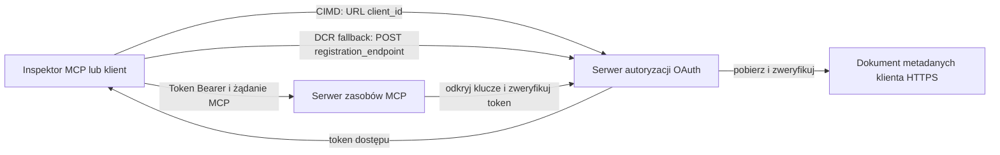

# Przykład autoryzacji CIMD i DCR

Ten przykład w TypeScript porównuje dwa sposoby, w jakie klient OAuth może uzyskać tożsamość
przed uzyskaniem dostępu do chronionego serwera MCP:

- **Dokumenty metadanych identyfikatora klienta (CIMD)** używają stabilnego adresu HTTPS jako
  `client_id`. Jest to preferowany mechanizm dla klientów i serwerów autoryzacji,
  które nie mają istniejącej relacji.
- **Dynamiczna rejestracja klienta (DCR)** prosi serwer autoryzacji o wygenerowanie
  nieprzezroczystego identyfikatora klienta w czasie wykonywania. MCP `2026-07-28` zachowuje DCR
  tylko dla zapewnienia kompatybilności wstecznej.

Przykład używa stabilnego SDK MCP w TypeScript v2 oraz bezstanowego
modelu żądania MCP `2026-07-28`. Działa z zewnętrznym serwerem autoryzacji OAuth 2.1/OpenID
Connect, takim jak Auth0. Serwer MCP jest serwerem zasobów:
weryfikuje tokeny dostępu, ale nie uwierzytelnia użytkowników ani nie wydaje
tokenów.

## Cele nauki

Po wykonaniu tego przykładu będziesz potrafił:

- Wyjaśnić, dlaczego CIMD jest preferowane nad DCR dla nowych klientów MCP.
- Opublikować poprawny dokument CIMD dla publicznego klienta natywnego.
- Skonfigurować serwer zasobów MCP do odkrywania OAuth i walidacji JWT.
- Przetestować CIMD i DCR z tym samym serwerem MCP i serwerem autoryzacji.
- Wymusić zakres OAuth w narzędziu MCP.
- Określić, które odpowiedzialności należą do klienta, serwera zasobów i
  serwera autoryzacji.

## Architektura



Serwer autoryzacji wybiera i weryfikuje mechanizm rejestracji.
Serwer MCP widzi tylko wynikowe zweryfikowane roszczenie `client_id`. Adres HTTPS
z określoną ścieżką identyfikuje CIMD. Nieprzezroczysty identyfikator nie jest wystarczający do potwierdzenia DCR, ponieważ
wstępnie zarejestrowany klient również może używać nieprzezroczystego identyfikatora; opcjonalne
ustawienie `DCR_CLIENT_ID_PREFIX` dostarcza specyficzny dla dostawcy wskazówkę demonstracyjną.

## Priorytet rejestracji

Klienci MCP, którzy obsługują każdy mechanizm, powinni używać następującej kolejności:

1. Używaj wcześniej zarejestrowanych informacji o kliencie, jeśli są już dostępne.
2. Używaj CIMD, gdy serwer autoryzacji zgłasza obsługę
   `client_id_metadata_document_supported: true`.
3. Używaj DCR tylko jako awaryjnego rozwiązania, gdy serwer udostępnia
   `registration_endpoint`.
4. Poproś użytkownika o wcześniej zarejestrowane informacje o kliencie, gdy żadna z powyższych opcji
   nie jest dostępna.

## Układ projektu

```text
src/
  config.ts          Environment validation
  dcr.ts             DCR compatibility request
  mcp.ts             MCP tools and scope checks
  oauth.ts           Authorization metadata and JWT verification
  register-dcr.ts    DCR command-line helper
  registration.ts    CIMD document and mechanism classification
  server.ts          Express, OAuth discovery, and MCP endpoint
test/
  dcr.test.ts
  oauth.test.ts
  registration.test.ts
  server.test.ts
```

## Wymagania wstępne

- Node.js w wersji 20.6 lub nowszej. Skrypty używają `--env-file` i `--import`.
- Serwer autoryzacji OAuth 2.1/OpenID Connect, który obsługuje:
  - Autoryzację kodem z użyciem S256 PKCE.
  - Metadane chronionych zasobów OAuth i wskaźniki zasobów.
  - Tokeny dostępu JWT i punkt końcowy JWKS.
  - CIMD oraz DCR, jeśli chcesz porównać starsze rozwiązanie awaryjne.
- Inspektor MCP lub inny klient MCP `2026-07-28`.
- Publiczny adres HTTPS dla dokumentu CIMD. Tunel developerski jest odpowiedni
  na potrzeby laboratorium; w środowisku produkcyjnym używaj stabilnej domeny.

## Instalacja i testy

```bash
npm install
npm run build
npm test
```

Dwanaście testów używa lokalnych kluczy i symulowanych punktów HTTP. Nie wymagają konta
serwera autoryzacji. Weryfikują:

- Kształt dokumentu CIMD i ograniczenia URL.
- Rzetelna klasyfikacja identyfikatorów URL i nieprzezroczystych.
- Obsługa żądań i odpowiedzi DCR.
- Odrzucenie niebezpiecznych punktów końcowych DCR nie-będących loopback.

- Walidacja podpisu JWT, wystawcy, odbiorcy, daty wygaśnięcia, identyfikatora klienta i zakresu.
- Wywołanie MCP `2026-07-28` w procesie do `registration-info`.

## Skonfiguruj Serwer Autoryzacji

Dokładne nazwy kontroli różnią się w zależności od dostawcy. Skonfiguruj te możliwości:

1. Utwórz serwer API lub zasobów, którego identyfikator dokładnie odpowiada Twojemu URL MCP
   włączając `/mcp`, na przykład `http://127.0.0.1:3001/mcp`.
2. Używaj tokenów dostępu RS256 i dołącz `client_id` lub `azp` claim.
3. Dodaj uprawnienie lub zakres `tool:greet`.
4. Włącz przepływ kodu autoryzacyjnego z S256 PKCE dla publicznych natywnych klientów.
5. Włącz Dokumenty Metadanych Identyfikatora Klienta.
6. Wyłącznie do porównania włącz Dynamiczną Rejestrację Klienta.
7. Upewnij się, że metadane serwera autoryzacji reklamują:
   - `issuer`
   - `authorization_endpoint`
   - `token_endpoint`
   - `jwks_uri`
   - `client_id_metadata_document_supported: true`
   - `registration_endpoint` gdy DCR jest włączony

### Przykład Auth0

Dla Auth0 włącz Rejestrację Dokumentu Metadanych Identyfikatora Klienta, Dynamiczną
Rejestrację Aplikacji OIDC oraz kompatybilność z Parametrem Zasobu. Utwórz API,
którego identyfikator jest dokładnym URL MCP i dodaj uprawnienie `tool:greet`.
Pozwól testowemu użytkownikowi i klientom zewnętrznym na żądanie tego uprawnienia.

Panele dostawców i dostępność funkcji zmieniają się z czasem. Sprawdź
dokumentację dostawcy przed użyciem tych ustawień poza tym laboratorium.

## Skonfiguruj Przykład

Utwórz `.env` na podstawie przykładu:

```powershell
Copy-Item .env.example .env
```

W powłokach zgodnych z bash:

```bash
cp .env.example .env
```

Ustaw te wartości:

```dotenv
MCP_SERVER_URL=http://127.0.0.1:3001/mcp
AUTHORIZATION_SERVER_ISSUER=https://your-tenant.example.com/
AUTHORIZATION_SERVER_METADATA_URL=https://your-tenant.example.com/.well-known/openid-configuration
CLIENT_METADATA_URL=https://your-public-host.example.com/client-metadata.json
OAUTH_REDIRECT_URIS=http://127.0.0.1:6274/oauth/callback
DCR_CLIENT_ID_PREFIX=tpc_
```

Ważne szczegóły:

- `AUTHORIZATION_SERVER_ISSUER` musi dokładnie odpowiadać `issuer` w odnalezionych
  metadanych serwera autoryzacji, włączając ewentualny ukośnik na końcu.
- `MCP_SERVER_URL` musi odpowiadać odbiorcy tokena dostępu.
- `CLIENT_METADATA_URL` musi używać HTTPS, zawierać ścieżkę niebędącą rootem i być
  publicznym URL, który obsługuje trasę metadanych. Ciągi zapytań i fragmenty są
  odrzucane, aby trasa i `client_id` pozostały identyczne.
- `OAUTH_REDIRECT_URIS` to lista dozwolonych wartości oddzielonych przecinkiem. Domyślnie jest to PCP
  pętla zwrotna Inspector.
- `DCR_CLIENT_ID_PREFIX` jest opcjonalne i specyficzne dla dostawcy. Pozostaw puste, jeśli
  Twój dostawca nie ma wiarygodnego prefiksu DCR.

## Opublikuj Dokument CIMD

Uruchom tunel przekierowujący publiczny HTTPS origin na `127.0.0.1:3001`.
Ustaw `CLIENT_METADATA_URL` na ten origin plus `/client-metadata.json`, następnie uruchom:

```bash
npm run build
npm start
```

Zweryfikuj oba dokumenty odkrywania:

```bash
curl http://127.0.0.1:3001/health
curl http://127.0.0.1:3001/client-metadata.json
curl http://127.0.0.1:3001/.well-known/oauth-protected-resource/mcp
```

Zwrócony `client_id` przez publiczny URL metadanych HTTPS musi być bajt w bajt
identyczny z tym URL. Serwer autoryzacji musi zweryfikować dokument i
jego URI przekierowania przed wydaniem tokena.

> [!NOTE]
> Przykład hostuje dokument klienta i serwer zasobów MCP w jednym procesie,
> aby utrzymać laboratorium małe. W produkcji klient MCP posiada i hostuje
> dokument CIMD niezależnie od serwera zasobów.

## Porównaj CIMD i DCR

Uruchom MCP Inspector:

```bash
npx @modelcontextprotocol/inspector
```

Użyj Streamable HTTP i połącz się z `http://127.0.0.1:3001/mcp`.


### CIMD (Preferowane)


1. Wprowadź publiczny `CLIENT_METADATA_URL` jako identyfikator klienta OAuth.
2. Zażądaj `tool:greet` oraz dowolnych zakresów tożsamości wymaganych przez Twojego dostawcę.
3. Zakończ logowanie i wyrażenie zgody.
4. Wywołaj `registration-info`. Zwraca `mechanism: "cimd"`.
5. Wywołaj `greet`, aby zweryfikować egzekwowanie zakresów.

### DCR (Tryb zgodności alternatywnej)

1. Wyczyść zapisany stan OAuth Inspektora.
2. Pozostaw identyfikator klienta OAuth pusty, aby Inspektor mógł użyć reklamowanego
   `registration_endpoint`.
3. Zakończ logowanie i wyrażenie zgody.
4. Wywołaj `registration-info`.
5. Jeśli `DCR_CLIENT_ID_PREFIX` pasuje do generowanych przez dostawcę identyfikatorów, narzędzie
   raportuje `mechanism: "dcr"`; w przeciwnym razie poprawnie raportuje
   `opaque-client-id`.

Możesz też bezpośrednio zademonstrować żądanie rejestracji:

```bash
npm run build
npm run register:dcr
```

Pomocnik wypisuje zwrócony identyfikator klienta, ale nigdy nie wypisuje sekretu klienta.
Traktuj każdy zwrócony sekret jako poufny i przechowuj go w odpowiednim magazynie sekretów.

## Narzędzia

| Narzędzie | Wymagany zakres | Cel |
| --- | --- | --- |
| `registration-info` | Zweryfikowany klient | Raportuje typ identyfikatora klienta |
| `greet` | `tool:greet` | Demonstruje autoryzację na poziomie narzędzia |

## Uwagi dotyczące bezpieczeństwa

- Weryfikuj podpisy JWT przez punkt końcowy JWKS serwera autoryzacji.
- Wymagaj dokładnego dopasowania wydawcy i odbiorcy.
- Wymagaj obecności pól expiration i client ID.
- Nigdy nie akceptuj tokena wydanego dla innego zasobu.
- Nigdy nie przesyłaj tokena MCP do dalszego API.
- Utrzymuj dane uwierzytelniające DCR związane z wydawcą, który je utworzył.
- Weryfikuj URI przekierowania CIMD z dokładnym dopasowaniem.
- Stosuj kontrole SSRF, gdy serwer autoryzacji pobiera adresy CIMD.
- Używaj HTTPS dla punktów końcowych autoryzacji i metadanych poza środowiskiem
  deweloperskim loopback.
- Nie wywnioskowuj DCR z nieprzezroczystego identyfikatora klienta, chyba że dostawca dokumentuje
  wiarygodną konwencję identyfikatorów.

## Odwołania

- [Specyfikacja autoryzacji MCP](https://modelcontextprotocol.io/specification/2026-07-28/basic/authorization)
- [Rejestracja klienta MCP](https://modelcontextprotocol.io/specification/2026-07-28/basic/authorization/client-registration)
- [Najlepsze praktyki bezpieczeństwa MCP](https://modelcontextprotocol.io/specification/2026-07-28/basic/security_best_practices)
- [Przewodnik autoryzacyjny MCP TypeScript SDK v2](https://ts.sdk.modelcontextprotocol.io/v2/serving/authorization)
- [OAuth Dynamic Client Registration (RFC 7591)](https://datatracker.ietf.org/doc/html/rfc7591)
- [Projekt dokumentu metadanych identyfikatora klienta OAuth](https://datatracker.ietf.org/doc/html/draft-ietf-oauth-client-id-metadata-document-00)

## Podziękowania

Podejście nauczania obok siebie zostało zainspirowane przez
[Sambego/auth0-xmcp-cimd](https://github.com/Sambego/auth0-xmcp-cimd). Ten
przykład to oryginalna, neutralna wobec dostawców implementacja stworzona z użyciem oficjalnego
MCP TypeScript SDK v2 dla tego kursu.

---

<!-- CO-OP TRANSLATOR DISCLAIMER START -->
**Zastrzeżenie**:
Niniejszy dokument został przetłumaczony za pomocą usługi tłumaczenia AI [Co-op Translator](https://github.com/Azure/co-op-translator). Choć dążymy do dokładności, prosimy pamiętać, że automatyczne tłumaczenia mogą zawierać błędy lub niedokładności. Oryginalny dokument w jego języku źródłowym należy uznawać za autorytatywne źródło. W przypadku informacji krytycznych zalecane jest skorzystanie z profesjonalnego tłumaczenia wykonanego przez człowieka. Nie ponosimy odpowiedzialności za jakiekolwiek nieporozumienia lub błędne interpretacje wynikające z użycia tego tłumaczenia.
<!-- CO-OP TRANSLATOR DISCLAIMER END -->