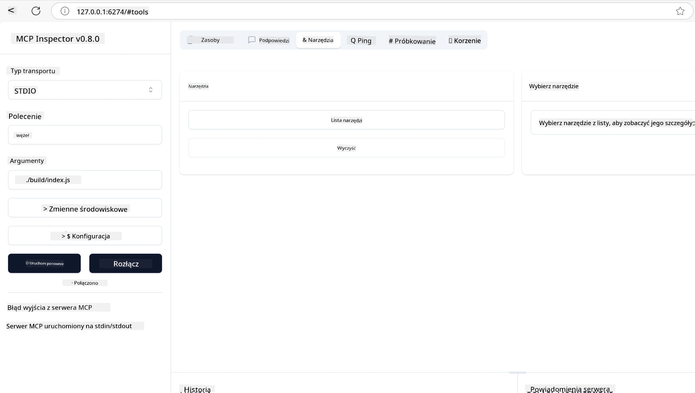
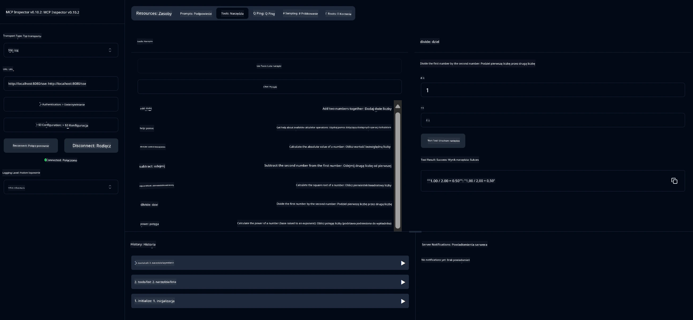
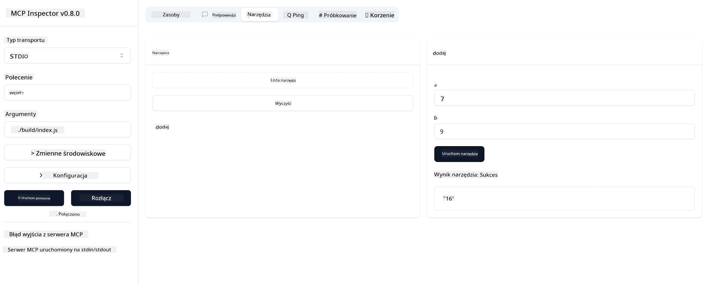

# Pierwsze kroki z MCP

> [!NOTE]
> Przykład HTTP w Javie w tej lekcji używa starszego transportu HTTP+SSE i
> jest przeznaczony dla SDK kompatybilnego z MCP `2025-11-25`. Dla nowych zdalnych serwerów używaj
> transportu Streamable HTTP `2026-07-28` i sprawdź wsparcie w swoim SDK.

Witaj w pierwszych krokach z Model Context Protocol (MCP)! Niezależnie od tego, czy jesteś nowy w MCP, czy chcesz pogłębić swoją wiedzę, ten przewodnik przeprowadzi Cię przez podstawową konfigurację i proces tworzenia. Dowiesz się, jak MCP umożliwia płynną integrację między modelami AI a aplikacjami oraz jak szybko przygotować środowisko do budowania i testowania rozwiązań opartych na MCP.

> W skrócie; jeśli tworzysz aplikacje AI, wiesz, że możesz dodać narzędzia i inne zasoby do swojego LLM (dużego modelu językowego), aby uczynić LLM bardziej wszechstronnym. Jednak jeśli umieścisz te narzędzia i zasoby na serwerze, aplikacja i możliwości serwera mogą być używane przez dowolnego klienta z LLM lub bez niego.

## Przegląd

Ta lekcja dostarcza praktyczne wskazówki dotyczące konfigurowania środowisk MCP oraz tworzenia pierwszych aplikacji MCP. Nauczysz się, jak ustawić niezbędne narzędzia i frameworki, budować podstawowe serwery MCP, tworzyć aplikacje hostujące oraz testować swoje implementacje.

Model Context Protocol (MCP) to otwarty protokół standaryzujący sposób, w jaki aplikacje dostarczają kontekst dla LLM. Można myśleć o MCP jak o porcie USB-C dla aplikacji AI – zapewnia on standardowy sposób łączenia modeli AI z różnymi źródłami danych i narzędziami.

## Cele nauczania

Po ukończeniu tej lekcji będziesz w stanie:

- Skonfigurować środowiska programistyczne dla MCP w C#, Javie, Pythonie, TypeScript i Rust
- Budować i wdrażać podstawowe serwery MCP z niestandardowymi funkcjami (zasoby, promptsy i narzędzia)
- Tworzyć aplikacje hostujące, które łączą się z serwerami MCP
- Testować i debugować implementacje MCP

## Konfiguracja środowiska MCP

Przed rozpoczęciem pracy z MCP ważne jest, aby przygotować swoje środowisko programistyczne i zrozumieć podstawowy przebieg pracy. Ta sekcja przeprowadzi Cię przez wstępne kroki konfiguracji, aby zapewnić płynny start z MCP.

### Wymagania wstępne

Przed rozpoczęciem programowania MCP upewnij się, że masz:

- **Środowisko programistyczne**: dla wybranego języka (C#, Java, Python, TypeScript lub Rust)
- **IDE/Edytor**: Visual Studio, Visual Studio Code, IntelliJ, Eclipse, PyCharm lub dowolny nowoczesny edytor kodu
- **Menadżery pakietów**: NuGet, Maven/Gradle, pip, npm/yarn lub Cargo
- **Klucze API**: dla wszystkich usług AI, które planujesz używać w swoich aplikacjach hostujących

## Podstawowa struktura serwera MCP

Serwer MCP zazwyczaj zawiera:

- **Konfigurację serwera**: ustawienia portu, uwierzytelnienia i inne
- **Zasoby**: dane i kontekst udostępniane LLM
- **Narzędzia**: funkcje wywoływane przez modele
- **Promptsy**: szablony do generowania lub strukturyzowania tekstu

Oto uproszczony przykład w TypeScript:

```typescript
import { McpServer, ResourceTemplate } from "@modelcontextprotocol/sdk/server/mcp.js";
import { StdioServerTransport } from "@modelcontextprotocol/sdk/server/stdio.js";
import { z } from "zod";

// Utwórz serwer MCP
const server = new McpServer({
  name: "Demo",
  version: "1.0.0"
});

// Dodaj narzędzie do dodawania
server.tool("add",
  { a: z.number(), b: z.number() },
  async ({ a, b }) => ({
    content: [{ type: "text", text: String(a + b) }]
  })
);

// Dodaj dynamiczne źródło powitania
server.resource(
  "file",
  // Parametr 'list' kontroluje, jak zasób wyświetla dostępne pliki. Ustawienie go na undefined wyłącza wyświetlanie listy dla tego zasobu.
  new ResourceTemplate("file://{path}", { list: undefined }),
  async (uri, { path }) => ({
    contents: [{
      uri: uri.href,
      text: `File, ${path}!`
    }]
  })
);

// Dodaj zasób pliku, który odczytuje zawartość pliku
server.resource(
  "file",
  new ResourceTemplate("file://{path}", { list: undefined }),
  async (uri, { path }) => {
    let text;
    try {
      text = await fs.readFile(path, "utf8");
    } catch (err) {
      text = `Error reading file: ${err.message}`;
    }
    return {
      contents: [{
        uri: uri.href,
        text
      }]
    };
  }
);

server.prompt(
  "review-code",
  { code: z.string() },
  ({ code }) => ({
    messages: [{
      role: "user",
      content: {
        type: "text",
        text: `Please review this code:\n\n${code}`
      }
    }]
  })
);

// Rozpocznij odbieranie wiadomości na stdin i wysyłanie wiadomości na stdout
const transport = new StdioServerTransport();
await server.connect(transport);
```

W powyższym kodzie:

- Importujemy niezbędne klasy z MCP TypeScript SDK.
- Tworzymy i konfigurujemy nową instancję serwera MCP.
- Rejestrujemy niestandardowe narzędzie (`calculator`) z funkcją obsługi.
- Uruchamiamy serwer, aby nasłuchiwał przychodzących żądań MCP.

## Testowanie i debugowanie

Przed rozpoczęciem testowania serwera MCP ważne jest, aby zrozumieć dostępne narzędzia i najlepsze praktyki debugowania. Skuteczne testowanie zapewnia, że serwer działa zgodnie z oczekiwaniami i pomaga szybko zidentyfikować oraz rozwiązać problemy. Poniższa sekcja opisuje zalecane metody walidacji implementacji MCP.

MCP dostarcza narzędzia, które pomagają testować i debugować serwery:

- **Narzędzie Inspector**, graficzny interfejs, który pozwala łączyć się z serwerem i testować narzędzia, promptsy i zasoby.
- **curl**, możesz też łączyć się z serwerem przy pomocy narzędzia wiersza poleceń, jak curl lub innych klientów potrafiących tworzyć i wykonywać polecenia HTTP.

### Korzystanie z MCP Inspector

[MCP Inspector](https://github.com/modelcontextprotocol/inspector) to wizualne narzędzie testowe, które pomaga:

1. **Odkrywać możliwości serwera**: Automatycznie wykrywa dostępne zasoby, narzędzia i promptsy
2. **Testować wykonanie narzędzi**: Próbować różnych parametrów i oglądać odpowiedzi na żywo
3. **Przeglądać metadane serwera**: Analizować informacje o serwerze, schematy i konfiguracje

```bash
# przykład TypeScript, instalacja i uruchamianie MCP Inspector
npx @modelcontextprotocol/inspector node build/index.js
```

Po uruchomieniu powyższych poleceń MCP Inspector otworzy lokalny interfejs webowy w przeglądarce. Możesz spodziewać się widoku pulpitu zarejestrowanych serwerów MCP, ich dostępnych narzędzi, zasobów i promptów. Interfejs pozwala interaktywnie testować wywołania narzędzi, przeglądać metadane serwera oraz obserwować odpowiedzi w czasie rzeczywistym, co ułatwia walidację i debugowanie implementacji MCP.

Oto zrzut ekranu jak może wyglądać:



## Typowe problemy z konfiguracją i rozwiązania

| Problem | Możliwe rozwiązanie |
|-------|-------------------|
| Połączenie odrzucone | Sprawdź czy serwer działa i czy port jest prawidłowy |
| Błędy wykonania narzędzi | Zweryfikuj poprawność parametrów i obsługę błędów |
| Problemy z uwierzytelnieniem | Sprawdź klucze API i uprawnienia |
| Błędy walidacji schematu | Upewnij się, że parametry odpowiadają zdefiniowanemu schematowi |
| Serwer się nie uruchamia | Sprawdź konflikty portów lub brakujące zależności |
| Błędy CORS | Skonfiguruj prawidłowe nagłówki CORS dla zapytań międzydomenowych |
| Problemy z uwierzytelnianiem | Zweryfikuj ważność tokenu i uprawnienia |

## Lokalny rozwój

Do lokalnego rozwijania i testowania możesz uruchamiać serwery MCP bezpośrednio na swoim komputerze:

1. **Uruchom proces serwera**: Odpal swoją aplikację serwera MCP
2. **Skonfiguruj sieć**: Upewnij się, że serwer jest dostępny na oczekiwanym porcie
3. **Podłącz klientów**: Używaj lokalnych adresów URL jak `http://localhost:3000`

```bash
# Przykład: Uruchamianie lokalnie serwera MCP w TypeScript
npm run start
# Serwer działa pod adresem http://localhost:3000
```

## Budujemy pierwszy serwer MCP

Omówiliśmy [Kluczowe pojęcia](../../01-CoreConcepts/README.md) w poprzedniej lekcji, teraz czas wdrożyć tę wiedzę w praktyce.

### Co serwer może robić

Zanim zaczniemy pisać kod, przypomnijmy sobie, co serwer może robić:

Serwer MCP może na przykład:

- Uzyskiwać dostęp do lokalnych plików i baz danych
- Łączyć się z zdalnymi API
- Wykonywać obliczenia
- Integracja z innymi narzędziami i usługami
- Udostępniać interfejs użytkownika do interakcji

Świetnie, skoro już wiemy, co możemy dla niego zrobić, zaczynajmy kodowanie.

## Ćwiczenie: Tworzenie serwera

Aby stworzyć serwer, wykonaj następujące kroki:

- Zainstaluj MCP SDK.
- Utwórz projekt i skonfiguruj jego strukturę.
- Napisz kod serwera.
- Przetestuj serwer.

### -1- Utwórz projekt

#### TypeScript

```sh
# Utwórz katalog projektu i zainicjuj projekt npm
mkdir calculator-server
cd calculator-server
npm init -y
```

#### Python

```sh
# Utwórz katalog projektu
mkdir calculator-server
cd calculator-server
# Otwórz folder w Visual Studio Code - Pomiń to, jeśli używasz innego IDE
code .
```

#### .NET

```sh
dotnet new console -n McpCalculatorServer
cd McpCalculatorServer
```

#### Java

Dla Javy utwórz projekt Spring Boot:

```bash
curl https://start.spring.io/starter.zip \
  -d dependencies=web \
  -d javaVersion=21 \
  -d type=maven-project \
  -d groupId=com.example \
  -d artifactId=calculator-server \
  -d name=McpServer \
  -d packageName=com.microsoft.mcp.sample.server \
  -o calculator-server.zip
```

Rozpakuj plik zip:

```bash
unzip calculator-server.zip -d calculator-server
cd calculator-server
# opcjonalnie usuń nieużywany test
rm -rf src/test/java
```

Dodaj następującą kompletną konfigurację do pliku *pom.xml*:

```xml
<?xml version="1.0" encoding="UTF-8"?>
<project xmlns="http://maven.apache.org/POM/4.0.0"
    xmlns:xsi="http://www.w3.org/2001/XMLSchema-instance"
    xsi:schemaLocation="http://maven.apache.org/POM/4.0.0 http://maven.apache.org/xsd/maven-4.0.0.xsd">
    <modelVersion>4.0.0</modelVersion>
    
    <!-- Spring Boot parent for dependency management -->
    <parent>
        <groupId>org.springframework.boot</groupId>
        <artifactId>spring-boot-starter-parent</artifactId>
        <version>3.5.0</version>
        <relativePath />
    </parent>

    <!-- Project coordinates -->
    <groupId>com.example</groupId>
    <artifactId>calculator-server</artifactId>
    <version>0.0.1-SNAPSHOT</version>
    <name>Calculator Server</name>
    <description>Basic calculator MCP service for beginners</description>

    <!-- Properties -->
    <properties>
        <java.version>21</java.version>
        <maven.compiler.source>21</maven.compiler.source>
        <maven.compiler.target>21</maven.compiler.target>
    </properties>

    <!-- Spring AI BOM for version management -->
    <dependencyManagement>
        <dependencies>
            <dependency>
                <groupId>org.springframework.ai</groupId>
                <artifactId>spring-ai-bom</artifactId>
                <version>1.0.0-SNAPSHOT</version>
                <type>pom</type>
                <scope>import</scope>
            </dependency>
        </dependencies>
    </dependencyManagement>

    <!-- Dependencies -->
    <dependencies>
        <dependency>
            <groupId>org.springframework.ai</groupId>
            <artifactId>spring-ai-starter-mcp-server-webflux</artifactId>
        </dependency>
        <dependency>
            <groupId>org.springframework.boot</groupId>
            <artifactId>spring-boot-starter-actuator</artifactId>
        </dependency>
        <dependency>
         <groupId>org.springframework.boot</groupId>
         <artifactId>spring-boot-starter-test</artifactId>
         <scope>test</scope>
      </dependency>
    </dependencies>

    <!-- Build configuration -->
    <build>
        <plugins>
            <plugin>
                <groupId>org.springframework.boot</groupId>
                <artifactId>spring-boot-maven-plugin</artifactId>
            </plugin>
            <plugin>
                <groupId>org.apache.maven.plugins</groupId>
                <artifactId>maven-compiler-plugin</artifactId>
                <configuration>
                    <release>21</release>
                </configuration>
            </plugin>
        </plugins>
    </build>

    <!-- Repositories for Spring AI snapshots -->
    <repositories>
        <repository>
            <id>spring-milestones</id>
            <name>Spring Milestones</name>
            <url>https://repo.spring.io/milestone</url>
            <snapshots>
                <enabled>false</enabled>
            </snapshots>
        </repository>
        <repository>
            <id>spring-snapshots</id>
            <name>Spring Snapshots</name>
            <url>https://repo.spring.io/snapshot</url>
            <releases>
                <enabled>false</enabled>
            </releases>
        </repository>
    </repositories>
</project>
```

#### Rust

```sh
mkdir calculator-server
cd calculator-server
cargo init
```

### -2- Dodaj zależności

Gdy projekt jest utworzony, dodajmy teraz zależności:

#### TypeScript

```sh
# Jeśli nie jest już zainstalowany, zainstaluj TypeScript globalnie
npm install typescript -g

# Zainstaluj SDK MCP oraz Zod do walidacji schematów
npm install @modelcontextprotocol/sdk zod
npm install -D @types/node typescript
```

#### Python

```sh
# Utwórz wirtualne środowisko i zainstaluj zależności
python -m venv venv
venv\Scripts\activate
pip install "mcp[cli]"
```

#### Java

```bash
cd calculator-server
./mvnw clean install -DskipTests
```

#### Rust

```sh
cargo add rmcp --features server,transport-io
cargo add serde
cargo add tokio --features rt-multi-thread
```

### -3- Utwórz pliki projektu

#### TypeScript

Otwórz plik *package.json* i zamień zawartość na poniższą, aby mieć pewność, że można zbudować i uruchomić serwer:

```json
{
  "name": "calculator-server",
  "version": "1.0.0",
  "main": "index.js",
  "type": "module",
  "scripts": {
    "build": "tsc",
    "start": "npm run build && node ./build/index.js",
  },
  "keywords": [],
  "author": "",
  "license": "ISC",
  "description": "A simple calculator server using Model Context Protocol",
  "dependencies": {
    "@modelcontextprotocol/sdk": "^1.16.0",
    "zod": "^3.25.76"
  },
  "devDependencies": {
    "@types/node": "^24.0.14",
    "typescript": "^5.8.3"
  }
}
```

Utwórz plik *tsconfig.json* z następującą zawartością:

```json
{
  "compilerOptions": {
    "target": "ES2022",
    "module": "Node16",
    "moduleResolution": "Node16",
    "outDir": "./build",
    "rootDir": "./src",
    "strict": true,
    "esModuleInterop": true,
    "skipLibCheck": true,
    "forceConsistentCasingInFileNames": true
  },
  "include": ["src/**/*"],
  "exclude": ["node_modules"]
}
```

Utwórz katalog na kod źródłowy:

```sh
mkdir src
touch src/index.ts
```

#### Python

Utwórz plik *server.py*

```sh
touch server.py
```

#### .NET

Zainstaluj wymagane pakiety NuGet:

```sh
dotnet add package ModelContextProtocol --prerelease
dotnet add package Microsoft.Extensions.Hosting
```

#### Java

W projektach Java Spring Boot struktura projektu jest tworzona automatycznie.

#### Rust

W Rust plik *src/main.rs* jest tworzony domyślnie po wywołaniu `cargo init`. Otwórz ten plik i usuń domyślny kod.

### -4- Napisz kod serwera

#### TypeScript

Utwórz plik *index.ts* i dodaj poniższy kod:

```typescript
import { McpServer, ResourceTemplate } from "@modelcontextprotocol/sdk/server/mcp.js";
import { StdioServerTransport } from "@modelcontextprotocol/sdk/server/stdio.js";
import { z } from "zod";
 
// Utwórz serwer MCP
const server = new McpServer({
  name: "Calculator MCP Server",
  version: "1.0.0"
});
```

Teraz masz serwer, ale niewiele robi, to naprawmy.

#### Python

```python
# server.py
from mcp.server.fastmcp import FastMCP

# Utwórz serwer MCP
mcp = FastMCP("Demo")
```

#### .NET

```csharp
using Microsoft.Extensions.DependencyInjection;
using Microsoft.Extensions.Hosting;
using Microsoft.Extensions.Logging;
using ModelContextProtocol.Server;
using System.ComponentModel;

var builder = Host.CreateApplicationBuilder(args);
builder.Logging.AddConsole(consoleLogOptions =>
{
    // Configure all logs to go to stderr
    consoleLogOptions.LogToStandardErrorThreshold = LogLevel.Trace;
});

builder.Services
    .AddMcpServer()
    .WithStdioServerTransport()
    .WithToolsFromAssembly();
await builder.Build().RunAsync();

// add features
```

#### Java

Dla Javy utwórz podstawowe komponenty serwera. Najpierw zmodyfikuj główną klasę aplikacji:

*src/main/java/com/microsoft/mcp/sample/server/McpServerApplication.java*:

```java
package com.microsoft.mcp.sample.server;

import org.springframework.ai.tool.ToolCallbackProvider;
import org.springframework.ai.tool.method.MethodToolCallbackProvider;
import org.springframework.boot.SpringApplication;
import org.springframework.boot.autoconfigure.SpringBootApplication;
import org.springframework.context.annotation.Bean;
import com.microsoft.mcp.sample.server.service.CalculatorService;

@SpringBootApplication
public class McpServerApplication {

    public static void main(String[] args) {
        SpringApplication.run(McpServerApplication.class, args);
    }
    
    @Bean
    public ToolCallbackProvider calculatorTools(CalculatorService calculator) {
        return MethodToolCallbackProvider.builder().toolObjects(calculator).build();
    }
}
```

Utwórz serwis kalkulatora *src/main/java/com/microsoft/mcp/sample/server/service/CalculatorService.java*:

```java
package com.microsoft.mcp.sample.server.service;

import org.springframework.ai.tool.annotation.Tool;
import org.springframework.stereotype.Service;

/**
 * Service for basic calculator operations.
 * This service provides simple calculator functionality through MCP.
 */
@Service
public class CalculatorService {

    /**
     * Add two numbers
     * @param a The first number
     * @param b The second number
     * @return The sum of the two numbers
     */
    @Tool(description = "Add two numbers together")
    public String add(double a, double b) {
        double result = a + b;
        return formatResult(a, "+", b, result);
    }

    /**
     * Subtract one number from another
     * @param a The number to subtract from
     * @param b The number to subtract
     * @return The result of the subtraction
     */
    @Tool(description = "Subtract the second number from the first number")
    public String subtract(double a, double b) {
        double result = a - b;
        return formatResult(a, "-", b, result);
    }

    /**
     * Multiply two numbers
     * @param a The first number
     * @param b The second number
     * @return The product of the two numbers
     */
    @Tool(description = "Multiply two numbers together")
    public String multiply(double a, double b) {
        double result = a * b;
        return formatResult(a, "*", b, result);
    }

    /**
     * Divide one number by another
     * @param a The numerator
     * @param b The denominator
     * @return The result of the division
     */
    @Tool(description = "Divide the first number by the second number")
    public String divide(double a, double b) {
        if (b == 0) {
            return "Error: Cannot divide by zero";
        }
        double result = a / b;
        return formatResult(a, "/", b, result);
    }

    /**
     * Calculate the power of a number
     * @param base The base number
     * @param exponent The exponent
     * @return The result of raising the base to the exponent
     */
    @Tool(description = "Calculate the power of a number (base raised to an exponent)")
    public String power(double base, double exponent) {
        double result = Math.pow(base, exponent);
        return formatResult(base, "^", exponent, result);
    }

    /**
     * Calculate the square root of a number
     * @param number The number to find the square root of
     * @return The square root of the number
     */
    @Tool(description = "Calculate the square root of a number")
    public String squareRoot(double number) {
        if (number < 0) {
            return "Error: Cannot calculate square root of a negative number";
        }
        double result = Math.sqrt(number);
        return String.format("√%.2f = %.2f", number, result);
    }

    /**
     * Calculate the modulus (remainder) of division
     * @param a The dividend
     * @param b The divisor
     * @return The remainder of the division
     */
    @Tool(description = "Calculate the remainder when one number is divided by another")
    public String modulus(double a, double b) {
        if (b == 0) {
            return "Error: Cannot divide by zero";
        }
        double result = a % b;
        return formatResult(a, "%", b, result);
    }

    /**
     * Calculate the absolute value of a number
     * @param number The number to find the absolute value of
     * @return The absolute value of the number
     */
    @Tool(description = "Calculate the absolute value of a number")
    public String absolute(double number) {
        double result = Math.abs(number);
        return String.format("|%.2f| = %.2f", number, result);
    }

    /**
     * Get help about available calculator operations
     * @return Information about available operations
     */
    @Tool(description = "Get help about available calculator operations")
    public String help() {
        return "Basic Calculator MCP Service\n\n" +
               "Available operations:\n" +
               "1. add(a, b) - Adds two numbers\n" +
               "2. subtract(a, b) - Subtracts the second number from the first\n" +
               "3. multiply(a, b) - Multiplies two numbers\n" +
               "4. divide(a, b) - Divides the first number by the second\n" +
               "5. power(base, exponent) - Raises a number to a power\n" +
               "6. squareRoot(number) - Calculates the square root\n" + 
               "7. modulus(a, b) - Calculates the remainder of division\n" +
               "8. absolute(number) - Calculates the absolute value\n\n" +
               "Example usage: add(5, 3) will return 5 + 3 = 8";
    }

    /**
     * Format the result of a calculation
     */
    private String formatResult(double a, String operator, double b, double result) {
        return String.format("%.2f %s %.2f = %.2f", a, operator, b, result);
    }
}
```

**Opcjonalne komponenty do usługi produkcyjnej:**

Utwórz konfigurację uruchomieniową *src/main/java/com/microsoft/mcp/sample/server/config/StartupConfig.java*:

```java
package com.microsoft.mcp.sample.server.config;

import org.springframework.boot.CommandLineRunner;
import org.springframework.context.annotation.Bean;
import org.springframework.context.annotation.Configuration;

@Configuration
public class StartupConfig {
    
    @Bean
    public CommandLineRunner startupInfo() {
        return args -> {
            System.out.println("\n" + "=".repeat(60));
            System.out.println("Calculator MCP Server is starting...");
            System.out.println("SSE endpoint: http://localhost:8080/sse");
            System.out.println("Health check: http://localhost:8080/actuator/health");
            System.out.println("=".repeat(60) + "\n");
        };
    }
}
```

Utwórz kontroler zdrowia *src/main/java/com/microsoft/mcp/sample/server/controller/HealthController.java*:

```java
package com.microsoft.mcp.sample.server.controller;

import org.springframework.http.ResponseEntity;
import org.springframework.web.bind.annotation.GetMapping;
import org.springframework.web.bind.annotation.RestController;
import java.time.LocalDateTime;
import java.util.HashMap;
import java.util.Map;

@RestController
public class HealthController {
    
    @GetMapping("/health")
    public ResponseEntity<Map<String, Object>> healthCheck() {
        Map<String, Object> response = new HashMap<>();
        response.put("status", "UP");
        response.put("timestamp", LocalDateTime.now().toString());
        response.put("service", "Calculator MCP Server");
        return ResponseEntity.ok(response);
    }
}
```

Utwórz obsługę wyjątków *src/main/java/com/microsoft/mcp/sample/server/exception/GlobalExceptionHandler.java*:

```java
package com.microsoft.mcp.sample.server.exception;

import org.springframework.http.HttpStatus;
import org.springframework.http.ResponseEntity;
import org.springframework.web.bind.annotation.ExceptionHandler;
import org.springframework.web.bind.annotation.RestControllerAdvice;

@RestControllerAdvice
public class GlobalExceptionHandler {

    @ExceptionHandler(IllegalArgumentException.class)
    public ResponseEntity<ErrorResponse> handleIllegalArgumentException(IllegalArgumentException ex) {
        ErrorResponse error = new ErrorResponse(
            "Invalid_Input", 
            "Invalid input parameter: " + ex.getMessage());
        return new ResponseEntity<>(error, HttpStatus.BAD_REQUEST);
    }

    public static class ErrorResponse {
        private String code;
        private String message;

        public ErrorResponse(String code, String message) {
            this.code = code;
            this.message = message;
        }

        // Gettery
        public String getCode() { return code; }
        public String getMessage() { return message; }
    }
}
```

Utwórz niestandardowy banner *src/main/resources/banner.txt*:

```text
_____      _            _       _             
 / ____|    | |          | |     | |            
| |     __ _| | ___ _   _| | __ _| |_ ___  _ __ 
| |    / _` | |/ __| | | | |/ _` | __/ _ \| '__|
| |___| (_| | | (__| |_| | | (_| | || (_) | |   
 \_____\__,_|_|\___|\__,_|_|\__,_|\__\___/|_|   
                                                
Calculator MCP Server v1.0
Spring Boot MCP Application
```

</details>

#### Rust

Dodaj następujący kod na górze pliku *src/main.rs*. Importuje on potrzebne biblioteki i moduły dla Twojego serwera MCP.

```rust
use rmcp::{
    handler::server::{router::tool::ToolRouter, tool::Parameters},
    model::{ServerCapabilities, ServerInfo},
    schemars, tool, tool_handler, tool_router,
    transport::stdio,
    ServerHandler, ServiceExt,
};
use std::error::Error;
```

Serwer kalkulatora będzie prosty i potrafi dodać dwie liczby. Stwórzmy strukturę reprezentującą zapytanie kalkulatora.

```rust
#[derive(Debug, serde::Deserialize, schemars::JsonSchema)]
pub struct CalculatorRequest {
    pub a: f64,
    pub b: f64,
}
```

Następnie utwórz strukturę reprezentującą serwer kalkulatora. Ta struktura będzie przechowywać router narzędzi, używany do rejestrowania narzędzi.

```rust
#[derive(Debug, Clone)]
pub struct Calculator {
    tool_router: ToolRouter<Self>,
}
```

Teraz możemy zaimplementować strukturę `Calculator`, aby stworzyć nową instancję serwera i zaimplementować obsługę serwera, która udostępni informacje o serwerze.

```rust
#[tool_router]
impl Calculator {
    pub fn new() -> Self {
        Self {
            tool_router: Self::tool_router(),
        }
    }
}

#[tool_handler]
impl ServerHandler for Calculator {
    fn get_info(&self) -> ServerInfo {
        ServerInfo {
            instructions: Some("A simple calculator tool".into()),
            capabilities: ServerCapabilities::builder().enable_tools().build(),
            ..Default::default()
        }
    }
}
```

Na koniec musimy zaimplementować funkcję main, która uruchomi serwer. Funkcja ta utworzy instancję struktury `Calculator` i udostępni ją przez standardowe wejście/wyjście.

```rust
#[tokio::main]
async fn main() -> Result<(), Box<dyn Error>> {
    let service = Calculator::new().serve(stdio()).await?;
    service.waiting().await?;
    Ok(())
}
```

Teraz serwer jest przygotowany do udostępniania podstawowych informacji o sobie. Następnie dodamy narzędzie do wykonywania dodawania.

### -5- Dodanie narzędzia i zasobu

Dodaj narzędzie i zasób, dodając następujący kod:

#### TypeScript

```typescript
server.tool(
  "add",
  { a: z.number(), b: z.number() },
  async ({ a, b }) => ({
    content: [{ type: "text", text: String(a + b) }]
  })
);

server.resource(
  "greeting",
  new ResourceTemplate("greeting://{name}", { list: undefined }),
  async (uri, { name }) => ({
    contents: [{
      uri: uri.href,
      text: `Hello, ${name}!`
    }]
  })
);
```

Twoje narzędzie przyjmuje parametry `a` i `b` i wykonuje funkcję, która zwraca odpowiedź w postaci:

```typescript
{
  contents: [{
    type: "text", content: "some content"
  }]
}
```

Twój zasób jest dostępny pod stringiem "greeting", przyjmuje parametr `name` i zwraca podobną odpowiedź jak narzędzie:

```typescript
{
  uri: "<href>",
  text: "a text"
}
```

#### Python

```python
# Dodaj narzędzie do dodawania
@mcp.tool()
def add(a: int, b: int) -> int:
    """Add two numbers"""
    return a + b


# Dodaj dynamiczne źródło powitania
@mcp.resource("greeting://{name}")
def get_greeting(name: str) -> str:
    """Get a personalized greeting"""
    return f"Hello, {name}!"
```

W powyższym kodzie:

- Zdefiniowaliśmy narzędzie `add`, które przyjmuje parametry `a` i `b`, oba całkowite.
- Utworzyliśmy zasób `greeting`, który przyjmuje parametr `name`.

#### .NET

Dodaj to do swojego pliku Program.cs:

```csharp
[McpServerToolType]
public static class CalculatorTool
{
    [McpServerTool, Description("Adds two numbers")]
    public static string Add(int a, int b) => $"Sum {a + b}";
}
```

#### Java

Narzędzia zostały już utworzone w poprzednim kroku.

#### Rust

Dodaj nowe narzędzie w bloku `impl Calculator`:

```rust
#[tool(description = "Adds a and b")]
async fn add(
    &self,
    Parameters(CalculatorRequest { a, b }): Parameters<CalculatorRequest>,
) -> String {
    (a + b).to_string()
}
```

### -6- Końcowy kod

Dodajmy ostatni potrzebny kod, aby serwer mógł się uruchomić:

#### TypeScript

```typescript
// Rozpocznij odbieranie wiadomości na stdin i wysyłanie wiadomości na stdout
const transport = new StdioServerTransport();
await server.connect(transport);
```

Oto pełny kod:

```typescript
// index.ts
import { McpServer, ResourceTemplate } from "@modelcontextprotocol/sdk/server/mcp.js";
import { StdioServerTransport } from "@modelcontextprotocol/sdk/server/stdio.js";
import { z } from "zod";

// Utwórz serwer MCP
const server = new McpServer({
  name: "Calculator MCP Server",
  version: "1.0.0"
});

// Dodaj narzędzie do dodawania
server.tool(
  "add",
  { a: z.number(), b: z.number() },
  async ({ a, b }) => ({
    content: [{ type: "text", text: String(a + b) }]
  })
);

// Dodaj dynamiczne zasoby powitalne
server.resource(
  "greeting",
  new ResourceTemplate("greeting://{name}", { list: undefined }),
  async (uri, { name }) => ({
    contents: [{
      uri: uri.href,
      text: `Hello, ${name}!`
    }]
  })
);

// Rozpocznij odbieranie wiadomości na stdin i wysyłanie wiadomości na stdout
const transport = new StdioServerTransport();
server.connect(transport);
```

#### Python

```python
# server.py
from mcp.server.fastmcp import FastMCP

# Utwórz serwer MCP
mcp = FastMCP("Demo")


# Dodaj narzędzie do dodawania
@mcp.tool()
def add(a: int, b: int) -> int:
    """Add two numbers"""
    return a + b


# Dodaj dynamiczny zasób powitania
@mcp.resource("greeting://{name}")
def get_greeting(name: str) -> str:
    """Get a personalized greeting"""
    return f"Hello, {name}!"

# Główny blok wykonawczy - jest wymagany do uruchomienia serwera
if __name__ == "__main__":
    mcp.run()
```

#### .NET

Utwórz plik Program.cs z następującą zawartością:

```csharp
using Microsoft.Extensions.DependencyInjection;
using Microsoft.Extensions.Hosting;
using Microsoft.Extensions.Logging;
using ModelContextProtocol.Server;
using System.ComponentModel;

var builder = Host.CreateApplicationBuilder(args);
builder.Logging.AddConsole(consoleLogOptions =>
{
    // Configure all logs to go to stderr
    consoleLogOptions.LogToStandardErrorThreshold = LogLevel.Trace;
});

builder.Services
    .AddMcpServer()
    .WithStdioServerTransport()
    .WithToolsFromAssembly();
await builder.Build().RunAsync();

[McpServerToolType]
public static class CalculatorTool
{
    [McpServerTool, Description("Adds two numbers")]
    public static string Add(int a, int b) => $"Sum {a + b}";
}
```

#### Java

Twoja kompletna główna klasa aplikacji powinna wyglądać tak:

```java
// McpServerApplication.java
package com.microsoft.mcp.sample.server;

import org.springframework.ai.tool.ToolCallbackProvider;
import org.springframework.ai.tool.method.MethodToolCallbackProvider;
import org.springframework.boot.SpringApplication;
import org.springframework.boot.autoconfigure.SpringBootApplication;
import org.springframework.context.annotation.Bean;
import com.microsoft.mcp.sample.server.service.CalculatorService;

@SpringBootApplication
public class McpServerApplication {

    public static void main(String[] args) {
        SpringApplication.run(McpServerApplication.class, args);
    }
    
    @Bean
    public ToolCallbackProvider calculatorTools(CalculatorService calculator) {
        return MethodToolCallbackProvider.builder().toolObjects(calculator).build();
    }
}
```

#### Rust

Końcowy kod serwera Rust powinien wyglądać tak:

```rust
use rmcp::{
    ServerHandler, ServiceExt,
    handler::server::{router::tool::ToolRouter, tool::Parameters},
    model::{ServerCapabilities, ServerInfo},
    schemars, tool, tool_handler, tool_router,
    transport::stdio,
};
use std::error::Error;

#[derive(Debug, serde::Deserialize, schemars::JsonSchema)]
pub struct CalculatorRequest {
    pub a: f64,
    pub b: f64,
}

#[derive(Debug, Clone)]
pub struct Calculator {
    tool_router: ToolRouter<Self>,
}

#[tool_router]
impl Calculator {
    pub fn new() -> Self {
        Self {
            tool_router: Self::tool_router(),
        }
    }
    
    #[tool(description = "Adds a and b")]
    async fn add(
        &self,
        Parameters(CalculatorRequest { a, b }): Parameters<CalculatorRequest>,
    ) -> String {
        (a + b).to_string()
    }
}

#[tool_handler]
impl ServerHandler for Calculator {
    fn get_info(&self) -> ServerInfo {
        ServerInfo {
            instructions: Some("A simple calculator tool".into()),
            capabilities: ServerCapabilities::builder().enable_tools().build(),
            ..Default::default()
        }
    }
}

#[tokio::main]
async fn main() -> Result<(), Box<dyn Error>> {
    let service = Calculator::new().serve(stdio()).await?;
    service.waiting().await?;
    Ok(())
}
```

### -7- Testowanie serwera

Uruchom serwer poniższym poleceniem:

#### TypeScript

```sh
npm run build
```

#### Python

```sh
mcp run server.py
```

> Aby używać MCP Inspector, użyj `mcp dev server.py`, które automatycznie uruchamia Inspector i zapewnia wymagany token sesji proxy. Jeśli używasz `mcp run server.py`, musisz ręcznie uruchomić Inspector i skonfigurować połączenie.

#### .NET

Upewnij się, że jesteś w katalogu projektu:

```sh
cd McpCalculatorServer
dotnet run
```

#### Java

```bash
./mvnw clean install -DskipTests
java -jar target/calculator-server-0.0.1-SNAPSHOT.jar
```

#### Rust

Uruchom poniższe polecenia, aby sformatować i uruchomić serwer:

```sh
cargo fmt
cargo run
```

### -8- Uruchamianie z użyciem inspectora

Inspector to świetne narzędzie, które może uruchomić Twój serwer i pozwoli Ci z nim interagować, aby sprawdzić, czy działa poprawnie. Uruchommy go:

> [!NOTE]
> może wyglądać inaczej w polu "command", ponieważ zawiera polecenie uruchomienia serwera z Twoim konkretnym środowiskiem wykonawczym/

#### TypeScript

```sh
npx @modelcontextprotocol/inspector node build/index.js
```

lub dodaj to do swojego *package.json* tak: `"inspector": "npx @modelcontextprotocol/inspector node build/index.js"` i uruchom `npm run inspector`

#### Python

Python opakowuje narzędzie Node.js zwane inspector. Można wywołać to narzędzie w następujący sposób:

```sh
mcp dev server.py
```


Jednak nie implementuje wszystkich metod dostępnych w narzędziu, więc zaleca się bezpośrednie uruchamianie narzędzia Node.js w sposób pokazany poniżej:

```sh
npx @modelcontextprotocol/inspector mcp run server.py
```

Jeśli korzystasz z narzędzia lub IDE, które pozwala skonfigurować polecenia i argumenty do uruchamiania skryptów, 
upewnij się, że w polu `Command` ustawiłeś `python`, a w `Arguments` `server.py`. Zapewni to poprawne uruchomienie skryptu.

#### .NET

Upewnij się, że jesteś w katalogu swojego projektu:

```sh
cd McpCalculatorServer
npx @modelcontextprotocol/inspector dotnet run
```

#### Java

Upewnij się, że serwer kalkulatora działa
Następnie uruchom inspektora:

```cmd
npx @modelcontextprotocol/inspector
```

W interfejsie internetowym inspektora:

1. Wybierz "SSE" jako typ transportu
2. Ustaw URL na: `http://localhost:8080/sse`
3. Kliknij "Connect"



**Jesteś teraz połączony z serwerem**
**Sekcja testowania serwera Java jest teraz ukończona**

Następna sekcja dotyczy interakcji z serwerem.

Powinieneś zobaczyć następujący interfejs użytkownika:


1. Połącz się z serwerem, klikając przycisk Connect
  Po połączeniu z serwerem powinieneś zobaczyć następujące:

  

1. Wybierz "Tools" i "listTools", powinno pojawić się "Add", wybierz "Add" i wypełnij wartości parametrów.

  Powinieneś zobaczyć następującą odpowiedź, tj. wynik działania narzędzia "add":

  

Gratulacje, udało Ci się stworzyć i uruchomić swój pierwszy serwer!

#### Rust

Aby uruchomić serwer Rust za pomocą MCP Inspector CLI, użyj następującego polecenia:

```sh
npx @modelcontextprotocol/inspector cargo run --cli --method tools/call --tool-name add --tool-arg a=1 b=2
```

### Oficjalne SDK

MCP udostępnia oficjalne SDK dla wielu języków:

- [C# SDK](https://github.com/modelcontextprotocol/csharp-sdk) - Utrzymywane we współpracy z Microsoft
- [Java SDK](https://github.com/modelcontextprotocol/java-sdk) - Utrzymywane we współpracy ze Spring AI
- [TypeScript SDK](https://github.com/modelcontextprotocol/typescript-sdk) - Oficjalna implementacja w TypeScript
- [Python SDK](https://github.com/modelcontextprotocol/python-sdk) - Oficjalna implementacja w Pythonie
- [Kotlin SDK](https://github.com/modelcontextprotocol/kotlin-sdk) - Oficjalna implementacja w Kotlinie
- [Swift SDK](https://github.com/modelcontextprotocol/swift-sdk) - Utrzymywane we współpracy z Loopwork AI
- [Rust SDK](https://github.com/modelcontextprotocol/rust-sdk) - Oficjalna implementacja w Rust

## Kluczowe wnioski

- Konfiguracja środowiska deweloperskiego MCP jest prosta dzięki językowo-specyficznym SDK
- Budowanie serwerów MCP wiąże się z tworzeniem i rejestrowaniem narzędzi z jasno określonymi schematami
- Testowanie i debugowanie są niezbędne dla niezawodnych implementacji MCP

## Przykłady

- [Java Calculator](../samples/java/calculator/README.md)
- [.NET Calculator](../../../../03-GettingStarted/samples/csharp)
- [JavaScript Calculator](../samples/javascript/README.md)
- [TypeScript Calculator](../samples/typescript/README.md)
- [Python Calculator](../../../../03-GettingStarted/samples/python)
- [Rust Calculator](../../../../03-GettingStarted/samples/rust)

## Zadanie

Stwórz prosty serwer MCP z narzędziem wybranym przez siebie:

1. Zaimplementuj narzędzie w wybranym przez siebie języku (.NET, Java, Python, TypeScript lub Rust).
2. Zdefiniuj parametry wejściowe i wartości zwrotne.
3. Uruchom narzędzie inspektora, aby upewnić się, że serwer działa zgodnie z oczekiwaniami.
4. Przetestuj implementację z różnymi danymi wejściowymi.

## Rozwiązanie

[Solution](./solution/README.md)

## Dodatkowe zasoby

- [Build Agents using Model Context Protocol on Azure](https://learn.microsoft.com/azure/developer/ai/intro-agents-mcp)
- [Remote MCP with Azure Container Apps (Node.js/TypeScript/JavaScript)](https://learn.microsoft.com/samples/azure-samples/mcp-container-ts/mcp-container-ts/)
- [.NET OpenAI MCP Agent](https://learn.microsoft.com/samples/azure-samples/openai-mcp-agent-dotnet/openai-mcp-agent-dotnet/)

## Co dalej

Dalej: [Getting Started with MCP Clients](../02-client/README.md)

---

<!-- CO-OP TRANSLATOR DISCLAIMER START -->
**Zastrzeżenie**:
Niniejszy dokument został przetłumaczony za pomocą usługi tłumaczenia AI [Co-op Translator](https://github.com/Azure/co-op-translator). Choć dążymy do dokładności, prosimy pamiętać, że automatyczne tłumaczenia mogą zawierać błędy lub niedokładności. Oryginalny dokument w jego języku źródłowym należy uznawać za autorytatywne źródło. W przypadku informacji krytycznych zalecane jest skorzystanie z profesjonalnego tłumaczenia wykonanego przez człowieka. Nie ponosimy odpowiedzialności za jakiekolwiek nieporozumienia lub błędne interpretacje wynikające z użycia tego tłumaczenia.
<!-- CO-OP TRANSLATOR DISCLAIMER END -->