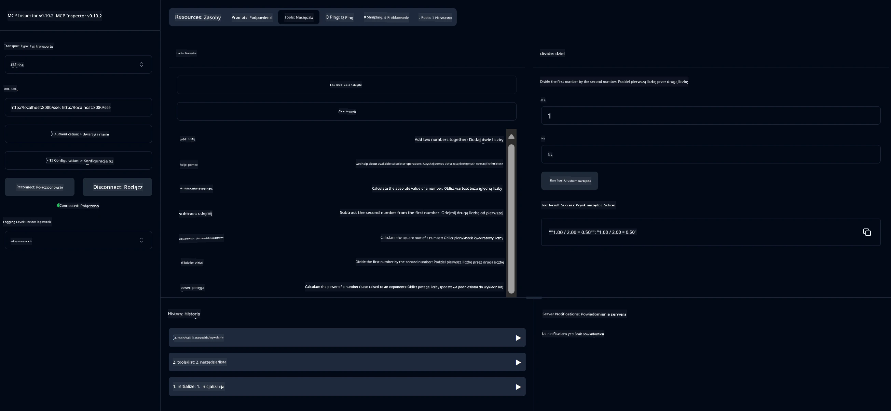

# Podstawowy Serwis Kalkulatora MCP

> [!NOTE]
> To rozwiązanie w Javie korzysta z legacy transportu HTTP+SSE i jest zgodne z SDK
> kompatybilnym z MCP `2025-11-25`. Jest utrzymane dla dopasowania kodu kursu;
> nowe zdalne serwery powinny korzystać z obsługi HTTP Streamable `2026-07-28`.

Ten serwis udostępnia podstawowe operacje kalkulatora za pomocą Model Context Protocol (MCP) używając Spring Boot z transportem WebFlux. Jest zaprojektowany jako prosty przykład dla początkujących uczących się implementacji MCP.

Aby uzyskać więcej informacji, zobacz dokumentację referencyjną [MCP Server Boot Starter](https://docs.spring.io/spring-ai/reference/api/mcp/mcp-server-boot-starter-docs.html).


## Korzystanie z serwisu

Serwis udostępnia następujące punkty końcowe API przez protokół MCP:

- `add(a, b)`: Dodaj dwie liczby
- `subtract(a, b)`: Odejmij drugą liczbę od pierwszej
- `multiply(a, b)`: Pomnóż dwie liczby
- `divide(a, b)`: Podziel pierwszą liczbę przez drugą (z kontrolą zerowania)
- `power(base, exponent)`: Oblicz potęgę liczby
- `squareRoot(number)`: Oblicz pierwiastek kwadratowy (z kontrolą liczb ujemnych)
- `modulus(a, b)`: Oblicz resztę z dzielenia
- `absolute(number)`: Oblicz wartość bezwzględną

## Zależności

Projekt wymaga następujących kluczowych zależności:

```xml
<dependency>
    <groupId>org.springframework.ai</groupId>
    <artifactId>spring-ai-starter-mcp-server-webflux</artifactId>
</dependency>
```

## Budowanie projektu

Zbuduj projekt za pomocą Maven:
```bash
./mvnw clean install -DskipTests
```

## Uruchamianie serwera

### Używając Javy

```bash
java -jar target/calculator-server-0.0.1-SNAPSHOT.jar
```

### Używając MCP Inspector

MCP Inspector to przydatne narzędzie do interakcji z serwisami MCP. Aby go użyć z tym serwisem kalkulatora:

1. **Zainstaluj i uruchom MCP Inspector** w nowym oknie terminala:
   ```bash
   npx @modelcontextprotocol/inspector
   ```

2. **Wejdź do interfejsu web** klikając URL podany przez aplikację (zazwyczaj http://localhost:6274)

3. **Skonfiguruj połączenie**:
   - Ustaw typ transportu na "SSE"
   - Ustaw URL na działający endpoint SSE serwera: `http://localhost:8080/sse`
   - Kliknij "Connect"

4. **Używaj narzędzi**:
   - Kliknij "List Tools", aby zobaczyć dostępne operacje kalkulatora
   - Wybierz narzędzie i kliknij "Run Tool", aby wykonać operację



---

<!-- CO-OP TRANSLATOR DISCLAIMER START -->
**Zastrzeżenie**:
Niniejszy dokument został przetłumaczony za pomocą usługi tłumaczenia AI [Co-op Translator](https://github.com/Azure/co-op-translator). Choć dążymy do dokładności, prosimy pamiętać, że automatyczne tłumaczenia mogą zawierać błędy lub niedokładności. Oryginalny dokument w jego języku źródłowym należy uznawać za autorytatywne źródło. W przypadku informacji krytycznych zalecane jest skorzystanie z profesjonalnego tłumaczenia wykonanego przez człowieka. Nie ponosimy odpowiedzialności za jakiekolwiek nieporozumienia lub błędne interpretacje wynikające z użycia tego tłumaczenia.
<!-- CO-OP TRANSLATOR DISCLAIMER END -->