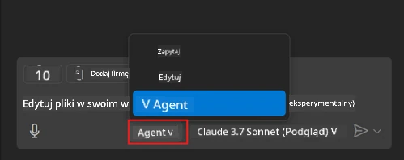
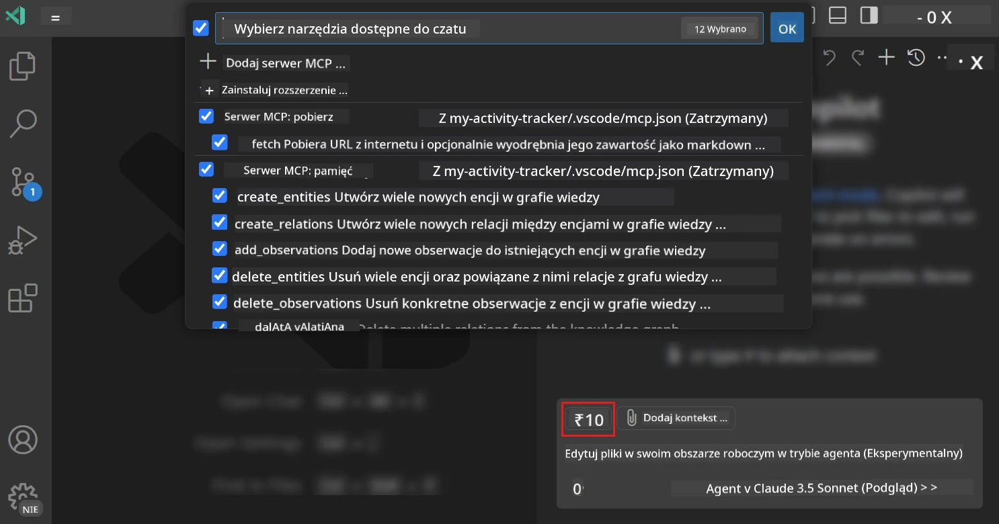
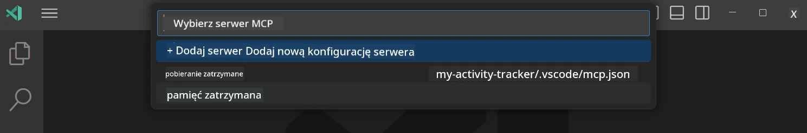
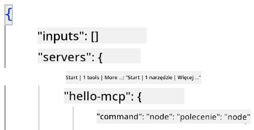
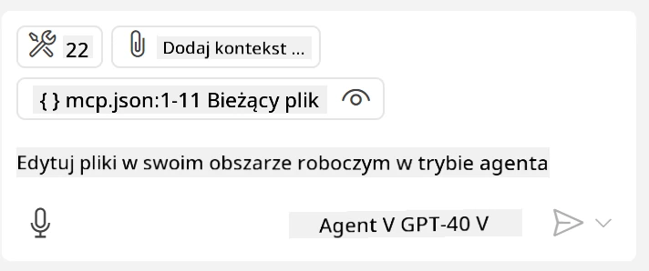
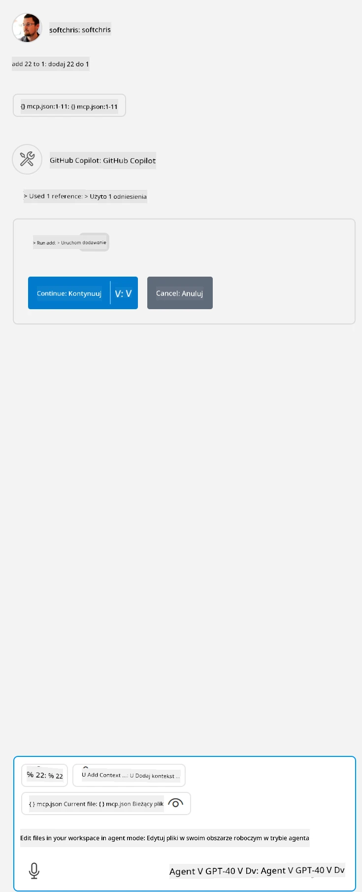

# Konsumowanie serwera w trybie agenta GitHub Copilot

Visual Studio Code i GitHub Copilot mogą działać jako klient i konsumować serwer MCP. Możesz się zastanawiać, dlaczego mielibyśmy to robić? Cóż, oznacza to, że wszystkie funkcje serwera MCP mogą być teraz używane bezpośrednio z twojego IDE. Wyobraź sobie, że dodajesz na przykład serwer MCP GitHub, co pozwoliłoby na kontrolowanie GitHub za pomocą podpowiedzi zamiast wpisywania konkretnych poleceń w terminalu. Albo wyobraź sobie cokolwiek, co w ogóle mogłoby poprawić twoje doświadczenie deweloperskie, wszystko sterowane naturalnym językiem. Teraz zaczynasz widzieć zalety, prawda?

## Przegląd

Ta lekcja omawia, jak korzystać z Visual Studio Code i trybu agenta GitHub Copilot jako klienta serwera MCP.

## Cele nauki

Po zakończeniu tej lekcji będziesz potrafił:

- Konsumować serwer MCP za pomocą Visual Studio Code.
- Uruchamiać funkcje, takie jak narzędzia, przez GitHub Copilot.
- Konfigurować Visual Studio Code, aby odnajdowało i zarządzało twoim serwerem MCP.

## Użytkowanie

Możesz kontrolować swój serwer MCP na dwa sposoby:

- Interfejs użytkownika, jak to zrobić zobaczysz później w tym rozdziale.
- Terminal, można kontrolować rzeczy z terminala za pomocą polecenia `code`:

  Aby dodać serwer MCP do swojego profilu użytkownika, użyj opcji wiersza poleceń --add-mcp i podaj konfigurację serwera w formacie JSON w postaci {\"name\":\"server-name\",\"command\":...}.

  ```
  code --add-mcp "{\"name\":\"my-server\",\"command\": \"uvx\",\"args\": [\"mcp-server-fetch\"]}"
  ```

### Zrzuty ekranu





Porozmawiajmy więcej o tym, jak korzystamy z interfejsu wizualnego w kolejnych sekcjach.

## Podejście

Oto jak powinniśmy do tego podejść na wysokim poziomie:

- Skonfigurować plik do odnajdowania naszego serwera MCP.
- Uruchomić/Powiązać się z tym serwerem, aby wyświetlić dostępne możliwości.
- Korzystać z tych możliwości przez interfejs GitHub Copilot Chat.

Świetnie, teraz gdy rozumiemy przepływ, spróbujmy użyć serwera MCP w Visual Studio Code na przykładzie ćwiczenia.

## Ćwiczenie: Konsumowanie serwera

W tym ćwiczeniu skonfigurujemy Visual Studio Code, aby mogło odnaleźć twój serwer MCP, tak aby można go było użyć przez interfejs GitHub Copilot Chat.

### -0- Wstępny krok, włącz odkrywanie serwerów MCP

Możesz potrzebować włączyć odkrywanie serwerów MCP.

1. Przejdź do `Plik -> Preferencje -> Ustawienia` w Visual Studio Code.

1. Wyszukaj "MCP" i włącz `chat.mcp.discovery.enabled` w pliku settings.json.

### -1- Utwórz plik konfiguracyjny

Zacznij od utworzenia pliku konfiguracyjnego w katalogu głównym twojego projektu, potrzebujesz pliku o nazwie MCP.json i musisz umieścić go w folderze .vscode. Powinien wyglądać tak:

```text
.vscode
|-- mcp.json
```

Następnie zobaczmy, jak dodać wpis serwera.

### -2- Skonfiguruj serwer

Dodaj następującą zawartość do *mcp.json*:

```json
{
    "inputs": [],
    "servers": {
       "hello-mcp": {
           "command": "node",
           "args": [
               "build/index.js"
           ]
       }
    }
}
```

Powyżej znajduje się prosty przykład, jak uruchomić serwer napisany w Node.js, dla innych środowisk wskaż właściwe polecenie uruchomienia serwera używając `command` i `args`.

### -3- Uruchom serwer

Teraz, gdy dodałeś wpis, uruchom serwer:

1. Znajdź swój wpis w *mcp.json* i upewnij się, że widzisz ikonę "play":

    

1. Kliknij ikonę "play", powinieneś zauważyć, że ikona narzędzi w GitHub Copilot Chat zwiększa liczbę dostępnych narzędzi. Klikając tę ikonę zobaczysz listę zarejestrowanych narzędzi. Możesz zaznaczyć lub odznaczyć każde narzędzie w zależności od tego, czy chcesz, aby GitHub Copilot używał ich jako kontekst:

  

1. Aby uruchomić narzędzie, wpisz polecenie, które wiesz, że pasuje do opisu jednego z twoich narzędzi, na przykład takie: "dodaj 22 do 1":

  

  Powinieneś zobaczyć odpowiedź z wartością 23.

## Zadanie

Spróbuj dodać wpis serwera do pliku *mcp.json* i upewnij się, że potrafisz uruchamiać i zatrzymywać serwer. Upewnij się także, że możesz komunikować się z narzędziami na twoim serwerze za pośrednictwem interfejsu GitHub Copilot Chat.

## Rozwiązanie

[Rozwiązanie](./solution/README.md)

## Kluczowe wnioski

Najważniejsze wnioski z tego rozdziału to:

- Visual Studio Code to świetny klient, który pozwala konsumować wiele serwerów MCP i ich narzędzi.
- Interfejs GitHub Copilot Chat to sposób, w jaki wchodzisz w interakcję z serwerami.
- Możesz prosić użytkownika o podanie danych, takich jak klucze API, które można przekazać do serwera MCP podczas konfigurowania wpisu w pliku *mcp.json*.

## Przykłady

- [Java Calculator](../samples/java/calculator/README.md)
- [.Net Calculator](../../../../03-GettingStarted/samples/csharp)
- [JavaScript Calculator](../samples/javascript/README.md)
- [TypeScript Calculator](../samples/typescript/README.md)
- [Python Calculator](../../../../03-GettingStarted/samples/python)

## Dodatkowe zasoby

- [Dokumentacja Visual Studio](https://code.visualstudio.com/docs/copilot/chat/mcp-servers)

## Co dalej

- Następnie: [Tworzenie serwera stdio](../05-stdio-server/README.md)

---

<!-- CO-OP TRANSLATOR DISCLAIMER START -->
**Zastrzeżenie**:
Niniejszy dokument został przetłumaczony za pomocą usługi tłumaczenia AI [Co-op Translator](https://github.com/Azure/co-op-translator). Choć dążymy do dokładności, prosimy pamiętać, że automatyczne tłumaczenia mogą zawierać błędy lub niedokładności. Oryginalny dokument w jego języku źródłowym należy uznawać za autorytatywne źródło. W przypadku informacji krytycznych zalecane jest skorzystanie z profesjonalnego tłumaczenia wykonanego przez człowieka. Nie ponosimy odpowiedzialności za jakiekolwiek nieporozumienia lub błędne interpretacje wynikające z użycia tego tłumaczenia.
<!-- CO-OP TRANSLATOR DISCLAIMER END -->