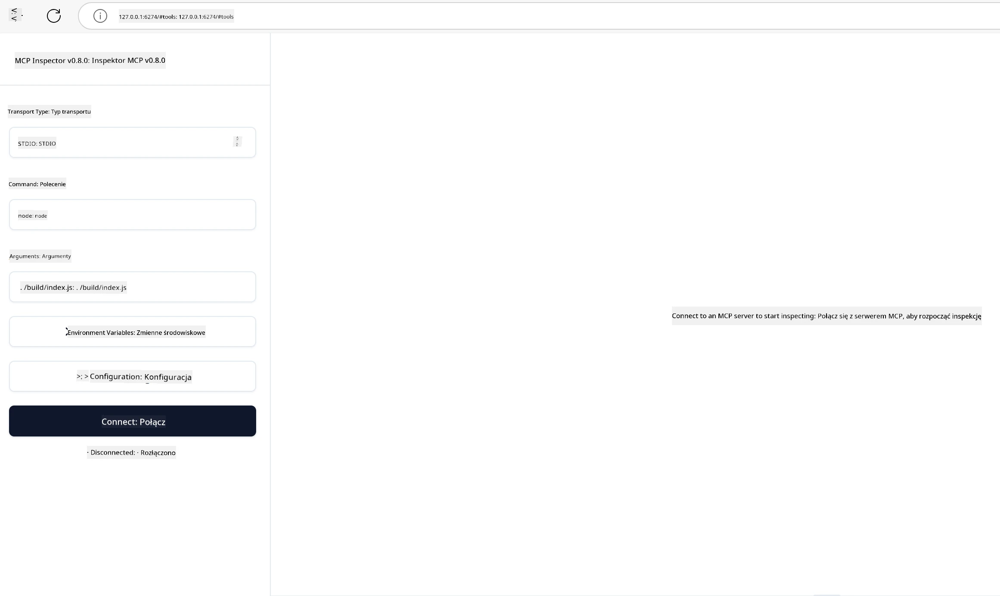

## Testowanie i Debugowanie

Zanim zaczniesz testować swój serwer MCP, ważne jest, aby zrozumieć dostępne narzędzia i najlepsze praktyki dotyczące debugowania. Efektywne testowanie zapewnia, że twój serwer działa zgodnie z oczekiwaniami i pomaga szybko zidentyfikować oraz rozwiązać problemy. Poniższa sekcja przedstawia zalecane podejścia do weryfikacji implementacji MCP.

## Przegląd

Ta lekcja omawia, jak wybrać właściwe podejście do testowania oraz najskuteczniejsze narzędzie do testów.

## Cele Nauki

Do końca tej lekcji będziesz potrafił:

- Opisać różne podejścia do testowania.
- Używać różnych narzędzi do efektywnego testowania swojego kodu.

## Testowanie Serwerów MCP

MCP udostępnia narzędzia, które pomogą ci testować i debugować twoje serwery:

- **MCP Inspector**: Narzędzie wiersza poleceń, które można uruchamiać zarówno jako narzędzie CLI, jak i wizualne.
- **Testowanie ręczne**: Możesz użyć narzędzia takiego jak curl do wysyłania zapytań webowych, ale każde narzędzie obsługujące HTTP będzie odpowiednie.
- **Testy jednostkowe**: Możliwe jest użycie preferowanego frameworka testowego do testowania funkcji zarówno serwera, jak i klienta.

### Korzystanie z MCP Inspector

Opisaliśmy użycie tego narzędzia w poprzednich lekcjach, ale omówmy to teraz na wysokim poziomie. To narzędzie napisane w Node.js i możesz go użyć, wywołując wykonawczy plik `npx`, który tymczasowo pobierze i zainstaluje narzędzie, a po wykonaniu żądania sam się oczyści.

[Inspector MCP](https://github.com/modelcontextprotocol/inspector) pomaga ci:

- **Wykrywać możliwości serwera**: Automatycznie wykrywa dostępne zasoby, narzędzia i prompt'y
- **Testować wykonanie narzędzi**: Próbuj różnych parametrów i zobacz odpowiedzi w czasie rzeczywistym
- **Podglądać metadane serwera**: Sprawdź informacje o serwerze, schematach i konfiguracjach

Typowe uruchomienie narzędzia wygląda tak:

```bash
npx @modelcontextprotocol/inspector node build/index.js
```

Powyższe polecenie uruchamia MCP z jego interfejsem wizualnym oraz lokalny interfejs webowy w przeglądarce. Możesz spodziewać się pulpitu nawigacyjnego pokazującego zarejestrowane serwery MCP, dostępne narzędzia, zasoby i prompt'y. Interfejs pozwala interaktywnie testować działanie narzędzi, przeglądać metadane serwera oraz oglądać odpowiedzi w czasie rzeczywistym, co ułatwia weryfikację oraz debugowanie implementacji serwera MCP.

Tak to może wyglądać: 

Możesz także uruchomić to narzędzie w trybie CLI, dodając atrybut `--cli`. Oto przykład uruchomienia narzędzia w trybie "CLI", który wyświetla wszystkie narzędzia na serwerze:

```sh
npx @modelcontextprotocol/inspector --cli node build/index.js --method tools/list
```

### Testowanie Ręczne

Oprócz uruchamiania narzędzia inspector do testowania możliwości serwera, podobnym podejściem jest uruchomienie klienta obsługującego HTTP, na przykład curl.

Za pomocą curl możesz testować serwery MCP bezpośrednio przy pomocy żądań HTTP:

```bash
# Przykład: Metadane serwera testowego
curl http://localhost:3000/v1/metadata

# Przykład: Wykonaj narzędzie
curl -X POST http://localhost:3000/v1/tools/execute \
  -H "Content-Type: application/json" \
  -d '{"name": "calculator", "parameters": {"expression": "2+2"}}'
```

Jak widzisz z powyższego użycia curl, wykorzystujesz żądanie POST do wywołania narzędzia, przesyłając ładunek zawierający nazwę narzędzia i jego parametry. Użyj takiego podejścia, które najbardziej ci odpowiada. Narzędzia CLI z reguły są szybsze w użyciu i łatwo poddają się skryptowaniu, co może być przydatne w środowisku CI/CD.

### Testy Jednostkowe

Twórz testy jednostkowe dla swoich narzędzi i zasobów, aby upewnić się, że działają zgodnie z oczekiwaniami. Oto przykładowy kod testowy.

```python
import pytest

from mcp.server.fastmcp import FastMCP
from mcp.shared.memory import (
    create_connected_server_and_client_session as create_session,
)

# Oznacz cały moduł do testów asynchronicznych
pytestmark = pytest.mark.anyio


async def test_list_tools_cursor_parameter():
    """Test that the cursor parameter is accepted for list_tools.

    Note: FastMCP doesn't currently implement pagination, so this test
    only verifies that the cursor parameter is accepted by the client.
    """

 server = FastMCP("test")

    # Utwórz parę narzędzi testowych
    @server.tool(name="test_tool_1")
    async def test_tool_1() -> str:
        """First test tool"""
        return "Result 1"

    @server.tool(name="test_tool_2")
    async def test_tool_2() -> str:
        """Second test tool"""
        return "Result 2"

    async with create_session(server._mcp_server) as client_session:
        # Test bez parametru kursora (pominięty)
        result1 = await client_session.list_tools()
        assert len(result1.tools) == 2

        # Test z kursorem=None
        result2 = await client_session.list_tools(cursor=None)
        assert len(result2.tools) == 2

        # Test z kursorem jako łańcuch znaków
        result3 = await client_session.list_tools(cursor="some_cursor_value")
        assert len(result3.tools) == 2

        # Test z pustym łańcuchem kursora
        result4 = await client_session.list_tools(cursor="")
        assert len(result4.tools) == 2
    
```

Powyższy kod wykonuje następujące czynności:

- Wykorzystuje framework pytest, który pozwala tworzyć testy jako funkcje i używać instrukcji assert.
- Tworzy serwer MCP z dwoma różnymi narzędziami.
- Używa instrukcji `assert`, by sprawdzić, czy określone warunki są spełnione.

Zerknij na [pełny plik tutaj](https://github.com/modelcontextprotocol/python-sdk/blob/main/tests/client/test_list_methods_cursor.py)

Na podstawie powyższego pliku możesz testować swój własny serwer, aby upewnić się, że możliwości są tworzone tak, jak powinny.

Wszystkie główne SDK mają podobne sekcje testowe, więc możesz dostosować to do wybranego środowiska uruchomieniowego.

## Przykłady

- [Java Calculator](../samples/java/calculator/README.md)
- [.Net Calculator](../../../../03-GettingStarted/samples/csharp)
- [JavaScript Calculator](../samples/javascript/README.md)
- [TypeScript Calculator](../samples/typescript/README.md)
- [Python Calculator](../../../../03-GettingStarted/samples/python)

## Dodatkowe Zasoby

- [Python SDK](https://github.com/modelcontextprotocol/python-sdk)

## Co Dalej

- Następny: [Wdrożenie](../09-deployment/README.md)

---

<!-- CO-OP TRANSLATOR DISCLAIMER START -->
**Zastrzeżenie**:  
Niniejszy dokument został przetłumaczony przy użyciu automatycznej usługi tłumaczeniowej [Co-op Translator](https://github.com/Azure/co-op-translator). Chociaż dokładamy starań, aby tłumaczenie było poprawne, prosimy pamiętać, że tłumaczenia automatyczne mogą zawierać błędy lub nieścisłości. Oryginalny dokument w języku źródłowym powinien być traktowany jako źródło autorytatywne. W przypadku informacji krytycznych zalecane jest skorzystanie z profesjonalnego tłumaczenia wykonywanego przez człowieka. Nie ponosimy odpowiedzialności za jakiekolwiek nieporozumienia lub błędne interpretacje wynikające z korzystania z tego tłumaczenia.
<!-- CO-OP TRANSLATOR DISCLAIMER END -->