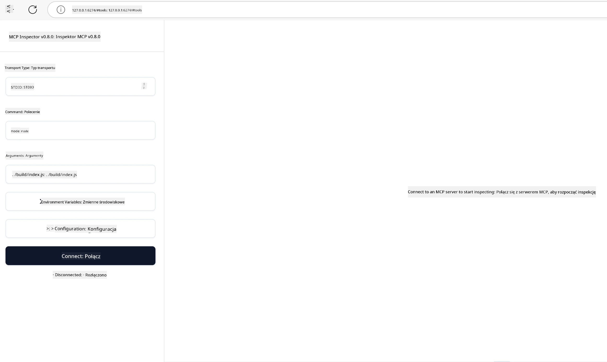

## Testowanie i debugowanie

Zanim zaczniesz testować swój serwer MCP, ważne jest, aby zrozumieć dostępne narzędzia i najlepsze praktyki debugowania. Skuteczne testowanie zapewnia, że serwer działa zgodnie z oczekiwaniami i pomaga szybko zidentyfikować oraz rozwiązać problemy. W poniższej sekcji przedstawiono zalecane podejścia do weryfikacji implementacji MCP.

## Przegląd

Ta lekcja omawia, jak wybrać odpowiednie podejście do testowania oraz najskuteczniejsze narzędzie do testów.

## Cele nauki

Pod koniec tej lekcji będziesz potrafić:

- Opisać różne podejścia do testowania.
- Używać różnych narzędzi do skutecznego testowania swojego kodu.


## Testowanie serwerów MCP

MCP dostarcza narzędzia pomagające testować i debugować serwery:

- **MCP Inspector**: narzędzie wiersza poleceń, które można uruchamiać jako narzędzie CLI i jako narzędzie wizualne.
- **Testowanie ręczne**: Możesz użyć narzędzia takiego jak curl do wykonywania zapytań sieciowych, ale każde narzędzie obsługujące HTTP będzie odpowiednie.
- **Testy jednostkowe**: Możliwe jest użycie ulubionego frameworka testowego do testowania funkcji zarówno serwera, jak i klienta.

### Korzystanie z MCP Inspector

Opisaliśmy użycie tego narzędzia w poprzednich lekcjach, ale omówmy je teraz krótko. Jest to narzędzie zbudowane w Node.js i możesz go używać, wywołując wykonalny plik `npx`, który tymczasowo pobierze i zainstaluje narzędzie, a po wykonaniu twojego zapytania sam się posprząta.

[MCP Inspector](https://github.com/modelcontextprotocol/inspector) pomaga:

- **Odkrywać możliwości serwera**: automatycznie wykrywać dostępne zasoby, narzędzia i podpowiedzi
- **Testować wykonywanie narzędzi**: wypróbować różne parametry i oglądać odpowiedzi w czasie rzeczywistym
- **Przeglądać metadane serwera**: analizować informacje serwera, schematy i konfiguracje

Typowe uruchomienie narzędzia wygląda tak:

```bash
npx @modelcontextprotocol/inspector node build/index.js
```

Powyższe polecenie uruchamia MCP wraz z jego wizualnym interfejsem i otwiera lokalny interfejs webowy w twojej przeglądarce. Możesz się spodziewać wyświetlenia panelu kontrolnego pokazującego zarejestrowane serwery MCP, dostępne narzędzia, zasoby i podpowiedzi. Interfejs pozwala interaktywnie testować wykonywanie narzędzi, przeglądać metadane serwera oraz oglądać odpowiedzi w czasie rzeczywistym, co ułatwia weryfikację i debugowanie implementacji serwerów MCP.

Tak to może wyglądać: 

Możesz także uruchomić to narzędzie w trybie CLI, dodając atrybut `--cli`. Oto przykład uruchomienia w trybie „CLI”, który wyświetla listę wszystkich narzędzi na serwerze:

```sh
npx @modelcontextprotocol/inspector --cli node build/index.js --method tools/list
```

### Testowanie ręczne

Oprócz uruchamiania narzędzia inspector w celu testowania możliwości serwera, innym podobnym podejściem jest uruchomienie klienta obsługującego HTTP, na przykład curl.

Za pomocą curl możesz testować serwery MCP bezpośrednio, wykonując zapytania HTTP:

```bash
# Przykład: Metadane serwera testowego
curl http://localhost:3000/v1/metadata

# Przykład: Wykonaj narzędzie
curl -X POST http://localhost:3000/v1/tools/execute \
  -H "Content-Type: application/json" \
  -d '{"name": "calculator", "parameters": {"expression": "2+2"}}'
```

Jak widać z powyższego użycia curl, używasz zapytania POST, aby wywołać narzędzie, przesyłając w ładunku nazwę narzędzia i jego parametry. Wybierz podejście, które najbardziej ci odpowiada. Narzędzia CLI zazwyczaj są szybsze w użyciu i łatwiej je skryptować, co może być przydatne w środowisku CI/CD.

### Testy jednostkowe

Twórz testy jednostkowe dla swoich narzędzi i zasobów, aby mieć pewność, że działają zgodnie z oczekiwaniami. Oto przykładowy kod testujący.

```python
import pytest

from mcp.server.fastmcp import FastMCP
from mcp.shared.memory import (
    create_connected_server_and_client_session as create_session,
)

# Oznacz cały moduł do testów asynchronicznych
pytestmark = pytest.mark.anyio


async def test_list_tools_cursor_parameter():
    """Test that the cursor parameter is accepted for list_tools.

    Note: FastMCP doesn't currently implement pagination, so this test
    only verifies that the cursor parameter is accepted by the client.
    """

 server = FastMCP("test")

    # Utwórz kilka narzędzi testowych
    @server.tool(name="test_tool_1")
    async def test_tool_1() -> str:
        """First test tool"""
        return "Result 1"

    @server.tool(name="test_tool_2")
    async def test_tool_2() -> str:
        """Second test tool"""
        return "Result 2"

    async with create_session(server._mcp_server) as client_session:
        # Test bez parametru kursora (pominięty)
        result1 = await client_session.list_tools()
        assert len(result1.tools) == 2

        # Test z kursorem=None
        result2 = await client_session.list_tools(cursor=None)
        assert len(result2.tools) == 2

        # Test z kursorem jako string
        result3 = await client_session.list_tools(cursor="some_cursor_value")
        assert len(result3.tools) == 2

        # Test z pustym stringiem kursora
        result4 = await client_session.list_tools(cursor="")
        assert len(result4.tools) == 2
    
```

Powyższy kod wykonuje następujące czynności:

- Wykorzystuje framework pytest, który pozwala tworzyć testy jako funkcje i używać instrukcji assert.
- Tworzy serwer MCP z dwoma różnymi narzędziami.
- Używa instrukcji `assert`, aby sprawdzić spełnienie określonych warunków.

Sprawdź [pełny plik tutaj](https://github.com/modelcontextprotocol/python-sdk/blob/main/tests/client/test_list_methods_cursor.py)

Mając powyższy plik, możesz przetestować własny serwer, aby upewnić się, że możliwości są tworzone tak, jak powinny.

Wszystkie główne SDK mają podobne sekcje testowe, więc możesz je dostosować do wybranego środowiska uruchomieniowego.

## Przykłady

- [Kalkulator Java](../samples/java/calculator/README.md)
- [Kalkulator .Net](../../../../03-GettingStarted/samples/csharp)
- [Kalkulator JavaScript](../samples/javascript/README.md)
- [Kalkulator TypeScript](../samples/typescript/README.md)
- [Kalkulator Python](../../../../03-GettingStarted/samples/python)

## Dodatkowe zasoby

- [Python SDK](https://github.com/modelcontextprotocol/python-sdk)

## Co dalej

- Następne: [Wdrożenie](../09-deployment/README.md)

---

<!-- CO-OP TRANSLATOR DISCLAIMER START -->
**Zastrzeżenie**:
Niniejszy dokument został przetłumaczony za pomocą usługi tłumaczenia AI [Co-op Translator](https://github.com/Azure/co-op-translator). Choć dążymy do dokładności, prosimy pamiętać, że automatyczne tłumaczenia mogą zawierać błędy lub niedokładności. Oryginalny dokument w jego języku źródłowym należy uznawać za autorytatywne źródło. W przypadku informacji krytycznych zalecane jest skorzystanie z profesjonalnego tłumaczenia wykonanego przez człowieka. Nie ponosimy odpowiedzialności za jakiekolwiek nieporozumienia lub błędne interpretacje wynikające z użycia tego tłumaczenia.
<!-- CO-OP TRANSLATOR DISCLAIMER END -->