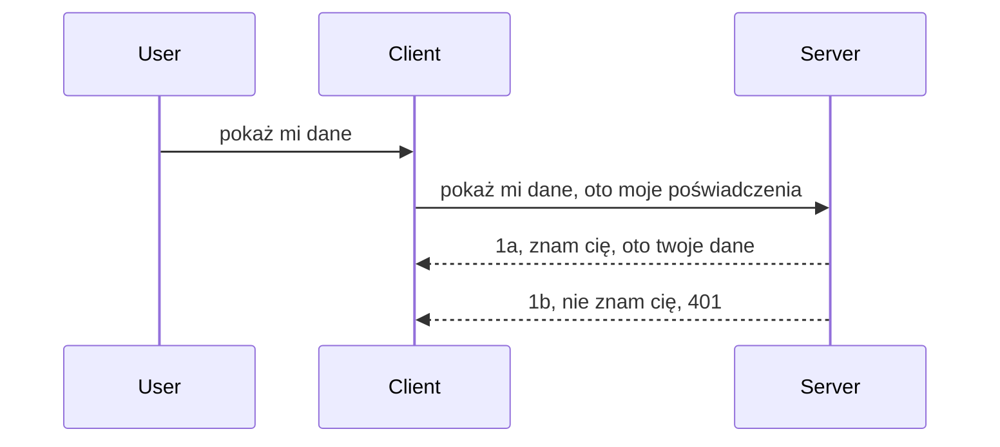

# Prosta autoryzacja

SDK MCP wspierają korzystanie z OAuth 2.1, co szczerze mówiąc jest dość skomplikowanym procesem obejmującym takie koncepcje jak serwer autoryzacji, serwer zasobów, przesyłanie poświadczeń, otrzymywanie kodu, wymianę kodu na token dostępu, aż w końcu uzyskanie danych zasobu. Jeśli nie jesteś przyzwyczajony do OAuth, co jest świetnym rozwiązaniem do zaimplementowania, dobrym pomysłem jest rozpoczęcie od podstawowego poziomu autoryzacji i stopniowe zwiększanie poziomu bezpieczeństwa. Dlatego istnieje ten rozdział, aby wprowadzić Cię do bardziej zaawansowanej autoryzacji.

## Autoryzacja, co mamy na myśli?

Autoryzacja to skrót od uwierzytelniania i autoryzacji. Chodzi o to, że musimy zrobić dwie rzeczy:

- **Uwierzytelnianie**, czyli proces ustalenia, czy pozwalamy osobie wejść do naszego domu, czy ma prawo tu być, tzn. mieć dostęp do naszego serwera zasobów, na którym działają funkcje MCP Server.
- **Autoryzacja**, to proces ustalenia, czy użytkownik powinien mieć dostęp do tych konkretnych zasobów, o które prosi, na przykład tych zamówień czy produktów, albo czy pozwalamy mu tylko czytać zawartość, ale nie usuwać ich jako inny przykład.

## Poświadczenia: jak mówimy systemowi kim jesteśmy

Większość programistów webowych zaczyna myśleć w kategoriach dostarczania serwerowi poświadczeń, zwykle sekretu, który mówi, czy mają prawo tu być ("Uwierzytelnianie"). To poświadczenie to zazwyczaj zakodowana w base64 nazwa użytkownika i hasło lub klucz API, który jednoznacznie identyfikuje konkretnego użytkownika.

Polega to na przesłaniu go w nagłówku o nazwie "Authorization" w następujący sposób:

```json
{ "Authorization": "secret123" }
```

To zwykle nazywa się uwierzytelnianiem podstawowym (basic authentication). Cały proces działa w następujący sposób:


Skoro rozumiemy, jak to działa z punktu widzenia przepływu, jak to zaimplementować? Większość serwerów webowych ma koncepcję middleware, kawałek kodu, który jest uruchamiany jako część żądania i może zweryfikować poświadczenia, a jeśli poświadczenia są prawidłowe, pozwala żądaniu przejść dalej. Jeśli żądanie nie ma ważnych poświadczeń, otrzymujesz błąd autoryzacji. Zobaczmy jak to można zaimplementować:

**Python**

```python
class AuthMiddleware(BaseHTTPMiddleware):
    async def dispatch(self, request, call_next):

        has_header = request.headers.get("Authorization")
        if not has_header:
            print("-> Missing Authorization header!")
            return Response(status_code=401, content="Unauthorized")

        if not valid_token(has_header):
            print("-> Invalid token!")
            return Response(status_code=403, content="Forbidden")

        print("Valid token, proceeding...")
       
        response = await call_next(request)
        # dodaj dowolne nagłówki klienta lub w jakiś sposób zmień odpowiedź
        return response


starlette_app.add_middleware(CustomHeaderMiddleware)
```

Tutaj mamy:

- Stworzony middleware o nazwie `AuthMiddleware`, którego metoda `dispatch` jest wywoływana przez serwer webowy.
- Dodany middleware do serwera webowego:

    ```python
    starlette_app.add_middleware(AuthMiddleware)
    ```

- Napisaną logikę walidacji, która sprawdza, czy nagłówek Authorization jest obecny i czy przesyłany sekret jest ważny:

    ```python
    has_header = request.headers.get("Authorization")
    if not has_header:
        print("-> Missing Authorization header!")
        return Response(status_code=401, content="Unauthorized")

    if not valid_token(has_header):
        print("-> Invalid token!")
        return Response(status_code=403, content="Forbidden")
    ```

    jeśli sekret jest obecny i ważny, pozwalamy żądaniu przejść dalej wywołując `call_next` i zwrócić odpowiedź.

    ```python
    response = await call_next(request)
    # dodaj dowolne nagłówki klienta lub w jakiś sposób zmień odpowiedź
    return response
    ```

Działa to tak, że jeśli do serwera zostanie wysłane żądanie, middleware zostanie wywołane i na podstawie jego implementacji albo przepuści żądanie dalej, albo zwróci błąd wskazujący, że klient nie ma prawa kontynuować.

**TypeScript**

Tutaj tworzymy middleware za pomocą popularnego frameworka Express i przechwytujemy żądanie zanim dotrze do MCP Server. Oto kod:

```typescript
function isValid(secret) {
    return secret === "secret123";
}

app.use((req, res, next) => {
    // 1. Nagłówek autoryzacji obecny?
    if(!req.headers["Authorization"]) {
        res.status(401).send('Unauthorized');
    }
    
    let token = req.headers["Authorization"];

    // 2. Sprawdź ważność.
    if(!isValid(token)) {
        res.status(403).send('Forbidden');
    }

   
    console.log('Middleware executed');
    // 3. Przekazuje żądanie do następnego etapu w potoku żądań.
    next();
});
```

W tym kodzie:

1. Sprawdzamy, czy nagłówek Authorization w ogóle jest obecny, jeśli nie, wysyłamy błąd 401.
2. Sprawdzamy, czy poświadczenie/token jest ważny, jeśli nie, wysyłamy błąd 403.
3. W końcu przekazujemy żądanie dalej w pipeline i zwracamy żądany zasób.

## Ćwiczenie: Implementacja uwierzytelniania

Przenieśmy naszą wiedzę do praktyki. Plan jest następujący:

Serwer

- Utworzyć serwer webowy i instancję MCP.
- Zaimplementować middleware dla serwera.

Klient

- Wysłać żądanie webowe z poświadczeniem w nagłówku.

### -1- Utworzyć serwer webowy i instancję MCP

W pierwszym kroku musimy utworzyć instancję serwera webowego i MCP Server.

**Python**

Tutaj tworzymy instancję MCP Servera, tworzymy aplikację starlette i hostujemy ją za pomocą uvicorn.

```python
# tworzenie serwera MCP

app = FastMCP(
    name="MCP Resource Server",
    instructions="Resource Server that validates tokens via Authorization Server introspection",
    host=settings["host"],
    port=settings["port"],
    debug=True
)

# tworzenie aplikacji sieciowej starlette
starlette_app = app.streamable_http_app()

# uruchamianie aplikacji za pomocą uvicorn
async def run(starlette_app):
    import uvicorn
    config = uvicorn.Config(
            starlette_app,
            host=app.settings.host,
            port=app.settings.port,
            log_level=app.settings.log_level.lower(),
        )
    server = uvicorn.Server(config)
    await server.serve()

run(starlette_app)
```

W tym kodzie:

- Tworzymy MCP Server.
- Budujemy aplikację starlette z MCP Servera, `app.streamable_http_app()`.
- Hostujemy i serwujemy aplikację za pomocą uvicorn `server.serve()`.

**TypeScript**

Tutaj tworzymy instancję MCP Servera.

```typescript
const server = new McpServer({
      name: "example-server",
      version: "1.0.0"
    });

    // ... skonfiguruj zasoby serwera, narzędzia i podpowiedzi ...
```

Tworzenie MCP Servera musi nastąpić wewnątrz definicji trasy POST /mcp, więc przenieśmy powyższy kod tak:

```typescript
import express from "express";
import { randomUUID } from "node:crypto";
import { McpServer } from "@modelcontextprotocol/sdk/server/mcp.js";
import { StreamableHTTPServerTransport } from "@modelcontextprotocol/sdk/server/streamableHttp.js";
import { isInitializeRequest } from "@modelcontextprotocol/sdk/types.js"

const app = express();
app.use(express.json());

// Mapa do przechowywania transportów według ID sesji
const transports: { [sessionId: string]: StreamableHTTPServerTransport } = {};

// Obsługa żądań POST dla komunikacji klient-serwer
app.post('/mcp', async (req, res) => {
  // Sprawdź, czy istnieje ID sesji
  const sessionId = req.headers['mcp-session-id'] as string | undefined;
  let transport: StreamableHTTPServerTransport;

  if (sessionId && transports[sessionId]) {
    // Ponowne wykorzystanie istniejącego transportu
    transport = transports[sessionId];
  } else if (!sessionId && isInitializeRequest(req.body)) {
    // Nowe żądanie inicjalizacji
    transport = new StreamableHTTPServerTransport({
      sessionIdGenerator: () => randomUUID(),
      onsessioninitialized: (sessionId) => {
        // Przechowaj transport według ID sesji
        transports[sessionId] = transport;
      },
      // Ochrona przed DNS rebinding jest domyślnie wyłączona dla kompatybilności wstecznej. Jeśli uruchamiasz ten serwer
      // lokalnie, upewnij się, że ustawiono:
      // enableDnsRebindingProtection: true,
      // allowedHosts: ['127.0.0.1'],
    });

    // Posprzątaj transport po zamknięciu
    transport.onclose = () => {
      if (transport.sessionId) {
        delete transports[transport.sessionId];
      }
    };
    const server = new McpServer({
      name: "example-server",
      version: "1.0.0"
    });

    // ... skonfiguruj zasoby serwera, narzędzia i podpowiedzi ...

    // Połącz się z serwerem MCP
    await server.connect(transport);
  } else {
    // Nieprawidłowe żądanie
    res.status(400).json({
      jsonrpc: '2.0',
      error: {
        code: -32000,
        message: 'Bad Request: No valid session ID provided',
      },
      id: null,
    });
    return;
  }

  // Obsłuż żądanie
  await transport.handleRequest(req, res, req.body);
});

// Ponownie używalny handler dla żądań GET i DELETE
const handleSessionRequest = async (req: express.Request, res: express.Response) => {
  const sessionId = req.headers['mcp-session-id'] as string | undefined;
  if (!sessionId || !transports[sessionId]) {
    res.status(400).send('Invalid or missing session ID');
    return;
  }
  
  const transport = transports[sessionId];
  await transport.handleRequest(req, res);
};

// Obsługa żądań GET dla powiadomień serwer-klient przez SSE
app.get('/mcp', handleSessionRequest);

// Obsługa żądań DELETE dla zakończenia sesji
app.delete('/mcp', handleSessionRequest);

app.listen(3000);
```

Teraz widzisz, jak tworzenie MCP Servera zostało przeniesione do `app.post("/mcp")`.

Przejdźmy do kolejnego kroku, tworzenia middleware, aby móc zweryfikować nadchodzące poświadczenia.

### -2- Implementacja middleware dla serwera

Przejdźmy do części middleware. Tutaj stworzymy middleware, który będzie szukał poświadczenia w nagłówku `Authorization` i je weryfikował. Jeśli jest akceptowalne, żądanie będzie mogło dalej wykonywać swoje zadania (np. listować narzędzia, czytać zasób lub cokolwiek innego związanego z funkcjonalnością MCP, o które klient prosił).

**Python**

Aby stworzyć middleware, musimy stworzyć klasę dziedziczącą po `BaseHTTPMiddleware`. Mamy tu dwa interesujące elementy:

- Obiekt żądania `request`, z którego odczytujemy nagłówki.
- `call_next` — callback, który musimy wywołać, jeśli klient przyniósł poświadczenie, które akceptujemy.

Najpierw obsłużmy przypadek, gdy nagłówek `Authorization` jest nieobecny:

```python
has_header = request.headers.get("Authorization")

# brak nagłówka, zwróć błąd 401, w przeciwnym razie kontynuuj.
if not has_header:
    print("-> Missing Authorization header!")
    return Response(status_code=401, content="Unauthorized")
```

Tutaj wysyłamy 401 unauthorized, ponieważ klient nie przeszedł uwierzytelniania.

Następnie, jeśli przesłano poświadczenie, sprawdzamy jego ważność w ten sposób:

```python
 if not valid_token(has_header):
    print("-> Invalid token!")
    return Response(status_code=403, content="Forbidden")
```

Zauważ, że powyżej wysyłamy 403 forbidden. Zobaczmy pełny middleware poniżej, implementujący wszystko, co wspomnieliśmy:

```python
class AuthMiddleware(BaseHTTPMiddleware):
    async def dispatch(self, request, call_next):

        has_header = request.headers.get("Authorization")
        if not has_header:
            print("-> Missing Authorization header!")
            return Response(status_code=401, content="Unauthorized")

        if not valid_token(has_header):
            print("-> Invalid token!")
            return Response(status_code=403, content="Forbidden")

        print("Valid token, proceeding...")
        print(f"-> Received {request.method} {request.url}")
        response = await call_next(request)
        response.headers['Custom'] = 'Example'
        return response

```

Świetnie, ale co z funkcją `valid_token`? Oto ona poniżej:

```python
# NIE używaj do produkcji - popraw to !!
def valid_token(token: str) -> bool:
    # usuń prefiks "Bearer "
    if token.startswith("Bearer "):
        token = token[7:]
        return token == "secret-token"
    return False
```

Oczywiście można to poprawić.

WAŻNE: Nigdy nie powinieneś trzymać sekretów takich jak ten w kodzie. Idealnie, powinieneś pobierać wartość do porównania z bazy danych lub od dostawcy tożsamości (IDP) lub jeszcze lepiej, pozwolić IDP przeprowadzić weryfikację.

**TypeScript**

Aby zaimplementować to w Express, musimy wywołać metodę `use`, która przyjmuje funkcje middleware.

Musimy:

- Interagować z obiektem żądania, aby sprawdzić poświadczenia w właściwości `Authorization`.
- Zweryfikować poświadczenia i jeśli są poprawne, pozwolić na kontynuację żądania i realizację funkcji MCP (np. listowanie narzędzi, odczyt zasobu itp.).

Tutaj sprawdzamy, czy nagłówek `Authorization` jest obecny, jeśli nie, blokujemy żądanie:

```typescript
if(!req.headers["authorization"]) {
    res.status(401).send('Unauthorized');
    return;
}
```

Jeśli nagłówek nie został wysłany, otrzymujesz 401.

Następnie sprawdzamy prawidłowość poświadczenia, jeśli nie jest ważne, ponownie blokujemy żądanie z nieco innym komunikatem:

```typescript
if(!isValid(token)) {
    res.status(403).send('Forbidden');
    return;
} 
```

Zauważ, że tutaj otrzymujesz błąd 403.

Oto cały kod:

```typescript
app.use((req, res, next) => {
    console.log('Request received:', req.method, req.url, req.headers);
    console.log('Headers:', req.headers["authorization"]);
    if(!req.headers["authorization"]) {
        res.status(401).send('Unauthorized');
        return;
    }
    
    let token = req.headers["authorization"];

    if(!isValid(token)) {
        res.status(403).send('Forbidden');
        return;
    }  

    console.log('Middleware executed');
    next();
});
```

Skonfigurowaliśmy serwer webowy, aby akceptował middleware weryfikujące poświadczenia, które klient powinien nam przesyłać. A jak wygląda klient?

### -3- Wysyłanie żądania webowego z poświadczeniami w nagłówku

Musimy zapewnić, że klient przesyła poświadczenia w nagłówku. Ponieważ będziemy korzystać z klienta MCP, musimy dowiedzieć się, jak to zrobić.

**Python**

Dla klienta musimy przekazać nagłówek z poświadczeniem w ten sposób:

```python
# NIE koduj wartości na stałe, przechowuj ją przynajmniej w zmiennej środowiskowej lub w bardziej bezpiecznym miejscu
token = "secret-token"

async with streamablehttp_client(
        url = f"http://localhost:{port}/mcp",
        headers = {"Authorization": f"Bearer {token}"}
    ) as (
        read_stream,
        write_stream,
        session_callback,
    ):
        async with ClientSession(
            read_stream,
            write_stream
        ) as session:
            await session.initialize()
      
            # DO ZROBIENIA, co chcesz zrobić po stronie klienta, np. listowanie narzędzi, wywoływanie narzędzi itd.
```

Zwróć uwagę, że ustawiamy właściwość `headers` tak: ` headers = {"Authorization": f"Bearer {token}"}`.

**TypeScript**

Możemy to rozwiązać w dwóch krokach:

1. Utworzyć obiekt konfiguracji z poświadczeniami.
2. Przekazać obiekt konfiguracji do transportu.

```typescript

// NIE zapisuj wartości na sztywno jak pokazano tutaj. Przynajmniej miej to jako zmienną środowiskową i używaj czegoś takiego jak dotenv (w trybie deweloperskim).
let token = "secret123"

// zdefiniuj obiekt opcji transportu klienta
let options: StreamableHTTPClientTransportOptions = {
  sessionId: sessionId,
  requestInit: {
    headers: {
      "Authorization": "secret123"
    }
  }
};

// przekaż obiekt opcji do transportu
async function main() {
   const transport = new StreamableHTTPClientTransport(
      new URL(serverUrl),
      options
   );
```

Widać powyżej, że musieliśmy stworzyć obiekt `options` i umieścić nagłówki w właściwości `requestInit`.

WAŻNE: Jak można to ulepszyć? Obecna implementacja ma pewne problemy. Przede wszystkim przekazywanie poświadczenia w ten sposób jest ryzykowne, chyba że masz HTTPS. Nawet wtedy poświadczenie może zostać skradzione, więc potrzebujesz systemu, w którym łatwo możesz unieważnić token i dodać dodatkowe kontrole, np. skąd na świecie pochodzi żądanie, czy nie jest wysyłane zbyt często (zachowanie podobne do bota), krótko mówiąc, jest wiele kwestii.

Należy jednak powiedzieć, że dla bardzo prostych API, gdzie nie chcesz, aby ktokolwiek wywoływał twoje API bez uwierzytelnienia, to co tu mamy to dobry początek.

Zatem spróbujmy nieco wzmocnić bezpieczeństwo, stosując ustandaryzowany format jak JSON Web Token, znany też jako JWT lub tokeny „JOT”.

## JSON Web Tokens, JWT

Próbujemy poprawić wysyłanie prostych poświadczeń. Jakie natychmiastowe korzyści daje adopcja JWT?

- **Poprawa bezpieczeństwa**. W uwierzytelnianiu podstawowym wysyłasz nazwę użytkownika i hasło zakodowane w base64 (lub klucz API) wielokrotnie, co zwiększa ryzyko. Z JWT wysyłasz nazwę użytkownika i hasło, dostajesz token w zamian, który jest ograniczony czasowo, czyli wygasa. JWT pozwala na łatwe używanie drobnoziarnistej kontroli dostępu za pomocą ról, zakresów i uprawnień.
- **Bezstanowość i skalowalność**. JWT są samodzielne, zawierają wszystkie informacje o użytkowniku i eliminują potrzebę przechowywania sesji po stronie serwera. Token można walidować lokalnie.
- **Interoperacyjność i federacja**. JWT są podstawą Open ID Connect i używane przez znanych dostawców tożsamości jak Entra ID, Google Identity czy Auth0. Umożliwiają też jednokrotne logowanie (SSO) i wiele więcej, co daje poziom enterprise.
- **Modułowość i elastyczność**. JWT można też używać z API Gateway jak Azure API Management, NGINX i inne. Obsługuje scenariusze uwierzytelniania i komunikacji serwer-serwis, w tym impersonifikację i delegację.
- **Wydajność i cache’owanie**. JWT można cache’ować po zdekodowaniu, co zmniejsza potrzebę parsowania. To pomaga zwłaszcza przy aplikacjach z dużym ruchem, poprawiając przepustowość i zmniejszając obciążenie infrastruktury.
- **Zaawansowane funkcje**. Obsługuje introspekcję (weryfikację ważności na serwerze) i odwoływanie (unieważnianie tokenu).

Mając te wszystkie zalety, zobaczmy jak przenieść naszą implementację na wyższy poziom.

## Przekształcenie podstawowej autoryzacji na JWT

Na poziomie ogólnym potrzebujemy:

- **Nauczyć się tworzyć token JWT** i przygotować go do wysłania z klienta do serwera.
- **Weryfikować token JWT** i jeśli jest prawidłowy, pozwolić klientowi korzystać z naszych zasobów.
- **Bezpiecznie przechowywać token**. Jak przechowywać ten token.
- **Chronić ścieżki**. Musimy chronić trasy, a w naszym przypadku konkretne funkcje MCP.
- **Dodawać tokeny odświeżające**. Tworzyć tokeny o krótkim czasie życia oraz tokeny odświeżające o dłuższym, które pozwolą pozyskać nowe tokeny po wygaśnięciu. Zapewnić endpoint odświeżania i strategię rotacji.

### -1- Tworzenie tokenu JWT

Token JWT składa się z następujących części:

- **nagłówek**, użyty algorytm i typ tokenu.
- **ładunek (payload)**, czyli claims, jak sub (użytkownik lub podmiot tokena, zwykle id użytkownika), exp (wygaśnięcie), role (rola).
- **podpis (signature)**, podpisany sekretem lub kluczem prywatnym.

Musimy więc stworzyć nagłówek, payload i zakodowany token.

**Python**

```python

import jwt
import jwt
from jwt.exceptions import ExpiredSignatureError, InvalidTokenError
import datetime

# Tajny klucz używany do podpisywania JWT
secret_key = 'your-secret-key'

header = {
    "alg": "HS256",
    "typ": "JWT"
}

# informacje o użytkowniku oraz jego roszczenia i czas wygaśnięcia
payload = {
    "sub": "1234567890",               # Podmiot (ID użytkownika)
    "name": "User Userson",                # Własne roszczenie
    "admin": True,                     # Własne roszczenie
    "iat": datetime.datetime.utcnow(),# Data wystawienia
    "exp": datetime.datetime.utcnow() + datetime.timedelta(hours=1)  # Data wygaśnięcia
}

# zakoduj to
encoded_jwt = jwt.encode(payload, secret_key, algorithm="HS256", headers=header)
```

W powyższym kodzie:

- Zdefiniowaliśmy nagłówek używając algorytmu HS256 i typu JWT.
- Zbudowaliśmy payload zawierający subject, nazwę użytkownika, rolę, czas wydania i czas wygaśnięcia, realizując aspekt ograniczenia czasowego, o którym wspomnieliśmy.

**TypeScript**

Potrzebujemy niektórych zależności, które pomogą nam tworzyć token JWT.

Zależności

```sh

npm install jsonwebtoken
npm install --save-dev @types/jsonwebtoken
```

Mając to na miejscu, stwórzmy nagłówek, payload i zakodowany token.

```typescript
import jwt from 'jsonwebtoken';

const secretKey = 'your-secret-key'; // Używaj zmiennych środowiskowych w produkcji

// Zdefiniuj ładunek
const payload = {
  sub: '1234567890',
  name: 'User usersson',
  admin: true,
  iat: Math.floor(Date.now() / 1000), // Data wystawienia
  exp: Math.floor(Date.now() / 1000) + 60 * 60 // Wygasa za 1 godzinę
};

// Zdefiniuj nagłówek (opcjonalne, jsonwebtoken ustawia wartości domyślne)
const header = {
  alg: 'HS256',
  typ: 'JWT'
};

// Utwórz token
const token = jwt.sign(payload, secretKey, {
  algorithm: 'HS256',
  header: header
});

console.log('JWT:', token);
```

Token:

Podpisany z użyciem HS256  
Ważny przez godzinę  
Zawiera claims takie jak sub, name, admin, iat i exp.

### -2- Weryfikacja tokenu

Musimy też zweryfikować token, co powinniśmy zrobić na serwerze, aby upewnić się, że to, co klient wysyła, jest poprawne. Należy wykonać wiele kontroli, od struktury po ważność tokenu. Zalecamy też dodatkowe kontrole, np. czy użytkownik istnieje w systemie oraz czy ma odpowiednie prawa.

Aby zweryfikować token, musimy go zdekodować, by odczytać zawartość i rozpocząć weryfikację:

**Python**

```python

# Dekoduj i zweryfikuj JWT
try:
    decoded = jwt.decode(token, secret_key, algorithms=["HS256"])
    print("✅ Token is valid.")
    print("Decoded claims:")
    for key, value in decoded.items():
        print(f"  {key}: {value}")
except ExpiredSignatureError:
    print("❌ Token has expired.")
except InvalidTokenError as e:
    print(f"❌ Invalid token: {e}")

```

W tym kodzie wywołujemy `jwt.decode` z tokenem, tajnym kluczem i wybranym algorytmem jako wejściem. Zwróć uwagę na konstrukcję try-catch — nieudana walidacja skutkuje wyrzuceniem wyjątku.

**TypeScript**

Tutaj wywołujemy `jwt.verify`, by otrzymać zdekodowaną wersję tokenu do analizy. Jeśli wywołanie się nie powiedzie, token ma błędną strukturę lub jest nieważny.

```typescript

try {
  const decoded = jwt.verify(token, secretKey);
  console.log('Decoded Payload:', decoded);
} catch (err) {
  console.error('Token verification failed:', err);
}
```

UWAGA: Jak wspomniano wcześniej, powinniśmy przeprowadzić dodatkowe kontrole, by upewnić się, że token wskazuje na użytkownika w naszym systemie i że użytkownik ma deklarowane prawa.

Następnie przyjrzyjmy się kontroli dostępu opartej na rolach, czyli RBAC.
## Dodawanie kontroli dostępu opartej na rolach

Chodzi o to, że chcemy wyrazić, że różne role mają różne uprawnienia. Na przykład zakładamy, że administrator może wszystko, zwykli użytkownicy mogą czytać/zapisywać, a goście mogą tylko czytać. Zatem oto możliwe poziomy uprawnień:

- Admin.Write 
- User.Read
- Guest.Read

Spójrzmy, jak możemy zaimplementować taką kontrolę za pomocą middleware. Middleware można dodawać per trasę, jak również dla wszystkich tras.

**Python**

```python
from starlette.middleware.base import BaseHTTPMiddleware
from starlette.responses import JSONResponse
import jwt

# NIE umieszczaj sekretu w kodzie, na przykład, to jest tylko do celów demonstracyjnych. Odczytaj go z bezpiecznego miejsca.
SECRET_KEY = "your-secret-key" # umieść to w zmiennej środowiskowej
REQUIRED_PERMISSION = "User.Read"

class JWTPermissionMiddleware(BaseHTTPMiddleware):
    async def dispatch(self, request, call_next):
        auth_header = request.headers.get("Authorization")
        if not auth_header or not auth_header.startswith("Bearer "):
            return JSONResponse({"error": "Missing or invalid Authorization header"}, status_code=401)

        token = auth_header.split(" ")[1]
        try:
            decoded = jwt.decode(token, SECRET_KEY, algorithms=["HS256"])
        except jwt.ExpiredSignatureError:
            return JSONResponse({"error": "Token expired"}, status_code=401)
        except jwt.InvalidTokenError:
            return JSONResponse({"error": "Invalid token"}, status_code=401)

        permissions = decoded.get("permissions", [])
        if REQUIRED_PERMISSION not in permissions:
            return JSONResponse({"error": "Permission denied"}, status_code=403)

        request.state.user = decoded
        return await call_next(request)


```

Istnieje kilka różnych sposobów dodania middleware, jak poniżej:

```python

# Alt 1: dodaj middleware podczas tworzenia aplikacji starlette
middleware = [
    Middleware(JWTPermissionMiddleware)
]

app = Starlette(routes=routes, middleware=middleware)

# Alt 2: dodaj middleware po tym, jak aplikacja starlette została już utworzona
starlette_app.add_middleware(JWTPermissionMiddleware)

# Alt 3: dodaj middleware dla każdej trasy
routes = [
    Route(
        "/mcp",
        endpoint=..., # obsługujący
        middleware=[Middleware(JWTPermissionMiddleware)]
    )
]
```

**TypeScript**

Możemy użyć `app.use` i middleware, które będzie działać dla wszystkich żądań.

```typescript
app.use((req, res, next) => {
    console.log('Request received:', req.method, req.url, req.headers);
    console.log('Headers:', req.headers["authorization"]);

    // 1. Sprawdź, czy nagłówek autoryzacji został wysłany

    if(!req.headers["authorization"]) {
        res.status(401).send('Unauthorized');
        return;
    }
    
    let token = req.headers["authorization"];

    // 2. Sprawdź, czy token jest ważny
    if(!isValid(token)) {
        res.status(403).send('Forbidden');
        return;
    }  

    // 3. Sprawdź, czy użytkownik tokena istnieje w naszym systemie
    if(!isExistingUser(token)) {
        res.status(403).send('Forbidden');
        console.log("User does not exist");
        return;
    }
    console.log("User exists");

    // 4. Zweryfikuj, czy token ma odpowiednie uprawnienia
    if(!hasScopes(token, ["User.Read"])){
        res.status(403).send('Forbidden - insufficient scopes');
    }

    console.log("User has required scopes");

    console.log('Middleware executed');
    next();
});

```

Jest całkiem sporo rzeczy, które możemy i NASZE middleware POWINNO robić, mianowicie:

1. Sprawdzić, czy nagłówek autoryzacji jest obecny
2. Sprawdzić, czy token jest ważny, wywołujemy `isValid`, metodę napisaną przez nas, która sprawdza integralność i ważność tokena JWT.
3. Zweryfikować, czy użytkownik istnieje w naszym systemie, powinniśmy to sprawdzić.

   ```typescript
    // użytkownicy w bazie danych
   const users = [
     "user1",
     "User usersson",
   ]

   function isExistingUser(token) {
     let decodedToken = verifyToken(token);

     // DO ZROBIENIA, sprawdź czy użytkownik istnieje w bazie danych
     return users.includes(decodedToken?.name || "");
   }
   ```

   Powyżej utworzyliśmy bardzo prostą listę `users`, która oczywiście powinna znajdować się w bazie danych.

4. Dodatkowo powinniśmy też sprawdzić, czy token ma odpowiednie uprawnienia.

   ```typescript
   if(!hasScopes(token, ["User.Read"])){
        res.status(403).send('Forbidden - insufficient scopes');
   }
   ```

   W powyższym kodzie z middleware sprawdzamy, czy token zawiera uprawnienie User.Read, jeśli nie to wysyłamy błąd 403. Poniżej jest metoda pomocnicza `hasScopes`.

   ```typescript
   function hasScopes(scope: string, requiredScopes: string[]) {
     let decodedToken = verifyToken(scope);
    return requiredScopes.every(scope => decodedToken?.scopes.includes(scope));
  }
   ```

Have a think which additional checks you should be doing, but these are the absolute minimum of checks you should be doing.

Using Express as a web framework is a common choice. There are helpers library when you use JWT so you can write less code.

- `express-jwt`, helper library that provides a middleware that helps decode your token.
- `express-jwt-permissions`, this provides a middleware `guard` that helps check if a certain permission is on the token.

Here's what these libraries can look like when used:

```typescript
const express = require('express');
const jwt = require('express-jwt');
const guard = require('express-jwt-permissions')();

const app = express();
const secretKey = 'your-secret-key'; // put this in env variable

// Decode JWT and attach to req.user
app.use(jwt({ secret: secretKey, algorithms: ['HS256'] }));

// Check for User.Read permission
app.use(guard.check('User.Read'));

// multiple permissions
// app.use(guard.check(['User.Read', 'Admin.Access']));

app.get('/protected', (req, res) => {
  res.json({ message: `Welcome ${req.user.name}` });
});

// Error handler
app.use((err, req, res, next) => {
  if (err.code === 'permission_denied') {
    return res.status(403).send('Forbidden');
  }
  next(err);
});

```

Teraz widziałeś, jak middleware może być użyte zarówno do uwierzytelniania, jak i autoryzacji, ale co z MCP? Czy zmienia to, jak robimy uwierzytelnianie? Dowiedzmy się w następnej sekcji.

### -3- Dodaj RBAC do MCP

Jak do tej pory widziałeś, jak możesz dodać RBAC za pomocą middleware, jednak dla MCP nie ma prostego sposobu na dodanie RBAC per funkcjonalność MCP, więc co robić? Cóż, musimy po prostu dodać kod, który sprawdza w tym przypadku, czy klient ma prawa do wywołania konkretnego narzędzia:

Masz kilka różnych możliwości, jak osiągnąć RBAC per funkcjonalność, oto niektóre:

- Dodaj sprawdzenie dla każdego narzędzia, zasobu, podpowiedzi, gdzie musisz sprawdzić poziom uprawnień.

   **python**

   ```python
   @tool()
   def delete_product(id: int):
      try:
          check_permissions(role="Admin.Write", request)
      catch:
        pass # klient nie uzyskał autoryzacji, zgłoś błąd autoryzacji
   ```

   **typescript**

   ```typescript
   server.registerTool(
    "delete-product",
    {
      title: Delete a product",
      description: "Deletes a product",
      inputSchema: { id: z.number() }
    },
    async ({ id }) => {
      
      try {
        checkPermissions("Admin.Write", request);
        // todo, wyślij identyfikator do productService i zdalnego wpisu
      } catch(Exception e) {
        console.log("Authorization error, you're not allowed");  
      }

      return {
        content: [{ type: "text", text: `Deletected product with id ${id}` }]
      };
    }
   );
   ```


- Użyj zaawansowanego podejścia serwerowego i handlerów żądań, aby zminimalizować ilość miejsc, gdzie trzeba wykonać sprawdzenie.

   **Python**

   ```python
   
   tool_permission = {
      "create_product": ["User.Write", "Admin.Write"],
      "delete_product": ["Admin.Write"]
   }

   def has_permission(user_permissions, required_permissions) -> bool:
      # user_permissions: lista uprawnień, które posiada użytkownik
      # required_permissions: lista uprawnień wymaganych dla narzędzia
      return any(perm in user_permissions for perm in required_permissions)

   @server.call_tool()
   async def handle_call_tool(
     name: str, arguments: dict[str, str] | None
   ) -> list[types.TextContent]:
    # Załóż, że request.user.permissions jest listą uprawnień dla użytkownika
     user_permissions = request.user.permissions
     required_permissions = tool_permission.get(name, [])
     if not has_permission(user_permissions, required_permissions):
        # Wyrzuć błąd "Nie masz uprawnień do wywołania narzędzia {name}"
        raise Exception(f"You don't have permission to call tool {name}")
     # kontynuuj i wywołaj narzędzie
     # ...
   ```   
   

   **TypeScript**

   ```typescript
   function hasPermission(userPermissions: string[], requiredPermissions: string[]): boolean {
       if (!Array.isArray(userPermissions) || !Array.isArray(requiredPermissions)) return false;
       // Zwróć true, jeśli użytkownik ma co najmniej jedno wymagane pozwolenie
       
       return requiredPermissions.some(perm => userPermissions.includes(perm));
   }
  
   server.setRequestHandler(CallToolRequestSchema, async (request) => {
      const { params: { name } } = request;
  
      let permissions = request.user.permissions;
  
      if (!hasPermission(permissions, toolPermissions[name])) {
         return new Error(`You don't have permission to call ${name}`);
      }
  
      // kontynuuj..
   });
   ```

   Uwaga, musisz zapewnić, że Twoje middleware przypisuje zdekodowany token do właściwości user w żądaniu, tak aby powyższy kod był prosty.

### Podsumowanie

Teraz, gdy omówiliśmy, jak dodać wsparcie dla RBAC ogólnie i dla MCP w szczególności, czas spróbować zaimplementować zabezpieczenia samodzielnie, aby upewnić się, że zrozumiałeś przedstawione koncepcje.

## Zadanie 1: Zbuduj serwer MCP i klienta MCP korzystając z podstawowego uwierzytelniania

Tutaj wykorzystasz to, czego się nauczyłeś w zakresie przesyłania poświadczeń przez nagłówki.

## Rozwiązanie 1

[Rozwiązanie 1](./code/basic/README.md)

## Zadanie 2: Ulepsz rozwiązanie z Zadania 1, aby używało JWT

Weź pierwsze rozwiązanie, ale tym razem je ulepszmy.

Zamiast używania Basic Auth, użyjmy JWT.

## Rozwiązanie 2

[Rozwiązanie 2](./solution/jwt-solution/README.md)

## Wyzwanie

Dodaj RBAC per narzędzie, które opisaliśmy w sekcji "Dodaj RBAC do MCP".

## Podsumowanie

Mam nadzieję, że dużo się nauczyłeś w tym rozdziale, od braku zabezpieczeń, przez podstawowe zabezpieczenia, aż do JWT i jak można je dodać do MCP.

Zbudowaliśmy solidne podstawy z niestandardowymi JWT, ale w miarę skalowania dążymy ku modelowi tożsamości opartemu na standardach. Przyjęcie IdP, takiego jak Entra czy Keycloak, pozwala przenieść emisję tokenów, ich walidację i zarządzanie cyklem życia na zaufaną platformę — dzięki czemu możemy się skupić na logice aplikacji i doświadczeniu użytkownika.

W tym temacie mamy bardziej [zaawansowany rozdział o Entra](../../05-AdvancedTopics/mcp-security-entra/README.md)

## Co dalej

- Następny: [Konfiguracja hostów MCP](../12-mcp-hosts/README.md)

---

<!-- CO-OP TRANSLATOR DISCLAIMER START -->
**Wyłączenie odpowiedzialności**:  
Niniejszy dokument został przetłumaczony za pomocą usługi tłumaczenia AI [Co-op Translator](https://github.com/Azure/co-op-translator). Choć dokładamy wszelkich starań, aby tłumaczenie było precyzyjne, prosimy mieć na uwadze, że tłumaczenia automatyczne mogą zawierać błędy lub nieścisłości. Oryginalny dokument w jego języku źródłowym powinien być uważany za źródło wiarygodne. W przypadku istotnych informacji zalecane jest skorzystanie z profesjonalnego tłumaczenia wykonanego przez człowieka. Nie ponosimy odpowiedzialności za jakiekolwiek nieporozumienia lub błędne interpretacje wynikające z korzystania z tego tłumaczenia.
<!-- CO-OP TRANSLATOR DISCLAIMER END -->