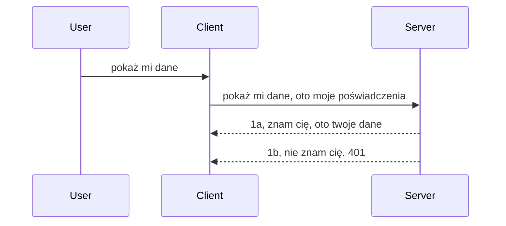

# Prosta autoryzacja

SDK MCP obsługują użycie OAuth 2.1, co jest dość złożonym procesem obejmującym takie koncepcje jak serwer autoryzacji, serwer zasobów, przesyłanie poświadczeń, uzyskiwanie kodu, wymianę kodu na token dostępu, aż wreszcie możliwość otrzymania danych zasobu. Jeśli nie jesteś przyzwyczajony do OAuth, które jest świetnym rozwiązaniem do wdrożenia, warto zacząć od podstawowego poziomu autoryzacji i budować coraz lepsze i bezpieczniejsze mechanizmy. Dlatego powstał ten rozdział, aby stopniowo wprowadzać Cię w bardziej zaawansowaną autoryzację.

## Autoryzacja, co mamy na myśli?

Autoryzacja to skrót od uwierzytelniania i autoryzacji. Chodzi o to, że musimy zrobić dwie rzeczy:

- **Uwierzytelnianie**, czyli proces stwierdzenia, czy pozwalamy osobie wejść do naszego domu, czy ma prawo być "tutaj", czyli mieć dostęp do naszego serwera zasobów, gdzie działają funkcje MCP Server.
- **Autoryzacja**, to proces ustalenia, czy użytkownik powinien mieć dostęp do konkretnych zasobów, o które prosi, na przykład do tych zamówień czy produktów albo czy może tylko czytać treści, ale nie usuwać, jako kolejny przykład.

## Poświadczenia: jak mówimy systemowi, kim jesteśmy

Większość programistów webowych myśli o dostarczaniu serwerowi poświadczenia, zazwyczaj sekretu, który mówi, czy mają prawo być tutaj "Uwierzytelnianie". To poświadczenie jest zazwyczaj zakodowaną w base64 wersją nazwy użytkownika i hasła albo kluczem API, który jednoznacznie identyfikuje konkretnego użytkownika.

Polega to na przesłaniu go w nagłówku o nazwie "Authorization" w ten sposób:

```json
{ "Authorization": "secret123" }
```

Zwykle nazywa się to podstawową (basic) autoryzacją. Jak działa cały proces, wygląda to następująco:


```mermaid
sequenceDiagram
   participant User
   participant Client
   participant Server

   User->>Client: pokaż mi dane
   Client->>Server: pokaż mi dane, oto moje poświadczenia
   Server-->>Client: 1a, znam cię, oto twoje dane
   Server-->>Client: 1b, nie znam cię, 401 
```

Teraz, gdy rozumiemy, jak to działa z punktu widzenia przepływu, jak to zaimplementować? Większość serwerów webowych ma koncepcję middleware, kawałek kodu uruchamiany jako część zapytania, który może zweryfikować poświadczenia, a jeśli poświadczenia są prawidłowe, przepuścić zapytanie dalej. Jeśli zapytanie nie ma prawidłowych poświadczeń, otrzymujesz błąd autoryzacji. Sprawdźmy, jak można to zaimplementować:

**Python**

```python
class AuthMiddleware(BaseHTTPMiddleware):
    async def dispatch(self, request, call_next):

        has_header = request.headers.get("Authorization")
        if not has_header:
            print("-> Missing Authorization header!")
            return Response(status_code=401, content="Unauthorized")

        if not valid_token(has_header):
            print("-> Invalid token!")
            return Response(status_code=403, content="Forbidden")

        print("Valid token, proceeding...")
       
        response = await call_next(request)
        # dodaj dowolne nagłówki klienta lub w jakiś sposób zmień odpowiedź
        return response


starlette_app.add_middleware(CustomHeaderMiddleware)
```

Tutaj mamy:

- Utworzono middleware o nazwie `AuthMiddleware`, którego metoda `dispatch` jest wywoływana przez serwer webowy.
- Dodano middleware do serwera webowego:

    ```python
    starlette_app.add_middleware(AuthMiddleware)
    ```

- Napisano logikę walidacji, która sprawdza, czy nagłówek Authorization jest obecny i czy przesyłany sekret jest ważny:

    ```python
    has_header = request.headers.get("Authorization")
    if not has_header:
        print("-> Missing Authorization header!")
        return Response(status_code=401, content="Unauthorized")

    if not valid_token(has_header):
        print("-> Invalid token!")
        return Response(status_code=403, content="Forbidden")
    ```

    jeśli sekret jest obecny i ważny, przepuszczamy zapytanie dalej wywołując `call_next` i zwracamy odpowiedź.

    ```python
    response = await call_next(request)
    # dodaj dowolne nagłówki klienta lub w inny sposób zmień odpowiedź
    return response
    ```

Jak to działa: jeśli request webowy jest skierowany do serwera, middleware zostanie wywołany i zgodnie ze swoją implementacją albo przepuści request dalej, albo zakończy zwracając błąd wskazujący, że klient nie może kontynuować.

**TypeScript**

Tutaj tworzymy middleware przy użyciu popularnego frameworka Express i przechwytujemy zapytanie zanim dotrze do MCP Server. Oto kod:

```typescript
function isValid(secret) {
    return secret === "secret123";
}

app.use((req, res, next) => {
    // 1. Nagłówek autoryzacji obecny?
    if(!req.headers["Authorization"]) {
        res.status(401).send('Unauthorized');
    }
    
    let token = req.headers["Authorization"];

    // 2. Sprawdź ważność.
    if(!isValid(token)) {
        res.status(403).send('Forbidden');
    }

   
    console.log('Middleware executed');
    // 3. Przekazuje żądanie do następnego etapu w potoku żądania.
    next();
});
```

W tym kodzie:

1. Sprawdzamy, czy nagłówek Authorization w ogóle jest obecny, jeśli nie, wysyłamy błąd 401.
2. Sprawdzamy, czy poświadczenie/token jest ważny, jeśli nie, wysyłamy błąd 403.
3. Na końcu pozwalamy zapytaniu przejść dalej w łańcuchu, zwracając żądany zasób.

## Ćwiczenie: Zaimplementuj uwierzytelnianie

Weźmy naszą wiedzę i spróbujmy zaimplementować to w praktyce. Oto plan:

Serwer

- Utwórz serwer webowy i instancję MCP.
- Zaimplementuj middleware dla serwera.

Klient 

- Wyślij zapytanie webowe z poświadczeniem w nagłówku.

### -1- Utwórz serwer webowy i instancję MCP

> [!WARNING]
> Przykład TypeScript poniżej dotyczy MCP `2025-11-25`. Śledzi transporty
> za pomocą `mcp-session-id` i NIE jest to aktualny przykład transportu `2026-07-28`. MCP
> `2026-07-28` usuwa handshake `initialize` oraz identyfikator sesji protokołu; nowe
> implementacje korzystają z zapytań samodzielnych. Zobacz
> [Co zmieniło się w MCP: Specyfikacja 2026-07-28](../../01-CoreConcepts/mcp-2026-07-28.md).

W pierwszym kroku musimy utworzyć instancję serwera webowego i MCP Server.

**Python**

Tworzymy instancję MCP servera, tworzymy aplikację starlette i hostujemy ją przy pomocy uvicorn.

```python
# tworzenie serwera MCP

app = FastMCP(
    name="MCP Resource Server",
    instructions="Resource Server that validates tokens via Authorization Server introspection",
    host=settings["host"],
    port=settings["port"],
    debug=True
)

# tworzenie aplikacji webowej starlette
starlette_app = app.streamable_http_app()

# udostępnianie aplikacji przez uvicorn
async def run(starlette_app):
    import uvicorn
    config = uvicorn.Config(
            starlette_app,
            host=app.settings.host,
            port=app.settings.port,
            log_level=app.settings.log_level.lower(),
        )
    server = uvicorn.Server(config)
    await server.serve()

run(starlette_app)
```

W tym kodzie:

- Tworzymy MCP Server.
- Konstruujemy aplikację starlette z MCP Servera, `app.streamable_http_app()`.
- Hostujemy i serwujemy aplikację za pomocą uvicorn `server.serve()`.

**TypeScript**

Tworzymy instancję MCP Servera.

```typescript
const server = new McpServer({
      name: "example-server",
      version: "1.0.0"
    });

    // ... skonfiguruj zasoby serwera, narzędzia i podpowiedzi ...
```

Tworzenie MCP Servera musi się odbyć w definicji trasy POST /mcp, więc przenieśmy powyższy kod tak:

```typescript
import express from "express";
import { randomUUID } from "node:crypto";
import { McpServer } from "@modelcontextprotocol/sdk/server/mcp.js";
import { StreamableHTTPServerTransport } from "@modelcontextprotocol/sdk/server/streamableHttp.js";
import { isInitializeRequest } from "@modelcontextprotocol/sdk/types.js"

const app = express();
app.use(express.json());

// Mapa do przechowywania transportów według ID sesji
const transports: { [sessionId: string]: StreamableHTTPServerTransport } = {};

// Obsługa żądań POST dla komunikacji klient-serwer
app.post('/mcp', async (req, res) => {
  // Sprawdź istniejące ID sesji
  const sessionId = req.headers['mcp-session-id'] as string | undefined;
  let transport: StreamableHTTPServerTransport;

  if (sessionId && transports[sessionId]) {
    // Ponowne użycie istniejącego transportu
    transport = transports[sessionId];
  } else if (!sessionId && isInitializeRequest(req.body)) {
    // Nowe żądanie inicjalizacji
    transport = new StreamableHTTPServerTransport({
      sessionIdGenerator: () => randomUUID(),
      onsessioninitialized: (sessionId) => {
        // Przechowaj transport według ID sesji
        transports[sessionId] = transport;
      },
      // Ochrona przed DNS rebinding jest domyślnie wyłączona dla kompatybilności wstecznej. Jeśli uruchamiasz ten serwer
      // lokalnie, upewnij się, że ustawisz:
      // enableDnsRebindingProtection: true,
      // allowedHosts: ['127.0.0.1'],
    });

    // Sprzątanie transportu po jego zamknięciu
    transport.onclose = () => {
      if (transport.sessionId) {
        delete transports[transport.sessionId];
      }
    };
    const server = new McpServer({
      name: "example-server",
      version: "1.0.0"
    });

    // ... konfiguruj zasoby serwera, narzędzia i monity ...

    // Połącz się z serwerem MCP
    await server.connect(transport);
  } else {
    // Nieprawidłowe żądanie
    res.status(400).json({
      jsonrpc: '2.0',
      error: {
        code: -32000,
        message: 'Bad Request: No valid session ID provided',
      },
      id: null,
    });
    return;
  }

  // Obsłuż żądanie
  await transport.handleRequest(req, res, req.body);
});

// Ponownie używalny handler dla żądań GET i DELETE
const handleSessionRequest = async (req: express.Request, res: express.Response) => {
  const sessionId = req.headers['mcp-session-id'] as string | undefined;
  if (!sessionId || !transports[sessionId]) {
    res.status(400).send('Invalid or missing session ID');
    return;
  }
  
  const transport = transports[sessionId];
  await transport.handleRequest(req, res);
};

// Obsługa żądań GET dla powiadomień serwer-klient przez SSE
app.get('/mcp', handleSessionRequest);

// Obsługa żądań DELETE do zakończenia sesji
app.delete('/mcp', handleSessionRequest);

app.listen(3000);
```

Teraz widzisz, jak tworzenie MCP Servera zostało przeniesione do `app.post("/mcp")`.

Przejdźmy do następnego kroku, tworzenia middleware, żeby móc zweryfikować nadchodzące poświadczenie.

### -2- Zaimplementuj middleware dla serwera

Przejdźmy do części middleware. Tutaj stworzymy middleware, który szuka poświadczenia w nagłówku `Authorization` i je weryfikuje. Jeśli jest akceptowalne, zapytanie będzie kontynuowane, aby zrobić to, co potrzeba (np. listować narzędzia, odczytać zasób lub cokolwiek innego z funkcji MCP, o które klient prosił).

**Python**

Aby stworzyć middleware, potrzebujemy klasy dziedziczącej po `BaseHTTPMiddleware`. Są dwa interesujące elementy:

- Zapytanie `request`, z którego czytamy info z nagłówka.
- `call_next`, wywołanie, którego trzeba użyć, jeśli klient dostarczył akceptowalne poświadczenie.

Najpierw obsłużmy sytuację, gdy nagłówek `Authorization` jest nieobecny:

```python
has_header = request.headers.get("Authorization")

# brak nagłówka, zwróć błąd 401, w przeciwnym razie przejdź dalej.
if not has_header:
    print("-> Missing Authorization header!")
    return Response(status_code=401, content="Unauthorized")
```

Tutaj wysyłamy komunikat 401 unauthorized, ponieważ klient nie przeszedł uwierzytelniania.

Następnie, jeśli poświadczenie zostało przesłane, sprawdzamy jego ważność tak:

```python
 if not valid_token(has_header):
    print("-> Invalid token!")
    return Response(status_code=403, content="Forbidden")
```

Zauważ, że wyświetlamy komunikat 403 forbidden. Oto pełna implementacja middleware z wszystkimi powyższymi elementami:

```python
class AuthMiddleware(BaseHTTPMiddleware):
    async def dispatch(self, request, call_next):

        has_header = request.headers.get("Authorization")
        if not has_header:
            print("-> Missing Authorization header!")
            return Response(status_code=401, content="Unauthorized")

        if not valid_token(has_header):
            print("-> Invalid token!")
            return Response(status_code=403, content="Forbidden")

        print("Valid token, proceeding...")
        print(f"-> Received {request.method} {request.url}")
        response = await call_next(request)
        response.headers['Custom'] = 'Example'
        return response

```

Świetnie, ale co z funkcją `valid_token`? Oto ona poniżej:

```python
# NIE używaj do produkcji - ulepsz to !!
def valid_token(token: str) -> bool:
    # usuń prefiks "Bearer "
    if token.startswith("Bearer "):
        token = token[7:]
        return token == "secret-token"
    return False
```

To oczywiście można poprawić.

WAŻNE: Nigdy NIE powinieneś mieć takich sekretów w kodzie. Idealnie powinno się pobierać wartość do porównania z bazy danych lub z dostawcy tożsamości (IDP) albo – jeszcze lepiej – pozwolić IDP zweryfikować poświadczenie.

**TypeScript**

Aby zaimplementować to w Express, należy wywołać metodę `use` przyjmującą funkcje middleware.

Trzeba:

- Sprawdzić zapytanie, czy przekazuje poświadczenie w właściwości `Authorization`.
- Zweryfikować poświadczenie i jeśli jest ważne, pozwolić zapytaniu kontynuować obsługę i wykonać zapytanie MCP (np. listować narzędzia, odczytywać zasób lub inne MCP).

Tutaj sprawdzamy, czy nagłówek `Authorization` występuje, a jeśli nie, to zatrzymujemy zapytanie:

```typescript
if(!req.headers["authorization"]) {
    res.status(401).send('Unauthorized');
    return;
}
```

Jeśli nagłówek nie jest przesłany, otrzymujesz błąd 401.

Następnie sprawdzamy poprawność poświadczenia, jeśli jest nieważne, to znów zatrzymujemy zapytanie, ale z innym komunikatem:

```typescript
if(!isValid(token)) {
    res.status(403).send('Forbidden');
    return;
} 
```

Zauważ, że teraz otrzymujesz błąd 403.

Oto pełny kod:

```typescript
app.use((req, res, next) => {
    console.log('Request received:', req.method, req.url, req.headers);
    console.log('Headers:', req.headers["authorization"]);
    if(!req.headers["authorization"]) {
        res.status(401).send('Unauthorized');
        return;
    }
    
    let token = req.headers["authorization"];

    if(!isValid(token)) {
        res.status(403).send('Forbidden');
        return;
    }  

    console.log('Middleware executed');
    next();
});
```

Skonfigurowaliśmy serwer webowy, aby akceptował middleware sprawdzający poświadczenia, które klient ma nam przesłać. A co z klientem?

### -3- Wyślij zapytanie webowe z poświadczeniem w nagłówku

Musimy upewnić się, że klient przesyła poświadczenie w nagłówku. Ponieważ użyjemy klienta MCP, musimy zrozumieć, jak to zrobić.

**Python**

Dla klienta trzeba przekazać nagłówek z naszym poświadczeniem w ten sposób:

```python
# NIE twardo koduj wartości, miej ją przynajmniej w zmiennej środowiskowej lub bezpieczniejszym miejscu przechowywania
token = "secret-token"

async with streamablehttp_client(
        url = f"http://localhost:{port}/mcp",
        headers = {"Authorization": f"Bearer {token}"}
    ) as (
        read_stream,
        write_stream,
        session_callback,
    ):
        async with ClientSession(
            read_stream,
            write_stream
        ) as session:
            await session.initialize()
      
            # DO ZROBIENIA, co chcesz zrobić po stronie klienta, np. lista narzędzi, wywołanie narzędzi itp.
```

Zwróć uwagę, że wypełniamy właściwość `headers` tak: ` headers = {"Authorization": f"Bearer {token}"}`.

**TypeScript**

Możemy to rozwiązać w dwóch krokach:

1. Wypełnij obiekt konfiguracji poświadczeniem.
2. Przekaż obiekt konfiguracji do transportu.

```typescript

// NIE zapisuj wartości na stałe, jak pokazano tutaj. Przynajmniej przechowuj ją jako zmienną środowiskową i używaj czegoś takiego jak dotenv (w trybie deweloperskim).
let token = "secret123"

// zdefiniuj obiekt opcji transportu klienta
let options: StreamableHTTPClientTransportOptions = {
  sessionId: sessionId,
  requestInit: {
    headers: {
      "Authorization": "secret123"
    }
  }
};

// przekaż obiekt opcji do transportu
async function main() {
   const transport = new StreamableHTTPClientTransport(
      new URL(serverUrl),
      options
   );
```

Widzisz powyżej, że musieliśmy utworzyć obiekt `options` i umieścić nagłówki pod właściwością `requestInit`.

WAŻNE: Jak tu można to ulepszyć? Obecna implementacja ma pewne problemy. Po pierwsze, przekazywanie poświadczenia w ten sposób jest ryzykowne, jeśli nie masz przynajmniej HTTPS. Nawet wtedy poświadczenia mogą zostać skradzione, więc potrzebujesz systemu pozwalającego łatwo unieważniać tokeny i dodawać dodatkowe zabezpieczenia jak lokalizacja świata, z której pochodzi zapytanie, czy zapytania nie pojawiają się zbyt często (zachowanie podobne do bota), krótko mówiąc, jest tu mnóstwo różnych zagadnień.

Trzeba jednak powiedzieć, że dla bardzo prostych API, gdzie nie chcesz, by ktokolwiek korzystał bez uwierzytelnienia, to co mamy tutaj jest dobrym początkiem.

Mając to na uwadze, postarajmy się trochę wzmocnić bezpieczeństwo, używając standardowego formatu jak JSON Web Token, znanego także jako JWT lub tokeny "JOT".

## JSON Web Tokens, JWT

Staramy się poprawić to, co mamy, wysyłając bardzo proste poświadczenia. Jakie są korzyści z adopcji JWT?

- **Poprawa bezpieczeństwa**. W podstawowej autoryzacji wysyłasz repeatedly nazwę użytkownika i hasło zakodowane base64 (lub klucz API), co zwiększa ryzyko. Z JWT wysyłasz nazwę i hasło, odbierasz token, który jest czasowo ograniczony – wygasa po pewnym czasie. JWT pozwala na łatwe stosowanie kontroli dostępu z zastosowaniem ról, zakresów i uprawnień.
- **Bezstanowość i skalowalność**. JWT to tokeny samodzielne, zawierają wszystkie informacje o użytkowniku i eliminują potrzebę przechowywania sesji po stronie serwera. Token może też być walidowany lokalnie.
- **Interoperacyjność i federacja**. JWT jest centralnym elementem Open ID Connect i używany jest przez znanych dostawców tożsamości jak Entra ID, Google Identity czy Auth0. Umożliwia Single Sign-On i wiele innych funkcjonalności na poziomie enterprise.
- **Modularność i elastyczność**. JWT są także wykorzystywane z API Gateways, jak Azure API Management, NGINX i inne. Obsługują scenariusze uwierzytelniania i komunikację serwer-serwer, w tym podszywanie się i delegacje.
- **Wydajność i cache'owanie**. JWT można cache'ować po dekodowaniu, co zmniejsza potrzebę powtarzanego parsowania. Pomaga to zwłaszcza przy aplikacjach o dużym ruchu, poprawiając przepustowość i zmniejszając obciążenie infrastruktury.
- **Zaawansowane funkcje**. Obsługuje introspekcję (sprawdzanie ważności na serwerze) i unieważnianie (revokację) tokenów.

Z tak wieloma zaletami zobaczmy, jak możemy podnieść naszą implementację na wyższy poziom.

## Zamiana basic auth na JWT

Główne zmiany, które trzeba zrobić, to:

- **Nauczyć się konstruować token JWT** i przygotować go do przesłania od klienta do serwera.
- **Weryfikować token JWT** i jeśli jest ważny, udostępnić klientowi zasoby.
- **Bezpiecznie przechowywać token**. Jak magazynować ten token.
- **Chronić trasy**. W naszym przypadku trzeba chronić trasy i konkretne funkcje MCP.
- **Dodawać tokeny odświeżające**. Zapewnić obsługę tokenów krótkożyciowych i długoterminowych tokenów odświeżających, które pozwalają wygenerować nowe tokeny po wygaśnięciu. Zapewnić endpoint do odświeżania i strategię rotacji.

### -1- Stwórz token JWT

Token JWT składa się z następujących części:

- **header**, nagłówek, algorytm i typ tokenu.
- **payload**, ładunek, deklaracje takie jak sub (użytkownik lub podmiot, którego token reprezentuje — zwykle userid w scenariuszu autoryzacji), exp (data wygaśnięcia), role (rola).
- **signature**, podpis cyfrowy wykonany sekretem lub kluczem prywatnym.

Potrzebujemy zbudować nagłówek, ładunek i zakodowany token.

**Python**

```python

import jwt
import jwt
from jwt.exceptions import ExpiredSignatureError, InvalidTokenError
import datetime

# Sekretny klucz używany do podpisywania JWT
secret_key = 'your-secret-key'

header = {
    "alg": "HS256",
    "typ": "JWT"
}

# informacje o użytkowniku, jego uprawnienia i czas wygaśnięcia
payload = {
    "sub": "1234567890",               # Temat (ID użytkownika)
    "name": "User Userson",                # Własne roszczenie
    "admin": True,                     # Własne roszczenie
    "iat": datetime.datetime.utcnow(),# Data wystawienia
    "exp": datetime.datetime.utcnow() + datetime.timedelta(hours=1)  # Data wygaśnięcia
}

# zakoduj to
encoded_jwt = jwt.encode(payload, secret_key, algorithm="HS256", headers=header)
```

W powyższym kodzie:

- Zdefiniowaliśmy nagłówek używając algorytmu HS256 i typu JWT.
- Zbudowaliśmy ładunek zawierający subiekt lub identyfikator użytkownika, nazwę użytkownika, rolę, czas wystawienia oraz czas wygaśnięcia, realizując tym samym wspomniany wcześniej czasowy limit tokenu.

**TypeScript**

Potrzebujemy kilku zależności, które pomogą nam zbudować token JWT.

Zależności

```sh

npm install jsonwebtoken
npm install --save-dev @types/jsonwebtoken
```

Teraz, gdy to mamy, stwórzmy nagłówek, ładunek i na ich podstawie zakodowany token.

```typescript
import jwt from 'jsonwebtoken';

const secretKey = 'your-secret-key'; // Użyj zmiennych środowiskowych w produkcji

// Zdefiniuj ładunek
const payload = {
  sub: '1234567890',
  name: 'User usersson',
  admin: true,
  iat: Math.floor(Date.now() / 1000), // Wydano o
  exp: Math.floor(Date.now() / 1000) + 60 * 60 // Wygasa za 1 godzinę
};

// Zdefiniuj nagłówek (opcjonalnie, jsonwebtoken ustawia wartości domyślne)
const header = {
  alg: 'HS256',
  typ: 'JWT'
};

// Utwórz token
const token = jwt.sign(payload, secretKey, {
  algorithm: 'HS256',
  header: header
});

console.log('JWT:', token);
```

Ten token jest:

Podpisany z użyciem HS256
Ważny przez 1 godzinę
Zawiera deklaracje sub, name, admin, iat i exp.

### -2- Weryfikuj token

Trzeba też zweryfikować token, co powinno się robić po stronie serwera, by upewnić się, że to, co klient przesyła, jest ważne. Należy tu wykonać wiele kontroli, od walidacji struktury po sprawdzenie ważności. Zachęca się też do dodania innych testów, czy użytkownik jest w Twoim systemie i innych.

Aby zweryfikować token, najpierw go dekodujemy, by móc go odczytać, a potem sprawdzamy jego ważność:

**Python**

```python

# Dekoduj i zweryfikuj JWT
try:
    decoded = jwt.decode(token, secret_key, algorithms=["HS256"])
    print("✅ Token is valid.")
    print("Decoded claims:")
    for key, value in decoded.items():
        print(f"  {key}: {value}")
except ExpiredSignatureError:
    print("❌ Token has expired.")
except InvalidTokenError as e:
    print(f"❌ Invalid token: {e}")

```


W tym kodzie wywołujemy `jwt.decode`, używając tokena, sekretnego klucza oraz wybranego algorytmu jako danych wejściowych. Zauważ, że używamy konstrukcji try-catch, ponieważ nieudana walidacja powoduje zgłoszenie błędu.

**TypeScript**

Tutaj musimy wywołać `jwt.verify`, aby uzyskać zdekodowaną wersję tokena, którą możemy dalej analizować. Jeśli to wywołanie się nie powiedzie, oznacza to, że struktura tokena jest niepoprawna lub token nie jest już ważny.

```typescript

try {
  const decoded = jwt.verify(token, secretKey);
  console.log('Decoded Payload:', decoded);
} catch (err) {
  console.error('Token verification failed:', err);
}
```

UWAGA: jak wspomniano wcześniej, powinniśmy przeprowadzić dodatkowe kontrole, aby upewnić się, że ten token odnosi się do użytkownika w naszym systemie i żeby użytkownik posiadał prawa, które deklaruje.

Następnie przyjrzyjmy się kontroli dostępu opartej na rolach, znanej również jako RBAC.

## Dodawanie kontroli dostępu opartej na rolach

Pomysł polega na tym, że chcemy wyrazić, że różne role mają różne uprawnienia. Na przykład zakładamy, że administrator może wszystko, zwykły użytkownik może czytać/pisać, a gość może tylko czytać. Oto kilka możliwych poziomów uprawnień:

- Admin.Write
- User.Read
- Guest.Read

Spójrzmy, jak możemy zaimplementować taką kontrolę za pomocą middleware. Middleware można dodawać dla poszczególnych tras, jak również dla wszystkich tras.

**Python**

```python
from starlette.middleware.base import BaseHTTPMiddleware
from starlette.responses import JSONResponse
import jwt

# NIE trzymaj sekretu w kodzie, to jest tylko do celów demonstracyjnych. Odczytaj go z bezpiecznego miejsca.
SECRET_KEY = "your-secret-key" # umieść to w zmiennej środowiskowej
REQUIRED_PERMISSION = "User.Read"

class JWTPermissionMiddleware(BaseHTTPMiddleware):
    async def dispatch(self, request, call_next):
        auth_header = request.headers.get("Authorization")
        if not auth_header or not auth_header.startswith("Bearer "):
            return JSONResponse({"error": "Missing or invalid Authorization header"}, status_code=401)

        token = auth_header.split(" ")[1]
        try:
            decoded = jwt.decode(token, SECRET_KEY, algorithms=["HS256"])
        except jwt.ExpiredSignatureError:
            return JSONResponse({"error": "Token expired"}, status_code=401)
        except jwt.InvalidTokenError:
            return JSONResponse({"error": "Invalid token"}, status_code=401)

        permissions = decoded.get("permissions", [])
        if REQUIRED_PERMISSION not in permissions:
            return JSONResponse({"error": "Permission denied"}, status_code=403)

        request.state.user = decoded
        return await call_next(request)


```

Istnieje kilka różnych sposobów, aby dodać middleware, jak poniżej:

```python

# Alternatywa 1: dodaj middleware podczas tworzenia aplikacji starlette
middleware = [
    Middleware(JWTPermissionMiddleware)
]

app = Starlette(routes=routes, middleware=middleware)

# Alternatywa 2: dodaj middleware po utworzeniu aplikacji starlette
starlette_app.add_middleware(JWTPermissionMiddleware)

# Alternatywa 3: dodaj middleware dla każdej trasy
routes = [
    Route(
        "/mcp",
        endpoint=..., # obsługujący
        middleware=[Middleware(JWTPermissionMiddleware)]
    )
]
```

**TypeScript**

Możemy użyć `app.use` i middleware, które będzie działać dla wszystkich żądań.

```typescript
app.use((req, res, next) => {
    console.log('Request received:', req.method, req.url, req.headers);
    console.log('Headers:', req.headers["authorization"]);

    // 1. Sprawdź, czy nagłówek autoryzacji został wysłany

    if(!req.headers["authorization"]) {
        res.status(401).send('Unauthorized');
        return;
    }
    
    let token = req.headers["authorization"];

    // 2. Sprawdź, czy token jest ważny
    if(!isValid(token)) {
        res.status(403).send('Forbidden');
        return;
    }  

    // 3. Sprawdź, czy użytkownik tokena istnieje w naszym systemie
    if(!isExistingUser(token)) {
        res.status(403).send('Forbidden');
        console.log("User does not exist");
        return;
    }
    console.log("User exists");

    // 4. Zweryfikuj, czy token ma odpowiednie uprawnienia
    if(!hasScopes(token, ["User.Read"])){
        res.status(403).send('Forbidden - insufficient scopes');
    }

    console.log("User has required scopes");

    console.log('Middleware executed');
    next();
});

```

Jest całkiem sporo rzeczy, które możemy powierzyć middleware i które nasze middleware POWINNO robić, mianowicie:

1. Sprawdzić, czy nagłówek autoryzacji jest obecny
2. Sprawdzić, czy token jest ważny, wywołujemy `isValid`, co jest metodą, którą napisaliśmy, by sprawdzić integralność i ważność tokena JWT.
3. Zweryfikować, czy użytkownik istnieje w naszym systemie, powinniśmy to sprawdzić.

   ```typescript
    // użytkownicy w bazie danych
   const users = [
     "user1",
     "User usersson",
   ]

   function isExistingUser(token) {
     let decodedToken = verifyToken(token);

     // DO ZROBIENIA, sprawdź, czy użytkownik istnieje w bazie danych
     return users.includes(decodedToken?.name || "");
   }
   ```

   Powyżej stworzyliśmy bardzo prostą listę `users`, która oczywiście powinna znajdować się w bazie danych.

4. Dodatkowo powinniśmy też sprawdzić, czy token ma odpowiednie uprawnienia.

   ```typescript
   if(!hasScopes(token, ["User.Read"])){
        res.status(403).send('Forbidden - insufficient scopes');
   }
   ```

   W tym kodzie powyżej z middleware sprawdzamy, czy token zawiera uprawnienie User.Read, jeśli nie, odsyłamy błąd 403. Poniżej znajduje się pomocnicza metoda `hasScopes`.

   ```typescript
   function hasScopes(scope: string, requiredScopes: string[]) {
     let decodedToken = verifyToken(scope);
    return requiredScopes.every(scope => decodedToken?.scopes.includes(scope));
  }
   ```

Have a think which additional checks you should be doing, but these are the absolute minimum of checks you should be doing.

Using Express as a web framework is a common choice. There are helpers library when you use JWT so you can write less code.

- `express-jwt`, helper library that provides a middleware that helps decode your token.
- `express-jwt-permissions`, this provides a middleware `guard` that helps check if a certain permission is on the token.

Here's what these libraries can look like when used:

```typescript
const express = require('express');
const jwt = require('express-jwt');
const guard = require('express-jwt-permissions')();

const app = express();
const secretKey = 'your-secret-key'; // put this in env variable

// Decode JWT and attach to req.user
app.use(jwt({ secret: secretKey, algorithms: ['HS256'] }));

// Check for User.Read permission
app.use(guard.check('User.Read'));

// multiple permissions
// app.use(guard.check(['User.Read', 'Admin.Access']));

app.get('/protected', (req, res) => {
  res.json({ message: `Welcome ${req.user.name}` });
});

// Error handler
app.use((err, req, res, next) => {
  if (err.code === 'permission_denied') {
    return res.status(403).send('Forbidden');
  }
  next(err);
});

```

Teraz widzieliście, jak middleware może być używane zarówno do uwierzytelniania, jak i autoryzacji. A co z MCP, czy zmienia to sposób, w jaki robimy uwierzytelnianie? Sprawdźmy w następnej sekcji.

### -3- Dodanie RBAC do MCP

Do tej pory widzieliście, jak można dodać RBAC przez middleware, jednak dla MCP nie ma łatwego sposobu, aby dodać RBAC per funkcję MCP, co więc robimy? Po prostu musimy dodać kod, który sprawdza w tym przypadku, czy klient ma prawa do wywołania konkretnego narzędzia:

Masz kilka różnych opcji, jak osiągnąć RBAC per funkcję, oto niektóre z nich:

- Dodaj sprawdzenie dla każdego narzędzia, zasobu, promptu, gdzie musisz sprawdzić poziom uprawnień.

   **python**

   ```python
   @tool()
   def delete_product(id: int):
      try:
          check_permissions(role="Admin.Write", request)
      catch:
        pass # klient nie przeszedł autoryzacji, zgłoś błąd autoryzacji
   ```

   **typescript**

   ```typescript
   server.registerTool(
    "delete-product",
    {
      title: Delete a product",
      description: "Deletes a product",
      inputSchema: { id: z.number() }
    },
    async ({ id }) => {
      
      try {
        checkPermissions("Admin.Write", request);
        // do zrobienia, wyślij id do productService i zdalnego wpisu
      } catch(Exception e) {
        console.log("Authorization error, you're not allowed");  
      }

      return {
        content: [{ type: "text", text: `Deletected product with id ${id}` }]
      };
    }
   );
   ```


- Użyj zaawansowanego podejścia serwera i handlerów żądań, aby zminimalizować liczbę miejsc, w których potrzeba dokonywać sprawdzeń.

   **Python**

   ```python
   
   tool_permission = {
      "create_product": ["User.Write", "Admin.Write"],
      "delete_product": ["Admin.Write"]
   }

   def has_permission(user_permissions, required_permissions) -> bool:
      # user_permissions: lista uprawnień, które posiada użytkownik
      # required_permissions: lista uprawnień wymaganych dla narzędzia
      return any(perm in user_permissions for perm in required_permissions)

   @server.call_tool()
   async def handle_call_tool(
     name: str, arguments: dict[str, str] | None
   ) -> list[types.TextContent]:
    # Załóż, że request.user.permissions to lista uprawnień użytkownika
     user_permissions = request.user.permissions
     required_permissions = tool_permission.get(name, [])
     if not has_permission(user_permissions, required_permissions):
        # Rzuć błąd "Nie masz uprawnień do wywołania narzędzia {name}"
        raise Exception(f"You don't have permission to call tool {name}")
     # kontynuuj i wywołaj narzędzie
     # ...
   ```   
   

   **TypeScript**

   ```typescript
   function hasPermission(userPermissions: string[], requiredPermissions: string[]): boolean {
       if (!Array.isArray(userPermissions) || !Array.isArray(requiredPermissions)) return false;
       // Zwróć true, jeśli użytkownik ma przynajmniej jedno wymagane uprawnienie
       
       return requiredPermissions.some(perm => userPermissions.includes(perm));
   }
  
   server.setRequestHandler(CallToolRequestSchema, async (request) => {
      const { params: { name } } = request;
  
      let permissions = request.user.permissions;
  
      if (!hasPermission(permissions, toolPermissions[name])) {
         return new Error(`You don't have permission to call ${name}`);
      }
  
      // kontynuuj..
   });
   ```

   Uwaga, musisz upewnić się, że twoje middleware przypisuje zdekodowany token do właściwości user obiektu żądania, dzięki czemu powyższy kod jest prostszy.

### Podsumowanie

Teraz, gdy omówiliśmy, jak dodać wsparcie dla RBAC ogólnie, a szczególnie dla MCP, pora spróbować samodzielnie zaimplementować zabezpieczenia, aby upewnić się, że zrozumiałeś przedstawione koncepcje.

## Zadanie 1: Zbuduj serwer MCP i klienta MCP korzystając z podstawowej autoryzacji

Tutaj wykorzystasz to, czego nauczyłeś się w zakresie przesyłania poświadczeń przez nagłówki.

## Rozwiązanie 1

[Rozwiązanie 1](./code/basic/README.md)

## Zadanie 2: Ulepsz rozwiązanie z zadania 1, aby używało JWT

Weź pierwsze rozwiązanie, ale tym razem ulepszmy je.

Zamiast korzystać z Basic Auth, użyjmy JWT.

## Rozwiązanie 2

[Rozwiązanie 2](./solution/jwt-solution/README.md)

## Wyzwanie

Dodaj RBAC per narzędzie, które opisaliśmy w sekcji "Dodanie RBAC do MCP".

## Podsumowanie

Mamy nadzieję, że dużo się nauczyłeś w tym rozdziale, od braku zabezpieczeń, przez podstawowe zabezpieczenia, po JWT i jak można je dodać do MCP.

Zbudowaliśmy solidne podstawy z niestandardowymi JWT, ale w miarę skalowania przechodzimy do modelu tożsamości opartego na standardach. Przyjęcie dostawcy tożsamości (IdP) takiego jak Entra lub Keycloak pozwala nam przenieść odpowiedzialność za wydawanie tokenów, ich walidację i zarządzanie cyklem życia na zaufaną platformę — co pozwala skupić się na logice aplikacji i doświadczeniu użytkownika.

W tym celu mamy bardziej [zaawansowany rozdział o Entra](../../05-AdvancedTopics/mcp-security-entra/README.md)

## Co dalej

- Następny: [Konfiguracja hostów MCP](../12-mcp-hosts/README.md)

---

<!-- CO-OP TRANSLATOR DISCLAIMER START -->
**Zastrzeżenie**:
Niniejszy dokument został przetłumaczony za pomocą usługi tłumaczenia AI [Co-op Translator](https://github.com/Azure/co-op-translator). Choć dążymy do dokładności, prosimy pamiętać, że automatyczne tłumaczenia mogą zawierać błędy lub niedokładności. Oryginalny dokument w jego języku źródłowym należy uznawać za autorytatywne źródło. W przypadku informacji krytycznych zalecane jest skorzystanie z profesjonalnego tłumaczenia wykonanego przez człowieka. Nie ponosimy odpowiedzialności za jakiekolwiek nieporozumienia lub błędne interpretacje wynikające z użycia tego tłumaczenia.
<!-- CO-OP TRANSLATOR DISCLAIMER END -->