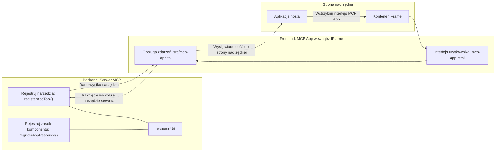
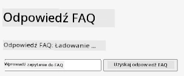
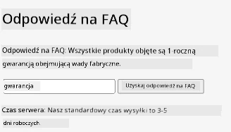
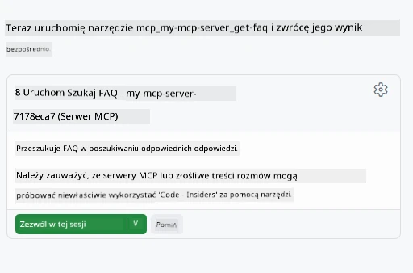
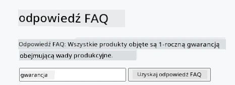

# Aplikacje MCP

Aplikacje MCP to nowy paradygmat w MCP. Idea polega na tym, że nie tylko odpowiadasz danymi zwrotnymi z wywołania narzędzia, ale również dostarczasz informacje o tym, jak z tą informacją należy wchodzić w interakcję. Oznacza to, że wyniki narzędzi mogą teraz zawierać informacje o interfejsie użytkownika. Po co nam to jednak? Cóż, rozważ jak działasz dzisiaj. Prawdopodobnie konsumujesz wyniki serwera MCP, stawiając przed nim jakiś frontend, to kod, który musisz napisać i utrzymywać. Czasem tego właśnie chcesz, ale czasem byłoby świetnie, gdybyś mógł po prostu wziąć fragment informacji, który jest samowystarczalny i zawiera wszystko od danych po interfejs użytkownika.

## Przegląd

Ta lekcja dostarcza praktyczne wskazówki dotyczące Aplikacji MCP, jak zacząć z nimi pracę i jak je zintegrować z istniejącymi aplikacjami webowymi. Aplikacje MCP to bardzo nowe uzupełnienie standardu MCP.

## Cele nauki

Po ukończeniu tej lekcji będziesz potrafił:

- Wyjaśnić, czym są Aplikacje MCP.
- Kiedy używać Aplikacji MCP.
- Tworzyć i integrować własne Aplikacje MCP.

## Aplikacje MCP — jak to działa

Idea Aplikacji MCP polega na dostarczeniu odpowiedzi, która zasadniczo jest komponentem do wyrenderowania. Taki komponent może mieć zarówno elementy wizualne, jak i interaktywność, np. kliknięcia przycisków, dane wejściowe od użytkownika i więcej. Zacznijmy od strony serwera i naszego serwera MCP. Aby stworzyć komponent aplikacji MCP, potrzebujesz stworzyć narzędzie, ale także zasób aplikacji. Te dwie części łączą się przez resourceUri.

Oto przykład. Spróbujmy zwizualizować, co jest zaangażowane i która część co robi:

```text
server.ts -- responsible for registering tools and the component as a UI component
src/
  mcp-app.ts -- wiring up event handlers
mcp-app.html -- the user interface
```

To wizualne przedstawienie opisuje architekturę tworzenia komponentu i jego logikę.


Spróbujmy teraz opisać odpowiedzialności backendu i frontendu odpowiednio.

### Backend

Musimy tu osiągnąć dwie rzeczy:

- Zarejestrować narzędzia, z którymi chcemy wchodzić w interakcję.
- Zdefiniować komponent.

**Rejestracja narzędzia**

```typescript
registerAppTool(
    server,
    "get-time",
    {
      title: "Get Time",
      description: "Returns the current server time.",
      inputSchema: {},
      _meta: { ui: { resourceUri } }, // Łączy to narzędzie z jego zasobem interfejsu użytkownika
    },
    async () => {
      const time = new Date().toISOString();
      return { content: [{ type: "text", text: time }] };
    },
  );

```

Powyższy kod opisuje zachowanie, gdzie udostępnia narzędzie o nazwie `get-time`. Nie przyjmuje ono danych wejściowych, ale zwraca aktualny czas. Mamy możliwość zdefiniowania `inputSchema` dla narzędzi, które powinny przyjmować dane od użytkownika.

**Rejestracja komponentu**

W tym samym pliku musimy też zarejestrować komponent:

```typescript
const resourceUri = "ui://get-time/mcp-app.html";

// Zarejestruj zasób, który zwraca dołączony HTML/JavaScript dla interfejsu użytkownika.
registerAppResource(
  server,
  resourceUri,
  resourceUri,
  { mimeType: RESOURCE_MIME_TYPE },
  async () => {
    const html = await fs.readFile(path.join(DIST_DIR, "mcp-app.html"), "utf-8");

    return {
    contents: [
        { uri: resourceUri, mimeType: RESOURCE_MIME_TYPE, text: html },
    ],
    };
  },
);
```

Zwróć uwagę, jak wspominamy `resourceUri` łączące komponent z jego narzędziami. Interesująca jest też funkcja zwrotna, w której ładujemy plik UI i zwracamy komponent.

### Frontend komponentu

Podobnie jak backend, mamy tutaj dwie części:

- Frontend napisany w czystym HTML.
- Kod, który obsługuje zdarzenia i decyduje, co zrobić, np. wywołanie narzędzi lub wysyłanie wiadomości do okna nadrzędnego.

**Interfejs użytkownika**

Spójrzmy na interfejs użytkownika.

```html
<!-- mcp-app.html -->
<!DOCTYPE html>
<html lang="en">
  <head>
    <meta charset="UTF-8" />
    <title>Get Time App</title>
  </head>
  <body>
    <p>
      <strong>Server Time:</strong> <code id="server-time">Loading...</code>
    </p>
    <button id="get-time-btn">Get Server Time</button>
    <script type="module" src="/src/mcp-app.ts"></script>
  </body>
</html>
```

**Obsługa zdarzeń**

Ostatni element to obsługa zdarzeń. To oznacza, że identyfikujemy, która część naszego UI potrzebuje obsługi zdarzeń i co robić, gdy zdarzenia zostaną wywołane:

```typescript
// mcp-app.ts

import { App } from "@modelcontextprotocol/ext-apps";

// Pobierz referencje do elementów
const serverTimeEl = document.getElementById("server-time")!;
const getTimeBtn = document.getElementById("get-time-btn")!;

// Utwórz instancję aplikacji
const app = new App({ name: "Get Time App", version: "1.0.0" });

// Obsłuż wyniki narzędzia z serwera. Ustaw przed `app.connect()`, aby uniknąć
// utraty początkowego wyniku narzędzia.
app.ontoolresult = (result) => {
  const time = result.content?.find((c) => c.type === "text")?.text;
  serverTimeEl.textContent = time ?? "[ERROR]";
};

// Podłącz kliknięcie przycisku
getTimeBtn.addEventListener("click", async () => {
  // `app.callServerTool()` pozwala interfejsowi użytkownika żądać świeżych danych z serwera
  const result = await app.callServerTool({ name: "get-time", arguments: {} });
  const time = result.content?.find((c) => c.type === "text")?.text;
  serverTimeEl.textContent = time ?? "[ERROR]";
});

// Połącz się z hostem
app.connect();
```

Jak widzisz powyżej, to normalny kod do podłączania elementów DOM do zdarzeń. Warto wyróżnić wywołanie `callServerTool`, które kończy się wywołaniem narzędzia na backendzie.

## Obsługa danych wejściowych od użytkownika

Do tej pory widzieliśmy komponent, który ma przycisk, który po kliknięciu wywołuje narzędzie. Zobaczmy, czy możemy dodać więcej elementów UI, np. pole wejściowe, i czy możemy przesłać argumenty do narzędzia. Zaimplementujmy funkcję FAQ (Najczęściej Zadawane Pytania). Oto jak to powinno działać:

- Powinien istnieć przycisk i pole wejściowe, gdzie użytkownik wpisuje słowo kluczowe do wyszukania, np. "Shipping" (wysyłka). Powinno to wywołać narzędzie na backendzie, które przeszuka dane FAQ.
- Narzędzie, które obsługuje wspomniane wyszukiwanie FAQ.

Dodajmy najpierw potrzebne wsparcie do backendu:

```typescript
const faq: { [key: string]: string } = {
    "shipping": "Our standard shipping time is 3-5 business days.",
    "return policy": "You can return any item within 30 days of purchase.",
    "warranty": "All products come with a 1-year warranty covering manufacturing defects.",
  }

registerAppTool(
    server,
    "get-faq",
    {
      title: "Search FAQ",
      description: "Searches the FAQ for relevant answers.",
      inputSchema: zod.object({
        query: zod.string().default("shipping"),
      }),
      _meta: { ui: { resourceUri: faqResourceUri } }, // Łączy to narzędzie z jego zasobem UI
    },
    async ({ query }) => {
      const answer: string = faq[query.toLowerCase()] || "Sorry, I don't have an answer for that.";
      return { content: [{ type: "text", text: answer }] };
    },
  );
```

To, co widzimy, to jak wypełniamy `inputSchema` i dajemy mu schemat `zod` w ten sposób:

```typescript
inputSchema: zod.object({
  query: zod.string().default("shipping"),
})
```

W powyższym schemacie deklarujemy, że mamy parametr wejściowy o nazwie `query`, który jest opcjonalny, z domyślną wartością "shipping".

Dobrze, przejdźmy teraz do *mcp-app.html*, aby zobaczyć, jaki interfejs użytkownika musimy stworzyć:

```html
<div class="faq">
    <h1>FAQ response</h1>
    <p>FAQ Response: <code id="faq-response">Loading...</code></p>
    <input type="text" id="faq-query" placeholder="Enter FAQ query" />
    <button id="get-faq-btn">Get FAQ Response</button>
  </div>
```

Super, teraz mamy element wejściowy i przycisk. Przejdźmy do *mcp-app.ts*, aby podłączyć te zdarzenia:

```typescript
const getFaqBtn = document.getElementById("get-faq-btn")!;
const faqQueryInput = document.getElementById("faq-query") as HTMLInputElement;

getFaqBtn.addEventListener("click", async () => {
  const query = faqQueryInput.value;
  const result = await app.callServerTool({ name: "get-faq", arguments: { query } });
  const faq = result.content?.find((c) => c.type === "text")?.text;
  faqResponseEl.textContent = faq ?? "[ERROR]";
});
```

W powyższym kodzie:

- Tworzymy referencje do interesujących elementów UI.
- Obsługujemy kliknięcie przycisku, aby odczytać wartość z pola wejściowego i wywołujemy `app.callServerTool()` z `name` i `arguments`, gdzie argumenty przekazują `query` jako wartość.

Co faktycznie się dzieje po wywołaniu `callServerTool`, to wysyła wiadomość do okna nadrzędnego, które ostatecznie wywołuje serwer MCP.

### Wypróbuj to

Po wypróbowaniu powinniśmy zobaczyć następujące:



a tutaj przykładowe użycie z wpisanym "warranty" (gwarancja)



Aby uruchomić ten kod, przejdź do [sekcji z kodem](./code/README.md)

## Testowanie w Visual Studio Code

Visual Studio Code oferuje świetne wsparcie dla aplikacji MVP i jest prawdopodobnie jednym z najłatwiejszych sposobów testowania Twoich Aplikacji MCP. Aby używać Visual Studio Code, dodaj wpis serwera do *mcp.json* w ten sposób:

```json
"my-mcp-server-7178eca7": {
    "url": "http://localhost:3001/mcp",
    "type": "http"
  }
```

Następnie uruchom serwer, powinieneś być w stanie komunikować się ze swoją aplikacją MCP przez okno czatu, jeśli masz zainstalowanego GitHub Copilota.

wywołując np. przez prompt "#get-faq":



i tak jak przy uruchomieniu w przeglądarce, renderuje się to samo w ten sposób:



## Zadanie

Stwórz grę kamień, papier, nożyce. Powinna się składać z:

UI:

- listy rozwijanej z opcjami
- przycisku do zatwierdzenia wyboru
- etykiety pokazującej, kto co wybrał i kto wygrał

Serwer:

- powinien mieć narzędzie kamień, papier, nożyce, które przyjmuje "choice" jako dane wejściowe. Powinno też wygenerować wybór komputera i określić zwycięzcę.

## Rozwiązanie

[Rozwiązanie](./assignment/README.md)

## Podsumowanie

Poznaliśmy ten nowy paradygmat Aplikacji MCP. To nowy paradygmat, który pozwala serwerom MCP mieć opinię nie tylko na temat danych, ale także jak te dane powinny być prezentowane.

Dodatkowo dowiedzieliśmy się, że te Aplikacje MCP są hostowane w IFrame i aby komunikować się z serwerami MCP, muszą wysyłać wiadomości do nadrzędnej aplikacji webowej. Istnieje wiele bibliotek zarówno dla czystego JavaScript, React i innych, które ułatwiają tę komunikację.

## Kluczowe wnioski

Oto czego się nauczyłeś:

- Aplikacje MCP to nowy standard, który może być użyteczny, gdy chcesz dostarczyć zarówno dane, jak i funkcje UI.
- Tego typu aplikacje działają w IFrame ze względów bezpieczeństwa.

## Co dalej

- [Rozdział 4](../../04-PracticalImplementation/README.md)

---

<!-- CO-OP TRANSLATOR DISCLAIMER START -->
**Zastrzeżenie**:  
Niniejszy dokument został przetłumaczony za pomocą usługi tłumaczenia AI [Co-op Translator](https://github.com/Azure/co-op-translator). Chociaż dokładamy starań, aby tłumaczenie było jak najbardziej precyzyjne, prosimy mieć na uwadze, że automatyczne tłumaczenia mogą zawierać błędy lub nieścisłości. Oryginalny dokument w jego języku źródłowym powinien być uznawany za źródło autorytatywne. W przypadku informacji o kluczowym znaczeniu zaleca się skorzystanie z profesjonalnego tłumaczenia wykonanego przez człowieka. Nie ponosimy odpowiedzialności za jakiekolwiek nieporozumienia lub błędne interpretacje wynikające z użycia tego tłumaczenia.
<!-- CO-OP TRANSLATOR DISCLAIMER END -->