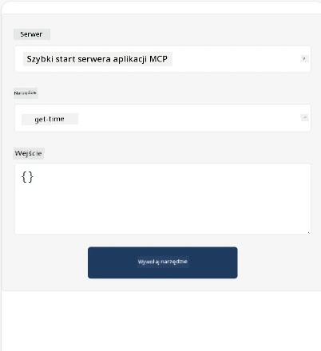
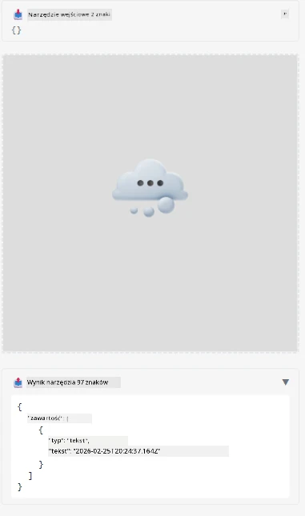

Oto przykład demonstrujący aplikację MCP

## Instalacja

1. Przejdź do folderu *mcp-app*
1. Uruchom `npm install`, co powinno zainstalować zależności frontendowe i backendowe

Sprawdź, czy backend się kompiluje, uruchamiając:

```sh
npx tsc --noEmit
```

Nie powinno być żadnego wyjścia, jeśli wszystko jest w porządku.

## Uruchom backend

> To wymaga trochę dodatkowej pracy, jeśli używasz maszyny z Windows, ponieważ rozwiązanie MCP Apps używa biblioteki `concurrently`, dla której musisz znaleźć zamiennik. Oto problematyczna linia w *package.json* aplikacji MCP:

    ```json
    "start": "concurrently \"cross-env NODE_ENV=development INPUT=mcp-app.html vite build --watch\" \"tsx watch main.ts\""
    ```

Aplikacja składa się z dwóch części, części backendowej i części hosta.

Uruchom backend, wywołując:

```sh
npm start
```

To powinno uruchomić backend pod adresem `http://localhost:3001/mcp`.

> Uwaga, jeśli pracujesz w Codespace, może być konieczne ustawienie widoczności portu na publiczną. Sprawdź, czy możesz uzyskać dostęp do punktu końcowego w przeglądarce przez https://<nazwa Codespace>.app.github.dev/mcp

## Opcja -1- Przetestuj aplikację w Visual Studio Code

Aby przetestować rozwiązanie w Visual Studio Code, wykonaj następujące czynności:

- Dodaj wpis serwera do `mcp.json` w ten sposób:

    ```json
    {
        "servers": {
            "my-mcp-server-7178eca7": {
                "url": "http://localhost:3001/mcp",
                "type": "http"
            }
        },
        "inputs": []
    }
    ```

1. Kliknij przycisk "start" w *mcp.json*
1. Upewnij się, że okno czatu jest otwarte i wpisz `get-faq`, powinieneś zobaczyć wynik jak poniżej:

    

## Opcja -2- Przetestuj aplikację z hostem

Repozytorium <https://github.com/modelcontextprotocol/ext-apps> zawiera kilka różnych hostów, których możesz użyć do przetestowania swoich aplikacji MVP.

Przedstawimy tu dwie różne opcje:

### Lokalna maszyna

- Przejdź do *ext-apps* po sklonowaniu repozytorium.

- Zainstaluj zależności

   ```sh
   npm install
   ```

- W osobnym oknie terminala przejdź do *ext-apps/examples/basic-host*

    > jeśli używasz Codespace, musisz przejść do pliku serve.ts i linijki 27 i zamienić http://localhost:3001/mcp na adres URL Codespace dla backendu, na przykład https://psychic-xylophone-657rpjgvxpc5g64-3001.app.github.dev/mcp

- Uruchom hosta:

    ```sh
    npm start
    ```

    To powinno połączyć hosta z backendem i powinieneś zobaczyć działającą aplikację jak poniżej:

    

### Codespace

Wymaga to trochę dodatkowej pracy, aby środowisko Codespace działało poprawnie. Aby użyć hosta przez Codespace:

- Sprawdź katalog *ext-apps* i przejdź do *examples/basic-host*.
- Uruchom `npm install`, aby zainstalować zależności.
- Uruchom `npm start`, aby uruchomić hosta.

## Przetestuj aplikację

Wypróbuj aplikację w następujący sposób:

- Wybierz przycisk "Call Tool" i powinieneś zobaczyć wyniki jak poniżej:

    

Świetnie, wszystko działa.

---

<!-- CO-OP TRANSLATOR DISCLAIMER START -->
**Zastrzeżenie**:
Niniejszy dokument został przetłumaczony za pomocą usługi tłumaczenia AI [Co-op Translator](https://github.com/Azure/co-op-translator). Chociaż dokładamy starań, aby tłumaczenie było jak najbardziej precyzyjne, prosimy pamiętać, że automatyczne tłumaczenia mogą zawierać błędy lub nieścisłości. Oryginalny dokument w jego języku źródłowym należy traktować jako źródło wiążące. W przypadku informacji krytycznych zalecane jest skorzystanie z profesjonalnego tłumaczenia wykonanego przez człowieka. Nie ponosimy odpowiedzialności za jakiekolwiek nieporozumienia lub błędne interpretacje wynikające z korzystania z tego tłumaczenia.
<!-- CO-OP TRANSLATOR DISCLAIMER END -->