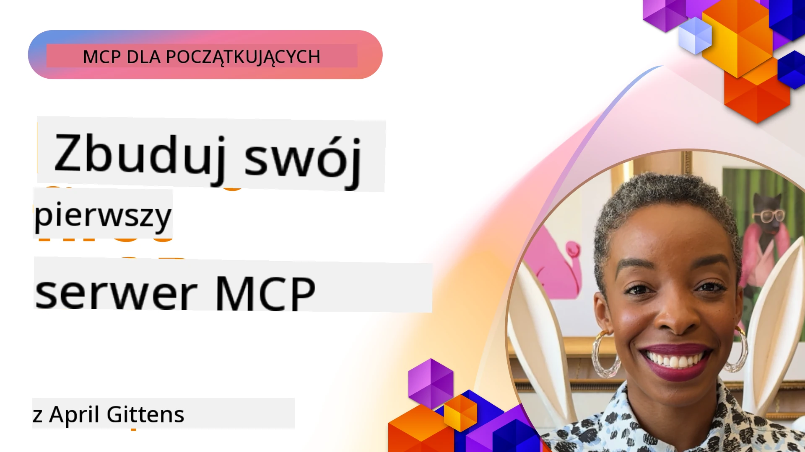

## Rozpoczęcie  

_(Kliknij obraz powyżej, aby oglądać wideo z tej lekcji)_

Ta sekcja składa się z kilku lekcji:

- **1 Twój pierwszy serwer**, w tej pierwszej lekcji nauczysz się, jak stworzyć swój pierwszy serwer i sprawdzić go narzędziem inspektora, co jest cennym sposobem na testowanie i debugowanie serwera, [do lekcji](01-first-server/README.md)

- **2 Klient**, w tej lekcji nauczysz się, jak napisać klienta, który może połączyć się z twoim serwerem, [do lekcji](02-client/README.md)

- **3 Klient z LLM**, jeszcze lepszym sposobem pisania klienta jest dodanie do niego LLM, aby mógł „negocjować” z twoim serwerem, co robić, [do lekcji](03-llm-client/README.md)

- **4 Konsumpcja trybu agenta GitHub Copilot serwera w Visual Studio Code**. Tutaj patrzymy na uruchamianie naszego serwera MCP z poziomu Visual Studio Code, [do lekcji](04-vscode/README.md)

- **5 Serwer transportu stdio**. Transport stdio jest rekomendowanym standardem dla lokalnej komunikacji serwer-klient MCP, zapewniając bezpieczną komunikację na bazie podprocesów z wbudowaną izolacją procesów [do lekcji](05-stdio-server/README.md)

- **6 Strumieniowanie HTTP z MCP (Strumieniowalny HTTP)**. Poznaj nowoczesny transport HTTP do strumieniowania (zalecany sposób dla zdalnych serwerów MCP zgodnie z [Specyfikacją MCP 2025-11-25](https://spec.modelcontextprotocol.io/specification/2025-11-25/basic/transports/#streamable-http)), powiadomienia o postępach oraz jak wdrażać skalowalne, działające w czasie rzeczywistym serwery i klientów MCP za pomocą Strumieniowalnego HTTP. [do lekcji](06-http-streaming/README.md)

- **7 Wykorzystanie zestawu narzędzi AI dla VSCode** do konsumowania i testowania twoich klientów i serwerów MCP [do lekcji](07-aitk/README.md)

- **8 Testowanie**. Skoncentrujemy się tutaj zwłaszcza na tym, jak testować nasz serwer i klienta na różne sposoby, [do lekcji](08-testing/README.md)

- **9 Wdrażanie**. Ten rozdział omawia różne sposoby wdrażania twoich rozwiązań MCP, [do lekcji](09-deployment/README.md)

- **10 Zaawansowane użycie serwera**. Ten rozdział obejmuje zaawansowane użycie serwera, [do lekcji](./10-advanced/README.md)

- **11 Auth**. Ten rozdział pokazuje, jak dodać proste uwierzytelnianie, od Basic Auth po użycie JWT i RBAC. Zachęcamy do rozpoczęcia tutaj, a następnie zapoznania się z tematami zaawansowanymi w rozdziale 5 oraz wykonania dodatkowego wzmacniania bezpieczeństwa zgodnie z zaleceniami w rozdziale 2, [do lekcji](./11-simple-auth/README.md)

- **12 Hosty MCP**. Konfiguracja i użycie popularnych klientów hostów MCP takich jak Claude Desktop, Cursor, Cline i Windsurf. Poznaj typy transportów i rozwiązywanie problemów, [do lekcji](./12-mcp-hosts/README.md)

- **13 Inspektor MCP**. Debugowanie i testowanie twoich serwerów MCP interaktywnie przy użyciu narzędzia inspektora MCP. Naucz się rozwiązywać problemy z narzędziami, zasobami i komunikatami protokołu, [do lekcji](./13-mcp-inspector/README.md)

- **14 Próbkowanie**. Twórz serwery MCP współpracujące z klientami MCP przy zadaniach związanych z LLM. [do lekcji](./14-sampling/README.md)

- **15 Aplikacje MCP**. Buduj serwery MCP, które także odpowiadają instrukcjami UI, [do lekcji](./15-mcp-apps/README.md)

Protokół Model Context (MCP) to otwarty protokół standaryzujący sposób, w jaki aplikacje dostarczają kontekst modelom LLM. Można go porównać do portu USB-C dla aplikacji AI - zapewnia ustandaryzowany sposób łączenia modeli AI z różnymi źródłami danych i narzędziami.

## Cele nauki

Do końca tej lekcji będziesz potrafić:

- Skonfigurować środowiska programistyczne dla MCP w C#, Javie, Pythonie, TypeScript i JavaScript
- Budować i wdrażać podstawowe serwery MCP z niestandardowymi funkcjami (zasoby, zapytania i narzędzia)
- Tworzyć aplikacje hostujące łączące się z serwerami MCP
- Testować i debugować implementacje MCP
- Rozumieć powszechne wyzwania konfiguracyjne i ich rozwiązania
- Łączyć swoje implementacje MCP z popularnymi usługami LLM

## Konfigurowanie środowiska MCP

Zanim zaczniesz pracować z MCP, ważne jest przygotowanie środowiska programistycznego i zrozumienie podstawowego przebiegu pracy. Ta sekcja przeprowadzi cię przez pierwsze kroki konfiguracji, aby zapewnić płynny start z MCP.

### Wymagania wstępne

Przed rozpoczęciem pracy z MCP upewnij się, że masz:

- **Środowisko programistyczne**: dla wybranego języka (C#, Java, Python, TypeScript lub JavaScript)
- **IDE/Edytor**: Visual Studio, Visual Studio Code, IntelliJ, Eclipse, PyCharm lub dowolny nowoczesny edytor kodu
- **Menadżery pakietów**: NuGet, Maven/Gradle, pip lub npm/yarn
- **Klucze API**: dla dowolnych usług AI, które zamierzasz wykorzystać w aplikacjach hostujących

### Oficjalne SDK

W nadchodzących rozdziałach zobaczysz rozwiązania budowane przy użyciu Pythona, TypeScript, Javy i .NET. Poniżej znajdują się wszystkie oficjalnie wspierane SDK.

MCP udostępnia oficjalne SDK dla wielu języków (zgodne z [Specyfikacją MCP 2025-11-25](https://spec.modelcontextprotocol.io/specification/2025-11-25/)):
- [C# SDK](https://github.com/modelcontextprotocol/csharp-sdk) - Utrzymywane we współpracy z Microsoft
- [Java SDK](https://github.com/modelcontextprotocol/java-sdk) - Utrzymywane we współpracy ze Spring AI
- [TypeScript SDK](https://github.com/modelcontextprotocol/typescript-sdk) - Oficjalna implementacja TypeScript
- [Python SDK](https://github.com/modelcontextprotocol/python-sdk) - Oficjalna implementacja Python (FastMCP)
- [Kotlin SDK](https://github.com/modelcontextprotocol/kotlin-sdk) - Oficjalna implementacja Kotlin
- [Swift SDK](https://github.com/modelcontextprotocol/swift-sdk) - Utrzymywane we współpracy z Loopwork AI
- [Rust SDK](https://github.com/modelcontextprotocol/rust-sdk) - Oficjalna implementacja Rust
- [Go SDK](https://github.com/modelcontextprotocol/go-sdk) - Oficjalna implementacja Go

## Kluczowe wnioski

- Konfiguracja środowiska programistycznego MCP jest prosta dzięki SDK dedykowanym dla poszczególnych języków
- Tworzenie serwerów MCP wymaga tworzenia i rejestrowania narzędzi z jasnymi schematami
- Klienci MCP łączą się z serwerami i modelami, aby korzystać z rozszerzonych możliwości
- Testowanie i debugowanie są kluczowe dla niezawodnych implementacji MCP
- Opcje wdrożenia obejmują od lokalnego rozwoju do rozwiązań chmurowych

## Praktyka

Posiadamy zestaw przykładów uzupełniających ćwiczenia, które zobaczysz we wszystkich rozdziałach tej sekcji. Dodatkowo każdy rozdział ma własne ćwiczenia i zadania.

- [Kalkulator Java](./samples/java/calculator/README.md)
- [Kalkulator .Net](../../../03-GettingStarted/samples/csharp)
- [Kalkulator JavaScript](./samples/javascript/README.md)
- [Kalkulator TypeScript](./samples/typescript/README.md)
- [Kalkulator Python](../../../03-GettingStarted/samples/python)

## Dodatkowe zasoby

- [Budowanie agentów przy użyciu Model Context Protocol na Azure](https://learn.microsoft.com/azure/developer/ai/intro-agents-mcp)
- [Zdalny MCP z Azure Container Apps (Node.js/TypeScript/JavaScript)](https://learn.microsoft.com/samples/azure-samples/mcp-container-ts/mcp-container-ts/)
- [.NET OpenAI MCP Agent](https://learn.microsoft.com/samples/azure-samples/openai-mcp-agent-dotnet/openai-mcp-agent-dotnet/)

## Co dalej

Rozpocznij od pierwszej lekcji: [Tworzenie twojego pierwszego serwera MCP](01-first-server/README.md)

Po ukończeniu tego modułu kontynuuj: [Moduł 4: Praktyczna Implementacja](../04-PracticalImplementation/README.md)

---

<!-- CO-OP TRANSLATOR DISCLAIMER START -->
**Zastrzeżenie**:  
Ten dokument został przetłumaczony przy użyciu usługi tłumaczenia AI [Co-op Translator](https://github.com/Azure/co-op-translator). Chociaż staramy się o dokładność, prosimy pamiętać, że automatyczne tłumaczenia mogą zawierać błędy lub nieścisłości. Oryginalny dokument w języku źródłowym powinien być uznawany za dokument nadrzędny. W przypadku informacji krytycznych zaleca się skorzystanie z profesjonalnego tłumaczenia wykonanego przez człowieka. Nie ponosimy odpowiedzialności za jakiekolwiek nieporozumienia lub błędne interpretacje wynikłe z korzystania z tego tłumaczenia.
<!-- CO-OP TRANSLATOR DISCLAIMER END -->