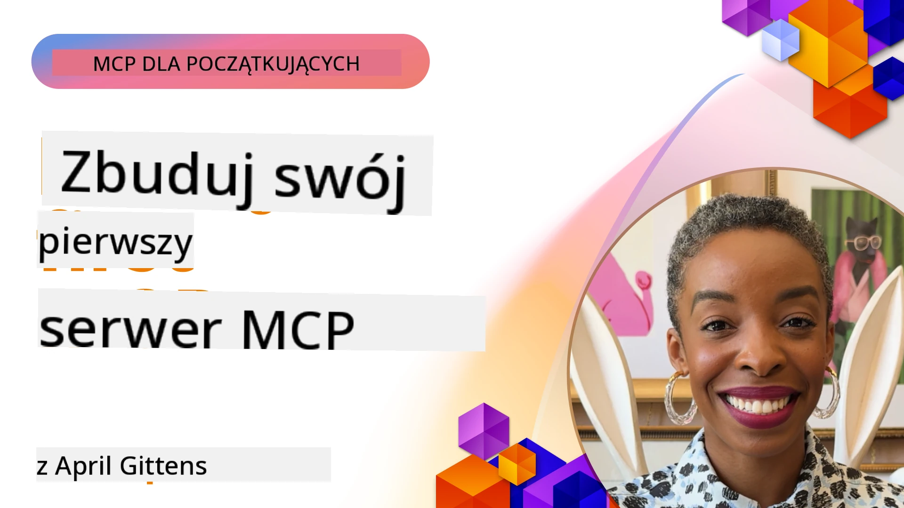

## Rozpoczęcie  

_(Kliknij powyższy obraz, aby obejrzeć wideo z tej lekcji)_

Ta sekcja składa się z kilku lekcji:

- **1 Twój pierwszy serwer**, w tej pierwszej lekcji nauczysz się jak stworzyć swój pierwszy serwer i zbadać go za pomocą narzędzia inspektora, cennego sposobu testowania i debugowania twojego serwera, [do lekcji](01-first-server/README.md)

- **2 Klient**, w tej lekcji nauczysz się jak napisać klienta, który może połączyć się z twoim serwerem, [do lekcji](02-client/README.md)

- **3 Klient z LLM**, jeszcze lepszym sposobem pisania klienta jest dodanie do niego LLM, aby mógł "negocjować" z twoim serwerem co ma robić, [do lekcji](03-llm-client/README.md)

- **4 Konsumpcja trybu agenta GitHub Copilot serwera w Visual Studio Code**. Tutaj patrzymy na uruchamianie naszego serwera MCP z poziomu Visual Studio Code, [do lekcji](04-vscode/README.md)

- **5 Serwer transportu stdio** stdio transport to zalecany standard dla lokalnej komunikacji serwer-klient MCP, zapewniając bezpieczną komunikację opartą na podprocesach z wbudowaną izolacją procesu [do lekcji](05-stdio-server/README.md)

- **6 Streaming HTTP z MCP (Streamable HTTP)**. Dowiedz się o standardowym
	transportcie zdalnym w [Specyfikacji MCP 2026-07-28](https://modelcontextprotocol.io/specification/2026-07-28/basic/transports/streamable-http),
	oraz o zachowanej implementacji sesyjnej typu dziedziczonego w lekcji.
	[do lekcji](06-http-streaming/README.md)

- **7 Wykorzystanie zestawu narzędzi AI dla VSCode** do konsumpcji i testowania twoich klientów i serwerów MCP [do lekcji](07-aitk/README.md)

- **8 Testowanie**. Skupimy się tutaj szczególnie na tym, jak możemy testować nasz serwer i klienta na różne sposoby, [do lekcji](08-testing/README.md)

- **9 Wdrożenie**. Ten rozdział pokaże różne sposoby wdrażania twoich rozwiązań MCP, [do lekcji](09-deployment/README.md)

- **10 Zaawansowane wykorzystanie serwera**. Ten rozdział obejmuje zaawansowane użycie serwera, [do lekcji](./10-advanced/README.md)

- **11 Uwierzytelnianie**. Ten rozdział omawia jak dodać proste uwierzytelnianie, od Basic Auth do użycia JWT i RBAC. Zaleca się zacząć tutaj, a następnie spojrzeć na Zaawansowane Tematy w Rozdziale 5 i wykonać dodatkowe utwardzanie bezpieczeństwa według zaleceń w Rozdziale 2, [do lekcji](./11-simple-auth/README.md)

- **12 Hosty MCP**. Konfiguracja i użycie popularnych klientów hostów MCP, w tym Claude Desktop, Cursor, Cline i Windsurf. Poznaj typy transportu i rozwiązywanie problemów, [do lekcji](./12-mcp-hosts/README.md)

- **13 Inspektor MCP**. Debuguj i testuj swoje serwery MCP interaktywnie za pomocą narzędzia inspektora MCP. Naucz się rozwiązywać problemy z narzędziami, zasobami i komunikatami protokołu, [do lekcji](./13-mcp-inspector/README.md)

- **14 Próbkowanie**. Poznaj przestarzałą prymitywę Próbkowania dla `2025-11-25` oraz
	jak migrować nowe projekty do bezpośredniej integracji dostawcy LLM. Próbkowanie jest
	przestarzałe w MCP `2026-07-28`. [do lekcji](./14-sampling/README.md)

- **15 Aplikacje MCP**. Buduj serwery MCP, które również odpowiadają instrukcjami UI, [do lekcji](./15-mcp-apps/README.md)

Protokół Model Context (MCP) jest otwartym protokołem, który standaryzuje sposób, w jaki aplikacje dostarczają kontekst modelom LLM. Pomyśl o MCP jak o porcie USB-C dla aplikacji AI - zapewnia ustandaryzowany sposób łączenia modeli AI z różnymi źródłami danych i narzędziami.

## Cele nauki

Po ukończeniu tej lekcji będziesz potrafić:

- Skonfigurować środowiska programistyczne dla MCP w C#, Javie, Pythonie, TypeScript i JavaScript
- Budować i wdrażać podstawowe serwery MCP z niestandardowymi funkcjami (zasoby, podpowiedzi i narzędzia)
- Tworzyć aplikacje hostów, które łączą się z serwerami MCP
- Testować i debugować implementacje MCP
- Rozumieć typowe wyzwania podczas konfiguracji i ich rozwiązania
- Łączyć swoje implementacje MCP z popularnymi usługami LLM

## Konfiguracja środowiska MCP

Zanim zaczniesz pracę z MCP, ważne jest przygotowanie środowiska programistycznego i zrozumienie podstawowego przebiegu pracy. Ta sekcja poprowadzi Cię przez pierwsze kroki konfiguracji, aby zapewnić płynny start z MCP.

### Wymagania wstępne

Zanim zaczniesz rozwijać MCP, upewnij się, że masz:

- **Środowisko programistyczne**: dla wybranego języka (C#, Java, Python, TypeScript lub JavaScript)
- **IDE/Edytor**: Visual Studio, Visual Studio Code, IntelliJ, Eclipse, PyCharm lub dowolny nowoczesny edytor kodu
- **Menadżery pakietów**: NuGet, Maven/Gradle, pip lub npm/yarn
- **Klucze API**: dla jakichkolwiek usług AI, które planujesz używać w swoich aplikacjach hosta

### Oficjalne SDK

W nadchodzących rozdziałach zobaczysz rozwiązania zbudowane w Pythonie, TypeScript,
Javie i .NET. Oto oficjalne SDK.

Wsparcie SDK dla MCP `2026-07-28` jest wprowadzane niezależnie w zależności od języka.
Przed uruchomieniem przykładu sprawdź wersję pakietu i notatki wydania SDK
dla obsługiwanych rewizji protokołu. Zobacz
[oficjalną listę SDK](https://modelcontextprotocol.io/docs/sdk):
- [C# SDK](https://github.com/modelcontextprotocol/csharp-sdk) - Utrzymywane we współpracy z Microsoft
- [Java SDK](https://github.com/modelcontextprotocol/java-sdk) - Utrzymywane we współpracy ze Spring AI
- [TypeScript SDK](https://github.com/modelcontextprotocol/typescript-sdk) - Oficjalna implementacja TypeScript
- [Python SDK](https://github.com/modelcontextprotocol/python-sdk) - Oficjalna implementacja Python (FastMCP)
- [Kotlin SDK](https://github.com/modelcontextprotocol/kotlin-sdk) - Oficjalna implementacja Kotlin
- [Swift SDK](https://github.com/modelcontextprotocol/swift-sdk) - Utrzymywane we współpracy z Loopwork AI
- [Rust SDK](https://github.com/modelcontextprotocol/rust-sdk) - Oficjalna implementacja Rust
- [Go SDK](https://github.com/modelcontextprotocol/go-sdk) - Oficjalna implementacja Go

## Kluczowe wnioski

- Konfiguracja środowiska programistycznego MCP jest prosta dzięki SDK specyficznym dla języków
- Budowa serwerów MCP polega na tworzeniu i rejestrowaniu narzędzi z jasnymi schematami
- Klienci MCP łączą się z serwerami i modelami, aby wykorzystać rozszerzone możliwości
- Testowanie i debugging są niezbędne dla niezawodnych implementacji MCP
- Opcje wdrażania obejmują rozwój lokalny i rozwiązania oparte na chmurze

## Praktyka

Posiadamy zestaw przykładowych kodów uzupełniających ćwiczenia, które zobaczysz we wszystkich rozdziałach tej sekcji. Dodatkowo każdy rozdział ma własne ćwiczenia i zadania

- [Kalkulator Java](./samples/java/calculator/README.md)
- [Kalkulator .NET](../../../03-GettingStarted/samples/csharp)
- [Kalkulator JavaScript](./samples/javascript/README.md)
- [Kalkulator TypeScript](./samples/typescript/README.md)
- [Kalkulator Python](../../../03-GettingStarted/samples/python)

## Dodatkowe zasoby

- [Budowanie agentów z użyciem Model Context Protocol na Azure](https://learn.microsoft.com/azure/developer/ai/intro-agents-mcp)
- [Zdalny MCP z Azure Container Apps (Node.js/TypeScript/JavaScript)](https://learn.microsoft.com/samples/azure-samples/mcp-container-ts/mcp-container-ts/)
- [Agenci MCP OpenAI w .NET](https://learn.microsoft.com/samples/azure-samples/openai-mcp-agent-dotnet/openai-mcp-agent-dotnet/)

## Co dalej

Zacznij od pierwszej lekcji: [Tworzenie twojego pierwszego serwera MCP](01-first-server/README.md)

Po ukończeniu tego modułu przejdź do: [Moduł 4: Praktyczna implementacja](../04-PracticalImplementation/README.md)

---

<!-- CO-OP TRANSLATOR DISCLAIMER START -->
**Zastrzeżenie**:
Niniejszy dokument został przetłumaczony za pomocą usługi tłumaczenia AI [Co-op Translator](https://github.com/Azure/co-op-translator). Choć dążymy do dokładności, prosimy pamiętać, że automatyczne tłumaczenia mogą zawierać błędy lub niedokładności. Oryginalny dokument w jego języku źródłowym należy uznawać za autorytatywne źródło. W przypadku informacji krytycznych zalecane jest skorzystanie z profesjonalnego tłumaczenia wykonanego przez człowieka. Nie ponosimy odpowiedzialności za jakiekolwiek nieporozumienia lub błędne interpretacje wynikające z użycia tego tłumaczenia.
<!-- CO-OP TRANSLATOR DISCLAIMER END -->