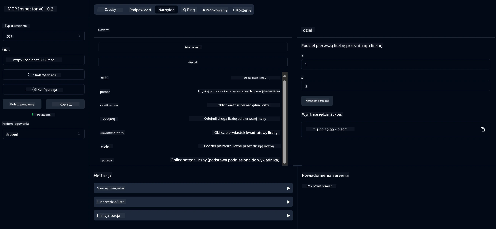

# Podstawowa usługa kalkulatora MCP

> [!NOTE]
> Ten przykład korzysta z legacy transportu HTTP+SSE i jest skierowany do SDK kompatybilnego
> z MCP `2025-11-25`. Nowe zdalne serwery powinny używać `2026-07-28` Streamable
> wsparcia HTTP.

Ta usługa zapewnia podstawowe operacje kalkulatora za pomocą protokołu Model Context Protocol (MCP) wykorzystując Spring Boot z transportem WebFlux. Została zaprojektowana jako prosty przykład dla początkujących uczących się implementacji MCP.

Więcej informacji znajduje się w dokumentacji referencyjnej [MCP Server Boot Starter](https://docs.spring.io/spring-ai/reference/api/mcp/mcp-server-boot-starter-docs.html).

## Przegląd

Usługa demonstruje:
- Wsparcie dla SSE (Server-Sent Events)
- Automatyczną rejestrację narzędzi z użyciem adnotacji `@Tool` Spring AI
- Podstawowe funkcje kalkulatora:
  - Dodawanie, odejmowanie, mnożenie, dzielenie
  - Obliczanie potęgi i pierwiastka kwadratowego
  - Moduł (reszta z dzielenia) i wartość bezwzględna
  - Funkcja pomocy do opisów operacji

## Funkcje

Ta usługa kalkulatora oferuje następujące możliwości:

1. **Podstawowe operacje arytmetyczne**:
   - Dodawanie dwóch liczb
   - Odejmowanie jednej liczby od drugiej
   - Mnożenie dwóch liczb
   - Dzielenie jednej liczby przez drugą (z kontrolą dzielenia przez zero)

2. **Operacje zaawansowane**:
   - Obliczanie potęgi (podnoszenie podstawy do wykładnika)
   - Obliczanie pierwiastka kwadratowego (z kontrolą ujemnej liczby)
   - Obliczanie modułu (reszty z dzielenia)
   - Obliczanie wartości bezwzględnej

3. **System pomocy**:
   - Wbudowana funkcja pomocy wyjaśniająca wszystkie dostępne operacje

## Korzystanie z usługi

Usługa udostępnia następujące endpointy API przez protokół MCP:

- `add(a, b)`: Dodaje dwie liczby
- `subtract(a, b)`: Odejmuje drugą liczbę od pierwszej
- `multiply(a, b)`: Mnoży dwie liczby
- `divide(a, b)`: Dzieli pierwszą liczbę przez drugą (z kontrolą dzielenia przez zero)
- `power(base, exponent)`: Oblicza potęgę liczby
- `squareRoot(number)`: Oblicza pierwiastek kwadratowy (z kontrolą ujemnej liczby)
- `modulus(a, b)`: Oblicza resztę z dzielenia
- `absolute(number)`: Oblicza wartość bezwzględną
- `help()`: Pobiera informacje o dostępnych operacjach

## Klient testowy

Prosty klient testowy znajduje się w pakiecie `com.microsoft.mcp.sample.client`. Klasa `SampleCalculatorClient` demonstruje dostępne operacje usługi kalkulatora.

## Korzystanie z klienta LangChain4j

Projekt zawiera przykładowego klienta LangChain4j w `com.microsoft.mcp.sample.client.LangChain4jClient`, który pokazuje, jak zintegrować usługę kalkulatora z LangChain4j i modelami GitHub:

### Wymagania wstępne

1. **Konfiguracja tokena GitHub**:
   
   Aby korzystać z modeli AI GitHub (np. phi-4), potrzebujesz osobisty token dostępu GitHub:

   a. Przejdź do ustawień swojego konta GitHub: https://github.com/settings/tokens
   
   b. Kliknij "Generate new token" → "Generate new token (classic)"
   
   c. Nadaj tokenowi opisową nazwę
   
   d. Wybierz następujące zakresy:
      - `repo` (pełna kontrola nad prywatnymi repozytoriami)
      - `read:org` (odczyt członkostwa w organizacji i zespołach, odczyt projektów organizacji)
      - `gist` (tworzenie gistów)
      - `user:email` (dostęp do adresów e-mail użytkownika (tylko do odczytu))
   
   e. Kliknij "Generate token" i skopiuj nowy token
   
   f. Ustaw token jako zmienną środowiskową:
      
      W Windows:
      ```
      set GITHUB_TOKEN=your-github-token
      ```
      
      W macOS/Linux:
      ```bash
      export GITHUB_TOKEN=your-github-token
      ```

   g. Aby ustawić na stałe, dodaj do zmiennych środowiskowych w ustawieniach systemu

2. Dodaj zależność LangChain4j GitHub do swojego projektu (już zawarta w pom.xml):
   ```xml
   <dependency>
       <groupId>dev.langchain4j</groupId>
       <artifactId>langchain4j-github</artifactId>
       <version>${langchain4j.version}</version>
   </dependency>
   ```

3. Upewnij się, że serwer kalkulatora działa na `localhost:8080`

### Uruchamianie klienta LangChain4j

Ten przykład demonstruje:
- Połączenie z serwerem MCP kalkulatora przez transport SSE
- Użycie LangChain4j do stworzenia chatbota wykorzystującego operacje kalkulatora
- Integrację z modelami AI GitHub (obecnie model phi-4)

Klient wysyła następujące przykładowe zapytania, aby pokazać działanie:
1. Obliczanie sumy dwóch liczb
2. Znalezienie pierwiastka kwadratowego liczby
3. Pobranie informacji pomocy o dostępnych operacjach kalkulatora

Uruchom przykład i sprawdź wyjście konsoli, aby zobaczyć, jak model AI wykorzystuje narzędzia kalkulatora do odpowiedzi na zapytania.

### Konfiguracja modelu GitHub

Klient LangChain4j jest skonfigurowany do używania modelu phi-4 GitHub z następującymi ustawieniami:

```java
ChatLanguageModel model = GitHubChatModel.builder()
    .apiKey(System.getenv("GITHUB_TOKEN"))
    .timeout(Duration.ofSeconds(60))
    .modelName("phi-4")
    .logRequests(true)
    .logResponses(true)
    .build();
```

Aby użyć innych modeli GitHub, po prostu zmień parametr `modelName` na inny obsługiwany model (np. "claude-3-haiku-20240307", "llama-3-70b-8192" itd.).

## Zależności

Projekt wymaga następujących kluczowych zależności:

```xml
<!-- For MCP Server -->
<dependency>
    <groupId>org.springframework.ai</groupId>
    <artifactId>spring-ai-starter-mcp-server-webflux</artifactId>
</dependency>

<!-- For LangChain4j integration -->
<dependency>
    <groupId>dev.langchain4j</groupId>
    <artifactId>langchain4j-mcp</artifactId>
    <version>${langchain4j.version}</version>
</dependency>

<!-- For GitHub models support -->
<dependency>
    <groupId>dev.langchain4j</groupId>
    <artifactId>langchain4j-github</artifactId>
    <version>${langchain4j.version}</version>
</dependency>
```

## Budowanie projektu

Zbuduj projekt używając Maven:
```bash
./mvnw clean install -DskipTests
```

## Uruchamianie serwera

### Użycie Java

```bash
java -jar target/calculator-server-0.0.1-SNAPSHOT.jar
```

### Użycie MCP Inspector

MCP Inspector to przydatne narzędzie do interakcji z usługami MCP. Aby użyć go z tą usługą kalkulatora:

1. **Zainstaluj i uruchom MCP Inspector** w nowym oknie terminala:
   ```bash
   npx @modelcontextprotocol/inspector
   ```

2. **Uzyskaj dostęp do interfejsu webowego** klikając URL wyświetlony przez aplikację (zwykle http://localhost:6274)

3. **Skonfiguruj połączenie**:
   - Ustaw typ transportu na "SSE"
   - Ustaw URL na endpoint SSE działającego serwera: `http://localhost:8080/sse`
   - Kliknij "Connect"

4. **Używaj narzędzi**:
   - Kliknij "List Tools", aby zobaczyć dostępne operacje kalkulatora
   - Wybierz narzędzie i kliknij "Run Tool", aby wykonać operację



### Użycie Docker

Projekt zawiera plik Dockerfile do wdrożenia w kontenerze:

1. **Zbuduj obraz Dockera**:
   ```bash
   docker build -t calculator-mcp-service .
   ```

2. **Uruchom kontener Dockera**:
   ```bash
   docker run -p 8080:8080 calculator-mcp-service
   ```

To spowoduje:
- Zbudowanie wieloetapowego obrazu Dockera z Maven 3.9.9 i Eclipse Temurin 24 JDK
- Utworzenie zoptymalizowanego obrazu kontenera
- Udostępnienie usługi na porcie 8080
- Uruchomienie usługi MCP kalkulatora w kontenerze

Możesz uzyskać dostęp do usługi pod adresem `http://localhost:8080` po uruchomieniu kontenera.

## Rozwiązywanie problemów

### Typowe problemy z tokenem GitHub

1. **Problemy z uprawnieniami tokena**: Jeśli otrzymujesz błąd 403 Forbidden, sprawdź, czy token ma właściwe uprawnienia, jak podano w wymaganiach wstępnych.

2. **Token nie znaleziony**: Jeśli pojawia się błąd "No API key found", upewnij się, że zmienna środowiskowa GITHUB_TOKEN jest poprawnie ustawiona.

3. **Limitowanie liczby zapytań**: GitHub API ma limity zapytań. Jeśli napotkasz błąd limitu (kod 429), odczekaj kilka minut przed ponowną próbą.

4. **Wygasanie tokena**: Tokeny GitHub mogą wygasać. Jeśli po pewnym czasie pojawią się błędy autentykacji, wygeneruj nowy token i zaktualizuj zmienną środowiskową.

Jeśli potrzebujesz dalszej pomocy, sprawdź [dokumentację LangChain4j](https://github.com/langchain4j/langchain4j) lub [dokumentację GitHub API](https://docs.github.com/en/rest).

---

<!-- CO-OP TRANSLATOR DISCLAIMER START -->
**Zastrzeżenie**:
Niniejszy dokument został przetłumaczony za pomocą usługi tłumaczenia AI [Co-op Translator](https://github.com/Azure/co-op-translator). Choć dążymy do dokładności, prosimy pamiętać, że automatyczne tłumaczenia mogą zawierać błędy lub niedokładności. Oryginalny dokument w jego języku źródłowym należy uznawać za autorytatywne źródło. W przypadku informacji krytycznych zalecane jest skorzystanie z profesjonalnego tłumaczenia wykonanego przez człowieka. Nie ponosimy odpowiedzialności za jakiekolwiek nieporozumienia lub błędne interpretacje wynikające z użycia tego tłumaczenia.
<!-- CO-OP TRANSLATOR DISCLAIMER END -->