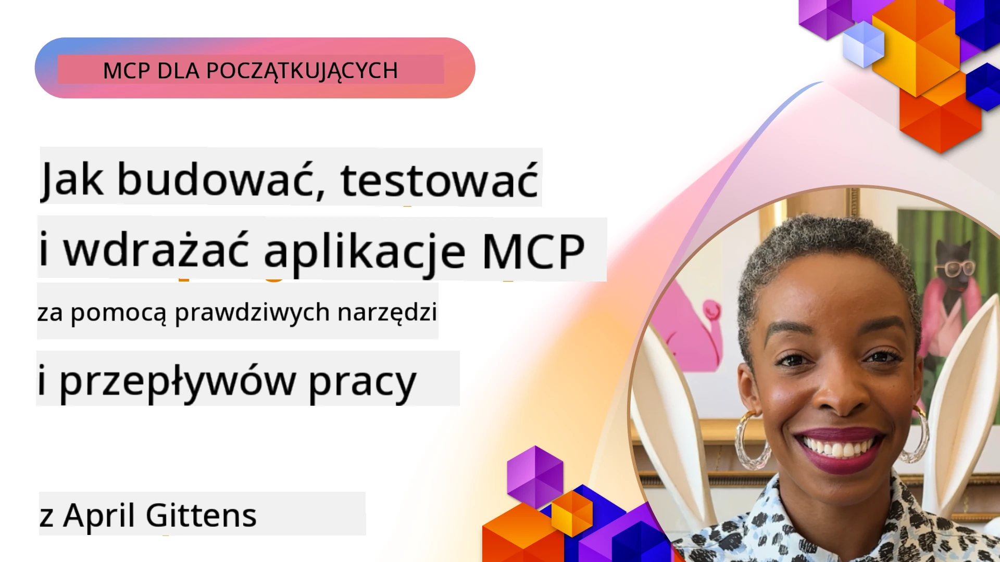

# Praktyczna implementacja

[](https://youtu.be/vCN9-mKBDfQ)

_(Kliknij powyższy obraz, aby obejrzeć wideo z tej lekcji)_

Praktyczna implementacja to moment, w którym moc Model Context Protocol (MCP) staje się namacalna. Chociaż zrozumienie teorii i architektury stojącej za MCP jest ważne, prawdziwa wartość pojawia się, gdy zastosujesz te koncepcje, aby budować, testować i wdrażać rozwiązania rozwiązujące rzeczywiste problemy. Ten rozdział łączy lukę między wiedzą koncepcyjną a praktycznym programowaniem, prowadząc Cię przez proces tworzenia aplikacji opartych na MCP.

Niezależnie od tego, czy rozwijasz inteligentnych asystentów, integrujesz AI z przepływami pracy w biznesie, czy tworzysz niestandardowe narzędzia do przetwarzania danych, MCP zapewnia elastyczną podstawę. Jego językowo-neutralny projekt i oficjalne SDK dla popularnych języków programowania czynią go dostępnym dla szerokiego grona deweloperów. Korzystając z tych SDK, możesz szybko prototypować, iterować i skalować swoje rozwiązania na różnych platformach i środowiskach.

W kolejnych sekcjach znajdziesz praktyczne przykłady, przykładowy kod i strategie wdrażania, które pokazują, jak zaimplementować MCP w C#, Javie ze Springiem, TypeScript, JavaScript i Pythonie. Dowiesz się również, jak debugować i testować swoje serwery MCP, zarządzać API oraz wdrażać rozwiązania w chmurze za pomocą Azure. Te praktyczne zasoby mają na celu przyspieszenie Twojej nauki i pomoc w pewnym budowaniu solidnych, gotowych do produkcji aplikacji MCP.

## Przegląd

Ta lekcja skupia się na praktycznych aspektach implementacji MCP w różnych językach programowania. Przeanalizujemy, jak korzystać z SDK MCP w C#, Javie ze Springiem, TypeScript, JavaScript oraz Pythonie, aby tworzyć solidne aplikacje, debugować i testować serwery MCP oraz tworzyć zasoby, promptsy i narzędzia do wielokrotnego użytku.

## Cele nauki

Po ukończeniu tej lekcji będziesz potrafił:

- Implementować rozwiązania MCP, używając oficjalnych SDK w różnych językach programowania
- Systematycznie debugować i testować serwery MCP
- Tworzyć i wykorzystywać funkcje serwera (Zasoby, Prompty, i Narzędzia)
- Projektować efektywne przepływy pracy MCP dla złożonych zadań
- Optymalizować implementacje MCP pod kątem wydajności i niezawodności

## Oficjalne zasoby SDK

Model Context Protocol oferuje oficjalne SDK dla wielu języków (zgodne ze [specyfikacją MCP z 2025-11-25](https://spec.modelcontextprotocol.io/specification/2025-11-25/)):

- [C# SDK](https://github.com/modelcontextprotocol/csharp-sdk)
- [Java ze Spring SDK](https://github.com/modelcontextprotocol/java-sdk) **Uwaga:** wymaga zależności od [Project Reactor](https://projectreactor.io). (Zobacz [dyskusję issue 246](https://github.com/orgs/modelcontextprotocol/discussions/246).)
- [TypeScript SDK](https://github.com/modelcontextprotocol/typescript-sdk)
- [Python SDK](https://github.com/modelcontextprotocol/python-sdk)
- [Kotlin SDK](https://github.com/modelcontextprotocol/kotlin-sdk)
- [Go SDK](https://github.com/modelcontextprotocol/go-sdk)

## Praca z SDK MCP

Ta sekcja zawiera praktyczne przykłady implementacji MCP w różnych językach programowania. Przykładowy kod znajduje się w katalogu `samples`, zorganizowany według języka.

### Dostępne przykłady

Repozytorium zawiera [przykładowe implementacje](../../../04-PracticalImplementation/samples) w następujących językach:

- [C#](./samples/csharp/README.md)
- [Java ze Springiem](./samples/java/containerapp/README.md)
- [TypeScript](./samples/typescript/README.md)
- [JavaScript](./samples/javascript/README.md)
- [Python](./samples/python/README.md)

Każdy przykład demonstruje kluczowe koncepcje MCP i wzorce implementacji dla konkretnego języka i ekosystemu.

### Praktyczne przewodniki

Dodatkowe przewodniki dla praktycznej implementacji MCP:

- [Paginacja i duże zbiory wyników](./pagination/README.md) – Obsługa paginacji opartej na kursorze dla narzędzi, zasobów i dużych zbiorów danych

## Główne funkcje serwera

Serwery MCP mogą implementować dowolne kombinacje następujących funkcji:

### Zasoby

Zasoby dostarczają kontekst i dane do wykorzystania przez użytkownika lub model AI:

- Repozytoria dokumentów
- Bazy wiedzy
- Źródła danych strukturowanych
- Systemy plików

### Prompty

Prompty to szablonowane wiadomości i przepływy pracy dla użytkowników:

- Predefiniowane szablony rozmów
- Wzory sterowanej interakcji
- Specjalistyczne struktury dialogowe

### Narzędzia

Narzędzia to funkcje do wykonania przez model AI:

- Narzędzia do przetwarzania danych
- Integracje z zewnętrznymi API
- Możliwości obliczeniowe
- Funkcjonalność wyszukiwania

## Przykładowe implementacje: Implementacja w C#

Oficjalne repozytorium SDK C# zawiera kilka przykładów implementacji demonstrujących różne aspekty MCP:

- **Podstawowy klient MCP**: Prosty przykład pokazujący, jak utworzyć klienta MCP i wywołać narzędzia
- **Podstawowy serwer MCP**: Minimalna implementacja serwera z podstawową rejestracją narzędzi
- **Zaawansowany serwer MCP**: Pełnoprawny serwer z rejestracją narzędzi, uwierzytelnianiem i obsługą błędów
- **Integracja z ASP.NET**: Przykłady pokazujące integrację z ASP.NET Core
- **Wzorce implementacji narzędzi**: Różne wzorce implementacji narzędzi o zróżnicowanym poziomie złożoności

SDK MCP dla C# jest w fazie podglądu i API mogą się zmieniać. Będziemy na bieżąco aktualizować ten blog w miarę rozwoju SDK.

### Kluczowe funkcje

- [Nuget MCP C# ModelContextProtocol](https://www.nuget.org/packages/ModelContextProtocol)
- Budowanie [pierwszego serwera MCP](https://devblogs.microsoft.com/dotnet/build-a-model-context-protocol-mcp-server-in-csharp/).

Pełne przykłady implementacji w C# znajdziesz w [oficjalnym repozytorium przykładów SDK C#](https://github.com/modelcontextprotocol/csharp-sdk)

## Przykładowa implementacja: Implementacja w Javie ze Springiem

SDK Java ze Springiem oferuje solidne opcje implementacji MCP z funkcjami klasy korporacyjnej.

### Kluczowe funkcje

- Integracja z Spring Framework
- Silne bezpieczeństwo typów
- Wsparcie programowania reaktywnego
- Kompleksowa obsługa błędów

Dla pełnego przykładu implementacji w Javie ze Springiem zobacz [przykład Java ze Springiem](samples/java/containerapp/README.md) w katalogu przykładów.

## Przykładowa implementacja: Implementacja w JavaScript

SDK JavaScript zapewnia lekkie i elastyczne podejście do implementacji MCP.

### Kluczowe funkcje

- Obsługa Node.js i przeglądarek
- API oparte na obietnicach (Promise)
- Łatwa integracja z Express i innymi frameworkami
- Obsługa WebSocket dla streamingu

Dla pełnego przykładu implementacji w JavaScript zobacz [przykład JavaScript](samples/javascript/README.md) w katalogu przykładów.

## Przykładowa implementacja: Implementacja w Pythonie

SDK Python oferuje pythoniczne podejście do implementacji MCP z doskonałą integracją z frameworkami ML.

### Kluczowe funkcje

- Wsparcie async/await z asyncio
- Integracja z FastAPI
- Prosta rejestracja narzędzi
- Natywna integracja z popularnymi bibliotekami ML

Dla pełnego przykładu implementacji w Pythonie zobacz [przykład Python](samples/python/README.md) w katalogu przykładów.

## Zarządzanie API

Azure API Management to świetne rozwiązanie, które pozwala zabezpieczyć serwery MCP. Pomysł polega na umieszczeniu instancji Azure API Management przed Twoim serwerem MCP i pozwoleniu mu na zarządzanie funkcjami, które prawdopodobnie chcesz mieć, takimi jak:

- ograniczanie szybkości żądań
- zarządzanie tokenami
- monitorowanie
- balansowanie obciążenia
- bezpieczeństwo

### Przykład Azure

Oto przykład Azure realizujący dokładnie to, czyli [tworzenie serwera MCP i zabezpieczanie go za pomocą Azure API Management](https://github.com/Azure-Samples/remote-mcp-apim-functions-python).

Zobacz, jak przebiega przepływ autoryzacji na poniższym obrazie:


Na powyższym obrazie zachodzą następujące procesy:

- Uwierzytelnianie/autoryzacja odbywa się za pomocą Microsoft Entra.
- Azure API Management działa jako brama i stosuje polityki do kierowania i zarządzania ruchem.
- Azure Monitor rejestruje wszystkie żądania do dalszej analizy.

#### Przepływ autoryzacji

Przyjrzyjmy się przepływowi autoryzacji bardziej szczegółowo:


#### Specyfikacja autoryzacji MCP

Dowiedz się więcej o [specyfikacji autoryzacji MCP](https://spec.modelcontextprotocol.io/specification/2025-11-25/basic/authorization/)

## Wdrożenie zdalnego serwera MCP na Azure

Zobaczmy, czy możemy wdrożyć wspomniany wcześniej przykład:

1. Sklonuj repozytorium

    ```bash
    git clone https://github.com/Azure-Samples/remote-mcp-apim-functions-python.git
    cd remote-mcp-apim-functions-python
    ```

1. Zarejestruj dostawcę zasobów `Microsoft.App`.

   - Jeśli używasz Azure CLI, uruchom `az provider register --namespace Microsoft.App --wait`.
   - Jeśli używasz Azure PowerShell, uruchom `Register-AzResourceProvider -ProviderNamespace Microsoft.App`. Następnie po pewnym czasie sprawdź `(Get-AzResourceProvider -ProviderNamespace Microsoft.App).RegistrationState`, czy rejestracja została ukończona.

1. Uruchom to polecenie [azd](https://aka.ms/azd), aby przygotować usługę zarządzania API, aplikację funkcyjną (z kodem) i wszystkie pozostałe wymagane zasoby Azure

    ```shell
    azd up
    ```

    To polecenie powinno wdrożyć wszystkie zasoby chmurowe na Azure

### Testowanie serwera za pomocą MCP Inspector

1. W **nowym oknie terminala** zainstaluj i uruchom MCP Inspector

    ```shell
    npx @modelcontextprotocol/inspector
    ```

    Powinieneś zobaczyć interfejs podobny do:

    

1. Kliknij CTRL, aby załadować aplikację webową MCP Inspector z wyświetlonego URL (np. [http://127.0.0.1:6274/#resources](http://127.0.0.1:6274/#resources))
1. Ustaw typ transportu na `SSE`
1. Ustaw URL na działający punkt końcowy API Management SSE wyświetlony po `azd up` i **Podłącz się**:

    ```shell
    https://<apim-servicename-from-azd-output>.azure-api.net/mcp/sse
    ```

1. **Lista narzędzi**. Kliknij na narzędzie i **Uruchom narzędzie**.  

Jeśli wszystkie kroki się powiodły, powinieneś być teraz połączony z serwerem MCP i udało Ci się wywołać narzędzie.

## Serwery MCP dla Azure

[Remote-mcp-functions](https://github.com/Azure-Samples/remote-mcp-functions-dotnet): Zestaw repozytoriów stanowiących szablon szybkiego startu do budowy i wdrażania niestandardowych zdalnych serwerów MCP (Model Context Protocol) używając Azure Functions w Pythonie, C# .NET lub Node/TypeScript.

Przykłady dostarczają kompletne rozwiązanie, które pozwala deweloperom:

- Budować i uruchamiać lokalnie: rozwijać i debugować serwer MCP na maszynie lokalnej
- Wdrażać na Azure: łatwo wdrażać do chmury za pomocą prostego polecenia azd up
- Łączyć się z klientami: łączyć się z serwerem MCP z różnych klientów, w tym z trybem agenta Copilot w VS Code i narzędziem MCP Inspector

### Kluczowe funkcje

- Bezpieczeństwo już w projekcie: serwer MCP jest zabezpieczony kluczami i HTTPS
- Opcje uwierzytelniania: obsługuje OAuth przez wbudowany system auth i/lub API Management
- Izolacja sieciowa: umożliwia izolację sieciową przy użyciu Azure Virtual Networks (VNET)
- Architektura bezserwerowa: wykorzystuje Azure Functions dla skalowalnego, zdarzeniowego wykonania
- Rozwój lokalny: kompleksowe wsparcie dla lokalnego rozwoju i debugowania
- Proste wdrożenie: uproszczony proces wdrażania na Azure

Repozytorium zawiera wszystkie niezbędne pliki konfiguracyjne, kod źródłowy oraz definicje infrastruktury, aby szybko rozpocząć pracę z implementacją serwera MCP gotowego do produkcji.

- [Azure Remote MCP Functions Python](https://github.com/Azure-Samples/remote-mcp-functions-python) - Przykład implementacji MCP z użyciem Azure Functions z Pythonem

- [Azure Remote MCP Functions .NET](https://github.com/Azure-Samples/remote-mcp-functions-dotnet) - Przykład implementacji MCP z użyciem Azure Functions z C# .NET

- [Azure Remote MCP Functions Node/Typescript](https://github.com/Azure-Samples/remote-mcp-functions-typescript) - Przykład implementacji MCP z użyciem Azure Functions z Node/TypeScript

## Najważniejsze wnioski

- SDK MCP dostarczają narzędzia specyficzne dla języka do implementowania solidnych rozwiązań MCP
- Proces debugowania i testowania jest kluczowy dla niezawodnych aplikacji MCP
- Szablony promptów wielokrotnego użytku umożliwiają spójne interakcje z AI
- Dobrze zaprojektowane przepływy pracy mogą orkiestracować złożone zadania przy użyciu wielu narzędzi
- Implementowanie rozwiązań MCP wymaga uwzględnienia bezpieczeństwa, wydajności i obsługi błędów

## Ćwiczenie

Zaprojektuj praktyczny przepływ pracy MCP, który rozwiązuje rzeczywisty problem z Twojej dziedziny:

1. Zidentyfikuj 3-4 narzędzia, które byłyby przydatne do rozwiązania tego problemu
2. Stwórz diagram przepływu pracy pokazujący, jak narzędzia ze sobą współpracują
3. Zaimplementuj podstawową wersję jednego z narzędzi w wybranym języku
4. Stwórz szablon promptu, który pomoże modelowi skutecznie korzystać z Twojego narzędzia

## Dodatkowe zasoby

---

## Co dalej

Dalej: [Zaawansowane tematy](../05-AdvancedTopics/README.md)

---

<!-- CO-OP TRANSLATOR DISCLAIMER START -->
**Zastrzeżenie**:  
Niniejszy dokument został przetłumaczony za pomocą usługi tłumaczenia AI [Co-op Translator](https://github.com/Azure/co-op-translator). Mimo że staramy się zapewnić dokładność, prosimy pamiętać, że automatyczne tłumaczenia mogą zawierać błędy lub nieścisłości. Oryginalny dokument w jego języku źródłowym powinien być uznawany za wiarygodne źródło. W przypadku ważnych informacji zalecane jest skorzystanie z profesjonalnego, ludzkiego tłumaczenia. Nie ponosimy odpowiedzialności za jakiekolwiek nieporozumienia lub błędne interpretacje wynikające z korzystania z tego tłumaczenia.
<!-- CO-OP TRANSLATOR DISCLAIMER END -->