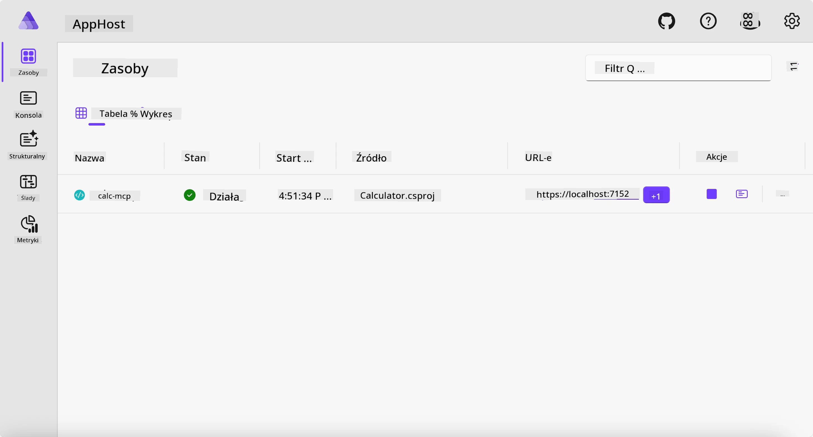
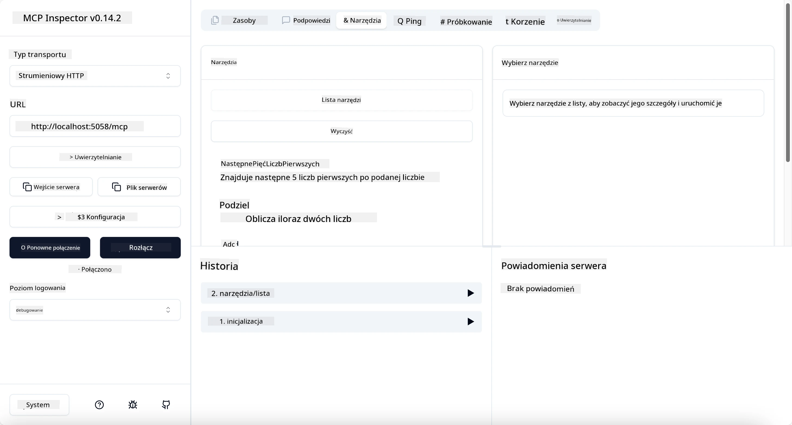
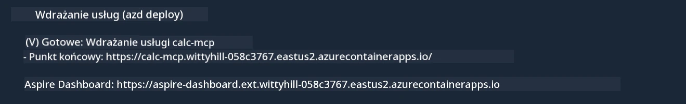

# Przykład

Poprzedni przykład pokazuje, jak używać lokalnego projektu .NET z typem `stdio`. I jak uruchomić serwer lokalnie w kontenerze. To dobre rozwiązanie w wielu sytuacjach. Jednak czasami przydatne jest, aby serwer działał zdalnie, na przykład w środowisku chmurowym. W tym miejscu przydaje się typ `http`.

Patrząc na rozwiązanie w folderze `04-PracticalImplementation`, może wydawać się ono dużo bardziej skomplikowane niż poprzednie. Ale w rzeczywistości tak nie jest. Jeśli przyjrzymy się projektowi `src/Calculator`, zobaczymy, że jest to w większości ten sam kod co w poprzednim przykładzie. Jedyną różnicą jest to, że używamy innej biblioteki `ModelContextProtocol.AspNetCore` do obsługi zapytań HTTP. Zmieniamy też metodę `IsPrime`, żeby była prywatna, tylko po to, by pokazać, że możesz mieć prywatne metody w swoim kodzie. Reszta kodu jest taka sama jak wcześniej.

Pozostałe projekty pochodzą z [Aspire](https://aspire.dev/get-started/what-is-aspire/). Obecność Aspire w rozwiązaniu poprawi doświadczenia programisty podczas tworzenia i testowania oraz pomoże z obserwowalnością. Nie jest to wymagane do uruchomienia serwera, ale dobra praktyka mieć je w swoim rozwiązaniu.

## Uruchom serwer lokalnie

1. W VS Code (z rozszerzeniem C# DevKit) przejdź do katalogu `04-PracticalImplementation/samples/csharp`.
1. Wykonaj następujące polecenie, aby uruchomić serwer:

   ```bash
    dotnet watch run --project ./src/AppHost
   ```

1. Kiedy przeglądarka internetowa otworzy pulpit Aspire, zwróć uwagę na adres URL `http`. Powinien wyglądać mniej więcej tak: `http://localhost:5058/`.

   

## Testuj Streamable HTTP za pomocą MCP Inspector

Jeśli masz Node.js w wersji 22.7.5 lub wyższej, możesz użyć MCP Inspector do testowania serwera.

Uruchom serwer i wykonaj następujące polecenie w terminalu:

```bash
npx @modelcontextprotocol/inspector http://localhost:5058
```



- Wybierz `Streamable HTTP` jako typ transportu.
- W polu Url wpisz wcześniej zanotowany adres serwera i dopisz `/mcp`. Powinno to być `http` (nie `https`), coś w stylu `http://localhost:5058/mcp`.
- kliknij przycisk Connect.

Miłą cechą Inspectora jest to, że zapewnia dobrą widoczność tego, co się dzieje.

- Spróbuj wyświetlić dostępne narzędzia
- Wypróbuj niektóre z nich, powinny działać jak wcześniej.

## Testuj serwer MCP z GitHub Copilot Chat w VS Code

Aby użyć transportu Streamable HTTP z GitHub Copilot Chat, zmień konfigurację serwera `calc-mcp` utworzonego wcześniej, aby wyglądała tak:

```jsonc
// .vscode/mcp.json
{
  "servers": {
    "calc-mcp": {
      "type": "http",
      "url": "http://localhost:5058/mcp"
    }
  }
}
```

Wykonaj kilka testów:

- Zapytaj o "3 liczby pierwsze po 6780". Zauważ, że Copilot użyje nowych narzędzi `NextFivePrimeNumbers` i zwróci tylko pierwsze 3 liczby pierwsze.
- Zapytaj o "7 liczb pierwszych po 111", aby zobaczyć, co się stanie.
- Zapytaj o "John ma 24 lizaki i chce rozdzielić je wszystkim swoim 3 dzieciom. Ile lizaków ma każde dziecko?", aby zobaczyć, co się stanie.

## Wdróż serwer do Azure

Wdróżmy serwer do Azure, aby mogło z niego korzystać więcej osób.

W terminalu przejdź do folderu `04-PracticalImplementation/samples/csharp` i wykonaj następujące polecenie:

```bash
azd up
```

Po zakończeniu wdrożenia powinieneś zobaczyć komunikat podobny do tego:



Skopiuj adres URL i użyj go w MCP Inspector oraz w GitHub Copilot Chat.

```jsonc
// .vscode/mcp.json
{
  "servers": {
    "calc-mcp": {
      "type": "http",
      "url": "https://calc-mcp.gentleriver-3977fbcf.australiaeast.azurecontainerapps.io/mcp"
    }
  }
}
```

## Co dalej?

Przetestowaliśmy różne typy transportu i narzędzia testowe. Wdrożyliśmy także serwer MCP do Azure. Ale co jeśli nasz serwer musi mieć dostęp do prywatnych zasobów? Na przykład do bazy danych lub prywatnego API? W następnym rozdziale zobaczymy, jak możemy poprawić bezpieczeństwo naszego serwera.

---

<!-- CO-OP TRANSLATOR DISCLAIMER START -->
**Zastrzeżenie**:
Niniejszy dokument został przetłumaczony za pomocą usługi tłumaczenia AI [Co-op Translator](https://github.com/Azure/co-op-translator). Choć dążymy do dokładności, prosimy pamiętać, że automatyczne tłumaczenia mogą zawierać błędy lub niedokładności. Oryginalny dokument w jego języku źródłowym należy uznawać za autorytatywne źródło. W przypadku informacji krytycznych zalecane jest skorzystanie z profesjonalnego tłumaczenia wykonanego przez człowieka. Nie ponosimy odpowiedzialności za jakiekolwiek nieporozumienia lub błędne interpretacje wynikające z użycia tego tłumaczenia.
<!-- CO-OP TRANSLATOR DISCLAIMER END -->