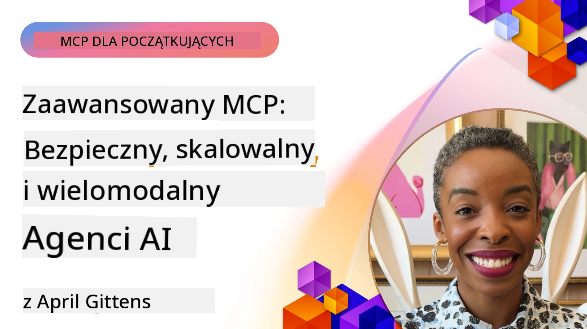

# Zaawansowane tematy w MCP

_(Kliknij powyższy obraz, aby obejrzeć wideo z tej lekcji)_

Ten rozdział omawia szereg zaawansowanych tematów w implementacji Model Context Protocol (MCP), w tym integrację multimodalną, skalowalność, najlepsze praktyki bezpieczeństwa i integrację przedsiębiorstw. Tematy te są kluczowe dla budowania solidnych i gotowych do zastosowań produkcyjnych aplikacji MCP, które mogą sprostać wymaganiom nowoczesnych systemów AI.

## Przegląd

Ta lekcja bada zaawansowane koncepcje implementacji Model Context Protocol, skupiając się na integracji multimodalnej, skalowalności, najlepszych praktykach bezpieczeństwa oraz integracji przedsiębiorstw. Tematy te są niezbędne do budowania aplikacji MCP klasy produkcyjnej, które mogą obsługiwać złożone wymagania w środowiskach korporacyjnych.

> **Uwaga dotycząca obecnej specyfikacji:** MCP `2026-07-28` wycofuje prymitywy Roots i
> Sampling omawiane w lekcjach 5.4 i 5.6. Przenosi również
> eksperymentalną funkcję Tasks, odwołaną w cechach protokołu (5.16), do
> dedykowanego rozszerzenia Tasks. Te lekcje są zachowane dla implementacji
> dziedzicznych `2025-11-25` i zawierają wskazówki dotyczące migracji. Zobacz
> [Co zmieniono w MCP: Specyfikacja 2026-07-28](../01-CoreConcepts/mcp-2026-07-28.md).

## Cele nauki

Po zakończeniu tej lekcji będziesz w stanie:

- Wdrażać możliwości multimodalne w ramach MCP
- Projektować skalowalne architektury MCP na scenariusze o dużym zapotrzebowaniu
- Stosować najlepsze praktyki bezpieczeństwa zgodne z zasadami bezpieczeństwa MCP
- Integrować MCP z systemami i frameworkami AI dla przedsiębiorstw
- Optymalizować wydajność i niezawodność w środowiskach produkcyjnych

## Lekcje i przykładowe projekty

| Link | Tytuł | Opis |
|------|-------|-------------|
| [5.1 Integration with Azure](./mcp-integration/README.md) | Integracja z Azure | Naucz się integrować swój MCP Server na Azure |
| [5.2 Multi modal sample](./mcp-multi-modality/README.md) | Przykłady multimodalne MCP | Przykłady odpowiedzi audio, obrazów oraz multimodalnych |
| [5.3 MCP OAuth2 sample](../../../05-AdvancedTopics/mcp-oauth2-demo) | Demo MCP OAuth2 | Minimalna aplikacja Spring Boot pokazująca OAuth2 z MCP, zarówno jako Authorization, jak i Resource Server. Demonstruje bezpieczne wydawanie tokenów, chronione punkty końcowe, wdrożenie w Azure Container Apps oraz integrację z API Management. |
| [5.4 Root Contexts](./mcp-root-contexts/README.md) | Root contexts | Naucz się dziedzicznego prymitywu Roots `2025-11-25` oraz obecnych opcji migracji (wycofanych w `2026-07-28`) |
| [5.5 Routing](./mcp-routing/README.md) | Routing | Poznaj różne typy routingu |
| [5.6 Sampling](./mcp-sampling/README.md) | Sampling | Naucz się dziedzicznego prymitywu Sampling `2025-11-25` i bieżących opcji migracji (wycofanych w `2026-07-28`) |
| [5.7 Scaling](./mcp-scaling/README.md) | Skalowanie | Dowiedz się o skalowaniu |
| [5.8 Security](./mcp-security/README.md) | Bezpieczeństwo | Zabezpiecz swój MCP Server |
| [5.9 Web Search sample](./web-search-mcp/README.md) | Web Search MCP | Python MCP server i klient integrujący się z SerpAPI dla wyszukiwania sieciowego, wiadomości, produktów i Q&A w czasie rzeczywistym. Demonstruje orkiestrację wielu narzędzi, integrację z zewnętrznymi API oraz solidne obsługiwanie błędów. |
| [5.10 Realtime Streaming](./mcp-realtimestreaming/README.md) | Streaming | Transmisja danych w czasie rzeczywistym stała się niezbędna w dzisiejszym świecie napędzanym danymi, gdzie firmy i aplikacje wymagają natychmiastowego dostępu do informacji, aby podejmować szybkie decyzje. |
| [5.11 Realtime Web Search](./mcp-realtimesearch/README.md) | Wyszukiwanie w czasie rzeczywistym | Jak MCP zmienia wyszukiwanie w sieci w czasie rzeczywistym, oferując ustandaryzowane podejście do zarządzania kontekstem pomiędzy modelami AI, wyszukiwarkami i aplikacjami. |
| [5.12  Entra ID Authentication for Model Context Protocol Servers](./mcp-security-entra/README.md) | Uwierzytelnianie Entra ID | Microsoft Entra ID dostarcza solidne rozwiązanie chmurowe do zarządzania tożsamością i dostępem, pomagając zapewnić, że tylko autoryzowani użytkownicy i aplikacje mogą komunikować się z Twoim serwerem MCP. |
| [5.13 Microsoft Foundry Agent Integration](./mcp-foundry-agent-integration/README.md) | Integracja Microsoft Foundry | Naucz się integrować serwery Model Context Protocol z agentami Microsoft Foundry, umożliwiając potężną orkiestrację narzędzi i możliwości AI przedsiębiorstwa z ustandaryzowanymi połączeniami z zewnętrznymi źródłami danych. |
| [5.14 Context Engineering](./mcp-contextengineering/README.md) | Inżynieria Kontekstów | Przyszłe możliwości technik inżynierii kontekstów dla serwerów MCP, w tym optymalizacja kontekstu, dynamiczne zarządzanie kontekstem oraz strategie efektywnego prompt engineering w ramach MCP. |
| [5.15 MCP Custom Transport](./mcp-transport/README.md) | Niestandardowy transport | Naucz się implementować niestandardowe mechanizmy transportu dla wyspecjalizowanych scenariuszy komunikacji MCP. |
| [5.16 Protocol Features Deep Dive](./mcp-protocol-features/README.md) | Funkcje Protokołu | Opanuj zaawansowane funkcje protokołu, w tym powiadomienia o postępie, anulowanie żądań, szablony zasobów i wzorce obsługi błędów. |
| [5.17 Adversarial Multi-Agent Reasoning](./mcp-adversarial-agents/README.md) | Agenci przeciwni | Użyj dwóch agentów o przeciwnych stanowiskach, dzielących jeden zestaw narzędzi MCP, aby wykrywać halucynacje, wyłaniać przypadki brzegowe i generować lepiej skalibrowane wyniki poprzez ustrukturyzowaną debatę. |

> **Historyczna uwaga z `2025-11-25`:** ta rewizja wprowadziła eksperymentalne
> Tasks i rozszerzyła kilka funkcji protokołu. W `2026-07-28`, Tasks zostały przeniesione do
> oficjalnego rozszerzenia, a Roots stały się przestarzałe. Nie używaj
> statusu funkcji `2025-11-25` jako aktualnych wytycznych; zobacz
> [zmiany w wersji 2026-07-28](https://modelcontextprotocol.io/specification/2026-07-28/changelog).

## Dodatkowe odniesienia

Dla najbardziej aktualnych informacji na temat zaawansowanych tematów MCP, zapoznaj się z:
- [Dokumentacja MCP](https://modelcontextprotocol.io/)
- [Specyfikacja MCP (2026-07-28)](https://modelcontextprotocol.io/specification/2026-07-28/)
- [Repozytorium GitHub](https://github.com/modelcontextprotocol)
- [OWASP MCP Top 10](https://microsoft.github.io/mcp-azure-security-guide/mcp/) - Ryzyka związane z bezpieczeństwem i sposoby ich łagodzenia
- [Warsztat MCP Security Summit (Sherpa)](https://azure-samples.github.io/sherpa/) - Praktyczne szkolenia z bezpieczeństwa

## Kluczowe wnioski

- Implementacje MCP multimodalnego rozszerzają możliwości AI poza przetwarzanie tekstu
- Skalowalność jest istotna dla wdrożeń korporacyjnych i może być realizowana przez skalowanie poziome i pionowe
- Kompleksowe środki bezpieczeństwa chronią dane i zapewniają właściwą kontrolę dostępu
- Integracja z platformami takimi jak Azure OpenAI i Microsoft AI Foundry wzmacnia możliwości MCP
- Zaawansowane implementacje MCP korzystają z optymalizowanych architektur i starannego zarządzania zasobami

## Ćwiczenie

Zaprojektuj implementację MCP klasy korporacyjnej dla konkretnego przypadku użycia:

1. Zidentyfikuj wymagania multimodalne dla swojego przypadku użycia
2. Naszkicuj kontrolę bezpieczeństwa niezbędną do ochrony wrażliwych danych
3. Zaprojektuj skalowalną architekturę, która poradzi sobie z różnym obciążeniem
4. Zaplanuj punkty integracji z systemami AI przedsiębiorstwa
5. Udokumentuj potencjalne wąskie gardła wydajności i strategie ich łagodzenia

## Dodatkowe zasoby

- [Dokumentacja Azure OpenAI](https://learn.microsoft.com/en-us/azure/ai-services/openai/)
- [Dokumentacja Microsoft AI Foundry](https://learn.microsoft.com/en-us/ai-services/)

---

## Co dalej

Przejrzyj lekcje w tym module, zaczynając od: [5.1 Integracja MCP](./mcp-integration/README.md)

Po ukończeniu tego modułu przejdź do: [Moduł 6: Wkłady społeczności](../06-CommunityContributions/README.md)

---

<!-- CO-OP TRANSLATOR DISCLAIMER START -->
**Zastrzeżenie**:
Niniejszy dokument został przetłumaczony za pomocą usługi tłumaczenia AI [Co-op Translator](https://github.com/Azure/co-op-translator). Choć dążymy do dokładności, prosimy pamiętać, że automatyczne tłumaczenia mogą zawierać błędy lub niedokładności. Oryginalny dokument w jego języku źródłowym należy uznawać za autorytatywne źródło. W przypadku informacji krytycznych zalecane jest skorzystanie z profesjonalnego tłumaczenia wykonanego przez człowieka. Nie ponosimy odpowiedzialności za jakiekolwiek nieporozumienia lub błędne interpretacje wynikające z użycia tego tłumaczenia.
<!-- CO-OP TRANSLATOR DISCLAIMER END -->